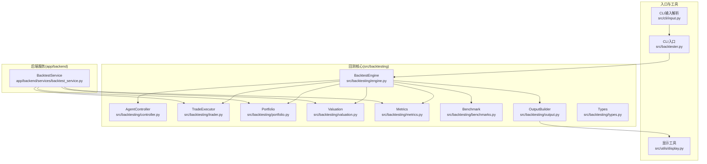
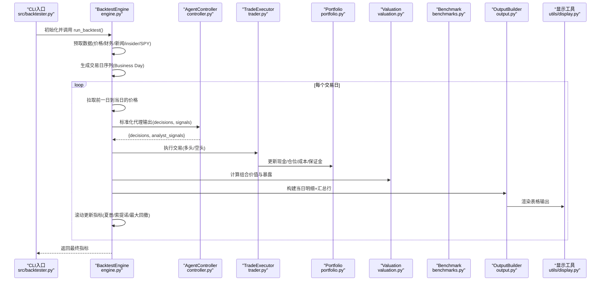
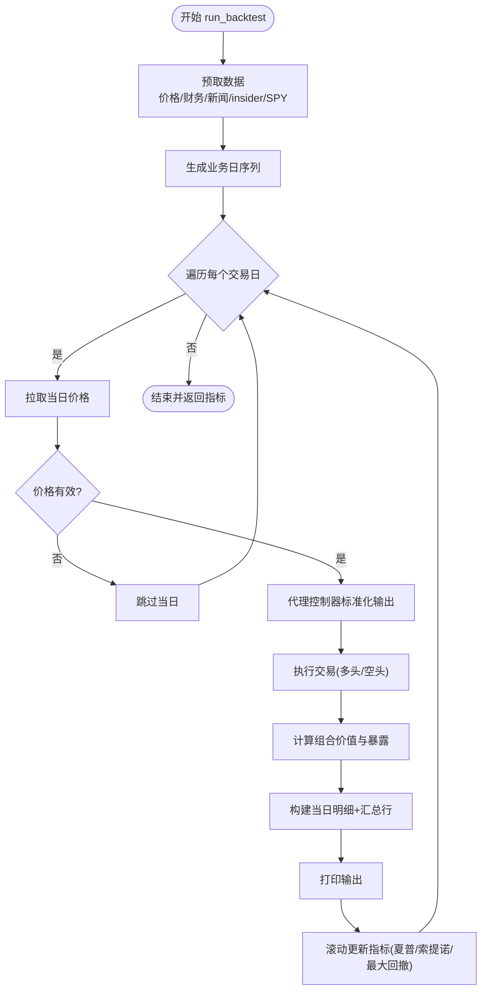
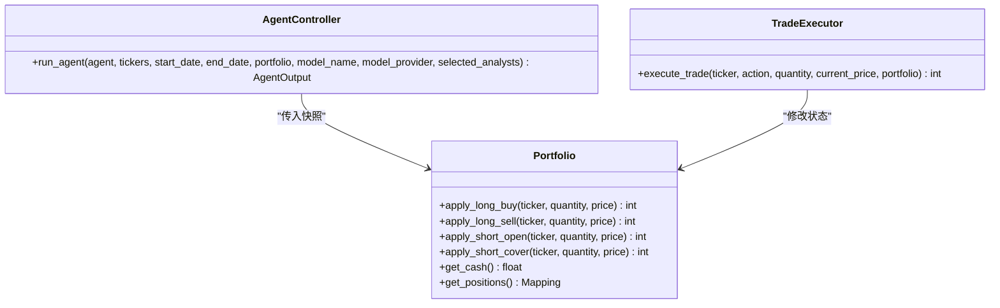
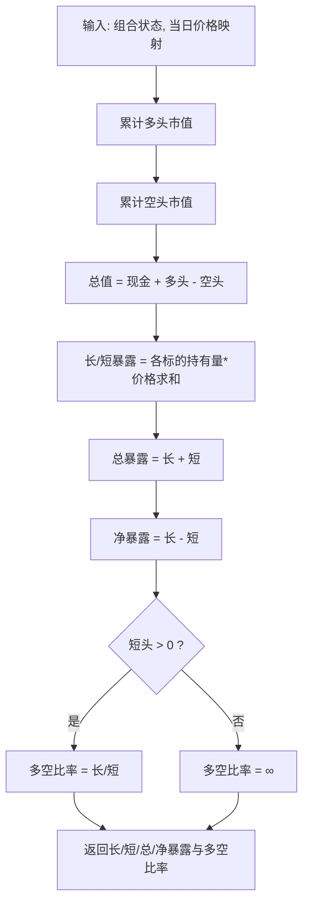
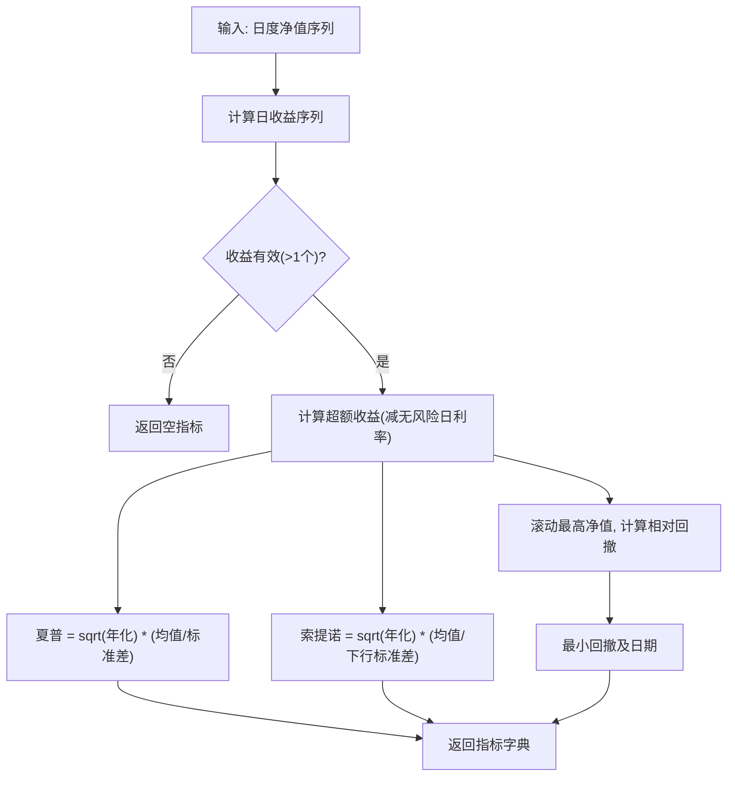
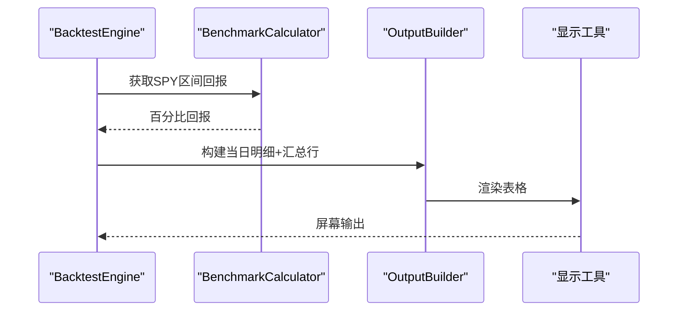
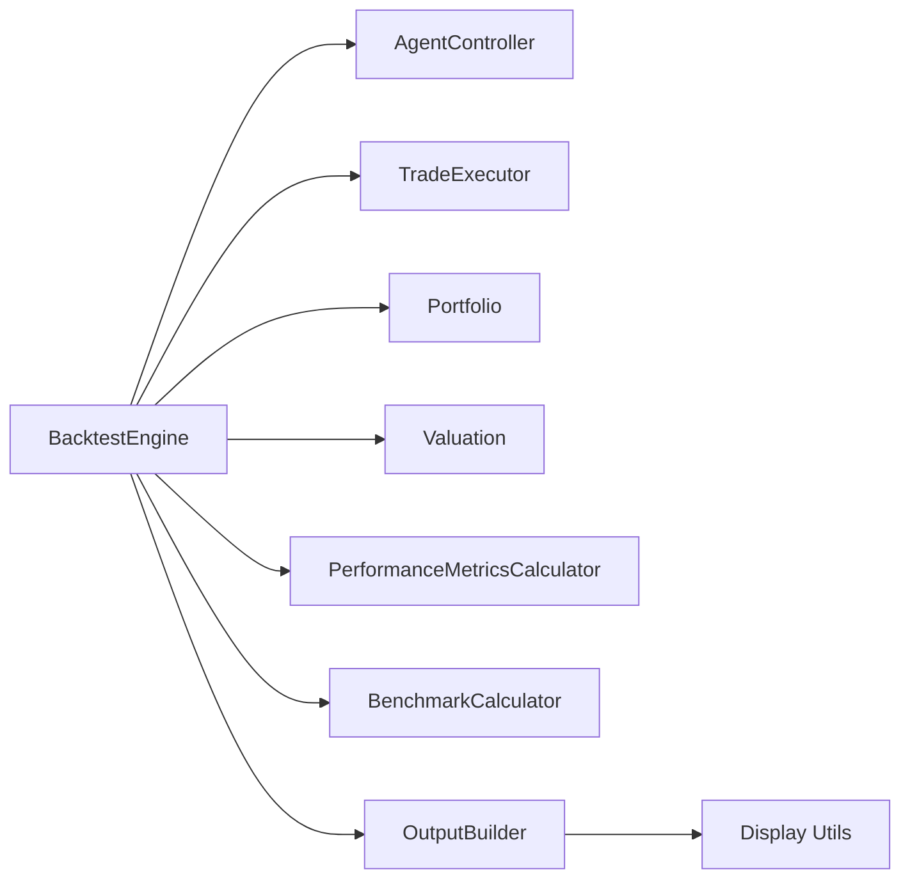

# 回测引擎

<cite>
**本文引用的文件**
- [src/backtesting/engine.py](file://src/backtesting/engine.py)
- [src/backtesting/controller.py](file://src/backtesting/controller.py)
- [src/backtesting/metrics.py](file://src/backtesting/metrics.py)
- [src/backtesting/portfolio.py](file://src/backtesting/portfolio.py)
- [src/backtesting/trader.py](file://src/backtesting/trader.py)
- [src/backtesting/types.py](file://src/backtesting/types.py)
- [src/backtesting/valuation.py](file://src/backtesting/valuation.py)
- [src/backtesting/benchmarks.py](file://src/backtesting/benchmarks.py)
- [src/backtesting/output.py](file://src/backtesting/output.py)
- [src/backtester.py](file://src/backtester.py)
- [src/cli/input.py](file://src/cli/input.py)
- [src/utils/display.py](file://src/utils/display.py)
- [tests/backtesting/test_metrics.py](file://tests/backtesting/test_metrics.py)
- [tests/backtesting/test_execution.py](file://tests/backtesting/test_execution.py)
- [app/backend/services/backtest_service.py](file://app/backend/services/backtest_service.py)
</cite>

## 目录
1. [简介](#简介)
2. [项目结构](#项目结构)
3. [核心组件](#核心组件)
4. [架构总览](#架构总览)
5. [详细组件分析](#详细组件分析)
6. [依赖分析](#依赖分析)
7. [性能考量](#性能考量)
8. [故障排查指南](#故障排查指南)
9. [结论](#结论)
10. [附录](#附录)

## 简介
本技术文档面向回测引擎，系统性阐述其设计原理、执行流程与性能评估机制。回测引擎通过统一调度代理决策、交易执行、组合估值与暴露计算，并在每日循环中产出明细与汇总输出，同时计算夏普比率、索提诺比率与最大回撤等关键指标。文档还覆盖基准测试、结果输出格式、配置选项、参数调优与性能优化策略，帮助用户完成从数据准备到结果分析的全链路工作流。

## 项目结构
回测相关代码主要位于 src/backtesting 子目录，配合 CLI 输入解析、显示工具与后端服务实现同步/异步回测运行。核心模块职责如下：
- engine.py：回测主引擎，协调数据预取、逐日循环、交易执行、估值与指标计算
- controller.py：代理控制器，标准化代理输出（动作与数量）
- trader.py：交易执行器，支持多头买入/卖出与空头开仓/平仓
- portfolio.py：组合状态管理，含现金、持仓、保证金与已实现损益
- valuation.py：组合价值与暴露计算
- metrics.py：收益与风险指标计算
- benchmarks.py：基准回报计算（如SPY）
- output.py：每日行构建与打印
- types.py：类型定义与字典结构
- backtester.py：CLI入口与键盘中断处理
- cli/input.py：命令行参数解析与模型选择
- utils/display.py：表格化输出与颜色渲染
- tests/backtesting：单元测试覆盖指标与执行逻辑
- app/backend/services/backtest_service.py：后端服务版本（同步/异步）与进度回调

**图示来源**
- [src/backtesting/engine.py:1-195](file://src/backtesting/engine.py#L1-L195)
- [src/backtesting/controller.py:1-68](file://src/backtesting/controller.py#L1-L68)
- [src/backtesting/trader.py:1-40](file://src/backtesting/trader.py#L1-L40)
- [src/backtesting/portfolio.py:1-196](file://src/backtesting/portfolio.py#L1-L196)
- [src/backtesting/valuation.py:1-83](file://src/backtesting/valuation.py#L1-L83)
- [src/backtesting/metrics.py:1-78](file://src/backtesting/metrics.py#L1-L78)
- [src/backtesting/benchmarks.py:1-33](file://src/backtesting/benchmarks.py#L1-L33)
- [src/backtesting/output.py:1-99](file://src/backtesting/output.py#L1-L99)
- [src/backtesting/types.py:1-106](file://src/backtesting/types.py#L1-L106)
- [src/backtester.py:1-67](file://src/backtester.py#L1-L67)
- [src/cli/input.py:1-289](file://src/cli/input.py#L1-L289)
- [src/utils/display.py:1-396](file://src/utils/display.py#L1-L396)
- [app/backend/services/backtest_service.py:1-539](file://app/backend/services/backtest_service.py#L1-L539)

**章节来源**
- [src/backtesting/engine.py:1-195](file://src/backtesting/engine.py#L1-L195)
- [src/backtesting/controller.py:1-68](file://src/backtesting/controller.py#L1-L68)
- [src/backtesting/trader.py:1-40](file://src/backtesting/trader.py#L1-L40)
- [src/backtesting/portfolio.py:1-196](file://src/backtesting/portfolio.py#L1-L196)
- [src/backtesting/valuation.py:1-83](file://src/backtesting/valuation.py#L1-L83)
- [src/backtesting/metrics.py:1-78](file://src/backtesting/metrics.py#L1-L78)
- [src/backtesting/benchmarks.py:1-33](file://src/backtesting/benchmarks.py#L1-L33)
- [src/backtesting/output.py:1-99](file://src/backtesting/output.py#L1-L99)
- [src/backtesting/types.py:1-106](file://src/backtesting/types.py#L1-L106)
- [src/backtester.py:1-67](file://src/backtester.py#L1-L67)
- [src/cli/input.py:1-289](file://src/cli/input.py#L1-L289)
- [src/utils/display.py:1-396](file://src/utils/display.py#L1-L396)
- [app/backend/services/backtest_service.py:1-539](file://app/backend/services/backtest_service.py#L1-L539)

## 核心组件
- BacktestEngine：回测编排器，负责数据预取、逐日循环、代理决策、交易执行、组合估值与暴露计算、指标更新与输出构建
- AgentController：标准化代理输出，确保动作与数量类型一致
- TradeExecutor：根据动作执行交易，支持多头/空头操作
- Portfolio：组合状态容器，维护现金、多头/空头仓位、成本与已实现损益、保证金占用
- Valuation：计算组合总值与长/短暴露、净/总暴露、多空比率
- PerformanceMetricsCalculator：计算夏普/索提诺比率与最大回撤
- BenchmarkCalculator：基准回报（如SPY）计算
- OutputBuilder：按日构建明细与汇总行，交由显示工具渲染
- 类型系统：统一决策、组合快照、指标与数值点结构

**章节来源**
- [src/backtesting/engine.py:27-195](file://src/backtesting/engine.py#L27-L195)
- [src/backtesting/controller.py:9-68](file://src/backtesting/controller.py#L9-L68)
- [src/backtesting/trader.py:7-40](file://src/backtesting/trader.py#L7-L40)
- [src/backtesting/portfolio.py:9-196](file://src/backtesting/portfolio.py#L9-L196)
- [src/backtesting/valuation.py:8-83](file://src/backtesting/valuation.py#L8-L83)
- [src/backtesting/metrics.py:8-78](file://src/backtesting/metrics.py#L8-L78)
- [src/backtesting/benchmarks.py:8-33](file://src/backtesting/benchmarks.py#L8-L33)
- [src/backtesting/output.py:11-99](file://src/backtesting/output.py#L11-L99)
- [src/backtesting/types.py:10-106](file://src/backtesting/types.py#L10-L106)

## 架构总览
回测引擎采用“控制器-执行器-估值-指标-输出”的分层协作模式。引擎在每个交易日拉取所需价格与基本面/新闻/ insider 数据，调用代理控制器获取标准化决策，执行交易并更新组合状态，计算组合价值与暴露，构建当日明细与汇总行，最后滚动更新收益与风险指标。

**图示来源**
- [src/backtester.py:13-67](file://src/backtester.py#L13-L67)
- [src/backtesting/engine.py:96-195](file://src/backtesting/engine.py#L96-L195)
- [src/backtesting/controller.py:12-65](file://src/backtesting/controller.py#L12-L65)
- [src/backtesting/trader.py:10-37](file://src/backtesting/trader.py#L10-L37)
- [src/backtesting/portfolio.py:82-195](file://src/backtesting/portfolio.py#L82-L195)
- [src/backtesting/valuation.py:8-51](file://src/backtesting/valuation.py#L8-L51)
- [src/backtesting/output.py:20-96](file://src/backtesting/output.py#L20-L96)
- [src/utils/display.py:257-396](file://src/utils/display.py#L257-L396)

## 详细组件分析

### BacktestEngine 工作流
- 数据预取：向前扩展一年窗口，批量拉取标的与SPY价格、财务指标、insider交易与公司新闻
- 日历循环：基于业务日序列遍历，构造回看窗口与当前日期，跳过无效区间
- 价格获取：逐日拉取前一交易日到当日的收盘价，缺失则跳过当日
- 代理决策：调用控制器标准化输出，确保动作枚举与数量数值化
- 交易执行：按决策执行买卖/开仓/平仓，返回实际成交数量
- 组合估值与暴露：计算总价值与长/短暴露、净/总暴露、多空比率
- 输出构建：构建当日明细与汇总行，打印最新汇总与完整表格
- 指标更新：滚动计算夏普/索提诺/最大回撤，保留最新日期与指标

**图示来源**
- [src/backtesting/engine.py:96-195](file://src/backtesting/engine.py#L96-L195)

**章节来源**
- [src/backtesting/engine.py:81-195](file://src/backtesting/engine.py#L81-L195)

### 代理控制器与交易执行
- 控制器将代理输出规范化为标准决策字典，动作强制枚举化，数量转浮点数
- 执行器根据动作路由至组合状态的对应方法，执行买入/卖出/开空/平多
- 执行器对未知动作或非正数量进行安全守卫，避免异常

**图示来源**
- [src/backtesting/controller.py:12-65](file://src/backtesting/controller.py#L12-L65)
- [src/backtesting/trader.py:10-37](file://src/backtesting/trader.py#L10-L37)
- [src/backtesting/portfolio.py:82-195](file://src/backtesting/portfolio.py#L82-L195)

**章节来源**
- [src/backtesting/controller.py:9-68](file://src/backtesting/controller.py#L9-L68)
- [src/backtesting/trader.py:7-40](file://src/backtesting/trader.py#L7-L40)
- [src/backtesting/portfolio.py:9-196](file://src/backtesting/portfolio.py#L9-L196)
- [tests/backtesting/test_execution.py:4-28](file://tests/backtesting/test_execution.py#L4-L28)

### 组合估值与暴露计算
- 组合总值 = 现金 + 多头市值 - 空头市值
- 暴露计算：长/短暴露、总/净暴露、多空比率；空头为零时多空比设为无穷
- 汇总字段：总值、回报百分比、现金余额、总仓位价值、指标字段

**图示来源**
- [src/backtesting/valuation.py:8-51](file://src/backtesting/valuation.py#L8-L51)
- [src/backtesting/portfolio.py:13-196](file://src/backtesting/portfolio.py#L13-L196)

**章节来源**
- [src/backtesting/valuation.py:8-83](file://src/backtesting/valuation.py#L8-L83)
- [src/backtesting/portfolio.py:9-196](file://src/backtesting/portfolio.py#L9-L196)

### 性能指标计算
- 基于日度组合净值序列计算日收益，剔除空值后进行统计
- 夏普比率：年化超额收益/年化波动率
- 索提诺比率：年化超额收益/下行波动（仅负偏差）
- 最大回撤：净值相对于滚动最高点的相对回撤，记录最低点日期
- 年化交易日与无风险利率可配置，默认年化252天与固定无风险利率

**图示来源**
- [src/backtesting/metrics.py:22-75](file://src/backtesting/metrics.py#L22-L75)

**章节来源**
- [src/backtesting/metrics.py:8-78](file://src/backtesting/metrics.py#L8-L78)
- [tests/backtesting/test_metrics.py:24-53](file://tests/backtesting/test_metrics.py#L24-L53)

### 基准测试与结果输出
- 基准回报：使用SPY在起止日期间的简单持有一年策略回报
- 输出格式：每行包含日期、标的、动作、数量、价格、多/空股数、持仓净值；汇总行包含总值、回报、指标与基准回报
- 显示工具：彩色表格渲染，支持滚动查看最新汇总与完整明细

**图示来源**
- [src/backtesting/engine.py:176-181](file://src/backtesting/engine.py#L176-L181)
- [src/backtesting/benchmarks.py:9-31](file://src/backtesting/benchmarks.py#L9-L31)
- [src/backtesting/output.py:20-96](file://src/backtesting/output.py#L20-L96)
- [src/utils/display.py:257-396](file://src/utils/display.py#L257-L396)

**章节来源**
- [src/backtesting/benchmarks.py:8-33](file://src/backtesting/benchmarks.py#L8-L33)
- [src/backtesting/output.py:11-99](file://src/backtesting/output.py#L11-L99)
- [src/utils/display.py:257-396](file://src/utils/display.py#L257-L396)

### 后端服务版本（同步/异步）
- 支持同步与异步两种运行方式，异步版本提供进度回调与中间结果推送
- 与前端图谱/LLM集成，按日运行图谱生成决策，执行交易并累积结果
- 提供分析接口导出每日回报与额外指标

**章节来源**
- [app/backend/services/backtest_service.py:285-539](file://app/backend/services/backtest_service.py#L285-L539)

## 依赖分析
- 组件内聚高，耦合主要体现在引擎对控制器、执行器、估值、指标与输出的顺序依赖
- 类型系统统一了决策、组合快照与指标结构，便于跨模块传递
- 异常处理集中在价格缺失与键盘中断场景，保证稳健性
- 与外部API交互集中在数据预取与价格查询处，建议增加重试与缓存策略

**图示来源**
- [src/backtesting/engine.py:96-195](file://src/backtesting/engine.py#L96-L195)
- [src/backtesting/output.py:20-96](file://src/backtesting/output.py#L20-L96)
- [src/utils/display.py:257-396](file://src/utils/display.py#L257-L396)

**章节来源**
- [src/backtesting/engine.py:96-195](file://src/backtesting/engine.py#L96-L195)
- [src/backtesting/output.py:11-99](file://src/backtesting/output.py#L11-L99)

## 性能考量
- 时间复杂度
  - 日循环：O(D)，D为交易日数量
  - 每日计算：O(N)，N为标的数（估值与暴露）
  - 指标计算：O(D)滚动，整体近似O(D^2)（若每次重算），可通过增量更新优化
- 空间复杂度
  - 组合值序列与中间行列表：O(D)
  - 指标字典：O(1)
- 优化建议
  - 指标滚动更新：维护均值/方差增量，避免每次重建DataFrame
  - 数据预取与缓存：减少重复API调用，提高冷启动效率
  - 并发与限速：在价格/财务/新闻API上引入并发与速率限制
  - 输出批处理：批量打印减少I/O开销

[本节为通用性能讨论，不直接分析具体文件]

## 故障排查指南
- 键盘中断
  - CLI入口捕获中断，尝试输出部分结果（初始/末尾净值与总回报）
- 价格缺失
  - 若某日任一标的缺失或查询异常，跳过该日，不影响后续循环
- 动作/数量异常
  - 控制器将未知动作归一为持有，数量非正视为0
  - 执行器对未知动作与非正数量返回0，避免状态异常
- 指标为空
  - 收益序列不足或为空时，指标返回None占位，等待更多数据

**章节来源**
- [src/backtester.py:13-40](file://src/backtester.py#L13-L40)
- [src/backtesting/engine.py:114-131](file://src/backtesting/engine.py#L114-L131)
- [src/backtesting/controller.py:40-65](file://src/backtesting/controller.py#L40-L65)
- [src/backtesting/trader.py:18-37](file://src/backtesting/trader.py#L18-L37)
- [src/backtesting/metrics.py:26-37](file://src/backtesting/metrics.py#L26-L37)

## 结论
回测引擎以清晰的分层设计实现了从数据到决策再到执行与评估的闭环。通过标准化代理输出、严格的交易执行与稳健的异常处理，系统能够在不同市场环境下稳定运行。建议在指标计算与数据访问层面引入增量更新与缓存策略，以进一步提升性能与用户体验。

[本节为总结性内容，不直接分析具体文件]

## 附录

### 回测配置选项与参数调优
- CLI参数
  - 股票池：--tickers（逗号分隔）
  - 分析师：--analysts 或 --analysts-all
  - 模型：--model 或交互式选择；--ollama 使用本地推理
  - 日期：--start-date/--end-date 或默认回看月份
  - 资金：--initial-cash/--initial-capital（默认10万）
  - 保证金：--margin-requirement（默认0）
- 参数调优建议
  - 初始资金：根据策略波动率与滑点设定，避免过小导致频繁满仓
  - 保证金比例：空头策略需合理设置，防止爆仓
  - 回看窗口：代理输入的回看期影响信号稳定性，建议结合样本外验证
  - 交易频率：降低换手可减少交易成本与冲击成本

**章节来源**
- [src/cli/input.py:227-289](file://src/cli/input.py#L227-L289)
- [src/backtester.py:44-67](file://src/backtester.py#L44-L67)

### 回测数据准备与异常处理
- 数据准备
  - 预取一年窗口内的价格、财务、新闻与insider数据，确保回测期内可用
  - 基准对比使用SPY，确保起止日期一致
- 异常处理
  - 价格缺失：跳过当日，继续后续日期
  - 键盘中断：输出部分结果摘要
  - 动作/数量异常：安全降级为持有或0成交量

**章节来源**
- [src/backtesting/engine.py:81-94](file://src/backtesting/engine.py#L81-L94)
- [src/backtesting/engine.py:114-131](file://src/backtesting/engine.py#L114-L131)
- [src/backtester.py:19-40](file://src/backtester.py#L19-L40)

### 关键性能指标说明
- 夏普比率：衡量单位总风险的超额收益，数值越高代表风险调整后收益越好
- 索提诺比率：仅考虑下行风险，更关注损失控制
- 最大回撤：净值从峰值到谷底的最大相对跌幅，越小越好

**章节来源**
- [src/backtesting/metrics.py:44-75](file://src/backtesting/metrics.py#L44-L75)