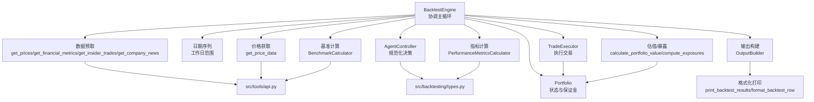
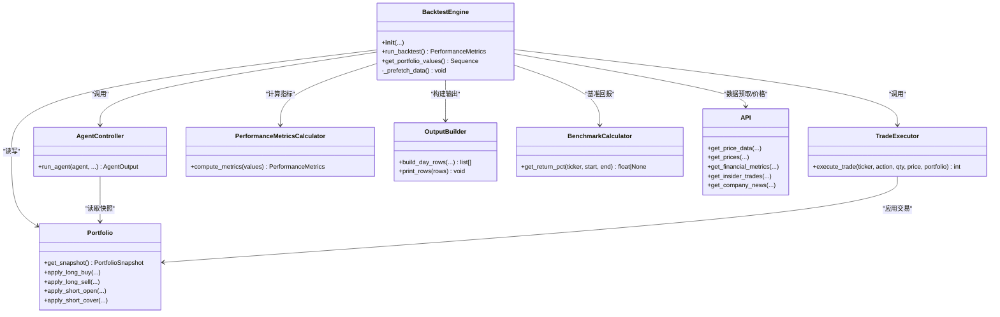
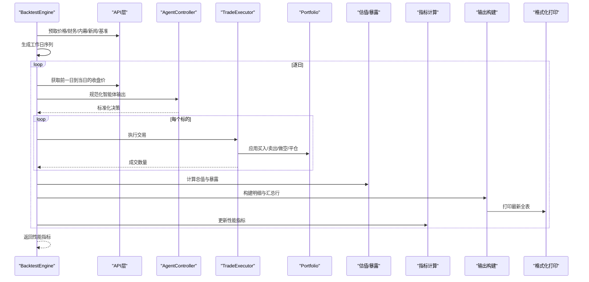
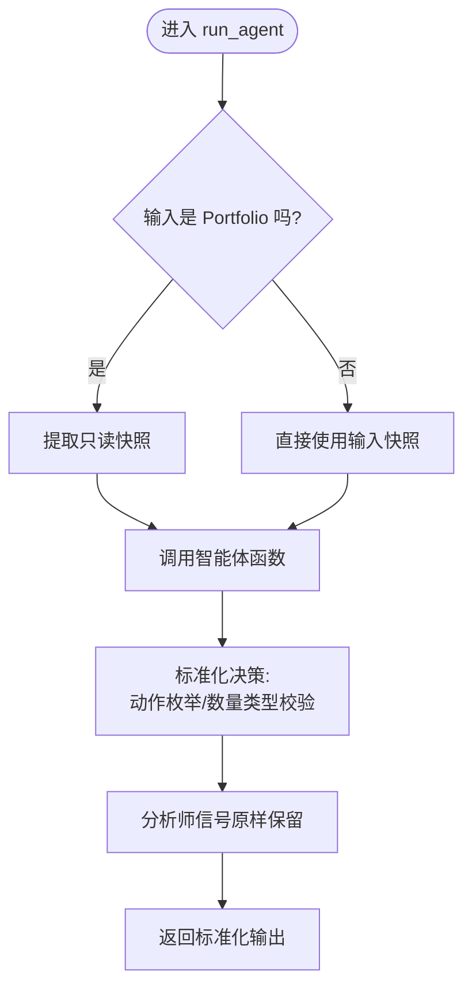
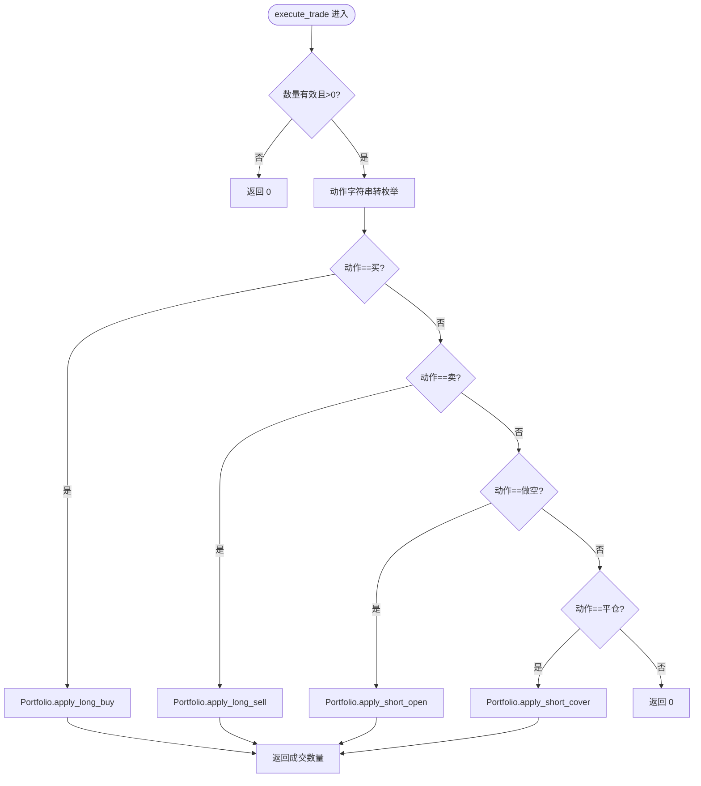
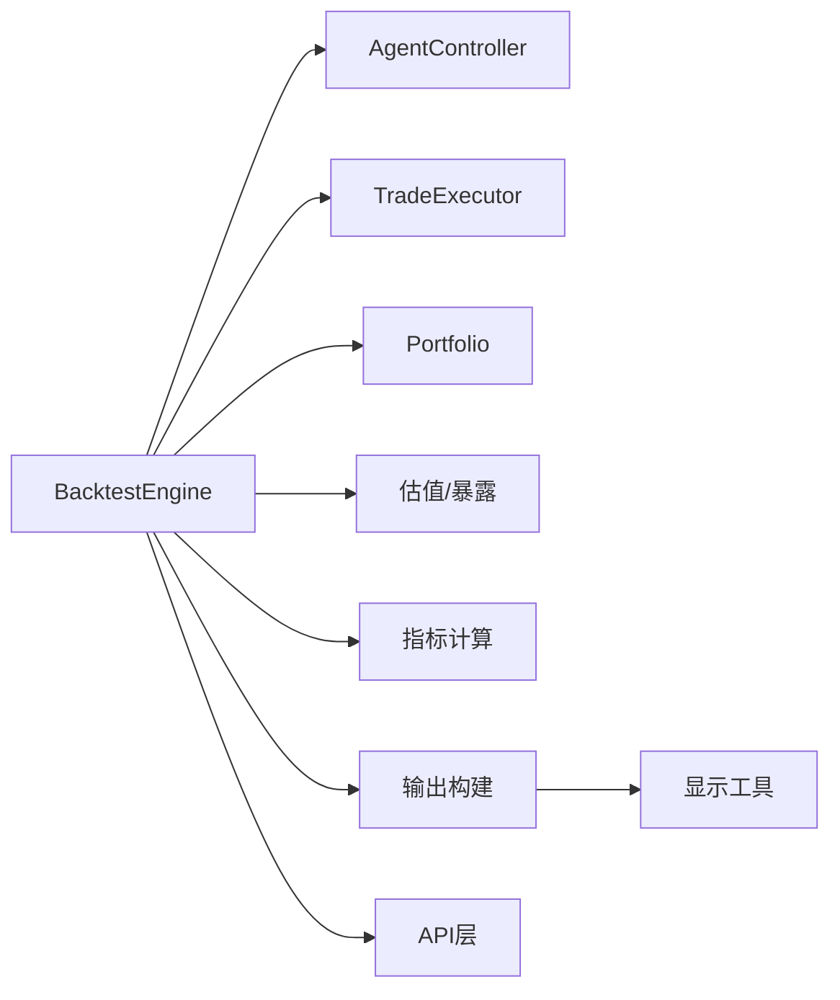

# 回测引擎核心

<cite>
**本文引用的文件**
- [engine.py](file://src/backtesting/engine.py)
- [controller.py](file://src/backtesting/controller.py)
- [trader.py](file://src/backtesting/trader.py)
- [portfolio.py](file://src/backtesting/portfolio.py)
- [types.py](file://src/backtesting/types.py)
- [metrics.py](file://src/backtesting/metrics.py)
- [output.py](file://src/backtesting/output.py)
- [benchmarks.py](file://src/backtesting/benchmarks.py)
- [valuation.py](file://src/backtesting/valuation.py)
- [api.py](file://src/tools/api.py)
- [display.py](file://src/utils/display.py)
- [backtester.py](file://src/backtester.py)
- [test_controller.py](file://tests/backtesting/test_controller.py)
- [test_execution.py](file://tests/backtesting/test_execution.py)
</cite>

## 目录
1. [引言](#引言)
2. [项目结构](#项目结构)
3. [核心组件](#核心组件)
4. [架构总览](#架构总览)
5. [详细组件分析](#详细组件分析)
6. [依赖分析](#依赖分析)
7. [性能考虑](#性能考虑)
8. [故障排查指南](#故障排查指南)
9. [结论](#结论)
10. [附录：使用示例与最佳实践](#附录使用示例与最佳实践)

## 引言
本文件聚焦于回测引擎核心组件，系统性解析 BacktestEngine 的设计与执行流程，涵盖初始化参数、数据预取机制、主循环逻辑；详解 AgentController 如何规范化并调度智能体决策，TradeExecutor 如何执行交易指令；阐述引擎的核心算法（日期遍历、价格获取、交易执行、状态更新）；并提供配置选项、性能优化策略与错误处理机制。文末附带可直接定位到源码路径的“使用示例”与“最佳实践”，帮助快速上手。

## 项目结构
回测子系统位于 src/backtesting 目录，围绕 BacktestEngine 协调多个职责模块：
- 数据层：通过 src/tools/api.py 提供价格、财务指标、内幕交易、新闻等数据接口，并内置缓存与限流重试。
- 状态管理：Portfolio 维护现金、头寸、保证金占用与已实现损益。
- 决策编排：AgentController 规范化智能体输出，确保与历史接口兼容。
- 执行器：TradeExecutor 将动作映射到 Portfolio 的买入/卖出/做空/平仓操作。
- 估值与暴露：valuation.py 计算组合总值与多空暴露、净暴露、总暴露与多空比率。
- 指标计算：metrics.py 基于净值曲线计算夏普、索提诺与最大回撤。
- 输出构建：output.py 聚合每日明细与汇总行，交由 display.py 格式化打印。
- 基准比较：benchmarks.py 计算基准（如 SPY）简单持有收益。

图表来源
- [engine.py:96-189](file://src/backtesting/engine.py#L96-L189)
- [controller.py:12-65](file://src/backtesting/controller.py#L12-L65)
- [trader.py:10-37](file://src/backtesting/trader.py#L10-L37)
- [portfolio.py:82-194](file://src/backtesting/portfolio.py#L82-L194)
- [valuation.py:8-50](file://src/backtesting/valuation.py#L8-L50)
- [metrics.py:22-75](file://src/backtesting/metrics.py#L22-L75)
- [output.py:20-93](file://src/backtesting/output.py#L20-L93)
- [benchmarks.py:9-30](file://src/backtesting/benchmarks.py#L9-L30)
- [api.py:63-366](file://src/tools/api.py#L63-L366)
- [display.py:257-396](file://src/utils/display.py#L257-L396)

章节来源
- [engine.py:27-195](file://src/backtesting/engine.py#L27-L195)
- [api.py:18-24](file://src/tools/api.py#L18-L24)

## 核心组件
- BacktestEngine：回测主控制器，负责初始化、数据预取、日期遍历、价格获取、决策与执行、估值与暴露、指标计算、输出构建与打印。
- AgentController：接收智能体函数，规范化其输出（动作枚举、数量类型），并注入投资组合快照。
- TradeExecutor：将动作字符串安全转换为枚举，路由到 Portfolio 的具体交易方法。
- Portfolio：维护现金、多/空头寸、成本均价、保证金占用与已实现损益，支持长/短交易与保证金约束。
- PerformanceMetricsCalculator：基于净值曲线计算夏普、索提诺与最大回撤。
- OutputBuilder：聚合每日明细与汇总行，调用格式化工具打印。
- BenchmarkCalculator：计算基准（如 SPY）简单持有回报率。
- 工具与接口：src/tools/api.py 提供价格、财务、新闻、内幕交易数据获取与缓存；src/utils/display.py 提供表格化输出。

章节来源
- [engine.py:27-195](file://src/backtesting/engine.py#L27-L195)
- [controller.py:9-68](file://src/backtesting/controller.py#L9-L68)
- [trader.py:7-40](file://src/backtesting/trader.py#L7-L40)
- [portfolio.py:9-196](file://src/backtesting/portfolio.py#L9-L196)
- [metrics.py:8-78](file://src/backtesting/metrics.py#L8-L78)
- [output.py:11-99](file://src/backtesting/output.py#L11-L99)
- [benchmarks.py:8-33](file://src/backtesting/benchmarks.py#L8-L33)
- [types.py:10-106](file://src/backtesting/types.py#L10-L106)
- [api.py:63-366](file://src/tools/api.py#L63-L366)
- [display.py:257-396](file://src/utils/display.py#L257-L396)

## 架构总览
回测引擎采用“分层解耦 + 可替换”的设计：Engine 作为编排者，各模块职责清晰，便于替换或扩展。数据访问统一经由 API 层，状态变更集中在 Portfolio，指标与输出通过纯函数模块计算与渲染。

图表来源
- [engine.py:35-195](file://src/backtesting/engine.py#L35-L195)
- [controller.py:12-65](file://src/backtesting/controller.py#L12-L65)
- [trader.py:10-37](file://src/backtesting/trader.py#L10-L37)
- [portfolio.py:44-194](file://src/backtesting/portfolio.py#L44-L194)
- [metrics.py:22-75](file://src/backtesting/metrics.py#L22-L75)
- [output.py:20-93](file://src/backtesting/output.py#L20-L93)
- [benchmarks.py:9-30](file://src/backtesting/benchmarks.py#L9-L30)
- [api.py:63-366](file://src/tools/api.py#L63-L366)

## 详细组件分析

### BacktestEngine 设计与执行流程
- 初始化参数
  - 关键入参：agent、tickers、start_date、end_date、initial_capital、model_name、model_provider、selected_analysts、initial_margin_requirement。
  - 内部状态：Portfolio、TradeExecutor、AgentController、PerformanceMetricsCalculator、OutputBuilder、BenchmarkCalculator、净值序列与表格行、性能指标字典。
- 数据预取机制
  - 预取过去一年的价格、财务指标、内幕交易、公司新闻；同时预取基准 SPY 价格，用于后续基准回报计算。
  - 预取失败或为空时，主循环会跳过该日期，保证稳健性。
- 主循环逻辑
  - 生成工作日日期序列；若为空则返回空结果。
  - 对每个日期：
    - 计算回看窗口起始日期与前一日日期；若回看起始等于当前日期则跳过。
    - 获取前一日到当日的收盘价映射；任一标的缺失则跳过该日期。
    - 调用 AgentController.run_agent 获取标准化后的决策。
    - 遍历标的，按决策执行交易，记录已成交数量。
    - 计算组合总值与暴露，追加净值点。
    - 构建当日明细与汇总行，打印最新全量结果。
    - 当序列长度足够时，计算并更新性能指标。
  - 返回最终性能指标。

图表来源
- [engine.py:96-189](file://src/backtesting/engine.py#L96-L189)
- [controller.py:12-65](file://src/backtesting/controller.py#L12-L65)
- [trader.py:10-37](file://src/backtesting/trader.py#L10-L37)
- [portfolio.py:82-194](file://src/backtesting/portfolio.py#L82-L194)
- [valuation.py:8-50](file://src/backtesting/valuation.py#L8-L50)
- [metrics.py:22-75](file://src/backtesting/metrics.py#L22-L75)
- [output.py:20-93](file://src/backtesting/output.py#L20-L93)
- [display.py:257-396](file://src/utils/display.py#L257-L396)

章节来源
- [engine.py:35-195](file://src/backtesting/engine.py#L35-L195)

### AgentController：智能体决策规范化与快照注入
- 输入：智能体函数、标的列表、时间窗口、投资组合对象或快照、模型信息、分析师选择。
- 规范化策略：
  - 将输出中的决策字典标准化为固定键结构，缺失键默认为“持有/0”。
  - 动作字符串强制转换为枚举值，非法动作归一为“持有”。
  - 数量字段转为浮点数，异常则置为0。
- 快照注入：若传入的是 Portfolio 实例，则提取只读快照以保持历史兼容性。
- 输出：标准化后的决策与原样保留的分析师信号。

图表来源
- [controller.py:12-65](file://src/backtesting/controller.py#L12-L65)
- [types.py:10-72](file://src/backtesting/types.py#L10-L72)

章节来源
- [controller.py:9-68](file://src/backtesting/controller.py#L9-L68)
- [types.py:10-72](file://src/backtesting/types.py#L10-L72)

### TradeExecutor：交易执行与动作路由
- 输入：标的、动作（字符串或枚举）、数量、当前价格、投资组合。
- 安全校验：数量非正或无效时直接返回0。
- 动作路由：
  - “买”：调用 Portfolio.apply_long_buy。
  - “卖”：调用 Portfolio.apply_long_sell。
  - “做空”：调用 Portfolio.apply_short_open。
  - “平仓”：调用 Portfolio.apply_short_cover。
  - 其他或未知：返回0。
- 返回：实际成交数量（整数）。

图表来源
- [trader.py:10-37](file://src/backtesting/trader.py#L10-L37)
- [portfolio.py:82-194](file://src/backtesting/portfolio.py#L82-L194)

章节来源
- [trader.py:7-40](file://src/backtesting/trader.py#L7-L40)
- [portfolio.py:82-194](file://src/backtesting/portfolio.py#L82-L194)

### Portfolio：状态管理与保证金约束
- 现金、多/空头寸、成本均价、短期保证金占用与已实现损益。
- 支持的操作：
  - 多头买入：检查现金是否足以覆盖成本，必要时按最大可购份额成交。
  - 多头卖出：按平均成本计算已实现损益，减少头寸并增加现金。
  - 做空开仓：按保证金比例扣减可用现金，累加保证金占用。
  - 做空平仓：按平仓数量占原始做空比例释放保证金，计算已实现损益。
- 查询接口：提供只读视图（MappingProxyType）以避免外部修改。

章节来源
- [portfolio.py:9-196](file://src/backtesting/portfolio.py#L9-L196)

### 估值与暴露计算
- 总值 = 现金 + 多头市值 - 空头市值。
- 暴露计算：
  - 多头暴露 = Σ(多头股数 × 价格)
  - 空头暴露 = Σ(空头股数 × 价格)
  - 总暴露 = 多头暴露 + 空头暴露
  - 净暴露 = 多头暴露 - 空头暴露
  - 多空比率 = 多头暴露 / 空头暴露（空头暴露≈0时为无穷大）

章节来源
- [valuation.py:8-50](file://src/backtesting/valuation.py#L8-L50)

### 性能指标计算
- 基于净值曲线计算日收益率，剔除首日空缺后进行统计。
- 夏普比率：年化超额收益 / 年化波动。
- 索提诺比率：年化超额收益 / 下行偏差。
- 最大回撤：净值相对于滚动高点的最大跌幅及发生日期。
- 默认年化交易日为252，无风险利率按年化设定。

章节来源
- [metrics.py:8-78](file://src/backtesting/metrics.py#L8-L78)

### 输出构建与打印
- 每日明细：逐标的生成一行，包含日期、标的、动作、成交量、价格、多/空股数、头寸价值。
- 汇总行：包含总值、回报率、现金余额、总头寸价值、夏普、索提诺、最大回撤、基准回报。
- 打印：清屏并打印最新汇总与完整明细表。

章节来源
- [output.py:11-99](file://src/backtesting/output.py#L11-L99)
- [display.py:257-396](file://src/utils/display.py#L257-L396)

### 基准回报计算
- 通过基准标的（如 SPY）在起止日期间的简单持有回报率（最后收盘价/初始收盘价 - 1）计算。

章节来源
- [benchmarks.py:8-33](file://src/backtesting/benchmarks.py#L8-L33)

## 依赖分析
- 组件内聚与耦合
  - BacktestEngine 与各模块松耦合：通过明确接口交互，便于替换或扩展。
  - AgentController 与 Portfolio 仅通过快照交互，避免直接修改内部状态。
  - TradeExecutor 与 Portfolio 为直接依赖，但职责单一，易于测试。
- 外部依赖
  - 数据访问统一走 API 层，具备缓存与限流重试能力。
  - 输出依赖显示工具，便于替换不同渲染方式。
- 循环依赖
  - 未发现循环导入；模块间单向依赖清晰。

图表来源
- [engine.py:96-189](file://src/backtesting/engine.py#L96-L189)
- [controller.py:12-65](file://src/backtesting/controller.py#L12-L65)
- [trader.py:10-37](file://src/backtesting/trader.py#L10-L37)
- [portfolio.py:44-194](file://src/backtesting/portfolio.py#L44-L194)
- [valuation.py:8-50](file://src/backtesting/valuation.py#L8-L50)
- [metrics.py:22-75](file://src/backtesting/metrics.py#L22-L75)
- [output.py:20-93](file://src/backtesting/output.py#L20-L93)
- [display.py:257-396](file://src/utils/display.py#L257-L396)
- [api.py:63-366](file://src/tools/api.py#L63-L366)

## 性能考虑
- 数据预取
  - 预取过去一年的数据，减少主循环中重复请求，提升整体吞吐。
  - 缓存命中优先，API 层具备限流与重试，降低网络抖动影响。
- 日期遍历
  - 使用工作日范围，避免周末与节假日无效计算。
  - 若某日缺失数据则跳过，避免阻塞整个回测。
- 交易执行
  - 执行器对数量与动作进行严格校验，减少无效调用。
  - Portfolio 的买卖/做空/平仓均考虑保证金与现金约束，避免超买。
- 指标计算
  - 指标计算基于已有净值序列增量更新，避免重复全量计算。
- I/O 与打印
  - 输出一次性构建全量行并打印，减少多次 I/O。

[本节为通用性能建议，不直接分析具体文件]

## 故障排查指南
- 日期缺失导致跳过
  - 现象：某日未出现明细。
  - 原因：前一日到当日价格为空或异常。
  - 排查：确认 API 层数据获取与缓存状态。
- 动作/数量异常
  - 现象：成交数量为0。
  - 原因：数量非正、动作非法或 Portfolio 现金不足/保证金不足。
  - 排查：检查 AgentController 的规范化结果与 Portfolio 的状态。
- 中断回测
  - 现象：用户中断后尝试打印部分结果。
  - 行为：打印初始与最终净值与总回报。
  - 排查：查看回测中断时的净值序列长度。

章节来源
- [engine.py:114-130](file://src/backtesting/engine.py#L114-L130)
- [backtester.py:13-40](file://src/backtester.py#L13-L40)

## 结论
BacktestEngine 以清晰的职责划分与稳健的错误处理实现了可扩展的回测框架。通过数据预取、规范化决策、严格交易执行与纯函数化的指标/输出模块，既保证了与历史实现的兼容性，也为后续迭代提供了良好基础。建议在生产环境中结合缓存策略与批量数据获取进一步优化性能。

[本节为总结性内容，不直接分析具体文件]

## 附录：使用示例与最佳实践

### 使用示例（定位到源码路径）
- 创建并运行回测（命令行入口）
  - 参考路径：[backtester.py:43-67](file://src/backtester.py#L43-L67)
  - 步骤要点：
    - 解析 CLI 输入（包含标的、起止日期、初始资金、模型名称/提供商、分析师选择、初始保证金要求）。
    - 构造 BacktestEngine 实例并调用 run_backtest。
    - 捕获键盘中断，尽量输出部分结果摘要。
- 自定义智能体与测试
  - 示例智能体输出结构参考：[test_controller.py:4-10](file://tests/backtesting/test_controller.py#L4-L10)
  - 执行器动作路由与边界条件参考：[test_execution.py:4-27](file://tests/backtesting/test_execution.py#L4-L27)

### 配置选项清单
- BacktestEngine 初始化参数
  - agent：智能体函数（需返回标准化决策与分析师信号）。
  - tickers：标的列表。
  - start_date / end_date：回测起止日期（YYYY-MM-DD）。
  - initial_capital：初始资金。
  - model_name / model_provider：模型名称与提供商（传递给智能体）。
  - selected_analysts：分析师选择列表（传递给智能体）。
  - initial_margin_requirement：初始保证金比例（用于做空）。
- 指标计算默认参数
  - annual_trading_days：252。
  - annual_rf_rate：年化无风险利率。
- API 层行为
  - 缓存键包含关键参数，确保精确匹配。
  - 429 限流时线性退避重试，避免瞬时高峰。

章节来源
- [engine.py:35-69](file://src/backtesting/engine.py#L35-L69)
- [metrics.py:11-13](file://src/backtesting/metrics.py#L11-L13)
- [api.py:63-96](file://src/tools/api.py#L63-L96)
- [api.py:183-246](file://src/tools/api.py#L183-L246)
- [api.py:249-312](file://src/tools/api.py#L249-L312)
- [api.py:364-366](file://src/tools/api.py#L364-L366)

### 最佳实践
- 数据准备
  - 在回测开始前调用数据预取，确保至少过去一年的历史数据与基准 SPY。
  - 若存在节假日/停牌，主循环会自动跳过，无需额外处理。
- 智能体输出
  - 保证返回结构包含 decisions 与 analyst_signals；未提供的键将被规范化为默认值。
  - 动作字符串应为 buy/sell/short/cover/hold 之一，非法值会被归一为 hold。
- 交易执行
  - 数量应为正数，否则不会成交；Portfolio 会根据现金与保证金自动决定最大可成交数量。
  - 做空需满足保证金要求，否则按可用保证金最大化成交。
- 指标与输出
  - 指标计算需要至少两期净值才能有意义；引擎会在满足条件后逐步更新。
  - 输出构建与打印为纯函数式，便于单元测试与替换渲染方案。

[本节为通用最佳实践，不直接分析具体文件]