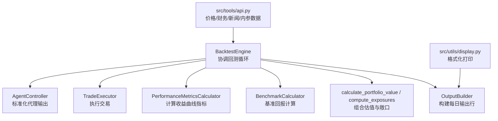
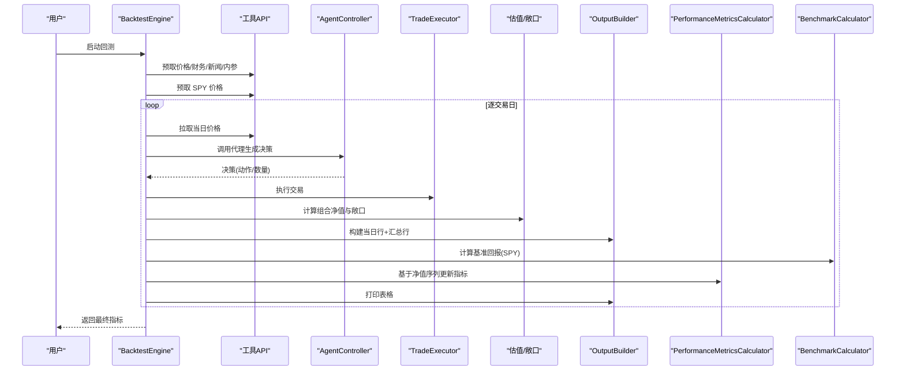
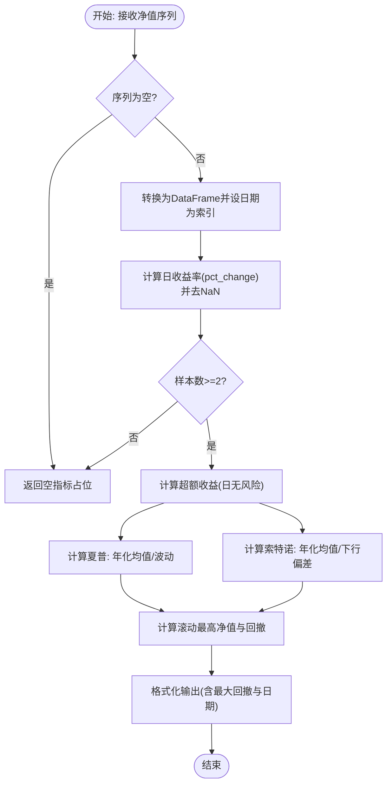
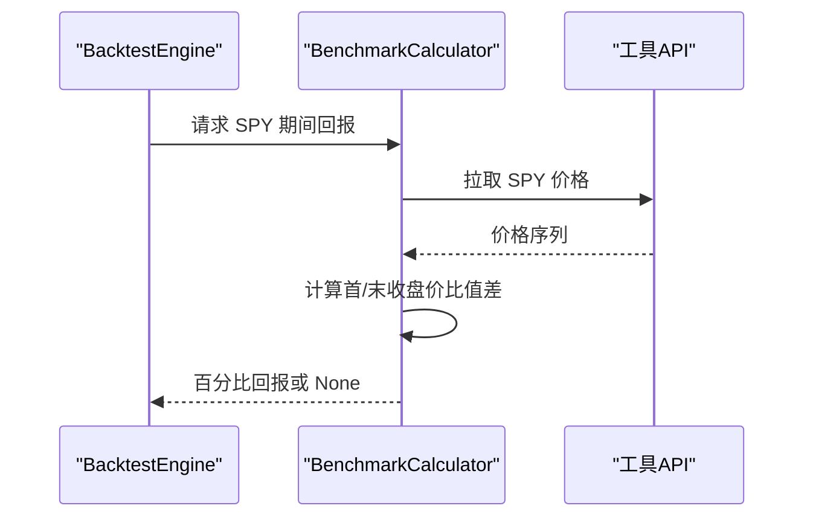
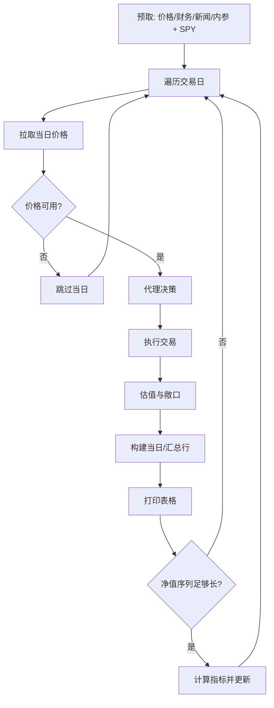
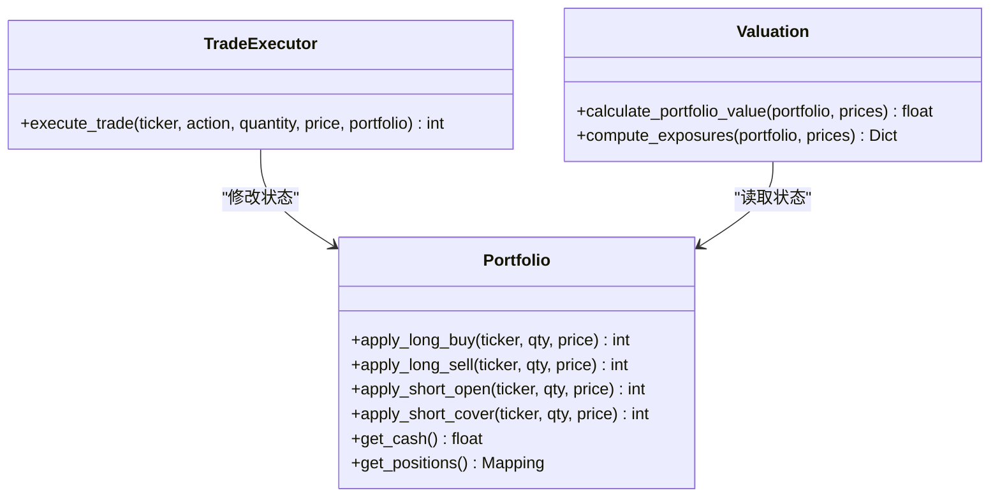
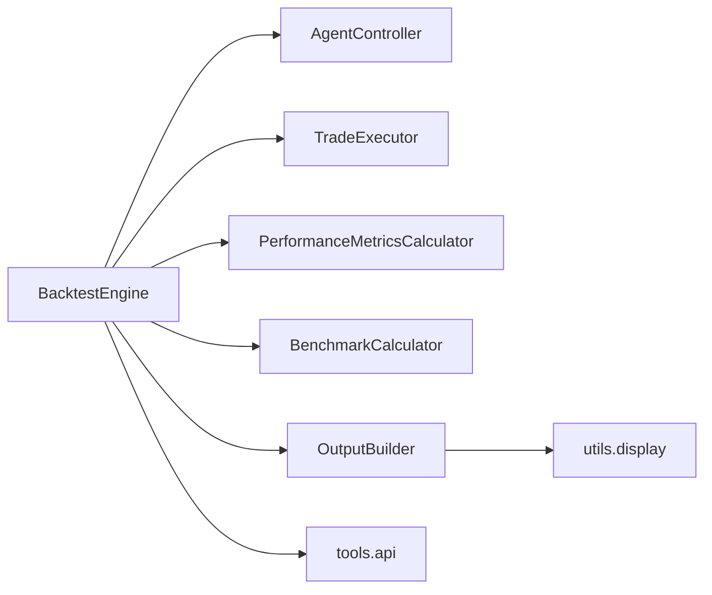

# 性能指标计算

<cite>
**本文引用的文件**
- [src/backtesting/metrics.py](file://src/backtesting/metrics.py)
- [src/backtesting/benchmarks.py](file://src/backtesting/benchmarks.py)
- [src/backtesting/engine.py](file://src/backtesting/engine.py)
- [src/backtesting/types.py](file://src/backtesting/types.py)
- [src/backtesting/portfolio.py](file://src/backtesting/portfolio.py)
- [src/backtesting/trader.py](file://src/backtesting/trader.py)
- [src/backtesting/valuation.py](file://src/backtesting/valuation.py)
- [src/backtesting/output.py](file://src/backtesting/output.py)
- [src/tools/api.py](file://src/tools/api.py)
- [src/utils/display.py](file://src/utils/display.py)
- [src/backtester.py](file://src/backtester.py)
- [tests/backtesting/test_metrics.py](file://tests/backtesting/test_metrics.py)
</cite>

## 目录
1. [引言](#引言)
2. [项目结构](#项目结构)
3. [核心组件](#核心组件)
4. [架构总览](#架构总览)
5. [详细组件分析](#详细组件分析)
6. [依赖分析](#依赖分析)
7. [性能考量](#性能考量)
8. [故障排查指南](#故障排查指南)
9. [结论](#结论)
10. [附录](#附录)

## 引言
本技术文档围绕性能指标计算系统展开，重点解析以下内容：
- PerformanceMetricsCalculator 类的实现原理与算法细节（夏普比率、索特诺比率、最大回撤等）
- BenchmarkCalculator 的基准测试机制（SPY 对比、相对表现、统计显著性）
- 指标计算的时间序列处理、滚动窗口与异常值处理策略
- 指标解读指南、阈值设定建议与性能比较方法
- 实际计算示例与结果验证方法

## 项目结构
该系统位于 backtesting 子模块中，围绕“引擎-控制器-执行器-度量-输出”链路组织，同时通过工具层 API 获取价格与财务数据，并在显示层格式化输出。

图表来源
- [src/backtesting/engine.py:27-195](file://src/backtesting/engine.py#L27-L195)
- [src/backtesting/controller.py:9-68](file://src/backtesting/controller.py#L9-L68)
- [src/backtesting/trader.py:7-40](file://src/backtesting/trader.py#L7-L40)
- [src/backtesting/metrics.py:8-78](file://src/backtesting/metrics.py#L8-L78)
- [src/backtesting/benchmarks.py:8-33](file://src/backtesting/benchmarks.py#L8-L33)
- [src/backtesting/valuation.py:8-83](file://src/backtesting/valuation.py#L8-L83)
- [src/backtesting/output.py:11-99](file://src/backtesting/output.py#L11-L99)
- [src/tools/api.py:63-367](file://src/tools/api.py#L63-L367)
- [src/utils/display.py:257-396](file://src/utils/display.py#L257-L396)

章节来源
- [src/backtesting/engine.py:27-195](file://src/backtesting/engine.py#L27-L195)
- [src/backtesting/types.py:10-106](file://src/backtesting/types.py#L10-L106)

## 核心组件
- PerformanceMetricsCalculator：基于日度组合净值序列，计算夏普、索特诺比率与最大回撤等指标。
- BenchmarkCalculator：以“期初/期末”简单持有回报的方式计算基准（如 SPY）相对表现。
- BacktestEngine：驱动回测主循环，串联数据预取、代理决策、交易执行、估值与指标更新。
- OutputBuilder：将每日交易与汇总信息格式化为表格行并打印。
- 工具层 API：统一从外部数据源获取价格与财务数据，支持缓存与限流重试。
- 显示层：负责终端表格渲染与颜色标注。

章节来源
- [src/backtesting/metrics.py:8-78](file://src/backtesting/metrics.py#L8-L78)
- [src/backtesting/benchmarks.py:8-33](file://src/backtesting/benchmarks.py#L8-L33)
- [src/backtesting/engine.py:27-195](file://src/backtesting/engine.py#L27-L195)
- [src/backtesting/output.py:11-99](file://src/backtesting/output.py#L11-L99)
- [src/tools/api.py:63-367](file://src/tools/api.py#L63-L367)
- [src/utils/display.py:257-396](file://src/utils/display.py#L257-L396)

## 架构总览
下图展示回测运行时序，突出指标计算与基准对比的关键节点。

图表来源
- [src/backtesting/engine.py:96-195](file://src/backtesting/engine.py#L96-L195)
- [src/backtesting/output.py:20-99](file://src/backtesting/output.py#L20-L99)
- [src/backtesting/metrics.py:22-78](file://src/backtesting/metrics.py#L22-L78)
- [src/backtesting/benchmarks.py:9-31](file://src/backtesting/benchmarks.py#L9-L31)
- [src/tools/api.py:63-367](file://src/tools/api.py#L63-L367)

## 详细组件分析

### PerformanceMetricsCalculator 组件分析
- 输入：按日记录的净值序列（字典列表），包含日期与净值字段。
- 输出：夏普比率、索特诺比率、最大回撤（百分比）、最大回撤发生日期。
- 关键算法与实现要点：
  - 日收益率：使用净值序列的百分比变化，丢弃首个 NaN。
  - 无风险利率换算：年无风险利率按交易日拆分，用于超额收益计算。
  - 夏普比率：超额均值除以标准差，按年化因子缩放；若波动极低则置为 0。
  - 索特诺比率：仅对负向超额（下行）计算目标方差，分子仍为超额均值；若下行偏差为 0，正收益时返回正无穷，负收益时返回 0。
  - 最大回撤：基于滚动最高净值计算回撤幅度，记录最小回撤值与对应日期。
  - 数据不足保护：当输入为空或样本数过少时，返回空指标占位。
- 时间序列与滚动窗口：
  - 使用 pandas 的滚动累计最大值计算回撤，天然形成滚动窗口效果。
  - 指标更新频率：引擎在每日净值序列长度超过阈值后进行更新。
- 异常值处理策略：
  - 通过丢弃首个 NaN 与至少两期有效观测保证稳健性。
  - 波动率接近零时的数值稳定处理（分母阈值）避免除零。
  - 日期缺失或价格异常时，引擎在当日跳过推进，不打断序列连续性。

图表来源
- [src/backtesting/metrics.py:22-78](file://src/backtesting/metrics.py#L22-L78)

章节来源
- [src/backtesting/metrics.py:8-78](file://src/backtesting/metrics.py#L8-L78)
- [tests/backtesting/test_metrics.py:24-53](file://tests/backtesting/test_metrics.py#L24-L53)

### BenchmarkCalculator 组件分析
- 功能：计算标的在指定区间的简单买入持有回报百分比（首末收盘价比值差）。
- 实现要点：
  - 优先使用首尾收盘价；若末尾缺失则回退到最后一个有效收盘价。
  - 异常捕获：任何异常或空数据返回 None，避免中断回测。
  - 用途：与组合净值曲线对比，评估相对表现与超额收益。
- 与引擎集成：
  - 引擎每日调用基准回报，作为汇总行中的“基准回报”列输出。

图表来源
- [src/backtesting/benchmarks.py:9-31](file://src/backtesting/benchmarks.py#L9-L31)
- [src/tools/api.py:364-367](file://src/tools/api.py#L364-L367)

章节来源
- [src/backtesting/benchmarks.py:8-33](file://src/backtesting/benchmarks.py#L8-L33)
- [src/backtesting/engine.py:176-176](file://src/backtesting/engine.py#L176-L176)

### 回测引擎与数据流
- 数据预取：引擎在回测前一年范围拉取各标的与财务/新闻/内参数据，并预取 SPY 用于基准对比。
- 回测循环：
  - 逐交易日推进，构造滚动窗口起始日期（月度回看）。
  - 拉取当日价格，若缺损则跳过当日。
  - 代理生成决策，执行交易，计算组合净值与各类敞口。
  - 构建当日与汇总行，打印表格。
  - 当净值序列长度满足阈值后，调用指标计算器更新指标。
- 指标更新时机：在每日更新前确保序列长度足够，避免早期样本导致的不稳定估计。

图表来源
- [src/backtesting/engine.py:81-195](file://src/backtesting/engine.py#L81-L195)

章节来源
- [src/backtesting/engine.py:27-195](file://src/backtesting/engine.py#L27-L195)

### 交易执行与组合状态
- TradeExecutor：根据动作枚举执行买入/卖出/做空/平仓，返回已成交数量。
- Portfolio：维护现金、多/空头寸、成本与保证金占用，支持多/空头寸的开仓与平仓流程。
- 估值与敞口：组合净值=现金+多头市值-空头市值；敞口=多/空头市值之和/差及总/净敞口与多空比。

图表来源
- [src/backtesting/trader.py:10-38](file://src/backtesting/trader.py#L10-L38)
- [src/backtesting/portfolio.py:82-195](file://src/backtesting/portfolio.py#L82-L195)
- [src/backtesting/valuation.py:8-51](file://src/backtesting/valuation.py#L8-L51)

章节来源
- [src/backtesting/trader.py:7-40](file://src/backtesting/trader.py#L7-L40)
- [src/backtesting/portfolio.py:9-196](file://src/backtesting/portfolio.py#L9-L196)
- [src/backtesting/valuation.py:24-51](file://src/backtesting/valuation.py#L24-L51)

### 输出与可视化
- OutputBuilder：将每日交易明细与汇总行（包含净值、回报、指标、基准回报）组装为表格行。
- display.print_backtest_results：清屏并打印最新汇总与完整交易明细表，支持颜色标注与对齐。
- 引擎在每次迭代前将当日行前置到历史行列表，使最新一天始终在顶部显示。

章节来源
- [src/backtesting/output.py:20-99](file://src/backtesting/output.py#L20-L99)
- [src/utils/display.py:257-396](file://src/utils/display.py#L257-L396)
- [src/backtesting/engine.py:166-181](file://src/backtesting/engine.py#L166-L181)

## 依赖分析
- 组件耦合与职责分离：
  - BacktestEngine 作为编排者，依赖控制器、执行器、度量器、基准计算器与输出构建器。
  - 度量器与基准计算器均为纯函数式组件，便于测试与复用。
  - 工具 API 提供统一的数据访问入口，封装缓存与限流。
- 外部依赖：
  - pandas/numpy 用于时间序列与数值计算。
  - requests 与环境变量提供外部数据接口。
- 可能的循环依赖：未发现直接循环导入。

图表来源
- [src/backtesting/engine.py:9-16](file://src/backtesting/engine.py#L9-L16)
- [src/backtesting/output.py:7-8](file://src/backtesting/output.py#L7-L8)
- [src/utils/display.py:1-6](file://src/utils/display.py#L1-L6)

章节来源
- [src/backtesting/engine.py:9-16](file://src/backtesting/engine.py#L9-L16)
- [src/backtesting/output.py:7-8](file://src/backtesting/output.py#L7-L8)

## 性能考量
- 计算复杂度：
  - 指标计算为 O(n)（n 为交易日数），主要瓶颈在 pandas 的 pct_change 与滚动累计。
  - 基准回报为 O(1) 单次查询，但受外部 API 限流影响。
- 内存与缓存：
  - 净值序列按日累积，内存线性增长；可通过限制序列长度或定期采样降低峰值。
  - 工具 API 层内置缓存，减少重复请求。
- 并发与限流：
  - 工具 API 对 429 进行线性回退重试，建议在批量预取时控制并发度。
- 数值稳定性：
  - 指标计算对极低波动与极端回撤有保护逻辑，避免除零与无穷大传播。

## 故障排查指南
- 指标为空或为 None：
  - 检查输入序列是否为空或样本过少；确认日期索引设置与字段名一致。
  - 参考单元测试用例，验证边界条件。
- 基准回报为 None：
  - 检查 SPY 价格是否成功拉取；确认日期区间与价格非空。
- 交易执行无效：
  - 检查动作枚举与数量合法性；查看执行器返回的已成交数量。
- 输出异常：
  - 确认输出构建器传入的参数与类型匹配；检查显示层格式化字段顺序。

章节来源
- [tests/backtesting/test_metrics.py:24-53](file://tests/backtesting/test_metrics.py#L24-L53)
- [src/backtesting/benchmarks.py:14-31](file://src/backtesting/benchmarks.py#L14-L31)
- [src/backtesting/trader.py:18-38](file://src/backtesting/trader.py#L18-L38)
- [src/backtesting/output.py:32-99](file://src/backtesting/output.py#L32-L99)

## 结论
本性能指标计算系统以清晰的职责划分与稳健的数值实现为基础，结合基准对比与可视化输出，能够高效地评估策略在回测期内的风险收益特征。通过滚动窗口与异常值处理策略，系统在数据质量不佳时仍能保持稳定输出；通过工具层 API 的缓存与限流，兼顾了实时性与可靠性。

## 附录

### 指标解读与阈值建议
- 夏普比率（Sharpe Ratio）：
  - 解读：单位超额收益的稳定性。数值越高表示在承担单位风险时获得更高超额回报。
  - 建议：若长期大于 0.5，通常认为收益能力较稳健；低于 0 表示承担风险未获得补偿。
- 索特诺比率（Sortino Ratio）：
  - 解读：仅惩罚下行波动，更关注“坏风险”。适用于波动不对称策略。
  - 建议：高于夏普比率时，表明策略下行风险控制较好。
- 最大回撤（Max Drawdown）：
  - 解读：从最高净值到随后最低净值的跌幅，衡量最坏情景下的资本损失。
  - 建议：单次回撤过大或恢复周期过长需警惕；可结合回撤持续期综合评估。
- 相对表现（基准对比）：
  - 建议：在相同市场环境下，组合回报显著跑赢基准（如 SPY）且波动更低，视为超额收益能力较强。

### 性能比较方法
- 同期对比：在同一回测区间内比较不同策略的指标序列与汇总值。
- 滚动窗口对比：使用固定窗口（如 60/252 日）滚动计算指标，观察趋势变化。
- 分阶段评估：按市场周期（牛市/熊市/震荡）分别计算指标，评估策略适应性。

### 实际计算示例与结果验证
- 示例路径参考：
  - 指标计算单元测试：[tests/backtesting/test_metrics.py:33-53](file://tests/backtesting/test_metrics.py#L33-L53)
  - 回测入口与指标输出：[src/backtester.py:13-67](file://src/backtester.py#L13-L67)，[src/utils/display.py:257-396](file://src/utils/display.py#L257-L396)
- 验证步骤：
  - 使用测试用例提供的净值序列，验证夏普/索特诺非空且最大回撤为负值。
  - 在引擎中运行一次短回测，观察终端表格中的汇总行与指标列。
  - 将组合回报与 SPY 基准回报对比，确认相对表现列正确显示。