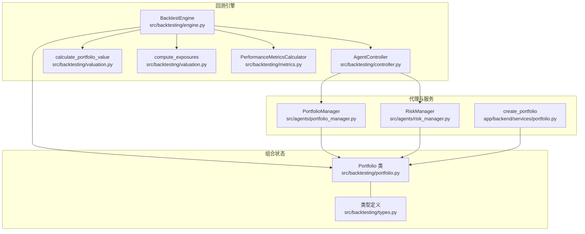
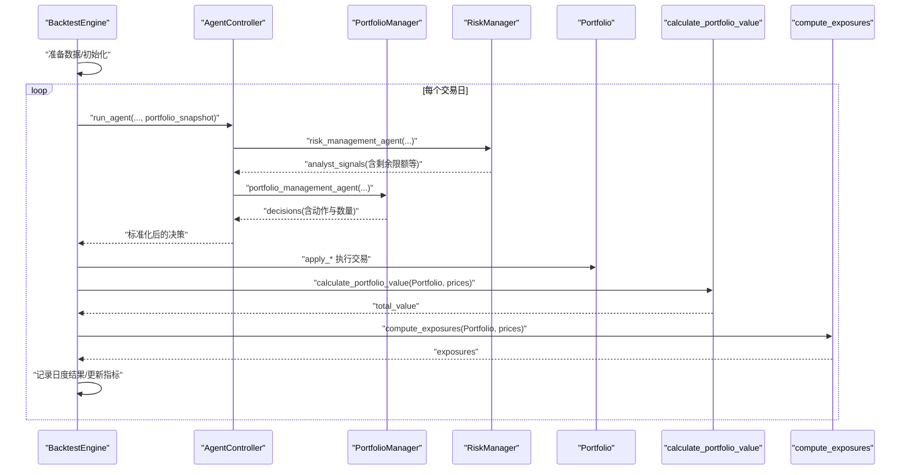
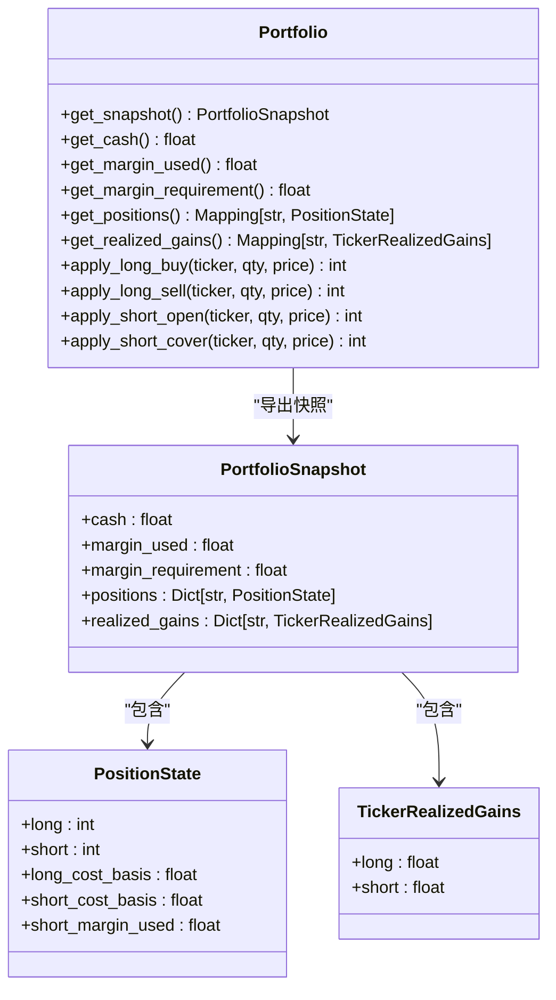
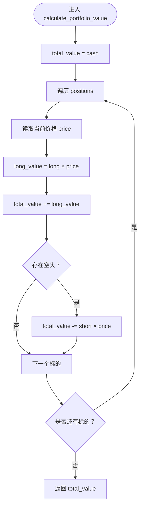
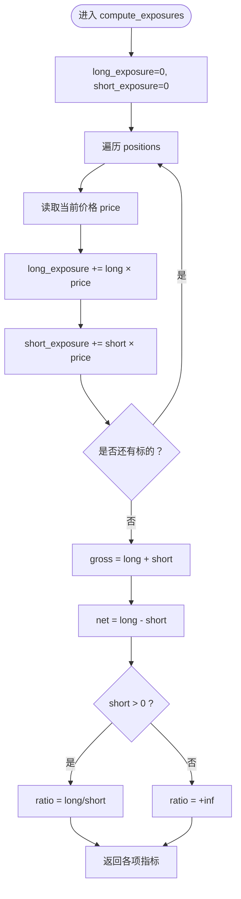
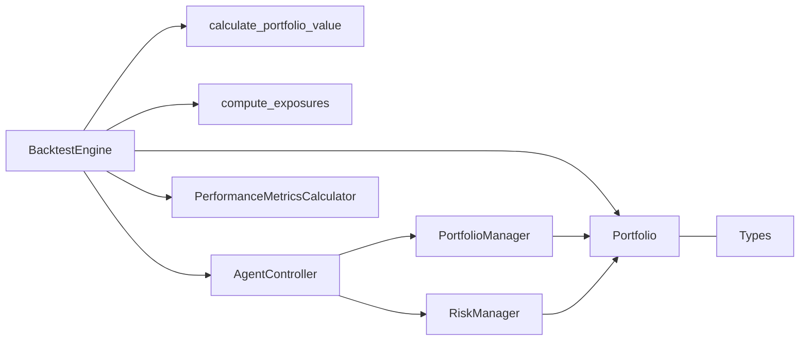

# 组合管理

<cite>
**本文引用的文件**
- [src/backtesting/portfolio.py](file://src/backtesting/portfolio.py)
- [src/backtesting/valuation.py](file://src/backtesting/valuation.py)
- [src/backtesting/engine.py](file://src/backtesting/engine.py)
- [src/backtesting/types.py](file://src/backtesting/types.py)
- [src/backtesting/controller.py](file://src/backtesting/controller.py)
- [src/backtesting/metrics.py](file://src/backtesting/metrics.py)
- [src/agents/portfolio_manager.py](file://src/agents/portfolio_manager.py)
- [src/agents/risk_manager.py](file://src/agents/risk_manager.py)
- [app/backend/services/portfolio.py](file://app/backend/services/portfolio.py)
- [tests/backtesting/test_portfolio.py](file://tests/backtesting/test_portfolio.py)
- [tests/backtesting/test_valuation.py](file://tests/backtesting/test_valuation.py)
</cite>

## 目录
1. [简介](#简介)
2. [项目结构](#项目结构)
3. [核心组件](#核心组件)
4. [架构总览](#架构总览)
5. [详细组件分析](#详细组件分析)
6. [依赖分析](#依赖分析)
7. [性能考虑](#性能考虑)
8. [故障排查指南](#故障排查指南)
9. [结论](#结论)
10. [附录](#附录)

## 简介
本技术文档围绕组合管理系统中的Portfolio类及其相关模块进行深入解析，涵盖持仓管理、现金控制、保证金与头寸限制机制；详细说明calculate_portfolio_value与compute_exposures的实现逻辑；阐述组合约束条件、风险控制参数与资金管理策略，并提供组合优化建议、风险监控方法与异常处理机制。

## 项目结构
后端采用分层设计：引擎层负责回测主循环与数据流编排，估值与敞口计算独立为工具函数，Portfolio类封装状态与交易执行，控制器负责标准化代理输出，风险与组合管理代理分别提供风险限额与交易决策，类型定义统一数据结构。

图表来源
- [src/backtesting/engine.py:27-195](file://src/backtesting/engine.py#L27-L195)
- [src/backtesting/controller.py:9-68](file://src/backtesting/controller.py#L9-L68)
- [src/backtesting/valuation.py:8-82](file://src/backtesting/valuation.py#L8-L82)
- [src/backtesting/portfolio.py:9-196](file://src/backtesting/portfolio.py#L9-L196)
- [src/backtesting/types.py:10-106](file://src/backtesting/types.py#L10-L106)
- [src/agents/portfolio_manager.py:24-263](file://src/agents/portfolio_manager.py#L24-L263)
- [src/agents/risk_manager.py:10-318](file://src/agents/risk_manager.py#L10-L318)
- [app/backend/services/portfolio.py:6-52](file://app/backend/services/portfolio.py#L6-L52)

章节来源
- [src/backtesting/engine.py:27-195](file://src/backtesting/engine.py#L27-L195)
- [src/backtesting/controller.py:9-68](file://src/backtesting/controller.py#L9-L68)
- [src/backtesting/valuation.py:8-82](file://src/backtesting/valuation.py#L8-L82)
- [src/backtesting/portfolio.py:9-196](file://src/backtesting/portfolio.py#L9-L196)
- [src/backtesting/types.py:10-106](file://src/backtesting/types.py#L10-L106)
- [src/agents/portfolio_manager.py:24-263](file://src/agents/portfolio_manager.py#L24-L263)
- [src/agents/risk_manager.py:10-318](file://src/agents/risk_manager.py#L10-L318)
- [app/backend/services/portfolio.py:6-52](file://app/backend/services/portfolio.py#L6-L52)

## 核心组件
- Portfolio类：封装现金、多头/空头头寸、成本基础、已实现损益与保证金占用，提供买入/卖出（多头）与卖空/平仓（空头）的原子操作，内置资金与保证金约束。
- 计算模块：calculate_portfolio_value按“现金+多头市值-空头市值”计算总值；compute_exposures计算多头/空头/总/净敞口与多空比率。
- 引擎与控制器：BacktestEngine驱动每日回测循环，调用代理生成决策，执行交易，计算价值与敞口，并更新绩效指标。
- 风险与组合管理代理：RiskManager基于波动率与相关性动态给出剩余头寸限额；PortfolioManager在约束下生成LLM可消费的信号与允许动作集合。

章节来源
- [src/backtesting/portfolio.py:9-196](file://src/backtesting/portfolio.py#L9-L196)
- [src/backtesting/valuation.py:8-82](file://src/backtesting/valuation.py#L8-L82)
- [src/backtesting/engine.py:96-195](file://src/backtesting/engine.py#L96-L195)
- [src/agents/risk_manager.py:10-318](file://src/agents/risk_manager.py#L10-L318)
- [src/agents/portfolio_manager.py:96-158](file://src/agents/portfolio_manager.py#L96-L158)

## 架构总览
回测主循环以工作日为单位推进，逐日拉取价格数据，运行代理得到决策，执行交易，计算组合总值与各类敞口，汇总到结果表并滚动更新风险指标。

图表来源
- [src/backtesting/engine.py:96-195](file://src/backtesting/engine.py#L96-L195)
- [src/backtesting/controller.py:12-65](file://src/backtesting/controller.py#L12-L65)
- [src/agents/portfolio_manager.py:24-263](file://src/agents/portfolio_manager.py#L24-L263)
- [src/agents/risk_manager.py:10-318](file://src/agents/risk_manager.py#L10-L318)
- [src/backtesting/valuation.py:8-51](file://src/backtesting/valuation.py#L8-L51)

## 详细组件分析

### Portfolio类设计与交易执行
Portfolio类通过内部字典结构维护每个标的的多头/空头数量、成本基础与保证金占用，并提供以下核心能力：
- 现金与保证金控制：买入/卖空均受可用现金与保证金占用影响；卖空需按保证金比例冻结相应现金。
- 多头交易：买入增加多头数量与成本基础，卖出减少多头并按成本基础计算已实现损益。
- 空头交易：卖空增加空头数量与成本基础，同时按成交金额与保证金比例累计保证金占用；平仓按比例释放保证金并计算已实现损益。
- 边界与容错：对负/零数量直接返回不执行；当资金不足时按最大可成交份额部分成交；清仓后重置成本基础与保证金占用。

图表来源
- [src/backtesting/portfolio.py:9-196](file://src/backtesting/portfolio.py#L9-L196)
- [src/backtesting/types.py:21-50](file://src/backtesting/types.py#L21-L50)

章节来源
- [src/backtesting/portfolio.py:17-196](file://src/backtesting/portfolio.py#L17-L196)
- [src/backtesting/types.py:21-50](file://src/backtesting/types.py#L21-L50)
- [tests/backtesting/test_portfolio.py:7-143](file://tests/backtesting/test_portfolio.py#L7-L143)

### calculate_portfolio_value 价值计算逻辑
该函数按“现金 + 多头市值 - 空头市值”的公式计算总组合价值，遍历所有标的，使用当前价格折算头寸价值并累加。

图表来源
- [src/backtesting/valuation.py:8-21](file://src/backtesting/valuation.py#L8-L21)

章节来源
- [src/backtesting/valuation.py:8-21](file://src/backtesting/valuation.py#L8-L21)
- [tests/backtesting/test_valuation.py:4-14](file://tests/backtesting/test_valuation.py#L4-L14)

### compute_exposures 敞口计算方法
该函数计算多头/空头/总/净敞口与多空比率，其中：
- 多头敞口：Σ(多头数量 × 当前价格)
- 空头敞口：Σ(空头数量 × 当前价格)
- 总敞口：多头 + 空头
- 净敞口：多头 - 空头
- 多空比率：多头/空头，空头为0时定义为无穷大

图表来源
- [src/backtesting/valuation.py:24-50](file://src/backtesting/valuation.py#L24-L50)
- [tests/backtesting/test_valuation.py:16-33](file://tests/backtesting/test_valuation.py#L16-L33)

章节来源
- [src/backtesting/valuation.py:24-50](file://src/backtesting/valuation.py#L24-L50)
- [tests/backtesting/test_valuation.py:16-33](file://tests/backtesting/test_valuation.py#L16-L33)

### 组合约束条件与资金管理策略
- 现金约束：多头买入仅能消耗可用现金；空头开仓需扣除保证金，且仅能使用“可用现金=总现金-已用保证金”。
- 保证金要求：卖空按成交金额×保证金比例冻结现金；平仓按空头占比释放相应保证金。
- 成本基础：多头/空头的加仓按加权平均法更新成本基础；清仓后重置成本基础与保证金占用。
- 允许动作集：组合管理代理根据当前价格、头寸与剩余限额计算每标的允许动作与最大数量，避免LLM输出无效指令。

章节来源
- [src/backtesting/portfolio.py:82-194](file://src/backtesting/portfolio.py#L82-L194)
- [src/agents/portfolio_manager.py:96-158](file://src/agents/portfolio_manager.py#L96-L158)
- [tests/backtesting/test_portfolio.py:17-93](file://tests/backtesting/test_portfolio.py#L17-L93)

### 风险控制参数与限额机制
- 波动率调整：基于年化波动率设定基础限额百分比，低波动股票提高限额，高波动股票降低限额。
- 相关性调整：基于与活跃头寸的相关性计算调整倍数，高相关性降低限额以分散集中风险。
- 剩余限额：结合总组合净值、当前头寸价值与可用现金，计算每标的剩余可加仓限额。
- 动态更新：每日回测中由风险代理重新计算限额并注入分析师信号，供组合管理代理约束交易。

章节来源
- [src/agents/risk_manager.py:105-202](file://src/agents/risk_manager.py#L105-L202)
- [src/agents/risk_manager.py:270-318](file://src/agents/risk_manager.py#L270-L318)

### 资金管理与绩效监控
- 现金与保证金：引擎在每日循环中打印最终现金与保证金占用，便于监控。
- 绩效指标：基于日度组合净值序列计算夏普、索提诺与最大回撤等指标，支持滚动更新。

章节来源
- [app/backend/services/backtest_service.py:400-427](file://app/backend/services/backtest_service.py#L400-L427)
- [src/backtesting/metrics.py:22-76](file://src/backtesting/metrics.py#L22-L76)

## 依赖分析
- 组件耦合：BacktestEngine依赖Portfolio、估值与敞口计算、代理控制器与指标计算器；Portfolio与类型定义松耦合；代理通过控制器标准化输入输出。
- 外部依赖：回测引擎通过工具接口获取价格与财务数据；风险代理依赖外部API获取价格序列并计算波动率与相关性矩阵。

图表来源
- [src/backtesting/engine.py:27-195](file://src/backtesting/engine.py#L27-L195)
- [src/backtesting/controller.py:9-68](file://src/backtesting/controller.py#L9-L68)
- [src/backtesting/valuation.py:8-82](file://src/backtesting/valuation.py#L8-L82)
- [src/backtesting/portfolio.py:9-196](file://src/backtesting/portfolio.py#L9-L196)
- [src/backtesting/types.py:10-106](file://src/backtesting/types.py#L10-L106)

章节来源
- [src/backtesting/engine.py:27-195](file://src/backtesting/engine.py#L27-L195)
- [src/backtesting/controller.py:9-68](file://src/backtesting/controller.py#L9-L68)
- [src/backtesting/valuation.py:8-82](file://src/backtesting/valuation.py#L8-L82)
- [src/backtesting/portfolio.py:9-196](file://src/backtesting/portfolio.py#L9-L196)
- [src/backtesting/types.py:10-106](file://src/backtesting/types.py#L10-L106)

## 性能考虑
- 时间复杂度：calculate_portfolio_value与compute_exposures均为O(N)，N为标的数；回测按工作日线性扩展。
- 内存占用：每日存储组合快照与指标，注意长期回测的数据规模；可按需裁剪历史记录。
- 并发与I/O：价格与财务数据预取与缓存可减少重复请求；代理输出标准化避免额外转换开销。
- 数值稳定性：除零判断（空头为0时多空比率设为无穷大）与小量比较阈值（如1e-9）确保稳健性。

## 故障排查指南
- 交易未成交或部分成交：检查现金/保证金是否充足；确认输入数量与价格有效性；查看测试用例中的边界行为。
- 现金与保证金异常：核对卖空开仓与平仓的保证金冻结/释放逻辑；验证成本基础更新与清仓重置。
- 敞口计算异常：确认多头/空头数量与价格映射一致；关注空头为0时的多空比率处理。
- 绩效指标缺失：检查回测序列长度与净值列是否存在；确认滚动窗口与风控日志。

章节来源
- [tests/backtesting/test_portfolio.py:17-143](file://tests/backtesting/test_portfolio.py#L17-L143)
- [tests/backtesting/test_valuation.py:16-37](file://tests/backtesting/test_valuation.py#L16-L37)
- [src/backtesting/metrics.py:22-76](file://src/backtesting/metrics.py#L22-L76)

## 结论
Portfolio类提供了稳健的多头/空头交易与保证金管理能力，配合独立的估值与敞口计算模块，支撑回测引擎高效运行。风险与组合管理代理通过波动率与相关性动态限额，使交易在可控范围内执行。建议在生产环境中强化异常路径的日志与告警，并持续优化数据获取与缓存策略以提升性能。

## 附录
- 数据模型与类型定义：统一的PortfolioSnapshot、PositionState与TickerRealizedGains确保前后端与回测模块的一致性。
- 后端服务：app/backend/services/portfolio.py提供字典结构的组合初始化与已有头寸导入，便于与前端或数据库集成。

章节来源
- [src/backtesting/types.py:21-106](file://src/backtesting/types.py#L21-L106)
- [app/backend/services/portfolio.py:6-52](file://app/backend/services/portfolio.py#L6-L52)