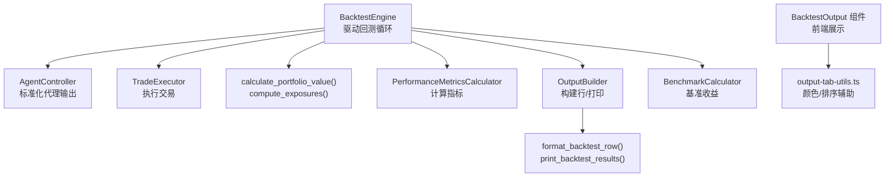
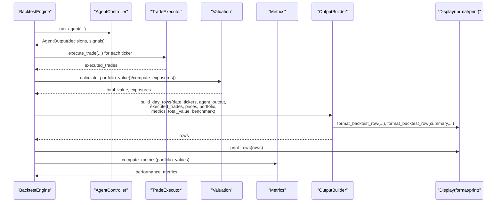
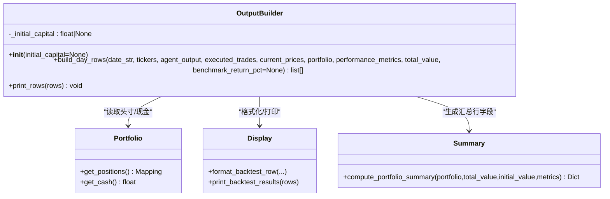
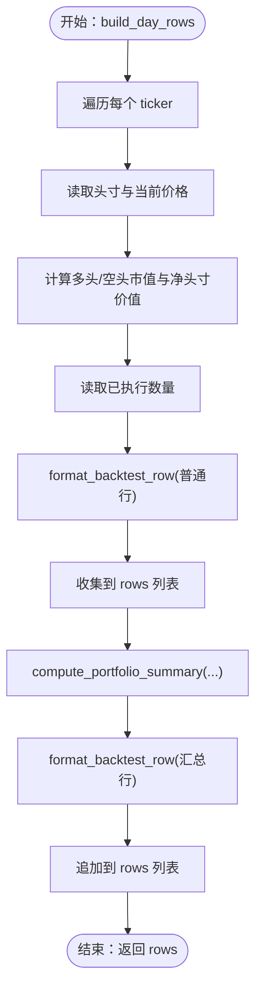
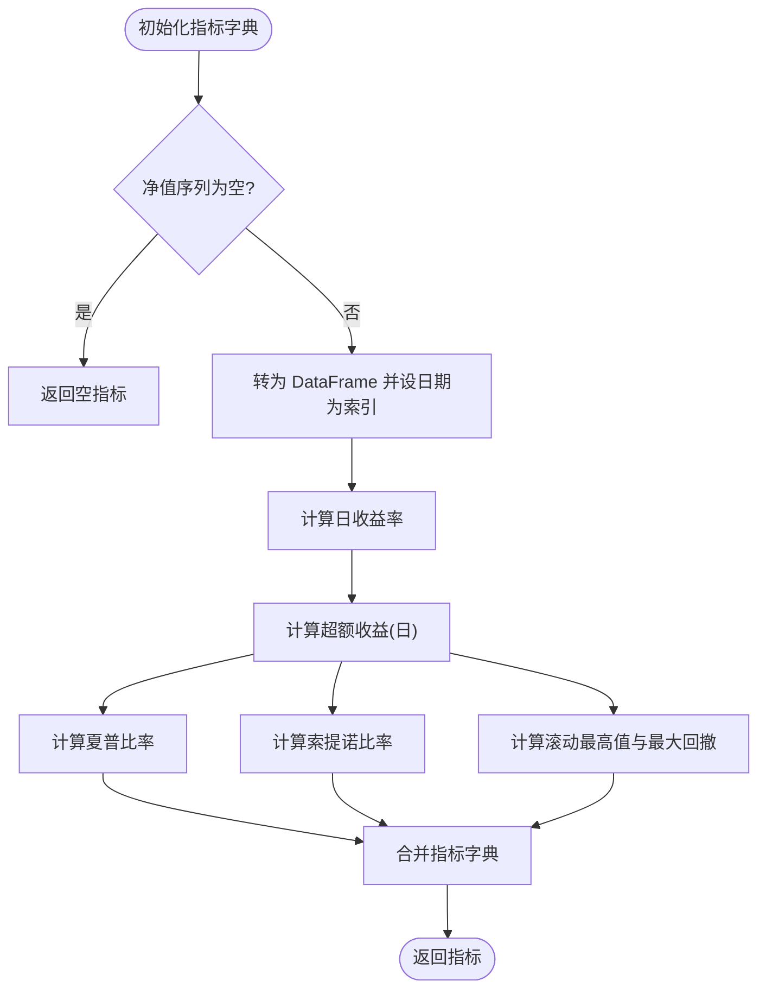
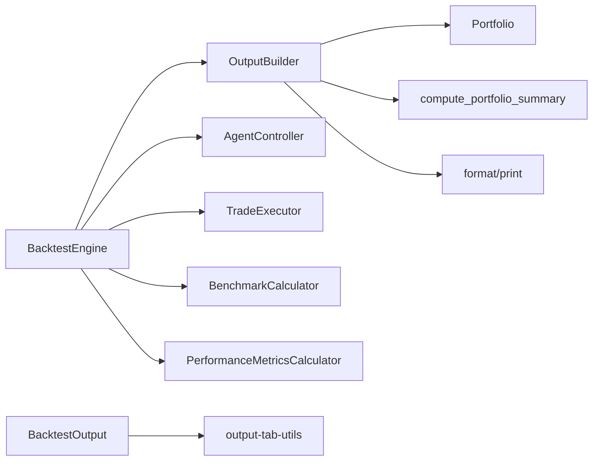

# 输出格式化

<cite>
**本文引用的文件列表**
- [output.py](file://src/backtesting/output.py)
- [types.py](file://src/backtesting/types.py)
- [metrics.py](file://src/backtesting/metrics.py)
- [valuation.py](file://src/backtesting/valuation.py)
- [engine.py](file://src/backtesting/engine.py)
- [controller.py](file://src/backtesting/controller.py)
- [trader.py](file://src/backtesting/trader.py)
- [benchmarks.py](file://src/backtesting/benchmarks.py)
- [display.py](file://src/utils/display.py)
- [backtest-output.tsx](file://app/frontend/src/components/panels/bottom/tabs/backtest-output.tsx)
- [output-tab-utils.ts](file://app/frontend/src/components/panels/bottom/tabs/output-tab-utils.ts)
- [test_results.py](file://tests/backtesting/test_results.py)
</cite>

## 目录
1. [简介](#简介)
2. [项目结构与定位](#项目结构与定位)
3. [核心组件总览](#核心组件总览)
4. [架构概览](#架构概览)
5. [详细组件分析](#详细组件分析)
6. [依赖关系分析](#依赖关系分析)
7. [性能与可扩展性](#性能与可扩展性)
8. [故障排查与调试](#故障排查与调试)
9. [结论](#结论)
10. [附录：输出格式与解读指南](#附录输出格式与解读指南)

## 简介
本文件面向回测输出格式化系统，聚焦 OutputBuilder 类的设计与实现，系统性阐述其在每日交易报告、性能指标汇总、持仓变化记录与风险指标展示中的作用；同时梳理 PortfolioValuePoint、PerformanceMetrics 等核心数据结构，说明输出定制选项、格式模板与导出能力，并给出可视化建议与报告生成方法。

## 项目结构与定位
- 后端回测链路由 BacktestEngine 驱动，贯穿数据预取、逐日循环、决策执行、估值与暴露计算、性能指标更新与输出打印。
- OutputBuilder 负责将当日数据转换为“每股票行 + 汇总行”的表格行集合，并通过 display 工具进行终端或前端渲染。
- 前端通过 BacktestOutput 组件消费后端输出，展示活动表、性能指标与最终头寸。

图表来源
- [engine.py:27-195](file://src/backtesting/engine.py#L27-L195)
- [output.py:11-99](file://src/backtesting/output.py#L11-L99)
- [display.py:257-396](file://src/utils/display.py#L257-L396)
- [backtest-output.tsx:398-416](file://app/frontend/src/components/panels/bottom/tabs/backtest-output.tsx#L398-L416)
- [output-tab-utils.ts:60-74](file://app/frontend/src/components/panels/bottom/tabs/output-tab-utils.ts#L60-L74)

章节来源
- [engine.py:27-195](file://src/backtesting/engine.py#L27-L195)
- [output.py:11-99](file://src/backtesting/output.py#L11-L99)
- [display.py:257-396](file://src/utils/display.py#L257-L396)
- [backtest-output.tsx:398-416](file://app/frontend/src/components/panels/bottom/tabs/backtest-output.tsx#L398-L416)
- [output-tab-utils.ts:60-74](file://app/frontend/src/components/panels/bottom/tabs/output-tab-utils.ts#L60-L74)

## 核心组件总览
- OutputBuilder：负责将当日状态（价格、头寸、决策、已执行交易）转换为表格行，包含每股票行与汇总行。
- PerformanceMetricsCalculator：基于净值序列计算夏普、索提诺比率与最大回撤等指标。
- compute_portfolio_summary：纯函数式地计算汇总行字段，供 OutputBuilder 使用。
- format_backtest_row/print_backtest_results：CLI 端格式化与打印；前端对应组件负责渲染。
- BacktestEngine：串联各组件，按日推进回测，调用 OutputBuilder 生成并打印输出。

章节来源
- [output.py:11-99](file://src/backtesting/output.py#L11-L99)
- [metrics.py:8-78](file://src/backtesting/metrics.py#L8-L78)
- [valuation.py:54-83](file://src/backtesting/valuation.py#L54-L83)
- [display.py:257-396](file://src/utils/display.py#L257-L396)
- [engine.py:96-195](file://src/backtesting/engine.py#L96-L195)

## 架构概览
下图展示从引擎到输出的关键交互流程，突出 OutputBuilder 的职责边界与数据流。

图表来源
- [engine.py:132-189](file://src/backtesting/engine.py#L132-L189)
- [output.py:20-93](file://src/backtesting/output.py#L20-L93)
- [display.py:333-396](file://src/utils/display.py#L333-L396)
- [metrics.py:22-75](file://src/backtesting/metrics.py#L22-L75)

章节来源
- [engine.py:96-195](file://src/backtesting/engine.py#L96-L195)
- [output.py:20-93](file://src/backtesting/output.py#L20-L93)
- [display.py:333-396](file://src/utils/display.py#L333-L396)
- [metrics.py:22-75](file://src/backtesting/metrics.py#L22-L75)

## 详细组件分析

### OutputBuilder 设计与实现
- 角色定位：无状态构建器，接收输入参数，返回行列表；打印由外部 display 工具完成。
- 关键方法：
  - build_day_rows：遍历 tickers 生成每股票行；随后调用 compute_portfolio_summary 生成汇总行。
  - print_rows：委托 print_backtest_results 打印。
- 数据来源与映射：
  - 决策与分析师信号来自 AgentOutput。
  - 已执行交易与当前价格用于计算当日行。
  - 通过 Portfolio 获取头寸，计算多空市值与净头寸价值。
  - 性能指标来自 PerformanceMetrics，基准收益来自 BenchmarkCalculator。

图表来源
- [output.py:11-99](file://src/backtesting/output.py#L11-L99)
- [valuation.py:54-83](file://src/backtesting/valuation.py#L54-L83)
- [display.py:333-396](file://src/utils/display.py#L333-L396)

章节来源
- [output.py:11-99](file://src/backtesting/output.py#L11-L99)
- [valuation.py:54-83](file://src/backtesting/valuation.py#L54-L83)
- [display.py:333-396](file://src/utils/display.py#L333-L396)

### 表格行构建与数据格式化
- 每股票行字段：日期、股票代码、动作、数量、价格、多头股数、空头股数、头寸价值。
- 汇总行字段：日期、标记为“组合汇总”、总头寸价值、现金余额、总价值、组合回报率、夏普比率、索提诺比率、最大回撤、基准回报率。
- 颜色策略：买入/平仓用绿色，卖出/做空用红色，持有用默认色；回报率正负决定颜色。
- 数值格式：金额使用千分位逗号分隔，百分比保留两位小数，数量整数显示。

图表来源
- [output.py:20-93](file://src/backtesting/output.py#L20-L93)
- [display.py:333-396](file://src/utils/display.py#L333-L396)
- [valuation.py:54-83](file://src/backtesting/valuation.py#L54-L83)

章节来源
- [output.py:20-93](file://src/backtesting/output.py#L20-L93)
- [display.py:333-396](file://src/utils/display.py#L333-L396)
- [valuation.py:54-83](file://src/backtesting/valuation.py#L54-L83)

### 性能指标与风险指标
- 夏普比率与索提诺比率：基于日度超额收益（无风险利率按交易日折算）与标准差/下行偏差计算。
- 最大回撤：净值序列滚动最高值与当前净值之差占滚动最高值的比例最小值。
- 指标来源：PerformanceMetricsCalculator 基于净值序列计算；OutputBuilder 将指标注入汇总行。

图表来源
- [metrics.py:22-75](file://src/backtesting/metrics.py#L22-L75)

章节来源
- [metrics.py:8-78](file://src/backtesting/metrics.py#L8-L78)

### 数据类型定义与结构
- Action：动作枚举（buy/sell/short/cover/hold）。
- PositionState/TickerRealizedGains/PortfolioSnapshot：头寸、已实现损益与快照的数据结构。
- AgentOutput/AgentDecisions/AgentSignals：代理输出与决策/信号结构。
- PortfolioValuePoint：净值曲线点，包含日期与各类暴露。
- PerformanceMetrics：性能指标集合，支持逐步计算与可选字段。

章节来源
- [types.py:10-106](file://src/backtesting/types.py#L10-L106)

### 输出定制选项与格式模板
- 定制维度：
  - 初始资本：影响回报率计算（若提供）。
  - 动作颜色：根据动作自动着色。
  - 汇总行字段：包含总价值、回报率、现金、头寸价值、风险指标与基准回报。
  - 前端展示：BacktestOutput 组件按“活动表 + 性能指标 + 最终头寸”三段式呈现。
- 模板与渲染：
  - CLI：format_backtest_row 与 print_backtest_results。
  - 前端：BacktestTradingTable/BacktestResults/BacktestPerformanceMetrics 组合渲染。

章节来源
- [output.py:17-18](file://src/backtesting/output.py#L17-L18)
- [display.py:333-396](file://src/utils/display.py#L333-L396)
- [backtest-output.tsx:36-416](file://app/frontend/src/components/panels/bottom/tabs/backtest-output.tsx#L36-L416)

### 导出与报告生成
- 导出路径：
  - CLI：直接打印表格，便于复制粘贴或重定向至文件。
  - 前端：BacktestOutput 组件可作为页面区块展示，便于集成到仪表盘。
- 报告要素：
  - 每日交易活动表（含分析师信号计数）。
  - 组合汇总（总价值、回报率、风险指标、基准回报）。
  - 最终头寸与成本基础。
  - 实时性能指标（总回报、胜率、最大回撤、周期数等）。

章节来源
- [display.py:257-332](file://src/utils/display.py#L257-L332)
- [backtest-output.tsx:154-298](file://app/frontend/src/components/panels/bottom/tabs/backtest-output.tsx#L154-L298)

## 依赖关系分析
- OutputBuilder 依赖：
  - Portfolio：读取头寸与现金。
  - compute_portfolio_summary：纯函数式汇总。
  - format_backtest_row/print_backtest_results：格式化与打印。
- BacktestEngine 依赖：
  - AgentController、TradeExecutor、BenchmarkCalculator、PerformanceMetricsCalculator。
  - OutputBuilder：构建并打印每日输出。
- 前端依赖：
  - output-tab-utils.ts：动作颜色、信号颜色、排序等辅助。
  - BacktestOutput：消费后端输出数据，渲染三段式报告。

图表来源
- [output.py:11-99](file://src/backtesting/output.py#L11-L99)
- [engine.py:27-195](file://src/backtesting/engine.py#L27-L195)
- [backtest-output.tsx:398-416](file://app/frontend/src/components/panels/bottom/tabs/backtest-output.tsx#L398-L416)
- [output-tab-utils.ts:60-74](file://app/frontend/src/components/panels/bottom/tabs/output-tab-utils.ts#L60-L74)

章节来源
- [output.py:11-99](file://src/backtesting/output.py#L11-L99)
- [engine.py:27-195](file://src/backtesting/engine.py#L27-L195)
- [backtest-output.tsx:398-416](file://app/frontend/src/components/panels/bottom/tabs/backtest-output.tsx#L398-L416)
- [output-tab-utils.ts:60-74](file://app/frontend/src/components/panels/bottom/tabs/output-tab-utils.ts#L60-L74)

## 性能与可扩展性
- 时间复杂度：
  - 每日循环中，OutputBuilder 对 tickers 的遍历为 O(N)，汇总行计算为 O(1)；整体近似 O(N)。
  - 指标计算基于净值序列，DataFrame 转换与统计操作为 O(T)（T 为交易日数），在回测窗口内可控。
- 内存与输出规模：
  - 前端默认仅展示最近若干条（如 50 条），避免长回测历史导致渲染压力。
- 可扩展点：
  - 新增指标：在 PerformanceMetrics 中添加字段，更新 compute_metrics 返回值与汇总行字段。
  - 自定义列：在 format_backtest_row 中增加新列，确保前后端一致。
  - 多市场/多资产：扩展 tickers 与价格来源，保持现有接口不变。

[本节为通用性能讨论，不直接分析具体文件]

## 故障排查与调试
- 常见问题与定位：
  - 输出为空：检查 AgentOutput 是否包含决策与信号；确认 TradeExecutor 是否成功执行交易。
  - 汇总行缺失：确认 compute_portfolio_summary 的调用与返回字段是否被正确传入 format_backtest_row。
  - 指标异常：检查净值序列长度与有效性；确认无风险利率与交易日折算是否合理。
- 单元测试参考：
  - 测试覆盖了 OutputBuilder 生成行数与汇总行关键字段，可作为回归验证基线。

章节来源
- [test_results.py:4-58](file://tests/backtesting/test_results.py#L4-L58)

## 结论
OutputBuilder 以“无状态 + 纯函数式汇总”的设计，清晰分离了数据采集、格式化与展示层，既满足 CLI 实时输出，也兼容前端三段式报告。配合 PerformanceMetricsCalculator 与 Exposure 计算，形成完整的回测输出体系。通过标准化数据结构与格式模板，系统具备良好的可扩展性与可维护性。

[本节为总结性内容，不直接分析具体文件]

## 附录：输出格式与解读指南

### 输出格式一览
- 每日交易活动表（每股票行）
  - 字段：日期、股票代码、动作、数量、价格、多头股数、空头股数、头寸价值。
  - 解读：观察每期买卖/做空/平仓行为与头寸变化，结合分析师信号计数判断一致性。
- 组合汇总行（每日一次）
  - 字段：日期、标记、总头寸价值、现金余额、总价值、组合回报率、夏普比率、索提诺比率、最大回撤、基准回报率。
  - 解读：评估当期整体表现与风险水平；正回报率表示盈利，负回报率表示亏损；风险指标越高通常代表更高波动或下行风险。
- 最终头寸与成本基础
  - 字段：股票代码、多头股数、空头股数、多头成本基础、空头成本基础。
  - 解读：了解最终持仓结构与平均成本，便于后续复盘与再平衡。

章节来源
- [display.py:333-396](file://src/utils/display.py#L333-L396)
- [backtest-output.tsx:264-298](file://app/frontend/src/components/panels/bottom/tabs/backtest-output.tsx#L264-L298)

### 可视化建议
- 活动表：按日期倒序展示，突出动作颜色；可加入分析师信号计数列帮助快速识别共识。
- 性能指标：使用卡片式布局展示夏普、索提诺、最大回撤与总回报，正负值配色区分。
- 最终头寸：以表格形式呈现，多头/空头分别着色，便于快速审阅敞口结构。

章节来源
- [backtest-output.tsx:39-151](file://app/frontend/src/components/panels/bottom/tabs/backtest-output.tsx#L39-L151)
- [output-tab-utils.ts:60-74](file://app/frontend/src/components/panels/bottom/tabs/output-tab-utils.ts#L60-L74)

### 报告生成方法
- CLI 一键导出：将 print_backtest_results 的输出重定向到文件，便于归档与二次处理。
- 前端集成：在仪表盘中嵌入 BacktestOutput 组件，实时刷新最新周期与历史汇总。
- 指标对比：将 PerformanceMetrics 与 BenchmarkCalculator 的基准回报率对比，评估相对表现。

章节来源
- [display.py:257-332](file://src/utils/display.py#L257-L332)
- [backtest-output.tsx:154-298](file://app/frontend/src/components/panels/bottom/tabs/backtest-output.tsx#L154-L298)
- [benchmarks.py:8-33](file://src/backtesting/benchmarks.py#L8-L33)