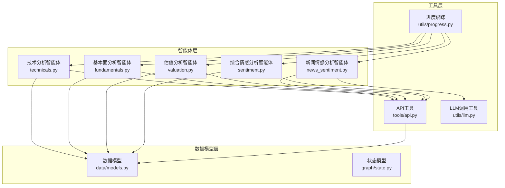
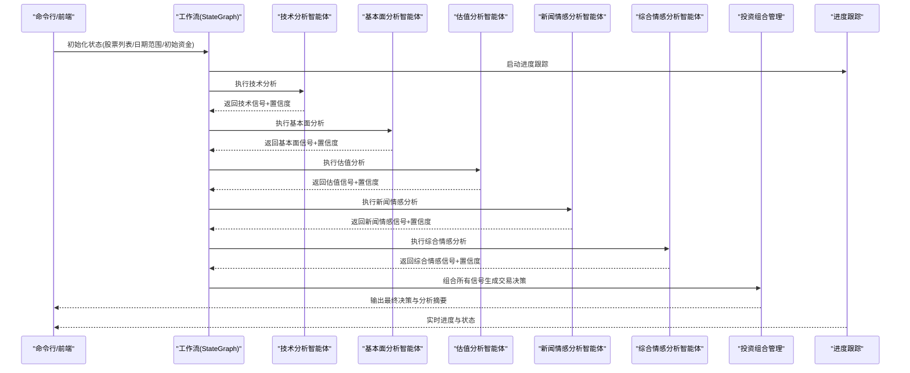
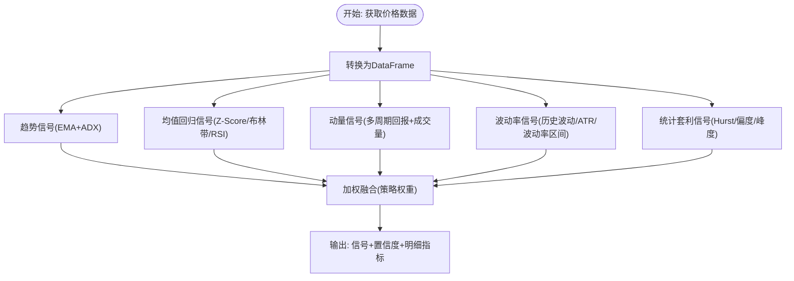
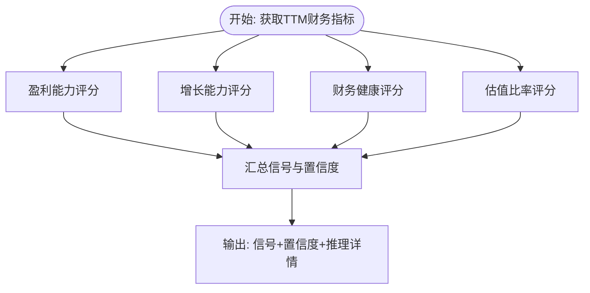
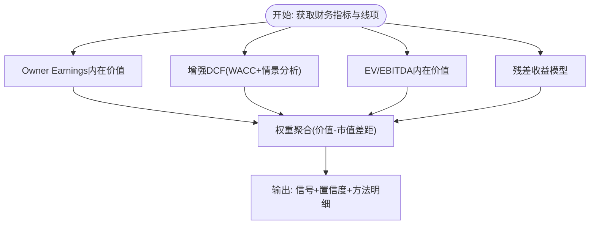
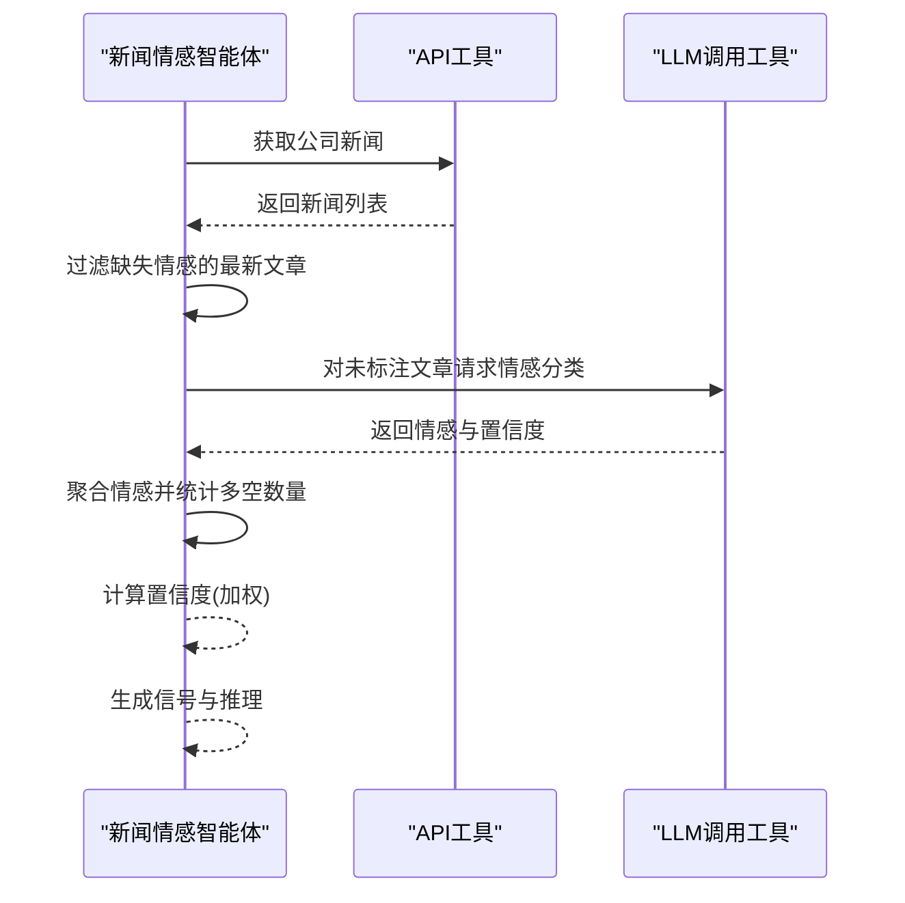
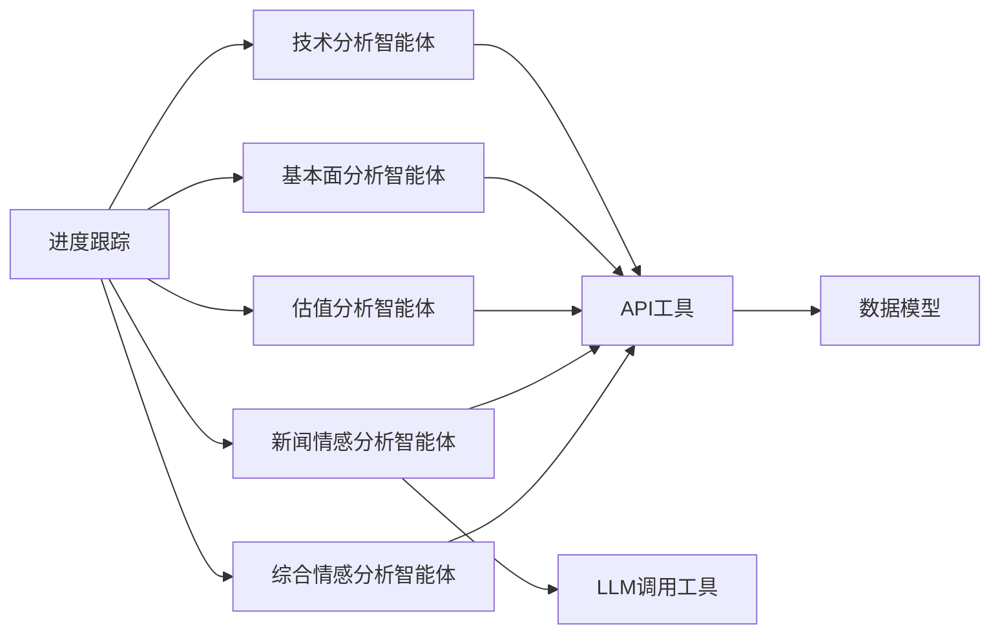

# 专业分析智能体

<cite>
**本文档引用的文件**
- [src/agents/technicals.py](file://src/agents/technicals.py)
- [src/agents/fundamentals.py](file://src/agents/fundamentals.py)
- [src/agents/valuation.py](file://src/agents/valuation.py)
- [src/agents/news_sentiment.py](file://src/agents/news_sentiment.py)
- [src/agents/sentiment.py](file://src/agents/sentiment.py)
- [src/tools/api.py](file://src/tools/api.py)
- [src/data/models.py](file://src/data/models.py)
- [src/graph/state.py](file://src/graph/state.py)
- [src/utils/llm.py](file://src/utils/llm.py)
- [src/utils/progress.py](file://src/utils/progress.py)
- [src/utils/display.py](file://src/utils/display.py)
- [src/main.py](file://src/main.py)
- [src/backtesting/controller.py](file://src/backtesting/controller.py)
</cite>

## 目录
1. [引言](#引言)
2. [项目结构](#项目结构)
3. [核心组件](#核心组件)
4. [架构总览](#架构总览)
5. [详细组件分析](#详细组件分析)
6. [依赖关系分析](#依赖关系分析)
7. [性能考虑](#性能考虑)
8. [故障排除指南](#故障排除指南)
9. [结论](#结论)

## 引言
本文件系统性梳理并分析了该AI对冲基金项目中的四大专业分析智能体：技术分析智能体、基本面分析智能体、估值分析智能体与新闻情感分析智能体。文档从数据输入输出格式、处理逻辑、信号生成机制、集成方式到性能优化策略进行全面阐述，并通过多种可视化图表帮助读者快速把握各智能体的实现要点与交互关系。

## 项目结构
项目采用“智能体 + 工具 + 数据模型 + 状态管理”的分层设计：
- 智能体层：负责具体分析任务（技术面、基本面、估值、新闻情感）
- 工具层：封装外部API调用与缓存逻辑
- 数据模型层：定义统一的数据结构（价格、财务指标、新闻、交易等）
- 状态与展示层：LangGraph状态机驱动流程，进度与结果可视化

**图表来源**
- [src/agents/technicals.py:35-157](file://src/agents/technicals.py#L35-L157)
- [src/agents/fundamentals.py:11-163](file://src/agents/fundamentals.py#L11-L163)
- [src/agents/valuation.py:21-220](file://src/agents/valuation.py#L21-L220)
- [src/agents/news_sentiment.py:25-164](file://src/agents/news_sentiment.py#L25-L164)
- [src/agents/sentiment.py:12-138](file://src/agents/sentiment.py#L12-L138)
- [src/tools/api.py:63-366](file://src/tools/api.py#L63-L366)
- [src/data/models.py:4-175](file://src/data/models.py#L4-L175)
- [src/graph/state.py:15-52](file://src/graph/state.py#L15-L52)
- [src/utils/llm.py:10-148](file://src/utils/llm.py#L10-L148)
- [src/utils/progress.py:12-117](file://src/utils/progress.py#L12-L117)

**章节来源**
- [src/main.py:100-131](file://src/main.py#L100-L131)
- [src/graph/state.py:15-52](file://src/graph/state.py#L15-L52)

## 核心组件
- 技术分析智能体：基于多时间框架趋势、均值回归、动量、波动率与统计套利信号，采用加权融合生成买卖信号与置信度。
- 基本面分析智能体：围绕盈利能力、增长能力、财务健康与估值比率进行评分，汇总得出总体信号与置信度。
- 估值分析智能体：整合Owner Earnings、增强DCF（含WACC与情景分析）、EV/EBITDA与残差收益模型，给出内在价值与市场价差距及置信度。
- 新闻情感分析智能体：抓取公司新闻，对缺失情感标注的文章使用LLM分类，聚合得到总体信号与置信度；另有一个综合情感智能体结合内幕交易与新闻情感。

**章节来源**
- [src/agents/technicals.py:35-157](file://src/agents/technicals.py#L35-L157)
- [src/agents/fundamentals.py:11-163](file://src/agents/fundamentals.py#L11-L163)
- [src/agents/valuation.py:21-220](file://src/agents/valuation.py#L21-L220)
- [src/agents/news_sentiment.py:25-164](file://src/agents/news_sentiment.py#L25-L164)
- [src/agents/sentiment.py:12-138](file://src/agents/sentiment.py#L12-L138)

## 架构总览
智能体通过LangGraph状态机串联执行，每个智能体在完成分析后以消息形式写入状态，最终由组合器生成交易决策。进度条实时显示各智能体执行状态，控制台输出结构化分析结果与最终决策。

**图表来源**
- [src/main.py:46-93](file://src/main.py#L46-L93)
- [src/utils/progress.py:44-64](file://src/utils/progress.py#L44-L64)

**章节来源**
- [src/main.py:100-131](file://src/main.py#L100-L131)
- [src/utils/display.py:17-255](file://src/utils/display.py#L17-L255)

## 详细组件分析

### 技术分析智能体
- 输入：股票列表、起止日期、API密钥
- 处理流程：
  - 获取日线价格序列，转换为DataFrame
  - 计算多因子信号：趋势（EMA+ADX）、均值回归（Z-Score、布林带、RSI）、动量（多周期回报+成交量确认）、波动率（历史波动、ATR、波动率区间）、统计套利（Hurst指数、偏度峰度）
  - 加权融合：按策略权重对信号与置信度进行加权平均，输出最终信号与置信度
- 输出：每只股票的综合信号、置信度与各子策略的指标明细
- 性能优化：pandas向量化计算、滚动窗口缓存、进度条实时反馈

**图表来源**
- [src/agents/technicals.py:160-404](file://src/agents/technicals.py#L160-L404)

**章节来源**
- [src/agents/technicals.py:35-157](file://src/agents/technicals.py#L35-L157)
- [src/agents/technicals.py:160-404](file://src/agents/technicals.py#L160-L404)
- [src/tools/api.py:63-96](file://src/tools/api.py#L63-L96)
- [src/tools/api.py:351-366](file://src/tools/api.py#L351-L366)

### 基本面分析智能体
- 输入：股票列表、截止日期、API密钥
- 处理流程：
  - 获取TTM财务指标
  - 盈利能力评分（ROE、净利率、运营利润率）
  - 增长能力评分（营收、EPS、账面价值增长率）
  - 财务健康评分（流动比率、D/E、自由现金流与EPS匹配）
  - 估值比率评分（P/E、P/B、P/S）
  - 综合信号：多数指标支持则看多，反之看空，否则中性；置信度基于多数指标支持比例
- 输出：每只股票的总体信号、置信度与各维度推理详情

**图表来源**
- [src/agents/fundamentals.py:44-131](file://src/agents/fundamentals.py#L44-L131)

**章节来源**
- [src/agents/fundamentals.py:11-163](file://src/agents/fundamentals.py#L11-L163)
- [src/tools/api.py:99-138](file://src/tools/api.py#L99-L138)

### 估值分析智能体
- 输入：股票列表、截止日期、API密钥
- 处理流程：
  - 获取TTM财务指标与关键财务线项（FCF、净利润、折旧摊销、资本支出、营运资本、债务、现金、利息、收入、EBIT、EBITDA）
  - Owner Earnings内在价值（考虑增长与安全边际）
  - 增强DCF（含WACC估算、多阶段增长、情景分析：熊/牛/基）
  - EV/EBITDA内在价值（中位数倍数法）
  - 残差收益模型（Edwards-Bell-Ohlson）
  - 权重聚合：按方法权重计算“价值-市值”差距，确定信号与置信度
- 输出：每只股票的估值信号、置信度与各方法的详细推理

**图表来源**
- [src/agents/valuation.py:21-220](file://src/agents/valuation.py#L21-L220)

**章节来源**
- [src/agents/valuation.py:21-220](file://src/agents/valuation.py#L21-L220)
- [src/agents/valuation.py:226-495](file://src/agents/valuation.py#L226-L495)
- [src/tools/api.py:141-181](file://src/tools/api.py#L141-L181)
- [src/tools/api.py:315-348](file://src/tools/api.py#L315-L348)

### 新闻情感分析智能体
- 输入：股票列表、截止日期、API密钥
- 处理流程：
  - 获取公司新闻，优先使用已有情感标注
  - 对缺失情感标注的最新文章使用LLM进行情感分类（正/负/中性）并返回置信度
  - 聚合所有文章情感，统计多空数量，决定总体信号
  - 置信度：基于LLM置信度与信号占比的加权
- 输出：每只股票的新闻情感信号、置信度与统计指标

**图表来源**
- [src/agents/news_sentiment.py:25-164](file://src/agents/news_sentiment.py#L25-L164)
- [src/utils/llm.py:10-148](file://src/utils/llm.py#L10-L148)

**章节来源**
- [src/agents/news_sentiment.py:25-164](file://src/agents/news_sentiment.py#L25-L164)
- [src/utils/llm.py:10-148](file://src/utils/llm.py#L10-L148)

### 综合情感分析智能体
- 输入：股票列表、截止日期、API密钥
- 处理流程：
  - 获取内幕交易数据，根据交易股份数量生成买卖信号
  - 获取公司新闻，统计情感信号
  - 以权重融合（内幕交易权重0.3，新闻权重0.7）得到总体信号与置信度
- 输出：每只股票的综合情感信号、置信度与各来源明细

**章节来源**
- [src/agents/sentiment.py:12-138](file://src/agents/sentiment.py#L12-L138)

## 依赖关系分析
- 智能体依赖工具层API封装，统一处理外部数据获取与缓存
- 智能体依赖数据模型层定义的Pydantic模型，确保数据一致性
- 进度跟踪贯穿所有智能体，便于可观测性
- LLM调用工具为需要结构化输出的场景提供统一接口

**图表来源**
- [src/agents/technicals.py:1-12](file://src/agents/technicals.py#L1-L12)
- [src/agents/fundamentals.py:1-7](file://src/agents/fundamentals.py#L1-L7)
- [src/agents/valuation.py:15-19](file://src/agents/valuation.py#L15-L19)
- [src/agents/news_sentiment.py:1-15](file://src/agents/news_sentiment.py#L1-L15)
- [src/agents/sentiment.py:1-8](file://src/agents/sentiment.py#L1-L8)
- [src/tools/api.py:1-26](file://src/tools/api.py#L1-L26)
- [src/data/models.py:1-23](file://src/data/models.py#L1-L23)
- [src/utils/llm.py:1-7](file://src/utils/llm.py#L1-L7)
- [src/utils/progress.py:1-9](file://src/utils/progress.py#L1-L9)

**章节来源**
- [src/tools/api.py:29-61](file://src/tools/api.py#L29-L61)
- [src/data/models.py:4-175](file://src/data/models.py#L4-L175)

## 性能考虑
- 向量化与滚动计算：技术分析大量使用pandas滚动窗口与向量化操作，显著提升计算效率
- 缓存策略：API工具层对价格、财务指标、新闻、内幕交易等进行缓存，避免重复请求
- 并发与限速：API请求包含速率限制与回退策略，防止触发429错误
- 结果聚合：估值分析采用加权聚合与情景分析，兼顾稳健性与灵活性
- 可观测性：进度跟踪实时刷新，便于监控执行状态与瓶颈

**章节来源**
- [src/agents/technicals.py:160-404](file://src/agents/technicals.py#L160-L404)
- [src/tools/api.py:29-61](file://src/tools/api.py#L29-L61)
- [src/tools/api.py:63-366](file://src/tools/api.py#L63-L366)
- [src/utils/progress.py:32-117](file://src/utils/progress.py#L32-L117)

## 故障排除指南
- API请求失败或429限流：检查环境变量中的API密钥是否正确；观察进度条提示，等待回退后重试
- 解析异常：当外部响应无法解析为Pydantic模型时，会记录警告并返回空结果；可调整参数或稍后重试
- LLM调用失败：工具层具备重试与默认响应机制；若持续失败，检查模型配置与网络连接
- 信号为空：若某智能体未能获取到所需数据（如无价格/财务/新闻），将跳过该股票并继续其他股票的分析

**章节来源**
- [src/tools/api.py:29-61](file://src/tools/api.py#L29-L61)
- [src/tools/api.py:84-90](file://src/tools/api.py#L84-L90)
- [src/utils/llm.py:58-84](file://src/utils/llm.py#L58-L84)

## 结论
该系统通过四大专业分析智能体分别覆盖技术面、基本面、估值与新闻情感，形成多维度信号体系；借助统一的状态机与工具层抽象，实现了高内聚低耦合的架构设计。通过缓存、向量化计算与可观测性机制，系统在保证准确性的同时兼顾性能与可维护性。建议在生产环境中进一步完善异常恢复策略与模型版本管理，以应对更复杂的市场环境。