# 估值分析智能体

<cite>
**本文档引用的文件**
- [valuation.py](file://src/agents/valuation.py)
- [api.py](file://src/tools/api.py)
- [models.py](file://src/data/models.py)
- [cache.py](file://src/data/cache.py)
- [state.py](file://src/graph/state.py)
- [progress.py](file://src/utils/progress.py)
- [api_key.py](file://src/utils/api_key.py)
- [test_valuation.py](file://tests/backtesting/test_valuation.py)
- [valuation.py](file://src/backtesting/valuation.py)
- [metrics.py](file://src/backtesting/metrics.py)
</cite>

## 目录
1. [简介](#简介)
2. [项目结构](#项目结构)
3. [核心组件](#核心组件)
4. [架构概览](#架构概览)
5. [详细组件分析](#详细组件分析)
6. [估值模型详解](#估值模型详解)
7. [敏感性分析与风险评估](#敏感性分析与风险评估)
8. [性能考量](#性能考量)
9. [故障排除指南](#故障排除指南)
10. [结论](#结论)

## 简介

估值分析智能体是一个基于多模型融合的股票估值系统，旨在通过多种估值方法综合计算股票的内在价值。该智能体集成了四种互补的估值技术：增强型DCF折现现金流估值、巴菲特式所有者收益估值、EV/EBITDA可比公司估值法和残差收入模型，并通过可配置权重进行聚合分析。

该系统采用现代化的金融数据API集成，支持实时财务数据获取、历史趋势分析和多情景估值模拟。智能体不仅提供单一估值结果，还能输出详细的估值推理过程、置信度评估和风险分析。

## 项目结构

估值分析智能体位于AI对冲基金项目的`src/agents`目录中，与整个金融分析生态系统紧密集成：

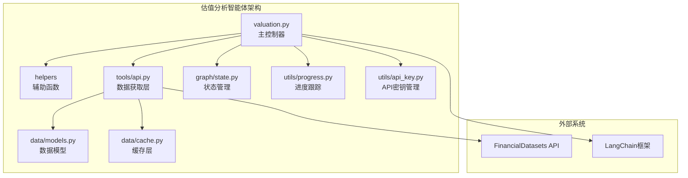

**图表来源**
- [valuation.py:1-495](file://src/agents/valuation.py#L1-L495)
- [api.py:1-367](file://src/tools/api.py#L1-L367)
- [models.py:1-175](file://src/data/models.py#L1-L175)

**章节来源**
- [valuation.py:1-495](file://src/agents/valuation.py#L1-L495)
- [api.py:1-367](file://src/tools/api.py#L1-L367)
- [models.py:1-175](file://src/data/models.py#L1-L175)

## 核心组件

### 主要组件概述

估值分析智能体由以下核心组件构成：

1. **主控制器** (`valuation_analyst_agent`)
   - 协调整个估值流程
   - 管理多模型估值计算
   - 生成投资信号和置信度

2. **数据获取层** (`tools/api.py`)
   - 集成FinancialDatasets API
   - 实现数据缓存机制
   - 提供错误处理和重试逻辑

3. **估值算法库** (`calculate_*`函数)
   - 增强型DCF模型
   - 巴菲特式所有者收益模型
   - 可比公司估值法
   - 残差收入模型

4. **状态管理系统** (`graph/state.py`)
   - 维护代理状态
   - 支持链式调用
   - 管理消息传递

**章节来源**
- [valuation.py:21-220](file://src/agents/valuation.py#L21-L220)
- [api.py:99-181](file://src/tools/api.py#L99-L181)
- [state.py:15-18](file://src/graph/state.py#L15-L18)

## 架构概览

估值分析智能体采用分层架构设计，确保模块化和可扩展性：

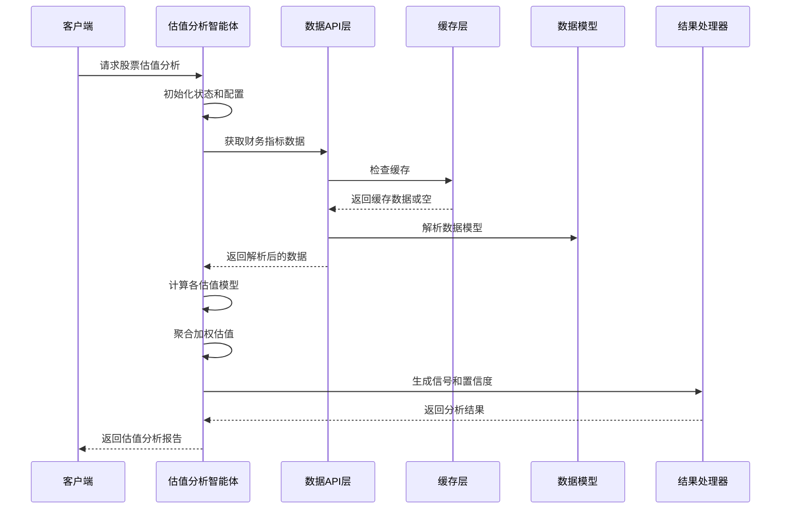

**图表来源**
- [valuation.py:34-121](file://src/agents/valuation.py#L34-L121)
- [api.py:29-61](file://src/tools/api.py#L29-L61)
- [cache.py:1-72](file://src/data/cache.py#L1-L72)

**章节来源**
- [valuation.py:21-220](file://src/agents/valuation.py#L21-L220)
- [api.py:63-138](file://src/tools/api.py#L63-L138)

## 详细组件分析

### 主控制器分析

主控制器`valuation_analyst_agent`是整个估值系统的核心协调器：

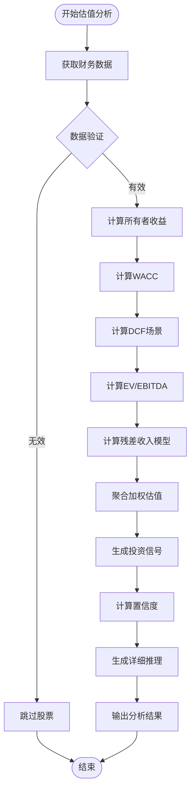

**图表来源**
- [valuation.py:31-220](file://src/agents/valuation.py#L31-L220)

#### 关键参数配置

智能体使用可配置的权重分配策略：

| 估值方法 | 权重 | 用途 |
|---------|------|------|
| DCF增强模型 | 35% | 核心现金流折现估值 |
| 所有者收益模型 | 35% | 巴菲特式现金流评估 |
| EV/EBITDA倍数法 | 20% | 可比公司相对估值 |
| 残差收入模型 | 10% | 账面价值增长评估 |

**章节来源**
- [valuation.py:144-164](file://src/agents/valuation.py#L144-L164)

### 数据获取与处理

数据获取层实现了完整的数据管道，包括缓存、解析和错误处理：

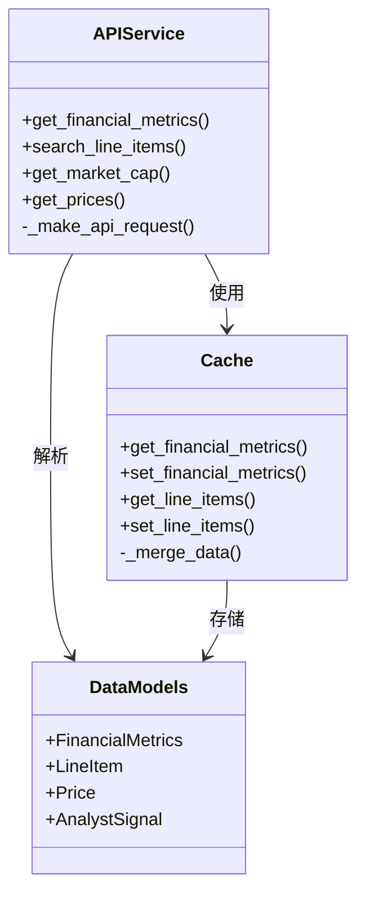

**图表来源**
- [api.py:99-181](file://src/tools/api.py#L99-L181)
- [cache.py:1-72](file://src/data/cache.py#L1-L72)
- [models.py:18-80](file://src/data/models.py#L18-L80)

**章节来源**
- [api.py:99-181](file://src/tools/api.py#L99-L181)
- [cache.py:1-72](file://src/data/cache.py#L1-L72)

## 估值模型详解

### 增强型DCF折现现金流估值

增强型DCF模型是估值系统的核心，采用了多阶段增长预测和情景分析：

#### 折现现金流计算流程

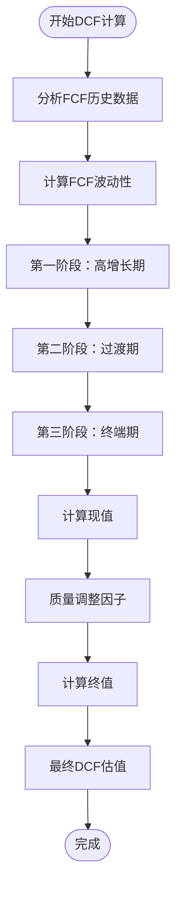

**图表来源**
- [valuation.py:394-448](file://src/agents/valuation.py#L394-L448)

#### 多情景估值分析

智能体实现了三种情景的DCF估值：

| 情景 | 增长率调整 | WACC调整 | 终值调整 | 权重 |
|------|------------|----------|----------|------|
| 熊市情景 | 50% | 120% | 80% | 20% |
| 基准情景 | 100% | 100% | 100% | 60% |
| 牛市情景 | 150% | 90% | 120% | 20% |

**章节来源**
- [valuation.py:451-494](file://src/agents/valuation.py#L451-L494)

### 巴菲特式所有者收益估值

所有者收益模型基于沃伦·巴菲特的投资理念，专注于企业为股东创造的真实现金流：

#### 所有者收益计算公式

所有者收益 = 净收入 + 折旧摊销 - 资本支出 - 净运营资本变化

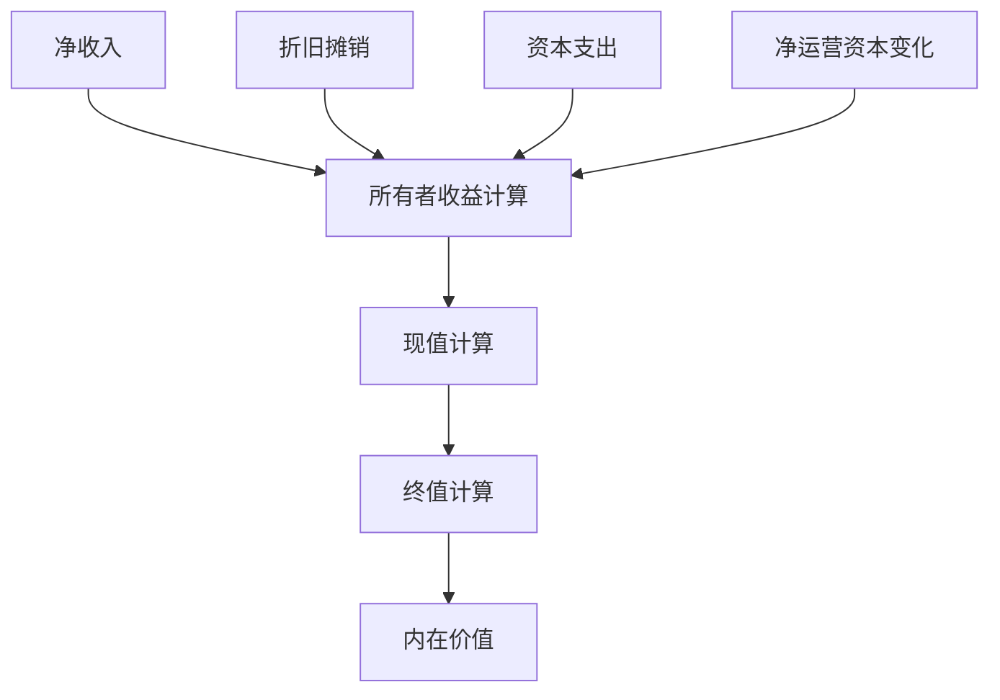

**图表来源**
- [valuation.py:226-256](file://src/agents/valuation.py#L226-L256)

#### 关键假设参数

| 参数 | 默认值 | 说明 |
|------|--------|------|
| 必要回报率 | 15% | 投资者要求的最低回报 |
| 成长期 | 5年 | 高增长阶段持续时间 |
| 终值增长率 | ≤3% | 长期可持续增长率上限 |
| 安全边际 | 25% | 折扣以降低风险 |

**章节来源**
- [valuation.py:226-256](file://src/agents/valuation.py#L226-L256)

### EV/EBITDA可比公司估值法

EV/EBITDA倍数法通过比较同行业公司的估值倍数来确定目标公司的合理价值：

#### 中位数倍数法计算流程

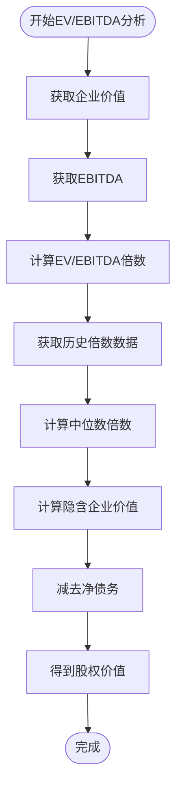

**图表来源**
- [valuation.py:283-299](file://src/agents/valuation.py#L283-L299)

#### 倍数选择策略

智能体使用统计学方法选择合适的倍数：
- 计算历史倍数的中位数，减少异常值影响
- 仅使用正倍数样本，避免负EBITDA的影响
- 支持跨时间维度的历史趋势分析

**章节来源**
- [valuation.py:283-299](file://src/agents/valuation.py#L283-L299)

### 残差收入模型

残差收入模型基于Edwards-Bell-Ohlson框架，评估企业的账面价值增长潜力：

#### 残差收入计算流程

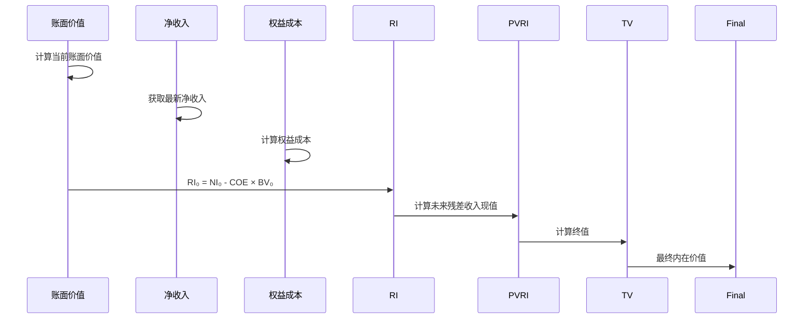

**图表来源**
- [valuation.py:302-331](file://src/agents/valuation.py#L302-L331)

#### 关键参数设置

| 参数 | 默认值 | 说明 |
|------|--------|------|
| 权益成本 | 10% | 股东要求的回报率 |
| 账面价值增长率 | 3% | 长期可持续增长率 |
| 终值增长率 | 3% | 与权益成本相匹配 |
| 安全边际 | 20% | 降低估值风险 |

**章节来源**
- [valuation.py:302-331](file://src/agents/valuation.py#L302-L331)

## 敏感性分析与风险评估

### 折现率敏感性分析

智能体实现了动态折现率计算，考虑公司财务状况和市场环境：

#### WACC计算模型

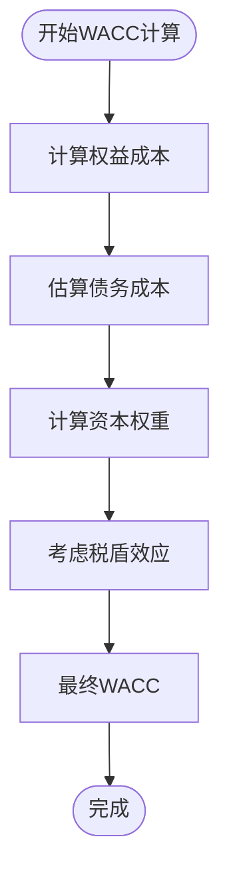

**图表来源**
- [valuation.py:338-373](file://src/agents/valuation.py#L338-L373)

#### 折现率参数范围

| 参数 | 最小值 | 默认值 | 最大值 | 说明 |
|------|--------|--------|--------|------|
| 无风险利率 | 2% | 4.5% | 6% | 市场基准利率 |
| 股权风险溢价 | 4% | 6% | 8% | 市场风险补偿 |
| Beta系数 | 0.5 | 1.0 | 1.5 | 公司系统性风险 |
| 税率 | 20% | 25% | 30% | 企业所得税率 |
| 债务成本 | 4% | 6% | 10% | 基于利息覆盖率估算 |

**章节来源**
- [valuation.py:338-373](file://src/agents/valuation.py#L338-L373)

### FCF波动性分析

智能体通过统计方法量化自由现金流的不确定性：

#### FCF波动性计算

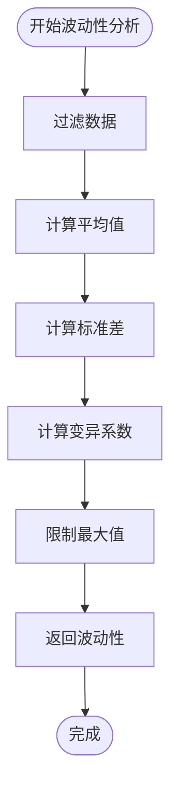

**图表来源**
- [valuation.py:376-391](file://src/agents/valuation.py#L376-L391)

#### 波动性调整因子

| FCF波动性 | 调整因子 | 说明 |
|-----------|----------|------|
| 低波动性 (<20%) | 1.0 | 稳定现金流，无需调整 |
| 中等波动性 (20-50%) | 0.9 | 适度风险，轻微调整 |
| 高波动性 (50-80%) | 0.7 | 高风险，显著调整 |
| 极高波动性 (>80%) | 0.5 | 极高风险，大幅调整 |

**章节来源**
- [valuation.py:376-391](file://src/agents/valuation.py#L376-L391)

### 估值区间计算机制

智能体通过多情景分析生成估值区间：

#### 估值区间计算流程

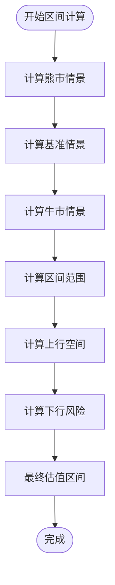

**图表来源**
- [valuation.py:451-494](file://src/agents/valuation.py#L451-L494)

#### 区间分析指标

| 指标 | 计算方法 | 用途 |
|------|----------|------|
| 估值区间 | 牛市价 - 熊市价 | 显示估值不确定性范围 |
| 上行空间 | 牛市价 - 当前价 | 评估上涨潜力 |
| 下行风险 | 当前价 - 熊市价 | 评估下跌风险 |
| 波动率 | 区间范围 / 平均价 | 量化价格波动程度 |

**章节来源**
- [valuation.py:451-494](file://src/agents/valuation.py#L451-L494)

## 性能考量

### 数据缓存优化

系统实现了多层次的数据缓存机制，显著提升性能：

#### 缓存策略

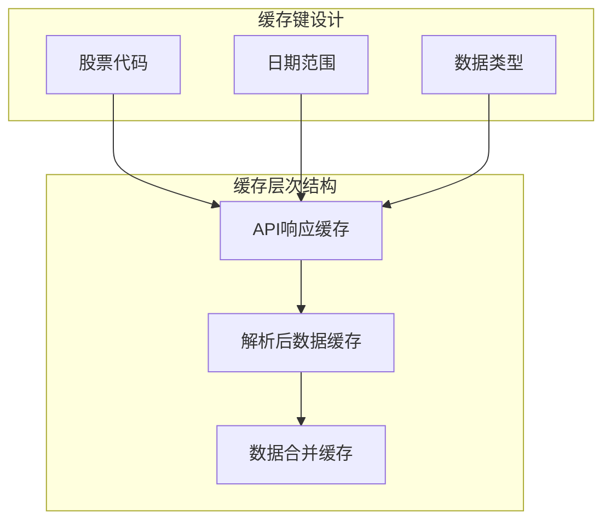

**图表来源**
- [cache.py:11-22](file://src/data/cache.py#L11-L22)
- [api.py:107-137](file://src/tools/api.py#L107-L137)

#### 性能优化措施

1. **智能缓存键设计**：结合股票代码、日期范围和数据类型创建唯一缓存键
2. **增量数据合并**：避免重复请求，支持历史数据的增量更新
3. **批量数据处理**：支持多股票并行处理，提高吞吐量
4. **内存管理**：定期清理过期缓存，控制内存使用

**章节来源**
- [cache.py:1-72](file://src/data/cache.py#L1-L72)
- [api.py:29-61](file://src/tools/api.py#L29-L61)

### 错误处理与容错

系统实现了完善的错误处理机制：

#### 错误处理流程

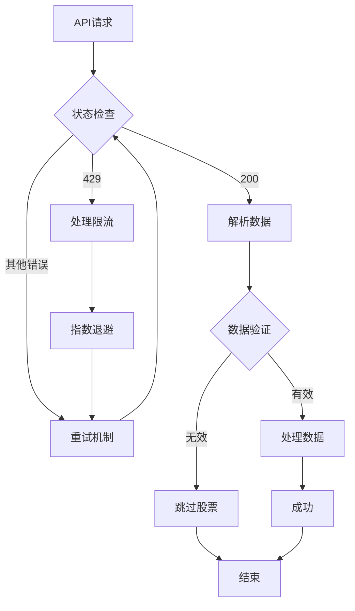

**图表来源**
- [api.py:29-61](file://src/tools/api.py#L29-L61)

#### 重试策略

| 尝试次数 | 延迟时间 | 说明 |
|----------|----------|------|
| 第1次 | 60秒 | 初始延迟 |
| 第2次 | 90秒 | 线性递增 |
| 第3次 | 120秒 | 最大延迟 |
| 第4次 | 150秒 | 最终尝试 |

**章节来源**
- [api.py:29-61](file://src/tools/api.py#L29-L61)

## 故障排除指南

### 常见问题诊断

#### 数据获取失败

**症状**：估值分析显示"无财务指标数据"或"财务报表项不足"

**可能原因**：
1. API密钥配置错误
2. 网络连接问题
3. 股票代码不存在
4. 数据权限限制

**解决方案**：
1. 验证API密钥配置
2. 检查网络连接状态
3. 确认股票代码有效性
4. 查看API配额使用情况

#### 估值结果异常

**症状**：估值结果为零或异常高

**可能原因**：
1. 财务数据缺失
2. 参数设置不当
3. 模型假设不适用
4. 数据质量问题

**解决方案**：
1. 检查财务数据完整性
2. 调整模型参数
3. 选择更适合的估值方法
4. 清洗和验证数据质量

#### 性能问题

**症状**：估值分析执行缓慢

**可能原因**：
1. 缓存未生效
2. API请求过多
3. 数据处理复杂度高
4. 内存不足

**解决方案**：
1. 检查缓存配置
2. 优化API请求频率
3. 减少不必要的数据处理
4. 增加系统资源

**章节来源**
- [valuation.py:41-43](file://src/agents/valuation.py#L41-L43)
- [valuation.py:69-71](file://src/agents/valuation.py#L69-L71)

### 调试工具使用

系统提供了多种调试和监控工具：

#### 进度跟踪

智能体使用Rich库实现实时进度显示，包含以下信息：
- 当前处理的股票代码
- 当前执行的步骤
- 处理状态（进行中/完成/错误）
- 详细分析结果

#### 日志记录

系统在关键节点记录详细日志，便于问题诊断：
- API请求和响应
- 数据解析过程
- 计算结果摘要
- 错误堆栈信息

**章节来源**
- [progress.py:44-64](file://src/utils/progress.py#L44-L64)

## 结论

估值分析智能体通过整合多种估值理论和现代数据技术，为投资者提供了全面、可靠的股票估值解决方案。该系统的主要优势包括：

1. **多模型融合**：结合现金流、相对估值和资产基础等多种方法，提供更准确的估值结果
2. **动态参数调整**：根据公司特征和市场环境自动调整估值参数
3. **风险量化**：通过敏感性分析和情景模拟量化投资风险
4. **实时数据集成**：与FinancialDatasets API深度集成，确保数据时效性
5. **可扩展架构**：模块化设计支持新估值方法的快速集成

该智能体特别适用于需要综合分析和风险管理的专业投资者，能够帮助识别被低估或高估的投资机会，为投资决策提供科学依据。