# 基本面分析智能体

<cite>
**本文档引用的文件**
- [fundamentals.py](file://src/agents/fundamentals.py)
- [valuation.py](file://src/agents/valuation.py)
- [models.py](file://src/data/models.py)
- [api.py](file://src/tools/api.py)
- [cache.py](file://src/data/cache.py)
- [state.py](file://src/graph/state.py)
- [api_key.py](file://src/utils/api_key.py)
- [progress.py](file://src/utils/progress.py)
- [AAPL_2024-03-01_2024-03-08.json](file://tests/fixtures/api/financial_metrics/AAPL_2024-03-01_2024-03-08.json)
</cite>

## 目录
1. [简介](#简介)
2. [项目结构](#项目结构)
3. [核心组件](#核心组件)
4. [架构概览](#架构概览)
5. [详细组件分析](#详细组件分析)
6. [依赖关系分析](#依赖关系分析)
7. [性能考虑](#性能考虑)
8. [故障排除指南](#故障排除指南)
9. [结论](#结论)

## 简介

基本面分析智能体是AI对冲基金系统中的核心分析组件，专门负责通过多维度财务数据分析来评估企业内在价值。该智能体集成了四种互补的估值方法：所有者收益估值法、增强型现金流折现模型、企业价值/息税前利润倍数法和剩余收益模型，并结合传统财务指标进行综合判断。

该系统能够自动获取财务数据、执行数据清洗和标准化处理，然后基于ROE、ROA、毛利率、净利率等盈利能力指标，营收增长率、利润增长率等成长性指标，资产负债率、流动比率、速动比率等偿债能力指标，以及存货周转率、应收账款周转率等运营效率指标进行全面分析。

## 项目结构

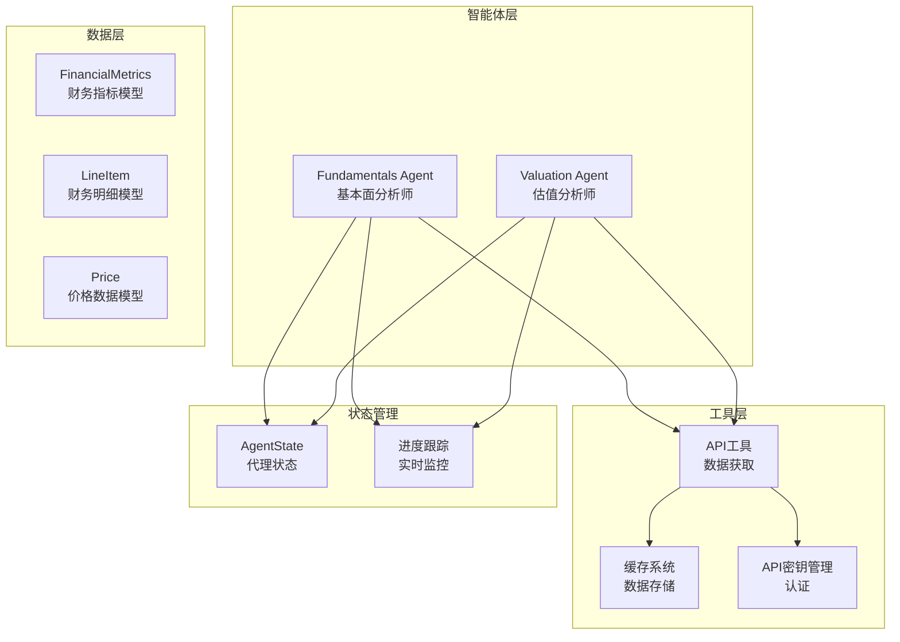

**图表来源**
- [fundamentals.py:1-164](file://src/agents/fundamentals.py#L1-L164)
- [valuation.py:21-220](file://src/agents/valuation.py#L21-L220)
- [models.py:18-80](file://src/data/models.py#L18-L80)

**章节来源**
- [fundamentals.py:10-164](file://src/agents/fundamentals.py#L10-L164)
- [valuation.py:21-220](file://src/agents/valuation.py#L21-L220)
- [models.py:18-80](file://src/data/models.py#L18-L80)

## 核心组件

### 财务指标数据模型

系统使用Pydantic模型定义了完整的财务指标数据结构，包括盈利能力、成长性、偿债能力和运营效率等维度的关键指标。

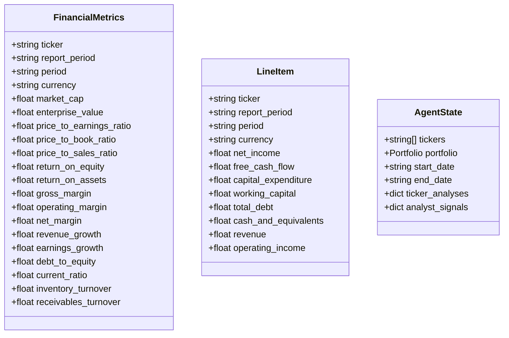

**图表来源**
- [models.py:18-80](file://src/data/models.py#L18-L80)
- [models.py:164-175](file://src/data/models.py#L164-L175)

### 数据获取与缓存系统

系统实现了智能的数据获取和缓存机制，确保高效的数据访问和重复使用的优化。

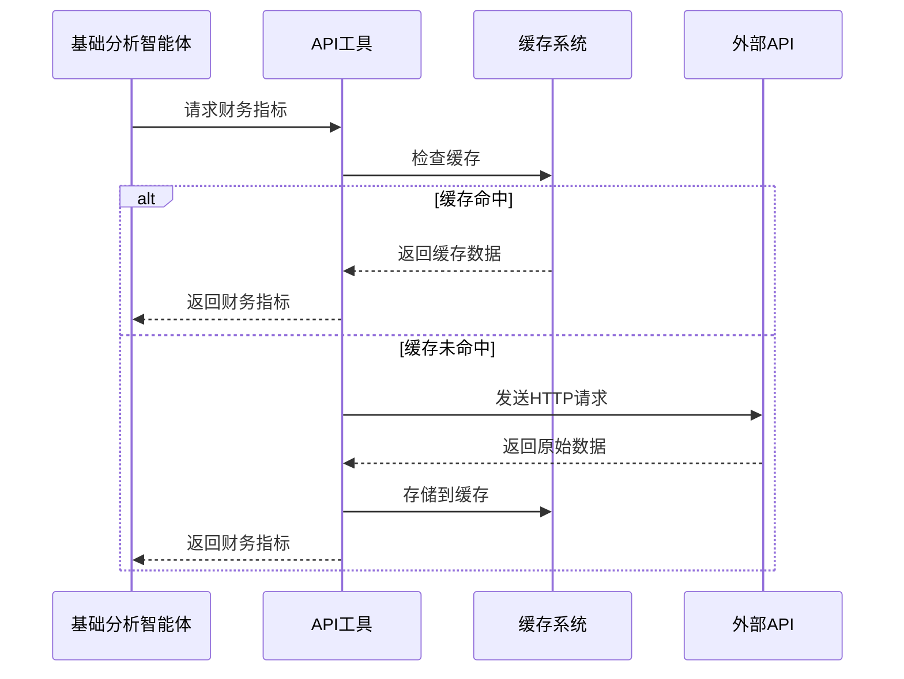

**图表来源**
- [api.py:99-139](file://src/tools/api.py#L99-L139)
- [cache.py:32-38](file://src/data/cache.py#L32-L38)

**章节来源**
- [models.py:18-80](file://src/data/models.py#L18-L80)
- [api.py:99-139](file://src/tools/api.py#L99-L139)
- [cache.py:1-72](file://src/data/cache.py#L1-L72)

## 架构概览

### 多维度分析框架

基本面分析智能体采用四层分析框架，每层都有特定的关注重点和阈值标准：

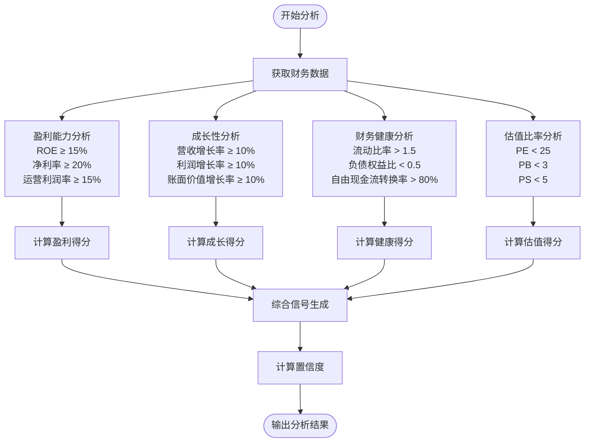

**图表来源**
- [fundamentals.py:44-119](file://src/agents/fundamentals.py#L44-L119)

### 估值模型集成

估值分析师智能体集成了四种互补的估值方法，每种方法都有特定的优势和适用场景：

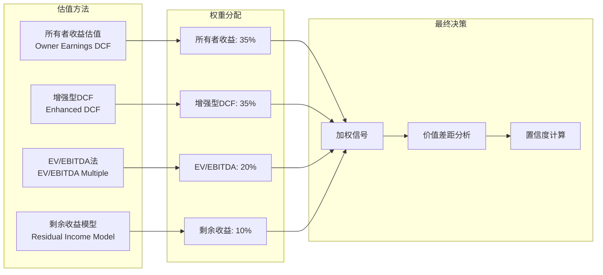

**图表来源**
- [valuation.py:144-165](file://src/agents/valuation.py#L144-L165)

**章节来源**
- [fundamentals.py:44-131](file://src/agents/fundamentals.py#L44-L131)
- [valuation.py:144-220](file://src/agents/valuation.py#L144-L220)

## 详细组件分析

### 基础分析智能体

基础分析智能体专注于传统的财务比率分析，通过四个核心维度评估企业的财务健康状况。

#### 盈利能力分析

盈利能力分析使用三个关键指标进行评分：
- **净资产收益率(ROE)**: 衡量股东投资回报率，阈值为15%
- **净利率**: 反映公司盈利能力，阈值为20%
- **运营利润率**: 衡量核心业务盈利能力，阈值为15%

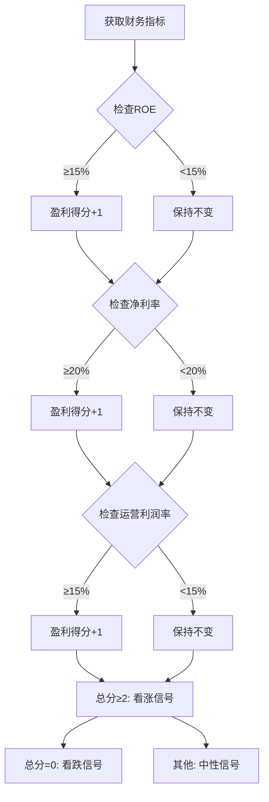

**图表来源**
- [fundamentals.py:44-60](file://src/agents/fundamentals.py#L44-L60)

#### 成长性分析

成长性分析关注公司的增长潜力，使用三个增长率指标：
- **营收增长率**: 阈值10%，反映市场扩张能力
- **利润增长率**: 阈值10%，衡量盈利能力提升
- **账面价值增长率**: 阈值10%，评估资产增值

#### 财务健康分析

财务健康分析评估公司的偿债能力和流动性状况：
- **流动比率**: >1.5表示短期偿债能力强
- **负债权益比**: <0.5表示财务结构稳健
- **自由现金流转换率**: >80%表示经营现金流充足

#### 估值比率分析

估值比率分析使用相对估值方法：
- **市盈率(P/E)**: <25表示估值合理
- **市净率(P/B)**: <3表示估值合理
- **市销率(P/S)**: <5表示估值合理

**章节来源**
- [fundamentals.py:44-119](file://src/agents/fundamentals.py#L44-L119)

### 估值分析智能体

估值分析智能体采用多模型融合的方法，提供更全面的内在价值评估。

#### 所有者收益DCF模型

所有者收益DCF模型基于巴菲特的投资理念，使用自由现金流的替代指标：

**计算公式**：
所有者收益 = 净收入 + 折旧摊销 - 资本支出 - 净运营资本变动

折现现金流 = Σ[所有者收益 × (1 + g)^t / (1 + r)^t] + 终值/(1 + r)^n

其中：
- g = 持续增长率（通常取5%）
- r = 折现率（通常取15%）
- n = 预测期（通常取5年）

#### 增强型DCF模型

增强型DCF模型考虑了现金流的波动性和不确定性：

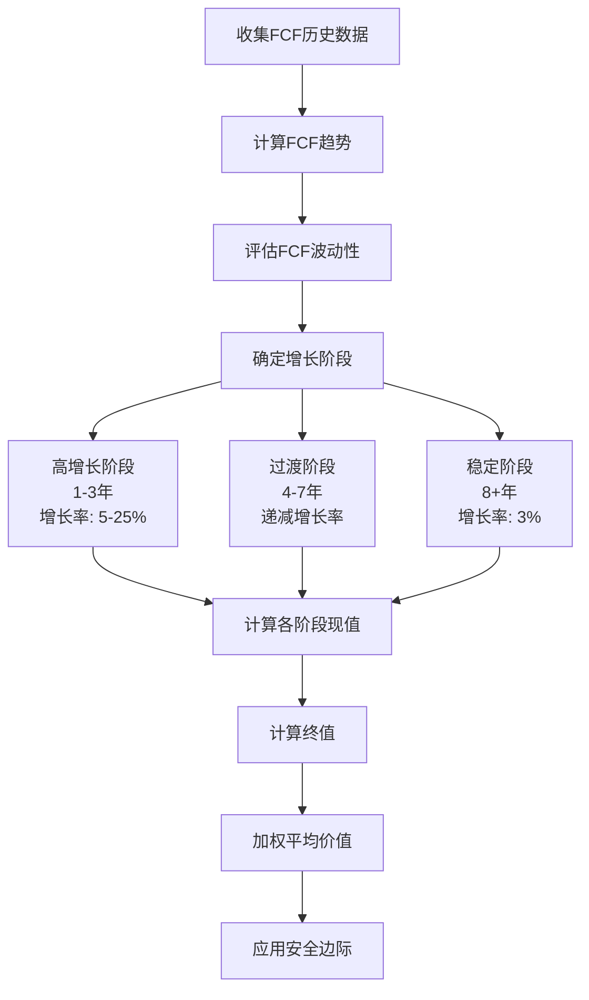

**图表来源**
- [valuation.py:451-494](file://src/agents/valuation.py#L451-L494)

#### WACC计算模型

WACC（加权平均资本成本）是DCF模型的核心参数：

**计算步骤**：
1. 计算股权成本（CAPM模型）
2. 估算债务成本（基于利息保障倍数）
3. 确定资本结构权重
4. 应用税盾效应

**公式**：WACC = We × Re + Wd × Rd × (1 - Tc)

其中：
- We = 股权权重
- Re = 股权成本
- Wd = 债务权重
- Rd = 债务成本
- Tc = 公司税率

#### EV/EBITDA倍数法

EV/EBITDA倍数法使用行业中位数进行估值：

**计算公式**：企业价值 = 当前EBITDA × 行业中位数倍数

**章节来源**
- [valuation.py:226-331](file://src/agents/valuation.py#L226-L331)
- [valuation.py:338-373](file://src/agents/valuation.py#L338-L373)
- [valuation.py:451-494](file://src/agents/valuation.py#L451-L494)

### 数据质量控制机制

系统实施了多层次的数据质量控制措施：

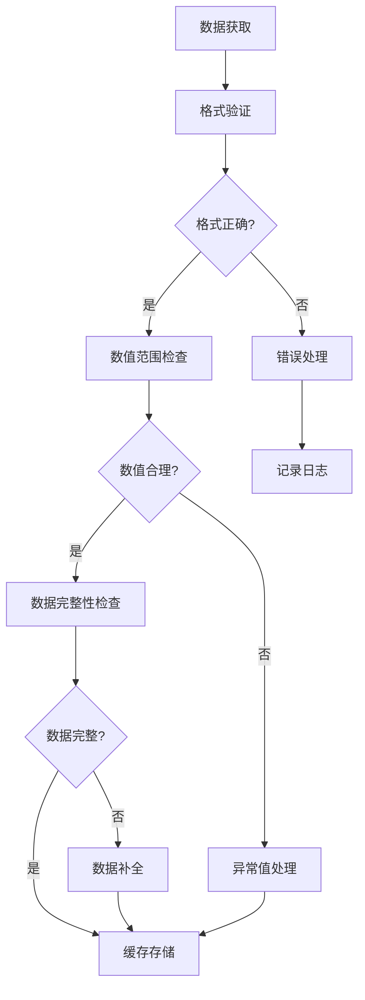

**图表来源**
- [api.py:29-61](file://src/tools/api.py#L29-L61)

**章节来源**
- [api.py:29-61](file://src/tools/api.py#L29-L61)
- [cache.py:11-22](file://src/data/cache.py#L11-L22)

## 依赖关系分析

### 组件间依赖关系

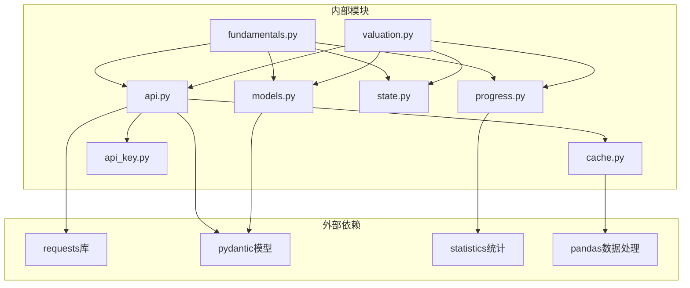

**图表来源**
- [fundamentals.py:1-8](file://src/agents/fundamentals.py#L1-L8)
- [valuation.py:9-20](file://src/agents/valuation.py#L9-L20)
- [api.py:1-27](file://src/tools/api.py#L1-L27)

### 数据流分析

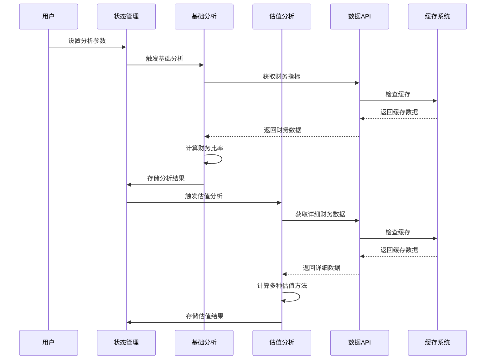

**图表来源**
- [state.py:14-19](file://src/graph/state.py#L14-L19)
- [fundamentals.py:11-164](file://src/agents/fundamentals.py#L11-L164)
- [valuation.py:21-220](file://src/agents/valuation.py#L21-L220)

**章节来源**
- [state.py:14-52](file://src/graph/state.py#L14-L52)
- [fundamentals.py:11-164](file://src/agents/fundamentals.py#L11-L164)
- [valuation.py:21-220](file://src/agents/valuation.py#L21-L220)

## 性能考虑

### 缓存策略优化

系统采用了智能缓存策略来提高性能：

1. **多级缓存结构**：分别缓存价格数据、财务指标和财务明细
2. **去重合并机制**：避免重复数据存储
3. **精确键匹配**：确保缓存键包含所有必要参数
4. **内存管理**：使用字典结构实现O(1)查找时间

### 并发处理

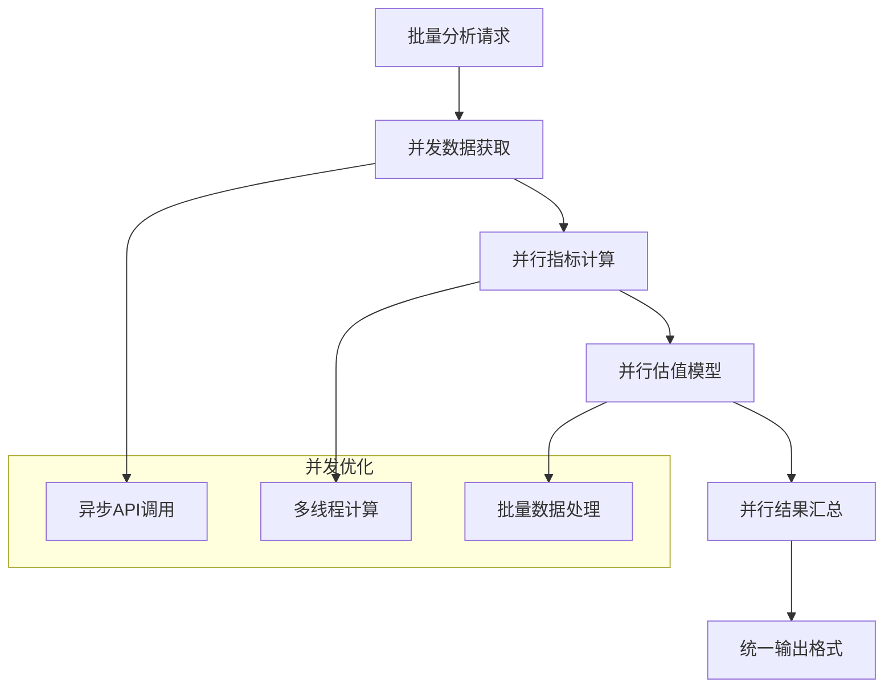

### 错误处理与重试机制

系统实现了完善的错误处理机制：

1. **HTTP状态码处理**：针对不同状态码采取相应措施
2. **速率限制处理**：自动处理429状态码，实施指数退避
3. **数据验证**：使用Pydantic模型进行数据结构验证
4. **降级策略**：在API不可用时使用缓存数据

**章节来源**
- [cache.py:1-72](file://src/data/cache.py#L1-L72)
- [api.py:29-61](file://src/tools/api.py#L29-L61)

## 故障排除指南

### 常见问题诊断

#### API连接问题

**症状**：无法获取财务数据
**可能原因**：
- API密钥无效或过期
- 网络连接不稳定
- 速率限制触发

**解决方案**：
1. 验证API密钥配置
2. 检查网络连接状态
3. 实施适当的延迟重试

#### 数据格式错误

**症状**：数据解析失败
**可能原因**：
- API响应格式变化
- 数据类型不匹配
- 缺失必填字段

**解决方案**：
1. 更新Pydantic模型定义
2. 实施数据验证逻辑
3. 添加默认值处理

#### 内存使用过高

**症状**：系统运行缓慢或崩溃
**可能原因**：
- 缓存数据过多
- 数据结构设计不当
- 缺少垃圾回收

**解决方案**：
1. 实施缓存大小限制
2. 优化数据结构
3. 定期清理缓存

**章节来源**
- [api.py:29-61](file://src/tools/api.py#L29-L61)
- [cache.py:1-72](file://src/data/cache.py#L1-L72)

## 结论

基本面分析智能体通过整合多维度财务分析和多种估值方法，为企业价值评估提供了全面而深入的洞察。该系统的主要优势包括：

1. **多维度分析**：涵盖盈利能力、成长性、财务健康和估值合理性四个核心维度
2. **模型融合**：结合传统财务分析和现代估值技术
3. **数据质量保证**：完善的缓存机制和数据验证
4. **实时监控**：进度跟踪和状态显示功能
5. **可扩展性**：模块化设计便于功能扩展和维护

该智能体为AI对冲基金的投资决策提供了坚实的数据基础和技术支撑，能够有效识别具有内在价值的投资机会并规避潜在风险。