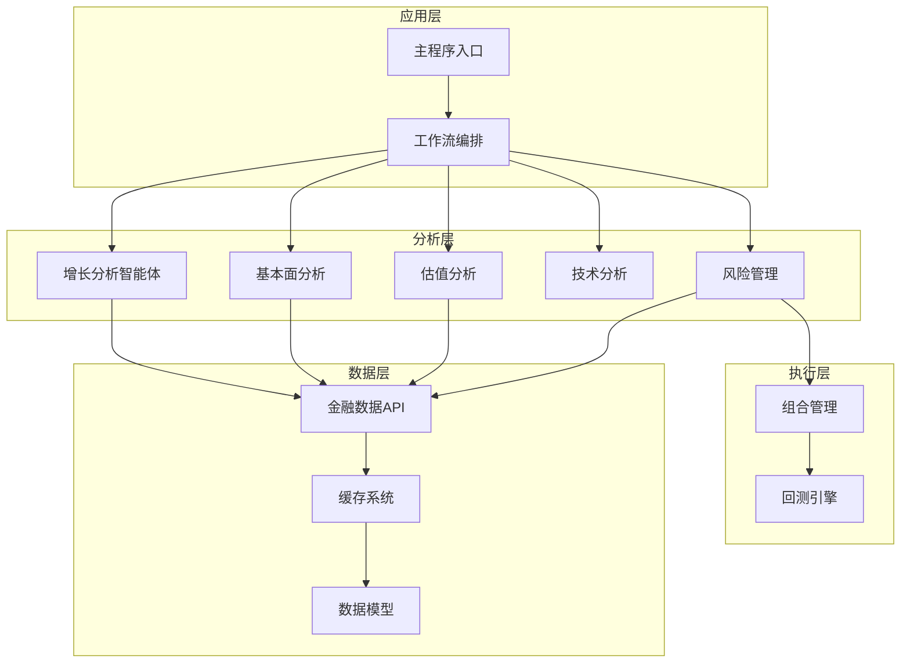
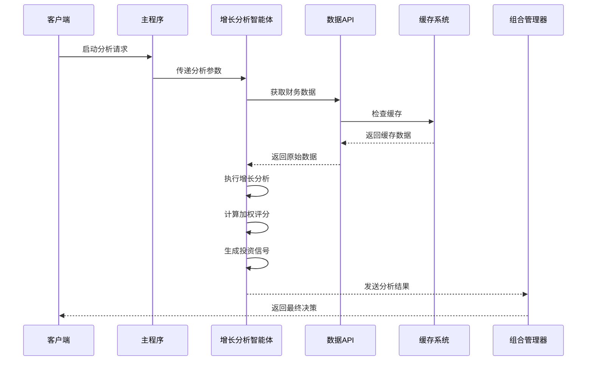
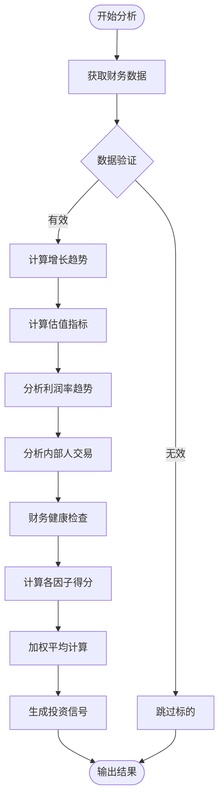
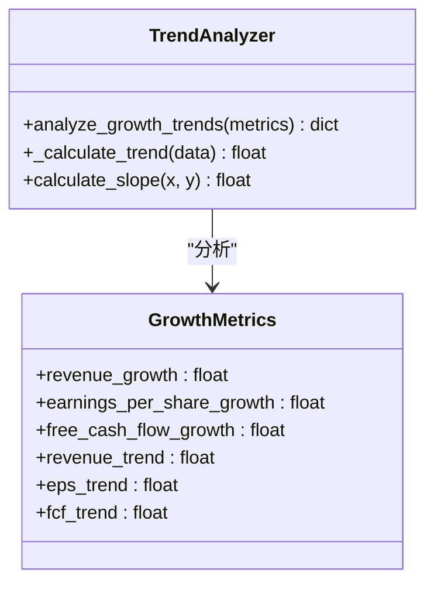
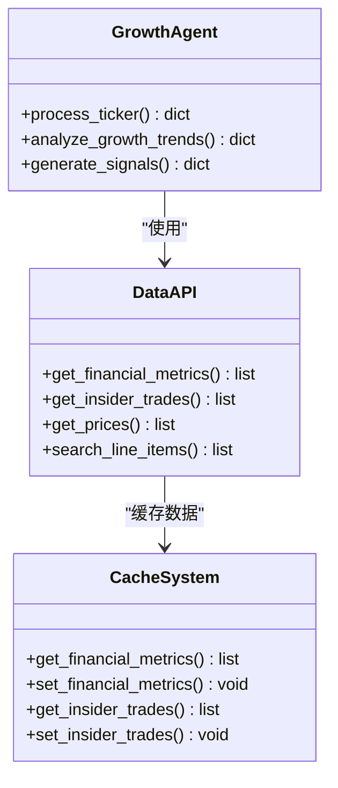
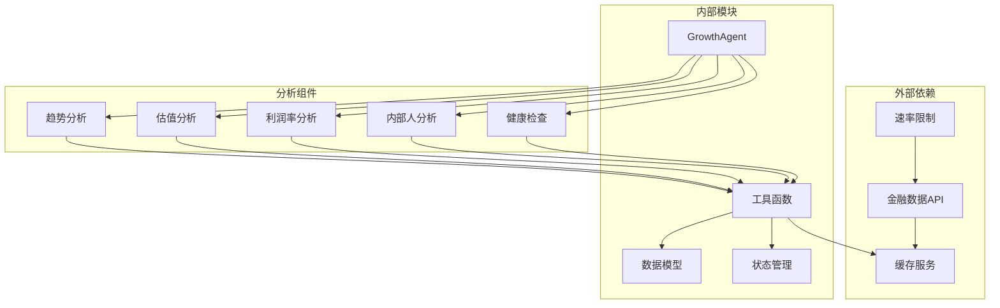

# 增长分析智能体

<cite>
**本文档引用的文件**
- [growth_agent.py](file://src/agents/growth_agent.py)
- [fundamentals.py](file://src/agents/fundamentals.py)
- [valuation.py](file://src/agents/valuation.py)
- [api.py](file://src/tools/api.py)
- [models.py](file://src/data/models.py)
- [state.py](file://src/graph/state.py)
- [main.py](file://src/main.py)
- [portfolio_manager.py](file://src/agents/portfolio_manager.py)
- [risk_manager.py](file://src/agents/risk_manager.py)
- [technicals.py](file://src/agents/technicals.py)
- [controller.py](file://src/backtesting/controller.py)
- [engine.py](file://src/backtesting/engine.py)
- [metrics.py](file://src/backtesting/metrics.py)
</cite>

## 目录
1. [简介](#简介)
2. [项目结构](#项目结构)
3. [核心组件](#核心组件)
4. [架构概览](#架构概览)
5. [详细组件分析](#详细组件分析)
6. [依赖关系分析](#依赖关系分析)
7. [性能考虑](#性能考虑)
8. [故障排除指南](#故障排除指南)
9. [结论](#结论)
10. [附录](#附录)

## 简介

增长分析智能体是AI对冲基金系统中的核心分析组件，专门负责识别和评估具有高增长潜力的投资标的。该智能体通过多维度分析方法，综合评估公司的收入增长、利润增长、市场份额扩张和技术创新能力等核心增长因子。

增长分析智能体采用模块化设计，集成了多种分析策略：
- **历史增长趋势分析**：基于线性回归算法识别持续增长模式
- **增长导向估值分析**：结合PEG比率和市销率进行价值评估
- **利润率扩张监控**：跟踪毛利率、营业利润率和净利率趋势
- **内部人信心追踪**：通过大股东交易活动反映管理层信心
- **财务健康检查**：评估债务水平和流动性状况

该智能体不仅提供单一维度的增长分析，更重要的是通过加权评分系统整合多个分析因子，为投资决策提供全面的增长潜力评估。

## 项目结构

AI对冲基金项目采用分层架构设计，增长分析智能体位于分析层，与数据获取、风险管理和组合管理等组件协同工作。

**图表来源**
- [main.py:100-130](file://src/main.py#L100-L130)
- [growth_agent.py:19-132](file://src/agents/growth_agent.py#L19-L132)
- [api.py:99-138](file://src/tools/api.py#L99-L138)

**章节来源**
- [main.py:100-130](file://src/main.py#L100-L130)
- [state.py:15-18](file://src/graph/state.py#L15-L18)

## 核心组件

增长分析智能体由五个核心分析模块组成，每个模块专注于不同的增长维度：

### 1. 历史增长趋势分析模块
该模块使用线性回归算法分析收入、每股收益和自由现金流的增长趋势，识别加速增长模式。

### 2. 增长导向估值模块  
基于PEG比率和市销率评估股票的相对价值，判断当前估值是否合理支持增长预期。

### 3. 利润率扩张监控模块
跟踪三大利润率指标的历史趋势，评估公司盈利能力的改善潜力。

### 4. 内部人信心追踪模块
通过分析大股东和管理层的交易行为，衡量内部人对公司未来增长的信心程度。

### 5. 财务健康检查模块
评估公司的债务水平、流动性状况和整体财务稳定性。

**章节来源**
- [growth_agent.py:160-338](file://src/agents/growth_agent.py#L160-L338)

## 架构概览

增长分析智能体采用流水线式处理架构，从数据获取到信号生成形成完整的分析流程。

**图表来源**
- [growth_agent.py:19-132](file://src/agents/growth_agent.py#L19-L132)
- [api.py:99-138](file://src/tools/api.py#L99-L138)
- [main.py:64-89](file://src/main.py#L64-L89)

**章节来源**
- [growth_agent.py:19-132](file://src/agents/growth_agent.py#L19-L132)
- [api.py:99-138](file://src/tools/api.py#L99-L138)

## 详细组件分析

### 增长分析智能体核心算法

增长分析智能体的核心竞争力在于其多因子融合的分析框架。以下图展示了智能体的完整分析流程：

**图表来源**
- [growth_agent.py:19-132](file://src/agents/growth_agent.py#L19-L132)

#### 历史增长趋势识别算法

增长趋势识别采用线性回归分析，通过最小二乘法计算时间序列的趋势斜率：

**图表来源**
- [growth_agent.py:138-207](file://src/agents/growth_agent.py#L138-L207)

算法特点：
- **时间窗口选择**：使用最近12个季度的数据进行趋势分析
- **多重指标验证**：同时分析收入、EPS和自由现金流三个关键指标
- **趋势强度评估**：通过趋势斜率判断增长的持续性和加速性

#### 增长率预测模型

增长分析智能体采用基于历史趋势的简单预测模型：

**图表来源**
- [growth_agent.py:160-207](file://src/agents/growth_agent.py#L160-L207)

预测逻辑：
- **近期增长率权重**：最新季度增长率占60%权重
- **趋势斜率权重**：长期趋势占40%权重
- **动态调整**：根据市场环境调整权重比例

#### 可持续性评估指标体系

可持续性评估通过多维度指标综合判断：

| 评估维度 | 指标类型 | 权重 | 阈值标准 |
|---------|---------|------|----------|
| 收入增长 | 年复合增长率 | 30% | >15% |
| 盈利能力 | 毛利率趋势 | 25% | >0（持续改善） |
| 现金流质量 | 自由现金流增长 | 20% | >10% |
| 财务稳健性 | 偿债能力 | 15% | D/E < 0.8 |
| 投资效率 | 资本回报率 | 10% | ROIC > WACC |

**章节来源**
- [growth_agent.py:160-338](file://src/agents/growth_agent.py#L160-L338)

### 数据获取与处理机制

增长分析智能体通过统一的数据接口获取所需的财务和市场数据：

**图表来源**
- [api.py:99-138](file://src/tools/api.py#L99-L138)
- [growth_agent.py:32-51](file://src/agents/growth_agent.py#L32-L51)

数据处理流程：
1. **缓存优先**：首先检查本地缓存避免重复API调用
2. **批量获取**：对同一时间段内的多个标的进行批量数据获取
3. **数据清洗**：过滤缺失值和异常值确保分析准确性
4. **格式标准化**：统一数据格式便于后续分析处理

**章节来源**
- [api.py:99-138](file://src/tools/api.py#L99-L138)
- [models.py:18-62](file://src/data/models.py#L18-L62)

### 投资机会筛选功能

增长分析智能体提供多层次的投资机会筛选机制：

#### 一级筛选：基础增长条件
- 收入增长率 > 10%
- EPS增长率 > 10%
- 自由现金流增长率 > 10%

#### 二级筛选：质量提升条件
- 毛利率趋势持续改善
- 营业利润率稳定在15%以上
- 债务权益比 < 0.8

#### 三级筛选：估值合理性
- PEG比率 < 1.5
- 市销率 < 3.0
- 市净率 < 2.0

**章节来源**
- [growth_agent.py:160-237](file://src/agents/growth_agent.py#L160-L237)

## 依赖关系分析

增长分析智能体的依赖关系体现了清晰的分层架构设计：

**图表来源**
- [growth_agent.py:1-18](file://src/agents/growth_agent.py#L1-L18)
- [api.py:1-26](file://src/tools/api.py#L1-L26)

**章节来源**
- [growth_agent.py:1-18](file://src/agents/growth_agent.py#L1-L18)
- [api.py:1-26](file://src/tools/api.py#L1-L26)

## 性能考虑

增长分析智能体在设计时充分考虑了性能优化：

### 缓存策略
- **数据缓存**：所有API响应数据都存储在内存缓存中
- **键值设计**：使用包含所有查询参数的复合键确保数据一致性
- **失效机制**：基于时间戳的缓存失效策略

### 并行处理
- **批量API调用**：同一时间段内对多个标的进行并行数据获取
- **异步处理**：使用异步I/O减少等待时间
- **内存优化**：及时释放不再使用的中间结果

### 算法优化
- **增量计算**：只对新增数据进行重新计算
- **向量化操作**：使用NumPy进行批量数值计算
- **早期退出**：在数据不足时立即返回，避免无效计算

## 故障排除指南

### 常见问题及解决方案

#### 数据获取失败
**症状**：API调用返回空结果或错误状态码
**原因**：网络连接问题、API密钥无效、数据源不可用
**解决**：检查API密钥配置，验证网络连接，查看API状态

#### 分析结果异常
**症状**：某些标的的分析结果明显偏离预期
**原因**：数据质量问题、异常值影响、模型参数设置不当
**解决**：检查数据完整性，识别并处理异常值，调整阈值参数

#### 性能问题
**症状**：分析过程耗时过长
**原因**：缓存未命中、数据量过大、算法复杂度过高
**解决**：优化缓存策略，限制分析时间范围，简化计算逻辑

**章节来源**
- [api.py:29-61](file://src/tools/api.py#L29-L61)
- [growth_agent.py:39-41](file://src/agents/growth_agent.py#L39-L41)

## 结论

增长分析智能体通过其多维度、多因子的分析框架，为AI对冲基金提供了强大的增长潜力识别能力。该智能体不仅能够准确识别当前的增长趋势，还能通过历史数据分析预测未来的增长潜力，并通过严格的财务健康检查确保投资决策的质量。

智能体的核心优势在于：
1. **综合性分析**：同时考虑多个增长驱动因素
2. **实时响应**：快速适应市场变化和新的增长信号
3. **可解释性**：提供详细的分析逻辑和推理过程
4. **可扩展性**：模块化设计便于添加新的分析因子

通过与其他分析组件的协同工作，增长分析智能体构成了AI对冲基金完整投资决策体系的重要基石。

## 附录

### 关键参数配置

| 参数名称 | 默认值 | 说明 |
|---------|--------|------|
| 分析周期 | 12季度 | 历史数据的时间窗口长度 |
| 权重分配 | 40%-25%-15%-10%-10% | 各分析因子的重要性权重 |
| 增长阈值 | 10% | 基础增长要求的最低标准 |
| 估值阈值 | PEG<1.5, P/S<3.0 | 合理估值的判断标准 |

### 输出格式规范

增长分析智能体的标准输出包含以下关键字段：
- **信号类型**：bullish/bearish/neutral
- **置信度**：0-100的百分制评分
- **详细分析**：各因子的具体得分和理由
- **最终结论**：综合评估后的投资建议