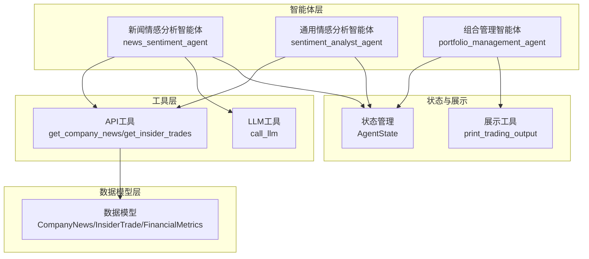
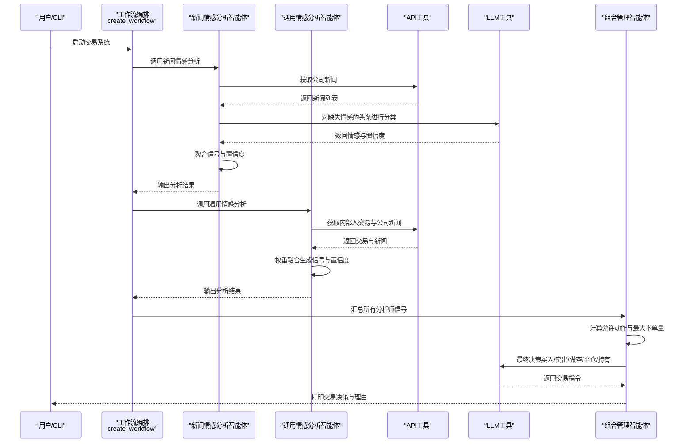
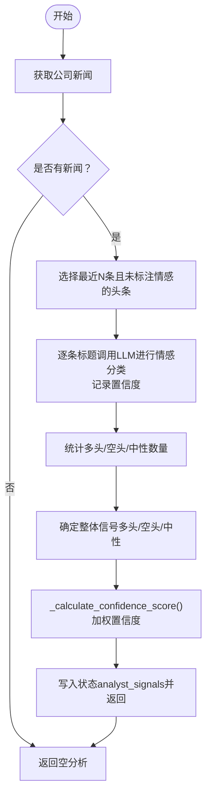
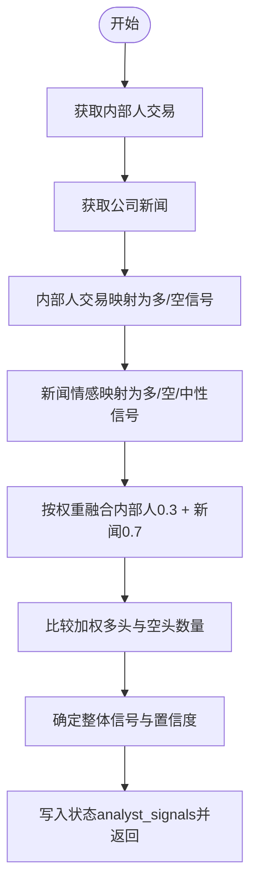
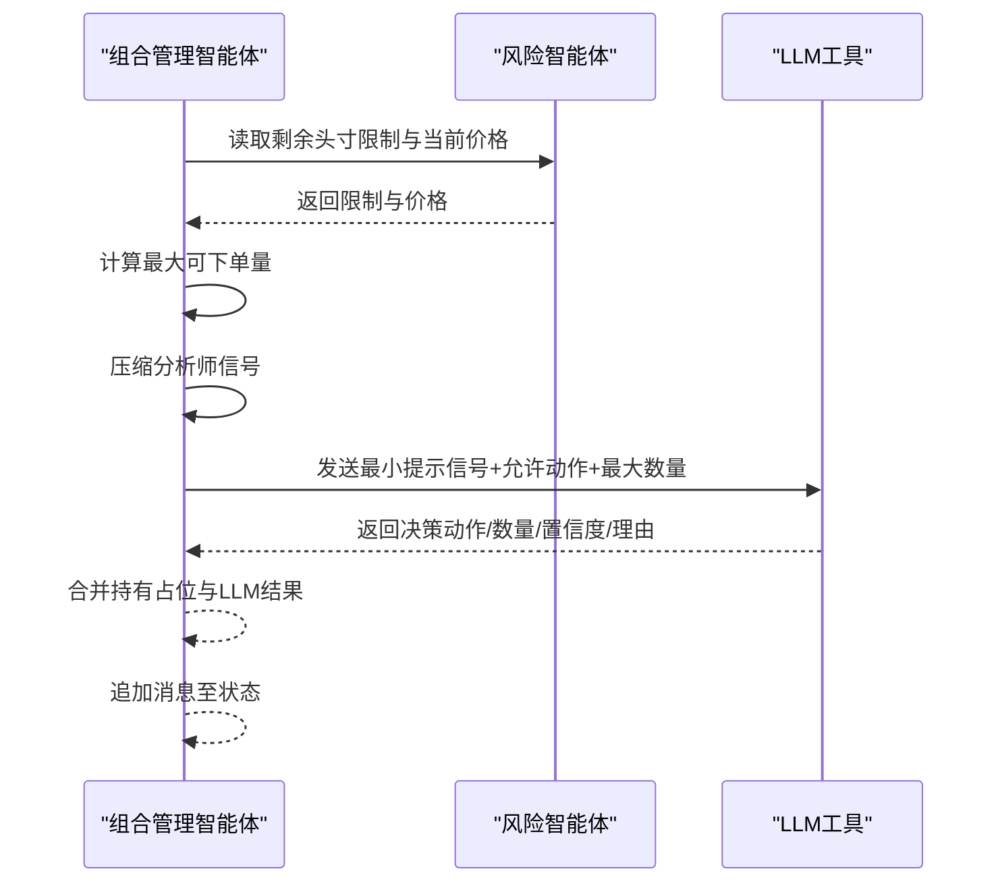
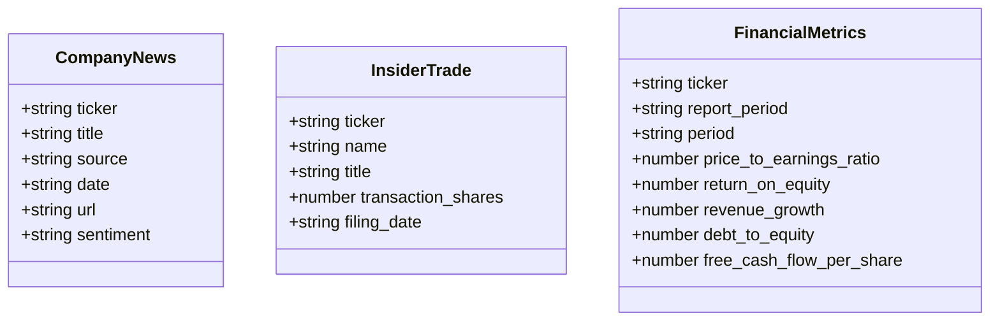
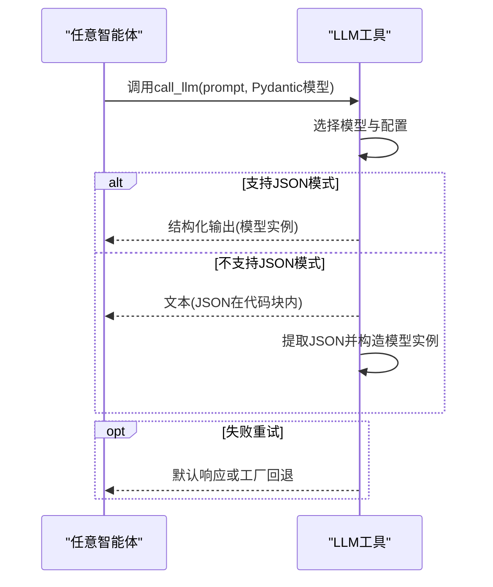
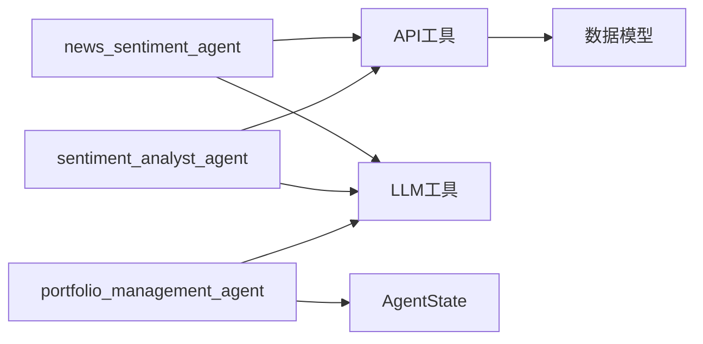

# 情感分析智能体

<cite>
**本文档引用的文件**
- [sentiment.py](file://src/agents/sentiment.py)
- [news_sentiment.py](file://src/agents/news_sentiment.py)
- [models.py](file://src/data/models.py)
- [api.py](file://src/tools/api.py)
- [llm.py](file://src/utils/llm.py)
- [state.py](file://src/graph/state.py)
- [main.py](file://src/main.py)
- [display.py](file://src/utils/display.py)
- [portfolio_manager.py](file://src/agents/portfolio_manager.py)
- [fundamentals.py](file://src/agents/fundamentals.py)
- [valuation.py](file://src/agents/valuation.py)
- [storage.py](file://app/backend/routes/storage.py)
</cite>

## 目录
1. [简介](#简介)
2. [项目结构](#项目结构)
3. [核心组件](#核心组件)
4. [架构总览](#架构总览)
5. [详细组件分析](#详细组件分析)
6. [依赖关系分析](#依赖关系分析)
7. [性能考虑](#性能考虑)
8. [故障排除指南](#故障排除指南)
9. [结论](#结论)

## 简介
本文件面向“情感分析智能体”的设计与实现，聚焦两类场景：
- 新闻情感分析：通过财经新闻、公告与研报解析市场情绪倾向，辅助交易决策。
- 通用情感分析：面向Twitter、Reddit等社交平台内容，捕捉投资者情绪表达。

文档从系统架构、数据流、处理逻辑、集成点、错误处理与性能特征等方面进行深入剖析，并提供可视化图示与实操建议，帮助读者快速理解与扩展该智能体体系。

## 项目结构
该项目采用“智能体-工具-数据模型-LLM调用-状态管理”的分层组织方式：
- 智能体层：负责业务逻辑编排（如新闻情感分析、通用情感分析、组合管理等）。
- 工具层：封装外部API访问与缓存策略，统一数据获取入口。
- 数据模型层：定义金融、新闻、交易等结构化数据类型。
- LLM工具层：统一封装结构化输出与重试机制。
- 状态管理：LangGraph状态字典，承载消息、数据与元信息。
- 可视化与存储：控制台输出格式化与后端JSON持久化接口。

**图表来源**
- [news_sentiment.py:25-164](file://src/agents/news_sentiment.py#L25-L164)
- [sentiment.py:12-139](file://src/agents/sentiment.py#L12-L139)
- [api.py:249-312](file://src/tools/api.py#L249-L312)
- [models.py:102-114](file://src/data/models.py#L102-L114)
- [llm.py:10-84](file://src/utils/llm.py#L10-L84)
- [state.py:15-18](file://src/graph/state.py#L15-L18)
- [display.py:17-254](file://src/utils/display.py#L17-L254)

**章节来源**
- [main.py:100-130](file://src/main.py#L100-L130)
- [state.py:15-18](file://src/graph/state.py#L15-L18)

## 核心组件
- 新闻情感分析智能体（news_sentiment_agent）
  - 功能：抓取公司新闻，对缺失情感标注的头条使用LLM进行情感分类，聚合得到每只股票的整体信号与置信度。
  - 关键点：标题级情感分析、LLM置信度加权、信号聚合与置信度计算。
- 通用情感分析智能体（sentiment_analyst_agent）
  - 功能：结合“内部人交易”与“公司新闻”两种信号源，按权重融合生成整体信号与置信度。
  - 关键点：内部人交易方向映射为多头/空头信号；新闻情感直接映射为多头/空头/中性；加权融合与比例置信度。
- 组合管理智能体（portfolio_management_agent）
  - 功能：汇总各分析师信号，结合风险限制与可用资金，经LLM最终决策生成交易指令。
  - 关键点：允许动作集合、最大可下单量、最小提示模板与默认回退策略。
- 数据模型与API工具
  - 数据模型：CompanyNews、InsiderTrade、FinancialMetrics等。
  - API工具：get_company_news、get_insider_trades、get_financial_metrics等，含缓存与分页拉取。
- LLM工具：统一结构化输出、重试与默认响应策略。
- 状态管理：AgentState承载messages、data、metadata三部分。

**章节来源**
- [news_sentiment.py:25-164](file://src/agents/news_sentiment.py#L25-L164)
- [sentiment.py:12-139](file://src/agents/sentiment.py#L12-L139)
- [portfolio_manager.py:25-93](file://src/agents/portfolio_manager.py#L25-L93)
- [models.py:102-114](file://src/data/models.py#L102-L114)
- [api.py:249-312](file://src/tools/api.py#L249-L312)
- [llm.py:10-84](file://src/utils/llm.py#L10-L84)
- [state.py:15-18](file://src/graph/state.py#L15-L18)

## 架构总览
下图展示了从输入到输出的关键交互路径，包括数据获取、情感分析、信号聚合与最终决策。

**图表来源**
- [main.py:100-130](file://src/main.py#L100-L130)
- [news_sentiment.py:25-164](file://src/agents/news_sentiment.py#L25-L164)
- [sentiment.py:12-139](file://src/agents/sentiment.py#L12-L139)
- [portfolio_manager.py:25-93](file://src/agents/portfolio_manager.py#L25-L93)
- [api.py:249-312](file://src/tools/api.py#L249-L312)
- [llm.py:10-84](file://src/utils/llm.py#L10-L84)

## 详细组件分析

### 新闻情感分析智能体（news_sentiment_agent）
- 输入：股票池、结束日期、API密钥、状态元数据。
- 处理流程：
  1) 获取公司新闻列表；
  2) 仅对最近头条中缺失情感标注的部分进行LLM分类（标题级），记录置信度；
  3) 将情感映射为多头/空头/中性信号；
  4) 计算整体信号与置信度（70%来自LLM置信度，30%来自信号比例）。
- 输出：每只股票的信号、置信度与推理明细，写入状态的analyst_signals。

**图表来源**
- [news_sentiment.py:25-164](file://src/agents/news_sentiment.py#L25-L164)
- [news_sentiment.py:167-222](file://src/agents/news_sentiment.py#L167-L222)

**章节来源**
- [news_sentiment.py:25-164](file://src/agents/news_sentiment.py#L25-L164)
- [news_sentiment.py:167-222](file://src/agents/news_sentiment.py#L167-L222)

### 通用情感分析智能体（sentiment_analyst_agent）
- 输入：股票池、结束日期、API密钥、状态元数据。
- 处理流程：
  1) 获取内部人交易与公司新闻；
  2) 内部人交易：以交易份额为正负映射为多头/空头；
  3) 公司新闻：直接使用已有情感标注，缺失则忽略；
  4) 权重融合：内部人交易权重0.3，新闻权重0.7；
  5) 计算加权多头/空头计数，决定整体信号与置信度。
- 输出：每只股票的信号、置信度与推理明细，写入状态的analyst_signals。

**图表来源**
- [sentiment.py:12-139](file://src/agents/sentiment.py#L12-L139)

**章节来源**
- [sentiment.py:12-139](file://src/agents/sentiment.py#L12-L139)

### 组合管理智能体（portfolio_management_agent）
- 输入：各分析师信号、当前价格、头寸限制、组合参数。
- 处理流程：
  1) 基于风险智能体提供的剩余头寸限制与当前价格，计算每只股票最大可下单量；
  2) 压缩分析师信号为{agent: {sig, conf}}；
  3) 构建最小提示模板，限定允许动作与数量；
  4) 若无法下单（仅持有），直接填充持有；
  5) LLM输出最终决策（买入/卖出/做空/平仓/持有）及置信度与理由。
- 输出：交易指令消息，追加至状态messages。

**图表来源**
- [portfolio_manager.py:25-93](file://src/agents/portfolio_manager.py#L25-L93)
- [portfolio_manager.py:177-262](file://src/agents/portfolio_manager.py#L177-L262)

**章节来源**
- [portfolio_manager.py:25-93](file://src/agents/portfolio_manager.py#L25-L93)
- [portfolio_manager.py:177-262](file://src/agents/portfolio_manager.py#L177-L262)

### 数据模型与API工具
- 数据模型：CompanyNews（包含标题、来源、时间、URL、情感标注）、InsiderTrade（内部人交易详情）、FinancialMetrics（财务指标）等。
- API工具：get_company_news、get_insider_trades、get_financial_metrics等，具备分页拉取、缓存与错误处理能力。

**图表来源**
- [models.py:102-114](file://src/data/models.py#L102-L114)
- [models.py:82-99](file://src/data/models.py#L82-L99)
- [models.py:18-62](file://src/data/models.py#L18-L62)

**章节来源**
- [models.py:102-114](file://src/data/models.py#L102-L114)
- [models.py:82-99](file://src/data/models.py#L82-L99)
- [models.py:18-62](file://src/data/models.py#L18-L62)
- [api.py:249-312](file://src/tools/api.py#L249-L312)

### LLM工具与状态管理
- LLM工具：统一结构化输出、重试与默认响应策略；支持非JSON模型时的JSON提取。
- 状态管理：AgentState包含messages、data、metadata三部分，便于跨智能体传递与打印推理。

**图表来源**
- [llm.py:10-84](file://src/utils/llm.py#L10-L84)
- [state.py:15-18](file://src/graph/state.py#L15-L18)

**章节来源**
- [llm.py:10-84](file://src/utils/llm.py#L10-L84)
- [state.py:15-18](file://src/graph/state.py#L15-L18)

## 依赖关系分析
- 模块耦合：
  - 智能体依赖API工具与LLM工具，耦合度适中，职责清晰。
  - 组合管理智能体依赖风险智能体输出，形成“分析-风控-决策”的闭环。
- 外部依赖：
  - 外部金融数据API（新闻、交易、财务指标）与缓存层。
  - LLM服务（OpenAI等），通过统一工具封装。
- 循环依赖：
  - 未发现循环导入；工作流编排在入口处集中管理。

**图表来源**
- [news_sentiment.py:25-164](file://src/agents/news_sentiment.py#L25-L164)
- [sentiment.py:12-139](file://src/agents/sentiment.py#L12-L139)
- [portfolio_manager.py:25-93](file://src/agents/portfolio_manager.py#L25-L93)
- [api.py:249-312](file://src/tools/api.py#L249-L312)
- [models.py:102-114](file://src/data/models.py#L102-L114)
- [state.py:15-18](file://src/graph/state.py#L15-L18)

**章节来源**
- [main.py:100-130](file://src/main.py#L100-L130)

## 性能考虑
- API调用与缓存
  - API工具对价格、财务指标、内部人交易、新闻等均实现缓存，减少重复请求与限流风险。
  - 分页拉取避免一次性请求过多数据，提升稳定性。
- LLM调用优化
  - 新闻情感分析仅对缺失标注的头条进行分类，限制调用次数。
  - 置信度计算采用加权策略，兼顾LLM置信与信号比例，降低误判概率。
- 并发与批处理
  - 当前实现为串行遍历股票，若需提升吞吐，可在智能体内引入并发任务池（注意LLM速率限制）。
- 内存与序列化
  - 推理日志转JSON时注意大对象序列化成本，必要时进行字段裁剪或延迟序列化。

[本节为通用指导，无需特定文件引用]

## 故障排除指南
- LLM调用失败
  - 现象：智能体返回默认响应或置信度为0。
  - 处理：检查模型配置、API密钥、网络连通性；查看重试日志；必要时调整默认回退策略。
- API限流
  - 现象：HTTP 429，程序等待后重试。
  - 处理：适当增加延时或降低请求频率；检查缓存命中率。
- 缺失数据
  - 现象：财务指标为空、新闻为空、内部人交易为空。
  - 处理：确认时间窗口与过滤条件；检查API密钥权限。
- 输出格式问题
  - 现象：控制台显示异常或JSON解析错误。
  - 处理：使用统一的展示工具进行格式化输出；必要时启用调试模式。

**章节来源**
- [llm.py:58-84](file://src/utils/llm.py#L58-L84)
- [api.py:29-61](file://src/tools/api.py#L29-L61)
- [display.py:17-254](file://src/utils/display.py#L17-L254)

## 结论
本情感分析智能体体系通过“新闻情感分析”与“通用情感分析”两条路径，分别覆盖财经新闻与社交平台情绪，结合内部人交易与LLM结构化输出，形成稳健的信号生成与置信度评估机制。配合组合管理智能体与风险约束，最终实现从情绪洞察到交易执行的闭环。未来可进一步扩展多语言支持、增强上下文理解与情感词典构建，以提升跨市场与跨语种的适应性与鲁棒性。