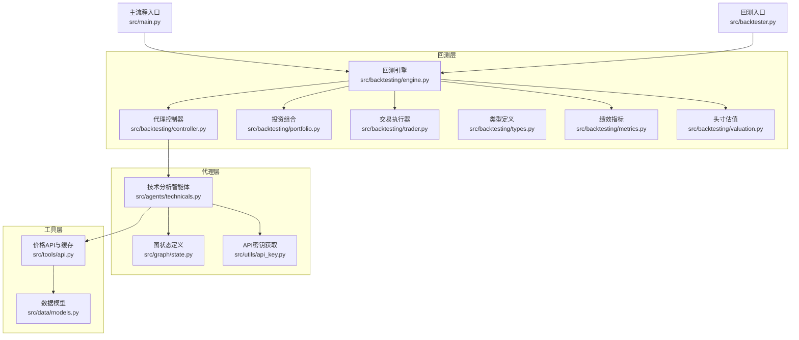
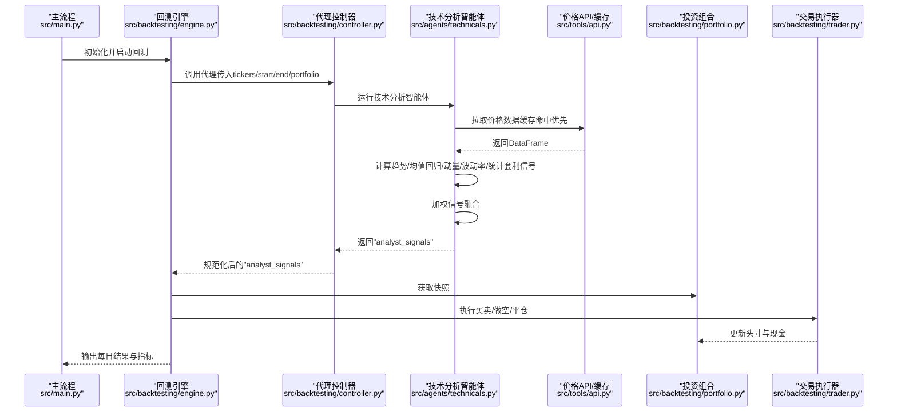
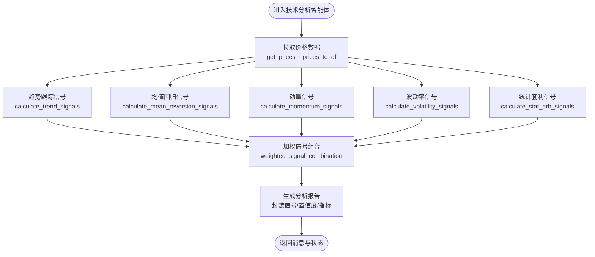
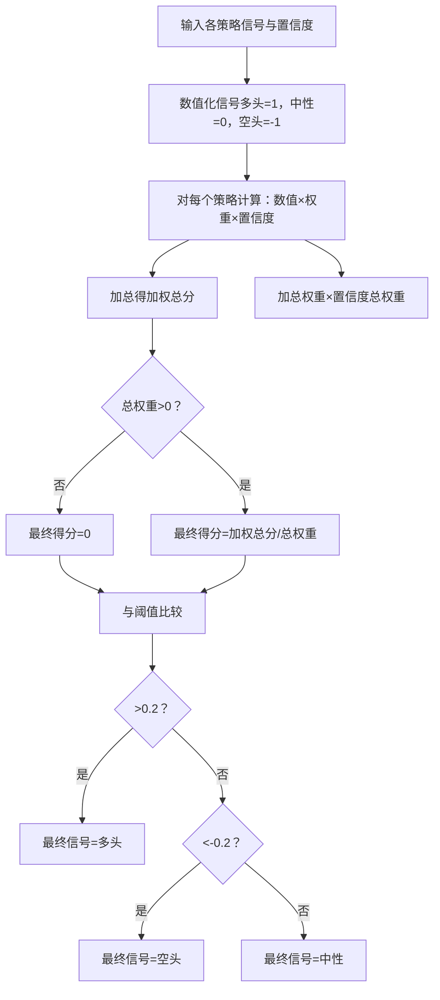
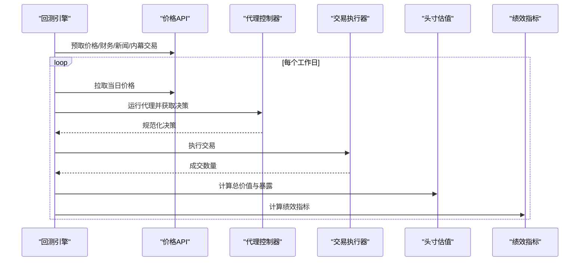
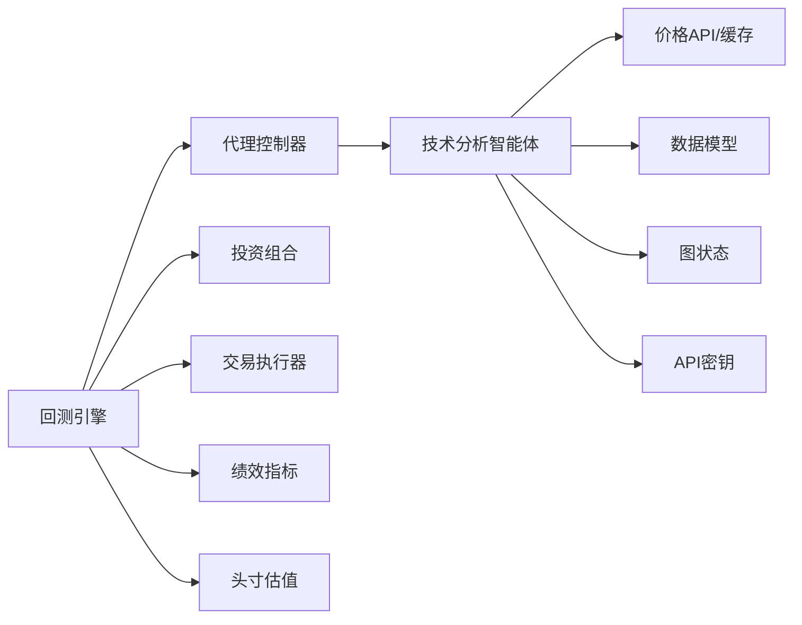

# 技术分析智能体

<cite>
**本文引用的文件**
- [src/agents/technicals.py](file://src/agents/technicals.py)
- [src/tools/api.py](file://src/tools/api.py)
- [src/data/models.py](file://src/data/models.py)
- [src/graph/state.py](file://src/graph/state.py)
- [src/utils/api_key.py](file://src/utils/api_key.py)
- [src/backtesting/engine.py](file://src/backtesting/engine.py)
- [src/backtesting/controller.py](file://src/backtesting/controller.py)
- [src/backtesting/portfolio.py](file://src/backtesting/portfolio.py)
- [src/backtesting/trader.py](file://src/backtesting/trader.py)
- [src/backtesting/types.py](file://src/backtesting/types.py)
- [src/backtesting/metrics.py](file://src/backtesting/metrics.py)
- [src/backtesting/valuation.py](file://src/backtesting/valuation.py)
- [src/main.py](file://src/main.py)
- [src/backtester.py](file://src/backtester.py)
- [tests/fixtures/api/prices/AAPL_2024-03-01_2024-03-08.json](file://tests/fixtures/api/prices/AAPL_2024-03-01_2024-03-08.json)
</cite>

## 目录
1. [引言](#引言)
2. [项目结构](#项目结构)
3. [核心组件](#核心组件)
4. [架构总览](#架构总览)
5. [详细组件分析](#详细组件分析)
6. [依赖关系分析](#依赖关系分析)
7. [性能考虑](#性能考虑)
8. [故障排查指南](#故障排查指南)
9. [结论](#结论)
10. [附录](#附录)

## 引言
本文件面向“技术分析智能体”的使用者与维护者，系统化阐述其如何基于价格与成交量等市场数据，结合多策略信号融合，输出可执行的交易决策。该智能体覆盖趋势跟踪、均值回归、动量、波动率与统计套利五大策略，并通过加权信号组合形成统一信号与置信度，最终驱动投资组合管理与回测引擎。

## 项目结构
技术分析智能体位于后端Python代码树中，围绕“代理（Agent）+ 工具（Tools）+ 回测（Backtesting）”三层组织：
- 代理层：负责接收状态数据，拉取价格数据，计算各类技术信号并进行加权融合。
- 工具层：封装外部API调用、缓存与数据转换逻辑，确保数据一致性与性能。
- 回测层：编排日程推进、执行交易、计算收益曲线与风险指标，支撑策略评估。

图表来源
- [src/agents/technicals.py:35-157](file://src/agents/technicals.py#L35-L157)
- [src/tools/api.py:63-96](file://src/tools/api.py#L63-L96)
- [src/backtesting/engine.py:27-195](file://src/backtesting/engine.py#L27-L195)
- [src/backtesting/controller.py:9-68](file://src/backtesting/controller.py#L9-L68)
- [src/backtesting/portfolio.py:9-196](file://src/backtesting/portfolio.py#L9-L196)
- [src/backtesting/trader.py:7-40](file://src/backtesting/trader.py#L7-L40)
- [src/backtesting/types.py:10-106](file://src/backtesting/types.py#L10-L106)
- [src/backtesting/metrics.py:8-78](file://src/backtesting/metrics.py#L8-L78)
- [src/backtesting/valuation.py:8-83](file://src/backtesting/valuation.py#L8-L83)
- [src/main.py:46-180](file://src/main.py#L46-L180)
- [src/backtester.py:13-67](file://src/backtester.py#L13-L67)

章节来源
- [src/agents/technicals.py:35-157](file://src/agents/technicals.py#L35-L157)
- [src/backtesting/engine.py:27-195](file://src/backtesting/engine.py#L27-L195)

## 核心组件
- 技术分析智能体：聚合多策略信号，输出统一信号与置信度，并在展示模式下输出各策略的推理细节。
- 指标计算模块：包含RSI、布林带、多重时间框架EMA、ADX、ATR与Hurst指数等。
- 加权信号组合：按权重与置信度合成最终信号。
- 数据获取与缓存：从外部API获取OHLCV数据，转换为DataFrame并缓存。
- 回测编排：按工作日推进，拉取当日价格，运行代理，执行交易，更新头寸与价值，计算指标。

章节来源
- [src/agents/technicals.py:160-532](file://src/agents/technicals.py#L160-L532)
- [src/tools/api.py:63-96](file://src/tools/api.py#L63-L96)
- [src/backtesting/engine.py:96-195](file://src/backtesting/engine.py#L96-L195)

## 架构总览
技术分析智能体在LangGraph状态机中作为节点参与，接收包含时间窗口、标的列表与初始投资组合的上下文，返回“分析师信号”字典；随后由风险与组合管理节点消费这些信号，生成最终的交易决策。

图表来源
- [src/main.py:46-180](file://src/main.py#L46-L180)
- [src/backtesting/engine.py:96-195](file://src/backtesting/engine.py#L96-L195)
- [src/backtesting/controller.py:12-65](file://src/backtesting/controller.py#L12-L65)
- [src/agents/technicals.py:35-157](file://src/agents/technicals.py#L35-L157)
- [src/tools/api.py:63-96](file://src/tools/api.py#L63-L96)
- [src/backtesting/portfolio.py:44-196](file://src/backtesting/portfolio.py#L44-L196)
- [src/backtesting/trader.py:10-37](file://src/backtesting/trader.py#L10-L37)

## 详细组件分析

### 技术分析智能体（核心策略与信号融合）
- 输入：状态对象包含标的列表、起止日期、初始投资组合、是否显示推理等元数据。
- 处理流程：
  - 遍历每个标的，拉取历史价格并转为DataFrame。
  - 分别计算趋势跟踪、均值回归、动量、波动率与统计套利信号。
  - 使用预设权重对信号进行加权融合，得到最终信号与置信度。
  - 将各策略的信号、置信度与中间指标打包为“分析师信号”，写入状态供后续节点使用。
- 输出：消息列表中附加一个包含所有标的分析结果的JSON消息；同时在状态data中记录analyst_signals。

图表来源
- [src/agents/technicals.py:35-157](file://src/agents/technicals.py#L35-L157)
- [src/agents/technicals.py:160-404](file://src/agents/technicals.py#L160-L404)

章节来源
- [src/agents/technicals.py:35-157](file://src/agents/technicals.py#L35-L157)

### 指标算法详解

#### 多重时间框架EMA
- 算法要点：分别计算短周期（如8）、中周期（如21）、长周期（如55）指数移动平均，用于识别短期与中期趋势方向。
- 实现位置：趋势跟踪信号中直接使用EMA序列进行比较，决定多头/空头/中性信号。

章节来源
- [src/agents/technicals.py:164-170](file://src/agents/technicals.py#L164-L170)
- [src/agents/technicals.py:439-450](file://src/agents/technicals.py#L439-L450)

#### ADX趋势强度判断
- 算法要点：计算+DI、-DI与DX，再求ADX，用于衡量趋势强弱；结合EMA方向确定多空信号。
- 实现位置：趋势跟踪信号中使用ADX值归一化为趋势强度置信度。

章节来源
- [src/agents/technicals.py:169-170](file://src/agents/technicals.py#L169-L170)
- [src/agents/technicals.py:453-483](file://src/agents/technicals.py#L453-L483)

#### 布林带与RSI
- 布林带：以20日均线与两倍标准差构建上下轨，用于衡量超买/超卖与突破信号。
- RSI：14日与28日RSI用于确认动量与反转强度。
- 实现位置：均值回归策略中使用布林带位置与RSI辅助判断。

章节来源
- [src/agents/technicals.py:208-214](file://src/agents/technicals.py#L208-L214)
- [src/agents/technicals.py:420-428](file://src/agents/technicals.py#L420-L428)
- [src/agents/technicals.py:431-436](file://src/agents/technicals.py#L431-L436)

#### ATR波动率测量
- 算法要点：计算True Range并滚动均值得到ATR，再除以收盘价得到ATR比率，用于衡量波动率水平。
- 实现位置：波动率策略中使用ATR比率辅助判断波动率 regimes。

章节来源
- [src/agents/technicals.py:303-305](file://src/agents/technicals.py#L303-L305)
- [src/agents/technicals.py:486-504](file://src/agents/technicals.py#L486-L504)

#### Hurst指数（统计套利）
- 算法要点：通过R/S分析估计长期记忆参数H，H<0.5表示均值回复倾向，用于统计套利信号生成。
- 实现位置：统计套利策略中使用Hurst指数与偏度共同判断。

章节来源
- [src/agents/technicals.py:344-345](file://src/agents/technicals.py#L344-L345)
- [src/agents/technicals.py:507-531](file://src/agents/technicals.py#L507-L531)

### 加权信号组合机制
- 权重：趋势25%、均值回归20%、动量25%、波动率15%、统计套利15%。
- 步骤：
  - 将“多头/中性/空头”映射为数值（1/0/-1）。
  - 对每策略取数值×权重×置信度累加，再除以权重与置信度之和，得到标准化得分。
  - 以0.2阈值判定最终信号（>0.2为多头，<-0.2为空头，否则中性）。

图表来源
- [src/agents/technicals.py:372-404](file://src/agents/technicals.py#L372-L404)

章节来源
- [src/agents/technicals.py:372-404](file://src/agents/technicals.py#L372-L404)

### 数据获取与缓存
- 接口：通过get_prices获取OHLCV，支持缓存命中与API回退。
- 转换：prices_to_df将Price列表转为带日期索引的DataFrame，确保数值列正确类型化。
- 错误处理：对NaN/异常值安全转换，避免传播至后续指标计算。

章节来源
- [src/tools/api.py:63-96](file://src/tools/api.py#L63-L96)
- [src/tools/api.py:351-361](file://src/tools/api.py#L351-L361)
- [src/data/models.py:4-16](file://src/data/models.py#L4-L16)

### 回测流水线与交易执行
- 日程推进：按工作日遍历，向前回溯1个月构造训练窗口，拉取当日价格。
- 决策与执行：代理控制器规范化决策（动作与数量），交易执行器按动作与数量执行买卖/做空/平仓。
- 估值与暴露：计算总价值、多头/空头/总/净暴露与长短比，用于风控与报表。
- 绩效指标：计算夏普/索提诺比率与最大回撤等。

图表来源
- [src/backtesting/engine.py:96-195](file://src/backtesting/engine.py#L96-L195)
- [src/backtesting/controller.py:12-65](file://src/backtesting/controller.py#L12-L65)
- [src/backtesting/trader.py:10-37](file://src/backtesting/trader.py#L10-L37)
- [src/backtesting/valuation.py:8-50](file://src/backtesting/valuation.py#L8-L50)
- [src/backtesting/metrics.py:22-75](file://src/backtesting/metrics.py#L22-L75)

章节来源
- [src/backtesting/engine.py:96-195](file://src/backtesting/engine.py#L96-L195)
- [src/backtesting/controller.py:12-65](file://src/backtesting/controller.py#L12-L65)
- [src/backtesting/portfolio.py:44-196](file://src/backtesting/portfolio.py#L44-L196)
- [src/backtesting/trader.py:10-37](file://src/backtesting/trader.py#L10-L37)
- [src/backtesting/valuation.py:8-50](file://src/backtesting/valuation.py#L8-L50)
- [src/backtesting/metrics.py:22-75](file://src/backtesting/metrics.py#L22-L75)

## 依赖关系分析
- 低耦合高内聚：技术分析智能体仅依赖工具层的数据获取与指标计算，不直接依赖回测细节。
- 明确接口契约：
  - 代理控制器将代理输出规范化为统一的决策字典。
  - 回测引擎通过统一的类型定义与枚举控制交易动作。
- 可能的循环依赖：当前未发现循环导入；若未来扩展，需避免在技术分析智能体中引入回测相关逻辑。

图表来源
- [src/agents/technicals.py:35-157](file://src/agents/technicals.py#L35-L157)
- [src/tools/api.py:63-96](file://src/tools/api.py#L63-L96)
- [src/backtesting/engine.py:27-195](file://src/backtesting/engine.py#L27-L195)
- [src/backtesting/controller.py:12-65](file://src/backtesting/controller.py#L12-L65)
- [src/backtesting/portfolio.py:44-196](file://src/backtesting/portfolio.py#L44-L196)
- [src/backtesting/trader.py:10-37](file://src/backtesting/trader.py#L10-L37)
- [src/backtesting/metrics.py:22-75](file://src/backtesting/metrics.py#L22-L75)
- [src/backtesting/valuation.py:8-50](file://src/backtesting/valuation.py#L8-L50)

章节来源
- [src/agents/technicals.py:35-157](file://src/agents/technicals.py#L35-L157)
- [src/backtesting/engine.py:27-195](file://src/backtesting/engine.py#L27-L195)

## 性能考虑
- 缓存优先：价格数据通过缓存键（含标的、起止日期）命中后直接返回，减少API调用与解析开销。
- 向量化计算：指标计算基于pandas/numpy向量化操作，避免显式循环。
- 安全转换：对NaN/异常值进行安全转换，防止传播到后续计算。
- 回测批量化：回测引擎按工作日批量推进，尽量减少重复数据加载。

章节来源
- [src/tools/api.py:63-96](file://src/tools/api.py#L63-L96)
- [src/agents/technicals.py:15-31](file://src/agents/technicals.py#L15-L31)

## 故障排查指南
- 无价格数据：当API返回空或解析失败时，技术分析智能体会跳过该标的并记录状态。检查网络、API密钥与日期范围。
- API限流：工具层已内置429重试与线性退避，若仍失败，请降低并发或增加等待时间。
- 策略信号异常：若出现极端置信度或信号突变，检查指标计算中的NaN处理与窗口长度设置。
- 回测中断：回测支持键盘中断，会尝试输出部分结果摘要；若无可用摘要，检查数据完整性与内存占用。

章节来源
- [src/agents/technicals.py:63-65](file://src/agents/technicals.py#L63-L65)
- [src/tools/api.py:29-61](file://src/tools/api.py#L29-L61)
- [src/backtester.py:13-40](file://src/backtester.py#L13-L40)

## 结论
技术分析智能体通过多策略信号融合与稳健的指标实现，提供了可解释、可回测、可扩展的交易信号生成能力。其清晰的职责划分与完善的回测管线，使其既能满足研究验证，也能融入生产级交易流程。

## 附录

### 输入输出格式

- 输入（代理状态data字段的关键键名）
  - tickers：标的列表
  - start_date：开始日期（字符串）
  - end_date：结束日期（字符串）
  - portfolio：初始投资组合快照（字典）
  - analyst_signals：历史分析师信号（字典）

- 输出（技术分析智能体返回的消息内容）
  - JSON字符串，键为标的，值包含：
    - signal：最终信号（多头/中性/空头）
    - confidence：最终置信度（百分比整数）
    - reasoning：各子策略的信号、置信度与关键指标（已归一化为原生类型）

- 回测阶段的代理输出规范化
  - decisions：按标的映射的动作与数量
  - analyst_signals：保留原始分析师信号字典

章节来源
- [src/agents/technicals.py:107-137](file://src/agents/technicals.py#L107-L137)
- [src/backtesting/controller.py:40-65](file://src/backtesting/controller.py#L40-L65)
- [src/backtesting/types.py:69-72](file://src/backtesting/types.py#L69-L72)

### 实际应用案例
- 单标的回测：使用AAPL示例数据，回测引擎按工作日推进，代理输出决策，交易执行器成交，估值与指标持续更新。
- 多标的组合：技术分析智能体对每个标的独立计算并汇总，最终由组合管理节点统一决策。

章节来源
- [tests/fixtures/api/prices/AAPL_2024-03-01_2024-03-08.json:1-65](file://tests/fixtures/api/prices/AAPL_2024-03-01_2024-03-08.json#L1-L65)
- [src/backtesting/engine.py:96-195](file://src/backtesting/engine.py#L96-L195)