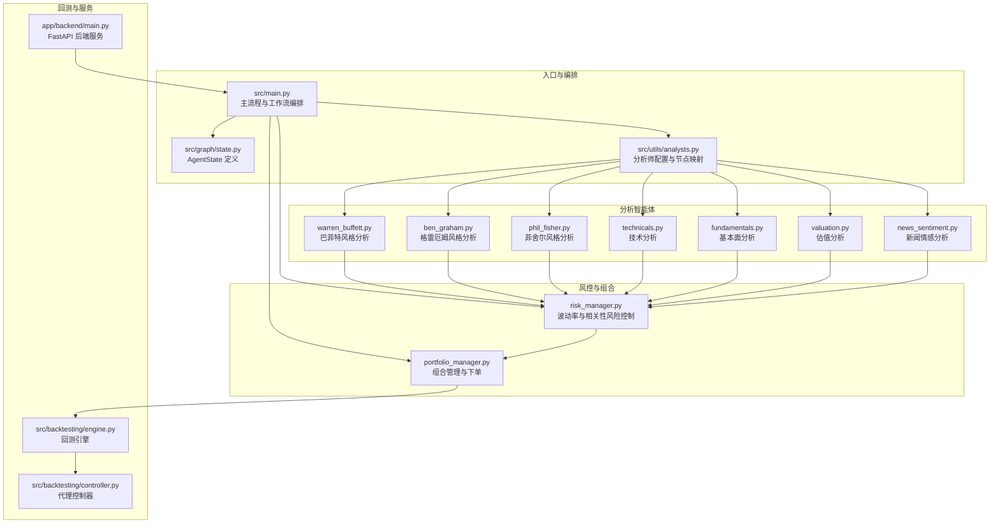
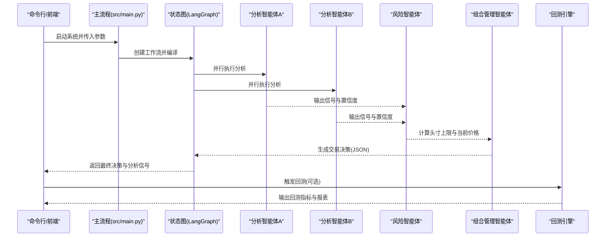
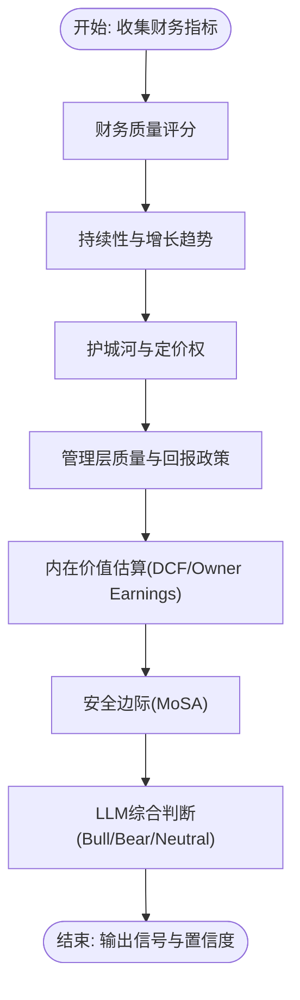
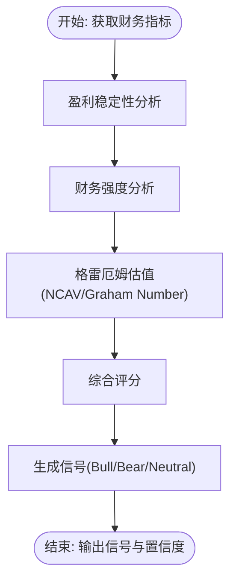
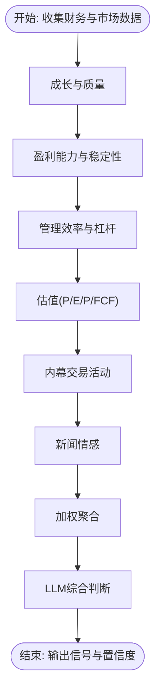
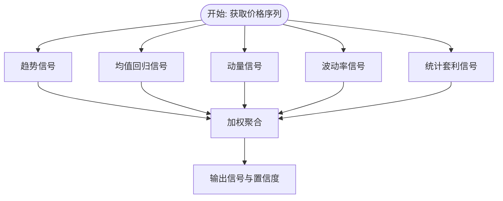
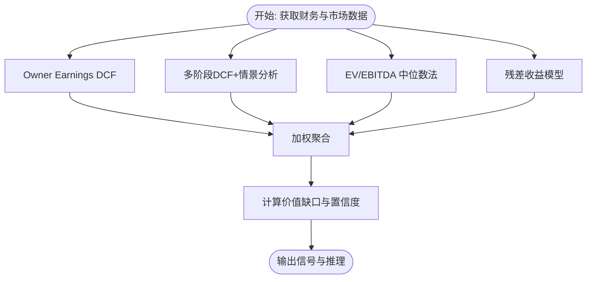
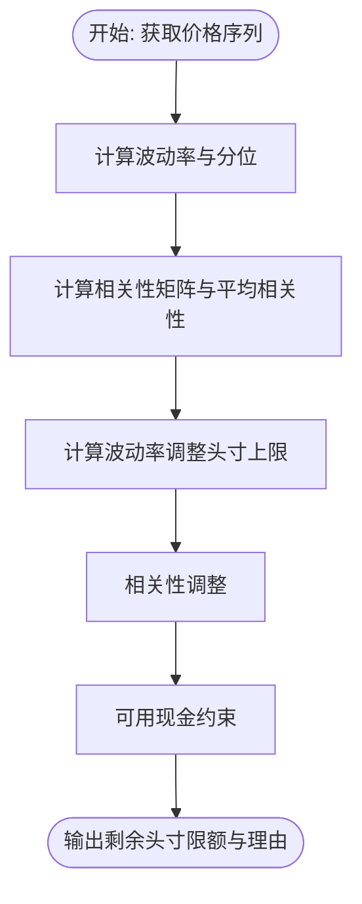
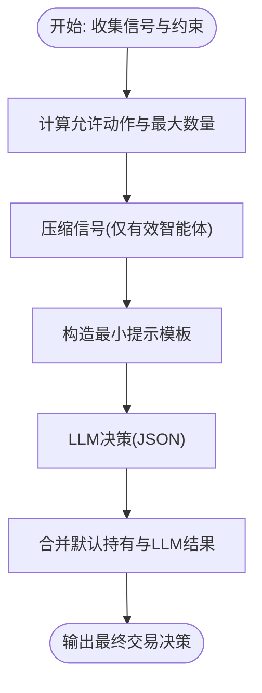
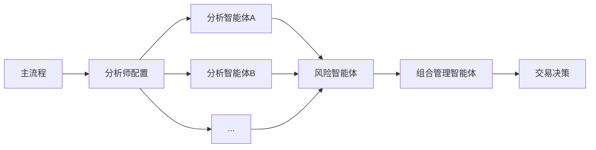

# 多智能体系统

<cite>
**本文档引用的文件**
- [src/main.py](file://src/main.py)
- [src/graph/state.py](file://src/graph/state.py)
- [src/utils/analysts.py](file://src/utils/analysts.py)
- [src/agents/warren_buffett.py](file://src/agents/warren_buffett.py)
- [src/agents/ben_graham.py](file://src/agents/ben_graham.py)
- [src/agents/phil_fisher.py](file://src/agents/phil_fisher.py)
- [src/agents/fundamentals.py](file://src/agents/fundamentals.py)
- [src/agents/technicals.py](file://src/agents/technicals.py)
- [src/agents/valuation.py](file://src/agents/valuation.py)
- [src/agents/news_sentiment.py](file://src/agents/news_sentiment.py)
- [src/agents/portfolio_manager.py](file://src/agents/portfolio_manager.py)
- [src/agents/risk_manager.py](file://src/agents/risk_manager.py)
- [src/backtesting/engine.py](file://src/backtesting/engine.py)
- [src/backtesting/controller.py](file://src/backtesting/controller.py)
- [app/backend/main.py](file://app/backend/main.py)
</cite>

## 目录
1. [简介](#简介)
2. [项目结构](#项目结构)
3. [核心组件](#核心组件)
4. [架构总览](#架构总览)
5. [详细组件分析](#详细组件分析)
6. [依赖关系分析](#依赖关系分析)
7. [性能考虑](#性能考虑)
8. [故障排除指南](#故障排除指南)
9. [结论](#结论)
10. [附录](#附录)

## 简介
本项目是一个基于多智能体的量化交易系统，通过多个“投资大师”风格的智能体协同工作，完成从数据采集、分析建模到最终交易决策与风险控制的全流程。系统支持：
- 经典价值投资（巴菲特、格雷厄姆、菲舍尔）
- 技术分析与统计套利
- 基本面与估值分析
- 新闻情感分析
- 风险管理与组合管理
- 回测引擎与性能评估

系统采用状态图驱动的流程编排，将各分析智能体的输出汇聚至组合管理智能体，由其在约束条件下生成最终交易指令。

## 项目结构
后端以 LangGraph 为核心，定义统一的状态结构，前端提供可视化与交互界面，工具层负责外部数据接口，服务层封装业务逻辑。

图表来源
- [src/main.py:100-130](file://src/main.py#L100-L130)
- [src/graph/state.py:15-18](file://src/graph/state.py#L15-L18)
- [src/utils/analysts.py:184-186](file://src/utils/analysts.py#L184-L186)

章节来源
- [src/main.py:100-130](file://src/main.py#L100-L130)
- [src/graph/state.py:15-18](file://src/graph/state.py#L15-L18)
- [src/utils/analysts.py:184-186](file://src/utils/analysts.py#L184-L186)

## 核心组件
- 状态图与消息流：统一的 AgentState 包含 messages、data、metadata；智能体通过向 messages 追加 HumanMessage 的方式传递分析结果。
- 分析智能体：按领域划分，分别执行价值投资、技术分析、基本面与估值、新闻情感等任务。
- 风控与组合：风险智能体根据波动率与相关性计算头寸上限，组合管理智能体在约束下生成买卖/做空/平仓指令。
- 回测与服务：回测引擎驱动日级循环，调用代理控制器规范化输出，计算收益与风险指标；后端提供 API 与本地模型集成。

章节来源
- [src/graph/state.py:15-18](file://src/graph/state.py#L15-L18)
- [src/backtesting/engine.py:27-68](file://src/backtesting/engine.py#L27-L68)
- [app/backend/main.py:15-30](file://app/backend/main.py#L15-L30)

## 架构总览
系统采用“分析-风控-组合”的流水线式架构，所有分析智能体先于风险智能体运行，再由组合管理智能体汇总信号并生成最终交易决策。

图表来源
- [src/main.py:100-130](file://src/main.py#L100-L130)
- [src/agents/portfolio_manager.py:25-93](file://src/agents/portfolio_manager.py#L25-L93)
- [src/agents/risk_manager.py:11-219](file://src/agents/risk_manager.py#L11-L219)

## 详细组件分析

### 巴菲特智能体（Warren Buffett）
- 功能定位：以巴菲特的价值投资理念为指导，综合财务质量、护城河、管理层质量、内在价值与安全边际进行判断。
- 分析方法：
  - 财务质量评分（ROE、债务/权益、运营利润率、流动比率）
  - 持续盈利能力趋势分析
  - 竞争优势（护城河）评估（ROIC/ROE稳定性、毛利率稳定性、资产效率）
  - 定价权分析（毛利率趋势、稳定性）
  - 股东回报与管理层质量（回购/分红）
  - 内在价值估算（三阶段DCF，结合“业主盈余”Owner Earnings）
  - 安全边际（内在价值与市值比较）
- 决策逻辑：基于综合评分与内在价值与市价的关系，输出多头/空头/中性信号及置信度。
- 输出格式：包含信号、置信度、推理摘要，便于后续组合管理使用。

图表来源
- [src/agents/warren_buffett.py:19-153](file://src/agents/warren_buffett.py#L19-L153)
- [src/agents/warren_buffett.py:156-202](file://src/agents/warren_buffett.py#L156-L202)
- [src/agents/warren_buffett.py:238-334](file://src/agents/warren_buffett.py#L238-L334)
- [src/agents/warren_buffett.py:337-377](file://src/agents/warren_buffett.py#L337-L377)
- [src/agents/warren_buffett.py:508-624](file://src/agents/warren_buffett.py#L508-L624)

章节来源
- [src/agents/warren_buffett.py:19-153](file://src/agents/warren_buffett.py#L19-L153)
- [src/agents/warren_buffett.py:746-800](file://src/agents/warren_buffett.py#L746-L800)

### 格雷厄姆智能体（Benjamin Graham）
- 功能定位：以格雷厄姆的经典价值投资原则为基础，强调安全边际、稳健财务状况与合理估值。
- 分析方法：
  - 盈利稳定性（连续正EPS、EPS增长趋势）
  - 财务强度（流动比率、资产负债率、股息记录）
  - 估值（NCAV/NCAV%、Graham Number、与市价的安全边际）
- 决策逻辑：综合三项指标得分，给出多头/空头/中性信号，强调低风险与安全边际。

图表来源
- [src/agents/ben_graham.py:20-94](file://src/agents/ben_graham.py#L20-L94)
- [src/agents/ben_graham.py:97-138](file://src/agents/ben_graham.py#L97-L138)
- [src/agents/ben_graham.py:141-204](file://src/agents/ben_graham.py#L141-L204)
- [src/agents/ben_graham.py:207-279](file://src/agents/ben_graham.py#L207-L279)

章节来源
- [src/agents/ben_graham.py:20-94](file://src/agents/ben_graham.py#L20-L94)
- [src/agents/ben_graham.py:282-349](file://src/agents/ben_graham.py#L282-L349)

### 菲舍尔智能体（Phil Fisher）
- 功能定位：以菲舍尔的“水手式研究”与长期增长理念为核心，关注管理层质量、研发能力、盈利能力与估值合理性。
- 分析方法：
  - 成长与质量（收入/EPS复合增长、研发占比）
  - 盈利能力与稳定性（毛利率、运营利润率、波动性）
  - 管理效率与杠杆（ROE、负债/权益、自由现金流）
  - 估值（P/E、P/FCF）
  - 内幕交易与新闻情绪（辅助信号）
- 决策逻辑：按权重合成各项指标，输出多头/空头/中性信号，强调长期复利与质量溢价。

图表来源
- [src/agents/phil_fisher.py:24-164](file://src/agents/phil_fisher.py#L24-L164)
- [src/agents/phil_fisher.py:167-259](file://src/agents/phil_fisher.py#L167-L259)
- [src/agents/phil_fisher.py:262-325](file://src/agents/phil_fisher.py#L262-L325)
- [src/agents/phil_fisher.py:328-401](file://src/agents/phil_fisher.py#L328-L401)
- [src/agents/phil_fisher.py:404-458](file://src/agents/phil_fisher.py#L404-L458)
- [src/agents/phil_fisher.py:461-500](file://src/agents/phil_fisher.py#L461-L500)
- [src/agents/phil_fisher.py:503-528](file://src/agents/phil_fisher.py#L503-L528)

章节来源
- [src/agents/phil_fisher.py:24-164](file://src/agents/phil_fisher.py#L24-L164)
- [src/agents/phil_fisher.py:531-604](file://src/agents/phil_fisher.py#L531-L604)

### 技术分析智能体
- 功能定位：基于多策略信号的加权融合，输出短期交易信号。
- 分析方法：
  - 趋势跟踪（EMA、ADX）
  - 均值回归（Z-Score、布林带、RSI）
  - 动量（月/季/半年动量、成交量确认）
  - 波动率（历史波动、ATR、波动率区间）
  - 统计套利（偏度、峰度、赫斯特指数）
- 决策逻辑：对五类策略加权聚合，输出多头/空头/中性信号与置信度。

图表来源
- [src/agents/technicals.py:35-157](file://src/agents/technicals.py#L35-L157)
- [src/agents/technicals.py:160-196](file://src/agents/technicals.py#L160-L196)
- [src/agents/technicals.py:199-238](file://src/agents/technicals.py#L199-L238)
- [src/agents/technicals.py:241-283](file://src/agents/technicals.py#L241-L283)
- [src/agents/technicals.py:286-330](file://src/agents/technicals.py#L286-L330)
- [src/agents/technicals.py:333-369](file://src/agents/technicals.py#L333-L369)
- [src/agents/technicals.py:372-404](file://src/agents/technicals.py#L372-L404)

章节来源
- [src/agents/technicals.py:35-157](file://src/agents/technicals.py#L35-L157)

### 基本面分析智能体
- 功能定位：快速多维度基础财务信号汇总，作为价值与技术分析的补充。
- 分析方法：盈利能力、增长潜力、财务健康、估值比率四类指标评分。
- 决策逻辑：多数信号一致则强，否则中性，输出整体信号与置信度。

章节来源
- [src/agents/fundamentals.py:11-164](file://src/agents/fundamentals.py#L11-L164)

### 估值分析智能体
- 功能定位：多模型估值聚合，提供内在价值与市场价差距的综合视角。
- 分析方法：
  - Owner Earnings DCF（含安全边际）
  - 多阶段DCF与情景分析（熊/牛/中性）
  - EV/EBITDA 中位数法
  - 残差收益模型（RI）
  - WACC 估计与敏感性分析
- 决策逻辑：按权重聚合各模型的“价值-市值”缺口，输出多头/空头/中性信号与置信度。

图表来源
- [src/agents/valuation.py:21-220](file://src/agents/valuation.py#L21-L220)
- [src/agents/valuation.py:226-281](file://src/agents/valuation.py#L226-L281)
- [src/agents/valuation.py:283-300](file://src/agents/valuation.py#L283-L300)
- [src/agents/valuation.py:302-332](file://src/agents/valuation.py#L302-L332)
- [src/agents/valuation.py:338-374](file://src/agents/valuation.py#L338-L374)
- [src/agents/valuation.py:451-495](file://src/agents/valuation.py#L451-L495)

章节来源
- [src/agents/valuation.py:21-220](file://src/agents/valuation.py#L21-L220)

### 新闻情感分析智能体
- 功能定位：抓取公司新闻，对缺失情感标签的文章进行LLM分类，聚合得到整体新闻情绪信号。
- 分析方法：标题情感分类，基于LLM置信度与信号比例加权计算最终置信度。
- 决策逻辑：多头/空头/中性，输出理由与统计指标。

章节来源
- [src/agents/news_sentiment.py:25-164](file://src/agents/news_sentiment.py#L25-L164)
- [src/agents/news_sentiment.py:167-222](file://src/agents/news_sentiment.py#L167-L222)

### 风险管理智能体
- 功能定位：基于波动率与相关性的头寸限制计算，确保组合在给定风险预算内运作。
- 分析方法：
  - 波动率指标（日/年化波动率、滚动分位）
  - 相关性矩阵（活跃头寸间平均/最大相关性）
  - 组合净值与当前头寸价值
  - 波动率×相关性调整后的头寸上限
- 决策逻辑：输出每只股票的剩余头寸限额、当前价格与调整理由，供组合管理器使用。

图表来源
- [src/agents/risk_manager.py:11-219](file://src/agents/risk_manager.py#L11-L219)
- [src/agents/risk_manager.py:222-267](file://src/agents/risk_manager.py#L222-L267)
- [src/agents/risk_manager.py:270-298](file://src/agents/risk_manager.py#L270-L298)
- [src/agents/risk_manager.py:301-318](file://src/agents/risk_manager.py#L301-L318)

章节来源
- [src/agents/risk_manager.py:11-219](file://src/agents/risk_manager.py#L11-L219)

### 组合管理智能体
- 功能定位：在允许动作集合与头寸限制下，将各分析智能体的信号与置信度转化为具体交易指令。
- 分析方法：
  - 允许动作集：根据当前价格、头寸上限、可用资金与保证金要求确定
  - 信号压缩：仅保留非空智能体的信号与置信度
  - LLM最小提示：在约束下选择动作与数量，保持推理简洁
- 决策逻辑：输出每只股票的动作（买入/卖出/做空/平仓/持有）、数量、置信度与简要理由。

图表来源
- [src/agents/portfolio_manager.py:25-93](file://src/agents/portfolio_manager.py#L25-L93)
- [src/agents/portfolio_manager.py:96-157](file://src/agents/portfolio_manager.py#L96-L157)
- [src/agents/portfolio_manager.py:177-263](file://src/agents/portfolio_manager.py#L177-L263)

章节来源
- [src/agents/portfolio_manager.py:25-93](file://src/agents/portfolio_manager.py#L25-L93)

## 依赖关系分析
- 模块耦合：
  - 主流程与分析智能体通过统一状态图解耦，新增智能体只需注册到配置即可参与工作流。
  - 风控与组合管理依赖分析智能体的信号字典，形成弱耦合的数据契约。
  - 数据访问通过工具层抽象，便于替换与扩展。
- 外部依赖：
  - LLM 接口用于最终决策与解释生成，需配置模型名称与提供商。
  - 价格与财务数据接口通过工具层封装，支持缓存与错误处理。

图表来源
- [src/main.py:100-130](file://src/main.py#L100-L130)
- [src/utils/analysts.py:184-186](file://src/utils/analysts.py#L184-L186)

章节来源
- [src/main.py:100-130](file://src/main.py#L100-L130)
- [src/utils/analysts.py:184-186](file://src/utils/analysts.py#L184-L186)

## 性能考虑
- 数据预取与缓存：回测引擎在开始时批量拉取所需数据，减少重复请求。
- 并行分析：工作流支持并行执行多个分析智能体，缩短决策周期。
- 信号压缩与默认填充：组合管理器仅向LLM发送必要信号，未提供动作的标的直接填充持有，降低LLM负载。
- 可视化与进度：提供进度条与原因打印，便于调试与性能观测。

章节来源
- [src/backtesting/engine.py:81-94](file://src/backtesting/engine.py#L81-L94)
- [src/agents/portfolio_manager.py:191-205](file://src/agents/portfolio_manager.py#L191-L205)

## 故障排除指南
- JSON 解析错误：主流程对返回的 JSON 字符串进行健壮解析，捕获异常并返回 None，避免崩溃。
- LLM 调用失败：组合管理器与各智能体均提供默认工厂函数，当 LLM 返回无效或异常时，自动回退为持有或中性信号。
- API 数据缺失：风险与技术分析对缺失数据有默认值与降级策略，保证流程继续执行。
- 后端模型状态：后端启动时检查本地模型服务状态，提供安装与运行指引。

章节来源
- [src/main.py:30-42](file://src/main.py#L30-L42)
- [src/agents/portfolio_manager.py:242-257](file://src/agents/portfolio_manager.py#L242-L257)
- [src/agents/risk_manager.py:38-76](file://src/agents/risk_manager.py#L38-L76)
- [app/backend/main.py:32-55](file://app/backend/main.py#L32-L55)

## 结论
该多智能体系统通过模块化的分析智能体、严谨的风险控制与组合管理，实现了从数据到决策的自动化闭环。系统具备良好的扩展性与可维护性，适合进一步引入更多投资理念与分析方法，构建更丰富的“投资大师”智能体集合。

## 附录

### 智能体协作机制与信息传递
- 信息传递：各分析智能体将信号与置信度写入 state["data"]["analyst_signals"]，组合管理器统一读取。
- 决策融合：组合管理器在约束下对信号进行加权与整合，输出最终交易指令。
- 可视化：支持按智能体打印推理，便于审计与优化。

章节来源
- [src/graph/state.py:15-18](file://src/graph/state.py#L15-L18)
- [src/agents/portfolio_manager.py:56-78](file://src/agents/portfolio_manager.py#L56-L78)

### 添加新分析智能体步骤
- 实现智能体函数：遵循统一签名与返回格式，向 state["data"]["analyst_signals"] 写入本智能体的信号。
- 注册到配置：在分析师配置中添加新智能体项，设置显示名、描述、类型与顺序。
- 编排接入：工作流会自动从配置加载节点，无需修改主流程。

章节来源
- [src/utils/analysts.py:24-178](file://src/utils/analysts.py#L24-L178)
- [src/utils/analysts.py:184-186](file://src/utils/analysts.py#L184-L186)
- [src/main.py:100-130](file://src/main.py#L100-L130)

### 性能评估与回测
- 回测引擎：按交易日推进，预取数据，执行交易，计算组合价值与暴露，输出指标与表格。
- 指标：夏普、索提诺、最大回撤、多空比、总/净敞口等。
- 输出：每日行与累计指标，支持基准对比（如标普）。

章节来源
- [src/backtesting/engine.py:96-195](file://src/backtesting/engine.py#L96-L195)
- [src/backtesting/controller.py:9-67](file://src/backtesting/controller.py#L9-L67)