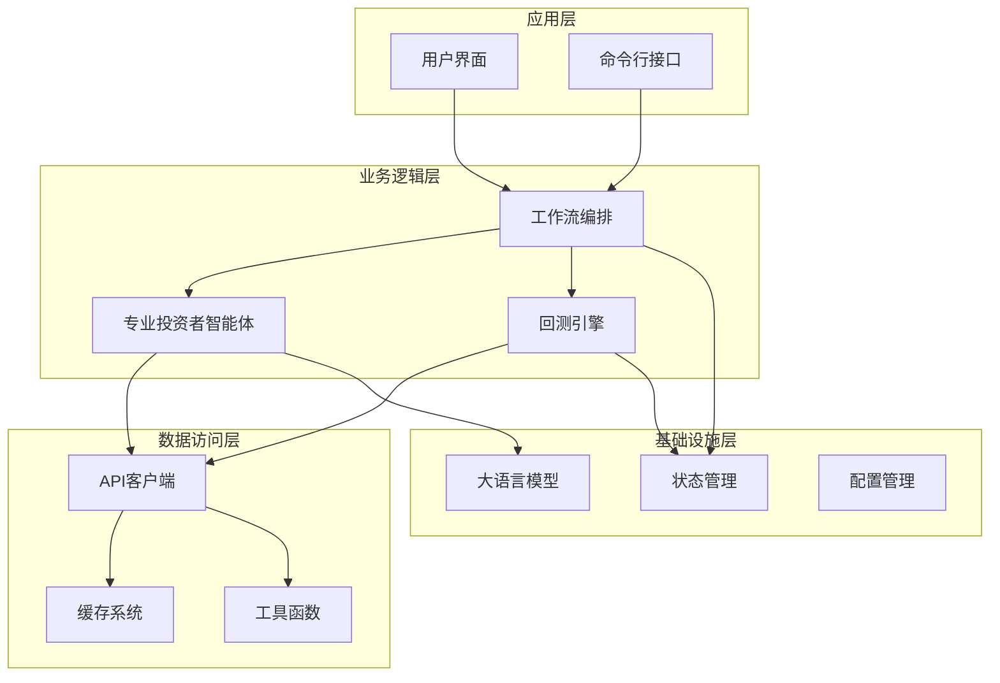
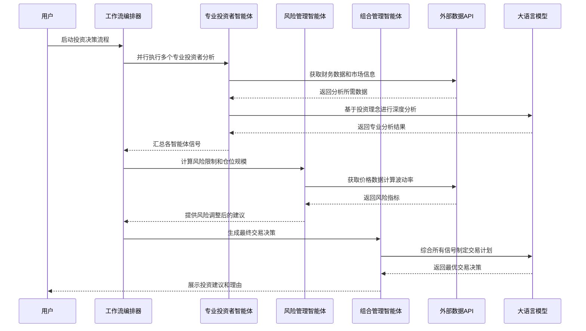
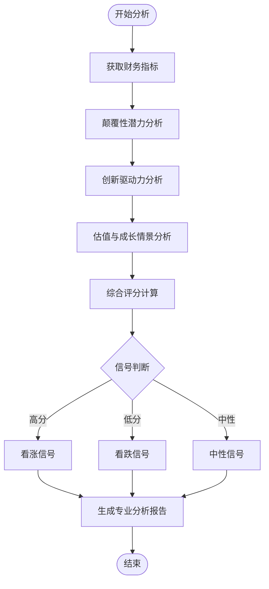
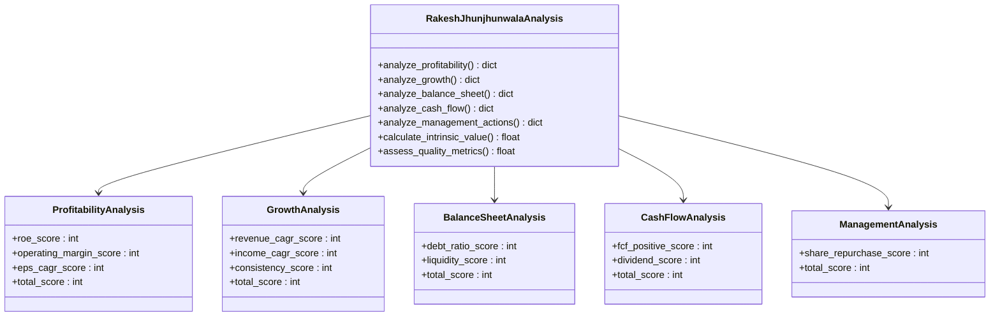
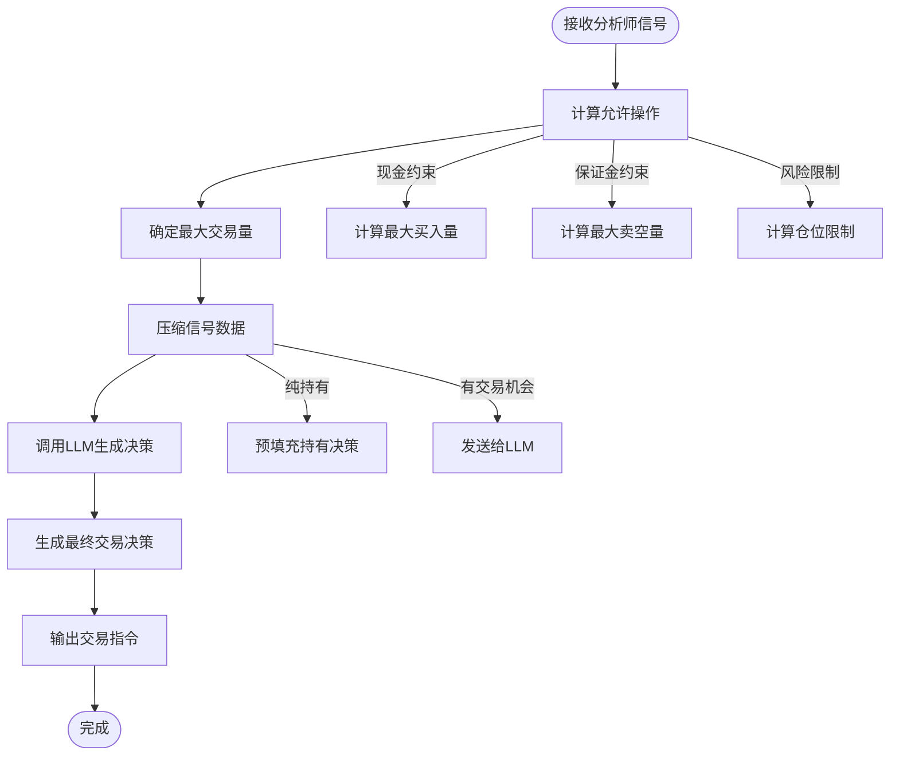
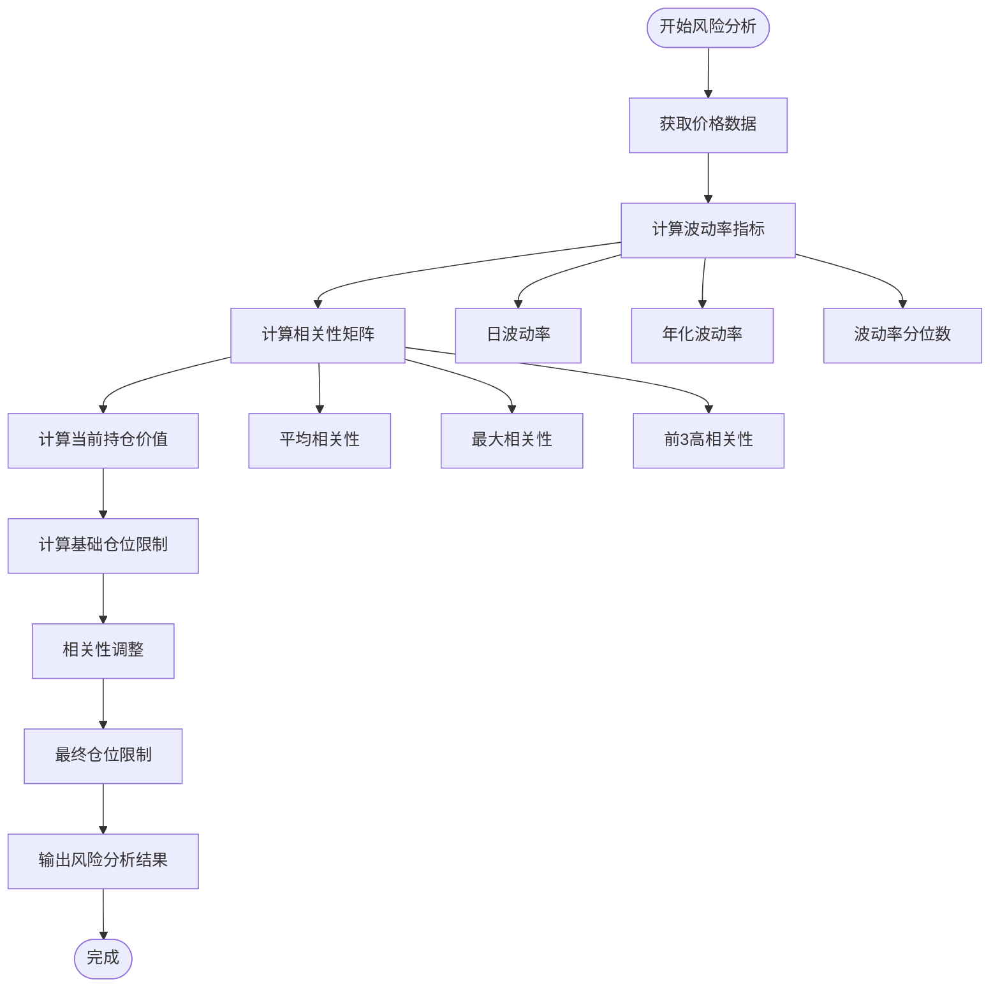
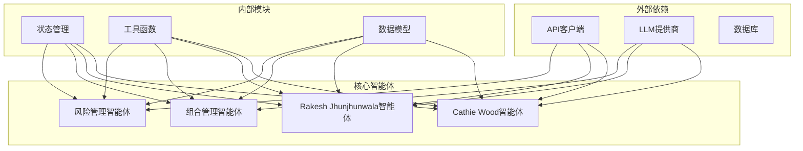

# 专业投资者智能体

<cite>
**本文档引用的文件**
- [cathie_wood.py](file://src/agents/cathie_wood.py)
- [rakesh_jhunjhunwala.py](file://src/agents/rakesh_jhunjhunwala.py)
- [portfolio_manager.py](file://src/agents/portfolio_manager.py)
- [risk_manager.py](file://src/agents/risk_manager.py)
- [state.py](file://src/graph/state.py)
- [llm.py](file://src/utils/llm.py)
- [api.py](file://src/tools/api.py)
- [main.py](file://src/main.py)
- [engine.py](file://src/backtesting/engine.py)
- [display.py](file://src/utils/display.py)
- [analysts.py](file://src/utils/analysts.py)
- [README.md](file://README.md)
</cite>

## 目录
1. [简介](#简介)
2. [项目结构](#项目结构)
3. [核心组件](#核心组件)
4. [架构概览](#架构概览)
5. [详细组件分析](#详细组件分析)
6. [依赖关系分析](#依赖关系分析)
7. [性能考虑](#性能考虑)
8. [故障排除指南](#故障排除指南)
9. [结论](#结论)
10. [附录](#附录)

## 简介

本项目是一个基于AI的专业投资者智能体系统，专门设计用于模拟和实现顶级专业投资者的投资理念与分析方法。该系统集成了多位传奇投资者的独特投资哲学，包括木头姐（Cathie Wood）的颠覆性创新投资理念、拉克什·贾亨努瓦拉（Rakesh Jhunjhunwala）的价值投资与质量评估体系，以及其他多位知名投资者的投资策略。

该智能体系统通过多代理协作的方式，实现了从数据获取、基本面分析、技术分析到最终交易决策的完整投资流程。每个专业投资者智能体都代表了特定的投资理念和分析方法论，为用户提供多元化的投资视角和决策支持。

## 项目结构

该项目采用模块化设计，主要分为以下几个核心层次：

**图表来源**
- [main.py:100-130](file://src/main.py#L100-L130)
- [state.py:15-18](file://src/graph/state.py#L15-L18)

**章节来源**
- [README.md:1-158](file://README.md#L1-L158)
- [main.py:1-180](file://src/main.py#L1-L180)

## 核心组件

### 专业投资者智能体

系统集成了多位传奇投资者的智能体，每个都代表独特的投资理念：

1. **木头姐智能体 (Cathie Wood)**：专注于颠覆性技术创新和增长投资
2. **拉克什·贾亨努瓦拉智能体**：强调价值投资和质量评估
3. **组合管理智能体**：负责最终交易决策和订单生成
4. **风险管理智能体**：控制风险敞口和仓位规模

### 工作流编排系统

采用LangGraph框架实现智能体间的协调工作，支持动态选择和组合不同的专业投资者策略。

### 数据获取与处理

集成多种金融数据源，包括股价、财务指标、新闻和内幕交易数据，通过统一的API接口提供给各个智能体使用。

**章节来源**
- [analysts.py:24-178](file://src/utils/analysts.py#L24-L178)
- [main.py:100-130](file://src/main.py#L100-L130)

## 架构概览

系统采用分层架构设计，实现了高度模块化和可扩展的智能体生态系统：

**图表来源**
- [main.py:46-89](file://src/main.py#L46-L89)
- [portfolio_manager.py:25-93](file://src/agents/portfolio_manager.py#L25-L93)

## 详细组件分析

### 木头姐智能体 (Cathie Wood)

木头姐智能体体现了"增长投资女王"的独特投资理念，专注于颠覆性技术创新和未来导向的投资机会。

#### 核心分析维度

**图表来源**
- [cathie_wood.py:19-108](file://src/agents/cathie_wood.py#L19-L108)

#### 分析方法论

1. **颠覆性潜力评估**：分析收入增长加速、研发强度、毛利率趋势、运营杠杆和市场份额动态
2. **创新驱动力分析**：评估研发投入趋势、自由现金流生成能力、运营效率和资本配置策略
3. **成长情景估值**：采用20%年增长率和15%折现率的简化DCF模型

#### 关键特征

- 重点关注具有突破性技术和商业模式的公司
- 偏好快速采用曲线和大规模市场的行业
- 投资于AI、机器人、基因测序、金融科技和区块链等领域
- 接受短期波动以换取长期收益

**章节来源**
- [cathie_wood.py:111-207](file://src/agents/cathie_wood.py#L111-L207)
- [cathie_wood.py:210-315](file://src/agents/cathie_wood.py#L210-L315)
- [cathie_wood.py:318-360](file://src/agents/cathie_wood.py#L318-L360)

### 拉克什·贾亨努瓦拉智能体

拉克什·贾亨努瓦拉智能体代表了印度"大牛市"的投资智慧，强调质量、安全边际和长期价值创造。

#### 综合评估框架

**图表来源**
- [rakesh_jhunjhunwala.py:162-243](file://src/agents/rakesh_jhunjhunwala.py#L162-L243)
- [rakesh_jhunjhunwala.py:246-324](file://src/agents/rakesh_jhunjhunwala.py#L246-L324)
- [rakesh_jhunjhunwala.py:327-371](file://src/agents/rakesh_jhunjhunwala.py#L327-L371)

#### 决策规则

智能体采用严格的安全边际原则：
- **30%安全边际**：只有当内在价值比当前价格高出30%以上时才给出看涨信号
- **质量评估**：通过ROE、债务水平、盈利一致性等指标评估公司质量
- **保守折现率**：根据公司质量调整折现率，高质量公司使用12%，低质量公司使用18%

#### 核心指标权重

| 分析维度 | 权重 | 关键指标 |
|---------|------|----------|
| 盈利能力 | 8分 | ROE > 20%, 操作利润率 > 20% |
| 成长性 | 7分 | 收入CAGR > 20%, 净利润CAGR > 25% |
| 资产负债表 | 4分 | 债务比率 < 50%, 流动比率 > 2.0 |
| 现金流 | 3分 | 正自由现金流, 股息支付 |
| 管理层行为 | 2分 | 股票回购, 避免稀释 |

**章节来源**
- [rakesh_jhunjhunwala.py:498-581](file://src/agents/rakesh_jhunjhunwala.py#L498-L581)
- [rakesh_jhunjhunwala.py:89-113](file://src/agents/rakesh_jhunjhunwala.py#L89-L113)

### 组合管理智能体

组合管理智能体负责将多个专业投资者的信号整合，生成最优的交易决策。

#### 交易决策流程

**图表来源**
- [portfolio_manager.py:177-262](file://src/agents/portfolio_manager.py#L177-L262)

#### 决策约束机制

1. **现金约束**：基于可用现金计算最大买入数量
2. **保证金约束**：根据保证金要求限制卖空规模
3. **风险限制**：基于风险管理智能体提供的限制进行仓位控制
4. **流动性约束**：考虑股票的买卖价差和流动性

#### 仓位管理策略

- **集中持股**：在优质标的上增加仓位
- **分散投资**：通过相关性分析避免过度集中
- **动态调整**：根据市场条件和信号强度调整仓位

**章节来源**
- [portfolio_manager.py:96-157](file://src/agents/portfolio_manager.py#L96-L157)
- [portfolio_manager.py:177-262](file://src/agents/portfolio_manager.py#L177-L262)

### 风险管理智能体

风险管理智能体通过波动率和相关性分析，为每个标的计算适当的风险调整后仓位限制。

#### 风险计算模型

**图表来源**
- [risk_manager.py:105-201](file://src/agents/risk_manager.py#L105-L201)

#### 波动率调整机制

| 年化波动率 | 基础仓位限制 | 调整系数 |
|-----------|-------------|----------|
| < 15%     | 25%         | 1.25     |
| 15%-30%   | 20%         | 1.0-0.5  |
| 30%-50%   | 15%         | 0.75-0.5 |
| > 50%     | 10%         | 0.50     |

#### 相关性调整机制

- **高相关性 (≥ 0.8)**：仓位限制减少30%
- **中高相关性 (0.6-0.8)**：仓位限制减少15%
- **中等相关性 (0.4-0.6)**：仓位限制保持不变
- **低相关性 (0.2-0.4)**：仓位限制增加5%
- **极低相关性 (< 0.2)**：仓位限制增加10%

**章节来源**
- [risk_manager.py:270-298](file://src/agents/risk_manager.py#L270-L298)
- [risk_manager.py:301-317](file://src/agents/risk_manager.py#L301-L317)

## 依赖关系分析

系统采用松耦合的设计，通过明确的接口和状态传递实现组件间的解耦。

**图表来源**
- [state.py:15-18](file://src/graph/state.py#L15-L18)
- [llm.py:10-84](file://src/utils/llm.py#L10-L84)

### 关键依赖关系

1. **API依赖**：所有智能体都依赖统一的API客户端获取市场数据
2. **LLM依赖**：通过统一的LLM调用接口实现多模型支持
3. **状态依赖**：通过AgentState实现智能体间的数据共享
4. **工具依赖**：提供通用的工具函数和辅助功能

**章节来源**
- [api.py:29-61](file://src/tools/api.py#L29-L61)
- [llm.py:10-84](file://src/utils/llm.py#L10-L84)

## 性能考虑

### 数据获取优化

系统实现了多层次的缓存机制，包括：
- **API响应缓存**：避免重复的API调用
- **数据序列化缓存**：快速恢复分析结果
- **批量数据获取**：减少网络请求次数

### 计算复杂度优化

1. **并行处理**：专业投资者智能体可以并行执行
2. **增量更新**：只对发生变化的数据重新计算
3. **内存管理**：及时释放不再使用的中间结果

### 扩展性设计

- **插件式架构**：新的专业投资者理念可以轻松添加
- **配置驱动**：通过配置文件调整参数和权重
- **模型抽象**：支持不同的LLM提供商和模型

## 故障排除指南

### 常见问题及解决方案

1. **API密钥错误**
   - 检查.env文件中的API密钥设置
   - 验证API配额和权限
   - 确认网络连接正常

2. **LLM调用失败**
   - 检查模型配置和提供商设置
   - 验证API密钥的有效性
   - 查看重试机制的日志输出

3. **数据获取超时**
   - 检查API响应时间
   - 调整重试参数
   - 实施本地缓存策略

4. **内存不足**
   - 清理临时数据和缓存
   - 调整批处理大小
   - 优化数据结构

**章节来源**
- [llm.py:72-84](file://src/utils/llm.py#L72-L84)
- [api.py:52-60](file://src/tools/api.py#L52-L60)

## 结论

本专业投资者智能体系统成功地将多位传奇投资者的投资理念数字化，通过AI技术实现了专业级的投资分析和决策支持。系统的主要优势包括：

1. **理念多样性**：集成了从价值投资到成长投资的多种投资理念
2. **技术先进性**：利用LLM进行深度分析和决策制定
3. **实践导向**：提供可执行的投资建议和风险管理策略
4. **教育价值**：帮助用户理解不同投资理念的特点和适用场景

该系统为专业投资者提供了强大的决策支持工具，同时也为普通投资者提供了学习和理解专业投资理念的机会。通过持续的优化和扩展，该系统有望成为AI投资领域的重要参考。

## 附录

### 配置建议

1. **模型选择**：根据分析需求选择合适的LLM模型
2. **参数调优**：根据市场环境调整分析参数和权重
3. **监控设置**：建立关键指标的监控和告警机制
4. **回测验证**：定期进行历史回测验证策略有效性

### 风险管理方法

1. **止损设置**：为每笔投资设定合理的止损点
2. **仓位控制**：根据风险承受能力控制总体仓位
3. **分散投资**：避免过度集中在单一资产或行业
4. **动态调整**：根据市场变化及时调整投资策略

### 最佳实践

1. **多角度分析**：结合多个专业投资者的建议进行综合判断
2. **长期视角**：避免短期波动影响长期投资决策
3. **持续学习**：跟踪市场变化，不断优化投资策略
4. **风险意识**：始终保持对潜在风险的警觉