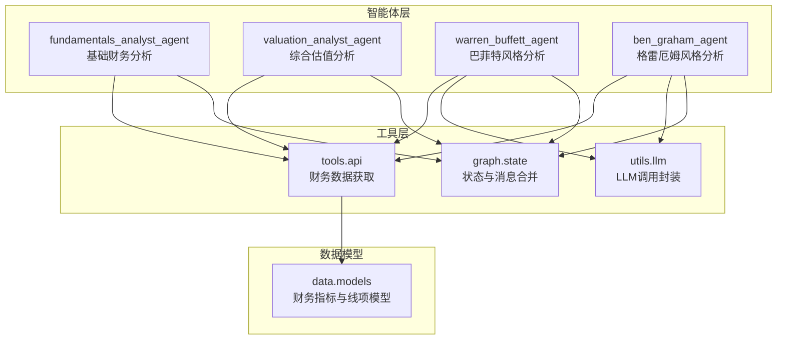
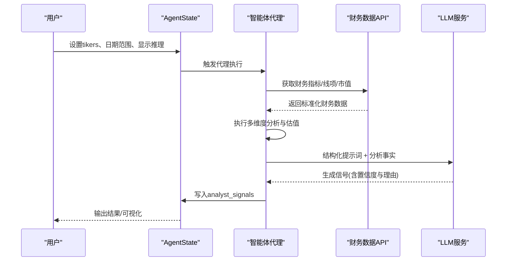
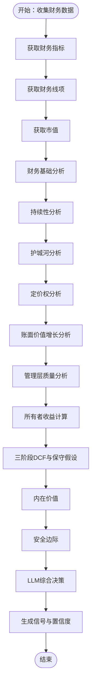
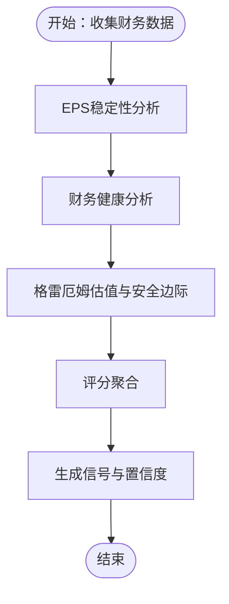
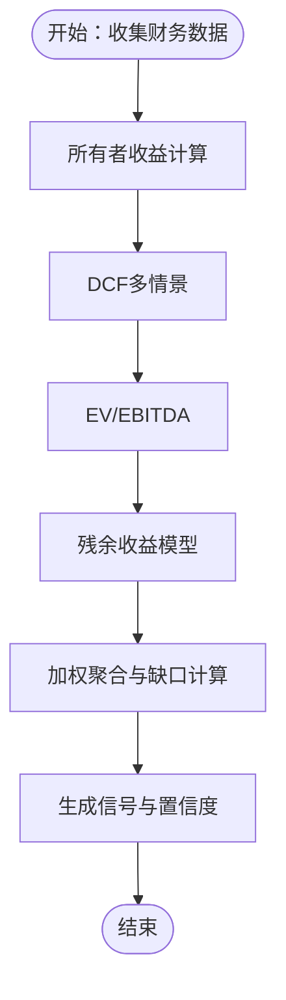
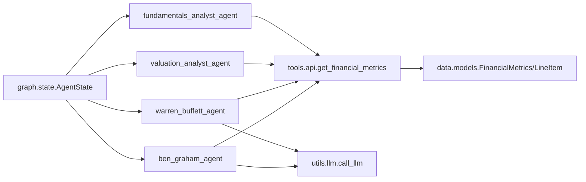
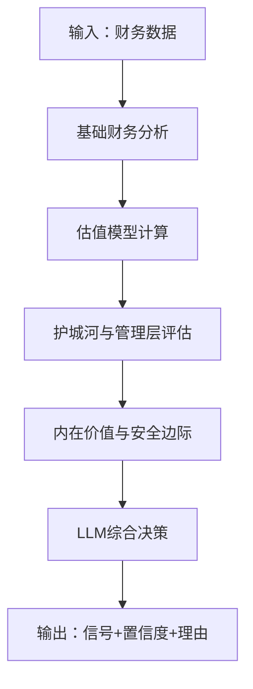

# 价值投资智能体

<cite>
**本文档引用的文件**
- [warren_buffett.py](file://src/agents/warren_buffett.py)
- [ben_graham.py](file://src/agents/ben_graham.py)
- [fundamentals.py](file://src/agents/fundamentals.py)
- [valuation.py](file://src/agents/valuation.py)
- [api.py](file://src/tools/api.py)
- [state.py](file://src/graph/state.py)
- [llm.py](file://src/utils/llm.py)
- [models.py](file://src/data/models.py)
- [test_valuation.py](file://tests/backtesting/test_valuation.py)
- [metrics.py](file://src/backtesting/metrics.py)
</cite>

## 目录
1. [简介](#简介)
2. [项目结构](#项目结构)
3. [核心组件](#核心组件)
4. [架构总览](#架构总览)
5. [详细组件分析](#详细组件分析)
6. [依赖关系分析](#依赖关系分析)
7. [性能考虑](#性能考虑)
8. [故障排除指南](#故障排除指南)
9. [结论](#结论)
10. [附录](#附录)

## 简介
本项目实现了基于经典价值投资理念（巴菲特、格雷厄姆等）的智能体系统，通过多维度财务分析与LLM推理生成买入、卖出或持有信号。系统支持：
- 巴菲特风格：ROE、债务水平、毛利率、护城河、管理层质量、内在价值与安全边际
- 格雷厄姆风格：盈利稳定性、财务健康度、NCAV/格雷厄姆数与安全边际
- 综合估值：DCF、所有者收益、EV/EBITDA、残余收益模型
- 多代理协同：基础分析、估值分析、巴菲特/格雷厄姆专家代理
- 回测与评估：组合价值计算、风险指标与回测输出

## 项目结构
后端采用模块化设计，前端提供可视化界面与工作流编排。核心价值投资智能体位于 `src/agents`，数据接口在 `src/tools/api.py`，状态管理在 `src/graph/state.py`，LLM调用封装在 `src/utils/llm.py`。

图表来源
- [fundamentals.py:11-164](file://src/agents/fundamentals.py#L11-L164)
- [valuation.py:21-221](file://src/agents/valuation.py#L21-L221)
- [warren_buffett.py:19-153](file://src/agents/warren_buffett.py#L19-L153)
- [ben_graham.py:20-94](file://src/agents/ben_graham.py#L20-L94)
- [api.py:99-181](file://src/tools/api.py#L99-L181)
- [state.py:15-19](file://src/graph/state.py#L15-L19)
- [llm.py:10-84](file://src/utils/llm.py#L10-L84)
- [models.py:18-62](file://src/data/models.py#L18-L62)

章节来源
- [fundamentals.py:11-164](file://src/agents/fundamentals.py#L11-L164)
- [valuation.py:21-221](file://src/agents/valuation.py#L21-L221)
- [warren_buffett.py:19-153](file://src/agents/warren_buffett.py#L19-L153)
- [ben_graham.py:20-94](file://src/agents/ben_graham.py#L20-L94)
- [api.py:99-181](file://src/tools/api.py#L99-L181)
- [state.py:15-19](file://src/graph/state.py#L15-L19)
- [llm.py:10-84](file://src/utils/llm.py#L10-L84)
- [models.py:18-62](file://src/data/models.py#L18-L62)

## 核心组件
- 基础财务分析代理：基于ROE、利润率、增长、流动性、杠杆、现金流与估值比率生成信号
- 综合估值代理：多模型融合（DCF、所有者收益、EV/EBITDA、残余收益），加权聚合并给出置信度
- 巴菲特风格代理：强调护城河、定价权、管理层、所有者收益与内在价值，结合安全边际
- 格雷厄姆风格代理：强调盈利稳定性、财务健康、NCAV/格雷厄姆数与安全边际
- 数据工具：统一获取财务指标、线项、市场容量与价格数据
- 状态与LLM：统一状态结构、消息合并、LLM结构化输出与重试机制

章节来源
- [fundamentals.py:11-164](file://src/agents/fundamentals.py#L11-L164)
- [valuation.py:21-221](file://src/agents/valuation.py#L21-L221)
- [warren_buffett.py:19-153](file://src/agents/warren_buffett.py#L19-L153)
- [ben_graham.py:20-94](file://src/agents/ben_graham.py#L20-L94)
- [api.py:99-181](file://src/tools/api.py#L99-L181)
- [state.py:15-19](file://src/graph/state.py#L15-L19)
- [llm.py:10-84](file://src/utils/llm.py#L10-L84)

## 架构总览
智能体通过统一状态结构接收输入，按需调用外部财务数据API，执行多维度分析，最终由LLM生成结构化信号与理由，并写入状态供后续流程使用。

图表来源
- [state.py:15-19](file://src/graph/state.py#L15-L19)
- [api.py:99-181](file://src/tools/api.py#L99-L181)
- [llm.py:10-84](file://src/utils/llm.py#L10-L84)
- [warren_buffett.py:746-826](file://src/agents/warren_buffett.py#L746-L826)
- [ben_graham.py:282-349](file://src/agents/ben_graham.py#L282-L349)

## 详细组件分析

### 巴菲特风格智能体（warren_buffett_agent）
- 财务基础分析：ROE、债务水平、运营利润率、流动比率
- 持续性分析：净利润趋势与复合增长率
- 护城河分析：ROE一致性、运营利润率稳定性、资产周转效率、整体稳定性
- 定价权分析：毛利率趋势与稳定性、高毛利率表现
- 股东回报与管理层：股票回购/发行、分红记录
- 内在价值计算：所有者收益三阶段DCF + 巴菲特保守假设 + 额外安全边际
- 安全边际：内在价值与市值差额比
- 信号生成：LLM综合判断，规则明确（强业务且安全边际>0为看涨）

图表来源
- [warren_buffett.py:156-202](file://src/agents/warren_buffett.py#L156-L202)
- [warren_buffett.py:205-235](file://src/agents/warren_buffett.py#L205-L235)
- [warren_buffett.py:238-334](file://src/agents/warren_buffett.py#L238-L334)
- [warren_buffett.py:337-377](file://src/agents/warren_buffett.py#L337-L377)
- [warren_buffett.py:380-453](file://src/agents/warren_buffett.py#L380-L453)
- [warren_buffett.py:508-624](file://src/agents/warren_buffett.py#L508-L624)
- [warren_buffett.py:627-694](file://src/agents/warren_buffett.py#L627-L694)
- [warren_buffett.py:696-743](file://src/agents/warren_buffett.py#L696-L743)
- [warren_buffett.py:746-826](file://src/agents/warren_buffett.py#L746-L826)

章节来源
- [warren_buffett.py:19-153](file://src/agents/warren_buffett.py#L19-L153)
- [warren_buffett.py:156-202](file://src/agents/warren_buffett.py#L156-L202)
- [warren_buffett.py:205-235](file://src/agents/warren_buffett.py#L205-L235)
- [warren_buffett.py:238-334](file://src/agents/warren_buffett.py#L238-L334)
- [warren_buffett.py:337-377](file://src/agents/warren_buffett.py#L337-L377)
- [warren_buffett.py:380-453](file://src/agents/warren_buffett.py#L380-L453)
- [warren_buffett.py:508-624](file://src/agents/warren_buffett.py#L508-L624)
- [warren_buffett.py:627-694](file://src/agents/warren_buffett.py#L627-L694)
- [warren_buffett.py:696-743](file://src/agents/warren_buffett.py#L696-L743)
- [warren_buffett.py:746-826](file://src/agents/warren_buffett.py#L746-L826)

### 格雷厄姆风格智能体（ben_graham_agent）
- 盈利稳定性：多年EPS正向与增长趋势
- 财务健康：流动比率、债务比率、股息记录
- 估值与安全边际：NCAV（净流动资产价值）、格雷厄姆数（sqrt(22.5×EPS×BVPS)）与安全边际
- 信号映射：三类分析得分聚合，阈值决定看涨/中性/看跌

图表来源
- [ben_graham.py:97-139](file://src/agents/ben_graham.py#L97-L139)
- [ben_graham.py:141-204](file://src/agents/ben_graham.py#L141-L204)
- [ben_graham.py:207-279](file://src/agents/ben_graham.py#L207-L279)
- [ben_graham.py:282-349](file://src/agents/ben_graham.py#L282-L349)

章节来源
- [ben_graham.py:20-94](file://src/agents/ben_graham.py#L20-L94)
- [ben_graham.py:97-139](file://src/agents/ben_graham.py#L97-L139)
- [ben_graham.py:141-204](file://src/agents/ben_graham.py#L141-L204)
- [ben_graham.py:207-279](file://src/agents/ben_graham.py#L207-L279)
- [ben_graham.py:282-349](file://src/agents/ben_graham.py#L282-L349)

### 基础财务分析代理（fundamentals_analyst_agent）
- 利润能力：ROE、净利率、运营利润率
- 增长能力：营收、EPS、账面价值复合增长
- 财务健康：流动比率、D/E、自由现金流/EPS转换
- 估值比率：PE、PB、PS
- 信号合成：各维度得分多数决，置信度为多数/总数

章节来源
- [fundamentals.py:11-164](file://src/agents/fundamentals.py#L11-L164)

### 综合估值代理（valuation_analyst_agent）
- 所有者收益DCF：保守折现、安全边际、多阶段增长
- DCF场景：熊/牛/基情景概率加权
- EV/EBITDA：中位倍数推导隐含企业价值
- 残余收益模型：基于账面价值与增长
- 加权聚合：不同模型权重，计算与市值的缺口，形成信号与置信度

图表来源
- [valuation.py:21-221](file://src/agents/valuation.py#L21-L221)
- [valuation.py:226-281](file://src/agents/valuation.py#L226-L281)
- [valuation.py:283-299](file://src/agents/valuation.py#L283-L299)
- [valuation.py:302-331](file://src/agents/valuation.py#L302-L331)
- [valuation.py:451-495](file://src/agents/valuation.py#L451-L495)

章节来源
- [valuation.py:21-221](file://src/agents/valuation.py#L21-L221)
- [valuation.py:226-281](file://src/agents/valuation.py#L226-L281)
- [valuation.py:283-299](file://src/agents/valuation.py#L283-L299)
- [valuation.py:302-331](file://src/agents/valuation.py#L302-L331)
- [valuation.py:451-495](file://src/agents/valuation.py#L451-L495)

### 数据与状态管理
- 统一状态结构：messages、data、metadata，支持消息合并与推理展示
- LLM调用封装：结构化输出、重试、默认响应与模型配置提取
- 财务数据模型：标准化财务指标与线项字段，便于跨代理复用

章节来源
- [state.py:15-19](file://src/graph/state.py#L15-L19)
- [state.py:21-52](file://src/graph/state.py#L21-L52)
- [llm.py:10-84](file://src/utils/llm.py#L10-L84)
- [models.py:18-62](file://src/data/models.py#L18-L62)

## 依赖关系分析

图表来源
- [fundamentals.py:24-30](file://src/agents/fundamentals.py#L24-L30)
- [valuation.py:34-40](file://src/agents/valuation.py#L34-L40)
- [warren_buffett.py:32-59](file://src/agents/warren_buffett.py#L32-L59)
- [ben_graham.py:38-44](file://src/agents/ben_graham.py#L38-L44)
- [api.py:99-138](file://src/tools/api.py#L99-L138)
- [models.py:18-62](file://src/data/models.py#L18-L62)
- [state.py:15-19](file://src/graph/state.py#L15-L19)
- [llm.py:10-84](file://src/utils/llm.py#L10-L84)

章节来源
- [fundamentals.py:24-30](file://src/agents/fundamentals.py#L24-L30)
- [valuation.py:34-40](file://src/agents/valuation.py#L34-L40)
- [warren_buffett.py:32-59](file://src/agents/warren_buffett.py#L32-L59)
- [ben_graham.py:38-44](file://src/agents/ben_graham.py#L38-L44)
- [api.py:99-138](file://src/tools/api.py#L99-L138)
- [models.py:18-62](file://src/data/models.py#L18-L62)
- [state.py:15-19](file://src/graph/state.py#L15-L19)
- [llm.py:10-84](file://src/utils/llm.py#L10-L84)

## 性能考虑
- 缓存与重试：API请求具备速率限制处理与指数退避，减少重复调用
- 并行化：多代理可并行执行，提升吞吐
- 保守假设：DCF与估值模型内置保守参数，降低过拟合风险
- 可扩展性：模型权重与阈值可通过配置调整，适应不同市场环境

## 故障排除指南
- API限流：自动等待并重试；检查环境变量 `FINANCIAL_DATASETS_API_KEY`
- 数据缺失：代理会返回“不足数据”提示；确认指标字段是否存在
- LLM解析失败：提供默认响应与重试；确保模型支持结构化输出
- 回测异常：检查组合快照与当前价格映射是否一致

章节来源
- [api.py:29-61](file://src/tools/api.py#L29-L61)
- [llm.py:72-84](file://src/utils/llm.py#L72-L84)
- [test_valuation.py:4-50](file://tests/backtesting/test_valuation.py#L4-L50)

## 结论
该价值投资智能体系统以经典理论为基础，结合现代数据与LLM推理，实现了从财务指标到内在价值与安全边际的闭环分析。通过多代理协同与可配置参数，既能满足学术研究，也能支撑实盘回测与策略优化。

## 附录

### 价值投资核心指标与评估标准
- ROE：巴菲特偏好持续高于门槛的ROE（如15%以上）
- 债务水平：低负债/权益比率（如<0.5），关注利息覆盖率
- 毛利率/运营利润率：稳定或上升趋势，反映定价权
- 流动性：流动比率>1.5，短期偿债能力强
- 自由现金流：持续正向且与净利润匹配
- 市净率（PB）：结合行业与成长性合理评估
- 市销率（PS）：用于早期或亏损公司估值参考
- 市盈率（PE）：结合增长与周期性因素

章节来源
- [warren_buffett.py:166-200](file://src/agents/warren_buffett.py#L166-L200)
- [ben_graham.py:158-184](file://src/agents/ben_graham.py#L158-L184)
- [fundamentals.py:44-119](file://src/agents/fundamentals.py#L44-L119)

### 内在价值计算模型与安全边际
- 巴菲特风格：所有者收益三阶段DCF + 巴菲特保守假设 + 15%额外安全边际
- 格雷厄姆风格：NCAV与格雷厄姆数，安全边际>50%为强买
- 综合风格：多模型加权聚合，缺口>15%为看涨，<−15%为看跌

章节来源
- [warren_buffett.py:508-624](file://src/agents/warren_buffett.py#L508-L624)
- [ben_graham.py:207-279](file://src/agents/ben_graham.py#L207-L279)
- [valuation.py:144-164](file://src/agents/valuation.py#L144-L164)

### 护城河分析实现要点
- ROE一致性：长期高ROE占比（如≥80%）
- 运营利润率稳定性：近期平均>前期平均
- 资产效率：资产周转率>1.0
- 经营稳定性：COV（变异系数）低

章节来源
- [warren_buffett.py:238-334](file://src/agents/warren_buffett.py#L238-L334)

### 多维度财务分析生成信号流程

图表来源
- [warren_buffett.py:19-153](file://src/agents/warren_buffett.py#L19-L153)
- [ben_graham.py:20-94](file://src/agents/ben_graham.py#L20-L94)
- [valuation.py:21-221](file://src/agents/valuation.py#L21-L221)

### 参数配置与效果评估建议
- 参数配置
  - 巴菲特：ROE门槛、债务比率上限、利润率阈值、DCF折现率、安全边际比例
  - 格雷厄姆：流动比率阈值、债务比率上限、NCAV折扣阈值、格雷厄姆数安全边际
  - 综合估值：各模型权重、DCF阶段年数、WACC上下限、场景概率
- 效果评估
  - 回测指标：夏普比率、索提诺比率、最大回撤、净值曲线
  - 组合暴露：多空头寸、总/净敞口、多空比
  - 信号分布：看涨/中性/看跌频率与胜率

章节来源
- [metrics.py:8-78](file://src/backtesting/metrics.py#L8-L78)
- [test_valuation.py:4-50](file://tests/backtesting/test_valuation.py#L4-L50)