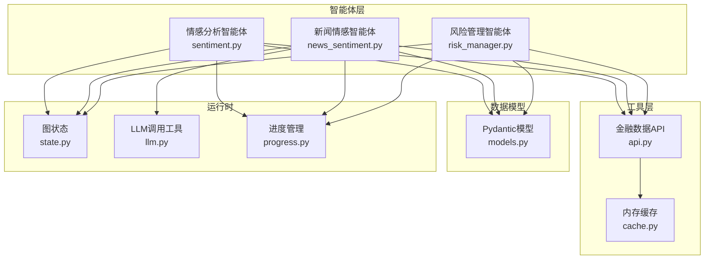
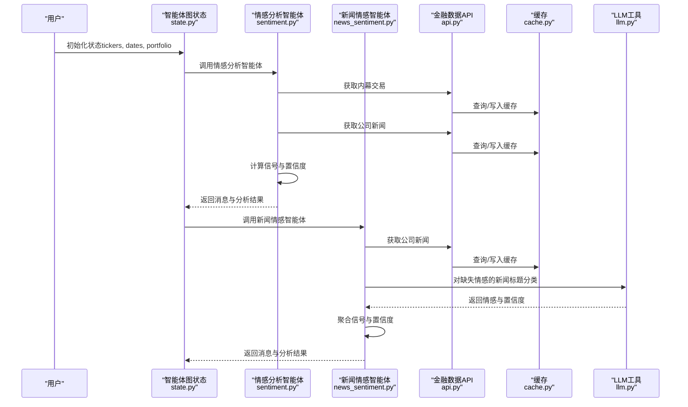
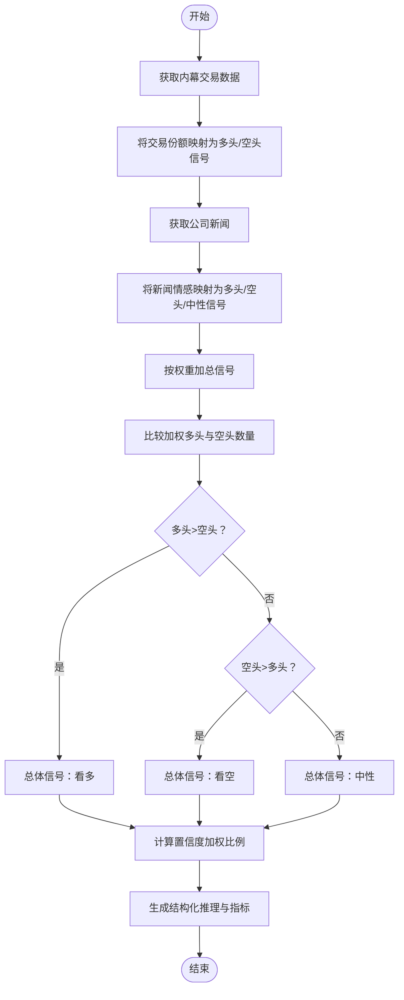
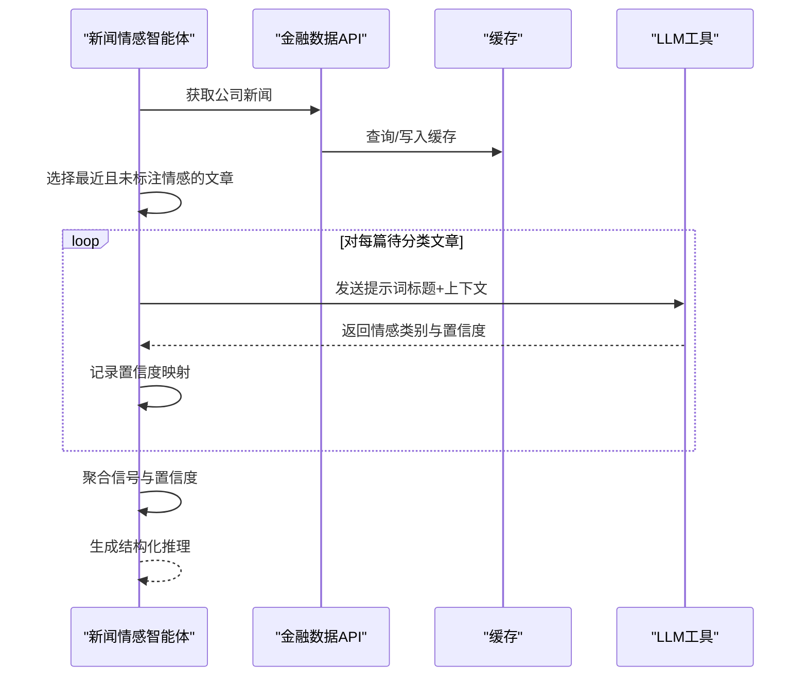
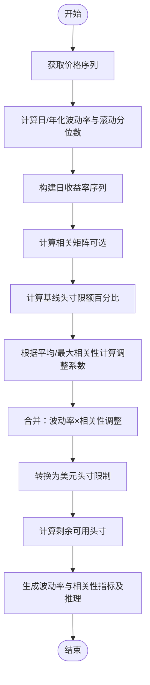
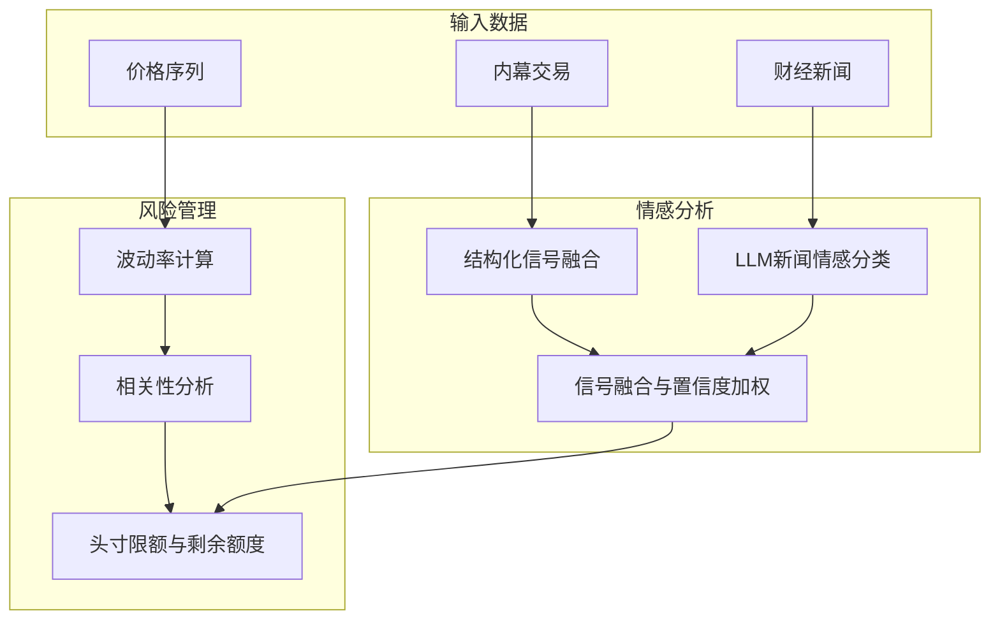
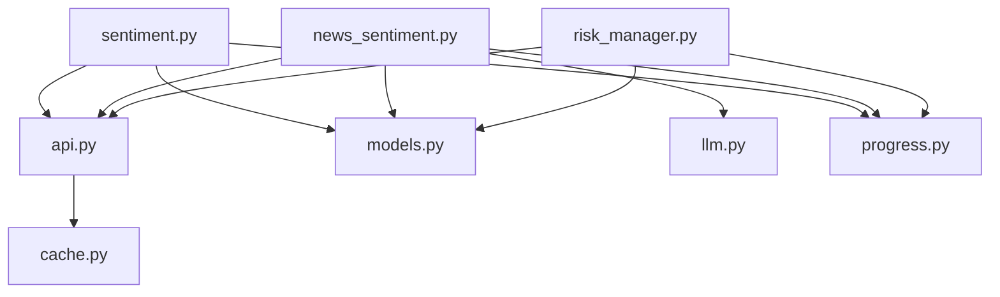

# 情感分析智能体

<cite>
**本文档引用的文件**
- [sentiment.py](file://src/agents/sentiment.py)
- [news_sentiment.py](file://src/agents/news_sentiment.py)
- [risk_manager.py](file://src/agents/risk_manager.py)
- [api.py](file://src/tools/api.py)
- [models.py](file://src/data/models.py)
- [state.py](file://src/graph/state.py)
- [llm.py](file://src/utils/llm.py)
- [progress.py](file://src/utils/progress.py)
- [cache.py](file://src/data/cache.py)
- [metrics.py](file://src/backtesting/metrics.py)
</cite>

## 目录
1. [简介](#简介)
2. [项目结构](#项目结构)
3. [核心组件](#核心组件)
4. [架构总览](#架构总览)
5. [详细组件分析](#详细组件分析)
6. [依赖关系分析](#依赖关系分析)
7. [性能考量](#性能考量)
8. [故障排除指南](#故障排除指南)
9. [结论](#结论)
10. [附录](#附录)

## 简介
本文件系统性阐述情感分析智能体在AI对冲基金项目中的实现与应用，覆盖以下主题：
- 新闻情感分析与社交媒体情绪监测
- 市场恐慌指数与极端情绪识别
- 文本挖掘与自然语言处理（NLP）技术
- 情感强度计算与置信度评估
- 多源数据融合：财经新闻、分析师报告、社交媒体
- 情感信号在投资决策与风险管理中的作用
- 效果评估指标与回测框架

情感分析智能体通过两大路径实现：
- 结构化信号融合：基于内幕交易与公司新闻的信号加权聚合
- LLM驱动的新闻情感分类：对缺失情感标注的新闻标题进行分类，并结合置信度加权

## 项目结构
情感分析相关代码主要位于以下模块：
- 智能体层：情感分析智能体与新闻情感智能体
- 工具层：金融数据API封装与缓存
- 数据模型：统一的数据结构定义
- 图状态：智能体图的状态传递与推理展示
- LLM工具：结构化输出与重试机制
- 进度管理：多智能体并行执行的可视化进度
- 风险管理：基于波动率与相关性的风险控制

**图表来源**
- [sentiment.py:12-139](file://src/agents/sentiment.py#L12-L139)
- [news_sentiment.py:25-164](file://src/agents/news_sentiment.py#L25-L164)
- [risk_manager.py:11-219](file://src/agents/risk_manager.py#L11-L219)
- [api.py:63-366](file://src/tools/api.py#L63-L366)
- [models.py:102-139](file://src/data/models.py#L102-L139)
- [state.py:15-52](file://src/graph/state.py#L15-L52)
- [llm.py:10-84](file://src/utils/llm.py#L10-L84)
- [progress.py:12-117](file://src/utils/progress.py#L12-L117)

**章节来源**
- [sentiment.py:12-139](file://src/agents/sentiment.py#L12-L139)
- [news_sentiment.py:25-164](file://src/agents/news_sentiment.py#L25-L164)
- [risk_manager.py:11-219](file://src/agents/risk_manager.py#L11-L219)
- [api.py:63-366](file://src/tools/api.py#L63-L366)
- [models.py:102-139](file://src/data/models.py#L102-L139)
- [state.py:15-52](file://src/graph/state.py#L15-L52)
- [llm.py:10-84](file://src/utils/llm.py#L10-L84)
- [progress.py:12-117](file://src/utils/progress.py#L12-L117)

## 核心组件
- 情感分析智能体（结构化信号融合）
  - 输入：多只股票、结束日期、API密钥
  - 数据来源：公司新闻、内幕交易
  - 处理逻辑：分别统计多头/空头信号数量，按权重加总，比较得出总体信号与置信度
  - 输出：每只股票的信号、置信度与结构化推理
- 新闻情感智能体（LLM分类）
  - 输入：多只股票、结束日期、API密钥
  - 数据来源：公司新闻
  - 处理逻辑：对缺失情感标注的新闻标题使用LLM分类；聚合后计算信号与置信度
  - 输出：每只股票的信号、置信度与结构化推理
- 风险管理智能体（波动率与相关性调整）
  - 输入：组合头寸、价格序列
  - 处理逻辑：计算日/年化波动率、滚动分位数、相关矩阵，结合基线限额与相关性乘数得到剩余头寸限制
  - 输出：每只股票的剩余头寸限制、波动率与相关性指标及推理

**章节来源**
- [sentiment.py:12-139](file://src/agents/sentiment.py#L12-L139)
- [news_sentiment.py:25-164](file://src/agents/news_sentiment.py#L25-L164)
- [risk_manager.py:11-219](file://src/agents/risk_manager.py#L11-L219)

## 架构总览
情感分析智能体在整体系统中的位置如下：

**图表来源**
- [state.py:15-52](file://src/graph/state.py#L15-L52)
- [sentiment.py:12-139](file://src/agents/sentiment.py#L12-L139)
- [news_sentiment.py:25-164](file://src/agents/news_sentiment.py#L25-L164)
- [api.py:63-366](file://src/tools/api.py#L63-L366)
- [cache.py:1-72](file://src/data/cache.py#L1-L72)
- [llm.py:10-84](file://src/utils/llm.py#L10-L84)

## 详细组件分析

### 组件A：情感分析智能体（结构化信号融合）
该智能体通过“内幕交易”和“公司新闻”两条信号线进行加权融合，形成对每只股票的总体信号与置信度。

**图表来源**
- [sentiment.py:12-139](file://src/agents/sentiment.py#L12-L139)

**章节来源**
- [sentiment.py:12-139](file://src/agents/sentiment.py#L12-L139)

### 组件B：新闻情感智能体（LLM分类）
该智能体对缺失情感标注的新闻标题进行分类，并结合LLM置信度与信号比例计算最终置信度。

**图表来源**
- [news_sentiment.py:25-164](file://src/agents/news_sentiment.py#L25-L164)
- [llm.py:10-84](file://src/utils/llm.py#L10-L84)
- [api.py:249-312](file://src/tools/api.py#L249-L312)
- [cache.py:56-62](file://src/data/cache.py#L56-L62)

**章节来源**
- [news_sentiment.py:25-164](file://src/agents/news_sentiment.py#L25-L164)
- [llm.py:10-84](file://src/utils/llm.py#L10-L84)

### 组件C：风险管理智能体（波动率与相关性调整）
该智能体基于历史价格序列计算波动率与相关性，结合基线限额与相关性乘数，给出每只股票的剩余头寸限制。

**图表来源**
- [risk_manager.py:11-219](file://src/agents/risk_manager.py#L11-L219)

**章节来源**
- [risk_manager.py:11-219](file://src/agents/risk_manager.py#L11-L219)

### 概念性总览
情感分析智能体在投资决策中的作用：
- 识别市场过度乐观/悲观情绪：通过信号强度与置信度阈值判断极端情绪
- 多源数据融合：将结构化信号与LLM分类结果进行加权融合
- 风险管理联动：将情感信号纳入风险限额与头寸分配策略

[此图为概念性流程图，不直接映射具体源码文件，故无需图表来源]

## 依赖关系分析
- 模型与数据
  - 使用Pydantic模型统一表示价格、财务指标、新闻、内幕交易等数据结构
- API与缓存
  - 通过统一的API封装访问外部金融数据，使用内存缓存避免重复请求
- LLM集成
  - 通过结构化输出与重试机制确保分类结果稳定
- 进度管理
  - 多智能体并行执行时提供实时进度可视化

**图表来源**
- [sentiment.py:12-139](file://src/agents/sentiment.py#L12-L139)
- [news_sentiment.py:25-164](file://src/agents/news_sentiment.py#L25-L164)
- [risk_manager.py:11-219](file://src/agents/risk_manager.py#L11-L219)
- [api.py:63-366](file://src/tools/api.py#L63-L366)
- [models.py:102-139](file://src/data/models.py#L102-L139)
- [cache.py:1-72](file://src/data/cache.py#L1-L72)
- [llm.py:10-84](file://src/utils/llm.py#L10-L84)
- [progress.py:12-117](file://src/utils/progress.py#L12-L117)

**章节来源**
- [models.py:102-139](file://src/data/models.py#L102-L139)
- [api.py:63-366](file://src/tools/api.py#L63-L366)
- [cache.py:1-72](file://src/data/cache.py#L1-L72)
- [llm.py:10-84](file://src/utils/llm.py#L10-L84)
- [progress.py:12-117](file://src/utils/progress.py#L12-L117)

## 性能考量
- 缓存策略
  - API响应按参数键精确缓存，避免重复网络请求
- LLM调用优化
  - 仅对最近且缺失情感标注的新闻进行分类，限制分析数量以降低成本
- 并行执行
  - 多智能体并行推进，进度可视化减少等待感知
- 数值稳定性
  - 波动率与相关性计算采用滚动窗口与异常值保护，避免NaN传播

[本节为通用性能讨论，不直接分析具体文件，故无章节来源]

## 故障排除指南
- LLM调用失败
  - 检查模型配置与API密钥；查看重试日志与默认响应
- API限流
  - 观察429错误与退避延迟；确认缓存命中情况
- 无价格数据
  - 风险管理智能体会使用默认波动率与警告状态；检查数据获取链路
- 推理输出
  - 启用推理展示以定位问题；确认状态更新与分析字段

**章节来源**
- [llm.py:10-84](file://src/utils/llm.py#L10-L84)
- [api.py:29-61](file://src/tools/api.py#L29-L61)
- [risk_manager.py:37-45](file://src/agents/risk_manager.py#L37-L45)
- [state.py:21-52](file://src/graph/state.py#L21-L52)

## 结论
情感分析智能体通过“结构化信号融合”与“LLM驱动的新闻情感分类”双通道，实现了对多源市场的综合情绪洞察。结合风险管理智能体的波动率与相关性调整，为投资决策提供了可量化的信号与风险控制依据。建议持续优化LLM分类的上下文与提示词，扩展社交媒体与分析师报告的接入，以进一步提升极端情绪识别能力与预测精度。

[本节为总结性内容，不直接分析具体文件，故无章节来源]

## 附录

### A. 情感分析在风险管理中的应用方法
- 信号阈值与置信度
  - 将情感信号与置信度作为风险限额的调节因子：高置信度的极端信号可能触发更严格的头寸限制
- 动态限额调整
  - 在波动率基础上叠加情感相关性调整，避免在恐慌/非理性繁荣时期过度集中
- 回测与评估
  - 使用回测指标（夏普比率、索提诺比率、最大回撤）评估情感信号对组合收益与风险的影响

**章节来源**
- [risk_manager.py:11-219](file://src/agents/risk_manager.py#L11-L219)
- [metrics.py:8-78](file://src/backtesting/metrics.py#L8-L78)

### B. 效果评估指标
- 收益率指标
  - 夏普比率、索提诺比率
- 回撤与稳定性
  - 最大回撤、最大回撤发生日期
- 信号质量
  - 置信度分布、信号一致性、误报率与漏报率（需结合外部标注）

**章节来源**
- [metrics.py:22-78](file://src/backtesting/metrics.py#L22-L78)