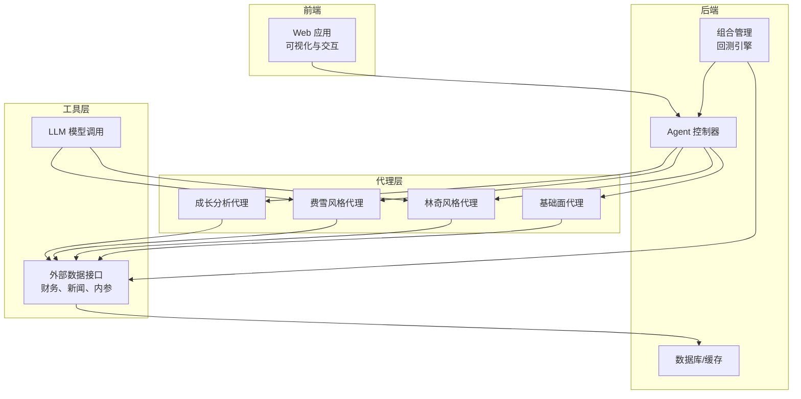
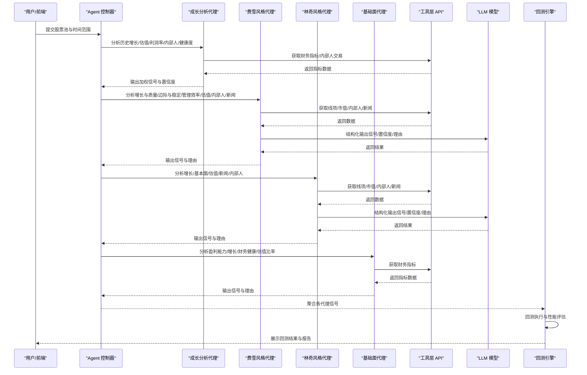
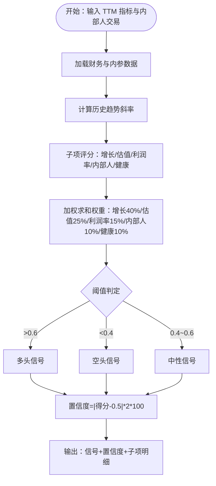
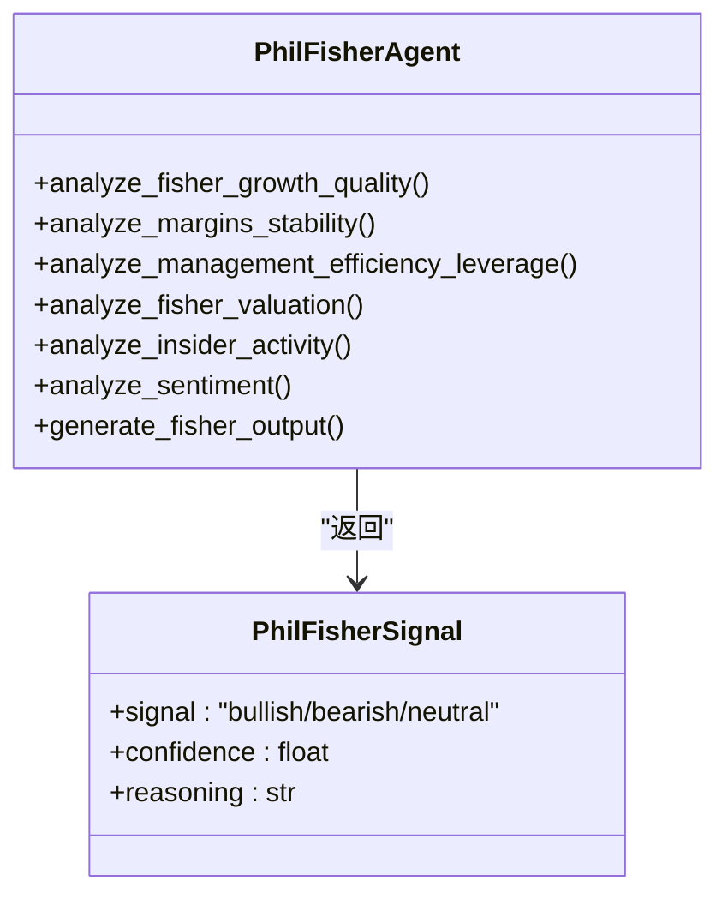
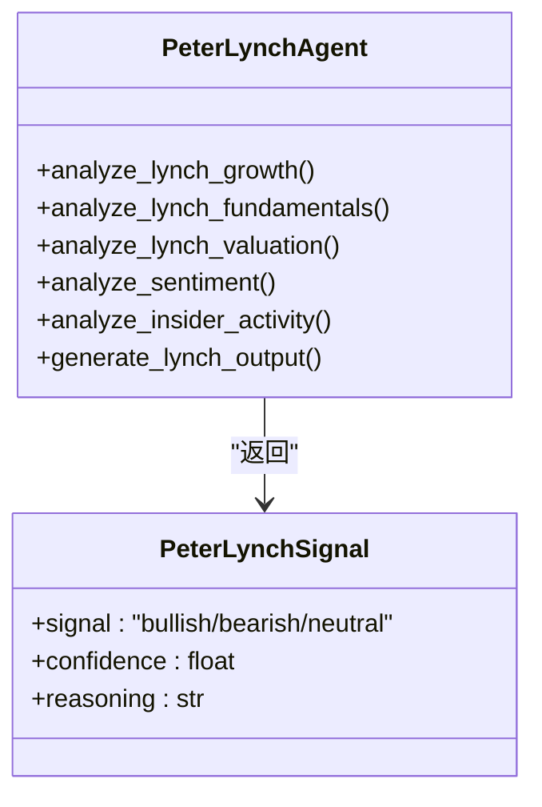
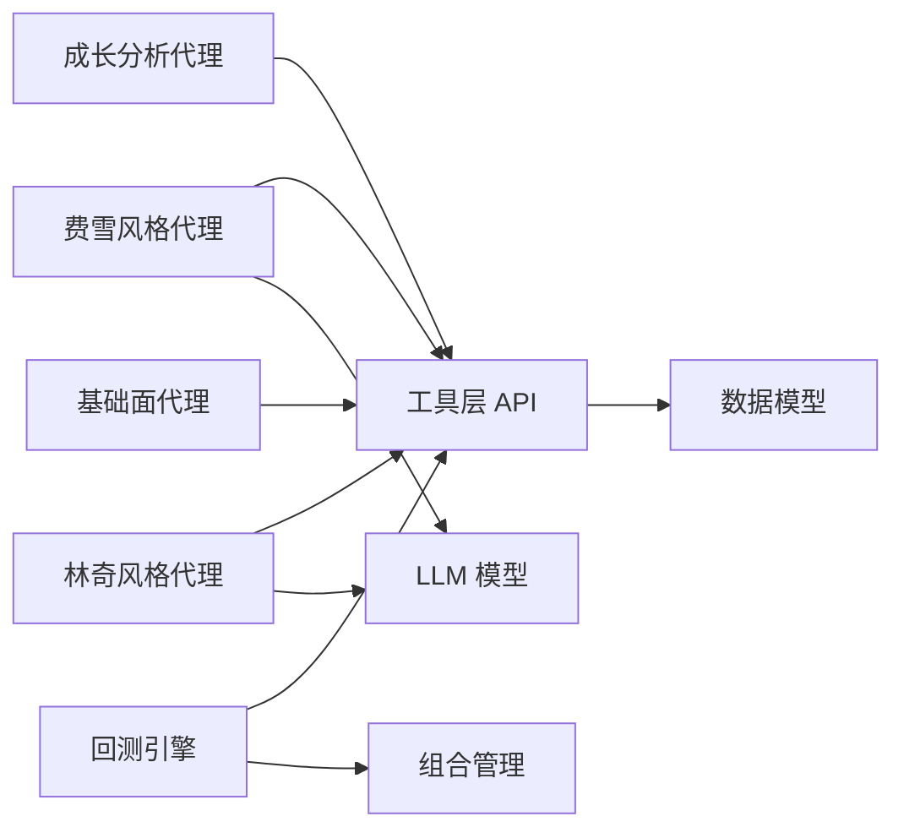

# 成长投资智能体

<cite>
**本文档引用的文件**
- [growth_agent.py](file://src/agents/growth_agent.py)
- [phil_fisher.py](file://src/agents/phil_fisher.py)
- [peter_lynch.py](file://src/agents/peter_lynch.py)
- [fundamentals.py](file://src/agents/fundamentals.py)
- [api.py](file://src/tools/api.py)
- [models.py](file://src/data/models.py)
- [state.py](file://src/graph/state.py)
- [llm.py](file://src/utils/llm.py)
- [portfolio.py](file://src/backtesting/portfolio.py)
- [engine.py](file://src/backtesting/engine.py)
- [schemas.py](file://app/backend/models/schemas.py)
- [README.md](file://README.md)
</cite>

## 目录
1. [简介](#简介)
2. [项目结构](#项目结构)
3. [核心组件](#核心组件)
4. [架构总览](#架构总览)
5. [详细组件分析](#详细组件分析)
6. [依赖关系分析](#依赖关系分析)
7. [性能考虑](#性能考虑)
8. [故障排除指南](#故障排除指南)
9. [结论](#结论)
10. [附录](#附录)

## 简介
本文件系统性阐述“成长投资智能体”的设计与实现，结合费雪（Phil Fisher）与彼得·林奇（Peter Lynch）等成长投资大师的理念，构建可量化的成长潜力评估模型。该智能体通过多维度财务指标、估值参数、管理层与市场情绪等数据源，输出可解释的投资信号与置信度，并在回测框架中验证其有效性。文档同时给出成长股配置建议与风险控制方法，帮助读者在实际应用中平衡高增长与合理估值的关系。

## 项目结构
该项目采用模块化架构，前端提供可视化界面，后端通过流式图编排多个分析代理（Agent），工具层负责外部数据获取，回测引擎用于策略验证。与成长投资相关的代理主要包含：
- 成长分析代理：综合历史增长趋势、估值、利润率趋势、内部人交易与财务健康状况，形成加权评分与信号
- 费雪风格代理：基于长期增长潜力、质量、管理效率、边际稳定性与估值的系统化打分
- 林奇风格代理：强调“在你了解的领域投资”，以PEG为核心进行“合理价格下的增长”评估
- 基础面代理：提供稳健的基础财务信号作为对比基准

图表来源
- [growth_agent.py:19-132](file://src/agents/growth_agent.py#L19-L132)
- [phil_fisher.py:24-164](file://src/agents/phil_fisher.py#L24-L164)
- [peter_lynch.py:27-158](file://src/agents/peter_lynch.py#L27-L158)
- [fundamentals.py:11-163](file://src/agents/fundamentals.py#L11-L163)
- [api.py:99-138](file://src/tools/api.py#L99-L138)
- [engine.py:27-94](file://src/backtesting/engine.py#L27-L94)

章节来源
- [README.md:1-158](file://README.md#L1-L158)

## 核心组件
- 成长分析代理（Growth Analyst Agent）
  - 输入：股票池、结束日期、财务指标（TTM）、内部人交易
  - 输出：按历史增长、估值、利润率趋势、内部人信心与财务健康度加权后的信号与置信度
  - 关键指标：收入增长率、EPS 增长率、自由现金流增长率、PEG、PS、毛利率、运营/净利率趋势、债务权益比、流动比率
- 费雪风格代理（Phil Fisher Agent）
  - 输入：年度财务线项、市值、内部人交易、公司新闻
  - 输出：基于长期增长潜力、质量、管理效率、边际稳定性与估值的综合评分与信号
  - 权重分配：增长与质量30%、边际与稳定25%、管理效率20%、估值15%、内部人5%、新闻5%
- 林奇风格代理（Peter Lynch Agent）
  - 输入：年度财务线项、市值、内部人交易、公司新闻
  - 输出：基于“在你了解的领域投资”与PEG为核心的GARP评估
  - 权重分配：增长30%、估值25%、基本面20%、新闻15%、内部人10%
- 基础面代理（Fundamentals Analyst Agent）
  - 输入：TTM财务指标
  - 输出：盈利能力、增长、财务健康、估值比率的多维信号与总体信号
- 工具层（Tools API）
  - 提供财务指标、线项搜索、内部人交易、公司新闻、市值查询等统一接口
- 回测引擎（Backtest Engine）
  - 组合管理、交易执行、收益与风险指标计算、基准比较

章节来源
- [growth_agent.py:19-132](file://src/agents/growth_agent.py#L19-L132)
- [phil_fisher.py:24-164](file://src/agents/phil_fisher.py#L24-L164)
- [peter_lynch.py:27-158](file://src/agents/peter_lynch.py#L27-L158)
- [fundamentals.py:11-163](file://src/agents/fundamentals.py#L11-L163)
- [api.py:99-138](file://src/tools/api.py#L99-L138)
- [portfolio.py:9-196](file://src/backtesting/portfolio.py#L9-L196)
- [engine.py:27-195](file://src/backtesting/engine.py#L27-L195)

## 架构总览
成长投资智能体遵循“数据获取—多代理分析—信号聚合—回测验证”的闭环流程。各代理通过统一的状态结构传递数据与元信息，工具层负责外部数据访问与缓存，LLM用于生成可解释的最终信号输出。

图表来源
- [growth_agent.py:19-132](file://src/agents/growth_agent.py#L19-L132)
- [phil_fisher.py:24-164](file://src/agents/phil_fisher.py#L24-L164)
- [peter_lynch.py:27-158](file://src/agents/peter_lynch.py#L27-L158)
- [fundamentals.py:11-163](file://src/agents/fundamentals.py#L11-L163)
- [api.py:99-138](file://src/tools/api.py#L99-L138)
- [llm.py:10-84](file://src/utils/llm.py#L10-L84)
- [engine.py:96-189](file://src/backtesting/engine.py#L96-L189)

## 详细组件分析

### 成长分析代理（Growth Analyst Agent）
- 数据输入与处理
  - 使用工具层获取 TTM 财务指标与内部人交易数据
  - 对历史指标序列计算趋势（线性回归斜率），用于判断加速或减速
- 核心分析模块
  - 历史增长分析：收入、EPS、自由现金流增长率及其趋势
  - 成长导向估值：PEG、PS 等估值指标
  - 利润率趋势：毛利率、运营/净利率水平与趋势
  - 内部人信心：买入/卖出金额占比
  - 财务健康：债务权益比、流动比率
- 信号合成
  - 各子项得分加权求和，阈值划分多头/空头/中性信号
  - 置信度与加权得分相关，避免过度乐观或悲观
- 可解释性
  - 输出包含每个子项的原始指标与趋势，便于复核

图表来源
- [growth_agent.py:19-132](file://src/agents/growth_agent.py#L19-L132)
- [growth_agent.py:160-207](file://src/agents/growth_agent.py#L160-L207)
- [growth_agent.py:209-237](file://src/agents/growth_agent.py#L209-L237)
- [growth_agent.py:239-280](file://src/agents/growth_agent.py#L239-L280)
- [growth_agent.py:282-308](file://src/agents/growth_agent.py#L282-L308)
- [growth_agent.py:310-338](file://src/agents/growth_agent.py#L310-L338)

章节来源
- [growth_agent.py:19-132](file://src/agents/growth_agent.py#L19-L132)
- [growth_agent.py:138-159](file://src/agents/growth_agent.py#L138-L159)
- [growth_agent.py:160-207](file://src/agents/growth_agent.py#L160-L207)
- [growth_agent.py:209-237](file://src/agents/growth_agent.py#L209-L237)
- [growth_agent.py:239-280](file://src/agents/growth_agent.py#L239-L280)
- [growth_agent.py:282-308](file://src/agents/growth_agent.py#L282-L308)
- [growth_agent.py:310-338](file://src/agents/growth_agent.py#L310-L338)

### 费雪风格代理（Phil Fisher Agent）
- 数据输入与处理
  - 年度财务线项（收入、净利润、EPS、自由现金流、研发、运营/毛利、总负债、股东权益、EBIT/EBITDA等）
  - 市值、内部人交易、公司新闻
- 分析模块
  - 增长与质量：年化收入与EPS复合增长
  - 边际与稳定：运营/毛利稳定性与波动性
  - 管理效率与杠杆：ROE、债务权益比、自由现金流一致性
  - 估值（费雪式）：P/E、P/FCF
  - 内部人活动与新闻情绪
- 信号生成
  - 子项评分加权（增长与质量30%、边际与稳定25%、管理效率20%、估值15%、内部人5%、新闻5%）
  - 评分映射为多头/空头/中性信号
  - 通过LLM生成结构化输出（信号、置信度、理由）

图表来源
- [phil_fisher.py:18-24](file://src/agents/phil_fisher.py#L18-L24)
- [phil_fisher.py:24-164](file://src/agents/phil_fisher.py#L24-L164)
- [phil_fisher.py:167-259](file://src/agents/phil_fisher.py#L167-L259)
- [phil_fisher.py:262-325](file://src/agents/phil_fisher.py#L262-L325)
- [phil_fisher.py:328-401](file://src/agents/phil_fisher.py#L328-L401)
- [phil_fisher.py:404-458](file://src/agents/phil_fisher.py#L404-L458)
- [phil_fisher.py:461-500](file://src/agents/phil_fisher.py#L461-L500)
- [phil_fisher.py:503-528](file://src/agents/phil_fisher.py#L503-L528)
- [phil_fisher.py:531-603](file://src/agents/phil_fisher.py#L531-L603)

章节来源
- [phil_fisher.py:24-164](file://src/agents/phil_fisher.py#L24-L164)
- [phil_fisher.py:167-259](file://src/agents/phil_fisher.py#L167-L259)
- [phil_fisher.py:262-325](file://src/agents/phil_fisher.py#L262-L325)
- [phil_fisher.py:328-401](file://src/agents/phil_fisher.py#L328-L401)
- [phil_fisher.py:404-458](file://src/agents/phil_fisher.py#L404-L458)
- [phil_fisher.py:461-500](file://src/agents/phil_fisher.py#L461-L500)
- [phil_fisher.py:503-528](file://src/agents/phil_fisher.py#L503-L528)
- [phil_fisher.py:531-603](file://src/agents/phil_fisher.py#L531-L603)

### 林奇风格代理（Peter Lynch Agent）
- 数据输入与处理
  - 年度财务线项（收入、EPS、运营/毛利、自由现金流、资本支出、现金、总负债、股东权益、流通股数等）
  - 市值、内部人交易、公司新闻
- 分析模块
  - 增长：收入与EPS复合增长
  - 基本面：债务权益比、运营/毛利、正自由现金流
  - 估值（GARP）：P/E与PEG（以EPS年化增长计算）
  - 新闻情绪与内部人活动
- 信号生成
  - 子项评分加权（增长30%、估值25%、基本面20%、新闻15%、内部人10%）
  - 通过LLM生成结构化输出（信号、置信度、理由）

图表来源
- [peter_lynch.py:18-25](file://src/agents/peter_lynch.py#L18-L25)
- [peter_lynch.py:27-158](file://src/agents/peter_lynch.py#L27-L158)
- [peter_lynch.py:161-223](file://src/agents/peter_lynch.py#L161-L223)
- [peter_lynch.py:226-286](file://src/agents/peter_lynch.py#L226-L286)
- [peter_lynch.py:289-362](file://src/agents/peter_lynch.py#L289-L362)
- [peter_lynch.py:365-393](file://src/agents/peter_lynch.py#L365-L393)
- [peter_lynch.py:396-438](file://src/agents/peter_lynch.py#L396-L438)
- [peter_lynch.py:441-507](file://src/agents/peter_lynch.py#L441-L507)

章节来源
- [peter_lynch.py:27-158](file://src/agents/peter_lynch.py#L27-L158)
- [peter_lynch.py:161-223](file://src/agents/peter_lynch.py#L161-L223)
- [peter_lynch.py:226-286](file://src/agents/peter_lynch.py#L226-L286)
- [peter_lynch.py:289-362](file://src/agents/peter_lynch.py#L289-L362)
- [peter_lynch.py:365-393](file://src/agents/peter_lynch.py#L365-L393)
- [peter_lynch.py:396-438](file://src/agents/peter_lynch.py#L396-L438)
- [peter_lynch.py:441-507](file://src/agents/peter_lynch.py#L441-L507)

### 基础面代理（Fundamentals Analyst Agent）
- 数据输入与处理
  - TTM 财务指标（ROE、净/运营利润率、收入/盈利/账面价值增长、当前比率、债务权益比、自由现金流/每股、P/E/PB/PS等）
- 分析模块
  - 盈利能力：ROE、净/运营利润率
  - 增长：收入/盈利/账面价值增长
  - 财务健康：流动性、杠杆、自由现金流转换
  - 估值比率：P/E、P/B、P/S
- 信号生成
  - 多个子项计数，多数为“多头/空头/中性”，最终汇总得出总体信号与置信度

章节来源
- [fundamentals.py:11-163](file://src/agents/fundamentals.py#L11-L163)

### 工具层与数据模型
- 工具层 API
  - 统一接口：获取价格、财务指标、线项、内部人交易、公司新闻、市值
  - 缓存与限流：带重试与退避的请求封装
- 数据模型
  - 财务指标、线项、内部人交易、公司新闻、公司事实等Pydantic模型
  - 支持扩展字段，便于灵活适配不同数据源

章节来源
- [api.py:99-138](file://src/tools/api.py#L99-L138)
- [api.py:141-180](file://src/tools/api.py#L141-L180)
- [api.py:183-246](file://src/tools/api.py#L183-L246)
- [api.py:249-312](file://src/tools/api.py#L249-L312)
- [api.py:315-348](file://src/tools/api.py#L315-L348)
- [models.py:18-62](file://src/data/models.py#L18-L62)
- [models.py:68-114](file://src/data/models.py#L68-L114)
- [models.py:82-100](file://src/data/models.py#L82-L100)
- [models.py:102-114](file://src/data/models.py#L102-L114)
- [models.py:116-139](file://src/data/models.py#L116-L139)

### 回测与组合管理
- 组合管理
  - 支持多头/空头头寸、成本基础跟踪、已实现损益计算、保证金占用与释放
- 回测引擎
  - 预取数据、逐日回放、交易执行、组合价值与敞口计算、性能指标（夏普、索提诺、最大回撤等）
- 与代理协作
  - 代理输出信号与数量建议，由执行器按可用资金与保证金约束执行

章节来源
- [portfolio.py:9-196](file://src/backtesting/portfolio.py#L9-L196)
- [engine.py:27-195](file://src/backtesting/engine.py#L27-L195)

## 依赖关系分析
- 组件耦合
  - 代理层依赖工具层 API 获取外部数据；LLM仅在需要结构化输出时使用
  - 回测引擎独立于代理，通过统一接口接收决策并执行
- 外部依赖
  - FINANCIAL_DATASETS_API_KEY 用于财务数据
  - OPENAI/GROQ/Anthropic/DeepSeek 等 LLM 提供商用于结构化输出
- 潜在循环依赖
  - 当前结构清晰，代理与工具层单向依赖，未见循环

图表来源
- [growth_agent.py:14-17](file://src/agents/growth_agent.py#L14-L17)
- [phil_fisher.py:1-16](file://src/agents/phil_fisher.py#L1-L16)
- [peter_lynch.py:1-15](file://src/agents/peter_lynch.py#L1-L15)
- [api.py:10-23](file://src/tools/api.py#L10-L23)
- [llm.py:10-49](file://src/utils/llm.py#L10-L49)
- [engine.py:18-24](file://src/backtesting/engine.py#L18-L24)
- [portfolio.py:9-15](file://src/backtesting/portfolio.py#L9-L15)

章节来源
- [state.py:15-18](file://src/graph/state.py#L15-L18)
- [schemas.py:61-91](file://app/backend/models/schemas.py#L61-L91)

## 性能考虑
- 数据获取与缓存
  - 工具层对价格、财务指标、内部人交易、新闻等进行缓存，减少重复请求
  - 限流与退避机制降低API 429错误概率
- 计算复杂度
  - 趋势计算为线性回归，时间复杂度与序列长度成线性关系
  - 加权评分与阈值判定为O(1)，整体开销较小
- 回测效率
  - 预取一年期数据，避免逐日重复拉取
  - 交易执行与组合价值计算在每日循环中完成，适合批量回测

章节来源
- [api.py:29-61](file://src/tools/api.py#L29-L61)
- [api.py:63-96](file://src/tools/api.py#L63-L96)
- [api.py:99-138](file://src/tools/api.py#L99-L138)
- [api.py:183-246](file://src/tools/api.py#L183-L246)
- [api.py:249-312](file://src/tools/api.py#L249-L312)
- [engine.py:81-94](file://src/backtesting/engine.py#L81-L94)

## 故障排除指南
- API 请求失败
  - 检查 FINANCIAL_DATASETS_API_KEY 是否正确设置
  - 观察限流提示与退避日志，适当延长间隔或降低并发
- LLM 结构化输出异常
  - 确认模型支持 JSON 模式；不支持时需从响应中提取 JSON
  - 设置默认工厂函数，确保在错误情况下仍返回可解析对象
- 回测无数据
  - 确认日期范围与交易日历匹配，检查价格数据是否为空
  - 检查代理输出格式是否符合回测期望
- 信号不一致
  - 对比成长分析代理与费雪/林奇代理的子项评分，定位分歧来源
  - 调整权重或阈值以适配特定市场环境

章节来源
- [api.py:29-61](file://src/tools/api.py#L29-L61)
- [llm.py:58-84](file://src/utils/llm.py#L58-L84)
- [engine.py:114-130](file://src/backtesting/engine.py#L114-L130)

## 结论
成长投资智能体通过整合费雪与林奇两大理念，结合量化指标与LLM可解释输出，在保证稳健性的前提下捕捉高增长机会。其核心在于：
- 将“长期增长潜力、质量与管理效率”与“合理估值”相结合
- 以多维度指标与权重体系驱动信号生成，避免单一指标误导
- 在回测框架中验证策略的有效性与鲁棒性

建议在实际应用中持续优化权重与阈值，并结合市场周期与宏观环境动态调整。

## 附录

### 成长投资核心评估指标与分析方法
- 收入增长率
  - TTM 或年度复合增长，关注趋势与一致性
- 利润增长率
  - EPS、EBITDA 等，结合利润率变化判断质量
- 自由现金流增长
  - 衡量企业创造现金的能力与可持续性
- 市场份额与客户留存
  - 通过行业研究与新闻情绪辅助判断（费雪/林奇方法论）
- 估值指标
  - PEG（费雪/林奇）、PS（成长导向）、P/E（基础面）
- 竞争优势与护城河
  - 通过财务结构、利润率稳定性与管理层质量判断
- 风险与财务健康
  - 债务权益比、流动比率、自由现金流稳定性

章节来源
- [growth_agent.py:160-207](file://src/agents/growth_agent.py#L160-L207)
- [growth_agent.py:209-237](file://src/agents/growth_agent.py#L209-L237)
- [growth_agent.py:239-280](file://src/agents/growth_agent.py#L239-L280)
- [growth_agent.py:310-338](file://src/agents/growth_agent.py#L310-L338)
- [phil_fisher.py:167-259](file://src/agents/phil_fisher.py#L167-L259)
- [phil_fisher.py:262-325](file://src/agents/phil_fisher.py#L262-L325)
- [phil_fisher.py:328-401](file://src/agents/phil_fisher.py#L328-L401)
- [phil_fisher.py:404-458](file://src/agents/phil_fisher.py#L404-L458)
- [peter_lynch.py:161-223](file://src/agents/peter_lynch.py#L161-L223)
- [peter_lynch.py:226-286](file://src/agents/peter_lynch.py#L226-L286)
- [peter_lynch.py:289-362](file://src/agents/peter_lynch.py#L289-L362)

### 成长潜力评估模型与权重建议
- 成长分析代理（建议权重）
  - 历史增长：40%
  - 成长导向估值：25%
  - 利润率趋势：15%
  - 内部人信心：10%
  - 财务健康：10%
- 费雪风格代理（建议权重）
  - 增长与质量：30%
  - 边际与稳定：25%
  - 管理效率：20%
  - 估值：15%
  - 内部人：5%
  - 新闻：5%
- 林奇风格代理（建议权重）
  - 增长：30%
  - 估值（PEG）：25%
  - 基本面：20%
  - 新闻：15%
  - 内部人：10%

章节来源
- [growth_agent.py:83-89](file://src/agents/growth_agent.py#L83-L89)
- [phil_fisher.py:100-114](file://src/agents/phil_fisher.py#L100-L114)
- [peter_lynch.py:99-108](file://src/agents/peter_lynch.py#L99-L108)

### 行业前景与竞争优势识别
- 行业前景
  - 通过新闻与研报情绪、政策影响、技术变革趋势辅助判断
- 竞争优势
  - 通过利润率稳定性、资产回报率、自由现金流质量与管理层资本配置效率判断

章节来源
- [phil_fisher.py:262-325](file://src/agents/phil_fisher.py#L262-L325)
- [phil_fisher.py:328-401](file://src/agents/phil_fisher.py#L328-L401)
- [peter_lynch.py:226-286](file://src/agents/peter_lynch.py#L226-L286)

### 平衡高增长与合理估值的策略
- 使用PEG作为核心指标（林奇风格）
- 在成长分析代理中加入PS与PEG权重，避免过度追求增长而忽视估值
- 通过内部人交易与新闻情绪验证管理层对增长的信心与市场共识

章节来源
- [growth_agent.py:209-237](file://src/agents/growth_agent.py#L209-L237)
- [peter_lynch.py:289-362](file://src/agents/peter_lynch.py#L289-L362)
- [phil_fisher.py:404-458](file://src/agents/phil_fisher.py#L404-L458)

### 投资决策信号生成流程
- 数据获取 → 指标计算 → 子项评分 → 加权聚合 → 阈值判定 → 置信度计算 → LLM可解释输出

章节来源
- [growth_agent.py:19-132](file://src/agents/growth_agent.py#L19-L132)
- [phil_fisher.py:531-603](file://src/agents/phil_fisher.py#L531-L603)
- [peter_lynch.py:441-507](file://src/agents/peter_lynch.py#L441-L507)

### 成长股配置建议与风险控制
- 配置建议
  - 分散于不同行业与阶段的成长股，避免集中度过高
  - 优先选择利润率稳定、自由现金流健康的公司
- 风险控制
  - 设定止损与止盈边界，结合回测验证
  - 动态调整仓位，依据内部人交易与新闻情绪变化
  - 严格控制杠杆与保证金占用，避免流动性风险

章节来源
- [portfolio.py:128-194](file://src/backtesting/portfolio.py#L128-L194)
- [engine.py:144-150](file://src/backtesting/engine.py#L144-L150)