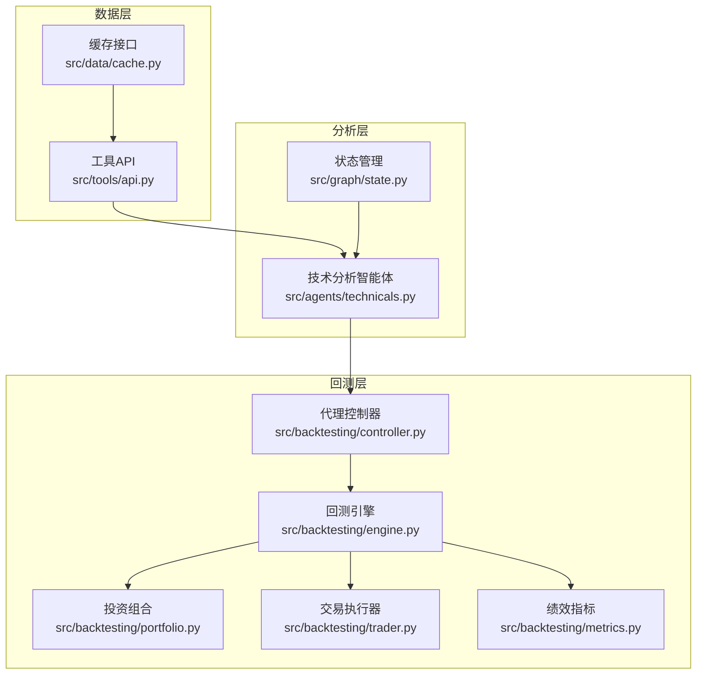
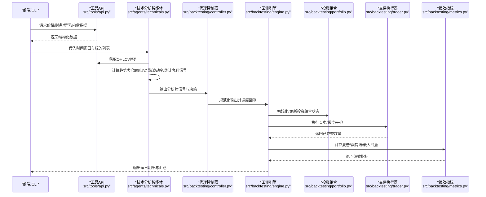
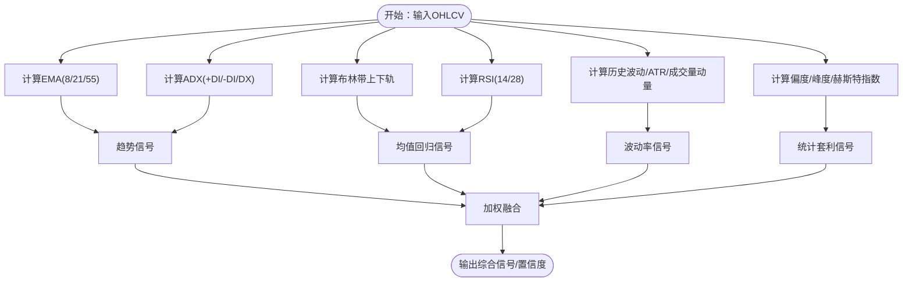
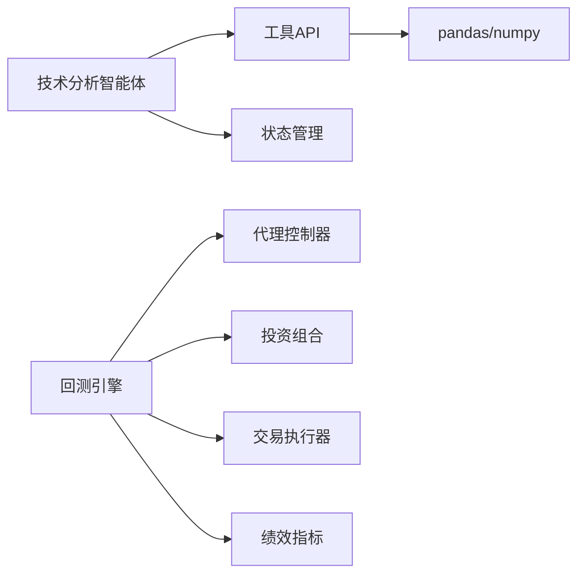

# 技术分析智能体

<cite>
**本文引用的文件**
- [src/agents/technicals.py](file://src/agents/technicals.py)
- [src/tools/api.py](file://src/tools/api.py)
- [src/graph/state.py](file://src/graph/state.py)
- [src/backtesting/engine.py](file://src/backtesting/engine.py)
- [src/backtesting/controller.py](file://src/backtesting/controller.py)
- [src/backtesting/portfolio.py](file://src/backtesting/portfolio.py)
- [src/backtesting/trader.py](file://src/backtesting/trader.py)
- [src/backtesting/metrics.py](file://src/backtesting/metrics.py)
- [src/data/models.py](file://src/data/models.py)
- [src/backtesting/types.py](file://src/backtesting/types.py)
- [README.md](file://README.md)
- [pyproject.toml](file://pyproject.toml)
</cite>

## 目录
1. [简介](#简介)
2. [项目结构](#项目结构)
3. [核心组件](#核心组件)
4. [架构总览](#架构总览)
5. [详细组件分析](#详细组件分析)
6. [依赖分析](#依赖分析)
7. [性能考虑](#性能考虑)
8. [故障排查指南](#故障排查指南)
9. [结论](#结论)
10. [附录](#附录)

## 简介
本文件面向“技术分析智能体”，系统性阐述其在AI对冲基金项目中的角色与实现方式。该智能体以多策略融合为核心，基于价格与成交量等市场数据，输出买卖信号与置信度，并通过加权集成提升决策稳健性。文档覆盖以下主题：
- 经典技术分析方法的应用：道氏理论（趋势跟踪）、艾略特波浪理论（未直接实现，但可扩展）、移动平均线（EMA）等
- 指标实现原理：RSI、MACD（未直接实现，但可扩展）、布林带、ATR、ADXR（ADX衍生）
- 趋势识别、均值回归、动量、波动率与统计套利等策略
- 信号合成与参数设置指南
- 结合回测引擎的实战应用建议

## 项目结构
技术分析智能体位于后端Python代码中，围绕“数据获取—指标计算—策略生成—信号合成—消息输出”的流程组织。前端与后端通过API交互，回测模块负责历史数据驱动的策略验证。

图表来源
- [src/agents/technicals.py:35-157](file://src/agents/technicals.py#L35-L157)
- [src/tools/api.py:63-96](file://src/tools/api.py#L63-L96)
- [src/backtesting/engine.py:27-195](file://src/backtesting/engine.py#L27-L195)
- [src/backtesting/controller.py:9-68](file://src/backtesting/controller.py#L9-L68)
- [src/backtesting/portfolio.py:9-196](file://src/backtesting/portfolio.py#L9-L196)
- [src/backtesting/trader.py:7-40](file://src/backtesting/trader.py#L7-L40)
- [src/backtesting/metrics.py:8-78](file://src/backtesting/metrics.py#L8-L78)

章节来源
- [README.md:1-158](file://README.md#L1-L158)
- [pyproject.toml:1-64](file://pyproject.toml#L1-L64)

## 核心组件
- 技术分析智能体：聚合多策略信号，输出综合信号与置信度
- 工具API：封装金融数据获取与缓存，支持OHLCV与财务指标
- 回测引擎：驱动日滚动回测，执行交易并计算绩效指标
- 投资组合与交易执行：支持多头/空头交易与保证金管理
- 状态与类型定义：统一消息、决策与信号的数据结构

章节来源
- [src/agents/technicals.py:35-157](file://src/agents/technicals.py#L35-L157)
- [src/tools/api.py:63-96](file://src/tools/api.py#L63-L96)
- [src/backtesting/engine.py:27-195](file://src/backtesting/engine.py#L27-L195)
- [src/backtesting/portfolio.py:9-196](file://src/backtesting/portfolio.py#L9-L196)
- [src/backtesting/trader.py:7-40](file://src/backtesting/trader.py#L7-L40)
- [src/backtesting/types.py:10-106](file://src/backtesting/types.py#L10-L106)

## 架构总览
技术分析智能体在每个交易日接收价格序列，计算多类技术指标与策略信号，采用加权融合得到最终信号；随后通过代理控制器进入回测引擎，驱动交易执行与绩效评估。

图表来源
- [src/agents/technicals.py:35-157](file://src/agents/technicals.py#L35-L157)
- [src/tools/api.py:63-96](file://src/tools/api.py#L63-L96)
- [src/backtesting/controller.py:12-65](file://src/backtesting/controller.py#L12-L65)
- [src/backtesting/engine.py:96-195](file://src/backtesting/engine.py#L96-L195)
- [src/backtesting/portfolio.py:17-196](file://src/backtesting/portfolio.py#L17-L196)
- [src/backtesting/trader.py:10-40](file://src/backtesting/trader.py#L10-L40)
- [src/backtesting/metrics.py:22-78](file://src/backtesting/metrics.py#L22-L78)

## 详细组件分析

### 技术分析智能体（核心）
- 多策略信号生成
  - 趋势跟踪：EMA短中长周期与ADX强度判断
  - 均值回归：Z分数、布林带位置、RSI双周期
  - 动量：多周期收益累计与成交量确认
  - 波动率：历史波动、波动率区间、ATR比率
  - 统计套利：偏度、峰度与赫斯特指数
- 信号融合：按权重对各策略信号进行数值化加权，阈值化为最终信号
- 输出结构：包含综合信号、置信度及各策略的信号与指标明细

图表来源
- [src/agents/technicals.py:160-404](file://src/agents/technicals.py#L160-L404)

章节来源
- [src/agents/technicals.py:35-157](file://src/agents/technicals.py#L35-L157)
- [src/agents/technicals.py:160-404](file://src/agents/technicals.py#L160-L404)

### 指标与策略实现要点
- 移动平均线（EMA）
  - 使用指数加权平均，避免简单移动平均的滞后
  - 短中长期均线交叉用于趋势方向判断
- 平均趋向指数（ADX）
  - 衡量趋势强度，配合+DI/-DI判断方向
  - 强趋势时提高信号置信度
- 布林带
  - 基于标准差通道，衡量价格偏离程度
  - 与RSI结合用于超买/超卖与通道突破确认
- RSI
  - 反映相对强弱，双周期对比增强稳定性
- ATR
  - 衡量波动幅度，辅助止损/止盈与仓位控制
- 赫斯特指数
  - 判断序列长记忆性，辅助均值回归/趋势择机

章节来源
- [src/agents/technicals.py:420-532](file://src/agents/technicals.py#L420-L532)

### 数据获取与缓存
- 通过工具API从外部金融数据服务拉取OHLCV、财务指标、新闻与内盘交易
- 缓存机制避免重复请求，提升回测效率
- 将原始数据转换为Pandas DataFrame，便于向量化计算

章节来源
- [src/tools/api.py:63-96](file://src/tools/api.py#L63-L96)
- [src/tools/api.py:351-367](file://src/tools/api.py#L351-L367)

### 回测引擎与交易执行
- 日滚动回测：按工作日推进，预取数据，构建每日决策
- 代理控制器：规范化输出，确保动作与数量合法
- 交易执行器：根据动作（买入/卖出/做空/平仓/持有）执行交易
- 投资组合：维护现金、头寸、成本与已实现损益，支持保证金占用
- 绩效指标：计算夏普比率、索提诺比率与最大回撤

章节来源
- [src/backtesting/engine.py:96-195](file://src/backtesting/engine.py#L96-L195)
- [src/backtesting/controller.py:12-65](file://src/backtesting/controller.py#L12-L65)
- [src/backtesting/trader.py:10-40](file://src/backtesting/trader.py#L10-L40)
- [src/backtesting/portfolio.py:17-196](file://src/backtesting/portfolio.py#L17-L196)
- [src/backtesting/metrics.py:22-78](file://src/backtesting/metrics.py#L22-L78)

### 状态与类型定义
- AgentState：统一的消息、数据与元信息容器
- AnalystSignal/TickerAnalysis/AgentStateData：分析师信号的结构化存储
- AgentOutput/AgentDecisions：代理输出与标准化决策格式

章节来源
- [src/graph/state.py:15-52](file://src/graph/state.py#L15-L52)
- [src/data/models.py:152-175](file://src/data/models.py#L152-L175)
- [src/backtesting/types.py:69-106](file://src/backtesting/types.py#L69-L106)

## 依赖分析
- 内部依赖
  - 技术分析智能体依赖工具API进行数据获取与DataFrame转换
  - 回测引擎依赖控制器、交易执行器与投资组合模块
- 外部依赖
  - pandas/numpy用于高效数值计算
  - langchain生态用于LLM集成（非技术指标计算）

图表来源
- [src/agents/technicals.py:1-12](file://src/agents/technicals.py#L1-L12)
- [src/tools/api.py:1-26](file://src/tools/api.py#L1-L26)
- [src/backtesting/engine.py:1-16](file://src/backtesting/engine.py#L1-L16)

章节来源
- [pyproject.toml:13-42](file://pyproject.toml#L13-L42)

## 性能考虑
- 向量化优先：使用pandas/numpy进行滚动窗口与数学运算
- 缓存命中：合理设计缓存键，减少重复API调用
- 回测批处理：批量预取数据，降低IO开销
- 指标复用：在多策略间共享基础指标（如价格变化、波动率），避免重复计算
- 风险控制：通过ATR与波动率信号动态调整仓位规模

## 故障排查指南
- 无价格数据
  - 检查API返回状态与环境变量中的API密钥
  - 确认日期范围与市场日历匹配
- 信号异常或NaN
  - 检查缺失值处理函数是否正确归一化Series/NaN
  - 核对窗口长度是否满足最小样本需求
- 回测不生效
  - 确认代理控制器已规范化动作与数量
  - 检查交易执行器是否正确映射动作枚举
- 绩效指标为空
  - 确保至少有两天以上的净值序列
  - 校验无风险利率与交易日历常数

章节来源
- [src/tools/api.py:29-61](file://src/tools/api.py#L29-L61)
- [src/agents/technicals.py:15-32](file://src/agents/technicals.py#L15-L32)
- [src/backtesting/controller.py:40-65](file://src/backtesting/controller.py#L40-L65)
- [src/backtesting/metrics.py:22-78](file://src/backtesting/metrics.py#L22-L78)

## 结论
技术分析智能体通过多策略融合与稳健的信号合成，在回测框架下提供了可解释、可量化的交易信号生成能力。结合RSI、布林带、ATR、ADX与赫斯特指数等指标，能够覆盖趋势、均值回归、动量与波动率等主要交易场景。建议在实盘前先进行充分的历史回测与参数敏感性分析，并持续监控模型表现与外部数据质量。

## 附录

### 技术分析策略与参数设置指南
- 趋势跟踪
  - 参数：EMA(8)、EMA(21)、EMA(55)，ADX周期14
  - 策略：短期均线上穿中期且ADX高于阈值视为多头趋势
- 均值回归
  - 参数：MA(50)、STD(50)、布林带(20,2σ)、RSI(14/28)
  - 策略：价格偏离通道极值且RSI极端时反向
- 动量
  - 参数：月/季/半年收益滚动窗口，成交量均值比
  - 策略：多周期动量同向且成交量放大
- 波动率
  - 参数：历史波动(21天)、波动率均值(63天)、ATR(14)
  - 策略：低波动扩张预期、高波动收缩预期
- 统计套利
  - 参数：偏度/峰度滚动窗口63，赫斯特指数
  - 策略：弱随机游走与负偏态下的均值回归机会

章节来源
- [src/agents/technicals.py:160-404](file://src/agents/technicals.py#L160-L404)

### 实战应用建议
- 分阶段回测：先单策略验证，再逐步加入多策略融合
- 参数扫描：对关键窗口与阈值进行网格搜索
- 风险预算：依据ATR与波动率动态调整头寸规模
- 信号一致性：多时间尺度信号一致时提高置信度
- 外部事件：结合新闻与内盘交易信号进行过滤

章节来源
- [src/backtesting/engine.py:96-195](file://src/backtesting/engine.py#L96-L195)
- [src/backtesting/portfolio.py:17-196](file://src/backtesting/portfolio.py#L17-L196)