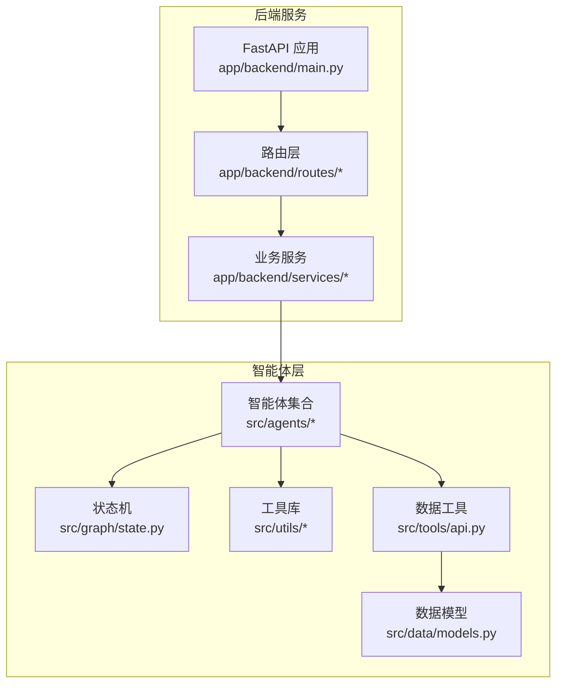
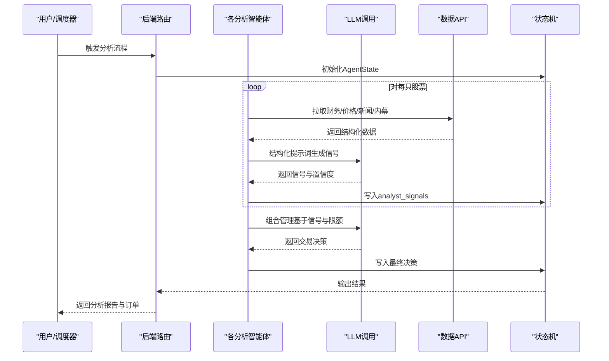
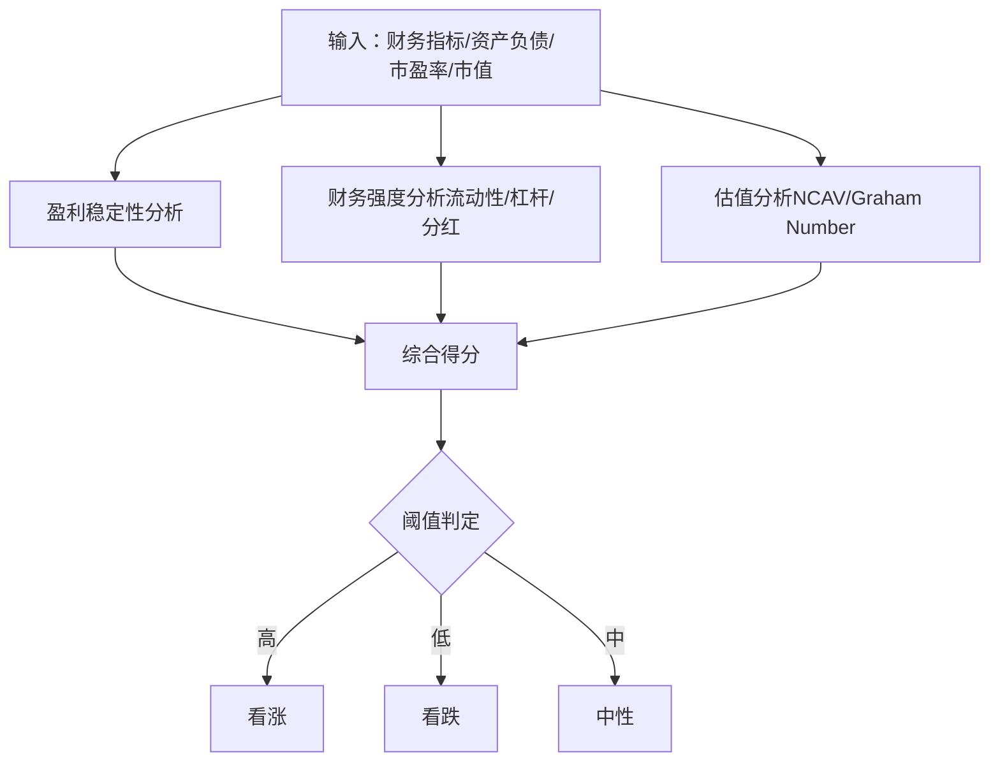
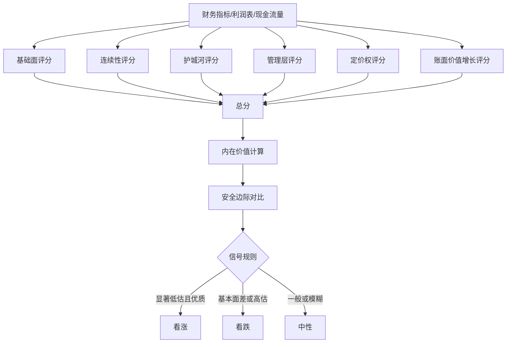
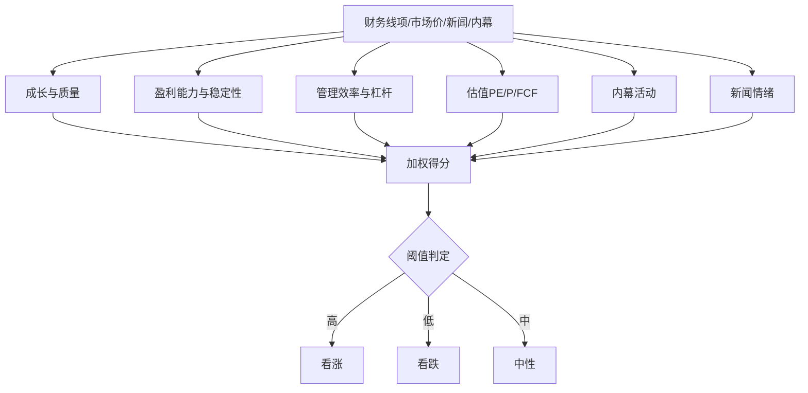
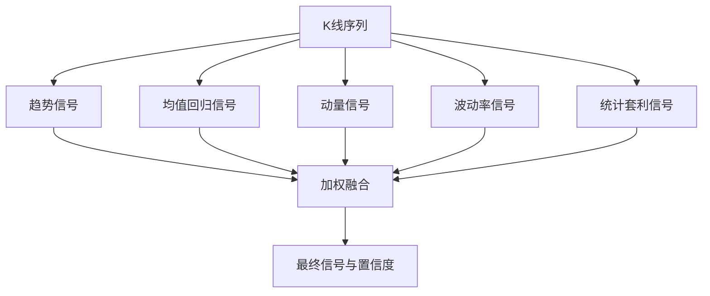
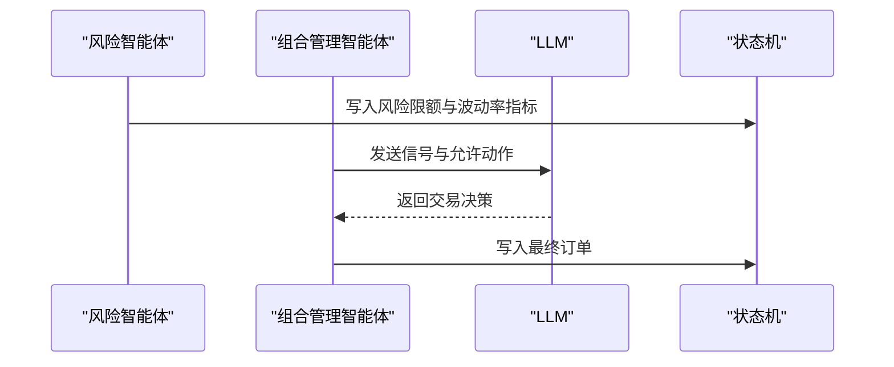
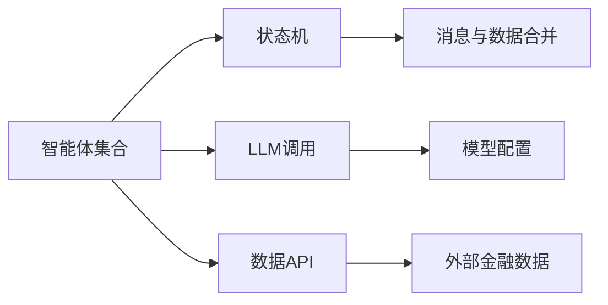

# 投资分析智能体

<cite>
**本文引用的文件**
- [src/agents/ben_graham.py](file://src/agents/ben_graham.py)
- [src/agents/warren_buffett.py](file://src/agents/warren_buffett.py)
- [src/agents/phil_fisher.py](file://src/agents/phil_fisher.py)
- [src/agents/growth_agent.py](file://src/agents/growth_agent.py)
- [src/agents/technicals.py](file://src/agents/technicals.py)
- [src/agents/fundamentals.py](file://src/agents/fundamentals.py)
- [src/agents/valuation.py](file://src/agents/valuation.py)
- [src/agents/portfolio_manager.py](file://src/agents/portfolio_manager.py)
- [src/agents/risk_manager.py](file://src/agents/risk_manager.py)
- [src/graph/state.py](file://src/graph/state.py)
- [src/utils/llm.py](file://src/utils/llm.py)
- [src/tools/api.py](file://src/tools/api.py)
- [src/data/models.py](file://src/data/models.py)
- [app/backend/main.py](file://app/backend/main.py)
</cite>

## 目录
1. [简介](#简介)
2. [项目结构](#项目结构)
3. [核心组件](#核心组件)
4. [架构总览](#架构总览)
5. [详细组件分析](#详细组件分析)
6. [依赖关系分析](#依赖关系分析)
7. [性能考量](#性能考量)
8. [故障排查指南](#故障排查指南)
9. [结论](#结论)
10. [附录](#附录)

## 简介
本项目构建了一套“投资分析智能体”集合，以巴菲特、格雷厄姆、费雪等经典投资大师的理念为指导，结合现代量化与大模型推理能力，对多只股票进行系统化分析，并输出可执行的投资信号与交易决策。智能体覆盖价值投资、成长投资、技术分析与基本面估值等多个流派，支持风险控制与组合管理，形成从“信号生成—风险校准—决策执行”的闭环。

## 项目结构
后端采用模块化设计，前端通过FastAPI提供REST接口，智能体运行在后端服务中，统一通过状态机与消息传递进行协作。核心目录与职责如下：
- src/agents：各类智能体实现（价值、成长、技术、估值、组合管理、风险管理）
- src/graph/state.py：定义AgentState状态结构，承载消息、数据与元信息
- src/utils：通用工具（LLM调用、进度、API封装等）
- src/tools/api.py：金融数据API封装（价格、财务指标、新闻、内幕交易等）
- src/data/models.py：数据模型定义（财务指标、K线、新闻、公司事实等）
- app/backend/main.py：后端入口，注册路由与CORS，初始化数据库与Ollama状态检查

图表来源
- [app/backend/main.py:1-56](file://app/backend/main.py#L1-L56)
- [src/graph/state.py:14-19](file://src/graph/state.py#L14-L19)
- [src/utils/llm.py:10-84](file://src/utils/llm.py#L10-L84)
- [src/tools/api.py:29-61](file://src/tools/api.py#L29-L61)
- [src/data/models.py:4-62](file://src/data/models.py#L4-L62)

章节来源
- [app/backend/main.py:1-56](file://app/backend/main.py#L1-L56)
- [src/graph/state.py:14-19](file://src/graph/state.py#L14-L19)

## 核心组件
- 智能体集合
  - 价值投资：ben_graham_agent（格雷厄姆）、warren_buffett_agent（巴菲特）
  - 成长投资：phil_fisher_agent（费雪）、growth_analyst_agent（成长）
  - 技术分析：technical_analyst_agent（技术）
  - 基本面与估值：fundamentals_analyst_agent（基础）、valuation_analyst_agent（估值）
  - 风险管理：risk_management_agent（波动率与相关性调整）
  - 组合管理：portfolio_management_agent（基于信号与限额的最终决策）
- 工具与基础设施
  - 数据API：价格、财务指标、新闻、内幕交易、公司事实
  - LLM调用：统一的结构化输出与重试机制
  - 状态机：消息与数据合并，支持链式调用与调试打印

章节来源
- [src/agents/ben_graham.py:20-94](file://src/agents/ben_graham.py#L20-L94)
- [src/agents/warren_buffett.py:19-153](file://src/agents/warren_buffett.py#L19-L153)
- [src/agents/phil_fisher.py:24-164](file://src/agents/phil_fisher.py#L24-L164)
- [src/agents/growth_agent.py:19-132](file://src/agents/growth_agent.py#L19-L132)
- [src/agents/technicals.py:35-157](file://src/agents/technicals.py#L35-L157)
- [src/agents/fundamentals.py:11-163](file://src/agents/fundamentals.py#L11-L163)
- [src/agents/valuation.py:21-220](file://src/agents/valuation.py#L21-L220)
- [src/agents/risk_manager.py:11-219](file://src/agents/risk_manager.py#L11-L219)
- [src/agents/portfolio_manager.py:25-93](file://src/agents/portfolio_manager.py#L25-L93)

## 架构总览
智能体通过统一的状态机接收输入（股票池、时间窗口、资金配置），按顺序执行数据拉取、指标计算、信号生成与汇总，最终由组合管理智能体在风险约束下生成交易指令。

图表来源
- [src/graph/state.py:14-19](file://src/graph/state.py#L14-L19)
- [src/utils/llm.py:10-84](file://src/utils/llm.py#L10-L84)
- [src/tools/api.py:99-138](file://src/tools/api.py#L99-L138)
- [src/agents/portfolio_manager.py:25-93](file://src/agents/portfolio_manager.py#L25-L93)

## 详细组件分析

### 价值投资智能体

#### 格雷厄姆（Benjamin Graham）智能体
- 投资理念：强调安全边际、稳健财务、账面价值折扣与稳定盈利
- 分析维度
  - 盈利稳定性：多年EPS正数比例与增长趋势
  - 财务强度：流动比率、负债比率、分红记录
  - 估值判断：NCAV（净净）与Graham Number，比较当前股价与内在价值
- 信号生成：三类子分析得分加权聚合，映射到多空信号
- LLM整合：以格雷厄姆风格的严谨语言生成理由与置信度

图表来源
- [src/agents/ben_graham.py:97-138](file://src/agents/ben_graham.py#L97-L138)
- [src/agents/ben_graham.py:141-204](file://src/agents/ben_graham.py#L141-L204)
- [src/agents/ben_graham.py:207-279](file://src/agents/ben_graham.py#L207-L279)

章节来源
- [src/agents/ben_graham.py:20-94](file://src/agents/ben_graham.py#L20-L94)

#### 巴菲特（Warren Buffett）智能体
- 投资理念：长期竞争优势、管理层质量、定价权、股东回报、内在价值与安全边际
- 分析维度
  - 基础面：ROE、债务/权益、运营利润率、流动性
  - 连续性：净利润趋势与复合增长率
  - 竞争护城河：ROIC一致性、利润率稳定性、资产效率
  - 定价权：毛利率趋势与稳定性
  - 股东回报：股份回购与分红
  - 内在价值：Owner Earnings + 三阶段DCF + 安全边际
- 信号生成：各维度打分加权，结合内在价值与市值的安全边际决定信号

图表来源
- [src/agents/warren_buffett.py:156-202](file://src/agents/warren_buffett.py#L156-L202)
- [src/agents/warren_buffett.py:205-235](file://src/agents/warren_buffett.py#L205-L235)
- [src/agents/warren_buffett.py:238-334](file://src/agents/warren_buffett.py#L238-L334)
- [src/agents/warren_buffett.py:337-377](file://src/agents/warren_buffett.py#L337-L377)
- [src/agents/warren_buffett.py:508-624](file://src/agents/warren_buffett.py#L508-L624)
- [src/agents/warren_buffett.py:627-694](file://src/agents/warren_buffett.py#L627-L694)
- [src/agents/warren_buffett.py:696-743](file://src/agents/warren_buffett.py#L696-L743)

章节来源
- [src/agents/warren_buffett.py:19-153](file://src/agents/warren_buffett.py#L19-L153)

### 成长投资智能体

#### 费雪（Phil Fisher）智能体
- 投资理念：寻找具备长期超额增长潜力的高质量企业，重视管理层质量、研发与盈利能力
- 分析维度
  - 成长与质量：营收/EPS复合增长、研发占比
  - 盈利能力与稳定性：毛利率/运营利润率趋势与稳定性
  - 管理效率与杠杆：ROE、债务/权益、自由现金流一致性
  - 估值：PE、P/FCF
  - 行为验证：高管与股东增持、新闻情绪
- 信号生成：加权合成得分，结合估值与行为信号给出最终信号

图表来源
- [src/agents/phil_fisher.py:167-259](file://src/agents/phil_fisher.py#L167-L259)
- [src/agents/phil_fisher.py:262-325](file://src/agents/phil_fisher.py#L262-L325)
- [src/agents/phil_fisher.py:328-401](file://src/agents/phil_fisher.py#L328-L401)
- [src/agents/phil_fisher.py:404-458](file://src/agents/phil_fisher.py#L404-L458)
- [src/agents/phil_fisher.py:461-500](file://src/agents/phil_fisher.py#L461-L500)
- [src/agents/phil_fisher.py:503-528](file://src/agents/phil_fisher.py#L503-L528)

章节来源
- [src/agents/phil_fisher.py:24-164](file://src/agents/phil_fisher.py#L24-L164)

#### 成长分析师（Growth Analyst）
- 流派：成长导向
- 分析维度
  - 历史增长：营收/EPS/FCF趋势与斜率
  - 成长导向估值：PEG、PS
  - 盈利扩张：毛利率/运营利润率趋势
  - 管理层信心：内幕交易净流入
  - 财务健康：债务/权益、流动比率
- 信号生成：加权合成，置信度与权重成正比

章节来源
- [src/agents/growth_agent.py:19-132](file://src/agents/growth_agent.py#L19-L132)

### 技术分析智能体
- 流派：技术分析
- 分析策略
  - 趋势跟踪：多周期EMA与ADX
  - 均值回归：Z-Score、布林带、RSI
  - 动量：月/季/半年回报、成交量确认
  - 波动率：历史波动、ATR、波动率区间
  - 统计套利：偏度、峰度、Hurst指数
- 信号融合：加权集成，综合各策略置信度

图表来源
- [src/agents/technicals.py:160-196](file://src/agents/technicals.py#L160-L196)
- [src/agents/technicals.py:199-238](file://src/agents/technicals.py#L199-L238)
- [src/agents/technicals.py:241-283](file://src/agents/technicals.py#L241-L283)
- [src/agents/technicals.py:286-330](file://src/agents/technicals.py#L286-L330)
- [src/agents/technicals.py:333-369](file://src/agents/technicals.py#L333-L369)
- [src/agents/technicals.py:372-404](file://src/agents/technicals.py#L372-L404)

章节来源
- [src/agents/technicals.py:35-157](file://src/agents/technicals.py#L35-L157)

### 基本面与估值智能体
- 基础分析（Fundamentals）
  - 盈利能力：ROE、净/运营利润率
  - 增长能力：营收/利润/账面价值复合增速
  - 财务健康：流动比率、债务/权益、自由现金流/利润
  - 估值比率：PE/PB/PS
  - 综合信号：多数指标达标则看涨，反之看跌

- 估值分析（Valuation）
  - 方法组合：DCF（含WACC与情景）、Owner Earnings、EV/EBITDA、Residual Income
  - 聚合：按权重计算各方法与市值的偏离度，得出最终信号与置信度
  - 场景：提供熊/牛/基情景与安全边际

章节来源
- [src/agents/fundamentals.py:11-163](file://src/agents/fundamentals.py#L11-L163)
- [src/agents/valuation.py:21-220](file://src/agents/valuation.py#L21-L220)

### 风险管理与组合管理
- 风险管理（Volatility-Adjusted）
  - 计算波动率与年化波动率，结合历史分位
  - 基于活跃头寸的相关性矩阵，计算平均/最大相关系数
  - 综合波动率与相关性调整，得到头寸限额（美元）
  - 输出剩余可用额度与理由

- 组合管理
  - 输入：各智能体信号与置信度、风险限额、当前价格、持仓
  - 约束：买卖/做空/平仓数量上限（由风险限额与价格决定）
  - 决策：LLM在约束下选择最优动作与数量，输出理由与置信度

图表来源
- [src/agents/risk_manager.py:11-219](file://src/agents/risk_manager.py#L11-L219)
- [src/agents/portfolio_manager.py:25-93](file://src/agents/portfolio_manager.py#L25-L93)

章节来源
- [src/agents/risk_manager.py:11-219](file://src/agents/risk_manager.py#L11-L219)
- [src/agents/portfolio_manager.py:25-93](file://src/agents/portfolio_manager.py#L25-L93)

## 依赖关系分析
- 模块耦合
  - 智能体之间通过状态机共享数据，彼此解耦；组合管理依赖风险智能体提供的限额
  - LLM调用作为统一出口，确保输出格式一致
  - 数据API封装统一访问外部金融数据源，缓存提升性能
- 外部依赖
  - LLM模型与提供商配置可按智能体定制
  - 外部金融数据API（价格、财务、新闻、内幕）

图表来源
- [src/graph/state.py:14-19](file://src/graph/state.py#L14-L19)
- [src/utils/llm.py:124-147](file://src/utils/llm.py#L124-L147)
- [src/tools/api.py:29-61](file://src/tools/api.py#L29-L61)

章节来源
- [src/graph/state.py:14-19](file://src/graph/state.py#L14-L19)
- [src/utils/llm.py:124-147](file://src/utils/llm.py#L124-L147)
- [src/tools/api.py:29-61](file://src/tools/api.py#L29-L61)

## 性能考量
- 数据缓存：API层使用缓存避免重复请求，提升回测与实时分析吞吐
- 并行化：智能体对不同股票独立处理，可并行扩展
- LLM成本控制：结构化输出与重试机制减少失败重试次数
- 计算复杂度
  - 技术分析：多指标滚动窗口，时间复杂度与窗口长度线性相关
  - 估值模型：DCF与多阶段增长，受期数与波动率估计影响
  - 风控：相关性矩阵计算与协方差估计，适合批处理

[本节为通用指导，无需特定文件引用]

## 故障排查指南
- LLM调用失败
  - 现象：返回默认响应或报错
  - 排查：检查模型配置、提供商密钥、网络连通性；查看重试日志
  - 参考
    - [src/utils/llm.py:58-84](file://src/utils/llm.py#L58-L84)
- API限流
  - 现象：429限流
  - 排查：增加延迟或降低并发；检查环境变量API Key
  - 参考
    - [src/tools/api.py:52-60](file://src/tools/api.py#L52-L60)
- 缺少必要字段
  - 现象：信号为空或置信度为0
  - 排查：确认财务/价格数据是否完整；检查字段映射
  - 参考
    - [src/data/models.py:18-62](file://src/data/models.py#L18-L62)
- 风控限额异常
  - 现象：可用额度为0或负数
  - 排查：检查波动率估算、相关性矩阵、当前头寸与总净值
  - 参考
    - [src/agents/risk_manager.py:106-219](file://src/agents/risk_manager.py#L106-L219)

章节来源
- [src/utils/llm.py:58-84](file://src/utils/llm.py#L58-L84)
- [src/tools/api.py:52-60](file://src/tools/api.py#L52-L60)
- [src/data/models.py:18-62](file://src/data/models.py#L18-L62)
- [src/agents/risk_manager.py:106-219](file://src/agents/risk_manager.py#L106-L219)

## 结论
该智能体集合以经典投资理论为内核，结合现代量化指标与大模型推理，实现了从多维度信号到风险可控的交易决策闭环。通过模块化设计与统一状态机，系统具备良好的可扩展性与可维护性，适用于回测与实盘场景。

[本节为总结，无需特定文件引用]

## 附录

### 智能体选择指南
- 价值投资
  - 适用：追求安全边际、稳健财务与长期持有
  - 推荐：格雷厄姆（稳健）、巴菲特（深度质量）
- 成长投资
  - 适用：偏好高增长潜力与管理层质量
  - 推荐：费雪（长期超额增长）、成长分析师（量化成长）
- 技术分析
  - 适用：短期交易与趋势跟随
  - 推荐：技术分析师（多策略融合）
- 综合与风控
  - 适用：需要跨流派信号整合与风险控制
  - 推荐：基础/估值智能体 + 风控 + 组合管理

[本节为概念性内容，无需特定文件引用]

### 参数调整建议
- 信号阈值
  - 格雷厄姆/巴菲特/费雪：根据回测表现微调阈值与权重
  - 成长/技术：通过滚动窗口长度与动量周期优化
- 权重分配
  - 基础/估值：建议更高权重，稳健性强
  - 成长/技术：可适度提高，捕捉弹性机会
- 风控参数
  - 波动率分位与相关性倍数：根据市场环境动态调整
- LLM提示词
  - 保持简洁明确，限定输出格式，减少幻觉

[本节为通用指导，无需特定文件引用]

### 效果评估方法
- 回测框架
  - 使用内置控制器与回测引擎，对比多智能体组合与单一流派表现
- 指标体系
  - 收益率、最大回撤、夏普比率、胜率、盈亏比
  - 信号覆盖率与误报率
- A/B测试
  - 切换权重/阈值，观察收益变化与稳定性

[本节为通用指导，无需特定文件引用]