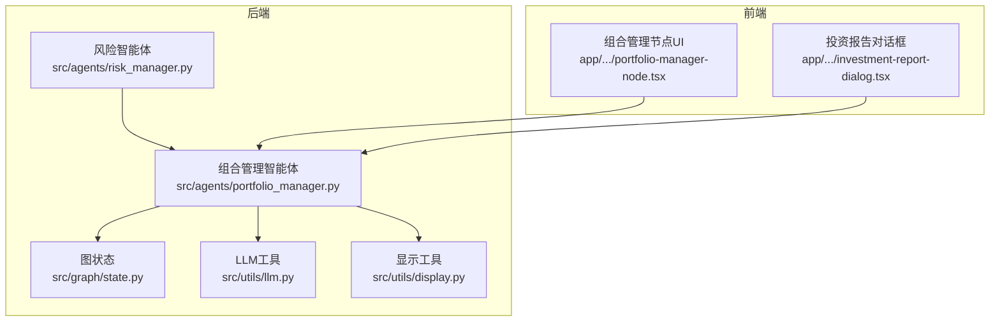
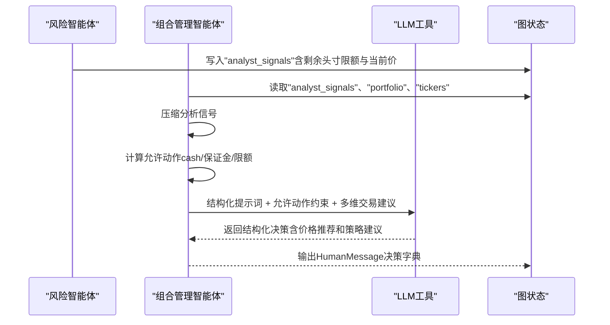
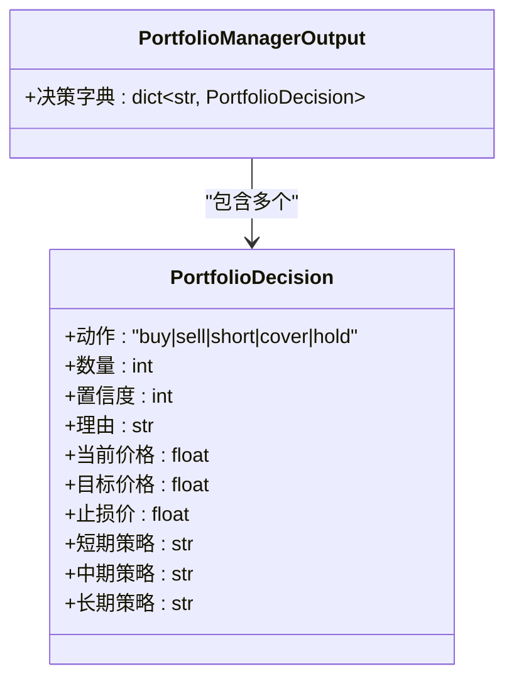
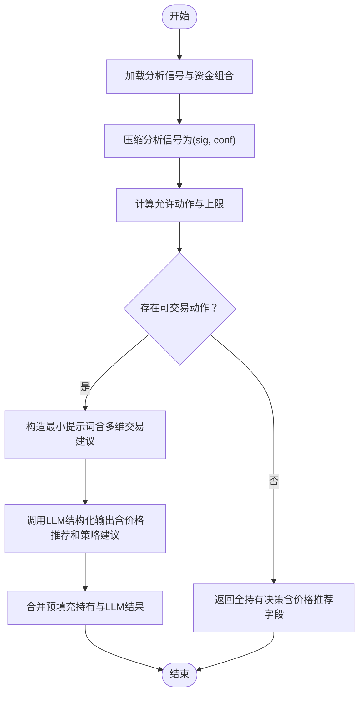
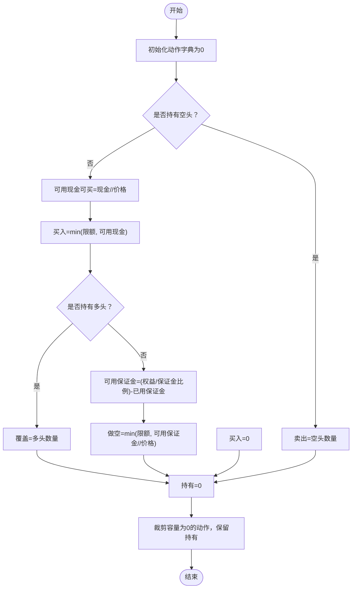
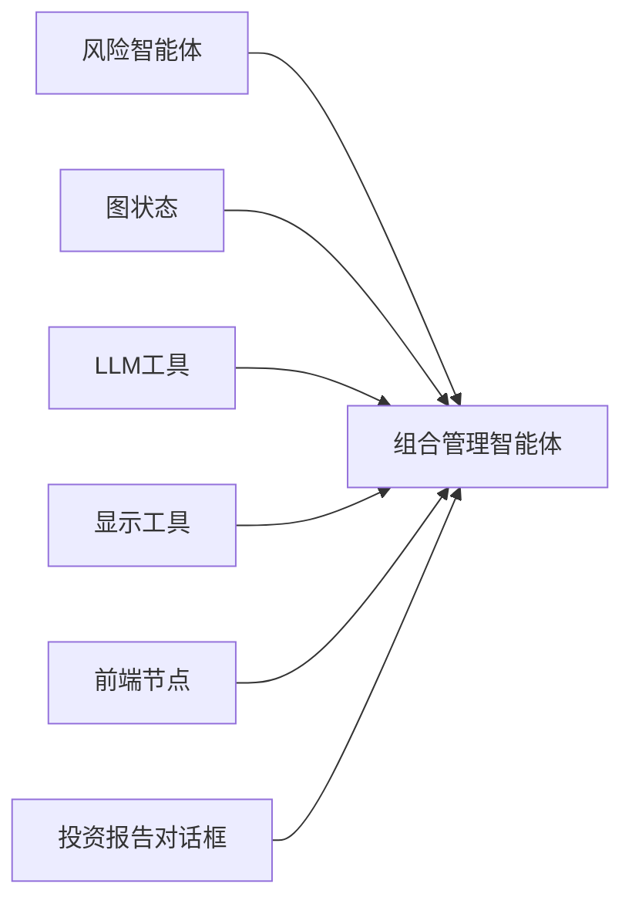

# 组合管理智能体

<cite>
**本文引用的文件**
- [src/agents/portfolio_manager.py](file://src/agents/portfolio_manager.py)
- [src/graph/state.py](file://src/graph/state.py)
- [src/utils/llm.py](file://src/utils/llm.py)
- [src/agents/risk_manager.py](file://src/agents/risk_manager.py)
- [src/utils/display.py](file://src/utils/display.py)
- [app/frontend/src/nodes/components/portfolio-manager-node.tsx](file://app/frontend/src/nodes/components/portfolio-manager-node.tsx)
- [app/frontend/src/nodes/components/investment-report-dialog.tsx](file://app/frontend/src/nodes/components/investment-report-dialog.tsx)
- [tests/backtesting/test_portfolio.py](file://tests/backtesting/test_portfolio.py)
</cite>

## 更新摘要
**变更内容**
- 新增多维交易建议功能：在PortfolioDecision中新增当前价格、目标价格、止损价、短期、中期、长期策略推荐等字段
- 增强generate_trading_decision函数：在LLM提示词中明确要求提供多维交易建议
- 更新前端显示：投资报告对话框支持显示新的多维交易建议信息
- 完善数据模型：PortfolioManagerOutput保持不变，但内部决策包含更丰富的信息

## 目录
1. [简介](#简介)
2. [项目结构](#项目结构)
3. [核心组件](#核心组件)
4. [架构总览](#架构总览)
5. [详细组件分析](#详细组件分析)
6. [多维交易建议功能](#多维交易建议功能)
7. [依赖分析](#依赖分析)
8. [性能考虑](#性能考虑)
9. [故障排查指南](#故障排查指南)
10. [结论](#结论)
11. [附录](#附录)

## 简介
本文件系统性阐述"组合管理智能体"的设计与实现，重点覆盖以下方面：
- 接收来自各分析智能体（如技术面、基本面、新闻情绪等）的信号，结合风险限制与资金状况，生成最终交易决策；
- **新增多维交易建议功能**：提供当前价格、目标价格、止损价、短期、中期、长期策略推荐等丰富信息；
- 数据模型PortfolioDecision与PortfolioManagerOutput的设计思路与约束；
- generate_trading_decision的决策流程：信号压缩、允许动作计算、LLM推理与默认回退；
- compute_allowed_actions如何基于持仓、现金、保证金要求与位置限制确定可执行操作；
- 配置选项、性能优化策略与调试方法。

## 项目结构
组合管理智能体位于后端Python代码中，作为图式状态机中的一个节点，负责聚合风险与分析信号，调用大语言模型进行最终决策，并通过消息通道输出结果。前端节点组件提供模型选择与可视化能力。



**图表来源**
- [src/agents/portfolio_manager.py:31-99](file://src/agents/portfolio_manager.py#L31-L99)
- [src/agents/risk_manager.py:11-219](file://src/agents/risk_manager.py#L11-L219)
- [src/graph/state.py:15-52](file://src/graph/state.py#L15-L52)
- [src/utils/llm.py:10-148](file://src/utils/llm.py#L10-L148)
- [src/utils/display.py:817-854](file://src/utils/display.py#L817-L854)
- [app/frontend/src/nodes/components/portfolio-manager-node.tsx:19-160](file://app/frontend/src/nodes/components/portfolio-manager-node.tsx#L19-L160)
- [app/frontend/src/nodes/components/investment-report-dialog.tsx:110-237](file://app/frontend/src/nodes/components/investment-report-dialog.tsx#L110-L237)

**章节来源**
- [src/agents/portfolio_manager.py:31-99](file://src/agents/portfolio_manager.py#L31-L99)
- [src/agents/risk_manager.py:11-219](file://src/agents/risk_manager.py#L11-L219)
- [src/graph/state.py:15-52](file://src/graph/state.py#L15-L52)
- [src/utils/llm.py:10-148](file://src/utils/llm.py#L10-L148)
- [src/utils/display.py:817-854](file://src/utils/display.py#L817-L854)
- [app/frontend/src/nodes/components/portfolio-manager-node.tsx:19-160](file://app/frontend/src/nodes/components/portfolio-manager-node.tsx#L19-L160)
- [app/frontend/src/nodes/components/investment-report-dialog.tsx:110-237](file://app/frontend/src/nodes/components/investment-report-dialog.tsx#L110-L237)

## 核心组件
- 组合管理智能体入口函数：从状态中读取投资标的、分析信号与资金组合信息，压缩信号，计算允许动作，调用LLM生成最终决策，并将结果以消息形式返回。
- **多维交易建议数据模型**：
  - PortfolioDecision：单个标的交易决策，包含动作、数量、置信度、简要理由，以及当前价格、目标价格、止损价和短期、中期、长期策略推荐；
  - PortfolioManagerOutput：多标的决策集合。
- LLM调用封装：统一处理模型选择、结构化输出、重试与默认回退。

**章节来源**
- [src/agents/portfolio_manager.py:13-28](file://src/agents/portfolio_manager.py#L13-L28)
- [src/agents/portfolio_manager.py:31-99](file://src/agents/portfolio_manager.py#L31-L99)
- [src/utils/llm.py:10-148](file://src/utils/llm.py#L10-L148)

## 架构总览
组合管理智能体在图式状态机中扮演"决策中枢"角色：先由风险智能体提供基于波动率与相关性的头寸限额与当前价格；随后组合管理智能体汇总各分析智能体信号，计算允许动作集，再通过LLM进行最终决策与量化输出。



**图表来源**
- [src/agents/risk_manager.py:105-203](file://src/agents/risk_manager.py#L105-L203)
- [src/agents/portfolio_manager.py:31-99](file://src/agents/portfolio_manager.py#L31-L99)
- [src/agents/portfolio_manager.py:183-282](file://src/agents/portfolio_manager.py#L183-L282)
- [src/utils/llm.py:10-84](file://src/utils/llm.py#L10-L84)

## 详细组件分析

### 数据模型设计：PortfolioDecision 与 PortfolioManagerOutput
- **PortfolioDecision**（更新）
  - 动作域限定为"买入、卖出、做空、平仓、持有"，确保LLM输出与执行层一致；
  - 数量为整数，避免浮点拆分导致的执行误差；
  - 置信度与理由字段便于审计与可视化；
  - **新增字段**：
    - `current_price`：当前股价，用于提供基准参考；
    - `target_price`：目标价格，基于分析信号给出的未来价格预期；
    - `stop_loss`：止损价格，风险管理建议；
    - `short_term`：短期策略建议（1周内），限制150字符以内；
    - `medium_term`：中期策略建议（1个月内），限制150字符以内；
    - `long_term`：长期策略建议（3-6个月内），限制150字符以内。
- PortfolioManagerOutput
  - 将每个标的的决策打包为字典，便于序列化与后续执行器消费。



**图表来源**
- [src/agents/portfolio_manager.py:13-28](file://src/agents/portfolio_manager.py#L13-L28)

**章节来源**
- [src/agents/portfolio_manager.py:13-28](file://src/agents/portfolio_manager.py#L13-L28)

### 决策流程：generate_trading_decision（增强版）
- 输入准备
  - 从状态中提取各标的的分析信号与风险限额派生的最大可交易股数；
  - 对分析信号进行压缩，仅保留"信号+置信度"键值对。
- 允许动作计算
  - 调用compute_allowed_actions，基于现金、保证金要求、已占用保证金与头寸限额，确定每标的的可执行动作及上限。
- **LLM推理增强**
  - 构造极简提示词，限定输出格式为结构化JSON；
  - 明确要求提供价格推荐：目标价格、止损价；
  - 明确要求提供策略建议：短期（1周）、中期（1个月）、长期（3-6个月）策略；
  - 使用call_llm进行结构化输出与重试，失败时按默认工厂回退。
- 合并与返回
  - 将纯"持有"预填充决策与LLM结果合并，形成最终输出。



**图表来源**
- [src/agents/portfolio_manager.py:183-282](file://src/agents/portfolio_manager.py#L183-L282)
- [src/utils/llm.py:10-84](file://src/utils/llm.py#L10-L84)

**章节来源**
- [src/agents/portfolio_manager.py:183-282](file://src/agents/portfolio_manager.py#L183-L282)
- [src/utils/llm.py:10-84](file://src/utils/llm.py#L10-L84)

### 允许动作计算：compute_allowed_actions
- 输入要素
  - 当前价格、最大可交易股数（由风险限额与价格推导）、账户现金、已占用保证金、维持保证金比例、当前多空头寸。
- 计算规则
  - 多头侧：若持有空头则可平仓；可用现金决定最大可买数量，受头寸限额约束。
  - 空头侧：若持有多头则可卖平；根据权益与保证金要求计算可用做空额度，再与头寸限额比较取小。
  - 持有始终有效（占位），但不计入实际可执行动作容量。
  - 最终裁剪：移除容量为0的动作，仅保留"持有"占位，降低提示词长度与Token消耗。
- 关键边界
  - 当仅剩"持有"时，直接预填充该标的为持有，避免发送至LLM。



**图表来源**
- [src/agents/portfolio_manager.py:102-163](file://src/agents/portfolio_manager.py#L102-L163)

**章节来源**
- [src/agents/portfolio_manager.py:102-163](file://src/agents/portfolio_manager.py#L102-L163)

### 信号压缩：_compact_signals
- 目标：仅保留分析智能体的"信号+置信度"键值，丢弃空值或无效项，减少提示词体积与LLM负担。
- 行为：遍历每个标的的信号源，提取并过滤有效键，输出紧凑字典。

**章节来源**
- [src/agents/portfolio_manager.py:166-180](file://src/agents/portfolio_manager.py#L166-L180)

### LLM调用与默认回退：call_llm
- 结构化输出：优先使用JSON模式结构化输出；对不支持的模型，从Markdown代码块中提取JSON并解析。
- 重试机制：最多三次重试，失败后调用默认工厂创建安全回退对象。
- 默认工厂：当LLM失败时，将未LLM处理的标的统一回退为"持有"。

**章节来源**
- [src/utils/llm.py:10-148](file://src/utils/llm.py#L10-L148)
- [src/agents/portfolio_manager.py:258-277](file://src/agents/portfolio_manager.py#L258-L277)

### 前端集成：组合管理节点与投资报告
- **组合管理节点**：提供模型选择下拉框，支持为该节点配置特定LLM；展示节点状态与"查看投资报告"交互入口，便于调试与审计。
- **投资报告对话框**：显示多维交易建议信息，包括当前价格、目标价格、止损价以及短期、中期、长期策略建议。

**章节来源**
- [app/frontend/src/nodes/components/portfolio-manager-node.tsx:19-160](file://app/frontend/src/nodes/components/portfolio-manager-node.tsx#L19-L160)
- [app/frontend/src/nodes/components/investment-report-dialog.tsx:110-237](file://app/frontend/src/nodes/components/investment-report-dialog.tsx#L110-L237)

## 多维交易建议功能

### 新增字段详解
组合管理智能体现在提供六个关键的多维交易建议字段：

- **current_price（当前价格）**：标的当前市场价格，为其他价格建议提供基准
- **target_price（目标价格）**：基于分析信号给出的未来价格预期，帮助投资者了解潜在收益空间
- **stop_loss（止损价）**：风险管理建议，帮助控制下行风险
- **short_term（短期策略）**：1周内的操作建议，限制150字符以内
- **medium_term（中期策略）**：1个月内的操作建议，限制150字符以内
- **long_term（长期策略）**：3-6个月内的操作建议，限制150字符以内

### 前端显示增强
投资报告对话框现在能够完整展示这些多维交易建议：

- **价格信息展示**：当前价格、目标价格、止损价的数值和百分比变化
- **策略建议展示**：短期、中期、长期策略建议的分类展示
- **格式化输出**：使用颜色编码和表格布局提升可读性


**图表来源**
- [src/agents/portfolio_manager.py:183-282](file://src/agents/portfolio_manager.py#L183-L282)
- [src/utils/display.py:817-854](file://src/utils/display.py#L817-L854)

**章节来源**
- [src/agents/portfolio_manager.py:18-23](file://src/agents/portfolio_manager.py#L18-L23)
- [src/utils/display.py:817-854](file://src/utils/display.py#L817-L854)

## 依赖分析
- 组合管理智能体依赖
  - 风险智能体提供的"剩余头寸限额"与"当前价格"，用于推导最大可交易股数；
  - 图状态模块用于读写消息与数据；
  - LLM工具模块用于结构化输出与重试；
  - 显示工具模块用于格式化输出多维交易建议。
- 前端节点依赖
  - 通过模型选择影响LLM调用配置，间接影响决策质量与稳定性；
  - 投资报告对话框依赖PortfolioManagerOutput的数据结构。



**图表来源**
- [src/agents/risk_manager.py:105-203](file://src/agents/risk_manager.py#L105-L203)
- [src/agents/portfolio_manager.py:31-99](file://src/agents/portfolio_manager.py#L31-L99)
- [src/utils/llm.py:10-84](file://src/utils/llm.py#L10-L84)
- [src/utils/display.py:817-854](file://src/utils/display.py#L817-L854)
- [app/frontend/src/nodes/components/portfolio-manager-node.tsx:19-160](file://app/frontend/src/nodes/components/portfolio-manager-node.tsx#L19-L160)
- [app/frontend/src/nodes/components/investment-report-dialog.tsx:110-237](file://app/frontend/src/nodes/components/investment-report-dialog.tsx#L110-L237)

**章节来源**
- [src/agents/risk_manager.py:105-203](file://src/agents/risk_manager.py#L105-L203)
- [src/agents/portfolio_manager.py:31-99](file://src/agents/portfolio_manager.py#L31-L99)
- [src/utils/llm.py:10-84](file://src/utils/llm.py#L10-L84)
- [src/utils/display.py:817-854](file://src/utils/display.py#L817-L854)
- [app/frontend/src/nodes/components/portfolio-manager-node.tsx:19-160](file://app/frontend/src/nodes/components/portfolio-manager-node.tsx#L19-L160)
- [app/frontend/src/nodes/components/investment-report-dialog.tsx:110-237](file://app/frontend/src/nodes/components/investment-report-dialog.tsx#L110-L237)

## 性能考虑
- 提示词最小化
  - 仅传递必要的"信号+置信度"与"允许动作+上限"，避免冗余上下文；
  - 对仅"持有"的标的直接预填充，减少LLM调用次数与Token消耗。
- 动作裁剪
  - 移除容量为0的动作，降低LLM输出复杂度与解析成本。
- LLM重试与默认回退
  - 在网络抖动或模型不稳定时，快速回退到安全决策，保证流程连续性。
- 并行与缓存
  - 风险智能体已对价格与波动率进行一次性计算并缓存，组合管理智能体复用其结果，避免重复API调用。
- **多维交易建议优化**
  - 通过字段限制（150字符）控制提示词长度，避免过度膨胀；
  - 仅在需要时生成多维建议，减少不必要的计算开销。

**章节来源**
- [src/agents/portfolio_manager.py:166-180](file://src/agents/portfolio_manager.py#L166-L180)
- [src/agents/portfolio_manager.py:203-214](file://src/agents/portfolio_manager.py#L203-L214)
- [src/agents/risk_manager.py:24-76](file://src/agents/risk_manager.py#L24-L76)

## 故障排查指南
- LLM输出解析失败
  - 现象：提示"默认决策：持有"；
  - 排查：检查模型是否支持JSON模式；若不支持，确认响应中包含```json...```代码块；查看重试日志。
- 决策全为"持有"
  - 现象：所有标的均被预填充为持有；
  - 排查：确认compute_allowed_actions是否仅返回"持有"；检查资金、保证金与头寸限额是否过严；核对风险智能体是否正确提供"剩余头寸限额"与"当前价格"。
- 信号为空或缺失
  - 现象：提示词中信号为空；
  - 排查：确认分析智能体已将信号写入状态；检查信号键名是否为"signal/信号"与"confidence/置信度"。
- 前端模型配置无效
  - 现象：LLM行为异常或报错；
  - 排查：确认前端节点选择了有效模型；检查全局模型配置回退路径。
- **多维交易建议问题**
  - 现象：前端显示缺少价格推荐或策略建议；
  - 排查：确认LLM输出包含新的多维字段；检查显示工具是否正确解析这些字段；验证投资报告对话框的渲染逻辑。

**章节来源**
- [src/utils/llm.py:72-84](file://src/utils/llm.py#L72-L84)
- [src/agents/portfolio_manager.py:203-214](file://src/agents/portfolio_manager.py#L203-L214)
- [src/agents/risk_manager.py:105-203](file://src/agents/risk_manager.py#L105-L203)
- [app/frontend/src/nodes/components/portfolio-manager-node.tsx:77-83](file://app/frontend/src/nodes/components/portfolio-manager-node.tsx#L77-L83)
- [src/utils/display.py:817-854](file://src/utils/display.py#L817-L854)

## 结论
组合管理智能体通过"信号压缩+允许动作计算+LLM结构化推理"的三段式流程，在严格的风险与资金约束下生成可执行的多标的交易决策。**新增的多维交易建议功能**进一步增强了决策的实用性，提供了当前价格、目标价格、止损价以及短期、中期、长期策略建议等丰富信息。其设计强调确定性约束与最小提示词，配合默认回退与重试机制，兼顾鲁棒性与效率。前端节点提供模型配置与可视化能力，便于调试与运维。

## 附录

### 配置选项
- 模型选择
  - 前端节点支持为组合管理智能体选择特定LLM；若未指定，则回退到系统默认配置。
- 运行参数
  - 通过状态元数据控制是否展示推理过程；用于调试与审计。
- **多维交易建议配置**
  - 策略建议字符限制：短期150字符、中期150字符、长期150字符；
  - 价格建议精度：保留两位小数；
  - 字段默认值：未提供时为空字符串或0.0。

**章节来源**
- [app/frontend/src/nodes/components/portfolio-manager-node.tsx:77-83](file://app/frontend/src/nodes/components/portfolio-manager-node.tsx#L77-L83)
- [src/graph/state.py:21-52](file://src/graph/state.py#L21-L52)
- [src/agents/portfolio_manager.py:18-23](file://src/agents/portfolio_manager.py#L18-L23)

### 执行一致性验证（参考）
- 交易执行与保证金占用遵循标准多头/空头开仓/平仓流程，可参考回测测试用例中的断言与场景，确保组合管理智能体输出与执行器行为一致。

**章节来源**
- [tests/backtesting/test_portfolio.py:7-143](file://tests/backtesting/test_portfolio.py#L7-L143)