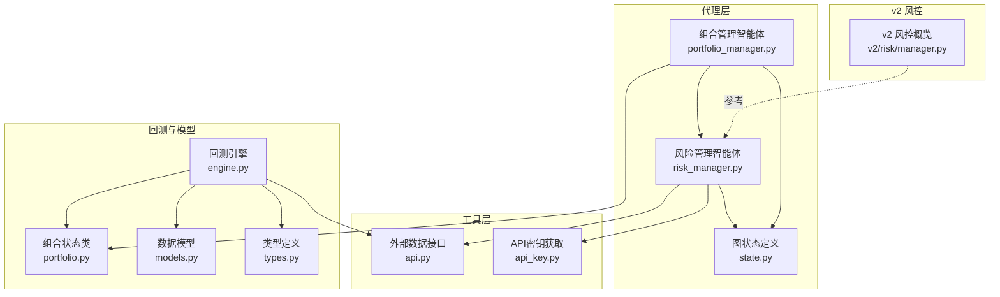
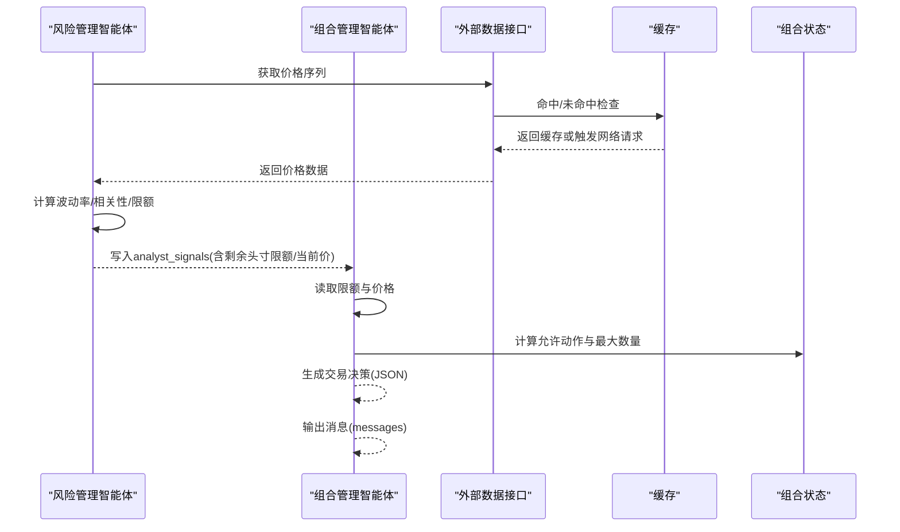
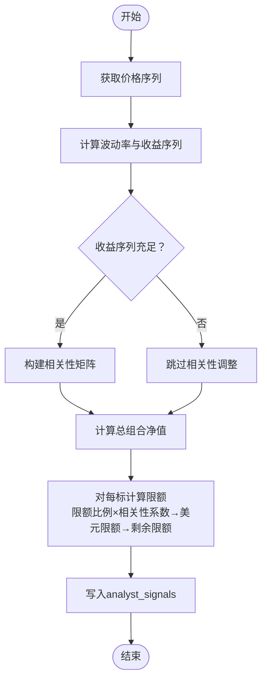
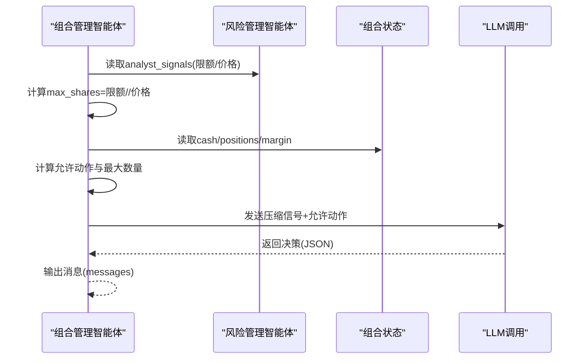
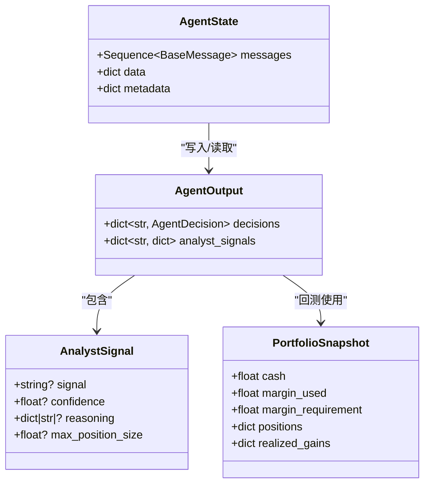
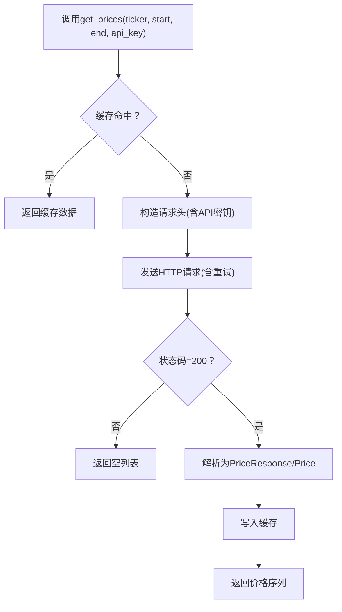
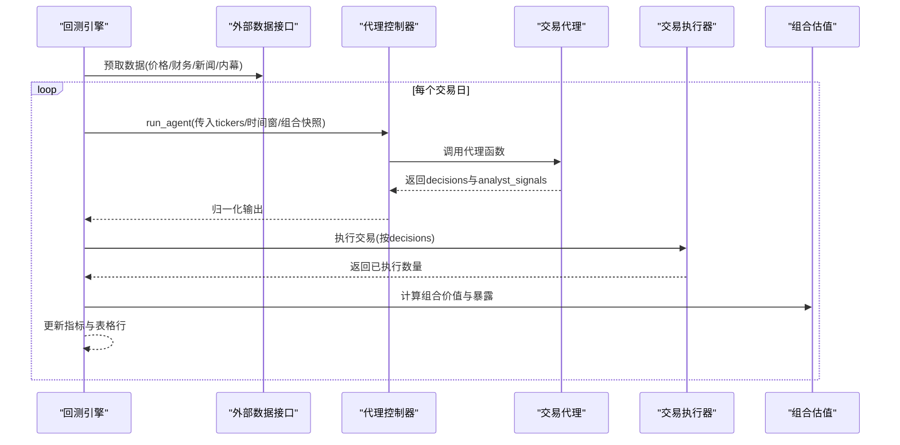
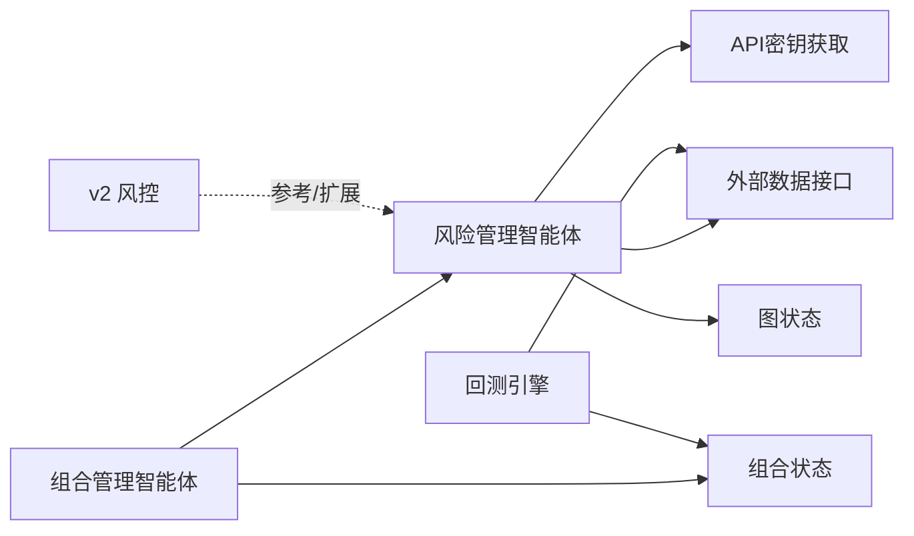

# 风险管理智能体

<cite>
**本文引用的文件**
- [risk_manager.py](file://src/agents/risk_manager.py)
- [portfolio_manager.py](file://src/agents/portfolio_manager.py)
- [state.py](file://src/graph/state.py)
- [api.py](file://src/tools/api.py)
- [api_key.py](file://src/utils/api_key.py)
- [portfolio.py](file://src/backtesting/portfolio.py)
- [engine.py](file://src/backtesting/engine.py)
- [models.py](file://src/data/models.py)
- [types.py](file://src/backtesting/types.py)
- [manager.py(v2)](file://v2/risk/manager.py)
</cite>

## 目录
1. [简介](#简介)
2. [项目结构](#项目结构)
3. [核心组件](#核心组件)
4. [架构总览](#架构总览)
5. [详细组件分析](#详细组件分析)
6. [依赖关系分析](#依赖关系分析)
7. [性能考量](#性能考量)
8. [故障排查指南](#故障排查指南)
9. [结论](#结论)
10. [附录](#附录)

## 简介
本文件系统化梳理“风险管理智能体”的设计与实现，覆盖以下主题：
- 风控核心原理：基于波动率调整的头寸限制、基于相关性的敞口约束、当前价格影响与可用资金限制。
- 止损止盈机制：通过“剩余头寸限额”与“最大可交易数量”间接实现，结合组合管理智能体的决策生成器进行执行。
- 分散投资策略：利用跨期收益序列计算相关性矩阵，降低与活跃持仓高度相关的头寸规模。
- 实时监控：在代理状态中聚合风控信号，供组合管理智能体读取并生成最终交易指令。
- 风控数据共享：通过代理状态中的“analyst_signals”字典实现多智能体间的数据传递。
- 配置与阈值：API密钥来源、缓存命中、回测引擎预取数据等。
- 异常处理与最佳实践：缺省波动率、缺失价格、相关性矩阵不可用、缓存与限流等。

## 项目结构
风险管理智能体位于src/agents目录，围绕代理状态（AgentState）组织数据流；工具层负责外部数据获取与缓存；回测模块提供组合状态与执行器以验证风控逻辑。

**图表来源**
- [risk_manager.py:11-220](file://src/agents/risk_manager.py#L11-L220)
- [portfolio_manager.py:25-93](file://src/agents/portfolio_manager.py#L25-L93)
- [state.py:15-18](file://src/graph/state.py#L15-L18)
- [api.py:63-96](file://src/tools/api.py#L63-L96)
- [api_key.py:3-8](file://src/utils/api_key.py#L3-L8)
- [portfolio.py:9-81](file://src/backtesting/portfolio.py#L9-L81)
- [engine.py:27-195](file://src/backtesting/engine.py#L27-L195)
- [models.py:4-16](file://src/data/models.py#L4-L16)
- [types.py:56-72](file://src/backtesting/types.py#L56-L72)
- [manager.py(v2):1-6](file://v2/risk/manager.py#L1-L6)

**章节来源**
- [risk_manager.py:11-220](file://src/agents/risk_manager.py#L11-L220)
- [portfolio_manager.py:25-93](file://src/agents/portfolio_manager.py#L25-L93)
- [state.py:15-18](file://src/graph/state.py#L15-L18)
- [api.py:63-96](file://src/tools/api.py#L63-L96)
- [api_key.py:3-8](file://src/utils/api_key.py#L3-L8)
- [portfolio.py:9-81](file://src/backtesting/portfolio.py#L9-L81)
- [engine.py:27-195](file://src/backtesting/engine.py#L27-L195)
- [models.py:4-16](file://src/data/models.py#L4-L16)
- [types.py:56-72](file://src/backtesting/types.py#L56-L72)
- [manager.py(v2):1-6](file://v2/risk/manager.py#L1-L6)

## 核心组件
- 风险管理智能体：从外部数据源获取价格序列，计算波动率与相关性，生成每个标的的“剩余头寸限额”和“当前价格”，并写入代理状态的“analyst_signals”。
- 组合管理智能体：读取风险管理智能体的信号，结合当前价格与可用资金，计算最大可交易股数，生成最终交易决策。
- 图状态与消息：代理状态包含messages、data、metadata三部分，风控信号作为analyst_signals的一部分被其他智能体消费。
- 工具层：封装外部API请求、缓存、解析与重试逻辑，支持金融数据API。
- 回测与模型：提供组合状态、交易执行器、性能指标与类型定义，支撑风控策略在回测环境下的验证。

**章节来源**
- [risk_manager.py:11-220](file://src/agents/risk_manager.py#L11-L220)
- [portfolio_manager.py:25-93](file://src/agents/portfolio_manager.py#L25-L93)
- [state.py:15-18](file://src/graph/state.py#L15-L18)
- [api.py:63-96](file://src/tools/api.py#L63-L96)
- [portfolio.py:9-81](file://src/backtesting/portfolio.py#L9-L81)
- [types.py:56-72](file://src/backtesting/types.py#L56-L72)

## 架构总览
风险管理智能体在代理状态中输出标准化的分析师信号，组合管理智能体读取这些信号并生成最终交易指令。工具层负责数据获取与缓存，回测引擎提供统一的执行与估值框架。

**图表来源**
- [risk_manager.py:11-220](file://src/agents/risk_manager.py#L11-L220)
- [portfolio_manager.py:25-93](file://src/agents/portfolio_manager.py#L25-L93)
- [api.py:63-96](file://src/tools/api.py#L63-L96)
- [portfolio.py:9-81](file://src/backtesting/portfolio.py#L9-L81)

## 详细组件分析

### 风险管理智能体（位置限制计算与相关性调整）
- 输入：代理状态中的portfolio、tickers、时间窗口、API密钥。
- 处理流程：
  1) 聚合所有涉及的标的（输入tickers与现有持仓），逐个获取价格序列。
  2) 计算波动率指标（日度/年化波动率、分位数）与最近收益序列，用于后续相关性分析。
  3) 若收益序列≥2且样本足够，构建相关性矩阵；否则跳过相关性调整。
  4) 计算总组合净值（现金+多头市值-空头市值）。
  5) 对每个标的：
     - 计算当前头寸的市场价值（绝对敞口）。
     - 基于年化波动率计算基础限额比例（波动率越高，限额越低）。
     - 计算与活跃持仓的平均/最大相关性，映射为相关性调整系数。
     - 合成限额比例=基础比例×相关性系数；转换为美元限额=总净值×限额比例。
     - 剩余限额=美元限额−当前头寸价值；同时受可用现金约束。
  6) 将结果写入analyst_signals，包含：
     - remaining_position_limit（剩余头寸限额）
     - current_price（当前价格）
     - volatility_metrics（波动率指标）
     - correlation_metrics（相关性统计）
     - reasoning（计算过程摘要）

**图表来源**
- [risk_manager.py:24-203](file://src/agents/risk_manager.py#L24-L203)
- [risk_manager.py:222-267](file://src/agents/risk_manager.py#L222-L267)
- [risk_manager.py:270-318](file://src/agents/risk_manager.py#L270-L318)

**章节来源**
- [risk_manager.py:11-220](file://src/agents/risk_manager.py#L11-L220)
- [risk_manager.py:222-318](file://src/agents/risk_manager.py#L222-L318)

### 组合管理智能体（基于限额的交易决策）
- 输入：analyst_signals（含风险管理智能体的remaining_position_limit与current_price）、当前portfolio、tickers。
- 处理流程：
  1) 读取风险管理智能体的限额与价格。
  2) 计算每标的“最大可交易股数”=remaining_position_limit // current_price（若价格>0）。
  3) 结合当前持仓、可用现金、保证金要求与保证金使用，确定允许的动作集合（买/卖/做空/平仓/持有）及最大数量。
  4) 将信号压缩为{agent: {sig, conf}}，与允许动作一起送入LLM，生成最终决策（JSON）。
  5) 输出消息至代理状态。

**图表来源**
- [portfolio_manager.py:25-93](file://src/agents/portfolio_manager.py#L25-L93)
- [portfolio_manager.py:96-157](file://src/agents/portfolio_manager.py#L96-L157)
- [portfolio_manager.py:177-263](file://src/agents/portfolio_manager.py#L177-L263)

**章节来源**
- [portfolio_manager.py:25-93](file://src/agents/portfolio_manager.py#L25-L93)
- [portfolio_manager.py:96-157](file://src/agents/portfolio_manager.py#L96-L157)
- [portfolio_manager.py:177-263](file://src/agents/portfolio_manager.py#L177-L263)

### 数据模型与类型（风控信号与状态）
- AnalystSignal：包含signal、confidence、reasoning、max_position_size等字段，用于跨智能体传递。
- AgentState：messages、data、metadata三元组，其中data包含analyst_signals。
- AgentOutput：decisions与analyst_signals，标准化各智能体输出。
- PortfolioSnapshot：回测环境中的组合快照，包含cash、positions、margin等。

**图表来源**
- [models.py:152-157](file://src/data/models.py#L152-L157)
- [state.py:15-18](file://src/graph/state.py#L15-L18)
- [types.py:69-72](file://src/backtesting/types.py#L69-L72)
- [types.py:38-49](file://src/backtesting/types.py#L38-L49)

**章节来源**
- [models.py:152-157](file://src/data/models.py#L152-L157)
- [state.py:15-18](file://src/graph/state.py#L15-L18)
- [types.py:38-49](file://src/backtesting/types.py#L38-L49)
- [types.py:69-72](file://src/backtesting/types.py#L69-L72)

### 外部数据获取与缓存（API与密钥）
- get_prices：按ticker、起止日期查询价格序列，优先命中缓存；失败时调用外部API并解析为Price对象列表。
- _make_api_request：统一处理429限流，采用线性退避重试。
- get_api_key_from_state：从代理状态的metadata.request中提取API密钥。

**图表来源**
- [api.py:63-96](file://src/tools/api.py#L63-L96)
- [api.py:29-61](file://src/tools/api.py#L29-L61)
- [api_key.py:3-8](file://src/utils/api_key.py#L3-L8)

**章节来源**
- [api.py:63-96](file://src/tools/api.py#L63-L96)
- [api.py:29-61](file://src/tools/api.py#L29-L61)
- [api_key.py:3-8](file://src/utils/api_key.py#L3-L8)

### 回测与执行（验证风控策略）
- BacktestEngine：预取价格、财务、新闻、内幕交易数据；按交易日循环，运行代理、执行交易、计算组合价值与暴露、更新性能指标。
- Portfolio：支持多头/空头建仓与平仓、成本基础、已实现损益、保证金占用与释放。

**图表来源**
- [engine.py:81-195](file://src/backtesting/engine.py#L81-L195)
- [portfolio.py:82-196](file://src/backtesting/portfolio.py#L82-L196)

**章节来源**
- [engine.py:81-195](file://src/backtesting/engine.py#L81-L195)
- [portfolio.py:82-196](file://src/backtesting/portfolio.py#L82-L196)

## 依赖关系分析
- 风险管理智能体依赖：
  - 外部数据接口：获取价格序列并解析为DataFrame。
  - API密钥：从代理状态中提取。
  - 图状态：写入analyst_signals，供其他智能体消费。
- 组合管理智能体依赖：
  - 风险管理智能体的analyst_signals。
  - 回测组合状态：读取cash、positions、margin等。
- v2风险模块：提供更高阶的风控关注点（回撤控制、尾风险、压力测试等）。

**图表来源**
- [risk_manager.py:11-220](file://src/agents/risk_manager.py#L11-L220)
- [portfolio_manager.py:25-93](file://src/agents/portfolio_manager.py#L25-L93)
- [api.py:63-96](file://src/tools/api.py#L63-L96)
- [api_key.py:3-8](file://src/utils/api_key.py#L3-L8)
- [portfolio.py:9-81](file://src/backtesting/portfolio.py#L9-L81)
- [engine.py:27-195](file://src/backtesting/engine.py#L27-L195)
- [manager.py(v2):1-6](file://v2/risk/manager.py#L1-L6)

**章节来源**
- [risk_manager.py:11-220](file://src/agents/risk_manager.py#L11-L220)
- [portfolio_manager.py:25-93](file://src/agents/portfolio_manager.py#L25-L93)
- [api.py:63-96](file://src/tools/api.py#L63-L96)
- [api_key.py:3-8](file://src/utils/api_key.py#L3-L8)
- [portfolio.py:9-81](file://src/backtesting/portfolio.py#L9-L81)
- [engine.py:27-195](file://src/backtesting/engine.py#L27-L195)
- [manager.py(v2):1-6](file://v2/risk/manager.py#L1-L6)

## 性能考量
- 数据获取与缓存：优先命中缓存，减少外部API调用次数；对429错误采用线性退避，避免瞬时峰值导致失败。
- 相关性矩阵：仅在收益序列充足时计算，避免无效运算；对NaN进行清理，保证稳定性。
- 波动率计算：滚动窗口与历史分位数计算需足够样本，样本不足时采用稳健缺省值。
- 回测预取：在回测开始前批量预取所需数据，缩短每日循环开销。
- 决策生成：仅向LLM发送有交易潜力的标的，减少令牌消耗与响应延迟。

[本节为通用指导，无需特定文件来源]

## 故障排查指南
- 缺失价格数据
  - 现象：标的无有效价格，remaining_position_limit为0。
  - 处理：使用默认波动率与缺省逻辑，继续计算其他标的；在reasoning中标注错误原因。
  - 参考路径：[risk_manager.py:37-45](file://src/agents/risk_manager.py#L37-L45)、[risk_manager.py:109-118](file://src/agents/risk_manager.py#L109-L118)
- 相关性矩阵不可用
  - 现象：收益序列不足或计算异常，corr_multiplier保持为1.0。
  - 处理：降级为仅使用波动率调整；记录相关性统计以便诊断。
  - 参考路径：[risk_manager.py:77-86](file://src/agents/risk_manager.py#L77-L86)、[risk_manager.py:141-161](file://src/agents/risk_manager.py#L141-L161)
- API限流与重试
  - 现象：429错误，程序等待后重试。
  - 处理：检查API密钥与配额；确认网络连通性；适当降低并发。
  - 参考路径：[api.py:29-61](file://src/tools/api.py#L29-L61)
- 限额与可用资金冲突
  - 现象：剩余限额超过可用现金，实际可下单受限于现金。
  - 处理：在组合管理智能体中以cash为上限裁剪max_shares。
  - 参考路径：[risk_manager.py:169-172](file://src/agents/risk_manager.py#L169-L172)、[portfolio_manager.py:135-144](file://src/agents/portfolio_manager.py#L135-L144)
- LLM输出解析失败
  - 现象：JSON解析异常或字段缺失。
  - 处理：使用默认工厂回退为“持有”决策，确保流程不中断。
  - 参考路径：[portfolio_manager.py:242-257](file://src/agents/portfolio_manager.py#L242-L257)

**章节来源**
- [risk_manager.py:37-45](file://src/agents/risk_manager.py#L37-L45)
- [risk_manager.py:77-86](file://src/agents/risk_manager.py#L77-L86)
- [risk_manager.py:109-118](file://src/agents/risk_manager.py#L109-L118)
- [risk_manager.py:169-172](file://src/agents/risk_manager.py#L169-L172)
- [portfolio_manager.py:135-144](file://src/agents/portfolio_manager.py#L135-L144)
- [portfolio_manager.py:242-257](file://src/agents/portfolio_manager.py#L242-L257)
- [api.py:29-61](file://src/tools/api.py#L29-L61)

## 结论
风险管理智能体通过“波动率调整+相关性约束+可用资金上限”三位一体的限额体系，为组合管理智能体提供稳健的交易边界。配合回测引擎与缓存机制，可在真实数据与历史场景下验证风控策略的有效性。建议在生产环境中持续监控API可用性、限额计算的稳定性与LLM输出质量，并根据市场变化动态校准波动率与相关性阈值。

[本节为总结性内容，无需特定文件来源]

## 附录

### 风险参数配置指南
- API密钥来源
  - 通过代理状态的metadata.request.api_keys注入，或环境变量提供。
  - 参考路径：[api_key.py:3-8](file://src/utils/api_key.py#L3-L8)、[api.py:73-78](file://src/tools/api.py#L73-L78)
- 波动率与相关性窗口
  - 波动率滚动窗口与分位数计算依赖历史收益长度；样本不足时采用稳健缺省。
  - 参考路径：[risk_manager.py:243-267](file://src/agents/risk_manager.py#L243-L267)
- 相关性阈值与调整系数
  - 平均相关性分段映射为调整系数，高相关性显著降低限额。
  - 参考路径：[risk_manager.py:301-318](file://src/agents/risk_manager.py#L301-L318)
- 限额与可用资金
  - 剩余限额受“美元限额−当前头寸价值”与“可用现金”双重约束。
  - 参考路径：[risk_manager.py:166-172](file://src/agents/risk_manager.py#L166-L172)
- 回测预取
  - 在回测开始前批量拉取所需数据，提升运行效率。
  - 参考路径：[engine.py:81-94](file://src/backtesting/engine.py#L81-L94)

**章节来源**
- [api_key.py:3-8](file://src/utils/api_key.py#L3-L8)
- [api.py:73-78](file://src/tools/api.py#L73-L78)
- [risk_manager.py:243-267](file://src/agents/risk_manager.py#L243-L267)
- [risk_manager.py:301-318](file://src/agents/risk_manager.py#L301-L318)
- [risk_manager.py:166-172](file://src/agents/risk_manager.py#L166-L172)
- [engine.py:81-94](file://src/backtesting/engine.py#L81-L94)

### 风控阈值设置与异常处理策略
- 波动率阈值
  - 低/中/高/极高波动率分档，分别对应不同限额比例范围。
  - 参考路径：[risk_manager.py:270-298](file://src/agents/risk_manager.py#L270-L298)
- 相关性阈值
  - ≥0.8：大幅降限；≥0.6：适度降限；0.4–0.6：中性；0.2–0.4：小幅增额；<0.2：适度增额。
  - 参考路径：[risk_manager.py:301-318](file://src/agents/risk_manager.py#L301-L318)
- 异常处理
  - 价格缺失：使用默认波动率与缺省限额；相关性不可用：跳过相关性调整；API限流：线性退避重试。
  - 参考路径：[risk_manager.py:37-45](file://src/agents/risk_manager.py#L37-L45)、[risk_manager.py:77-86](file://src/agents/risk_manager.py#L77-L86)、[api.py:29-61](file://src/tools/api.py#L29-L61)

**章节来源**
- [risk_manager.py:270-298](file://src/agents/risk_manager.py#L270-L298)
- [risk_manager.py:301-318](file://src/agents/risk_manager.py#L301-L318)
- [risk_manager.py:37-45](file://src/agents/risk_manager.py#L37-L45)
- [risk_manager.py:77-86](file://src/agents/risk_manager.py#L77-L86)
- [api.py:29-61](file://src/tools/api.py#L29-L61)

### 最佳实践
- 在代理状态中保留完整的reasoning信息，便于审计与复盘。
- 将风险管理智能体的analyst_signals作为单一可信来源，组合管理智能体仅做二次约束与决策。
- 在回测中启用预取与缓存，减少外部依赖带来的不确定性。
- 定期校准波动率与相关性阈值，适应市场结构变化。

[本节为通用指导，无需特定文件来源]