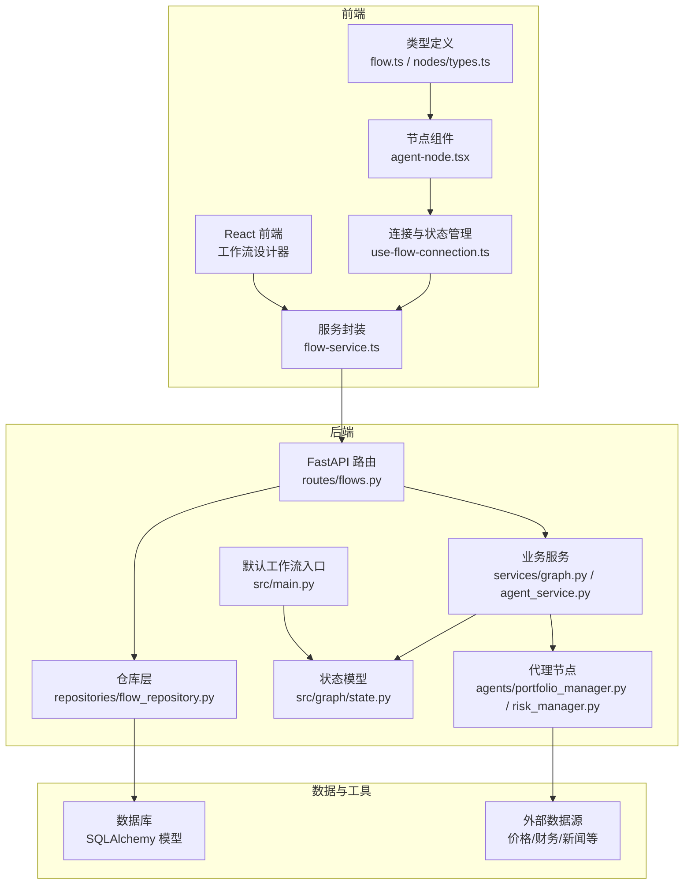
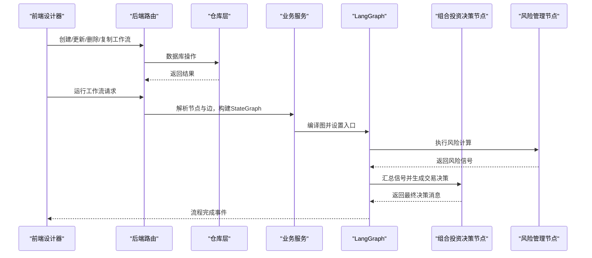
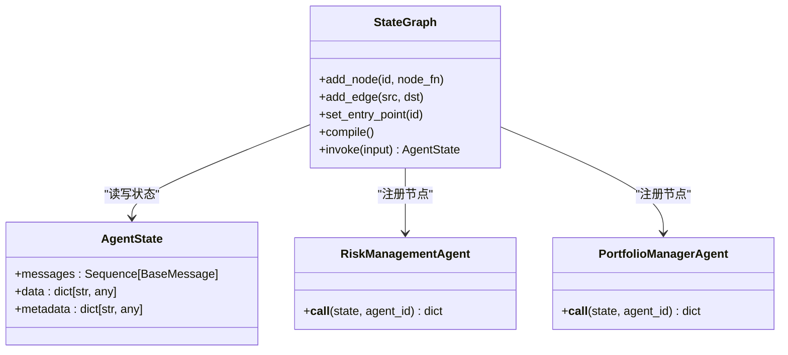
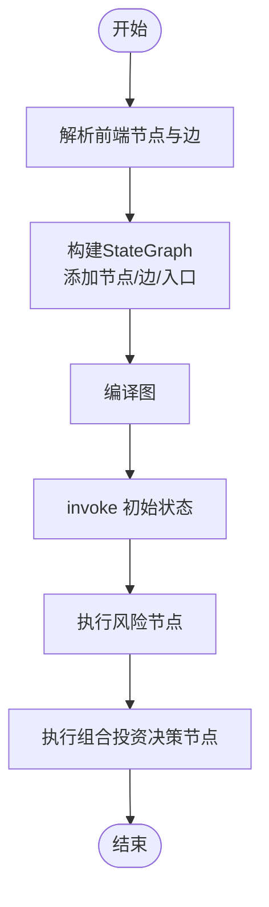
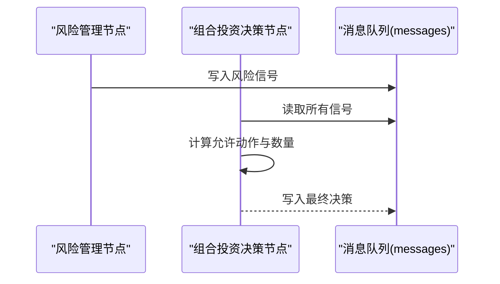
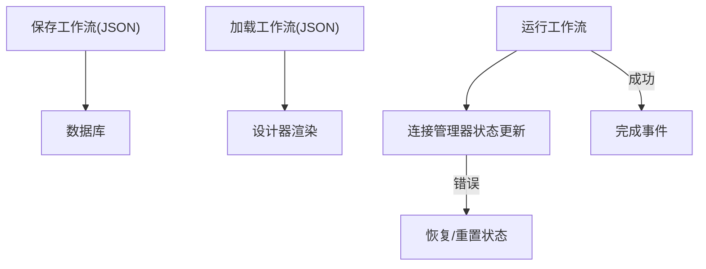
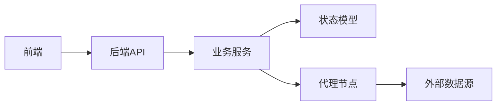

# 工作流引擎

<cite>
**本文引用的文件**
- [src/graph/state.py](file://src/graph/state.py)
- [src/main.py](file://src/main.py)
- [app/backend/services/graph.py](file://app/backend/services/graph.py)
- [app/backend/services/agent_service.py](file://app/backend/services/agent_service.py)
- [src/utils/analysts.py](file://src/utils/analysts.py)
- [src/agents/portfolio_manager.py](file://src/agents/portfolio_manager.py)
- [src/agents/risk_manager.py](file://src/agents/risk_manager.py)
- [app/frontend/src/nodes/components/agent-node.tsx](file://app/frontend/src/nodes/components/agent-node.tsx)
- [app/frontend/src/hooks/use-flow-connection.ts](file://app/frontend/src/hooks/use-flow-connection.ts)
- [app/frontend/src/services/flow-service.ts](file://app/frontend/src/services/flow-service.ts)
- [app/backend/repositories/flow_repository.py](file://app/backend/repositories/flow_repository.py)
- [app/backend/routes/flows.py](file://app/backend/routes/flows.py)
- [app/frontend/src/types/flow.ts](file://app/frontend/src/types/flow.ts)
- [app/frontend/src/nodes/types.ts](file://app/frontend/src/nodes/types.ts)
- [src/backtesting/engine.py](file://src/backtesting/engine.py)
</cite>

## 目录
1. [简介](#简介)
2. [项目结构](#项目结构)
3. [核心组件](#核心组件)
4. [架构总览](#架构总览)
5. [详细组件分析](#详细组件分析)
6. [依赖分析](#依赖分析)
7. [性能考虑](#性能考虑)
8. [故障排查指南](#故障排查指南)
9. [结论](#结论)
10. [附录](#附录)

## 简介
本技术文档面向开发者与使用者，系统性阐述该AI对冲基金项目的工作流引擎设计与实现，重点覆盖以下方面：
- StateGraph状态图设计与AgentState状态管理机制
- 工作流节点的创建、连接与执行流程
- 消息传递系统、状态转换与条件判断逻辑
- 工作流的持久化机制、状态恢复与错误处理策略
- 工作流设计器（前端）的使用指南与最佳实践
- 性能优化、并发处理与资源管理策略
- 自定义工作流节点与扩展工作流功能的指导

## 项目结构
后端采用FastAPI + SQLAlchemy，前端基于React + TypeScript，核心工作流在Python侧通过LangGraph构建；前后端通过REST API交互，数据以JSON形式在节点间传递。

图表来源
- [app/backend/routes/flows.py:1-174](file://app/backend/routes/flows.py#L1-L174)
- [app/backend/repositories/flow_repository.py:1-103](file://app/backend/repositories/flow_repository.py#L1-L103)
- [app/backend/services/graph.py:1-193](file://app/backend/services/graph.py#L1-L193)
- [app/backend/services/agent_service.py:1-13](file://app/backend/services/agent_service.py#L1-L13)
- [src/graph/state.py:1-52](file://src/graph/state.py#L1-L52)
- [src/agents/portfolio_manager.py:1-263](file://src/agents/portfolio_manager.py#L1-L263)
- [src/agents/risk_manager.py:1-318](file://src/agents/risk_manager.py#L1-L318)
- [app/frontend/src/services/flow-service.ts:1-108](file://app/frontend/src/services/flow-service.ts#L1-L108)
- [app/frontend/src/hooks/use-flow-connection.ts:1-268](file://app/frontend/src/hooks/use-flow-connection.ts#L1-L268)
- [app/frontend/src/nodes/components/agent-node.tsx:1-148](file://app/frontend/src/nodes/components/agent-node.tsx#L1-L148)
- [app/frontend/src/types/flow.ts:1-13](file://app/frontend/src/types/flow.ts#L1-L13)
- [app/frontend/src/nodes/types.ts:1-13](file://app/frontend/src/nodes/types.ts#L1-L13)

章节来源
- [app/backend/routes/flows.py:1-174](file://app/backend/routes/flows.py#L1-L174)
- [app/backend/repositories/flow_repository.py:1-103](file://app/backend/repositories/flow_repository.py#L1-L103)
- [app/backend/services/graph.py:1-193](file://app/backend/services/graph.py#L1-L193)
- [app/backend/services/agent_service.py:1-13](file://app/backend/services/agent_service.py#L1-L13)
- [src/graph/state.py:1-52](file://src/graph/state.py#L1-L52)
- [src/agents/portfolio_manager.py:1-263](file://src/agents/portfolio_manager.py#L1-L263)
- [src/agents/risk_manager.py:1-318](file://src/agents/risk_manager.py#L1-L318)
- [app/frontend/src/services/flow-service.ts:1-108](file://app/frontend/src/services/flow-service.ts#L1-L108)
- [app/frontend/src/hooks/use-flow-connection.ts:1-268](file://app/frontend/src/hooks/use-flow-connection.ts#L1-L268)
- [app/frontend/src/nodes/components/agent-node.tsx:1-148](file://app/frontend/src/nodes/components/agent-node.tsx#L1-L148)
- [app/frontend/src/types/flow.ts:1-13](file://app/frontend/src/types/flow.ts#L1-L13)
- [app/frontend/src/nodes/types.ts:1-13](file://app/frontend/src/nodes/types.ts#L1-L13)

## 核心组件
- AgentState：统一的状态容器，包含消息序列、数据字典与元数据字典，支持合并策略，确保状态在节点间安全传递与累积。
- StateGraph：基于LangGraph的有向无环图（DAG），定义节点、边与入口点，驱动状态流转与条件分支。
- 代理节点：风险管理和组合投资决策两大核心节点，前者负责波动率与相关性调整的风险限额计算，后者基于信号与约束生成交易决策。
- 前端工作流设计器：基于React Flow的可视化编辑器，支持节点拖拽、连线、模型选择与运行控制。
- 后端持久化：通过FastAPI路由与SQLAlchemy仓库层实现工作流模板与实例的增删改查与复制。

章节来源
- [src/graph/state.py:14-19](file://src/graph/state.py#L14-L19)
- [src/main.py:100-130](file://src/main.py#L100-L130)
- [app/backend/services/graph.py:36-129](file://app/backend/services/graph.py#L36-L129)
- [src/agents/risk_manager.py:11-219](file://src/agents/risk_manager.py#L11-L219)
- [src/agents/portfolio_manager.py:25-93](file://src/agents/portfolio_manager.py#L25-L93)
- [app/frontend/src/nodes/components/agent-node.tsx:18-147](file://app/frontend/src/nodes/components/agent-node.tsx#L18-L147)
- [app/backend/repositories/flow_repository.py:12-103](file://app/backend/repositories/flow_repository.py#L12-L103)

## 架构总览
工作流引擎采用“状态驱动”的分层架构：
- 前端负责工作流设计与运行控制，通过REST API与后端交互
- 后端负责工作流编译、执行与持久化
- 代理节点通过LLM与外部数据源协作，输出标准化消息
- 状态在节点间按约定格式传递，最终汇聚到组合投资决策节点

图表来源
- [app/backend/routes/flows.py:18-157](file://app/backend/routes/flows.py#L18-L157)
- [app/backend/repositories/flow_repository.py:12-103](file://app/backend/repositories/flow_repository.py#L12-L103)
- [app/backend/services/graph.py:36-129](file://app/backend/services/graph.py#L36-L129)
- [src/agents/risk_manager.py:11-219](file://src/agents/risk_manager.py#L11-L219)
- [src/agents/portfolio_manager.py:25-93](file://src/agents/portfolio_manager.py#L25-L93)

## 详细组件分析

### StateGraph状态图设计与AgentState状态管理
- AgentState定义了三类字段：
  - messages：消息序列，采用加法合并策略，保证历史消息不丢失
  - data：业务数据字典，用于跨节点共享市场数据、组合信息、时间窗口等
  - metadata：元数据字典，用于控制行为（如是否展示推理过程）、模型配置等
- 状态在节点间传递时，通过返回值更新messages与data，metadata通常由调用方注入
- 合并策略确保多源信号（来自不同分析师节点）可被聚合，避免覆盖

图表来源
- [src/graph/state.py:14-19](file://src/graph/state.py#L14-L19)
- [src/main.py:100-130](file://src/main.py#L100-L130)
- [src/agents/risk_manager.py:11-219](file://src/agents/risk_manager.py#L11-L219)
- [src/agents/portfolio_manager.py:25-93](file://src/agents/portfolio_manager.py#L25-L93)

章节来源
- [src/graph/state.py:14-19](file://src/graph/state.py#L14-L19)
- [src/main.py:100-130](file://src/main.py#L100-L130)

### 工作流节点的创建、连接与执行流程
- 节点创建
  - 默认工作流：CLI入口直接构建固定节点链路（起始节点 → 分析师节点 → 风险管理 → 组合投资决策 → 结束）
  - 可视化工作流：后端根据前端传入的节点与边动态构建StateGraph，自动识别分析师节点、组合经理节点与其对应的风控节点
- 边的连接
  - 起始节点仅连接到没有上游边的分析师节点
  - 分析师节点 → 对应风控节点（通过唯一ID映射）
  - 风控节点 → 组合投资决策节点
  - 组合投资决策节点 → 结束标记
- 执行流程
  - 编译StateGraph后，调用invoke传入初始状态（含消息、数据、元数据）
  - 按边顺序依次执行节点函数，节点返回更新后的状态
  - 最终状态中的消息序列包含最终决策

图表来源
- [app/backend/services/graph.py:36-129](file://app/backend/services/graph.py#L36-L129)
- [src/main.py:100-130](file://src/main.py#L100-L130)

章节来源
- [app/backend/services/graph.py:36-129](file://app/backend/services/graph.py#L36-L129)
- [src/main.py:100-130](file://src/main.py#L100-L130)

### 消息传递系统、状态转换与条件判断逻辑
- 消息传递
  - 每个节点通过返回值更新messages与data，metadata保持不变或按需修改
  - 风险节点输出风险信号（含波动率、相关性、剩余头寸限额等），组合投资决策节点汇总这些信号并生成交易决策
- 状态转换
  - 节点函数接收AgentState，返回更新后的状态字典
  - StateGraph根据边进行状态推进，支持多输入汇聚与条件边（通过节点返回决定下一步）
- 条件判断
  - 组合投资决策节点会根据允许动作集合（由资金、保证金、头寸限制推导）与信号强度，选择最优行动与数量
  - 风控节点根据波动率与相关性调整头寸上限，避免过度集中与高波动资产

图表来源
- [src/agents/risk_manager.py:11-219](file://src/agents/risk_manager.py#L11-L219)
- [src/agents/portfolio_manager.py:25-93](file://src/agents/portfolio_manager.py#L25-L93)

章节来源
- [src/agents/risk_manager.py:11-219](file://src/agents/risk_manager.py#L11-L219)
- [src/agents/portfolio_manager.py:25-93](file://src/agents/portfolio_manager.py#L25-L93)

### 工作流的持久化机制、状态恢复与错误处理策略
- 持久化
  - 后端提供工作流的创建、查询、更新、删除与复制接口，数据以JSON形式存储在数据库中
  - 前端通过flow-service封装REST调用，支持新建默认工作流
- 状态恢复
  - 前端连接管理器跟踪每个工作流的连接状态（空闲/连接中/已连接/错误/已完成），并在加载时尝试恢复过期状态
  - 停止运行时仅重置节点状态，保留消息与回测结果等数据
- 错误处理
  - JSON解析失败、类型错误与未知异常均有明确捕获与日志输出
  - API层对异常进行HTTP包装，便于前端统一处理

图表来源
- [app/backend/repositories/flow_repository.py:12-103](file://app/backend/repositories/flow_repository.py#L12-L103)
- [app/backend/routes/flows.py:18-157](file://app/backend/routes/flows.py#L18-L157)
- [app/frontend/src/services/flow-service.ts:27-108](file://app/frontend/src/services/flow-service.ts#L27-L108)
- [app/frontend/src/hooks/use-flow-connection.ts:19-232](file://app/frontend/src/hooks/use-flow-connection.ts#L19-L232)
- [src/main.py:30-42](file://src/main.py#L30-L42)

章节来源
- [app/backend/repositories/flow_repository.py:12-103](file://app/backend/repositories/flow_repository.py#L12-L103)
- [app/backend/routes/flows.py:18-157](file://app/backend/routes/flows.py#L18-L157)
- [app/frontend/src/services/flow-service.ts:27-108](file://app/frontend/src/services/flow-service.ts#L27-L108)
- [app/frontend/src/hooks/use-flow-connection.ts:19-232](file://app/frontend/src/hooks/use-flow-connection.ts#L19-L232)
- [src/main.py:30-42](file://src/main.py#L30-L42)

### 工作流设计器的使用指南与最佳实践
- 使用指南
  - 在左侧组件面板选择节点类型（如分析师、组合投资决策、输出节点等），拖拽至画布
  - 在右侧属性面板配置节点参数（如模型选择、状态显示等）
  - 通过连线建立节点间的执行关系，系统会自动识别分析师到风控再到组合投资决策的路径
  - 点击运行按钮启动工作流，观察节点状态变化与输出
- 最佳实践
  - 将风控节点置于组合投资决策之前，确保信号经风险校准后再做决策
  - 控制组合内相关性，避免高相关性资产过度集中
  - 使用“高级”面板为特定节点指定独立模型，或选择全局自动模式
  - 定期保存工作流为模板，便于复用与版本管理

章节来源
- [app/frontend/src/nodes/components/agent-node.tsx:18-147](file://app/frontend/src/nodes/components/agent-node.tsx#L18-L147)
- [app/frontend/src/hooks/use-flow-connection.ts:114-148](file://app/frontend/src/hooks/use-flow-connection.ts#L114-L148)
- [app/frontend/src/types/flow.ts:1-13](file://app/frontend/src/types/flow.ts#L1-L13)
- [app/frontend/src/nodes/types.ts:1-13](file://app/frontend/src/nodes/types.ts#L1-L13)

### 性能优化、并发处理与资源管理策略
- 并发与异步
  - 后端提供异步执行包装，避免阻塞事件循环
  - 前端连接管理器使用AbortController支持取消运行，减少无效资源占用
- 资源管理
  - 风控节点缓存价格与波动率计算结果，避免重复API调用
  - 组合投资决策节点对不可交易标的进行预过滤，减少LLM调用开销
- 外部数据
  - 回测引擎预取所需数据，降低运行时等待
  - 通过批量API与缓存策略提升数据访问效率

章节来源
- [app/backend/services/graph.py:132-138](file://app/backend/services/graph.py#L132-L138)
- [app/frontend/src/hooks/use-flow-connection.ts:187-211](file://app/frontend/src/hooks/use-flow-connection.ts#L187-L211)
- [src/agents/risk_manager.py:24-76](file://src/agents/risk_manager.py#L24-L76)
- [src/agents/portfolio_manager.py:186-205](file://src/agents/portfolio_manager.py#L186-L205)
- [src/backtesting/engine.py:81-94](file://src/backtesting/engine.py#L81-L94)

### 自定义工作流节点与扩展工作流功能的指导
- 自定义节点
  - 实现一个符合签名的节点函数（接收AgentState，返回更新后的状态字典）
  - 通过后端服务的动态图构建逻辑注册节点，或在CLI默认工作流中添加
  - 使用AgentState的消息与数据字段承载跨节点信息
- 扩展工作流
  - 在前端节点类型定义中新增类型，配套组件实现UI与状态展示
  - 通过后端路由与仓库层扩展持久化能力，支持新字段与查询
  - 为节点增加模型选择能力，结合前端模型选择器实现灵活配置

章节来源
- [app/backend/services/agent_service.py:5-13](file://app/backend/services/agent_service.py#L5-L13)
- [app/backend/services/graph.py:36-129](file://app/backend/services/graph.py#L36-L129)
- [src/utils/analysts.py:184-201](file://src/utils/analysts.py#L184-L201)
- [app/frontend/src/nodes/types.ts:1-13](file://app/frontend/src/nodes/types.ts#L1-L13)
- [app/frontend/src/nodes/components/agent-node.tsx:68-74](file://app/frontend/src/nodes/components/agent-node.tsx#L68-L74)

## 依赖分析
- 组件耦合
  - 后端服务依赖状态模型与代理节点，通过工厂函数将通用代理适配为可编译的节点
  - 前端通过服务封装与连接管理器解耦后端API与运行控制
- 外部依赖
  - LangGraph用于状态图编译与执行
  - FastAPI/SQLAlchemy用于后端API与持久化
  - React/TypeScript用于前端交互与可视化

图表来源
- [app/backend/services/graph.py:1-13](file://app/backend/services/graph.py#L1-L13)
- [src/graph/state.py:1-52](file://src/graph/state.py#L1-L52)
- [src/agents/risk_manager.py:1-8](file://src/agents/risk_manager.py#L1-L8)
- [src/agents/portfolio_manager.py:1-10](file://src/agents/portfolio_manager.py#L1-L10)

章节来源
- [app/backend/services/graph.py:1-13](file://app/backend/services/graph.py#L1-L13)
- [src/graph/state.py:1-52](file://src/graph/state.py#L1-L52)
- [src/agents/risk_manager.py:1-8](file://src/agents/risk_manager.py#L1-L8)
- [src/agents/portfolio_manager.py:1-10](file://src/agents/portfolio_manager.py#L1-L10)

## 性能考虑
- 图构建与编译
  - 动态图构建时尽量减少不必要的节点与边，避免复杂环路
  - 使用唯一ID后缀区分同一类型节点的多个实例，便于一对一风控节点映射
- 数据访问
  - 风控节点缓存价格与波动率，回测前预取数据
  - 对高频API调用进行去重与限速
- LLM调用
  - 仅向LLM发送必要字段，压缩信号与约束，减少token消耗
  - 对无法解析的响应提供默认策略，保证系统可用性

## 故障排查指南
- JSON解析错误
  - 当响应非JSON或类型不符时，系统会打印错误日志并返回None，前端应提示用户检查输入或重试
- 运行中断
  - 前端可通过停止按钮触发AbortController，重置节点状态并回到空闲
  - 若长时间无活动，连接管理器会自动恢复到空闲状态
- 数据缺失
  - 风控节点在无价格数据时使用默认波动率与警告状态，组合投资决策节点会跳过不可交易标的

章节来源
- [src/main.py:30-42](file://src/main.py#L30-L42)
- [app/frontend/src/hooks/use-flow-connection.ts:187-232](file://app/frontend/src/hooks/use-flow-connection.ts#L187-L232)
- [src/agents/risk_manager.py:37-45](file://src/agents/risk_manager.py#L37-L45)
- [src/agents/portfolio_manager.py:196-205](file://src/agents/portfolio_manager.py#L196-L205)

## 结论
该工作流引擎以AgentState为核心，通过LangGraph实现可配置、可扩展的状态图执行；前端提供直观的设计与运行界面，后端提供完善的持久化与API支撑。通过风控与组合投资决策的协同，系统在保证安全性的同时实现了高效的自动化交易决策。建议在生产环境中进一步增强监控与可观测性，并持续优化LLM提示与外部数据缓存策略。

## 附录
- 快速开始
  - 启动后端：进入后端目录，启动FastAPI应用
  - 启动前端：进入前端目录，安装依赖并启动开发服务器
  - 设计工作流：在设计器中拖拽节点并连线，配置模型后点击运行
- 常见问题
  - 如何查看节点状态与输出？使用节点组件的“高级”面板与输出对话框
  - 如何停止正在运行的工作流？点击停止按钮，系统会重置节点状态
  - 如何保存为模板？通过后端提供的复制接口创建副本