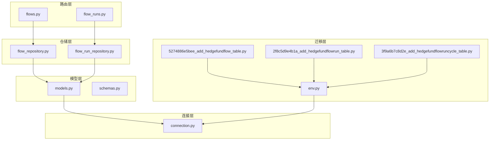
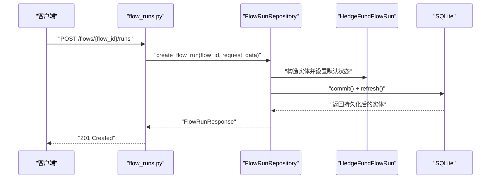
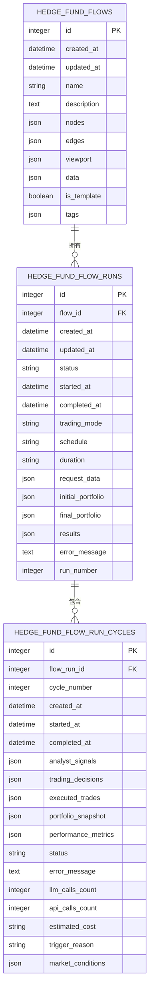
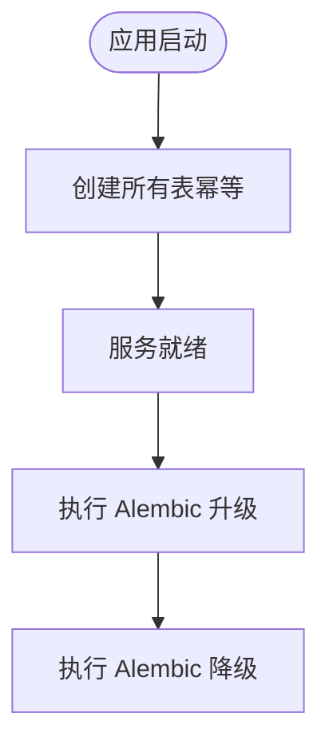
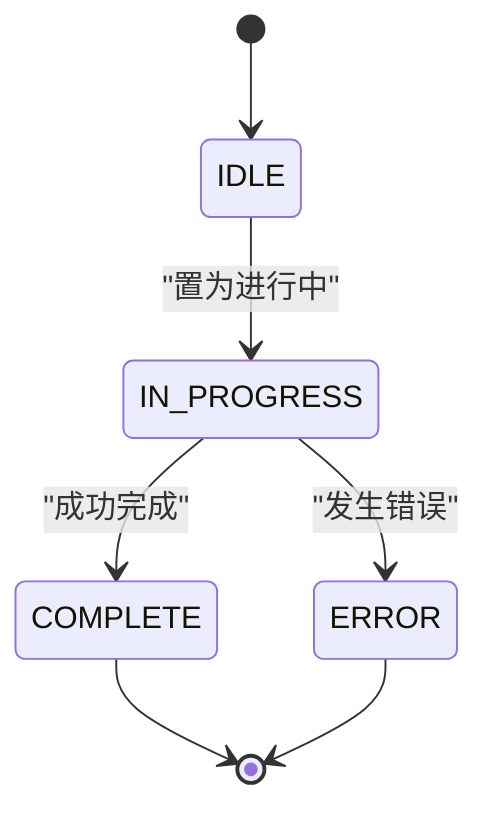
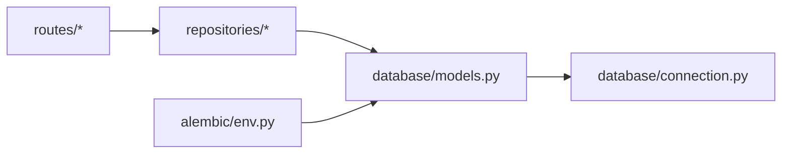

# 工作流持久化

<cite>
**本文引用的文件**
- [models.py](file://app/backend/database/models.py)
- [connection.py](file://app/backend/database/connection.py)
- [schemas.py](file://app/backend/models/schemas.py)
- [flow_repository.py](file://app/backend/repositories/flow_repository.py)
- [flow_run_repository.py](file://app/backend/repositories/flow_run_repository.py)
- [flows.py](file://app/backend/routes/flows.py)
- [flow_runs.py](file://app/backend/routes/flow_runs.py)
- [main.py](file://app/backend/main.py)
- [graph.py](file://app/backend/services/graph.py)
- [5274886e5bee_add_hedgefundflow_table.py](file://app/backend/alembic/versions/5274886e5bee_add_hedgefundflow_table.py)
- [2f8c5d9e4b1a_add_hedgefundflowrun_table.py](file://app/backend/alembic/versions/2f8c5d9e4b1a_add_hedgefundflowrun_table.py)
- [3f9a6b7c8d2e_add_hedgefundflowruncycle_table.py](file://app/backend/alembic/versions/3f9a6b7c8d2e_add_hedgefundflowruncycle_table.py)
- [env.py](file://app/backend/alembic/env.py)
</cite>

## 目录
1. [引言](#引言)
2. [项目结构](#项目结构)
3. [核心组件](#核心组件)
4. [架构总览](#架构总览)
5. [详细组件分析](#详细组件分析)
6. [依赖分析](#依赖分析)
7. [性能考虑](#性能考虑)
8. [故障排查指南](#故障排查指南)
9. [结论](#结论)
10. [附录](#附录)

## 引言
本文件系统性阐述该AI对冲基金项目中“工作流持久化”的设计与实现，重点覆盖以下方面：
- 工作流状态的序列化与存储机制（以JSON字段承载React Flow图结构与运行时数据）
- 数据模型设计与关系（Flows、FlowRuns、FlowRunCycles）
- 持久化策略选择与配置项（SQLite本地数据库、Alembic迁移、索引与默认值）
- 状态恢复与异常处理流程（运行状态机、错误信息落库）
- 数据迁移与版本兼容（多版本迁移脚本、向后兼容列扩展）
- 性能优化与批量操作策略（索引、分页、批量删除）
- 并发访问控制与数据一致性（SQLAlchemy会话、提交/刷新）
- 自定义持久化后端与扩展存储的指导

## 项目结构
后端采用FastAPI + SQLAlchemy + Alembic的典型分层架构：
- 路由层：提供REST接口，负责请求校验与响应封装
- 仓储层：封装数据库读写逻辑，面向领域对象
- 模型层：定义ORM表结构与Pydantic数据契约
- 连接层：数据库引擎与会话工厂
- 迁移层：基于Alembic的版本化Schema管理

**图表来源**
- [flows.py:1-174](file://app/backend/routes/flows.py#L1-L174)
- [flow_runs.py:1-303](file://app/backend/routes/flow_runs.py#L1-L303)
- [flow_repository.py:1-103](file://app/backend/repositories/flow_repository.py#L1-L103)
- [flow_run_repository.py:1-133](file://app/backend/repositories/flow_run_repository.py#L1-L133)
- [models.py:1-115](file://app/backend/database/models.py#L1-L115)
- [connection.py:1-32](file://app/backend/database/connection.py#L1-L32)
- [5274886e5bee_add_hedgefundflow_table.py:1-47](file://app/backend/alembic/versions/5274886e5bee_add_hedgefundflow_table.py#L1-L47)
- [2f8c5d9e4b1a_add_hedgefundflowrun_table.py:1-49](file://app/backend/alembic/versions/2f8c5d9e4b1a_add_hedgefundflowrun_table.py#L1-L49)
- [3f9a6b7c8d2e_add_hedgefundflowruncycle_table.py:1-102](file://app/backend/alembic/versions/3f9a6b7c8d2e_add_hedgefundflowruncycle_table.py#L1-L102)
- [env.py:1-78](file://app/backend/alembic/env.py#L1-L78)

**章节来源**
- [main.py:1-56](file://app/backend/main.py#L1-L56)
- [connection.py:1-32](file://app/backend/database/connection.py#L1-L32)

## 核心组件
- 数据模型（ORM）：HedgeFundFlow、HedgeFundFlowRun、HedgeFundFlowRunCycle
- Pydantic数据契约：Flow/FlowRun请求/响应模型与状态枚举
- 仓储层：FlowRepository、FlowRunRepository，封装CRUD与查询
- 路由层：Flows与FlowRuns接口，统一异常处理
- 连接与初始化：SQLite引擎、会话工厂、启动时建表
- 迁移层：多版本Alembic脚本，支持向后兼容扩展

**章节来源**
- [models.py:6-115](file://app/backend/database/models.py#L6-L115)
- [schemas.py:9-241](file://app/backend/models/schemas.py#L9-L241)
- [flow_repository.py:6-103](file://app/backend/repositories/flow_repository.py#L6-L103)
- [flow_run_repository.py:9-133](file://app/backend/repositories/flow_run_repository.py#L9-L133)
- [flows.py:18-174](file://app/backend/routes/flows.py#L18-L174)
- [flow_runs.py:20-303](file://app/backend/routes/flow_runs.py#L20-L303)
- [main.py:17-18](file://app/backend/main.py#L17-L18)

## 架构总览
工作流持久化贯穿“请求—仓储—模型—数据库”的完整链路，状态通过JSON字段在数据库中序列化存储，运行时状态机驱动状态流转与时间戳更新。

**图表来源**
- [flow_runs.py:28-51](file://app/backend/routes/flow_runs.py#L28-L51)
- [flow_run_repository.py:15-29](file://app/backend/repositories/flow_run_repository.py#L15-L29)
- [models.py:29-54](file://app/backend/database/models.py#L29-L54)

## 详细组件分析

### 数据模型与关系
- HedgeFundFlow：存储React Flow的节点、边、视口与内部数据，支持模板标记与标签
- HedgeFundFlowRun：单次执行记录，含状态机、计时字段、请求/结果/错误数据、运行序号
- HedgeFundFlowRunCycle：交易会话内的分析周期，记录信号、决策、成交、快照、指标、成本等

**图表来源**
- [models.py:6-115](file://app/backend/database/models.py#L6-L115)

**章节来源**
- [models.py:6-115](file://app/backend/database/models.py#L6-L115)

### 序列化与存储机制
- JSON字段用于存储复杂结构：nodes/edges/viewport/data、request_data/initial_portfolio/final_portfolio/results、analyst_signals/trading_decisions/executed_trades/portfolio_snapshot/performance_metrics等
- 字段默认值与约束：状态枚举、布尔标志、字符串长度限制、JSON/Text字段
- 时间戳：created_at/updated_at由服务器默认生成；运行开始/完成时间在状态切换时自动填充

**章节来源**
- [models.py:18-26](file://app/backend/database/models.py#L18-L26)
- [models.py:38-53](file://app/backend/database/models.py#L38-L53)
- [models.py:67-94](file://app/backend/database/models.py#L67-L94)
- [schemas.py:9-14](file://app/backend/models/schemas.py#L9-L14)

### 持久化策略与配置
- 数据库：SQLite（本地开发/演示），使用绝对路径避免跨平台问题
- 会话：SQLAlchemy SessionLocal，非线程安全（SQLite特性允许），autocommit/autoflush关闭
- 初始化：应用启动时创建所有表（幂等）
- 迁移：Alembic版本化管理，支持升级/降级；新增列采用条件判断避免重复添加

**图表来源**
- [main.py:17-18](file://app/backend/main.py#L17-L18)
- [env.py:19-20](file://app/backend/alembic/env.py#L19-L20)
- [3f9a6b7c8d2e_add_hedgefundflowruncycle_table.py:18-68](file://app/backend/alembic/versions/3f9a6b7c8d2e_add_hedgefundflowruncycle_table.py#L18-L68)

**章节来源**
- [connection.py:11-21](file://app/backend/database/connection.py#L11-L21)
- [main.py:17-18](file://app/backend/main.py#L17-L18)
- [5274886e5bee_add_hedgefundflow_table.py:21-38](file://app/backend/alembic/versions/5274886e5bee_add_hedgefundflow_table.py#L21-L38)
- [2f8c5d9e4b1a_add_hedgefundflowrun_table.py:21-40](file://app/backend/alembic/versions/2f8c5d9e4b1a_add_hedgefundflowrun_table.py#L21-L40)
- [3f9a6b7c8d2e_add_hedgefundflowruncycle_table.py:18-68](file://app/backend/alembic/versions/3f9a6b7c8d2e_add_hedgefundflowruncycle_table.py#L18-L68)

### 状态恢复与异常处理
- 状态机：IDLE → IN_PROGRESS → (COMPLETE | ERROR)，时间戳随状态变化自动更新
- 错误处理：路由层捕获异常并返回HTTP错误；运行更新支持同时写入results与error_message
- 恢复点：通过最新/活跃运行查询接口，结合run_number进行顺序回溯

**图表来源**
- [schemas.py:9-14](file://app/backend/models/schemas.py#L9-L14)
- [flow_run_repository.py:66-96](file://app/backend/repositories/flow_run_repository.py#L66-L96)

**章节来源**
- [flow_runs.py:178-213](file://app/backend/routes/flow_runs.py#L178-L213)
- [flow_run_repository.py:66-96](file://app/backend/repositories/flow_run_repository.py#L66-L96)

### 数据迁移与版本兼容
- 初始表：HedgeFundFlow（节点/边/视口/数据/标签）
- 扩展表：HedgeFundFlowRun（运行状态、计时、请求/结果/错误、运行序号）
- 周期表：HedgeFundFlowRunCycle（分析周期内各阶段数据与成本）
- 兼容策略：新增列前检查是否存在，避免重复添加；降级时按需移除列与索引

**章节来源**
- [5274886e5bee_add_hedgefundflow_table.py:21-38](file://app/backend/alembic/versions/5274886e5bee_add_hedgefundflow_table.py#L21-L38)
- [2f8c5d9e4b1a_add_hedgefundflowrun_table.py:21-40](file://app/backend/alembic/versions/2f8c5d9e4b1a_add_hedgefundflowrun_table.py#L21-L40)
- [3f9a6b7c8d2e_add_hedgefundflowruncycle_table.py:18-68](file://app/backend/alembic/versions/3f9a6b7c8d2e_add_hedgefundflowruncycle_table.py#L18-L68)

### 并发访问控制与一致性
- 会话隔离：每个请求使用独立Session，确保事务边界清晰
- 提交与刷新：写入后commit并refresh，保证上层读取到最新状态
- 外键约束：FlowRun与Flow、Cycle与Run之间建立外键，保障引用完整性
- 查询优化：为flow_id、run_id、started_at等关键字段建立索引

**章节来源**
- [connection.py:27-32](file://app/backend/database/connection.py#L27-L32)
- [flow_repository.py:12-28](file://app/backend/repositories/flow_repository.py#L12-L28)
- [flow_run_repository.py:15-29](file://app/backend/repositories/flow_run_repository.py#L15-L29)
- [2f8c5d9e4b1a_add_hedgefundflowrun_table.py:38-39](file://app/backend/alembic/versions/2f8c5d9e4b1a_add_hedgefundflowrun_table.py#L38-L39)
- [3f9a6b7c8d2e_add_hedgefundflowruncycle_table.py:63-67](file://app/backend/alembic/versions/3f9a6b7c8d2e_add_hedgefundflowruncycle_table.py#L63-L67)

### 自定义持久化后端与扩展存储
- 后端替换：将SQLite引擎替换为PostgreSQL/MySQL引擎，调整连接参数与方言
- 扩展存储：可在现有JSON字段基础上增加压缩或外部存储引用（如S3键），并在Schema中扩展字段
- 事务与一致性：保持当前的commit/refresh模式，必要时引入重试与幂等写入
- 迁移策略：沿用Alembic，新增列采用条件判断，确保多环境一致

**章节来源**
- [connection.py:15-18](file://app/backend/database/connection.py#L15-L18)
- [models.py:48-53](file://app/backend/database/models.py#L48-L53)

## 依赖分析
- 路由依赖仓储：flows.py与flow_runs.py分别注入FlowRepository与FlowRunRepository
- 仓储依赖模型：直接操作ORM实体，返回Pydantic响应模型
- 迁移依赖模型元数据：Alembic从env.py读取Base.metadata进行版本化管理

**图表来源**
- [flows.py:1-13](file://app/backend/routes/flows.py#L1-L13)
- [flow_runs.py:1-15](file://app/backend/routes/flow_runs.py#L1-L15)
- [flow_repository.py:1-6](file://app/backend/repositories/flow_repository.py#L1-L6)
- [flow_run_repository.py:1-6](file://app/backend/repositories/flow_run_repository.py#L1-L6)
- [models.py:1-3](file://app/backend/database/models.py#L1-L3)
- [connection.py:1-3](file://app/backend/database/connection.py#L1-L3)
- [env.py:19-20](file://app/backend/alembic/env.py#L19-L20)

**章节来源**
- [flows.py:1-13](file://app/backend/routes/flows.py#L1-L13)
- [flow_runs.py:1-15](file://app/backend/routes/flow_runs.py#L1-L15)
- [env.py:19-20](file://app/backend/alembic/env.py#L19-L20)

## 性能考虑
- 索引优化：为flow_id、run_id、started_at等常用过滤/排序字段建立索引
- 分页与限制：列表接口支持limit/offset，避免一次性加载过多记录
- 批量删除：提供按flow_id批量删除运行记录的能力
- JSON字段大小：建议对大体量JSON进行压缩或拆分，减少I/O开销
- 事务粒度：保持小事务，避免长时间持有锁

**章节来源**
- [flow_runs.py:62-83](file://app/backend/routes/flow_runs.py#L62-L83)
- [flow_run_repository.py:108-116](file://app/backend/repositories/flow_run_repository.py#L108-L116)
- [2f8c5d9e4b1a_add_hedgefundflowrun_table.py:38-39](file://app/backend/alembic/versions/2f8c5d9e4b1a_add_hedgefundflowrun_table.py#L38-L39)
- [3f9a6b7c8d2e_add_hedgefundflowruncycle_table.py:63-67](file://app/backend/alembic/versions/3f9a6b7c8d2e_add_hedgefundflowruncycle_table.py#L63-L67)

## 故障排查指南
- 创建/更新失败：检查路由层异常捕获与HTTP状态码映射
- 运行状态不更新：确认状态枚举与时间戳更新逻辑
- 查询不到数据：核对flow_id与run_id是否匹配，索引是否生效
- 迁移报错：确认Alembic版本与目标数据库Schema一致，注意条件新增列

**章节来源**
- [flows.py:26-42](file://app/backend/routes/flows.py#L26-L42)
- [flow_runs.py:178-213](file://app/backend/routes/flow_runs.py#L178-L213)
- [flow_run_repository.py:66-96](file://app/backend/repositories/flow_run_repository.py#L66-L96)

## 结论
该工作流持久化方案以轻量级SQLite为基础，通过JSON字段灵活承载复杂状态，配合Alembic实现可演进的Schema管理。仓储层抽象了CRUD与查询，路由层提供清晰的REST接口与异常处理。通过索引、分页与批量操作，系统在开发与演示场景下具备良好可用性。若转向生产，建议评估PostgreSQL/MySQL与分布式一致性需求，并对JSON字段进行压缩或外部化存储以提升性能与可维护性。

## 附录
- 关键流程参考路径
  - 创建运行：[flow_runs.py:28-51](file://app/backend/routes/flow_runs.py#L28-L51) → [flow_run_repository.py:15-29](file://app/backend/repositories/flow_run_repository.py#L15-L29)
  - 更新运行：[flow_runs.py:178-213](file://app/backend/routes/flow_runs.py#L178-L213) → [flow_run_repository.py:66-96](file://app/backend/repositories/flow_run_repository.py#L66-L96)
  - 查询运行：[flow_runs.py:62-83](file://app/backend/routes/flow_runs.py#L62-L83)、[flow_runs.py:94-107](file://app/backend/routes/flow_runs.py#L94-L107)、[flow_runs.py:121-133](file://app/backend/routes/flow_runs.py#L121-L133)
  - 删除运行：[flow_runs.py:224-247](file://app/backend/routes/flow_runs.py#L224-L247)、[flow_runs.py:258-275](file://app/backend/routes/flow_runs.py#L258-L275)
  - 迁移脚本：[5274886e5bee_add_hedgefundflow_table.py:21-38](file://app/backend/alembic/versions/5274886e5bee_add_hedgefundflow_table.py#L21-L38)、[2f8c5d9e4b1a_add_hedgefundflowrun_table.py:21-40](file://app/backend/alembic/versions/2f8c5d9e4b1a_add_hedgefundflowrun_table.py#L21-L40)、[3f9a6b7c8d2e_add_hedgefundflowruncycle_table.py:18-68](file://app/backend/alembic/versions/3f9a6b7c8d2e_add_hedgefundflowruncycle_table.py#L18-L68)