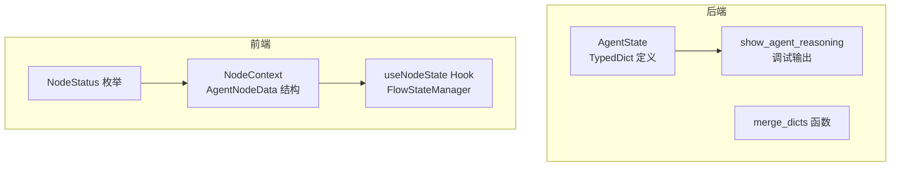
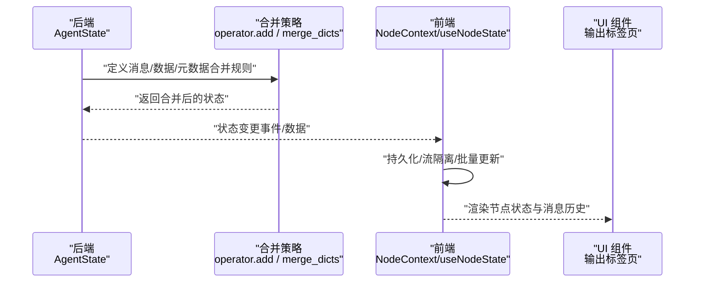
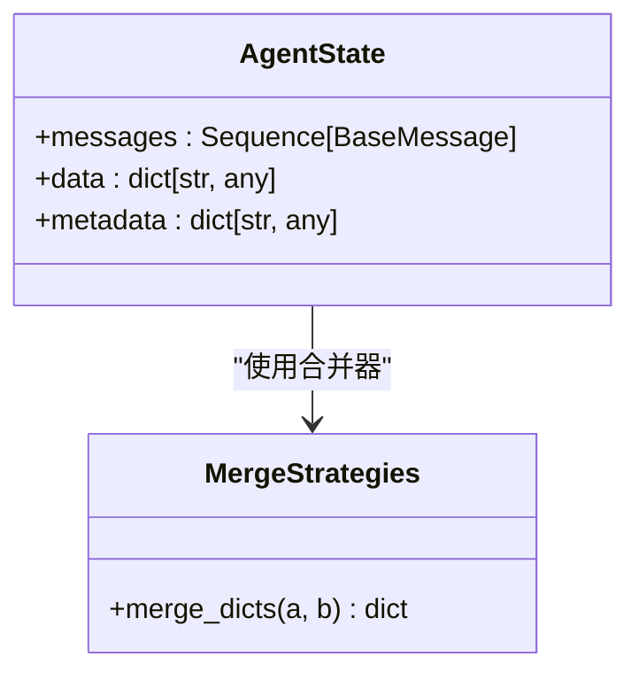
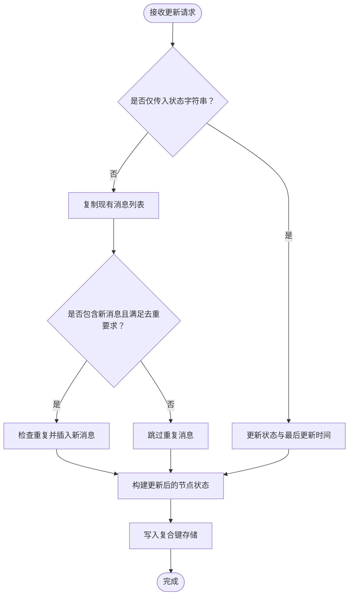
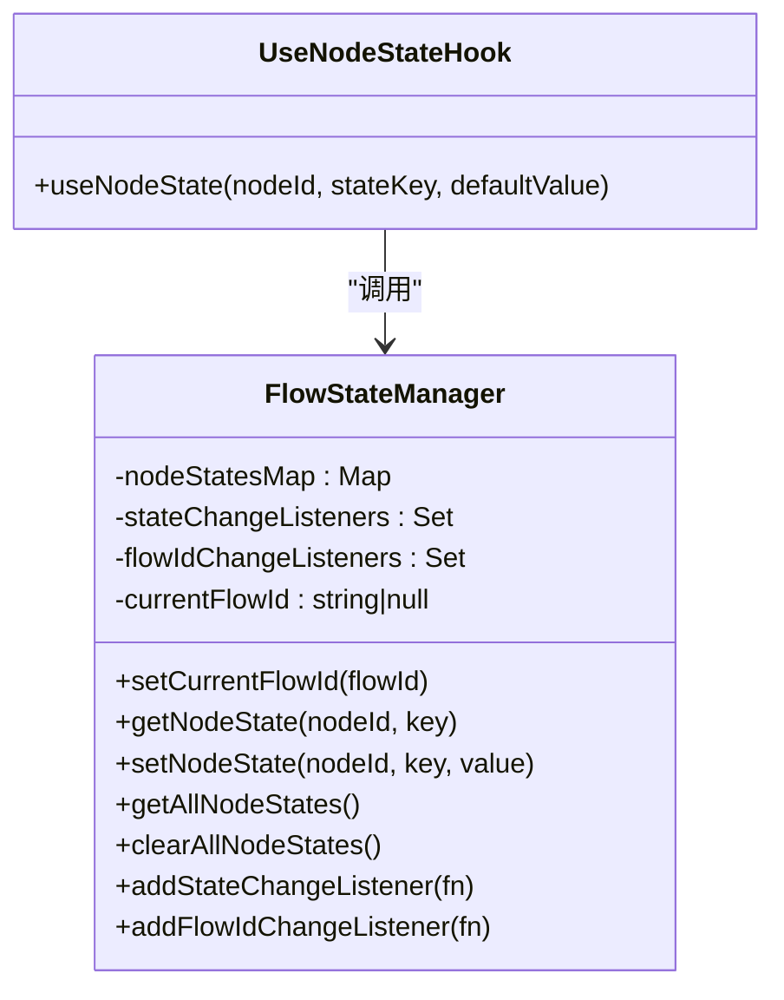
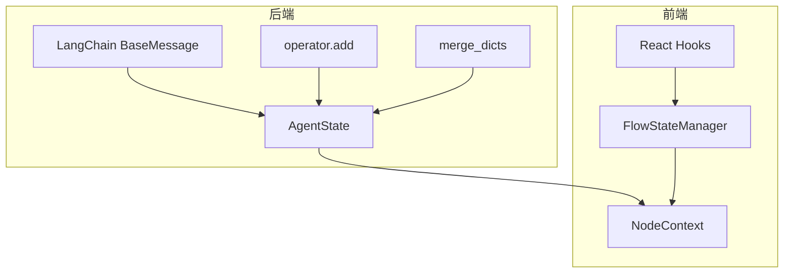

# 智能体状态管理

<cite>
**本文引用的文件**
- [src/graph/state.py](file://src/graph/state.py)
- [app/backend/services/agent_service.py](file://app/backend/services/agent_service.py)
- [app/frontend/src/hooks/use-node-state.ts](file://app/frontend/src/hooks/use-node-state.ts)
- [app/frontend/src/contexts/node-context.tsx](file://app/frontend/src/contexts/node-context.tsx)
- [app/frontend/src/components/panels/bottom/tabs/regular-output.tsx](file://app/frontend/src/components/panels/bottom/tabs/regular-output.tsx)
- [app/frontend/src/components/panels/bottom/tabs/output-tab.tsx](file://app/frontend/src/components/panels/bottom/tabs/output-tab.tsx)
- [app/frontend/src/nodes/components/portfolio-start-node.tsx](file://app/frontend/src/nodes/components/portfolio-start-node.tsx)
- [app/frontend/src/components/panels/bottom/tabs/debug-console-tab.tsx](file://app/frontend/src/components/panels/bottom/tabs/debug-console-tab.tsx)
- [src/utils/visualize.py](file://src/utils/visualize.py)
</cite>

## 目录
1. [简介](#简介)
2. [项目结构](#项目结构)
3. [核心组件](#核心组件)
4. [架构总览](#架构总览)
5. [详细组件分析](#详细组件分析)
6. [依赖分析](#依赖分析)
7. [性能考虑](#性能考虑)
8. [故障排查指南](#故障排查指南)
9. [结论](#结论)
10. [附录](#附录)

## 简介
本文件聚焦于“智能体状态管理”的技术文档，围绕后端的 AgentState 类型定义与消息合并策略、前端节点状态上下文与持久化 Hook、以及状态调试与可视化输出工具进行系统性说明。重点包括：
- AgentState 的设计理念与数据结构（messages、data、metadata）及其类型注解语义
- merge_dicts 的消息合并机制与 operator.add 的操作符重载在状态合并中的作用
- 状态序列化与反序列化的处理流程（前后端视角）
- 状态更新最佳实践与性能优化建议
- 调试与可视化工具的使用方法
- 自定义状态字段与扩展状态功能的指导

## 项目结构
本项目采用前后端分离架构，状态管理横跨后端 Python 与前端 TypeScript/React：
- 后端：通过 TypedDict 定义 AgentState，并在 LangGraph 中作为节点状态的数据契约；提供状态调试输出工具
- 前端：通过 React Context 和自定义 Hook 管理节点状态，支持流式隔离、持久化与批量更新

**图表来源**
- [src/graph/state.py:14-18](file://src/graph/state.py#L14-L18)
- [src/graph/state.py:10-11](file://src/graph/state.py#L10-L11)
- [src/graph/state.py:21-51](file://src/graph/state.py#L21-L51)
- [app/frontend/src/contexts/node-context.tsx:14-24](file://app/frontend/src/contexts/node-context.tsx#L14-L24)
- [app/frontend/src/hooks/use-node-state.ts:7-132](file://app/frontend/src/hooks/use-node-state.ts#L7-L132)
- [app/frontend/src/contexts/node-context.tsx:4](file://app/frontend/src/contexts/node-context.tsx#L4)

**章节来源**
- [src/graph/state.py:14-18](file://src/graph/state.py#L14-L18)
- [app/frontend/src/contexts/node-context.tsx:14-24](file://app/frontend/src/contexts/node-context.tsx#L14-L24)
- [app/frontend/src/hooks/use-node-state.ts:7-132](file://app/frontend/src/hooks/use-node-state.ts#L7-L132)

## 核心组件
- 后端 AgentState：定义三类核心字段，分别承载消息序列、任意数据字典与元数据字典，并通过 Annotated 注解声明合并策略
- 合并策略：
  - messages 使用 operator.add，表示序列拼接
  - data 与 metadata 使用 merge_dicts，表示字典键值合并
- 前端 NodeContext：定义 AgentNodeData 接口，承载节点状态（含消息历史、状态、时间戳等），并提供基于流的隔离与导出导入能力
- 前端 useNodeState Hook：提供 React 状态与持久化的一体化封装，支持流切换时的状态迁移与监听通知

**章节来源**
- [src/graph/state.py:14-18](file://src/graph/state.py#L14-L18)
- [src/graph/state.py:10-11](file://src/graph/state.py#L10-L11)
- [app/frontend/src/contexts/node-context.tsx:14-24](file://app/frontend/src/contexts/node-context.tsx#L14-L24)
- [app/frontend/src/hooks/use-node-state.ts:194-268](file://app/frontend/src/hooks/use-node-state.ts#L194-L268)

## 架构总览
下图展示从后端状态定义到前端状态消费的整体流程，以及调试输出与可视化工具的集成位置。

**图表来源**
- [src/graph/state.py:14-18](file://src/graph/state.py#L14-L18)
- [src/graph/state.py:10-11](file://src/graph/state.py#L10-L11)
- [app/frontend/src/contexts/node-context.tsx:98-163](file://app/frontend/src/contexts/node-context.tsx#L98-L163)
- [app/frontend/src/hooks/use-node-state.ts:194-268](file://app/frontend/src/hooks/use-node-state.ts#L194-L268)

## 详细组件分析

### 后端：AgentState 与合并策略
- 设计理念
  - 使用 TypedDict 作为强类型契约，确保状态结构稳定
  - 通过 Annotated 注解绑定合并器，使 LangGraph 在多节点并行执行时自动进行状态合并
- 字段说明
  - messages：序列化消息集合，用于记录推理链路与交互历史
  - data：任意键值对数据，承载业务数据或中间结果
  - metadata：额外的元信息，如时间戳、来源、版本等
- 合并机制
  - operator.add：对序列进行拼接，适用于消息累积
  - merge_dicts：对字典进行键值合并，适用于数据与元数据的增量更新
- 调试输出
  - show_agent_reasoning 提供统一的调试打印入口，支持对象转可序列化格式与 JSON 美化输出

**图表来源**
- [src/graph/state.py:14-18](file://src/graph/state.py#L14-L18)
- [src/graph/state.py:10-11](file://src/graph/state.py#L10-L11)

**章节来源**
- [src/graph/state.py:14-18](file://src/graph/state.py#L14-L18)
- [src/graph/state.py:10-11](file://src/graph/state.py#L10-L11)
- [src/graph/state.py:21-51](file://src/graph/state.py#L21-L51)

### 前端：NodeContext 与 AgentNodeData
- 数据模型
  - AgentNodeData：包含状态、消息数组、时间戳、分析结果等字段
  - MessageItem：单条消息项，包含时间戳、文本、标的与分析映射
  - NodeStatus：节点状态枚举（空闲、进行中、完成、错误）
- 流式隔离
  - 通过复合键（flowId:nodeId）实现不同流之间的状态隔离
  - 支持按流导出/导入节点状态，便于保存与恢复
- 批量更新
  - 提供批量设置节点状态的方法，减少多次渲染开销
- 去重与防抖
  - 新增消息前进行去重检查，避免重复消息进入历史

**图表来源**
- [app/frontend/src/contexts/node-context.tsx:98-163](file://app/frontend/src/contexts/node-context.tsx#L98-L163)

**章节来源**
- [app/frontend/src/contexts/node-context.tsx:14-24](file://app/frontend/src/contexts/node-context.tsx#L14-L24)
- [app/frontend/src/contexts/node-context.tsx:98-163](file://app/frontend/src/contexts/node-context.tsx#L98-L163)
- [app/frontend/src/contexts/node-context.tsx:4](file://app/frontend/src/contexts/node-context.tsx#L4)

### 前端：useNodeState Hook 与 FlowStateManager
- 功能概述
  - 将 React 状态与全局状态管理结合，提供持久化、流隔离与监听通知
  - 在流切换时自动重置状态并触发重新渲染
- 关键点
  - 复合键生成：根据当前流 ID 与节点 ID 生成唯一键
  - 监听器：状态变化与流变化时触发回调，保证 UI 与存储同步
  - 初始化：首次挂载或流切换时，从持久化存储读取默认值

**图表来源**
- [app/frontend/src/hooks/use-node-state.ts:7-132](file://app/frontend/src/hooks/use-node-state.ts#L7-L132)
- [app/frontend/src/hooks/use-node-state.ts:194-268](file://app/frontend/src/hooks/use-node-state.ts#L194-L268)

**章节来源**
- [app/frontend/src/hooks/use-node-state.ts:7-132](file://app/frontend/src/hooks/use-node-state.ts#L7-L132)
- [app/frontend/src/hooks/use-node-state.ts:194-268](file://app/frontend/src/hooks/use-node-state.ts#L194-L268)

### 状态序列化与反序列化
- 后端序列化
  - 通过 show_agent_reasoning 将复杂对象转换为可序列化结构，再以 JSON 美化输出，便于日志与调试
- 前端持久化
  - FlowStateManager 使用内存 Map 存储状态，键为复合键（flowId:nodeId）
  - 导出/导入时可按流过滤与剥离前缀，实现状态的跨会话保留与恢复
- 注意事项
  - 避免在 data/metadata 中存放不可序列化对象
  - 对于大体量消息，建议在 UI 层做分页或懒加载，避免一次性渲染造成性能问题

**章节来源**
- [src/graph/state.py:21-51](file://src/graph/state.py#L21-L51)
- [app/frontend/src/hooks/use-node-state.ts:69-112](file://app/frontend/src/hooks/use-node-state.ts#L69-L112)
- [app/frontend/src/contexts/node-context.tsx:308-336](file://app/frontend/src/contexts/node-context.tsx#L308-L336)

### 状态调试与可视化
- 后端调试
  - 使用 show_agent_reasoning 输出推理过程，支持对象转字典与 JSON 美化
- 前端调试
  - 节点状态面板定期刷新，展示各智能体的进度与状态
  - 调试控制台提供占位输出区域，便于扩展日志输出
- 可视化
  - 通过 visualize.save_graph_as_png 将编译后的图结构导出为 PNG，辅助理解流程拓扑

**章节来源**
- [src/graph/state.py:21-51](file://src/graph/state.py#L21-L51)
- [app/frontend/src/components/panels/bottom/tabs/output-tab.tsx:13-37](file://app/frontend/src/components/panels/bottom/tabs/output-tab.tsx#L13-L37)
- [app/frontend/src/components/panels/bottom/tabs/regular-output.tsx:10-35](file://app/frontend/src/components/panels/bottom/tabs/regular-output.tsx#L10-L35)
- [app/frontend/src/components/panels/bottom/tabs/debug-console-tab.tsx:1-15](file://app/frontend/src/components/panels/bottom/tabs/debug-console-tab.tsx#L1-L15)
- [src/utils/visualize.py:5-9](file://src/utils/visualize.py#L5-L9)

### 自定义状态字段与扩展建议
- 后端扩展
  - 在 AgentState 中新增字段时，需同时定义其合并器（如 operator.add 或 merge_dicts），确保 LangGraph 正确合并
  - 若新增字段为复杂对象，建议在调试输出前进行显式序列化
- 前端扩展
  - 在 AgentNodeData 中添加新字段时，保持与后端一致的命名与类型约定
  - 使用 NodeContext 的导出/导入接口，确保新字段参与持久化
  - 如需跨流共享配置，可通过全局模型选择器或独立的配置上下文维护

**章节来源**
- [src/graph/state.py:14-18](file://src/graph/state.py#L14-L18)
- [app/frontend/src/contexts/node-context.tsx:14-24](file://app/frontend/src/contexts/node-context.tsx#L14-L24)

## 依赖分析
- 后端依赖
  - LangChain BaseMessage 作为消息基类
  - operator.add 用于序列合并
  - 自定义 merge_dicts 用于字典合并
- 前端依赖
  - React Hooks（useState/useEffect/useCallback）实现状态与副作用
  - FlowStateManager 提供全局状态与监听机制
  - NodeContext 提供流式隔离与导出导入能力

**图表来源**
- [src/graph/state.py:3-4](file://src/graph/state.py#L3-L4)
- [src/graph/state.py:16-18](file://src/graph/state.py#L16-L18)
- [app/frontend/src/hooks/use-node-state.ts:1-1](file://app/frontend/src/hooks/use-node-state.ts#L1-L1)
- [app/frontend/src/contexts/node-context.tsx:1-1](file://app/frontend/src/contexts/node-context.tsx#L1-L1)

**章节来源**
- [src/graph/state.py:3-4](file://src/graph/state.py#L3-L4)
- [src/graph/state.py:16-18](file://src/graph/state.py#L16-L18)
- [app/frontend/src/hooks/use-node-state.ts:1-1](file://app/frontend/src/hooks/use-node-state.ts#L1-L1)
- [app/frontend/src/contexts/node-context.tsx:1-1](file://app/frontend/src/contexts/node-context.tsx#L1-L1)

## 性能考虑
- 合并策略
  - messages 使用 operator.add，避免深度拷贝带来的开销；但需注意消息数量增长导致的内存压力
  - data/metadata 使用 merge_dicts，键冲突时后者覆盖前者，建议控制键空间规模
- 前端渲染
  - 使用复合键与按流过滤，避免全量状态渲染
  - 消息历史去重与按需渲染，减少不必要的 DOM 更新
- 序列化
  - 调试输出前进行对象到字典的转换，避免深层嵌套导致的序列化失败
- 并发与监听
  - useNodeState 中的监听器使用 setTimeout 避免渲染期间更新，降低抖动风险

[本节为通用性能建议，不直接分析具体文件]

## 故障排查指南
- 消息重复
  - 症状：消息历史中出现重复项
  - 排查：确认前端去重逻辑是否生效，检查时间戳与消息内容的组合唯一性
- 状态未更新
  - 症状：UI 不随状态变化刷新
  - 排查：确认监听器是否注册、流切换是否触发、useNodeState 是否正确持久化
- 调试输出异常
  - 症状：调试输出为空或报错
  - 排查：检查对象是否可序列化，必要时在调试前进行显式转换

**章节来源**
- [app/frontend/src/contexts/node-context.tsx:124-149](file://app/frontend/src/contexts/node-context.tsx#L124-L149)
- [app/frontend/src/hooks/use-node-state.ts:210-242](file://app/frontend/src/hooks/use-node-state.ts#L210-L242)
- [src/graph/state.py:24-36](file://src/graph/state.py#L24-L36)

## 结论
本项目通过后端的强类型状态定义与前端的流式隔离状态管理，实现了可扩展、可观测、可调试的智能体状态体系。遵循本文的最佳实践与扩展建议，可在保证性能的前提下快速迭代状态结构与功能边界。

[本节为总结性内容，不直接分析具体文件]

## 附录
- 相关实现路径参考
  - 后端状态定义与调试输出：[src/graph/state.py](file://src/graph/state.py)
  - 前端节点状态上下文与 Hook：[app/frontend/src/contexts/node-context.tsx](file://app/frontend/src/contexts/node-context.tsx), [app/frontend/src/hooks/use-node-state.ts](file://app/frontend/src/hooks/use-node-state.ts)
  - 可视化工具：[src/utils/visualize.py](file://src/utils/visualize.py)
  - 后端服务适配：[app/backend/services/agent_service.py](file://app/backend/services/agent_service.py)

[本节为索引性内容，不直接分析具体文件]