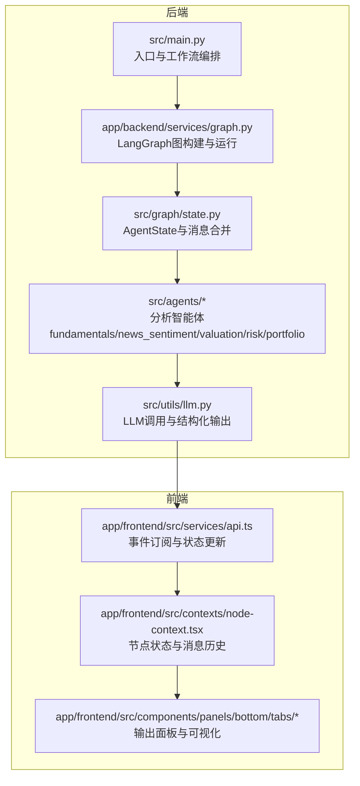
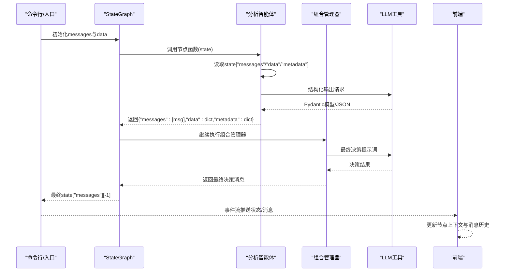
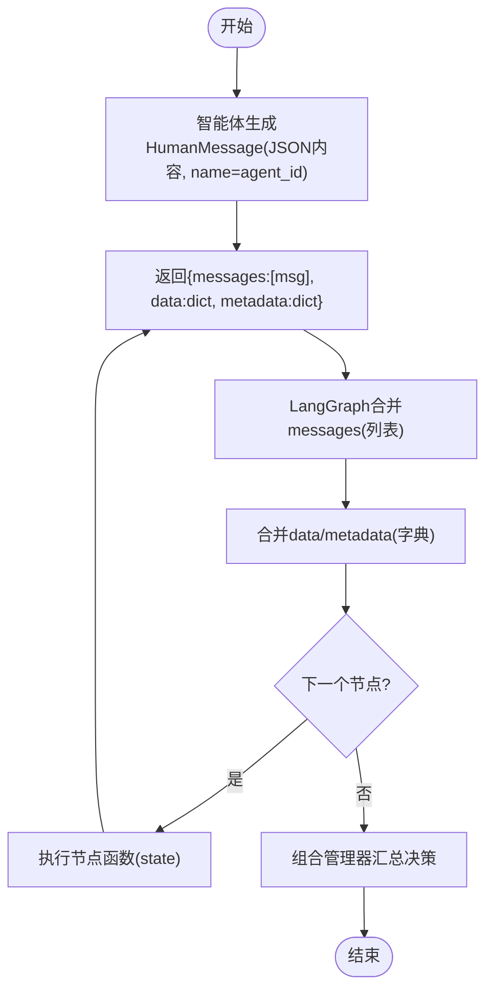
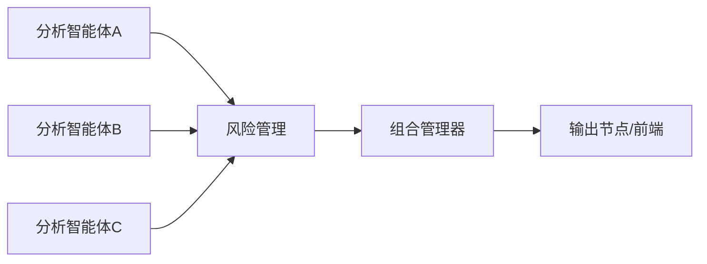
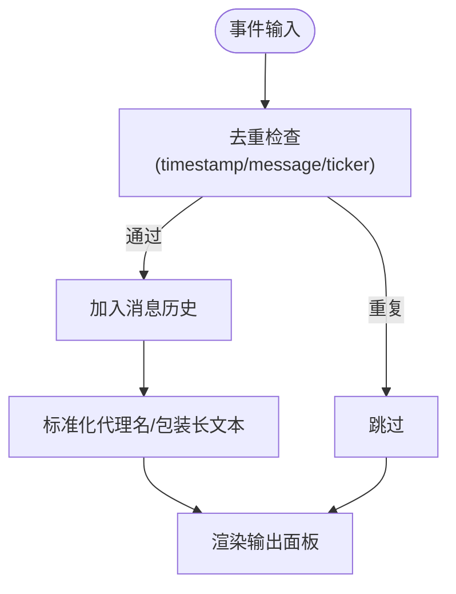
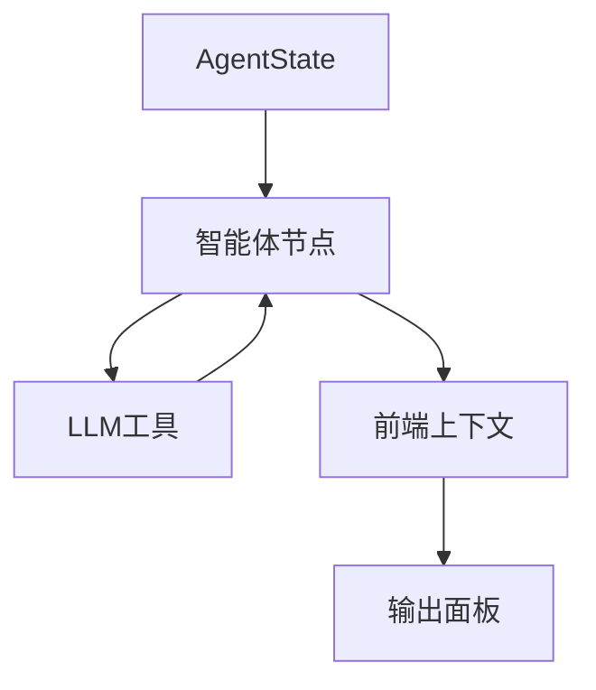

# 消息传递系统

<cite>
**本文档引用的文件**
- [app/backend/services/graph.py](file://app/backend/services/graph.py)
- [src/graph/state.py](file://src/graph/state.py)
- [src/agents/fundamentals.py](file://src/agents/fundamentals.py)
- [src/agents/news_sentiment.py](file://src/agents/news_sentiment.py)
- [src/agents/valuation.py](file://src/agents/valuation.py)
- [src/agents/risk_manager.py](file://src/agents/risk_manager.py)
- [src/agents/portfolio_manager.py](file://src/agents/portfolio_manager.py)
- [src/main.py](file://src/main.py)
- [src/utils/llm.py](file://src/utils/llm.py)
- [src/utils/display.py](file://src/utils/display.py)
- [app/frontend/src/contexts/node-context.tsx](file://app/frontend/src/contexts/node-context.tsx)
- [app/frontend/src/components/panels/bottom/tabs/output-tab-utils.ts](file://app/frontend/src/components/panels/bottom/tabs/output-tab-utils.ts)
- [app/frontend/src/components/panels/bottom/tabs/regular-output.tsx](file://app/frontend/src/components/panels/bottom/tabs/regular-output.tsx)
- [app/frontend/src/services/api.ts](file://app/frontend/src/services/api.ts)
- [app/frontend/src/hooks/use-node-state.ts](file://app/frontend/src/hooks/use-node-state.ts)
</cite>

## 目录
1. [简介](#简介)
2. [项目结构](#项目结构)
3. [核心组件](#核心组件)
4. [架构总览](#架构总览)
5. [详细组件分析](#详细组件分析)
6. [依赖关系分析](#依赖关系分析)
7. [性能考虑](#性能考虑)
8. [故障排除指南](#故障排除指南)
9. [结论](#结论)
10. [附录](#附录)

## 简介
本文件面向开发者，系统性阐述该AI对冲基金项目中的消息传递系统。基于LangChain的BaseMessage与StateGraph，系统通过“消息”在智能体节点间传递状态与分析结果，形成从数据采集、多维度分析到风险控制与最终交易决策的完整流水线。文档覆盖消息类型与基础架构、消息创建与传递流程、消息合并与冲突解决、路由与转发策略、序列化与反序列化、中间件式的消息过滤与转换、生命周期管理与内存优化，以及如何扩展自定义消息类型与处理能力。

## 项目结构
消息传递系统主要由后端Python服务与前端React展示两部分组成：
- 后端：使用LangGraph构建有向无环图（DAG）工作流，各分析智能体以消息形式交换数据；状态通过AgentState维护，其中messages字段采用operator.add进行合并。
- 前端：接收后端事件流，将状态更新映射到节点上下文，渲染进度、分析结果与交易决策，并支持消息历史去重与排序。

图表来源
- [src/main.py:46-93](file://src/main.py#L46-L93)
- [app/backend/services/graph.py:36-129](file://app/backend/services/graph.py#L36-L129)
- [src/graph/state.py:15-18](file://src/graph/state.py#L15-L18)
- [src/agents/fundamentals.py:145-164](file://src/agents/fundamentals.py#L145-L164)
- [src/utils/llm.py:10-84](file://src/utils/llm.py#L10-L84)
- [app/frontend/src/services/api.ts:178-202](file://app/frontend/src/services/api.ts#L178-L202)
- [app/frontend/src/contexts/node-context.tsx:117-163](file://app/frontend/src/contexts/node-context.tsx#L117-L163)

章节来源
- [src/main.py:46-130](file://src/main.py#L46-L130)
- [app/backend/services/graph.py:36-129](file://app/backend/services/graph.py#L36-L129)
- [src/graph/state.py:15-18](file://src/graph/state.py#L15-L18)

## 核心组件
- LangChain BaseMessage与StateGraph
  - 使用HumanMessage作为消息载体，内容为JSON字符串，携带agent标识与分析结果。
  - AgentState定义messages（序列）、data（字典）与metadata（字典），messages通过operator.add进行列表级合并，data与metadata通过merge_dicts进行字典级合并。
- 智能体消息生成
  - 各分析智能体（基本面、新闻情绪、估值、风险、组合管理）在完成分析后，构造HumanMessage并返回给工作流。
- 工作流执行
  - 后端通过graph.invoke传入初始messages与data，随后按边顺序执行节点函数，每个节点返回新的messages/data/metadata，最终由组合管理器汇总并输出交易决策。

章节来源
- [src/graph/state.py:10-18](file://src/graph/state.py#L10-L18)
- [src/agents/fundamentals.py:145-164](file://src/agents/fundamentals.py#L145-L164)
- [src/agents/news_sentiment.py:147-164](file://src/agents/news_sentiment.py#L147-L164)
- [src/agents/valuation.py:210-221](file://src/agents/valuation.py#L210-L221)
- [src/agents/risk_manager.py:205-219](file://src/agents/risk_manager.py#L205-L219)
- [src/agents/portfolio_manager.py:79-93](file://src/agents/portfolio_manager.py#L79-L93)
- [app/backend/services/graph.py:156-177](file://app/backend/services/graph.py#L156-L177)

## 架构总览
消息在系统中的流转路径如下：
- 初始化：后端创建初始HumanMessage并传入StateGraph。
- 执行阶段：各智能体节点读取StateGraph中的messages/data/metadata，生成新消息并返回，LangGraph自动合并messages（列表拼接）与data/metadata（字典合并）。
- 决策阶段：组合管理器汇总所有分析师信号与风险限制，生成交易决策消息。
- 前端接收：通过事件流推送节点状态与消息，前端上下文维护消息历史并去重显示。

图表来源
- [src/main.py:64-84](file://src/main.py#L64-L84)
- [app/backend/services/graph.py:156-177](file://app/backend/services/graph.py#L156-L177)
- [src/agents/portfolio_manager.py:25-93](file://src/agents/portfolio_manager.py#L25-L93)
- [src/utils/llm.py:10-84](file://src/utils/llm.py#L10-L84)
- [app/frontend/src/services/api.ts:178-202](file://app/frontend/src/services/api.ts#L178-L202)

## 详细组件分析

### 消息类型与基础架构
- 消息类型
  - 使用HumanMessage作为统一消息载体，content为JSON字符串，name字段标识发送者（agent_id）。
  - messages字段为BaseMessage序列，采用operator.add进行合并，确保消息有序累积。
  - data与metadata为字典，采用merge_dicts进行浅合并，便于跨节点共享配置与状态。
- 数据结构复杂度
  - messages合并为O(n)附加操作，n为新增消息数量。
  - 字典合并为O(m)附加操作，m为键值对数量。
- 错误处理
  - 解析JSON响应时包含异常捕获与降级逻辑，避免因单点错误导致整体失败。

章节来源
- [src/graph/state.py:15-18](file://src/graph/state.py#L15-L18)
- [src/graph/state.py:10-11](file://src/graph/state.py#L10-L11)
- [src/main.py:30-42](file://src/main.py#L30-L42)

### 消息创建、传递与处理流程
- 创建
  - 各智能体在完成分析后，将分析结果序列化为JSON并封装为HumanMessage，设置name为agent_id。
- 传递
  - StateGraph在invoke过程中自动将上一节点返回的messages/data/metadata合并到下一节点state中。
- 处理
  - 组合管理器在收到风险限制与分析师信号后，调用LLM生成最终决策，再以HumanMessage形式返回。

图表来源
- [src/agents/fundamentals.py:145-164](file://src/agents/fundamentals.py#L145-L164)
- [src/agents/news_sentiment.py:147-164](file://src/agents/news_sentiment.py#L147-L164)
- [src/agents/valuation.py:210-221](file://src/agents/valuation.py#L210-L221)
- [src/agents/risk_manager.py:205-219](file://src/agents/risk_manager.py#L205-L219)
- [src/agents/portfolio_manager.py:79-93](file://src/agents/portfolio_manager.py#L79-L93)

### 消息合并算法与冲突解决机制
- 合并策略
  - messages：operator.add实现列表级拼接，保持消息顺序与完整性。
  - data：merge_dicts浅合并，后写入覆盖同名键，适用于增量更新。
  - metadata：merge_dicts浅合并，全局配置可被节点特定配置覆盖。
- 冲突解决
  - 当存在同名键时，后写入的节点返回值优先，形成“就近覆盖”的行为。
  - 对于消息顺序，通过列表拼接保证先后关系不丢失。
- 实践建议
  - 在节点返回值中尽量使用明确的键空间，避免无意覆盖。

章节来源
- [src/graph/state.py:10-18](file://src/graph/state.py#L10-L18)

### 消息路由与转发策略
- 后端路由
  - 通过StateGraph的add_edge建立节点间的有向连接，消息沿边顺序传递。
  - 风险管理与组合管理作为汇聚节点，分别接收来自多个分析智能体的结果。
- 前端路由
  - 事件流根据agent_id与唯一节点ID映射到对应节点上下文，更新状态与消息历史。
  - 输出面板按代理类型优先级与时间戳排序展示消息。

图表来源
- [app/backend/services/graph.py:88-125](file://app/backend/services/graph.py#L88-L125)
- [src/main.py:100-130](file://src/main.py#L100-L130)
- [app/frontend/src/services/api.ts:178-202](file://app/frontend/src/services/api.ts#L178-L202)

### 序列化与反序列化实现细节
- 序列化
  - 智能体将分析结果与决策以JSON字符串形式写入HumanMessage.content。
  - 前端接收事件时解析JSON并更新节点状态。
- 反序列化
  - 后端在最终阶段解析组合管理器输出的JSON字符串，提取交易决策。
  - 包含健壮的JSON解码异常处理与类型检查，防止崩溃。
- 结构化输出
  - LLM调用通过with_structured_output或手动提取JSON，确保输出格式一致性。

章节来源
- [src/agents/fundamentals.py:145-164](file://src/agents/fundamentals.py#L145-L164)
- [src/agents/news_sentiment.py:147-164](file://src/agents/news_sentiment.py#L147-L164)
- [src/agents/valuation.py:210-221](file://src/agents/valuation.py#L210-L221)
- [src/agents/risk_manager.py:205-219](file://src/agents/risk_manager.py#L205-L219)
- [src/agents/portfolio_manager.py:79-93](file://src/agents/portfolio_manager.py#L79-L93)
- [src/main.py:86-89](file://src/main.py#L86-L89)
- [src/utils/llm.py:51-84](file://src/utils/llm.py#L51-L84)
- [app/frontend/src/services/api.ts:178-202](file://app/frontend/src/services/api.ts#L178-L202)

### 中间件机制：消息过滤与转换
- 过滤
  - 前端节点上下文在添加消息前进行去重检查，避免重复消息进入历史。
  - 输出面板对风险管理和组合管理等特殊代理进行排序与优先级调整。
- 转换
  - 将原始JSON字符串转换为结构化对象，便于前端渲染与分析。
  - 将代理名称标准化（去除后缀、空格替换、标题化）以提升可读性。
- 事件驱动
  - 通过事件流推送状态变化，前端监听并即时更新UI。

图表来源
- [app/frontend/src/contexts/node-context.tsx:123-149](file://app/frontend/src/contexts/node-context.tsx#L123-L149)
- [app/frontend/src/components/panels/bottom/tabs/output-tab-utils.ts:14-30](file://app/frontend/src/components/panels/bottom/tabs/output-tab-utils.ts#L14-L30)
- [app/frontend/src/components/panels/bottom/tabs/regular-output.tsx:10-30](file://app/frontend/src/components/panels/bottom/tabs/regular-output.tsx#L10-L30)

### 生命周期管理与内存优化策略
- 生命周期
  - 节点状态包含状态、消息历史、最后更新时间等字段，支持按流程清理。
  - 前端提供按流程清理与全量清理接口，避免状态泄漏。
- 内存优化
  - 后端事件流中对回测结果数组仅保留最近50条，避免内存膨胀。
  - 前端消息历史去重，减少重复渲染与存储开销。
  - 通过分页与节流策略控制UI更新频率。

章节来源
- [app/frontend/src/hooks/use-node-state.ts:69-112](file://app/frontend/src/hooks/use-node-state.ts#L69-L112)
- [app/frontend/src/services/backtest-api.ts:134-140](file://app/frontend/src/services/backtest-api.ts#L134-L140)
- [app/frontend/src/contexts/node-context.tsx:123-149](file://app/frontend/src/contexts/node-context.tsx#L123-L149)

### 自定义消息类型与扩展指导
- 自定义消息类型
  - 可在智能体中创建自定义消息类（继承BaseMessage），并在返回值中将其加入messages列表。
  - 保持content为可序列化结构（如JSON兼容字典），name字段用于标识来源。
- 扩展处理能力
  - 新增智能体节点：在工作流中注册节点函数，并通过add_edge建立连接。
  - 修改合并策略：如需不同合并语义，可在AgentState中扩展merge_dicts或引入自定义合并器。
  - 增强前端展示：在输出面板中增加新的表格或图表组件，映射新消息字段。

章节来源
- [src/graph/state.py:15-18](file://src/graph/state.py#L15-L18)
- [src/main.py:100-130](file://src/main.py#L100-L130)
- [app/backend/services/graph.py:36-129](file://app/backend/services/graph.py#L36-L129)

## 依赖关系分析
- 组件耦合
  - 智能体依赖AgentState结构，通过messages/data/metadata进行通信。
  - LLM工具依赖模型配置与API密钥，支持结构化输出与重试。
  - 前端依赖后端事件流，将状态映射到节点上下文。
- 外部依赖
  - LangChain Core（BaseMessage、StateGraph）、Pydantic（结构化输出）、Pandas/Numpy（数据分析）。
- 循环依赖
  - 未发现直接循环导入；工作流通过显式边连接避免逻辑循环。

图表来源
- [src/graph/state.py:15-18](file://src/graph/state.py#L15-L18)
- [src/utils/llm.py:10-84](file://src/utils/llm.py#L10-L84)
- [app/frontend/src/contexts/node-context.tsx:117-163](file://app/frontend/src/contexts/node-context.tsx#L117-L163)

章节来源
- [src/graph/state.py:15-18](file://src/graph/state.py#L15-L18)
- [src/utils/llm.py:10-84](file://src/utils/llm.py#L10-L84)

## 性能考虑
- 消息合并成本低：列表拼接与字典浅合并均为线性复杂度，适合高频消息场景。
- LLM调用优化：通过结构化输出与重试机制降低失败率，避免重复计算。
- 前端渲染优化：消息历史去重与事件节流，减少不必要的重绘。
- 数据分析优化：对价格序列与统计指标进行缓存与批量处理，缩短响应时间。

## 故障排除指南
- JSON解析错误
  - 现象：后端或前端解析JSON失败。
  - 排查：检查content是否为有效JSON字符串，确认编码与字符集。
  - 处理：在解析函数中捕获异常并记录原始响应，必要时降级为空对象。
- LLM调用失败
  - 现象：结构化输出失败或非JSON支持模型返回Markdown包裹的JSON。
  - 排查：确认模型信息与JSON模式支持，检查提示词格式。
  - 处理：启用重试与默认工厂，确保系统可用性。
- 前端消息重复
  - 现象：消息历史出现重复项。
  - 排查：检查去重条件（timestamp/message/ticker）是否一致。
  - 处理：增强去重逻辑，确保唯一性判断准确。

章节来源
- [src/main.py:30-42](file://src/main.py#L30-L42)
- [src/utils/llm.py:72-84](file://src/utils/llm.py#L72-L84)
- [app/frontend/src/contexts/node-context.tsx:123-149](file://app/frontend/src/contexts/node-context.tsx#L123-L149)

## 结论
该消息传递系统以LangGraph为核心，结合HumanMessage与AgentState，实现了从多源数据到最终交易决策的高效流转。通过明确的合并策略、路由规则与前端事件驱动机制，系统在保证可扩展性的同时兼顾了性能与稳定性。开发者可在此基础上灵活扩展消息类型与处理逻辑，进一步提升分析深度与决策质量。

## 附录
- 关键实现路径参考
  - 消息合并：[src/graph/state.py:10-18](file://src/graph/state.py#L10-L18)
  - 智能体消息生成：[src/agents/fundamentals.py:145-164](file://src/agents/fundamentals.py#L145-L164)、[src/agents/news_sentiment.py:147-164](file://src/agents/news_sentiment.py#L147-L164)、[src/agents/valuation.py:210-221](file://src/agents/valuation.py#L210-L221)、[src/agents/risk_manager.py:205-219](file://src/agents/risk_manager.py#L205-L219)、[src/agents/portfolio_manager.py:79-93](file://src/agents/portfolio_manager.py#L79-L93)
  - 工作流执行：[app/backend/services/graph.py:156-177](file://app/backend/services/graph.py#L156-L177)、[src/main.py:64-84](file://src/main.py#L64-L84)
  - LLM结构化输出：[src/utils/llm.py:51-84](file://src/utils/llm.py#L51-L84)
  - 前端消息去重与渲染：[app/frontend/src/contexts/node-context.tsx:123-149](file://app/frontend/src/contexts/node-context.tsx#L123-L149)、[app/frontend/src/components/panels/bottom/tabs/regular-output.tsx:10-30](file://app/frontend/src/components/panels/bottom/tabs/regular-output.tsx#L10-L30)