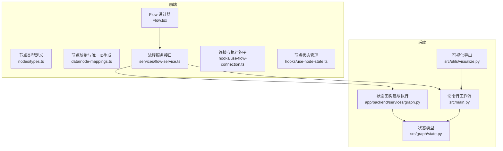
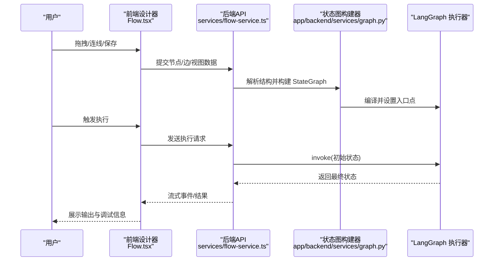
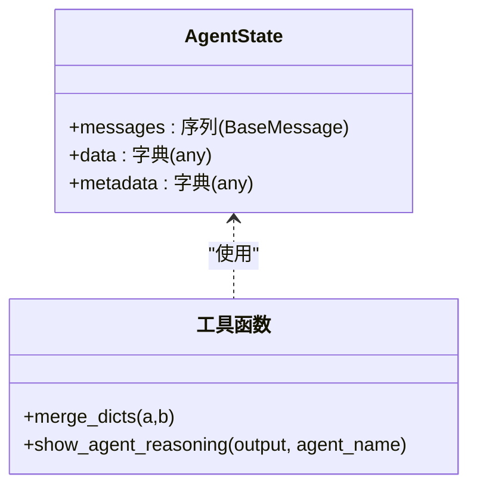
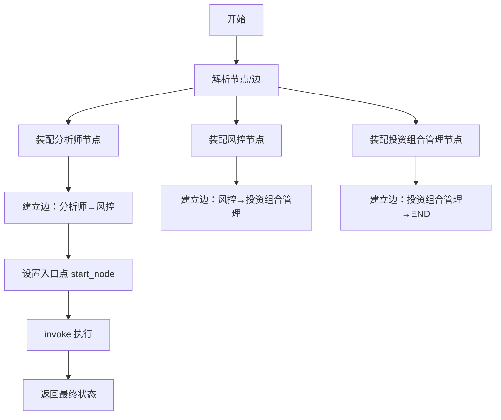
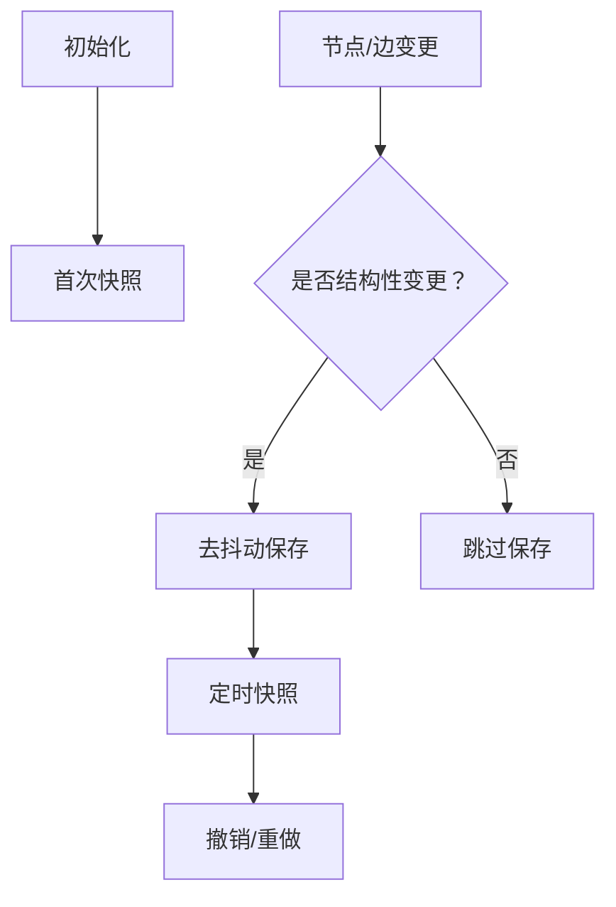
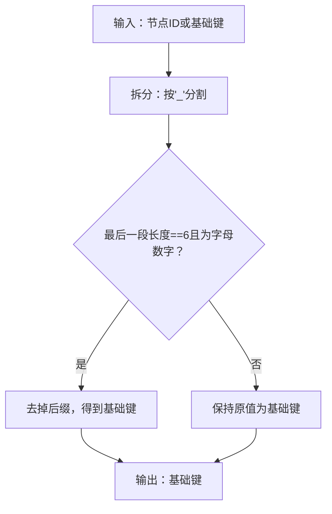
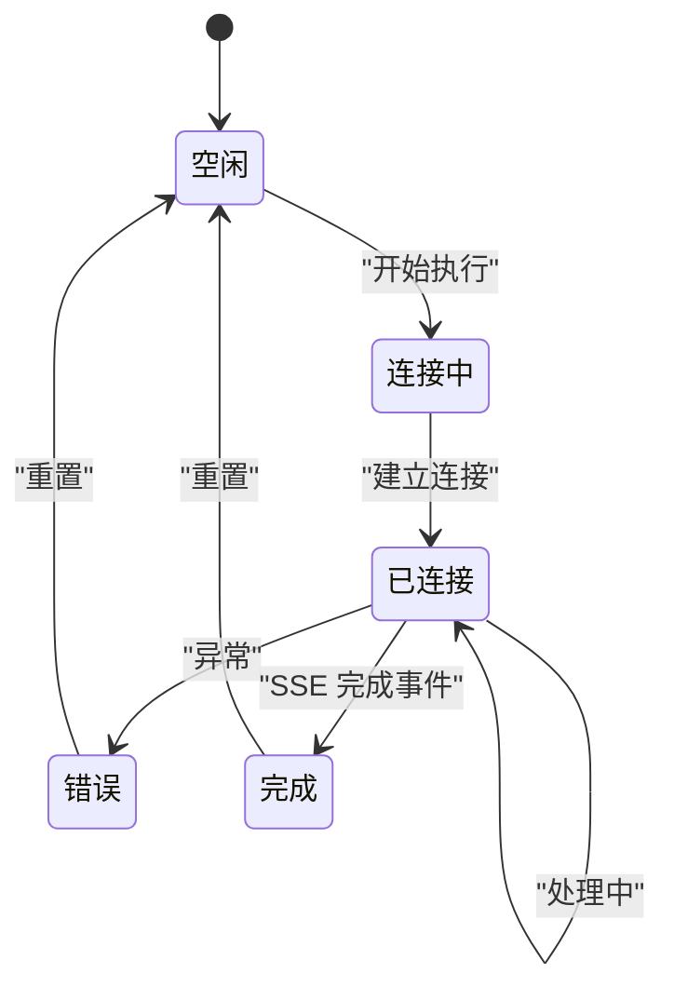
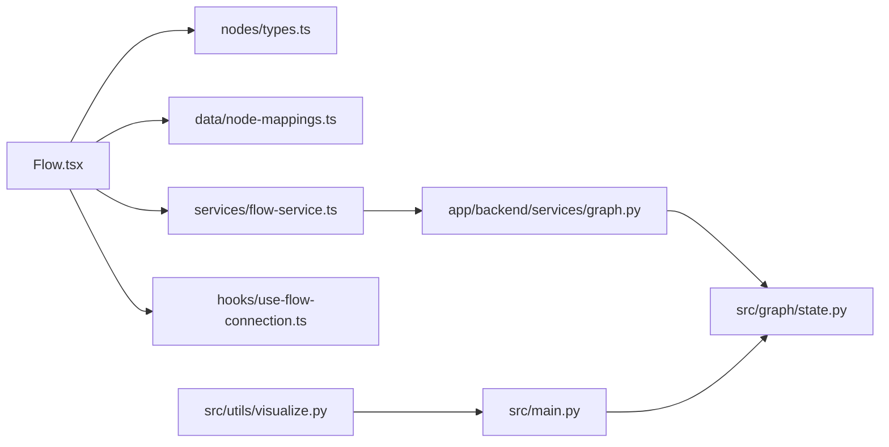

# 状态图设计

<cite>
**本文引用的文件**
- [src/graph/state.py](file://src/graph/state.py)
- [app/backend/services/graph.py](file://app/backend/services/graph.py)
- [src/main.py](file://src/main.py)
- [app/frontend/src/components/Flow.tsx](file://app/frontend/src/components/Flow.tsx)
- [app/frontend/src/nodes/types.ts](file://app/frontend/src/nodes/types.ts)
- [app/frontend/src/data/node-mappings.ts](file://app/frontend/src/data/node-mappings.ts)
- [app/frontend/src/hooks/use-flow-connection.ts](file://app/frontend/src/hooks/use-flow-connection.ts)
- [app/frontend/src/services/flow-service.ts](file://app/frontend/src/services/flow-service.ts)
- [app/frontend/src/hooks/use-node-state.ts](file://app/frontend/src/hooks/use-node-state.ts)
- [app/frontend/src/nodes/utils.ts](file://app/frontend/src/nodes/utils.ts)
- [src/utils/visualize.py](file://src/utils/visualize.py)
</cite>

## 目录
1. [引言](#引言)
2. [项目结构](#项目结构)
3. [核心组件](#核心组件)
4. [架构总览](#架构总览)
5. [详细组件分析](#详细组件分析)
6. [依赖分析](#依赖分析)
7. [性能考虑](#性能考虑)
8. [故障排查指南](#故障排查指南)
9. [结论](#结论)
10. [附录](#附录)

## 引言
本文件面向“工作流状态图设计”的技术文档，系统性阐述基于 LangGraph 的状态图架构与设计理念，覆盖节点定义、边连接与状态转换规则、条件判断与分支处理、验证与约束检查、设计器与可视化工具、调试与性能分析、持久化与版本管理，以及扩展节点类型与自定义状态图的开发指导。目标是帮助开发者快速理解并高效构建可维护、可观测、可扩展的状态图系统。

## 项目结构
本项目采用前后端分离架构：前端负责状态图设计器与交互（React + XYFlow）、后端负责状态图编译执行与运行时控制（Python + LangGraph）。状态图数据以“节点+边”的结构在前端进行编辑与持久化，后端根据该结构动态构建 StateGraph 并执行推理与交易决策。

图表来源
- [app/frontend/src/components/Flow.tsx:1-313](file://app/frontend/src/components/Flow.tsx#L1-L313)
- [app/frontend/src/nodes/types.ts:1-13](file://app/frontend/src/nodes/types.ts#L1-L13)
- [app/frontend/src/data/node-mappings.ts:1-140](file://app/frontend/src/data/node-mappings.ts#L1-L140)
- [app/frontend/src/services/flow-service.ts:1-108](file://app/frontend/src/services/flow-service.ts#L1-L108)
- [app/frontend/src/hooks/use-flow-connection.ts:1-268](file://app/frontend/src/hooks/use-flow-connection.ts#L1-L268)
- [app/frontend/src/hooks/use-node-state.ts:1-226](file://app/frontend/src/hooks/use-node-state.ts#L1-L226)
- [src/graph/state.py:1-52](file://src/graph/state.py#L1-L52)
- [app/backend/services/graph.py:1-193](file://app/backend/services/graph.py#L1-L193)
- [src/main.py:1-180](file://src/main.py#L1-L180)
- [src/utils/visualize.py:1-9](file://src/utils/visualize.py#L1-L9)

章节来源
- [app/frontend/src/components/Flow.tsx:1-313](file://app/frontend/src/components/Flow.tsx#L1-L313)
- [app/frontend/src/nodes/types.ts:1-13](file://app/frontend/src/nodes/types.ts#L1-L13)
- [app/frontend/src/data/node-mappings.ts:1-140](file://app/frontend/src/data/node-mappings.ts#L1-L140)
- [app/frontend/src/services/flow-service.ts:1-108](file://app/frontend/src/services/flow-service.ts#L1-L108)
- [app/frontend/src/hooks/use-flow-connection.ts:1-268](file://app/frontend/src/hooks/use-flow-connection.ts#L1-L268)
- [app/frontend/src/hooks/use-node-state.ts:1-226](file://app/frontend/src/hooks/use-node-state.ts#L1-L226)
- [src/graph/state.py:1-52](file://src/graph/state.py#L1-L52)
- [app/backend/services/graph.py:1-193](file://app/backend/services/graph.py#L1-L193)
- [src/main.py:1-180](file://src/main.py#L1-L180)
- [src/utils/visualize.py:1-9](file://src/utils/visualize.py#L1-L9)

## 核心组件
- 状态模型（AgentState）
  - 定义消息序列、数据字典与元数据字典，并通过注解实现合并语义，确保状态在节点间传递时具备可组合性与一致性。
- 状态图构建器（create_graph）
  - 将前端传入的节点与边结构解析为 LangGraph 的 StateGraph，自动注入起始节点、分析师节点、风控节点与投资组合管理节点，建立从“分析师→风控→投资组合管理→结束”的主干路径。
- 命令行工作流（create_workflow/run_hedge_fund）
  - 提供默认工作流模板，便于本地调试与演示；支持选择分析师集合、设置模型名称与提供商等参数。
- 前端状态图设计器（Flow.tsx）
  - 基于 XYFlow 实现节点拖拽、连线、撤销重做、自动保存与快照；提供主题适配与背景网格。
- 节点类型与映射（nodes/types.ts、data/node-mappings.ts）
  - 定义节点类型别名与创建工厂，生成带唯一后缀的节点ID，保证多实例并存时的隔离性。
- 连接与执行（hooks/use-flow-connection.ts）
  - 维护每个流程的连接状态机（空闲/连接中/已连接/错误/完成），封装启动/停止/恢复流程的生命周期管理。
- 可视化导出（src/utils/visualize.py）
  - 将编译后的图结构导出为 PNG，便于审计与分享。

章节来源
- [src/graph/state.py:14-19](file://src/graph/state.py#L14-L19)
- [app/backend/services/graph.py:36-129](file://app/backend/services/graph.py#L36-L129)
- [src/main.py:100-130](file://src/main.py#L100-L130)
- [app/frontend/src/components/Flow.tsx:232-313](file://app/frontend/src/components/Flow.tsx#L232-L313)
- [app/frontend/src/nodes/types.ts:6-12](file://app/frontend/src/nodes/types.ts#L6-L12)
- [app/frontend/src/data/node-mappings.ts:28-40](file://app/frontend/src/data/node-mappings.ts#L28-L40)
- [app/frontend/src/hooks/use-flow-connection.ts:19-73](file://app/frontend/src/hooks/use-flow-connection.ts#L19-L73)
- [src/utils/visualize.py:5-9](file://src/utils/visualize.py#L5-L9)

## 架构总览
LangGraph 作为核心引擎，将“节点函数”与“状态模型”耦合，形成可编译、可观测、可回放的执行图。后端根据前端提交的节点/边结构动态装配 StateGraph，前端负责可视化与交互，二者通过 REST 接口协同。

图表来源
- [app/frontend/src/components/Flow.tsx:239-278](file://app/frontend/src/components/Flow.tsx#L239-L278)
- [app/frontend/src/services/flow-service.ts:27-108](file://app/frontend/src/services/flow-service.ts#L27-L108)
- [app/backend/services/graph.py:36-129](file://app/backend/services/graph.py#L36-L129)
- [src/main.py:141-179](file://src/main.py#L141-L179)

## 详细组件分析

### 状态模型与数据结构
- AgentState
  - 字段：消息序列、数据字典、元数据字典
  - 合并策略：通过注解实现增量合并，避免覆盖已有状态
- 调试输出
  - 提供统一的“展示推理”工具，将复杂对象序列化为可读格式，便于调试

图表来源
- [src/graph/state.py:14-19](file://src/graph/state.py#L14-L19)
- [src/graph/state.py:10-11](file://src/graph/state.py#L10-L11)
- [src/graph/state.py:21-51](file://src/graph/state.py#L21-L51)

章节来源
- [src/graph/state.py:14-19](file://src/graph/state.py#L14-L19)
- [src/graph/state.py:10-11](file://src/graph/state.py#L10-L11)
- [src/graph/state.py:21-51](file://src/graph/state.py#L21-L51)

### 状态图构建与执行（后端）
- 节点装配
  - 起始节点固定为“start_node”
  - 分析师节点：从配置中提取基础键，结合唯一ID后缀生成多个实例
  - 投资组合管理节点：按需为每个组合管理器生成对应的风控节点
- 边连接
  - 仅在“代理节点”之间建立边，避免与外部输入（如股票）混连
  - 分析师→风控→投资组合管理→结束 的主干路径
  - 特殊路由：分析师直接连接到投资组合管理时，改走“分析师→风控→投资组合管理”
- 入口点与执行
  - 设置入口点为“start_node”，随后通过 invoke 传入初始状态（消息、数据、元数据）

图表来源
- [app/backend/services/graph.py:36-129](file://app/backend/services/graph.py#L36-L129)

章节来源
- [app/backend/services/graph.py:36-129](file://app/backend/services/graph.py#L36-L129)

### 前端状态图设计器（XYFlow 集成）
- 节点与边
  - 使用 XYFlow 的节点/边状态管理，支持拖拽、连线、删除
  - 自动为新边生成唯一ID并添加箭头标记
- 快照与历史
  - 初始化时记录快照；节点/边变化触发去抖动快照；支持撤销/重做
- 自动保存
  - 对结构性变更（新增/删除节点、删除边、位置变更完成）进行去抖动保存
- 主题与背景
  - 根据当前主题切换浅/深色背景与网格颜色

图表来源
- [app/frontend/src/components/Flow.tsx:57-195](file://app/frontend/src/components/Flow.tsx#L57-L195)
- [app/frontend/src/components/Flow.tsx:162-178](file://app/frontend/src/components/Flow.tsx#L162-L178)

章节来源
- [app/frontend/src/components/Flow.tsx:1-313](file://app/frontend/src/components/Flow.tsx#L1-L313)

### 节点类型与唯一ID策略
- 节点类型
  - 定义多种节点类型别名，用于区分不同功能节点（如“分析师节点”、“投资组合管理节点”等）
- 唯一ID生成
  - 为每个节点生成6字符随机后缀，去除后缀可还原基础键
  - 支持“基础键→节点ID→基础键”的双向解析，便于路由与匹配

图表来源
- [app/frontend/src/data/node-mappings.ts:28-40](file://app/frontend/src/data/node-mappings.ts#L28-L40)
- [app/frontend/src/nodes/types.ts:6-12](file://app/frontend/src/nodes/types.ts#L6-L12)

章节来源
- [app/frontend/src/data/node-mappings.ts:28-40](file://app/frontend/src/data/node-mappings.ts#L28-L40)
- [app/frontend/src/nodes/types.ts:6-12](file://app/frontend/src/nodes/types.ts#L6-L12)

### 连接与执行生命周期（状态机）
- 状态机
  - 空闲 → 连接中 → 已连接 → 错误/完成
  - 支持停止执行并清理节点状态
- 处理流程
  - 启动：重置节点状态，调用后端 API，接收 SSE 完成事件
  - 停止：调用取消控制器，仅重置节点状态，保留结果与消息
  - 恢复：检测长时间无活动的“陈旧”连接并恢复为空闲

图表来源
- [app/frontend/src/hooks/use-flow-connection.ts:19-73](file://app/frontend/src/hooks/use-flow-connection.ts#L19-L73)
- [app/frontend/src/hooks/use-flow-connection.ts:114-211](file://app/frontend/src/hooks/use-flow-connection.ts#L114-L211)

章节来源
- [app/frontend/src/hooks/use-flow-connection.ts:19-73](file://app/frontend/src/hooks/use-flow-connection.ts#L19-L73)
- [app/frontend/src/hooks/use-flow-connection.ts:114-211](file://app/frontend/src/hooks/use-flow-connection.ts#L114-L211)

### 可视化与调试
- Mermaid 导出
  - 将编译后的图结构导出为 PNG，便于审计与分享
- 调试输出
  - 在后端与 CLI 中提供统一的“展示推理”工具，将复杂对象序列化为 JSON 并美化打印

章节来源
- [src/utils/visualize.py:5-9](file://src/utils/visualize.py#L5-L9)
- [src/graph/state.py:21-51](file://src/graph/state.py#L21-L51)
- [src/main.py:24-42](file://src/main.py#L24-L42)

## 依赖分析
- 前端
  - Flow.tsx 依赖节点/边类型、连接钩子、服务接口与主题上下文
  - node-mappings.ts 依赖后端代理列表，动态生成节点定义
  - use-flow-connection.ts 依赖全局连接管理器与节点上下文
- 后端
  - graph.py 依赖状态模型、代理函数工厂与分析师配置
  - main.py 提供默认工作流模板，便于离线调试
- 可视化
  - visualize.py 依赖 LangGraph 的图绘制能力

图表来源
- [app/frontend/src/components/Flow.tsx:1-313](file://app/frontend/src/components/Flow.tsx#L1-L313)
- [app/frontend/src/nodes/types.ts:1-13](file://app/frontend/src/nodes/types.ts#L1-L13)
- [app/frontend/src/data/node-mappings.ts:1-140](file://app/frontend/src/data/node-mappings.ts#L1-L140)
- [app/frontend/src/services/flow-service.ts:1-108](file://app/frontend/src/services/flow-service.ts#L1-L108)
- [app/frontend/src/hooks/use-flow-connection.ts:1-268](file://app/frontend/src/hooks/use-flow-connection.ts#L1-L268)
- [app/backend/services/graph.py:1-193](file://app/backend/services/graph.py#L1-L193)
- [src/graph/state.py:1-52](file://src/graph/state.py#L1-L52)
- [src/main.py:1-180](file://src/main.py#L1-L180)
- [src/utils/visualize.py:1-9](file://src/utils/visualize.py#L1-L9)

章节来源
- [app/frontend/src/components/Flow.tsx:1-313](file://app/frontend/src/components/Flow.tsx#L1-L313)
- [app/frontend/src/nodes/types.ts:1-13](file://app/frontend/src/nodes/types.ts#L1-L13)
- [app/frontend/src/data/node-mappings.ts:1-140](file://app/frontend/src/data/node-mappings.ts#L1-L140)
- [app/frontend/src/services/flow-service.ts:1-108](file://app/frontend/src/services/flow-service.ts#L1-L108)
- [app/frontend/src/hooks/use-flow-connection.ts:1-268](file://app/frontend/src/hooks/use-flow-connection.ts#L1-L268)
- [app/backend/services/graph.py:1-193](file://app/backend/services/graph.py#L1-L193)
- [src/graph/state.py:1-52](file://src/graph/state.py#L1-L52)
- [src/main.py:1-180](file://src/main.py#L1-L180)
- [src/utils/visualize.py:1-9](file://src/utils/visualize.py#L1-L9)

## 性能考虑
- 前端
  - 自动保存与快照采用去抖动策略，降低频繁写入带来的压力
  - 仅在结构性变更时触发保存，避免冗余网络请求
- 后端
  - 使用异步包装器避免阻塞事件循环
  - 通过唯一ID后缀与基础键解析减少重复计算
- 可视化
  - 导出 PNG 为一次性操作，避免频繁调用

[本节为通用建议，不涉及具体文件分析]

## 故障排查指南
- 执行失败
  - 检查连接状态机是否停留在“错误”状态，查看错误信息并尝试恢复
  - 若长时间无活动，确认是否为“陈旧”状态并手动恢复为空闲
- 节点状态异常
  - 使用节点状态管理器重置节点状态，保留结果与消息
- 输出解析
  - 后端/CLI 提供 JSON 解析与类型校验，若解析失败，检查响应字符串格式与类型

章节来源
- [app/frontend/src/hooks/use-flow-connection.ts:186-232](file://app/frontend/src/hooks/use-flow-connection.ts#L186-L232)
- [app/frontend/src/hooks/use-node-state.ts:194-226](file://app/frontend/src/hooks/use-node-state.ts#L194-L226)
- [src/main.py:30-42](file://src/main.py#L30-L42)

## 结论
本状态图设计以 LangGraph 为核心，结合前端可视化设计器与后端动态编排，实现了从“图形化建模→结构解析→图编译→执行→可视化”的完整闭环。通过唯一ID策略、状态合并、去抖动保存与连接状态机，系统在可用性、可观测性与可维护性方面达到良好平衡。后续可在节点类型扩展、条件分支与并行执行等方面进一步增强。

[本节为总结，不涉及具体文件分析]

## 附录

### 状态图设计器使用指南
- 创建/编辑流程
  - 在左侧组件面板选择节点类型，拖拽至画布
  - 使用连线工具在节点间建立连接
- 执行与监控
  - 点击“执行”按钮，观察节点状态变化（空闲/处理中/完成/错误）
  - 使用撤销/重做快捷键（Ctrl/Cmd+Z，Ctrl/Cmd+Shift+Z）
- 保存与分享
  - 通过服务接口保存流程；必要时导出图结构 PNG

章节来源
- [app/frontend/src/components/Flow.tsx:239-278](file://app/frontend/src/components/Flow.tsx#L239-L278)
- [app/frontend/src/services/flow-service.ts:27-108](file://app/frontend/src/services/flow-service.ts#L27-L108)

### 状态图验证与约束检查
- 节点/边过滤
  - 仅在“代理节点”之间建立边，避免与外部输入混连
- 路由约束
  - 分析师→投资组合管理的直达连接将被重定向为“分析师→风控→投资组合管理”
- 唯一ID一致性
  - 基础键与唯一ID后缀解析一致，确保路由与匹配正确

章节来源
- [app/backend/services/graph.py:83-125](file://app/backend/services/graph.py#L83-L125)
- [app/frontend/src/data/node-mappings.ts:28-40](file://app/frontend/src/data/node-mappings.ts#L28-L40)

### 调试方法与性能分析工具
- 调试
  - 使用“展示推理”工具输出中间结果
  - 导出图结构 PNG 进行静态审计
- 性能
  - 前端：去抖动保存与快照
  - 后端：异步执行与唯一ID解析优化

章节来源
- [src/graph/state.py:21-51](file://src/graph/state.py#L21-L51)
- [src/utils/visualize.py:5-9](file://src/utils/visualize.py#L5-L9)
- [app/frontend/src/components/Flow.tsx:57-195](file://app/frontend/src/components/Flow.tsx#L57-L195)

### 持久化存储与版本管理策略
- 前端
  - 通过服务接口保存流程（节点/边/视图/数据），支持复制与重命名
- 版本管理
  - 建议在后端引入版本字段与差异比较，前端提供“快照/历史”对比
  - 当前实现已具备“快照/撤销/重做”能力，可作为轻量版本管理

章节来源
- [app/frontend/src/services/flow-service.ts:27-108](file://app/frontend/src/services/flow-service.ts#L27-L108)
- [app/frontend/src/components/Flow.tsx:162-178](file://app/frontend/src/components/Flow.tsx#L162-L178)

### 自定义状态图与扩展节点类型开发指导
- 新增节点类型
  - 在前端定义节点类型别名与创建工厂，生成唯一ID后缀
  - 在后端配置中注册对应的基础键与代理函数
- 自定义状态
  - 在 AgentState 中扩展字段，确保合并策略与默认值合理
- 条件分支与并行执行
  - 在后端构建器中增加条件判断逻辑与并行汇聚节点
- 可观测性
  - 为新节点提供状态更新与事件上报机制，便于前端可视化

章节来源
- [app/frontend/src/nodes/types.ts:6-12](file://app/frontend/src/nodes/types.ts#L6-L12)
- [app/frontend/src/data/node-mappings.ts:92-116](file://app/frontend/src/data/node-mappings.ts#L92-L116)
- [src/graph/state.py:14-19](file://src/graph/state.py#L14-L19)
- [app/backend/services/graph.py:36-129](file://app/backend/services/graph.py#L36-L129)