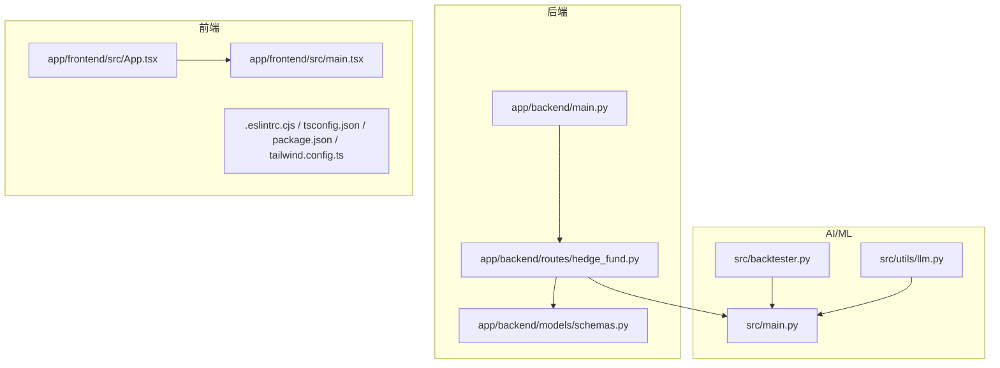
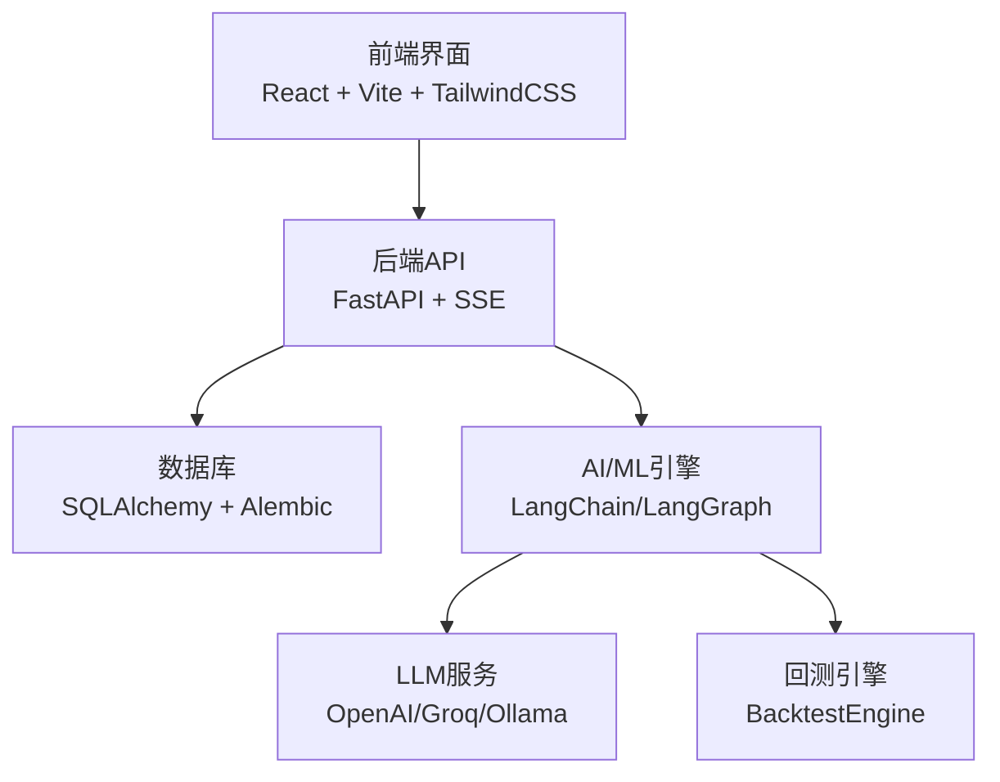
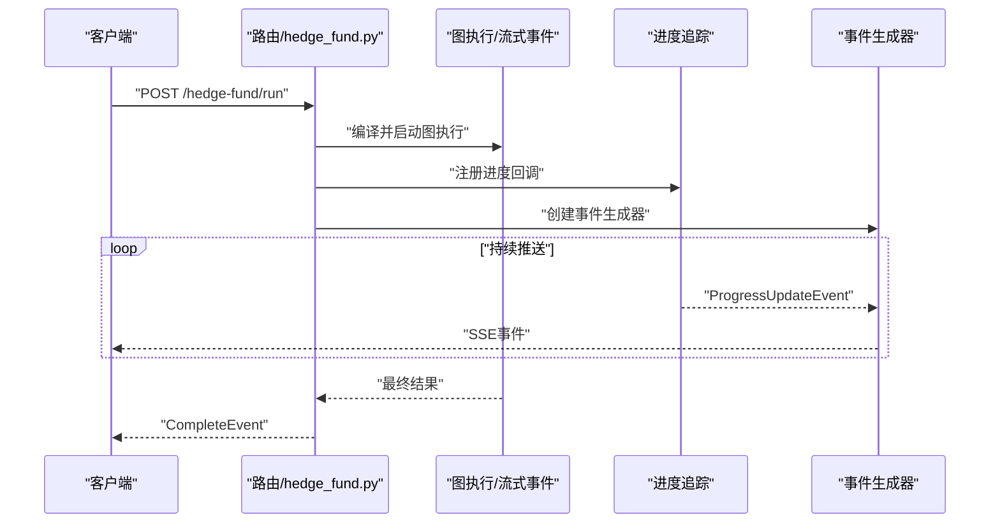
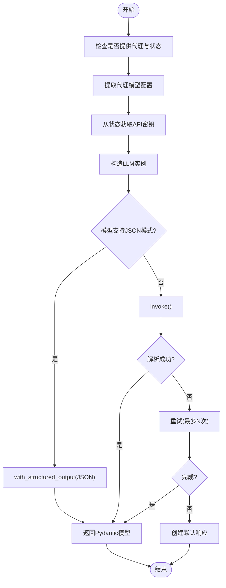
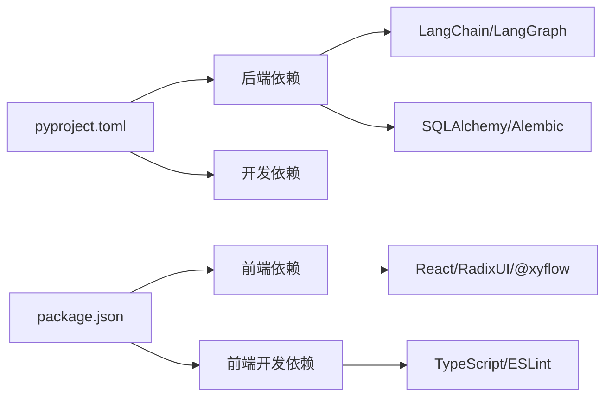

# 代码规范与最佳实践

<cite>
**本文引用的文件**
- [README.md](file://README.md)
- [app/backend/README.md](file://app/backend/README.md)
- [app/frontend/README.md](file://app/frontend/README.md)
- [pyproject.toml](file://pyproject.toml)
- [app/backend/main.py](file://app/backend/main.py)
- [app/backend/models/schemas.py](file://app/backend/models/schemas.py)
- [app/backend/routes/hedge_fund.py](file://app/backend/routes/hedge_fund.py)
- [src/main.py](file://src/main.py)
- [src/backtester.py](file://src/backtester.py)
- [src/utils/llm.py](file://src/utils/llm.py)
- [app/frontend/.eslintrc.cjs](file://app/frontend/.eslintrc.cjs)
- [app/frontend/tsconfig.json](file://app/frontend/tsconfig.json)
- [app/frontend/package.json](file://app/frontend/package.json)
- [app/frontend/tailwind.config.ts](file://app/frontend/tailwind.config.ts)
- [app/frontend/src/App.tsx](file://app/frontend/src/App.tsx)
- [app/frontend/src/main.tsx](file://app/frontend/src/main.tsx)
</cite>

## 目录
1. [引言](#引言)
2. [项目结构](#项目结构)
3. [核心组件](#核心组件)
4. [架构总览](#架构总览)
5. [详细组件分析](#详细组件分析)
6. [依赖关系分析](#依赖关系分析)
7. [性能考量](#性能考量)
8. [故障排查指南](#故障排查指南)
9. [结论](#结论)
10. [附录](#附录)

## 引言
本文件为“AI对冲基金”项目的代码规范与最佳实践文档，覆盖后端（Python/FastAPI）、前端（TypeScript/React/Vite）以及AI/ML相关代码的风格与约定。内容基于仓库中已有的配置与实现进行提炼与扩展，旨在帮助团队统一开发风格、提升可维护性与协作效率。

## 项目结构
项目采用前后端分离架构，后端为FastAPI应用，前端为React+Vite应用，同时提供命令行工具与可视化界面。整体目录结构清晰，按功能域划分模块，便于扩展与维护。

图表来源
- [app/backend/main.py:1-56](file://app/backend/main.py#L1-L56)
- [app/backend/routes/hedge_fund.py:1-353](file://app/backend/routes/hedge_fund.py#L1-L353)
- [app/backend/models/schemas.py:1-292](file://app/backend/models/schemas.py#L1-L292)
- [app/frontend/src/App.tsx:1-12](file://app/frontend/src/App.tsx#L1-L12)
- [app/frontend/src/main.tsx:1-19](file://app/frontend/src/main.tsx#L1-L19)
- [src/main.py:1-180](file://src/main.py#L1-L180)
- [src/backtester.py:1-67](file://src/backtester.py#L1-L67)
- [src/utils/llm.py:1-148](file://src/utils/llm.py#L1-L148)

章节来源
- [README.md:1-158](file://README.md#L1-L158)
- [app/backend/README.md:1-102](file://app/backend/README.md#L1-L102)
- [app/frontend/README.md:1-37](file://app/frontend/README.md#L1-L37)

## 核心组件
- 后端FastAPI应用：负责REST接口、CORS配置、数据库初始化与路由注册。
- 前端React应用：提供可视化界面，通过Vite构建，TailwindCSS样式，Radix UI组件。
- AI/ML引擎：命令行入口、回测引擎、LLM调用封装与重试逻辑。
- 数据模型：Pydantic模型定义请求/响应结构，含字段校验与默认值。

章节来源
- [app/backend/main.py:1-56](file://app/backend/main.py#L1-L56)
- [app/backend/routes/hedge_fund.py:1-353](file://app/backend/routes/hedge_fund.py#L1-L353)
- [app/backend/models/schemas.py:1-292](file://app/backend/models/schemas.py#L1-L292)
- [src/main.py:1-180](file://src/main.py#L1-L180)
- [src/backtester.py:1-67](file://src/backtester.py#L1-L67)
- [src/utils/llm.py:1-148](file://src/utils/llm.py#L1-L148)
- [app/frontend/src/App.tsx:1-12](file://app/frontend/src/App.tsx#L1-L12)
- [app/frontend/src/main.tsx:1-19](file://app/frontend/src/main.tsx#L1-L19)

## 架构总览
系统由前端Web界面、后端API服务与AI/ML执行引擎组成。前端通过HTTP与SSE与后端交互；后端以FastAPI提供REST与流式事件；AI/ML层负责图编排、LLM调用与回测。

图表来源
- [app/backend/main.py:1-56](file://app/backend/main.py#L1-L56)
- [app/backend/routes/hedge_fund.py:1-353](file://app/backend/routes/hedge_fund.py#L1-L353)
- [src/utils/llm.py:1-148](file://src/utils/llm.py#L1-L148)
- [src/backtester.py:1-67](file://src/backtester.py#L1-L67)

## 详细组件分析

### Python后端代码规范（PEP8与项目实践）
- 命名约定
  - 模块与包：使用小写与下划线，如routes、services、repositories。
  - 类名：采用PascalCase，如BaseModel派生类、服务类。
  - 函数与方法：采用snake_case，如run_graph_async、create_portfolio。
  - 常量：采用UPPER_CASE，如MODEL_PROVIDER枚举值。
  - 变量：采用snake_case，避免单字母变量除非在推导式或上下文明确时。
- 注释与文档
  - 使用行内注释解释复杂逻辑，函数/方法建议简要说明用途与参数。
  - Pydantic模型字段使用Field描述约束，如长度限制、可选性。
- 导入组织
  - 标准库优先，第三方库次之，项目内相对导入最后。
  - 使用相对导入保持模块间解耦，如from app.backend.routes import api_router。
- 错误处理
  - 明确捕获异常类型，对外抛出HTTPException，内部记录日志。
  - 流式接口中对客户端断开进行检测与任务取消。
- 并发与异步
  - 使用async def定义异步接口，结合asyncio.Queue与wait_for控制事件流。
- 配置与工具
  - 使用pyproject.toml集中管理依赖与格式化工具（black、isort）。
  - black配置允许长行，isort强制按字母序排序，保持一致性。

章节来源
- [app/backend/main.py:1-56](file://app/backend/main.py#L1-L56)
- [app/backend/routes/hedge_fund.py:1-353](file://app/backend/routes/hedge_fund.py#L1-L353)
- [app/backend/models/schemas.py:1-292](file://app/backend/models/schemas.py#L1-L292)
- [pyproject.toml:1-62](file://pyproject.toml#L1-L62)

### TypeScript/JavaScript前端代码规范（React/Vite/Tailwind）
- 命名约定
  - 组件文件：PascalCase.tsx，如TopBar、FlowTabContent。
  - Hook：useXxx命名，返回值语义明确，如useFlowManagement。
  - 工具函数：camelCase，如formatDate、debounce。
- Hook使用规范
  - 将副作用与状态逻辑抽离到自定义Hook，避免在组件中重复编写。
  - 在自定义Hook中明确输入输出，便于测试与复用。
- 状态管理约定
  - 全局状态通过Context Provider注入，如Theme、Node、Tabs等。
  - 组件内部状态尽量局部化，减少跨层级传递。
- 组件组织
  - 功能模块按目录拆分（layout、panels、settings、ui、hooks等），保持高内聚低耦合。
- 类型安全
  - tsconfig启用严格模式，禁止未使用变量与参数，避免switch漏掉分支。
  - 路径别名@/*指向src，简化导入路径。
- 样式与主题
  - Tailwind配置支持暗色模式与主题变量，颜色与尺寸通过设计令牌统一。
- ESLint规则
  - 推荐使用TypeScript插件、React Hooks插件，开启unused disable报告，确保无未使用禁用项。

章节来源
- [app/frontend/src/App.tsx:1-12](file://app/frontend/src/App.tsx#L1-L12)
- [app/frontend/src/main.tsx:1-19](file://app/frontend/src/main.tsx#L1-L19)
- [app/frontend/.eslintrc.cjs:1-19](file://app/frontend/.eslintrc.cjs#L1-L19)
- [app/frontend/tsconfig.json:1-40](file://app/frontend/tsconfig.json#L1-L40)
- [app/frontend/package.json:1-56](file://app/frontend/package.json#L1-L56)
- [app/frontend/tailwind.config.ts:1-144](file://app/frontend/tailwind.config.ts#L1-L144)

### AI/ML代码特殊规范（模型、数据处理、LLM集成）
- 模型文件命名
  - LLM模型配置文件采用小写与下划线，如ollama_models.json、api_models.json。
  - 模型选择与切换通过统一的get_model/get_model_info封装，避免硬编码。
- 数据处理函数规范
  - 输入参数先做类型与范围校验，必要时提供默认值。
  - 输出结果统一为Pydantic模型，便于序列化与接口契约。
- LLM集成代码风格
  - 统一的call_llm封装：支持结构化输出、重试机制、错误降级与进度上报。
  - 对不支持JSON模式的模型，从Markdown代码块中提取JSON。
  - 支持按代理动态选择模型与API密钥，优先使用请求中的代理特定配置。
- 回测流程
  - 回测引擎独立于CLI入口，便于单元测试与集成测试。
  - 对用户中断（Ctrl+C）提供友好提示与部分结果展示。

章节来源
- [src/utils/llm.py:1-148](file://src/utils/llm.py#L1-L148)
- [src/main.py:1-180](file://src/main.py#L1-L180)
- [src/backtester.py:1-67](file://src/backtester.py#L1-L67)

### Git提交信息规范、分支命名与代码审查清单
- 提交信息规范
  - 标题：动词开头，简洁描述变更（如“feat: 添加LLM模型配置”）。
  - 说明：解释动机与影响，必要时附带测试要点。
- 分支命名约定
  - feat/xxx：新功能
  - fix/xxx：缺陷修复
  - refactor/xxx：重构
  - docs/xxx：文档更新
  - chore/xxx：工具链或CI调整
- 代码审查清单
  - 是否满足需求与设计目标
  - 是否引入新的依赖或破坏向后兼容
  - 是否通过单元测试与集成测试
  - 是否有必要的注释与文档更新
  - 是否符合命名与风格规范
  - 是否存在敏感信息泄露（如API Key）

章节来源
- [README.md:141-158](file://README.md#L141-L158)

### 关键流程与交互图

#### 后端SSE流式响应序列

图表来源
- [app/backend/routes/hedge_fund.py:63-155](file://app/backend/routes/hedge_fund.py#L63-L155)

#### LLM调用与降级流程

图表来源
- [src/utils/llm.py:10-84](file://src/utils/llm.py#L10-L84)

## 依赖关系分析
- 后端依赖
  - FastAPI、SQLAlchemy、Alembic、Pydantic为核心运行时依赖。
  - 开发依赖包括pytest、black、isort、flake8，用于质量保障。
- 前端依赖
  - React、Radix UI、@xyflow/react、TailwindCSS生态。
  - ESLint与TypeScript插件保证类型与风格一致。
- AI/ML依赖
  - LangChain、LangGraph、Pydantic用于图编排与结构化输出。
  - 支持多模型提供商（OpenAI、Groq、Anthropic、DeepSeek、Google GenAI、xAI、GigaChat）。

图表来源
- [pyproject.toml:13-46](file://pyproject.toml#L13-L46)
- [app/frontend/package.json:11-54](file://app/frontend/package.json#L11-L54)

章节来源
- [pyproject.toml:1-62](file://pyproject.toml#L1-L62)
- [app/frontend/package.json:1-56](file://app/frontend/package.json#L1-L56)

## 性能考量
- 后端
  - SSE流式响应避免一次性大对象传输，降低内存峰值。
  - 客户端断连检测及时取消后台任务，释放资源。
- 前端
  - Tailwind按需扫描content，避免打包冗余样式。
  - 严格模式与未使用变量/参数检查，减少运行时开销。
- AI/ML
  - LLM调用重试与降级策略，提升鲁棒性。
  - 回测过程支持中断与部分结果展示，改善用户体验。

## 故障排查指南
- 后端
  - CORS跨域问题：确认allow_origins包含前端地址。
  - SSE断连：检查客户端disconnect消息处理与任务取消逻辑。
  - 数据库初始化：确保SQLAlchemy元数据创建在应用启动阶段执行。
- 前端
  - ESLint报错：根据规则修正未使用变量/参数或禁用项。
  - 主题与样式异常：检查Tailwind配置与暗色模式开关。
- AI/ML
  - LLM调用失败：查看重试日志与默认响应生成。
  - 回测中断：观察部分结果输出与收益统计。

章节来源
- [app/backend/main.py:20-27](file://app/backend/main.py#L20-L27)
- [app/backend/routes/hedge_fund.py:51-155](file://app/backend/routes/hedge_fund.py#L51-L155)
- [app/frontend/.eslintrc.cjs:12-17](file://app/frontend/.eslintrc.cjs#L12-L17)
- [app/frontend/tailwind.config.ts:5-10](file://app/frontend/tailwind.config.ts#L5-L10)
- [src/utils/llm.py:72-84](file://src/utils/llm.py#L72-L84)

## 结论
本规范文档总结了项目在Python后端、TypeScript前端与AI/ML领域的风格与最佳实践，并结合现有配置与实现给出落地建议。建议在后续迭代中持续完善测试覆盖率与文档，确保规范的有效执行与演进。

## 附录
- 示例对比（仅提供路径，不直接展示代码）
  - 正确：使用Pydantic模型进行字段校验与默认值设置，参考[schemas.py:61-92](file://app/backend/models/schemas.py#L61-L92)。
  - 错误：直接接受原始字典而不做校验，应避免。
  - 正确：SSE事件生成器中处理客户端断连并取消任务，参考[hedge_fund.py:51-155](file://app/backend/routes/hedge_fund.py#L51-L155)。
  - 错误：未处理断连导致资源泄漏，应避免。
  - 正确：LLM调用封装统一结构化输出与重试，参考[llm.py:10-84](file://src/utils/llm.py#L10-L84)。
  - 错误：直接拼接字符串作为JSON，应改为结构化输出或安全解析，参考[llm.py:109-121](file://src/utils/llm.py#L109-L121)。
  - 正确：React组件使用自定义Hook与Context Provider，参考[App.tsx:1-12](file://app/frontend/src/App.tsx#L1-L12)、[main.tsx:1-19](file://app/frontend/src/main.tsx#L1-L19)。
  - 错误：在组件中直接管理全局状态，应通过Provider注入。