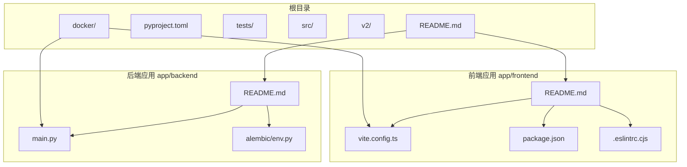
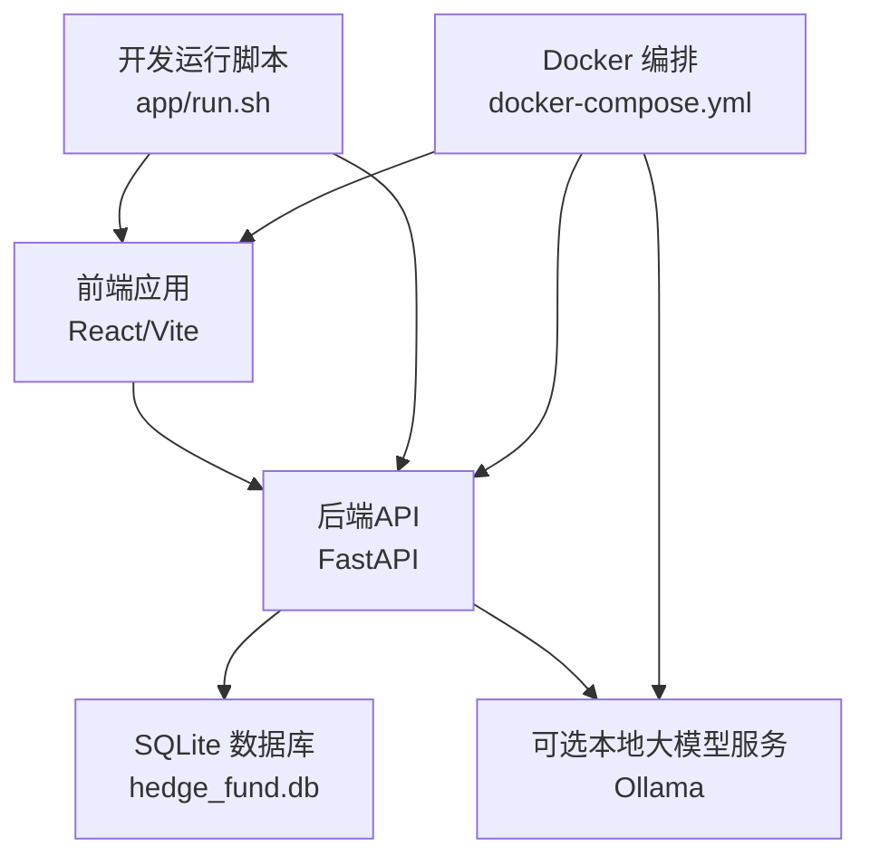
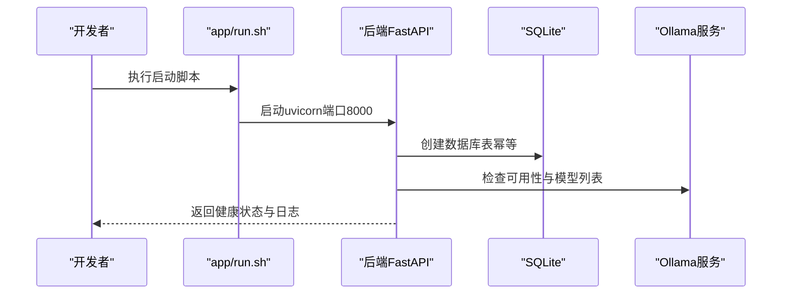
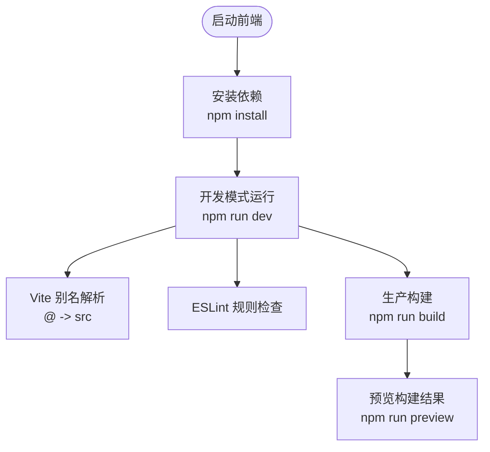
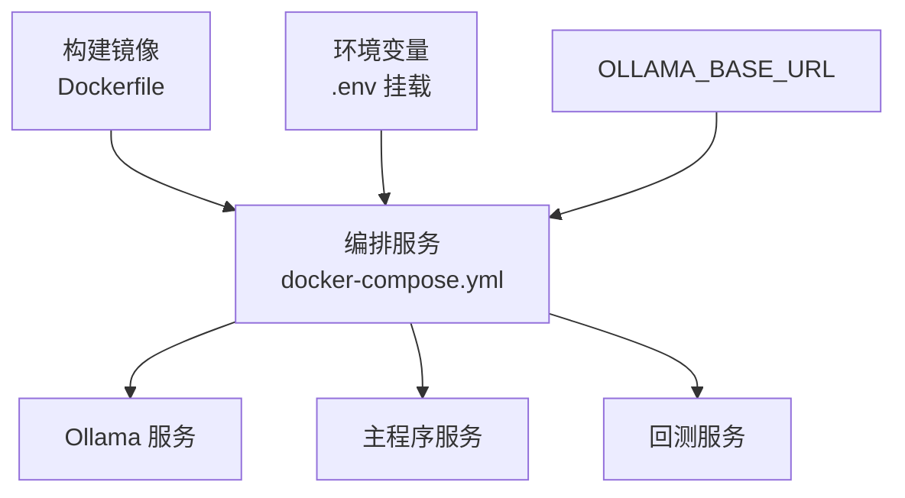
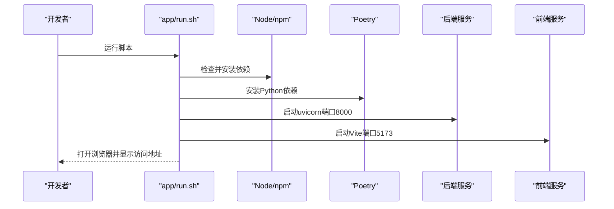
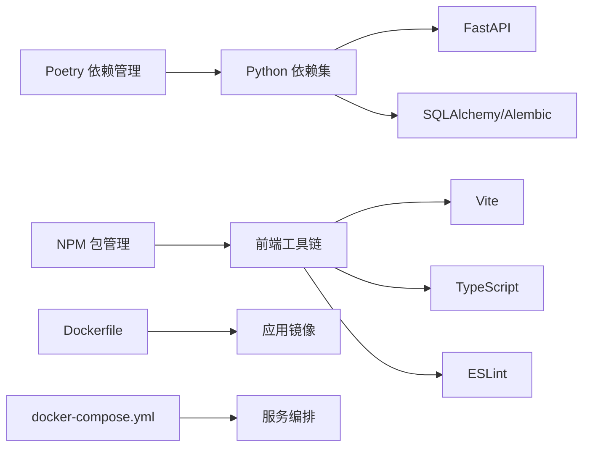

# 开发流程与工作流

<cite>
**本文引用的文件**
- [README.md](file://README.md)
- [app/backend/README.md](file://app/backend/README.md)
- [app/frontend/README.md](file://app/frontend/README.md)
- [docker/README.md](file://docker/README.md)
- [pyproject.toml](file://pyproject.toml)
- [app/frontend/package.json](file://app/frontend/package.json)
- [docker/docker-compose.yml](file://docker/docker-compose.yml)
- [app/run.sh](file://app/run.sh)
- [app/backend/main.py](file://app/backend/main.py)
- [app/backend/alembic/env.py](file://app/backend/alembic/env.py)
- [app/frontend/vite.config.ts](file://app/frontend/vite.config.ts)
- [docker/Dockerfile](file://docker/Dockerfile)
- [app/frontend/.eslintrc.cjs](file://app/frontend/.eslintrc.cjs)
</cite>

## 目录
1. [简介](#简介)
2. [项目结构](#项目结构)
3. [核心组件](#核心组件)
4. [架构总览](#架构总览)
5. [详细组件分析](#详细组件分析)
6. [依赖关系分析](#依赖关系分析)
7. [性能考虑](#性能考虑)
8. [故障排查指南](#故障排查指南)
9. [结论](#结论)
10. [附录](#附录)

## 简介
本文件面向开发者，提供从环境搭建到代码提交的完整开发流程说明，涵盖依赖安装、虚拟环境配置、数据库初始化与开发服务器启动；阐述分支管理策略（主分支保护、功能分支、Hotfix与Release）、代码审查流程（PR模板、审查标准、合并要求与CI/CD集成）；给出日常开发任务指南（本地调试、测试运行、性能分析与问题排查），并提供开发工具配置建议与常用技巧。

## 项目结构
该项目采用多模块组织方式：根目录包含后端FastAPI应用、前端React/Vite应用、Docker容器化部署脚本与测试用例；src/v2为第二代算法模块；tests为集成与单元测试集合。

图表来源
- [README.md](file://README.md)
- [app/backend/README.md](file://app/backend/README.md)
- [app/frontend/README.md](file://app/frontend/README.md)
- [docker/docker-compose.yml](file://docker/docker-compose.yml)

章节来源
- [README.md](file://README.md)
- [app/backend/README.md](file://app/backend/README.md)
- [app/frontend/README.md](file://app/frontend/README.md)
- [docker/README.md](file://docker/README.md)

## 核心组件
- 后端服务（FastAPI）
  - 应用入口与CORS配置位于后端主程序，启动时自动创建数据库表并检查Ollama可用性。
  - 数据库迁移通过Alembic在后端环境中执行。
- 前端应用（React/Vite）
  - 使用Vite进行开发与构建，TypeScript类型检查与ESLint规则保障代码质量。
- 容器化与编排
  - Dockerfile定义镜像构建流程，docker-compose.yml定义服务编排与卷挂载，支持本地Ollama或外部Ollama服务。
- 运行脚本
  - app/run.sh 提供一键安装依赖、启动前后端服务、打开浏览器与日志收集的自动化流程。

章节来源
- [app/backend/main.py](file://app/backend/main.py)
- [app/backend/alembic/env.py](file://app/backend/alembic/env.py)
- [app/frontend/vite.config.ts](file://app/frontend/vite.config.ts)
- [docker/docker-compose.yml](file://docker/docker-compose.yml)
- [app/run.sh](file://app/run.sh)

## 架构总览
系统由“前端界面 + 后端API + 数据库 + 可选本地大模型服务”构成，支持命令行与Web两种运行方式，同时提供Docker容器化部署选项。

图表来源
- [app/backend/main.py](file://app/backend/main.py)
- [app/frontend/vite.config.ts](file://app/frontend/vite.config.ts)
- [docker/docker-compose.yml](file://docker/docker-compose.yml)
- [app/run.sh](file://app/run.sh)

## 详细组件分析

### 后端服务（FastAPI）
- 启动流程
  - 初始化FastAPI应用与CORS策略，注册路由。
  - 在启动事件中检测Ollama状态（是否安装、运行、可用模型列表）。
  - 自动创建数据库表（幂等安全）。
- 数据库迁移
  - 通过Alembic在后端环境中执行离线/在线迁移，目标元数据指向后端模型。
- 部署与容器化
  - Dockerfile使用Poetry安装依赖，设置PYTHONPATH，复制源码并以默认命令运行主程序。
  - docker-compose.yml定义服务、环境变量（如OLLAMA_BASE_URL）、卷挂载（.env）与命令参数。

图表来源
- [app/run.sh](file://app/run.sh)
- [app/backend/main.py](file://app/backend/main.py)
- [docker/docker-compose.yml](file://docker/docker-compose.yml)

章节来源
- [app/backend/main.py](file://app/backend/main.py)
- [app/backend/alembic/env.py](file://app/backend/alembic/env.py)
- [docker/Dockerfile](file://docker/Dockerfile)
- [docker/docker-compose.yml](file://docker/docker-compose.yml)

### 前端应用（React/Vite）
- 工程配置
  - Vite别名映射至src目录，便于模块导入。
  - TypeScript与ESLint规则确保代码风格与类型安全。
- 开发与构建
  - 开发模式通过Vite热更新提供快速迭代体验。
  - 生产构建结合TypeScript编译与打包优化。

图表来源
- [app/frontend/vite.config.ts](file://app/frontend/vite.config.ts)
- [app/frontend/package.json](file://app/frontend/package.json)
- [app/frontend/.eslintrc.cjs](file://app/frontend/.eslintrc.cjs)

章节来源
- [app/frontend/vite.config.ts](file://app/frontend/vite.config.ts)
- [app/frontend/package.json](file://app/frontend/package.json)
- [app/frontend/.eslintrc.cjs](file://app/frontend/.eslintrc.cjs)

### 容器化与编排
- 镜像构建
  - 基于Python 3.11 Slim，安装Poetry并以非虚拟环境模式安装依赖，复制源码，设置PYTHONPATH。
- 服务编排
  - 定义Ollama服务（可选嵌入式）与多个任务服务（主程序、推理输出、回测等），统一挂载.env与设置OLLAMA_BASE_URL。
- Docker运行方式
  - docker/README.md提供基于脚本的构建与运行说明，支持Windows与Linux/macOS平台。

图表来源
- [docker/Dockerfile](file://docker/Dockerfile)
- [docker/docker-compose.yml](file://docker/docker-compose.yml)
- [docker/README.md](file://docker/README.md)

章节来源
- [docker/Dockerfile](file://docker/Dockerfile)
- [docker/docker-compose.yml](file://docker/docker-compose.yml)
- [docker/README.md](file://docker/README.md)

### 开发运行脚本（app/run.sh）
- 功能概览
  - 检查前置条件（Node.js、npm、Python、Poetry），自动安装Poetry。
  - 复制并提示编辑根目录.env示例文件。
  - 安装后端（Poetry）与前端（npm）依赖。
  - 启动后端（uvicorn）与前端（Vite），自动打开浏览器，输出访问地址与日志路径。
  - 支持信号处理与进程清理，保证优雅退出。
- 数据库初始化
  - 后端首次启动会自动创建SQLite数据库与表结构。

图表来源
- [app/run.sh](file://app/run.sh)
- [app/backend/main.py](file://app/backend/main.py)

章节来源
- [app/run.sh](file://app/run.sh)
- [app/backend/main.py](file://app/backend/main.py)

## 依赖关系分析
- 语言与框架
  - Python 3.11，Poetry管理依赖；FastAPI、SQLAlchemy、Alembic用于后端；React、Vite、TypeScript用于前端。
- 开发工具链
  - black、isort、flake8用于Python代码格式与静态检查；ESLint用于前端代码规范。
- 运行时与容器
  - Dockerfile与docker-compose.yml定义镜像与服务编排；OLLAMA_BASE_URL支持外部或嵌入式Ollama。

图表来源
- [pyproject.toml](file://pyproject.toml)
- [app/frontend/package.json](file://app/frontend/package.json)
- [docker/Dockerfile](file://docker/Dockerfile)
- [docker/docker-compose.yml](file://docker/docker-compose.yml)

章节来源
- [pyproject.toml](file://pyproject.toml)
- [app/frontend/package.json](file://app/frontend/package.json)
- [docker/Dockerfile](file://docker/Dockerfile)
- [docker/docker-compose.yml](file://docker/docker-compose.yml)

## 性能考虑
- 本地大模型推理
  - 使用Ollama可显著降低网络延迟与API成本，但需关注显存与CPU占用；可通过外部Ollama服务或嵌入式服务配置。
- 数据库与迁移
  - SQLite适合开发与演示场景；生产建议评估PostgreSQL/MySQL以获得更好并发与稳定性。
- 前端构建
  - Vite提供快速热更新；生产构建开启压缩与Tree-shaking，减少包体积。
- 容器化
  - Dockerfile分层缓存依赖安装；compose按需启用嵌入式Ollama，避免资源浪费。

## 故障排查指南
- 后端无法启动或CORS错误
  - 检查后端启动日志与端口占用；确认允许的前端源已加入CORS白名单。
- 数据库未初始化
  - 首次启动后端会自动创建表；若未生成，请检查数据库文件权限与路径。
- Ollama不可用
  - 查看后端启动日志中的Ollama状态提示；确认环境变量OLLAMA_BASE_URL正确或Ollama服务已启动。
- 前端无法访问或热更新异常
  - 检查Vite端口占用与防火墙；确保Node版本满足要求；查看ESLint与TypeScript编译错误。
- Docker构建失败
  - 确认网络可达与镜像缓存；检查Poetry安装步骤与PYTHONPATH；验证卷挂载与环境变量。

章节来源
- [app/backend/main.py](file://app/backend/main.py)
- [docker/docker-compose.yml](file://docker/docker-compose.yml)
- [app/frontend/.eslintrc.cjs](file://app/frontend/.eslintrc.cjs)

## 结论
本项目提供了从命令行到Web界面的多运行方式，配合容器化与一键启动脚本，极大降低了本地开发门槛。建议在团队内统一遵循分支与审查流程，结合CI/CD自动化测试与构建，持续提升交付质量与效率。

## 附录

### 分支管理策略
- 主分支保护
  - 仅允许通过受保护的分支策略合并（如需要审查、CI通过）。
- 功能分支
  - 从主分支切出功能分支，命名清晰（如 feature/xxx），完成后发起PR。
- Hotfix分支
  - 用于紧急修复，从主分支切出，修复后合并回主分支与发布分支。
- Release分支
  - 用于准备发布的稳定版本，合并前完成回归测试与文档校对。

### 代码审查流程
- PR模板
  - 描述变更内容、动机与影响范围；列出相关Issue编号；提供测试方法与验证清单。
- 审查标准
  - 代码可读性、安全性、性能与兼容性；是否覆盖新增逻辑；是否遵循项目规范。
- 合并要求
  - 至少一名维护者批准；所有CI检查通过；无未解决争议。
- CI/CD集成
  - 自动化运行测试、静态检查与构建；Docker镜像构建与推送；发布制品管理。

### 日常开发任务指南
- 本地调试
  - 使用app/run.sh一键启动前后端；后端端口8000，前端端口5173；浏览器自动打开。
- 测试运行
  - Python测试：使用pytest；前端ESLint与TypeScript检查：npm run lint；Vite预览：npm run preview。
- 性能分析
  - 前端：Vite内置分析与Source Map；后端：结合日志与指标监控（可扩展）。
- 问题排查
  - 查看脚本生成的日志文件；核对环境变量与端口；确认Ollama服务状态。

### 开发工具配置建议
- Python
  - 使用black、isort、flake8保持一致风格；PyCharm/VSCode推荐启用格式化与导入排序。
- 前端
  - VSCode推荐安装ESLint、TypeScript、Tailwind等插件；Vite配置别名便于模块导入。
- 版本控制
  - 统一提交信息格式；小步提交、清晰注释；定期同步主分支。