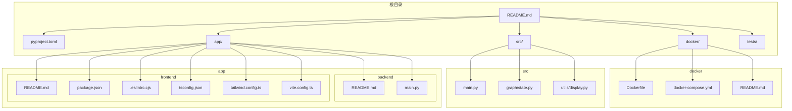
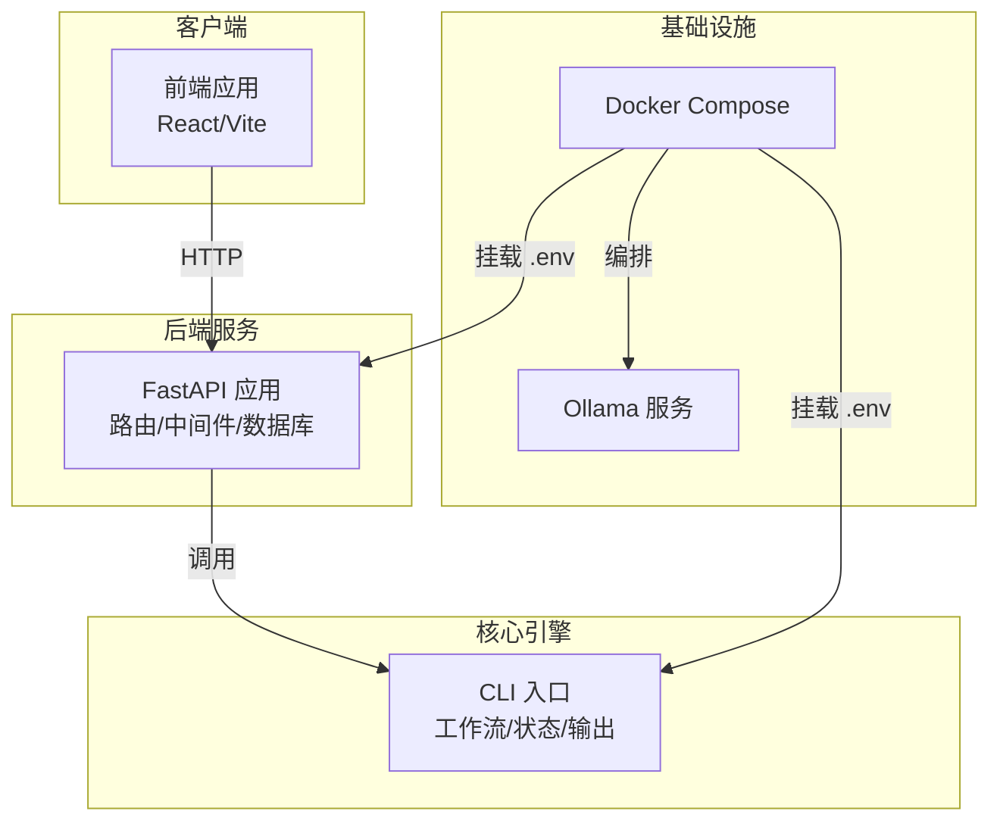
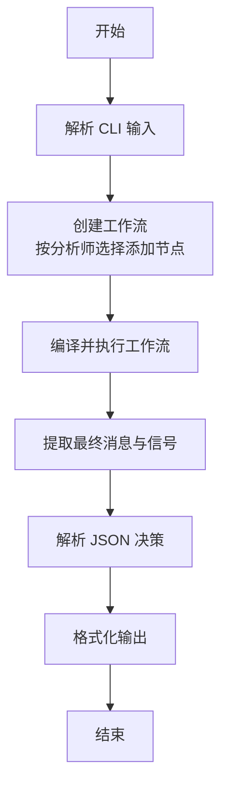
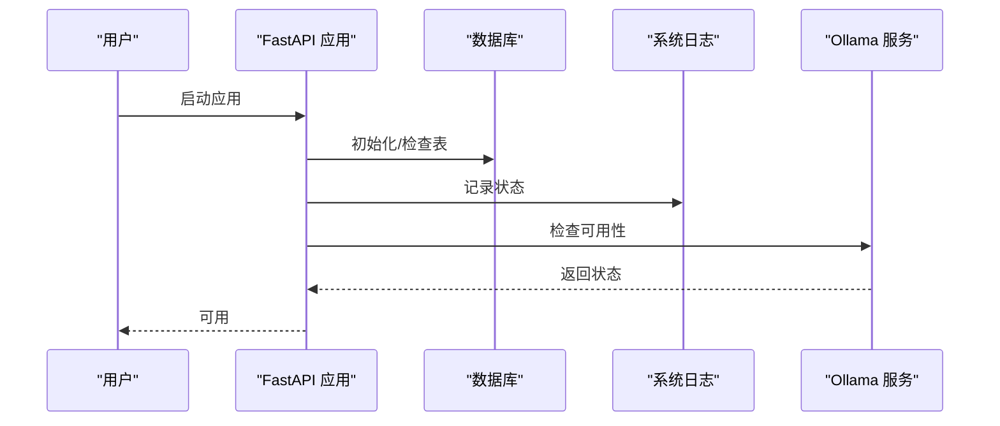
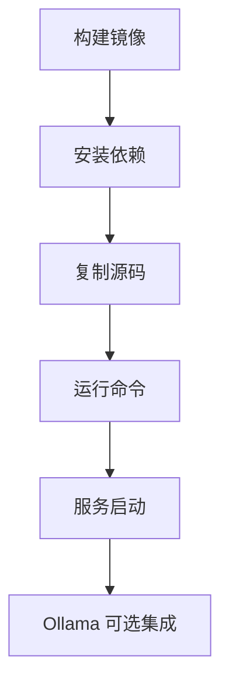
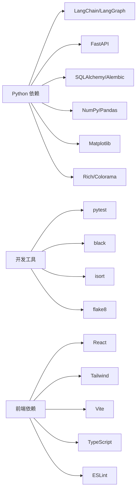

# 开发者指南

<cite>
**本文引用的文件**
- [README.md](file://README.md)
- [pyproject.toml](file://pyproject.toml)
- [docker/README.md](file://docker/README.md)
- [docker/docker-compose.yml](file://docker/docker-compose.yml)
- [docker/Dockerfile](file://docker/Dockerfile)
- [src/main.py](file://src/main.py)
- [src/graph/state.py](file://src/graph/state.py)
- [src/utils/display.py](file://src/utils/display.py)
- [app/backend/README.md](file://app/backend/README.md)
- [app/backend/main.py](file://app/backend/main.py)
- [app/frontend/README.md](file://app/frontend/README.md)
- [app/frontend/package.json](file://app/frontend/package.json)
- [app/frontend/.eslintrc.cjs](file://app/frontend/.eslintrc.cjs)
- [app/frontend/tsconfig.json](file://app/frontend/tsconfig.json)
- [app/frontend/tailwind.config.ts](file://app/frontend/tailwind.config.ts)
- [app/frontend/vite.config.ts](file://app/frontend/vite.config.ts)
- [.github/ISSUE_TEMPLATE/bug_report.md](file://.github/ISSUE_TEMPLATE/bug_report.md)
- [.github/ISSUE_TEMPLATE/feature_request.md](file://.github/ISSUE_TEMPLATE/feature_request.md)
</cite>

## 目录
1. [简介](#简介)
2. [项目结构](#项目结构)
3. [核心组件](#核心组件)
4. [架构总览](#架构总览)
5. [详细组件分析](#详细组件分析)
6. [依赖分析](#依赖分析)
7. [性能考虑](#性能考虑)
8. [故障排查指南](#故障排查指南)
9. [结论](#结论)
10. [附录](#附录)

## 简介
本指南面向开发者，系统性介绍代码规范、编码标准与最佳实践；解释项目结构、模块组织与依赖管理策略；阐述新功能开发流程、分支管理与代码审查规范；描述智能体扩展、插件开发与API扩展方法；提供开发环境配置、调试技巧与性能分析工具使用建议；包含贡献指南、Issue 提交与 Pull Request 流程；并为新加入的开发者提供从零到深入学习的完整路径。

## 项目结构
该项目采用多语言混合架构：后端与核心逻辑以 Python 实现，前端基于 React/Vite，容器化通过 Docker Compose 编排，支持本地模型（Ollama）与云端大模型服务。根目录包含后端 FastAPI 应用、前端 React 应用、Python 核心模块与测试；docker 目录提供镜像构建与编排配置。

图表来源
- [README.md:1-158](file://README.md#L1-L158)
- [docker/README.md:1-211](file://docker/README.md#L1-L211)
- [docker/docker-compose.yml:1-95](file://docker/docker-compose.yml#L1-L95)
- [docker/Dockerfile:1-23](file://docker/Dockerfile#L1-L23)
- [src/main.py:1-180](file://src/main.py#L1-L180)
- [src/graph/state.py:1-52](file://src/graph/state.py#L1-L52)
- [src/utils/display.py:1-396](file://src/utils/display.py#L1-L396)
- [app/backend/README.md:1-102](file://app/backend/README.md#L1-L102)
- [app/backend/main.py:1-56](file://app/backend/main.py#L1-L56)
- [app/frontend/README.md:1-37](file://app/frontend/README.md#L1-L37)
- [app/frontend/package.json:1-56](file://app/frontend/package.json#L1-L56)
- [app/frontend/.eslintrc.cjs:1-19](file://app/frontend/.eslintrc.cjs#L1-L19)
- [app/frontend/tsconfig.json:1-40](file://app/frontend/tsconfig.json#L1-L40)
- [app/frontend/tailwind.config.ts:1-144](file://app/frontend/tailwind.config.ts#L1-L144)
- [app/frontend/vite.config.ts:1-14](file://app/frontend/vite.config.ts#L1-L14)

章节来源
- [README.md:1-158](file://README.md#L1-L158)
- [docker/README.md:1-211](file://docker/README.md#L1-L211)
- [docker/docker-compose.yml:1-95](file://docker/docker-compose.yml#L1-L95)
- [docker/Dockerfile:1-23](file://docker/Dockerfile#L1-L23)
- [src/main.py:1-180](file://src/main.py#L1-L180)
- [app/backend/README.md:1-102](file://app/backend/README.md#L1-L102)
- [app/frontend/README.md:1-37](file://app/frontend/README.md#L1-L37)

## 核心组件
- 后端（FastAPI）：提供 REST API，负责启动参数校验、CORS 配置、数据库初始化与健康检查；当前暴露运行入口与健康检查端点。
- 前端（React/Vite）：提供可视化界面，连接后端 API，展示交易决策与回测结果。
- 核心引擎（Python CLI）：命令行入口，定义工作流状态、解析输入、编译执行图、打印输出。
- 工作流状态（LangGraph）：定义消息、数据与元数据的合并规则，支持推理展示与序列化。
- 输出格式化（utils.display）：统一控制台表格输出、颜色与换行处理，便于阅读与对比。

章节来源
- [app/backend/README.md:69-91](file://app/backend/README.md#L69-L91)
- [app/backend/main.py:15-56](file://app/backend/main.py#L15-L56)
- [app/frontend/README.md:8-26](file://app/frontend/README.md#L8-L26)
- [src/main.py:46-131](file://src/main.py#L46-L131)
- [src/graph/state.py:15-52](file://src/graph/state.py#L15-L52)
- [src/utils/display.py:17-255](file://src/utils/display.py#L17-L255)

## 架构总览
系统采用“CLI 引擎 + 后端 API + 前端界面”的分层架构。CLI 负责核心业务逻辑与可视化输出；后端提供 API 与数据库初始化；前端通过 API 与后端交互。Docker Compose 将 Ollama 与应用容器编排，支持本地或远程模型服务。

图表来源
- [app/backend/main.py:15-56](file://app/backend/main.py#L15-L56)
- [docker/docker-compose.yml:18-91](file://docker/docker-compose.yml#L18-L91)
- [docker/Dockerfile:1-23](file://docker/Dockerfile#L1-L23)
- [src/main.py:46-131](file://src/main.py#L46-L131)

## 详细组件分析

### 组件一：CLI 工作流与状态
- 工作流创建：根据分析师选择动态添加节点，并固定串联风险与组合管理节点。
- 状态结构：消息、数据与元数据三段式，支持合并与序列化。
- 输出解析：统一解析 JSON 字符串，异常时记录原始响应以便诊断。

图表来源
- [src/main.py:46-131](file://src/main.py#L46-L131)
- [src/graph/state.py:15-52](file://src/graph/state.py#L15-L52)
- [src/utils/display.py:17-255](file://src/utils/display.py#L17-L255)

章节来源
- [src/main.py:46-131](file://src/main.py#L46-L131)
- [src/graph/state.py:15-52](file://src/graph/state.py#L15-L52)
- [src/utils/display.py:17-255](file://src/utils/display.py#L17-L255)

### 组件二：后端 API 与数据库初始化
- 初始化：启动时创建所有表（幂等），避免重复迁移。
- 中间件：启用 CORS，允许前端访问。
- 路由：包含健康检查与未来运行接口。
- Ollama 检查：启动时探测 Ollama 安装与可用模型情况。

图表来源
- [app/backend/main.py:17-56](file://app/backend/main.py#L17-L56)

章节来源
- [app/backend/README.md:69-91](file://app/backend/README.md#L69-L91)
- [app/backend/main.py:15-56](file://app/backend/main.py#L15-L56)

### 组件三：前端工程配置与开发体验
- 包管理与脚本：提供 dev/build/lint/preview。
- ESLint 规则：推荐规则、TypeScript 解析器、React Hooks 规则。
- TypeScript：严格模式、未使用变量/参数检测、路径别名。
- Tailwind：主题、动画、可访问颜色系统。
- Vite：React 插件与路径别名。

章节来源
- [app/frontend/package.json:1-56](file://app/frontend/package.json#L1-L56)
- [app/frontend/.eslintrc.cjs:1-19](file://app/frontend/.eslintrc.cjs#L1-L19)
- [app/frontend/tsconfig.json:1-40](file://app/frontend/tsconfig.json#L1-L40)
- [app/frontend/tailwind.config.ts:1-144](file://app/frontend/tailwind.config.ts#L1-L144)
- [app/frontend/vite.config.ts:1-14](file://app/frontend/vite.config.ts#L1-L14)

### 组件四：容器化与运行
- Dockerfile：基础镜像、Poetry 安装、依赖安装、源码复制、默认命令。
- docker-compose：定义 Ollama 与应用服务，挂载 .env，设置 OLLAMA_BASE_URL，支持嵌入式 Ollama。
- 运行方式：支持 CLI、回测、显示推理与本地模型模式。

图表来源
- [docker/Dockerfile:1-23](file://docker/Dockerfile#L1-L23)
- [docker/docker-compose.yml:18-91](file://docker/docker-compose.yml#L18-L91)
- [docker/README.md:111-192](file://docker/README.md#L111-L192)

章节来源
- [docker/README.md:85-192](file://docker/README.md#L85-L192)
- [docker/docker-compose.yml:1-95](file://docker/docker-compose.yml#L1-L95)
- [docker/Dockerfile:1-23](file://docker/Dockerfile#L1-L23)

## 依赖分析
- Python 依赖：LangChain/LangGraph、FastAPI、SQLAlchemy/Alembic、Matplotlib、Rich、Colorama、Questionary、NumPy/Pandas、Scipy 等。
- 开发工具：pytest、black、isort、flake8。
- 前端依赖：React、Radix UI、Tailwind、Vite、TypeScript、ESLint、shadcn/ui 等。
- 脚本：通过 Poetry 脚本导出回测入口。

图表来源
- [pyproject.toml:13-47](file://pyproject.toml#L13-L47)
- [app/frontend/package.json:11-54](file://app/frontend/package.json#L11-L54)

章节来源
- [pyproject.toml:1-62](file://pyproject.toml#L1-L62)
- [app/frontend/package.json:1-56](file://app/frontend/package.json#L1-L56)

## 性能考虑
- I/O 密集型：金融数据获取与 LLM 推理是主要瓶颈，建议缓存与批量化请求。
- 图执行：LangGraph 工作流在节点数量增加时需关注内存与序列化开销，建议拆分长链路或限制并发。
- 控制台输出：大量表格与颜色打印可能影响终端渲染性能，建议在 CI 或批量场景中减少彩色输出。
- Docker：合理设置 PYTHONUNBUFFERED、OLLAMA_BASE_URL，避免不必要的网络往返。
- 前端：Tailwind 动画与组件树过大时注意重绘与布局抖动，优先使用虚拟滚动与懒加载。

## 故障排查指南
- 启动失败（后端）：检查 CORS 配置与数据库初始化日志；确认 .env 中 API Key 与 Ollama 地址。
- LLM 无法连接：确认 OPENAI/GROQ/Anthropic 等密钥有效；若使用本地模型，检查 Ollama 服务状态与模型列表。
- Docker 运行异常：核对 docker-compose 环境变量与卷挂载；如需嵌入式 Ollama，使用对应 profile。
- 前端无法访问：确认前端端口与后端允许的 Origin 列表一致。
- 输出乱码或表格错位：检查终端编码与列宽设置；必要时关闭彩色输出。

章节来源
- [app/backend/main.py:20-56](file://app/backend/main.py#L20-L56)
- [docker/docker-compose.yml:26-28](file://docker/docker-compose.yml#L26-L28)
- [docker/README.md:134-144](file://docker/README.md#L134-L144)

## 结论
本项目以清晰的分层与容器化策略实现“AI 驱动的对冲基金”原型，具备良好的扩展性与可维护性。遵循本文档的规范与流程，可高效完成新功能开发、智能体扩展与 API 增强，并确保质量与一致性。

## 附录

### 代码规范与最佳实践
- Python
  - 使用 black 与 isort 统一格式与导入顺序；flake8 保证基本质量。
  - 类型注解与 TypedDict 明确状态结构；避免过深嵌套与全局副作用。
  - 日志分级记录，错误捕获与降级处理。
- 前端
  - TypeScript 严格模式；ESLint 规则约束；组件职责单一；样式通过 Tailwind 组合。
  - 路径别名统一管理；避免内联样式。
- 容器化
  - 分层构建缓存；只复制必要文件；设置 PYTHONPATH；合理使用环境变量。

章节来源
- [pyproject.toml:52-60](file://pyproject.toml#L52-L60)
- [app/frontend/.eslintrc.cjs:1-19](file://app/frontend/.eslintrc.cjs#L1-L19)
- [app/frontend/tsconfig.json:20-23](file://app/frontend/tsconfig.json#L20-L23)
- [docker/Dockerfile:11-19](file://docker/Dockerfile#L11-L19)

### 新功能开发流程
- 需求评审：在 Issue 中明确目标、范围与验收标准。
- 分支策略：基于主分支创建特性分支，保持小步提交。
- 编码规范：遵循上述 Python/前端规范；新增模块需补充类型注解与单元测试。
- 代码审查：提交 PR，至少一名维护者审核；确保变更最小化且可测试。
- 合并与发布：通过 CI/CD（如适用）后合并；更新文档与版本说明。

章节来源
- [README.md:141-150](file://README.md#L141-L150)
- [.github/ISSUE_TEMPLATE/bug_report.md](file://.github/ISSUE_TEMPLATE/bug_report.md)
- [.github/ISSUE_TEMPLATE/feature_request.md](file://.github/ISSUE_TEMPLATE/feature_request.md)

### 智能体扩展与插件开发
- 扩展智能体：在智能体目录新增实现，遵循现有接口约定；在工作流中注册节点。
- 插件化数据源：抽象数据获取接口，支持多数据源切换与缓存。
- 插件化 LLM：统一模型适配器，支持 OpenAI、Groq、本地 Ollama 等。

章节来源
- [src/main.py:100-130](file://src/main.py#L100-L130)
- [src/graph/state.py:15-19](file://src/graph/state.py#L15-L19)

### API 扩展方法
- 后端新增路由：在 routes 下新增模块，注册到路由器；编写 Pydantic 模型与响应结构。
- 数据库：通过 SQLAlchemy 模型与 Alembic 迁移管理；保持向后兼容。
- 文档：自动生成 OpenAPI 文档，保持接口稳定与清晰注释。

章节来源
- [app/backend/README.md:74-91](file://app/backend/README.md#L74-L91)
- [app/backend/main.py:29-30](file://app/backend/main.py#L29-L30)

### 开发环境配置与调试
- Python：使用 Poetry 安装依赖；设置 .env；在 IDE 中启用 black/isort/flake8。
- 前端：安装依赖后运行 dev；ESLint 报错需修复；Tailwind 自定义主题按需调整。
- Docker：按 docker/README 步骤构建与运行；必要时开启嵌入式 Ollama。
- 调试：CLI 支持 --show-reasoning 输出推理过程；后端日志记录 Ollama 状态。

章节来源
- [README.md:54-131](file://README.md#L54-L131)
- [docker/README.md:85-192](file://docker/README.md#L85-L192)
- [app/frontend/README.md:10-26](file://app/frontend/README.md#L10-L26)
- [app/backend/main.py:32-55](file://app/backend/main.py#L32-L55)

### 贡献指南与 Issue/Pull Request 流程
- Issue：Bug 报告与功能请求模板已提供，填写必要信息并打标签。
- PR：保持小而聚焦；描述变更动机与测试覆盖；等待审核与合并。

章节来源
- [.github/ISSUE_TEMPLATE/bug_report.md](file://.github/ISSUE_TEMPLATE/bug_report.md)
- [.github/ISSUE_TEMPLATE/feature_request.md](file://.github/ISSUE_TEMPLATE/feature_request.md)
- [README.md:141-150](file://README.md#L141-L150)