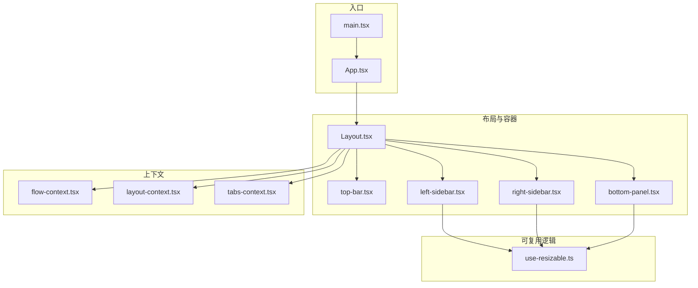
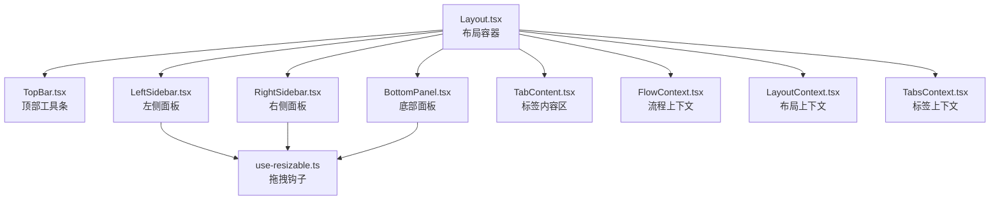
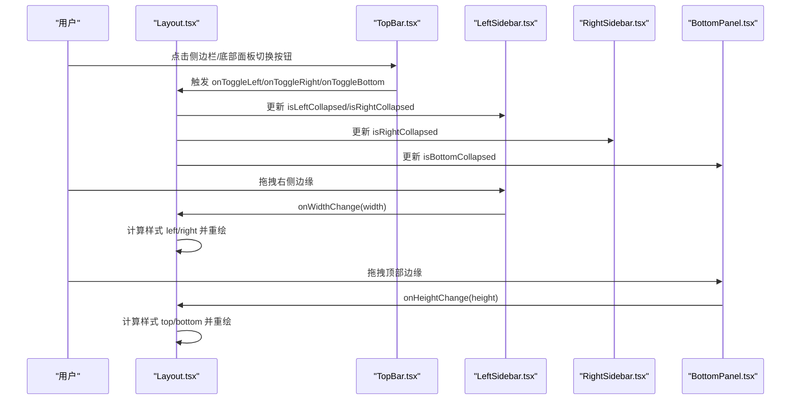
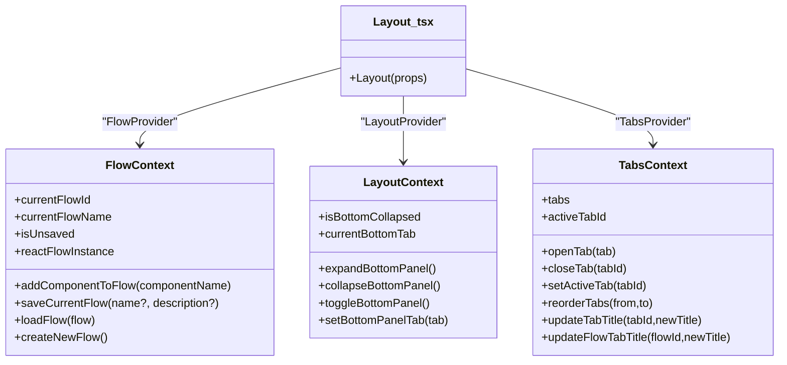
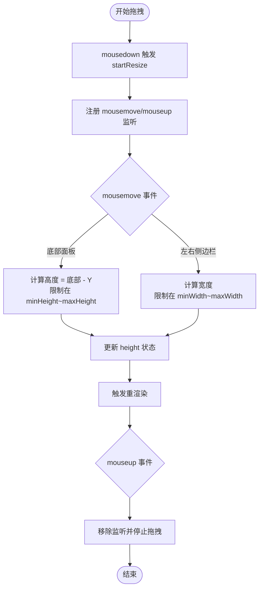
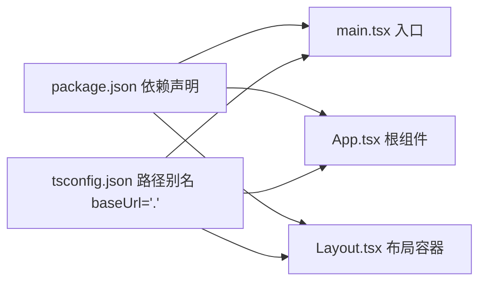

# 前端组件扩展

<cite>
**本文引用的文件**
- [App.tsx](file://app/frontend/src/App.tsx)
- [main.tsx](file://app/frontend/src/main.tsx)
- [Layout.tsx](file://app/frontend/src/components/Layout.tsx)
- [top-bar.tsx](file://app/frontend/src/components/layout/top-bar.tsx)
- [left-sidebar.tsx](file://app/frontend/src/components/panels/left/left-sidebar.tsx)
- [right-sidebar.tsx](file://app/frontend/src/components/panels/right/right-sidebar.tsx)
- [bottom-panel.tsx](file://app/frontend/src/components/panels/bottom/bottom-panel.tsx)
- [flow-context.tsx](file://app/frontend/src/contexts/flow-context.tsx)
- [layout-context.tsx](file://app/frontend/src/contexts/layout-context.tsx)
- [tabs-context.tsx](file://app/frontend/src/contexts/tabs-context.tsx)
- [use-resizable.ts](file://app/frontend/src/hooks/use-resizable.ts)
- [package.json](file://app/frontend/package.json)
- [tsconfig.json](file://app/frontend/tsconfig.json)
</cite>

## 目录
1. [简介](#简介)
2. [项目结构](#项目结构)
3. [核心组件](#核心组件)
4. [架构总览](#架构总览)
5. [详细组件分析](#详细组件分析)
6. [依赖关系分析](#依赖关系分析)
7. [性能考虑](#性能考虑)
8. [故障排查指南](#故障排查指南)
9. [结论](#结论)
10. [附录](#附录)

## 简介
本指南面向希望在现有前端组件体系上进行扩展与定制的开发者，系统讲解 React 组件架构、组件分类、状态管理模式、生命周期管理与性能优化策略；并提供从零开发新 UI 组件的设计原则、Props 接口定义、事件处理与样式定制方法；阐述基于 Context API 的状态扩展、全局状态管理与状态持久化；给出服务层扩展指南（API 客户端、数据缓存、错误处理与加载状态管理）；最后覆盖组件测试与用户体验优化建议，并总结现有组件体系（侧边栏、面板、对话框、图表组件）的扩展方法与自定义组件实现模式。

## 项目结构
前端采用 Vite + React 18 + TypeScript 构建，使用 Radix UI、@xyflow/react、TailwindCSS 等生态组件库与工具链。项目按功能域组织：components（布局与 UI）、contexts（上下文）、hooks（可复用逻辑）、services（服务层）、types（类型定义）、providers（主题等提供者），并以 Layout 为根容器协调多个子系统。

**图示来源**
- [main.tsx:10-18](file://app/frontend/src/main.tsx#L10-L18)
- [App.tsx:1-11](file://app/frontend/src/App.tsx#L1-L11)
- [Layout.tsx:187-201](file://app/frontend/src/components/Layout.tsx#L187-L201)
- [top-bar.tsx:15-87](file://app/frontend/src/components/layout/top-bar.tsx#L15-L87)
- [left-sidebar.tsx:17-101](file://app/frontend/src/components/panels/left/left-sidebar.tsx#L17-L101)
- [right-sidebar.tsx:17-97](file://app/frontend/src/components/panels/right/right-sidebar.tsx#L17-L97)
- [bottom-panel.tsx:19-99](file://app/frontend/src/components/panels/bottom/bottom-panel.tsx#L19-L99)
- [flow-context.tsx:35-358](file://app/frontend/src/contexts/flow-context.tsx#L35-L358)
- [layout-context.tsx:27-68](file://app/frontend/src/contexts/layout-context.tsx#L27-L68)
- [tabs-context.tsx:59-271](file://app/frontend/src/contexts/tabs-context.tsx#L59-L271)
- [use-resizable.ts:13-93](file://app/frontend/src/hooks/use-resizable.ts#L13-L93)

**章节来源**
- [package.json:1-56](file://app/frontend/package.json#L1-L56)
- [tsconfig.json:1-40](file://app/frontend/tsconfig.json#L1-L40)

## 核心组件
- 布局容器：Layout 负责组织顶部工具条、左右侧边栏、底部面板、标签页内容区，并通过 Provider 层级注入 Flow、Layout、Tabs 上下文以及 ReactFlow 容器。
- 顶部工具条：TopBar 提供侧边栏与底部面板的切换按钮及设置入口。
- 左右侧边栏：LeftSidebar/RightSidebar 支持拖拽调整宽度、搜索过滤、分组展开、组件/流程列表展示与交互。
- 底部面板：BottomPanel 支持拖拽调整高度、输出标签页与关闭按钮。
- 上下文层：FlowContext 管理流程增删改查、节点状态、保存/加载；LayoutContext 管理底部面板折叠状态与当前标签；TabsContext 管理标签页集合、激活态与持久化。
- 可复用逻辑：use-resizable 抽象横向（侧边栏）与纵向（底部面板）拖拽尺寸计算与边界约束。

**章节来源**
- [Layout.tsx:187-201](file://app/frontend/src/components/Layout.tsx#L187-L201)
- [top-bar.tsx:15-87](file://app/frontend/src/components/layout/top-bar.tsx#L15-L87)
- [left-sidebar.tsx:17-101](file://app/frontend/src/components/panels/left/left-sidebar.tsx#L17-L101)
- [right-sidebar.tsx:17-97](file://app/frontend/src/components/panels/right/right-sidebar.tsx#L17-L97)
- [bottom-panel.tsx:19-99](file://app/frontend/src/components/panels/bottom/bottom-panel.tsx#L19-L99)
- [flow-context.tsx:35-358](file://app/frontend/src/contexts/flow-context.tsx#L35-L358)
- [layout-context.tsx:27-68](file://app/frontend/src/contexts/layout-context.tsx#L27-L68)
- [tabs-context.tsx:59-271](file://app/frontend/src/contexts/tabs-context.tsx#L59-L271)
- [use-resizable.ts:13-93](file://app/frontend/src/hooks/use-resizable.ts#L13-L93)

## 架构总览
整体采用“容器组件 + UI 组件 + Context + Hooks”的分层架构。容器组件负责布局与状态聚合，UI 组件专注展示与交互，Context 提供跨层级共享的状态，Hooks 将副作用与复用逻辑抽离到可测试单元中。

**图示来源**
- [Layout.tsx:187-201](file://app/frontend/src/components/Layout.tsx#L187-L201)
- [flow-context.tsx:35-358](file://app/frontend/src/contexts/flow-context.tsx#L35-L358)
- [layout-context.tsx:27-68](file://app/frontend/src/contexts/layout-context.tsx#L27-L68)
- [tabs-context.tsx:59-271](file://app/frontend/src/contexts/tabs-context.tsx#L59-L271)
- [use-resizable.ts:13-93](file://app/frontend/src/hooks/use-resizable.ts#L13-L93)

## 详细组件分析

### 布局与容器组件
- Layout：作为根容器，组合顶部工具条、左右侧边栏、底部面板与标签内容区；通过多层 Provider 注入 Flow、Layout、Tabs 上下文与 ReactFlow 容器；支持键盘快捷键与侧边栏/底部面板状态持久化。
- TopBar：提供侧边栏与底部面板切换按钮、设置入口，绑定回调至父容器状态更新。
- LeftSidebar/RightSidebar：支持拖拽调整宽度、搜索过滤、分组展开、组件/流程列表交互；宽度变化通过回调通知父容器用于定位计算。
- BottomPanel：支持拖拽调整高度、输出标签页与关闭按钮；折叠状态由 LayoutContext 管理。

**图示来源**
- [Layout.tsx:103-181](file://app/frontend/src/components/Layout.tsx#L103-L181)
- [top-bar.tsx:15-87](file://app/frontend/src/components/layout/top-bar.tsx#L15-L87)
- [left-sidebar.tsx:17-101](file://app/frontend/src/components/panels/left/left-sidebar.tsx#L17-L101)
- [right-sidebar.tsx:17-97](file://app/frontend/src/components/panels/right/right-sidebar.tsx#L17-L97)
- [bottom-panel.tsx:19-99](file://app/frontend/src/components/panels/bottom/bottom-panel.tsx#L19-L99)

**章节来源**
- [Layout.tsx:187-201](file://app/frontend/src/components/Layout.tsx#L187-L201)
- [top-bar.tsx:15-87](file://app/frontend/src/components/layout/top-bar.tsx#L15-L87)
- [left-sidebar.tsx:17-101](file://app/frontend/src/components/panels/left/left-sidebar.tsx#L17-L101)
- [right-sidebar.tsx:17-97](file://app/frontend/src/components/panels/right/right-sidebar.tsx#L17-L97)
- [bottom-panel.tsx:19-99](file://app/frontend/src/components/panels/bottom/bottom-panel.tsx#L19-L99)

### 状态管理与上下文扩展
- FlowContext：封装流程的新增、保存、加载、新建；维护当前流程 ID/名称、未保存标记；与 ReactFlow 实例协作；支持多节点组一次性添加；与节点内部状态隔离与恢复。
- LayoutContext：管理底部面板折叠状态与当前底部标签页；状态持久化至存储服务。
- TabsContext：管理标签页集合、激活态、标题更新、重排、关闭与持久化；提供按标识符去重与查找能力。

**图示来源**
- [flow-context.tsx:10-39](file://app/frontend/src/contexts/flow-context.tsx#L10-L39)
- [layout-context.tsx:4-11](file://app/frontend/src/contexts/layout-context.tsx#L4-L11)
- [tabs-context.tsx:27-39](file://app/frontend/src/contexts/tabs-context.tsx#L27-L39)
- [Layout.tsx:187-201](file://app/frontend/src/components/Layout.tsx#L187-L201)

**章节来源**
- [flow-context.tsx:35-358](file://app/frontend/src/contexts/flow-context.tsx#L35-L358)
- [layout-context.tsx:27-68](file://app/frontend/src/contexts/layout-context.tsx#L27-L68)
- [tabs-context.tsx:59-271](file://app/frontend/src/contexts/tabs-context.tsx#L59-L271)

### 可拖拽尺寸算法与边界控制
use-resizable 钩子统一处理横向（侧边栏）与纵向（底部面板）拖拽，提供最小/最大边界约束与同步 ref 与 state 的拖拽状态，避免渲染抖动。

**图示来源**
- [use-resizable.ts:13-93](file://app/frontend/src/hooks/use-resizable.ts#L13-L93)

**章节来源**
- [use-resizable.ts:13-93](file://app/frontend/src/hooks/use-resizable.ts#L13-L93)

### 新 UI 组件开发指南
- 设计原则
  - 单一职责：每个组件聚焦一个功能点，避免过度耦合。
  - 可组合性：通过 children 或 slot 模式暴露插槽，便于上层容器组合。
  - 可访问性：提供 aria-* 属性与键盘可达性。
- Props 接口定义
  - 必需参数：使用非空字段；可选参数：提供默认值或可选类型。
  - 回调参数：明确输入输出，避免隐式副作用。
- 事件处理机制
  - 使用受控模式传递回调，确保状态变更可追踪。
  - 对于复杂交互，拆分为多个小回调，便于测试与维护。
- 样式定制方法
  - 使用 className 与 cn 合并条件类名，保持样式可覆盖。
  - 通过 Tailwind 工具类与主题变量实现一致性外观。
  - 为关键元素提供 data-testid 或 aria-label 以便测试与无障碍。

### 服务层扩展指南
- API 客户端开发
  - 基于 fetch 或 axios 封装请求层，统一拦截器处理鉴权、重试与错误。
  - 对响应进行标准化包装，区分业务错误与网络错误。
- 数据缓存策略
  - 采用内存缓存 + localStorage 双层缓存，结合失效时间与版本号。
  - 对热点数据使用弱引用或 LRU 缓存，避免内存泄漏。
- 错误处理与加载状态
  - 明确错误边界与降级 UI，提供重试与反馈提示。
  - 加载状态细粒度控制：全局加载、局部骨架屏、占位符。
- 流程集成
  - 在 FlowContext 中统一调度保存/加载操作，确保节点状态与外部数据一致。

### 组件测试方法与用户体验优化
- 组件测试
  - 单元测试：针对纯函数与 Hook 使用 Jest/React Testing Library。
  - 集成测试：模拟 Provider 与上下文，验证交互链路。
  - 可访问性测试：使用 axe-core 或类似工具检查 WCAG 合规。
- 用户体验优化
  - 响应式与性能：合理拆分渲染、使用 memo 与 lazy，避免不必要的重渲染。
  - 交互反馈：加载态、成功/失败提示、撤销操作。
  - 无障碍：焦点管理、键盘导航、屏幕阅读器友好。

## 依赖关系分析
- 依赖生态
  - React 生态：@xyflow/react 用于流程图绘制；Radix UI 组件提供基础 UI 能力；shadcn/ui 与 TailwindCSS 提供样式基线。
  - 构建与类型：Vite + TypeScript；路径别名 @/* 指向 src；严格模式开启。
- 内部依赖
  - Layout 依赖上下文与服务层；侧边栏与面板依赖可复用钩子；上下文之间松耦合，通过 Provider 注入。

**图示来源**
- [package.json:11-34](file://app/frontend/package.json#L11-L34)
- [tsconfig.json:25-30](file://app/frontend/tsconfig.json#L25-L30)
- [main.tsx:10-18](file://app/frontend/src/main.tsx#L10-L18)
- [App.tsx:1-11](file://app/frontend/src/App.tsx#L1-L11)
- [Layout.tsx:187-201](file://app/frontend/src/components/Layout.tsx#L187-L201)

**章节来源**
- [package.json:1-56](file://app/frontend/package.json#L1-L56)
- [tsconfig.json:1-40](file://app/frontend/tsconfig.json#L1-L40)

## 性能考虑
- 渲染优化
  - 使用 React.memo 包裹稳定 UI 组件，减少重渲染。
  - 对长列表使用虚拟化（如 react-window）降低 DOM 节点数量。
- 状态优化
  - 将不参与渲染的状态拆分到独立上下文或本地状态，避免无关更新扩散。
  - 使用 useMemo/useCallback 缓存昂贵计算与回调。
- 资源优化
  - 图片与字体懒加载；代码分割按路由或组件维度拆分。
  - 合理使用 Suspense 与 React.lazy 实现渐进式加载。

## 故障排查指南
- 布局错位
  - 检查侧边栏/底部面板宽度与高度是否正确回传至父容器；确认 getSidebarBasedStyle/getMainContentStyle 的计算逻辑。
- 拖拽异常
  - 确认 use-resizable 的 side 参数与事件绑定方向一致；检查鼠标事件监听是否正确清理。
- 上下文未注入
  - 确保在 Layout.tsx 中按顺序包裹 Provider；避免 Provider 重复或遗漏。
- 标签页持久化丢失
  - 检查 localStorage 权限与容量；确认序列化/反序列化过程无循环引用。

**章节来源**
- [Layout.tsx:64-101](file://app/frontend/src/components/Layout.tsx#L64-L101)
- [use-resizable.ts:30-84](file://app/frontend/src/hooks/use-resizable.ts#L30-L84)
- [tabs-context.tsx:75-140](file://app/frontend/src/contexts/tabs-context.tsx#L75-L140)

## 结论
该前端组件体系以 Layout 为核心容器，通过 Context 与 Hooks 实现清晰的状态分离与可复用逻辑；配合可拖拽尺寸钩子与多层 Provider，形成高内聚、低耦合的组件架构。扩展时遵循单一职责、可组合性与可访问性原则，结合严格的类型定义与测试策略，可在保证一致性的同时快速迭代新功能。

## 附录
- 现有组件体系扩展要点
  - 侧边栏：新增分组与搜索过滤时，优先复用 use-resizable 与 use-component-groups/use-flow-management-tabs。
  - 面板：新增面板时，统一通过 LayoutContext 管理折叠状态与持久化。
  - 对话框：基于现有对话框组件封装，确保模态栈与焦点管理。
  - 图表组件：基于 @xyflow/react 的节点/边模型扩展，保持与 FlowContext 的状态同步。
- 自定义组件实现模式
  - Props 接口最小化，回调显式化；使用 cn 合并类名；提供 data-testid 与 aria-label；必要时导出类型定义供上层使用。