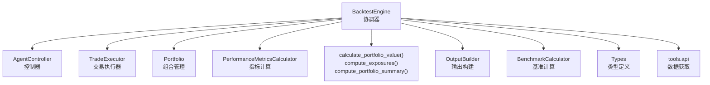
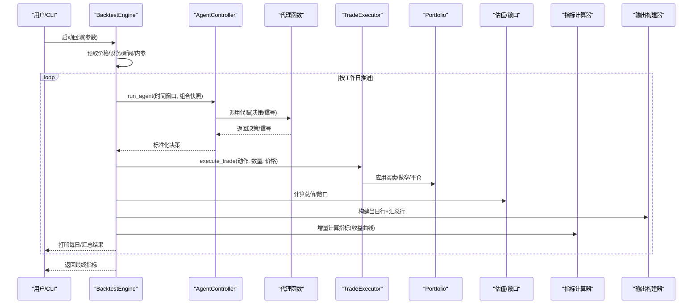
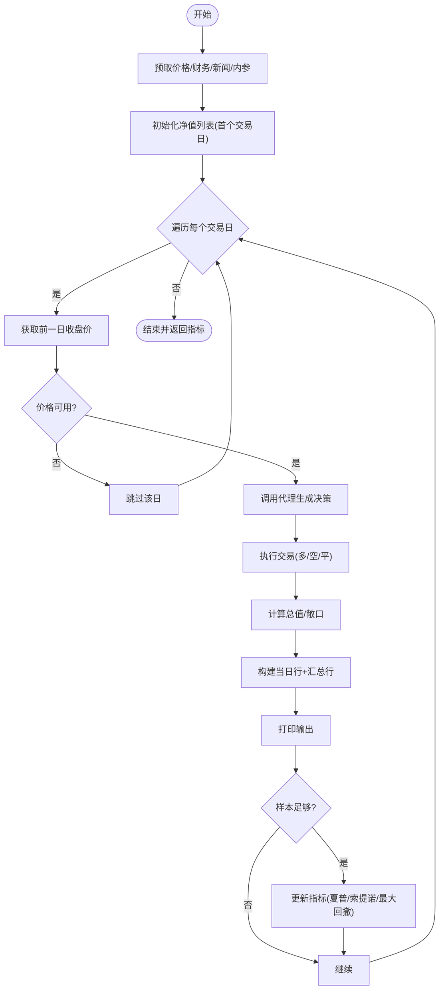
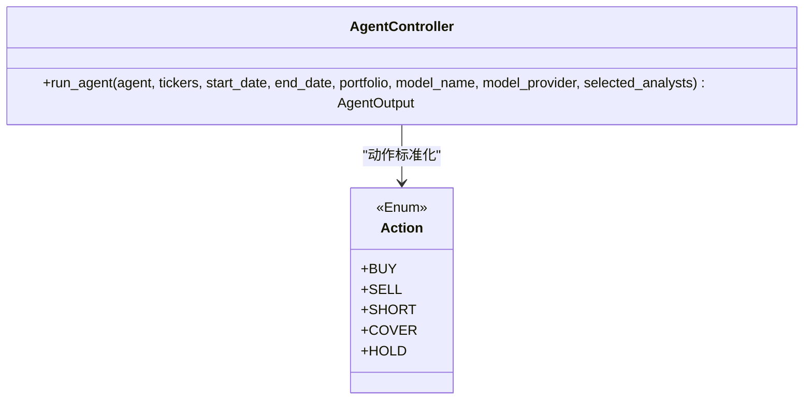
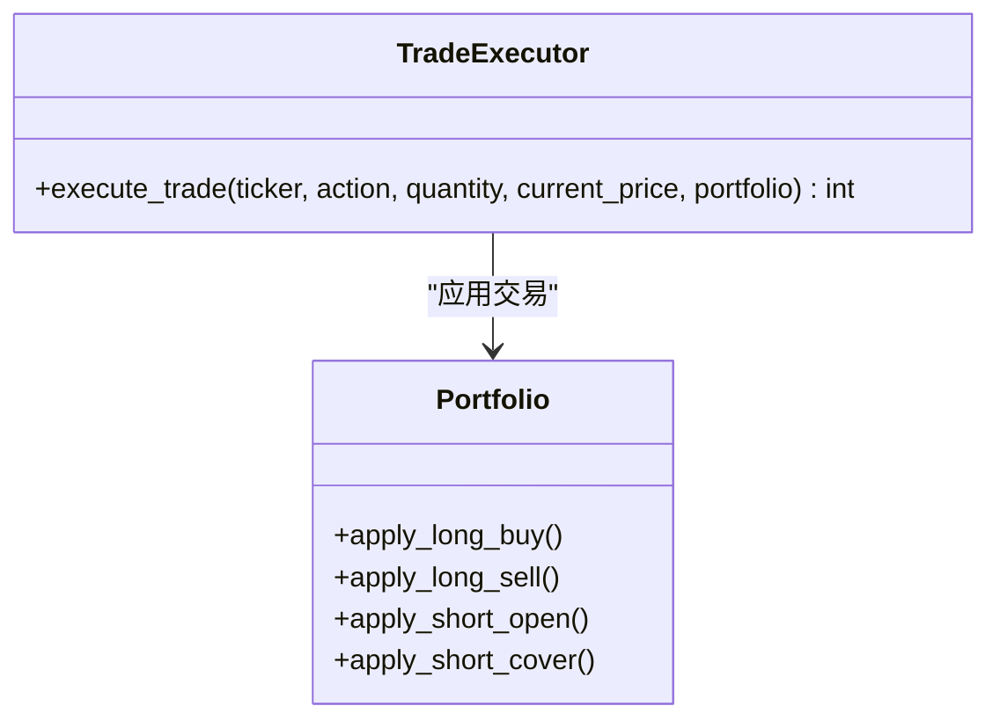
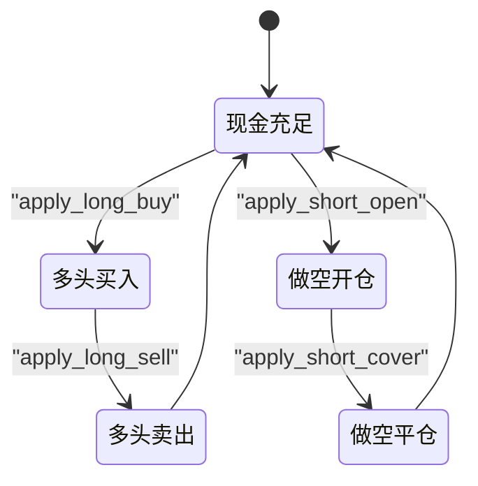
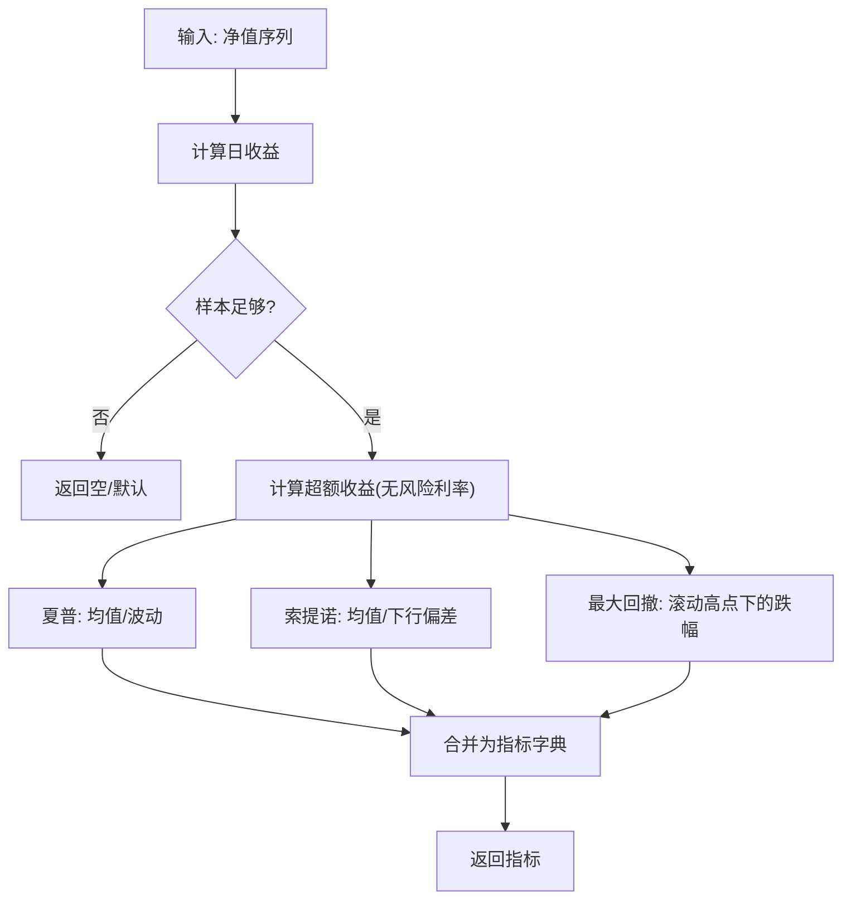
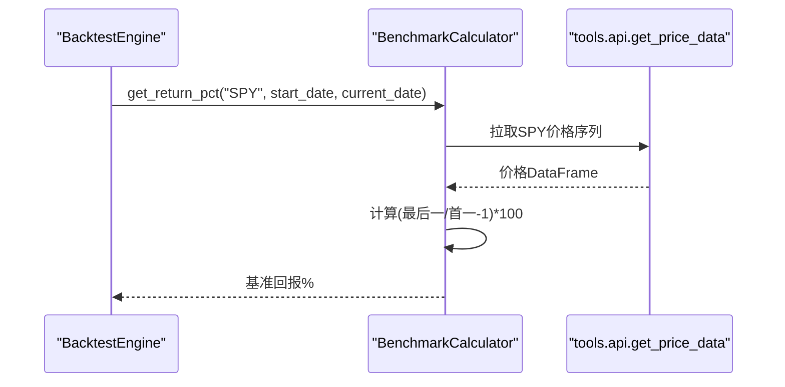
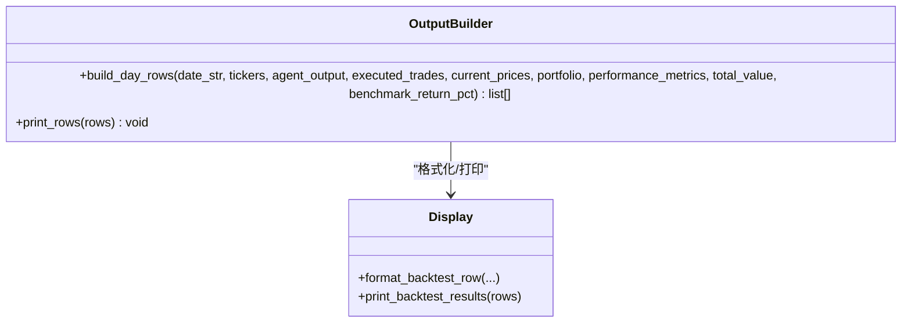
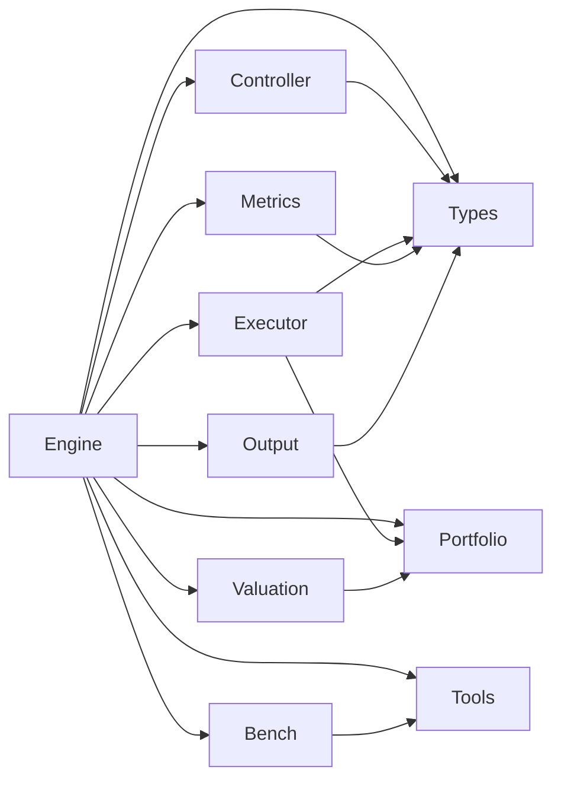

# 回测引擎扩展

<cite>
**本文引用的文件**
- [src/backtesting/engine.py](file://src/backtesting/engine.py)
- [src/backtesting/controller.py](file://src/backtesting/controller.py)
- [src/backtesting/metrics.py](file://src/backtesting/metrics.py)
- [src/backtesting/portfolio.py](file://src/backtesting/portfolio.py)
- [src/backtesting/trader.py](file://src/backtesting/trader.py)
- [src/backtesting/types.py](file://src/backtesting/types.py)
- [src/backtesting/benchmarks.py](file://src/backtesting/benchmarks.py)
- [src/backtesting/output.py](file://src/backtesting/output.py)
- [src/backtesting/valuation.py](file://src/backtesting/valuation.py)
- [src/backtester.py](file://src/backtester.py)
- [src/main.py](file://src/main.py)
- [src/cli/input.py](file://src/cli/input.py)
- [src/utils/display.py](file://src/utils/display.py)
- [tests/backtesting/test_metrics.py](file://tests/backtesting/test_metrics.py)
- [tests/backtesting/integration/test_integration_long_only.py](file://tests/backtesting/integration/test_integration_long_only.py)
</cite>

## 目录
1. [引言](#引言)
2. [项目结构](#项目结构)
3. [核心组件](#核心组件)
4. [架构总览](#架构总览)
5. [详细组件分析](#详细组件分析)
6. [依赖分析](#依赖分析)
7. [性能考虑](#性能考虑)
8. [故障排查指南](#故障排查指南)
9. [结论](#结论)
10. [附录：扩展示例与测试验证](#附录扩展示例与测试验证)

## 引言
本指南面向希望扩展“AI对冲基金”项目回测引擎的工程师，系统讲解BacktestEngine协调器、控制器模式与执行循环机制；详解如何新增性能指标（含公式、数据需求、实现与集成）；阐述新策略开发流程（接口定义、信号生成、风控集成、参数优化）；提供数据源扩展方法（新数据格式、API集成、数据校验）；并给出完整扩展示例与测试验证路径，覆盖现有指标体系（夏普比率、最大回撤、收益曲线等）与基准对比。

## 项目结构
回测子系统位于 src/backtesting 目录，围绕 BacktestEngine 协调器组织各模块：控制器负责标准化代理输出，交易执行器处理下单与头寸更新，组合管理器维护现金与头寸状态，估值模块计算总值与敞口，指标计算器产出收益曲线相关指标，输出构建器负责每日行与汇总行打印，基准计算器提供市场基准回报。

图表来源
- [src/backtesting/engine.py:27-195](file://src/backtesting/engine.py#L27-L195)
- [src/backtesting/controller.py:9-68](file://src/backtesting/controller.py#L9-L68)
- [src/backtesting/trader.py:7-40](file://src/backtesting/trader.py#L7-L40)
- [src/backtesting/portfolio.py:9-196](file://src/backtesting/portfolio.py#L9-L196)
- [src/backtesting/valuation.py:8-83](file://src/backtesting/valuation.py#L8-L83)
- [src/backtesting/metrics.py:8-78](file://src/backtesting/metrics.py#L8-L78)
- [src/backtesting/output.py:11-99](file://src/backtesting/output.py#L11-L99)
- [src/backtesting/benchmarks.py:8-33](file://src/backtesting/benchmarks.py#L8-L33)
- [src/backtesting/types.py:10-106](file://src/backtesting/types.py#L10-L106)

章节来源
- [src/backtesting/engine.py:27-195](file://src/backtesting/engine.py#L27-L195)
- [src/backtesting/controller.py:9-68](file://src/backtesting/controller.py#L9-L68)
- [src/backtesting/portfolio.py:9-196](file://src/backtesting/portfolio.py#L9-L196)
- [src/backtesting/trader.py:7-40](file://src/backtesting/trader.py#L7-L40)
- [src/backtesting/valuation.py:8-83](file://src/backtesting/valuation.py#L8-L83)
- [src/backtesting/metrics.py:8-78](file://src/backtesting/metrics.py#L8-L78)
- [src/backtesting/output.py:11-99](file://src/backtesting/output.py#L11-L99)
- [src/backtesting/benchmarks.py:8-33](file://src/backtesting/benchmarks.py#L8-L33)
- [src/backtesting/types.py:10-106](file://src/backtesting/types.py#L10-L106)

## 核心组件
- BacktestEngine：回测主循环，负责预取数据、逐日推进、调用代理、执行交易、估值与指标更新，并输出每日与汇总结果。
- AgentController：标准化代理输出，确保决策字典与分析师信号的兼容性。
- TradeExecutor：根据动作枚举执行买入/卖出/做空/平仓，委托 Portfolio 更新头寸与现金。
- Portfolio：维护现金、多/空头寸、成本基础、已实现损益与保证金占用。
- PerformanceMetricsCalculator：基于收益曲线计算夏普、索提诺、最大回撤等指标。
- BenchmarkCalculator：提供基准（如SPY）简单持有回报。
- OutputBuilder/valuation/display：将每日与汇总行格式化输出到终端。
- 类型系统（types.py）：统一 Action、决策、组合快照、指标等类型定义。

章节来源
- [src/backtesting/engine.py:27-195](file://src/backtesting/engine.py#L27-L195)
- [src/backtesting/controller.py:9-68](file://src/backtesting/controller.py#L9-L68)
- [src/backtesting/trader.py:7-40](file://src/backtesting/trader.py#L7-L40)
- [src/backtesting/portfolio.py:9-196](file://src/backtesting/portfolio.py#L9-L196)
- [src/backtesting/metrics.py:8-78](file://src/backtesting/metrics.py#L8-L78)
- [src/backtesting/benchmarks.py:8-33](file://src/backtesting/benchmarks.py#L8-L33)
- [src/backtesting/output.py:11-99](file://src/backtesting/output.py#L11-L99)
- [src/backtesting/valuation.py:8-83](file://src/backtesting/valuation.py#L8-L83)
- [src/backtesting/types.py:10-106](file://src/backtesting/types.py#L10-L106)

## 架构总览
回测采用“协调器-控制器-执行器-组合-指标-输出”的分层协作模式，数据流自上而下：Engine 驱动，Controller 调用代理，Executor 执行交易，Portfolio 状态变更，Valuation 计算价值与敞口，Metrics 基于收益曲线增量更新，Output/Benchmark 提供可视化与对比。

图表来源
- [src/backtesting/engine.py:96-195](file://src/backtesting/engine.py#L96-L195)
- [src/backtesting/controller.py:12-65](file://src/backtesting/controller.py#L12-L65)
- [src/backtesting/trader.py:10-37](file://src/backtesting/trader.py#L10-L37)
- [src/backtesting/valuation.py:8-51](file://src/backtesting/valuation.py#L8-L51)
- [src/backtesting/output.py:20-93](file://src/backtesting/output.py#L20-L93)
- [src/backtesting/metrics.py:22-75](file://src/backtesting/metrics.py#L22-L75)

## 详细组件分析

### BacktestEngine 协调器
- 职责：初始化组合、执行器、控制器、指标计算器、输出构建器与基准计算器；预取所需数据；按工作日推进主循环；收集每日净值与指标。
- 关键点：
  - 预取：为标的与SPY提前拉取价格序列，保证收益曲线与基准可计算。
  - 循环：逐日获取前一日收盘价，若缺失则跳过；否则调用代理生成决策，执行交易，计算总值与敞口，构建输出行，最后在足够样本后更新指标。
  - 指标时机：在有足够样本后再计算，避免早期波动异常影响。

图表来源
- [src/backtesting/engine.py:96-195](file://src/backtesting/engine.py#L96-L195)

章节来源
- [src/backtesting/engine.py:27-195](file://src/backtesting/engine.py#L27-L195)

### AgentController 控制器模式
- 职责：将代理返回的任意决策结构标准化为统一的 AgentOutput，确保动作枚举与数量数值化，保留原始分析师信号。
- 关键点：对缺失或非法字段进行安全降级，避免后续流程中断。

图表来源
- [src/backtesting/controller.py:12-65](file://src/backtesting/controller.py#L12-L65)
- [src/backtesting/types.py:10-18](file://src/backtesting/types.py#L10-L18)

章节来源
- [src/backtesting/controller.py:9-68](file://src/backtesting/controller.py#L9-L68)
- [src/backtesting/types.py:10-18](file://src/backtesting/types.py#L10-L18)

### TradeExecutor 执行循环
- 职责：将动作字符串映射为枚举，委托 Portfolio 完成实际交易，返回成交数量。
- 支持动作：买入、卖出、做空、平仓、持有。

图表来源
- [src/backtesting/trader.py:10-37](file://src/backtesting/trader.py#L10-L37)
- [src/backtesting/portfolio.py:82-195](file://src/backtesting/portfolio.py#L82-L195)

章节来源
- [src/backtesting/trader.py:7-40](file://src/backtesting/trader.py#L7-L40)
- [src/backtesting/portfolio.py:9-196](file://src/backtesting/portfolio.py#L9-L196)

### Portfolio 组合状态管理
- 负责：现金、多/空头寸、成本基础、已实现损益、保证金占用与要求。
- 交易语义：
  - 多头买入：检查现金是否充足，更新成本基础与份额。
  - 多头卖出：按成本基础计算已实现损益，减少头寸并增加现金。
  - 做空开仓：按保证金要求扣减可用现金，记录短期成本与保证金占用。
  - 做空平仓：按平仓比例释放部分保证金，计算已实现损益并减少头寸。

图表来源
- [src/backtesting/portfolio.py:82-195](file://src/backtesting/portfolio.py#L82-L195)

章节来源
- [src/backtesting/portfolio.py:9-196](file://src/backtesting/portfolio.py#L9-L196)

### 性能指标计算（夏普/索提诺/最大回撤）
- 输入：按日期排序的净值序列（PortfolioValuePoint）。
- 计算要点：
  - 日收益 = pct_change(净值)，剔除空值。
  - 夏普 = sqrt(年化) * 平均超额收益 / 日超额收益标准差；当波动为0时设为0。
  - 索提诺 = sqrt(年化) * 平均超额收益 / 下行偏差；下行偏差基于负向超额收益。
  - 最大回撤 = (当前净值 - 迄今最高净值) / 迄今最高净值；记录最大回撤日期。
- 输出：包含夏普、索提诺、最大回撤及日期。

图表来源
- [src/backtesting/metrics.py:22-75](file://src/backtesting/metrics.py#L22-L75)

章节来源
- [src/backtesting/metrics.py:8-78](file://src/backtesting/metrics.py#L8-L78)
- [tests/backtesting/test_metrics.py:24-53](file://tests/backtesting/test_metrics.py#L24-L53)

### 基准计算器（SPY 对比）
- 功能：给定起止日期，返回基准（如SPY）的简单持有回报百分比；若数据不可用则返回None。

图表来源
- [src/backtesting/benchmarks.py:9-31](file://src/backtesting/benchmarks.py#L9-L31)
- [src/backtesting/engine.py:176-176](file://src/backtesting/engine.py#L176-L176)

章节来源
- [src/backtesting/benchmarks.py:8-33](file://src/backtesting/benchmarks.py#L8-L33)
- [src/backtesting/engine.py:96-195](file://src/backtesting/engine.py#L96-L195)

### 输出与可视化（每日行/汇总行）
- OutputBuilder：接收当日决策、成交、价格、组合状态与指标，组装每日行与汇总行；调用 display.format_backtest_row/format_backtest_summary/format_backtest_row 生成表格行。
- display.print_backtest_results：清屏并打印最新汇总与当日明细表。

图表来源
- [src/backtesting/output.py:20-97](file://src/backtesting/output.py#L20-L97)
- [src/utils/display.py:257-396](file://src/utils/display.py#L257-L396)

章节来源
- [src/backtesting/output.py:11-99](file://src/backtesting/output.py#L11-L99)
- [src/utils/display.py:257-396](file://src/utils/display.py#L257-L396)

### 估值与敞口（总值/多/空/净/总敞口/多空比）
- calculate_portfolio_value：现金 + 多头市值 - 空头市值。
- compute_exposures：分别累加多/空头市值，计算总/净敞口与多空比。
- compute_portfolio_summary：从组合与指标中提取汇总字段（总值、回报率、现金、持仓总值、指标）。

章节来源
- [src/backtesting/valuation.py:8-83](file://src/backtesting/valuation.py#L8-L83)

## 依赖分析
- 组件内聚：各模块职责清晰，Engine 作为协调者，其余模块均为纯函数或轻量类，便于测试与替换。
- 组件耦合：
  - Engine 依赖 Controller/Executor/Portfolio/Metrics/Valuation/Output/Benchmark/Types/Tools。
  - Controller 仅依赖 types 与 Portfolio 快照。
  - Trader 依赖 Portfolio 与 Action。
  - Metrics/Valuation/Output 保持无副作用，利于单元测试。
- 外部依赖：工具API（价格/财务/新闻/内参）、pandas/numpy、颜色输出与表格打印。

图表来源
- [src/backtesting/engine.py:9-16](file://src/backtesting/engine.py#L9-L16)
- [src/backtesting/controller.py:5-6](file://src/backtesting/controller.py#L5-L6)
- [src/backtesting/trader.py:3-4](file://src/backtesting/trader.py#L3-L4)
- [src/backtesting/portfolio.py:6-6](file://src/backtesting/portfolio.py#L6-L6)
- [src/backtesting/metrics.py:5-5](file://src/backtesting/metrics.py#L5-L5)
- [src/backtesting/valuation.py:5-5](file://src/backtesting/valuation.py#L5-L5)
- [src/backtesting/output.py:6-8](file://src/backtesting/output.py#L6-L8)
- [src/backtesting/benchmarks.py:5-5](file://src/backtesting/benchmarks.py#L5-L5)
- [src/backtesting/types.py:3-7](file://src/backtesting/types.py#L3-L7)

## 性能考虑
- 数据预取：在回测开始前批量拉取所需历史数据，避免运行期频繁IO。
- 向量化计算：指标计算使用pandas/numpy，尽量批量操作，减少Python循环。
- 样本阈值：指标在样本不足时跳过计算，避免早期噪声干扰。
- 内存与序列：每日净值列表随时间增长，注意在长跨度回测中的内存占用。

## 故障排查指南
- 代理输出异常：确认 AgentController 已将动作标准化为枚举，数量转为浮点数；若为空或非法，将被置为默认值。
- 价格缺失：若某日无法获取前一日收盘价，Engine 将跳过该日，确保收益曲线连续性。
- 交易未成交：当数量为None或<=0，或资金/保证金不足时，执行器返回0成交。
- 指标为空：样本过少或净值列缺失时，指标返回None；可在UI层显示占位符。
- 中断回测：支持键盘中断，打印部分结果摘要（初始/最终净值与总回报）。

章节来源
- [src/backtesting/controller.py:40-65](file://src/backtesting/controller.py#L40-L65)
- [src/backtesting/engine.py:114-131](file://src/backtesting/engine.py#L114-L131)
- [src/backtesting/trader.py:18-37](file://src/backtesting/trader.py#L18-L37)
- [src/backtester.py:13-40](file://src/backtester.py#L13-L40)

## 结论
该回测系统通过明确的分层与类型约束，提供了可扩展的指标、输出与基准框架。新增指标、策略与数据源的关键在于：遵循类型契约、最小化副作用、在 Engine 的合适时机插入计算与输出，并辅以充分的单元与集成测试。

## 附录：扩展示例与测试验证

### 新增性能指标（以“胜率”为例）
- 指标含义：盈利交易次数 / 总交易次数（按成交数量>0的交易日统计）。
- 数据需求：需要每日成交数量与当日回报（可由净值变化推导）。
- 实现步骤：
  1) 在指标计算类中新增方法，接收每日净值与成交序列，返回指标字典。
  2) 在 Engine 的指标更新阶段调用新方法并合并入性能指标字典。
  3) 在 OutputBuilder/valuation/display 中将新指标纳入汇总行与打印。
- 测试建议：
  - 单元测试：构造不同盈亏分布的净值序列，验证胜率计算正确性。
  - 集成测试：在现有长多头策略上运行，验证指标与交易行为一致。

章节来源
- [src/backtesting/metrics.py:22-75](file://src/backtesting/metrics.py#L22-L75)
- [src/backtesting/engine.py:184-187](file://src/backtesting/engine.py#L184-L187)
- [src/backtesting/output.py:64-91](file://src/backtesting/output.py#L64-L91)
- [src/utils/display.py:333-396](file://src/utils/display.py#L333-L396)

### 新策略开发流程
- 接口定义：策略函数需接受 tickers、start_date、end_date、portfolio（快照）、model_name、model_provider、selected_analysts 等参数，返回包含 decisions 与 analyst_signals 的字典。
- 信号生成：可复用现有代理节点（如技术面/基本面/新闻情绪），或新增自定义节点。
- 风险控制集成：在代理链末端接入风险管理员，限制单/跨品种集中度、止损止盈、最大回撤等。
- 参数优化：通过 CLI 输入初始资金、保证金比例、模型选择等；可扩展为网格/贝叶斯优化脚本驱动多次回测并汇总指标。

章节来源
- [src/backtesting/controller.py:12-65](file://src/backtesting/controller.py#L12-L65)
- [src/main.py:100-131](file://src/main.py#L100-L131)
- [src/cli/input.py:227-286](file://src/cli/input.py#L227-L286)

### 数据源扩展指南
- 新数据格式支持：
  - 在 tools.api 中新增适配器函数，返回标准化的 DataFrame（包含日期与价格序列）。
  - 在 BacktestEngine._prefetch_data 或按需拉取处调用新函数。
- API 集成方法：
  - 统一错误处理与空值判断，返回空DataFrame或None，Engine 将跳过该日。
  - 保证日期范围与频率满足回测需求（工作日）。
- 数据验证机制：
  - 校验首尾价格非空；若缺失，尝试回溯最后一个有效值。
  - 单元测试覆盖空数据、异常抛出、边界日期等情况。

章节来源
- [src/backtesting/engine.py:81-94](file://src/backtesting/engine.py#L81-L94)
- [src/backtesting/benchmarks.py:9-31](file://src/backtesting/benchmarks.py#L9-L31)

### 基准测试扩展方法
- 当前：仅支持SPY简单持有回报。
- 扩展建议：
  - 新增多基准（如行业ETF、因子指数）；在 Engine 中按需拉取并比较。
  - 输出中增加基准列，显示相对表现（超额回报）。

章节来源
- [src/backtesting/benchmarks.py:9-31](file://src/backtesting/benchmarks.py#L9-L31)
- [src/backtesting/engine.py:176-176](file://src/backtesting/engine.py#L176-L176)

### 测试验证方法
- 指标测试：参考单元测试，构造不同场景（零波动、有波动、仅一天数据）验证指标返回。
- 集成测试：参考长多头策略测试，验证头寸、已实现损益、成本基础、最终净值与汇总一致性。

章节来源
- [tests/backtesting/test_metrics.py:24-53](file://tests/backtesting/test_metrics.py#L24-L53)
- [tests/backtesting/integration/test_integration_long_only.py:4-403](file://tests/backtesting/integration/test_integration_long_only.py#L4-L403)