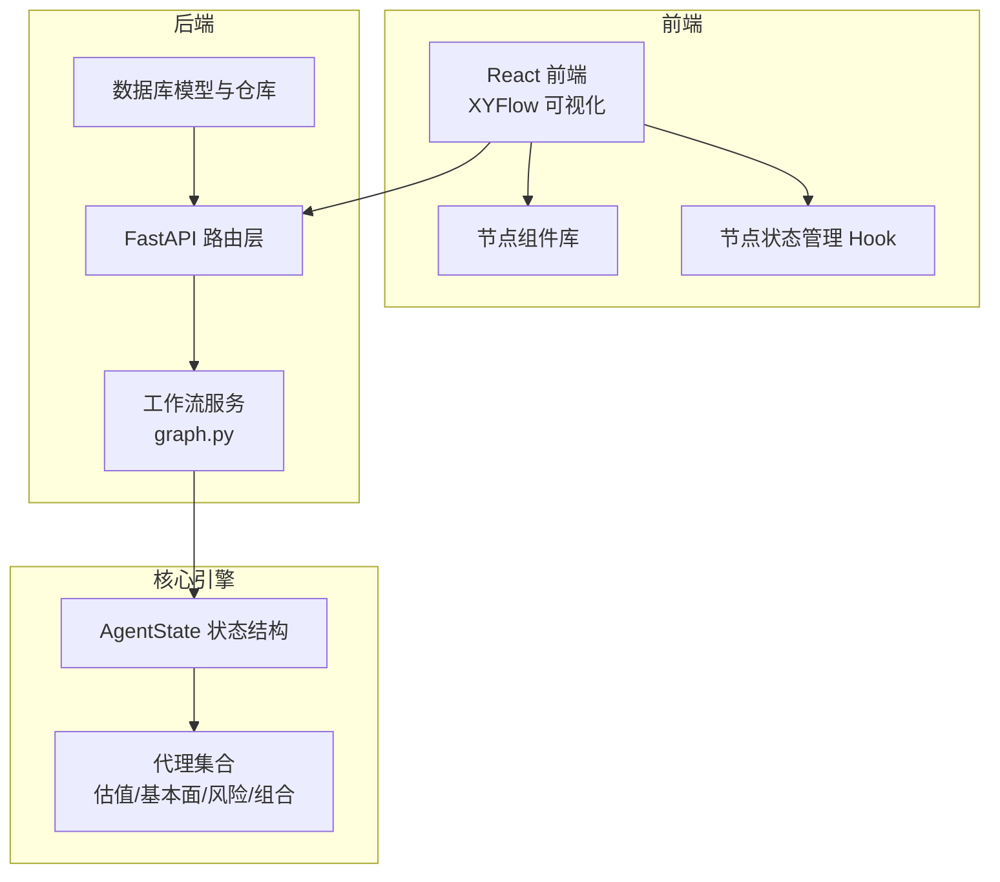
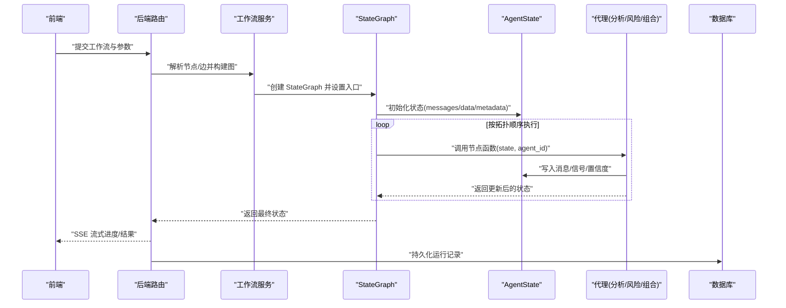
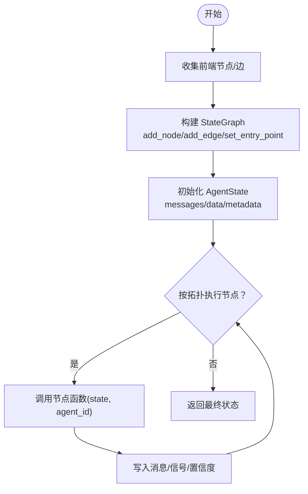
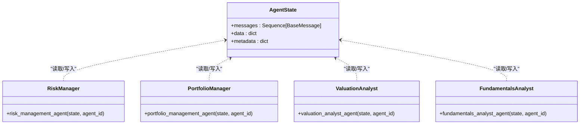
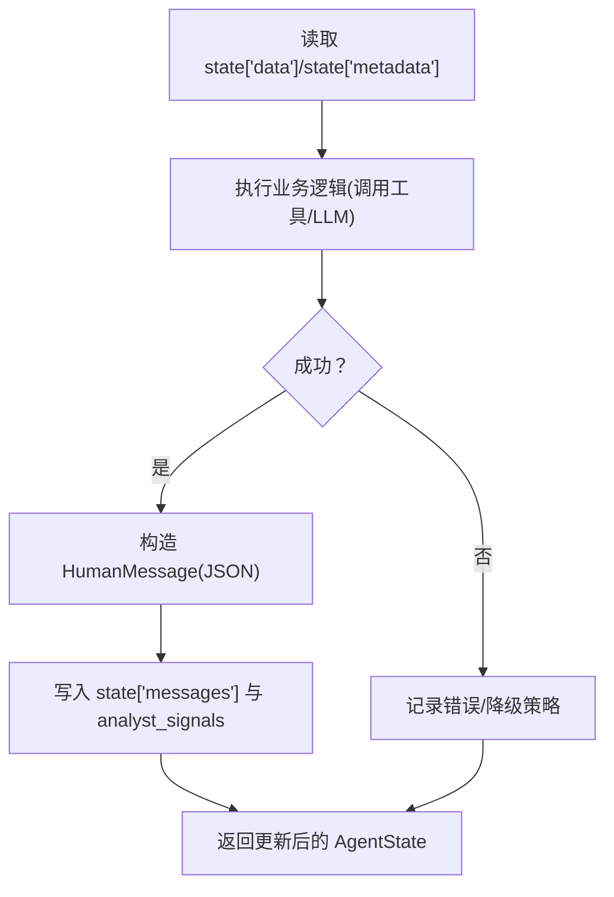
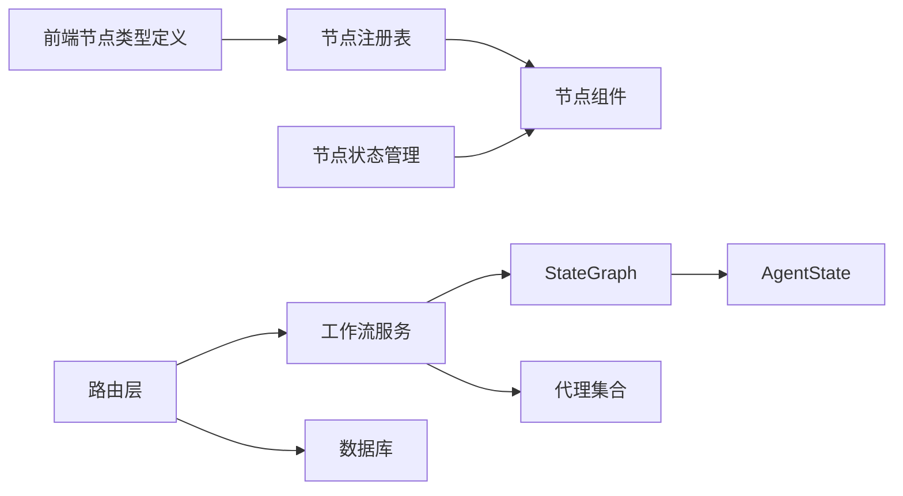

# 工作流扩展

<cite>
**本文引用的文件**
- [app/backend/services/graph.py](file://app/backend/services/graph.py)
- [src/graph/state.py](file://src/graph/state.py)
- [src/utils/analysts.py](file://src/utils/analysts.py)
- [src/agents/portfolio_manager.py](file://src/agents/portfolio_manager.py)
- [src/agents/risk_manager.py](file://src/agents/risk_manager.py)
- [src/agents/valuation.py](file://src/agents/valuation.py)
- [src/agents/fundamentals.py](file://src/agents/fundamentals.py)
- [app/backend/routes/flows.py](file://app/backend/routes/flows.py)
- [app/backend/routes/flow_runs.py](file://app/backend/routes/flow_runs.py)
- [app/backend/routes/hedge_fund.py](file://app/backend/routes/hedge_fund.py)
- [app/frontend/src/nodes/index.ts](file://app/frontend/src/nodes/index.ts)
- [app/frontend/src/nodes/types.ts](file://app/frontend/src/nodes/types.ts)
- [app/frontend/src/nodes/components/agent-node.tsx](file://app/frontend/src/nodes/components/agent-node.tsx)
- [app/frontend/src/nodes/components/investment-report-node.tsx](file://app/frontend/src/nodes/components/investment-report-node.tsx)
- [app/frontend/src/hooks/use-node-state.ts](file://app/frontend/src/hooks/use-node-state.ts)
- [app/frontend/src/components/panels/bottom/tabs/output-tab-utils.ts](file://app/frontend/src/components/panels/bottom/tabs/output-tab-utils.ts)
</cite>

## 目录
1. [简介](#简介)
2. [项目结构](#项目结构)
3. [核心组件](#核心组件)
4. [架构总览](#架构总览)
5. [详细组件分析](#详细组件分析)
6. [依赖关系分析](#依赖关系分析)
7. [性能考虑](#性能考虑)
8. [故障排查指南](#故障排查指南)
9. [结论](#结论)
10. [附录](#附录)

## 简介
本指南面向希望扩展与定制“AI对冲基金”工作流系统的工程师与架构师。文档围绕基于 LangGraph 的 StateGraph 工作流引擎展开，系统讲解节点类型定义、边连接规则、状态传播机制与执行控制逻辑；并提供自定义节点的创建流程（类继承、输入输出、执行逻辑与错误处理）、消息传递系统（格式、路由、优先级与异步执行）、API 扩展（路由、校验、响应与中间件集成），以及调试与性能优化建议。同时覆盖现有节点类型（分析节点、风险节点、组合节点、报告节点）的扩展方法与自定义节点实现模式。

## 项目结构
该系统采用前后端分离架构：
- 后端（FastAPI + SQLAlchemy）：负责工作流编排、运行调度、数据库持久化与 API 路由。
- 前端（React + TypeScript + XYFlow）：负责工作流可视化编辑、节点渲染、状态展示与交互。
- 核心引擎（LangGraph + 自定义代理）：在后端侧通过 StateGraph 组织节点执行，使用共享状态在节点间传递消息与数据。

图表来源
- [app/backend/services/graph.py:36-129](file://app/backend/services/graph.py#L36-L129)
- [src/graph/state.py:15-18](file://src/graph/state.py#L15-L18)
- [src/utils/analysts.py:24-178](file://src/utils/analysts.py#L24-L178)

章节来源
- [app/backend/services/graph.py:36-129](file://app/backend/services/graph.py#L36-L129)
- [src/graph/state.py:15-18](file://src/graph/state.py#L15-L18)
- [src/utils/analysts.py:24-178](file://src/utils/analysts.py#L24-L178)

## 核心组件
- StateGraph 工作流引擎
  - 使用 LangGraph 的 StateGraph 定义节点与边，并以 AgentState 作为全局状态容器。
  - 通过 create_graph 将前端导出的节点/边结构转换为可执行图，自动注入起始节点、分析师节点、风险节点与组合节点，并建立从分析师到风险节点再到组合节点的路由。
- AgentState 状态结构
  - 包含 messages（消息序列）、data（字典合并）、metadata（字典合并），支持多轮对话与跨节点状态共享。
- 代理（Agent）集合
  - 风险管理代理：基于波动率与相关性计算头寸限额与风险调整后的头寸限制。
  - 组合管理代理：聚合各分析师信号，结合账户约束生成交易决策。
  - 分析代理：估值分析、基本面分析等，向状态写入信号与置信度。
- 前端节点组件
  - AgentNode、InvestmentReportNode 等，负责渲染节点 UI、状态展示与交互。
  - use-node-state 提供按 FlowId 隔离的节点状态管理。

章节来源
- [app/backend/services/graph.py:36-129](file://app/backend/services/graph.py#L36-L129)
- [src/graph/state.py:15-18](file://src/graph/state.py#L15-L18)
- [src/agents/risk_manager.py:11-219](file://src/agents/risk_manager.py#L11-L219)
- [src/agents/portfolio_manager.py:25-93](file://src/agents/portfolio_manager.py#L25-L93)
- [src/agents/valuation.py:21-220](file://src/agents/valuation.py#L21-L220)
- [src/agents/fundamentals.py:11-163](file://src/agents/fundamentals.py#L11-L163)
- [app/frontend/src/nodes/components/agent-node.tsx:18-147](file://app/frontend/src/nodes/components/agent-node.tsx#L18-L147)
- [app/frontend/src/nodes/components/investment-report-node.tsx:14-75](file://app/frontend/src/nodes/components/investment-report-node.tsx#L14-L75)
- [app/frontend/src/hooks/use-node-state.ts:7-131](file://app/frontend/src/hooks/use-node-state.ts#L7-L131)

## 架构总览
下图展示了从前端工作流编辑到后端执行、状态传播与结果回传的全链路：

图表来源
- [app/backend/services/graph.py:132-177](file://app/backend/services/graph.py#L132-L177)
- [src/graph/state.py:15-18](file://src/graph/state.py#L15-L18)
- [app/backend/routes/hedge_fund.py:86-115](file://app/backend/routes/hedge_fund.py#L86-L115)

章节来源
- [app/backend/services/graph.py:132-177](file://app/backend/services/graph.py#L132-L177)
- [app/backend/routes/hedge_fund.py:86-115](file://app/backend/routes/hedge_fund.py#L86-L115)

## 详细组件分析

### StateGraph 工作流引擎设计
- 节点类型与命名
  - 起始节点："start_node"
  - 分析节点：来源于 ANALYST_CONFIG 的键映射，节点名形如 "{key}_agent"，函数来自配置项 agent_func。
  - 风险节点：每个组合节点对应一个唯一风险节点，命名为 "risk_management_agent_{suffix}"。
  - 组合节点：portfolio_manager，接收风险节点信号并生成交易决策。
- 边连接规则
  - 起始节点仅连接无入边的分析师节点。
  - 分析师直接连接至其对应的风控节点，而非直接连接组合节点。
  - 风控节点再连接至其对应的组合节点。
  - 组合节点连接至 END。
- 状态传播机制
  - 每个节点通过返回新的 AgentState 更新全局状态，messages 用于消息传递，data 用于共享数据（如 tickers、portfolio、analyst_signals），metadata 用于控制（如 show_reasoning、模型选择）。
- 执行控制逻辑
  - 异步执行：run_graph_async 使用线程池避免阻塞事件循环。
  - 进度与断连：后端通过 SSE 流式推送进度，检测客户端断连时取消任务。

图表来源
- [app/backend/services/graph.py:36-129](file://app/backend/services/graph.py#L36-L129)
- [src/graph/state.py:15-18](file://src/graph/state.py#L15-L18)

章节来源
- [app/backend/services/graph.py:36-129](file://app/backend/services/graph.py#L36-L129)
- [src/graph/state.py:15-18](file://src/graph/state.py#L15-L18)

### AgentState 数据模型与消息格式
- 数据结构
  - messages：BaseMessage 序列，支持拼接合并。
  - data：字典合并，承载 tickers、portfolio、analyst_signals、当前价格等。
  - metadata：字典合并，承载 show_reasoning、model_name、model_provider、request 等。
- 消息格式规范
  - 节点通过 HumanMessage 写入内容（通常为 JSON 字符串），name 字段标识 agent_id。
  - analyst_signals 以 agent_id 为键存储各节点输出的信号与置信度。
- 路由规则
  - 起始节点 → 无入边分析师节点
  - 分析师 → 对应风险节点
  - 风险节点 → 对应组合节点
  - 组合节点 → END
- 优先级与异步执行
  - 前端输出节点根据连接状态与运行状态显示“进行中/空闲”，并按固定优先级排序输出（风控与组合节点靠后）。
  - 后端通过 asyncio.run_in_executor 实现异步执行，SSE 推送进度。

图表来源
- [src/graph/state.py:15-18](file://src/graph/state.py#L15-L18)
- [src/agents/risk_manager.py:11-219](file://src/agents/risk_manager.py#L11-L219)
- [src/agents/portfolio_manager.py:25-93](file://src/agents/portfolio_manager.py#L25-L93)
- [src/agents/valuation.py:21-220](file://src/agents/valuation.py#L21-L220)
- [src/agents/fundamentals.py:11-163](file://src/agents/fundamentals.py#L11-L163)

章节来源
- [src/graph/state.py:15-18](file://src/graph/state.py#L15-L18)
- [src/agents/risk_manager.py:11-219](file://src/agents/risk_manager.py#L11-L219)
- [src/agents/portfolio_manager.py:25-93](file://src/agents/portfolio_manager.py#L25-L93)
- [src/agents/valuation.py:21-220](file://src/agents/valuation.py#L21-L220)
- [src/agents/fundamentals.py:11-163](file://src/agents/fundamentals.py#L11-L163)

### 自定义节点扩展指南
- 节点类继承与输入输出
  - 节点函数签名：接受 AgentState 与 agent_id，返回新的 AgentState（包含 messages 与 data 更新）。
  - 输入：从 state["data"] 与 state["metadata"] 读取 tickers、portfolio、日期范围、模型信息等。
  - 输出：通过 HumanMessage 写入 JSON 字符串，name 为 agent_id；同时可更新 analyst_signals。
- 执行逻辑实现
  - 读取必要数据（如价格、财务指标）。
  - 计算信号与置信度，构造消息。
  - 可选：开启 show_reasoning 输出推理摘要。
- 错误处理机制
  - API 层统一捕获异常并返回 HTTP 错误。
  - 解析器对 JSON 响应进行容错处理，避免崩溃。
  - 前端节点状态管理提供隔离与清理能力，便于调试。

图表来源
- [src/agents/valuation.py:21-220](file://src/agents/valuation.py#L21-L220)
- [src/agents/fundamentals.py:11-163](file://src/agents/fundamentals.py#L11-L163)
- [app/backend/services/graph.py:180-193](file://app/backend/services/graph.py#L180-L193)

章节来源
- [src/agents/valuation.py:21-220](file://src/agents/valuation.py#L21-L220)
- [src/agents/fundamentals.py:11-163](file://src/agents/fundamentals.py#L11-L163)
- [app/backend/services/graph.py:180-193](file://app/backend/services/graph.py#L180-L193)

### 消息传递系统
- 消息格式
  - JSON 字符串，包含信号、置信度、推理细节等。
  - HumanMessage.name 作为 agent_id，便于后续路由与调试。
- 路由规则
  - 起始节点 → 无入边分析师 → 风控 → 组合 → 结束。
- 优先级处理
  - 输出节点按“风控/组合靠后、其他靠前”的优先级排序，同优先级按时间戳升序排列。
- 异步执行模式
  - 后端使用 run_in_executor 与 asyncio 事件循环配合，SSE 流式推送进度，支持客户端断连取消。

章节来源
- [app/backend/services/graph.py:132-177](file://app/backend/services/graph.py#L132-L177)
- [app/backend/routes/hedge_fund.py:86-115](file://app/backend/routes/hedge_fund.py#L86-L115)
- [app/frontend/src/components/panels/bottom/tabs/output-tab-utils.ts:79-104](file://app/frontend/src/components/panels/bottom/tabs/output-tab-utils.ts#L79-L104)

### API 扩展指南
- 新路由添加
  - 在 FastAPI 路由模块中定义新路径、请求体与响应体。
  - 使用 Pydantic 模型进行请求/响应校验。
- 请求验证
  - 使用 Depends(get_db) 注入数据库会话。
  - 对不存在资源返回 404，异常统一捕获并返回 500。
- 响应格式
  - 使用 ORM 模型转 Pydantic 模型，确保字段一致与安全。
- 中间件集成
  - 可在路由层增加日志、限流或鉴权中间件（示例未在本文展示具体实现，但可按 FastAPI 标准接入）。

章节来源
- [app/backend/routes/flows.py:18-42](file://app/backend/routes/flows.py#L18-L42)
- [app/backend/routes/flow_runs.py:20-51](file://app/backend/routes/flow_runs.py#L20-L51)

## 依赖关系分析
- 后端服务依赖
  - LangGraph StateGraph：定义图结构与执行。
  - 自定义代理：实现具体分析/风控/组合逻辑。
  - 数据库：持久化工作流与运行记录。
- 前端依赖
  - XYFlow：可视化编辑与渲染。
  - 自定义节点组件：AgentNode、InvestmentReportNode 等。
  - 状态管理 Hook：按 FlowId 隔离节点状态。

图表来源
- [app/frontend/src/nodes/types.ts:6-12](file://app/frontend/src/nodes/types.ts#L6-L12)
- [app/frontend/src/nodes/index.ts:52-59](file://app/frontend/src/nodes/index.ts#L52-L59)
- [app/backend/services/graph.py:36-129](file://app/backend/services/graph.py#L36-L129)
- [src/graph/state.py:15-18](file://src/graph/state.py#L15-L18)

章节来源
- [app/frontend/src/nodes/types.ts:6-12](file://app/frontend/src/nodes/types.ts#L6-L12)
- [app/frontend/src/nodes/index.ts:52-59](file://app/frontend/src/nodes/index.ts#L52-L59)
- [app/backend/services/graph.py:36-129](file://app/backend/services/graph.py#L36-L129)

## 性能考虑
- 并发与异步
  - 使用 run_in_executor 避免阻塞事件循环；SSE 流式推送减少长连接压力。
- 缓存与去重
  - 风险节点对价格与波动率计算结果进行缓存，避免重复 API 调用。
- 状态合并
  - 使用合并函数减少深拷贝开销，提升状态传播效率。
- 前端渲染
  - 输出节点按优先级与时间戳排序，减少不必要的重渲染。

[本节为通用指导，无需特定文件引用]

## 故障排查指南
- JSON 解析错误
  - 后端提供解析器对字符串进行容错处理，打印错误与原始响应以便定位。
- 代理执行失败
  - 代理内部提供默认工厂，当 LLM 返回异常时回退为持有策略，保证流程继续。
- 前端状态不一致
  - 使用 FlowStateManager 按 FlowId 隔离状态，支持清理与监听，便于调试。

章节来源
- [app/backend/services/graph.py:180-193](file://app/backend/services/graph.py#L180-L193)
- [src/agents/portfolio_manager.py:242-257](file://src/agents/portfolio_manager.py#L242-L257)
- [app/frontend/src/hooks/use-node-state.ts:69-112](file://app/frontend/src/hooks/use-node-state.ts#L69-L112)

## 结论
本系统以 LangGraph 为核心，通过清晰的状态模型与严格的节点路由规则，实现了可扩展、可观测、可调试的工作流引擎。通过标准化的节点接口、消息格式与 API 设计，开发者可以快速扩展新的分析/风控/组合节点，并在前后端协同下完成复杂的投资决策流程。建议在新增节点时遵循统一的输入输出约定与错误处理策略，确保整体稳定性与一致性。

[本节为总结，无需特定文件引用]

## 附录

### 现有节点类型扩展方法
- 分析节点（估值/基本面）
  - 在 ANALYST_CONFIG 中新增条目，指定 display_name、description、investing_style、agent_func、type、order。
  - 实现对应代理函数，遵循 AgentState 输入输出约定。
- 风险节点
  - 与组合节点一一对应，按组合节点的后缀生成唯一风险节点 ID。
  - 在 create_graph 中自动注入，无需手动连接。
- 组合节点
  - 从风险节点信号聚合，结合账户约束生成交易决策。
  - 支持 show_reasoning 输出推理摘要。

章节来源
- [src/utils/analysts.py:24-178](file://src/utils/analysts.py#L24-L178)
- [app/backend/services/graph.py:68-125](file://app/backend/services/graph.py#L68-L125)
- [src/agents/risk_manager.py:11-219](file://src/agents/risk_manager.py#L11-L219)
- [src/agents/portfolio_manager.py:25-93](file://src/agents/portfolio_manager.py#L25-L93)

### 自定义节点实现模式
- 类继承与接口
  - 节点函数签名：(state: AgentState, agent_id: str) -> AgentState
  - 输入：从 state["data"] 与 state["metadata"] 读取所需数据
  - 输出：HumanMessage(JSON) + 更新 analyst_signals
- 前端集成
  - 在前端节点类型定义与注册表中声明新节点类型，编写对应组件并接入状态管理 Hook。

章节来源
- [src/agents/valuation.py:21-220](file://src/agents/valuation.py#L21-L220)
- [src/agents/fundamentals.py:11-163](file://src/agents/fundamentals.py#L11-L163)
- [app/frontend/src/nodes/types.ts:6-12](file://app/frontend/src/nodes/types.ts#L6-L12)
- [app/frontend/src/nodes/index.ts:52-59](file://app/frontend/src/nodes/index.ts#L52-L59)