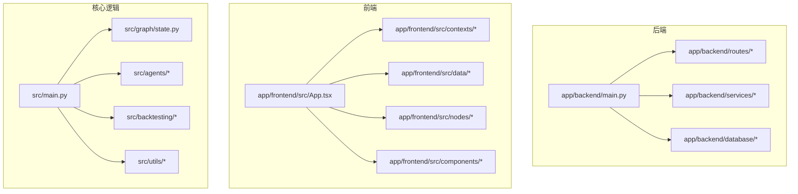
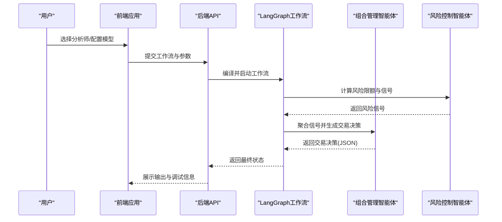
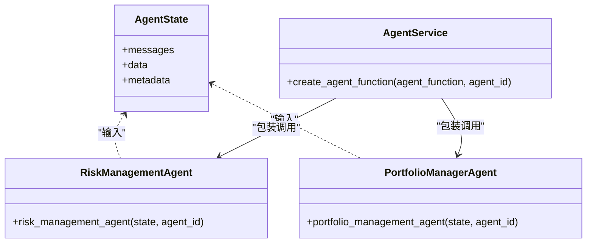
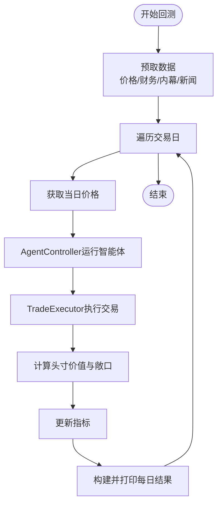
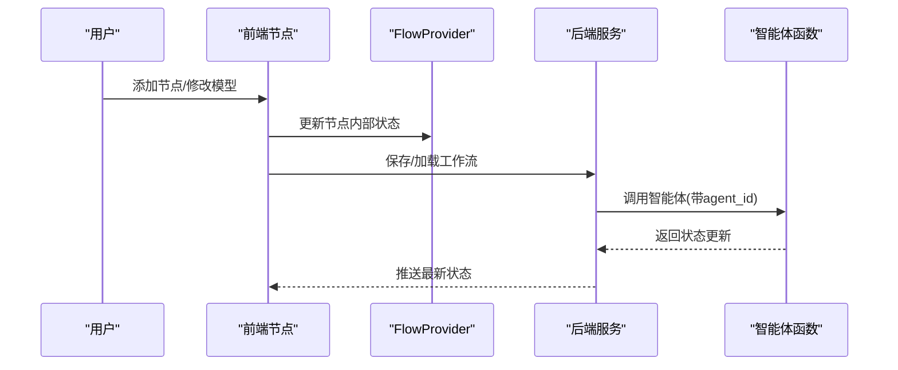
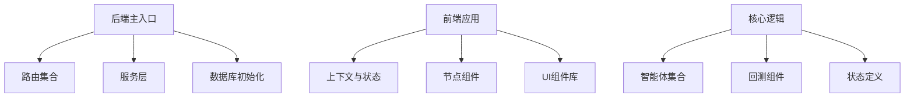

# 扩展开发指南

<cite>
**本文引用的文件**
- [src/main.py](file://src/main.py)
- [src/graph/state.py](file://src/graph/state.py)
- [src/utils/analysts.py](file://src/utils/analysts.py)
- [src/agents/portfolio_manager.py](file://src/agents/portfolio_manager.py)
- [src/agents/risk_manager.py](file://src/agents/risk_manager.py)
- [src/backtesting/engine.py](file://src/backtesting/engine.py)
- [src/backtesting/controller.py](file://src/backtesting/controller.py)
- [src/backtesting/metrics.py](file://src/backtesting/metrics.py)
- [src/backtesting/portfolio.py](file://src/backtesting/portfolio.py)
- [src/backtesting/trader.py](file://src/backtesting/trader.py)
- [app/backend/main.py](file://app/backend/main.py)
- [app/backend/services/agent_service.py](file://app/backend/services/agent_service.py)
- [app/frontend/src/data/node-mappings.ts](file://app/frontend/src/data/node-mappings.ts)
- [app/frontend/src/nodes/components/agent-node.tsx](file://app/frontend/src/nodes/components/agent-node.tsx)
- [app/frontend/src/contexts/flow-context.tsx](file://app/frontend/src/contexts/flow-context.tsx)
</cite>

## 目录
1. [简介](#简介)
2. [项目结构](#项目结构)
3. [核心组件](#核心组件)
4. [架构总览](#架构总览)
5. [详细组件分析](#详细组件分析)
6. [依赖分析](#依赖分析)
7. [性能考虑](#性能考虑)
8. [故障排查指南](#故障排查指南)
9. [结论](#结论)
10. [附录](#附录)

## 简介
本指南面向希望在该AI对冲基金系统中进行扩展开发的工程师，涵盖以下四大方向：
- 智能体分析器扩展：如何新增分析师智能体（继承与接口约定、配置与注册机制）
- 回测引擎扩展：如何新增指标、策略、数据源与评估方法
- 工作流扩展：如何新增节点类型、状态管理、消息传递与执行流程定制
- 前端组件扩展：如何新增UI组件、状态管理、主题与响应式设计

本指南提供分层次讲解、可视化图示与可直接参考的代码路径，帮助快速落地。

## 项目结构
该项目采用前后端分离与多模块组织方式：
- 后端（FastAPI）：提供API路由、数据库初始化、服务层与LLM/Ollama集成
- 前端（React + TypeScript + Tailwind）：基于XYFlow构建可视化工作流，支持节点、连接、状态持久化与主题
- 核心业务逻辑：LangGraph工作流、智能体分析器、回测引擎、工具与数据访问

**图表来源**
- [app/backend/main.py:1-56](file://app/backend/main.py#L1-L56)
- [src/main.py:1-180](file://src/main.py#L1-L180)

**章节来源**
- [app/backend/main.py:1-56](file://app/backend/main.py#L1-L56)
- [src/main.py:1-180](file://src/main.py#L1-L180)

## 核心组件
- LangGraph工作流与状态：通过TypedDict定义消息、数据与元数据三段式状态，支持多智能体协作与消息合并
- 分析师智能体注册中心：集中维护分析师配置、显示名、描述、顺序与函数映射
- 组合管理与风控智能体：风险侧负责波动率与相关性调整的风险限额计算；组合侧基于信号与约束生成交易决策
- 回测引擎：协调数据预取、逐日循环、交易执行、头寸估值与指标计算
- 前端节点与上下文：基于XYFlow的节点定义、模型选择、状态持久化与工作流保存/加载

**章节来源**
- [src/graph/state.py:14-52](file://src/graph/state.py#L14-L52)
- [src/utils/analysts.py:24-201](file://src/utils/analysts.py#L24-L201)
- [src/agents/risk_manager.py:10-318](file://src/agents/risk_manager.py#L10-L318)
- [src/agents/portfolio_manager.py:24-263](file://src/agents/portfolio_manager.py#L24-L263)
- [src/backtesting/engine.py:27-195](file://src/backtesting/engine.py#L27-L195)

## 架构总览
系统以“工作流驱动的智能体决策”为核心，后端提供API与状态持久化，前端提供可视化编辑与交互，核心逻辑在Python侧完成。

**图表来源**
- [src/main.py:100-130](file://src/main.py#L100-L130)
- [src/agents/risk_manager.py:10-318](file://src/agents/risk_manager.py#L10-L318)
- [src/agents/portfolio_manager.py:24-263](file://src/agents/portfolio_manager.py#L24-L263)

## 详细组件分析

### 智能体分析器扩展指南
目标：新增一个分析师智能体，使其可被工作流调度并参与决策。

- 智能体基类与接口约定
  - 输入状态：遵循AgentState结构（messages、data、metadata）
  - 输出格式：返回包含messages与data的新状态字典
  - 可选展示：通过show_agent_reasoning打印结构化JSON便于调试
  - 参考路径：[智能体状态定义:14-52](file://src/graph/state.py#L14-L52)，[组合管理智能体实现:24-94](file://src/agents/portfolio_manager.py#L24-L94)

- 新增智能体步骤
  1) 实现智能体函数：接收state并返回更新后的messages与data
     - 参考实现：[风险控制智能体:10-219](file://src/agents/risk_manager.py#L10-L219)
  2) 定义Pydantic输出模型（如需结构化输出）
     - 参考模型：[PortfolioDecision:13-18](file://src/agents/portfolio_manager.py#L13-L18)
  3) 在分析师配置中心注册
     - 在配置字典中添加条目，包含display_name、description、investing_style、agent_func、type、order
     - 参考路径：[分析师配置中心:24-178](file://src/utils/analysts.py#L24-L178)
  4) 将智能体函数导入到配置模块，确保可被动态引用
     - 参考导入：[配置导入列表:3-22](file://src/utils/analysts.py#L3-L22)
  5) 在工作流创建时自动纳入或由用户选择启用
     - 参考路径：[创建工作流:100-130](file://src/main.py#L100-L130)，[节点映射:184-187](file://src/utils/analysts.py#L184-L187)

- 配置参数与注册机制
  - ANALYST_CONFIG：统一配置入口，包含显示名、描述、风格、函数、类型与顺序
  - get_analyst_nodes：将配置转换为(node_name, agent_func)映射
  - get_agents_list：用于API返回可用智能体清单
  - 参考路径：[配置与导出:24-201](file://src/utils/analysts.py#L24-L201)

- 后端适配（可选）
  - 如需在后端以LangGraph节点形式运行，可使用agent_service包装函数以注入agent_id
  - 参考路径：[agent_service包装器:5-13](file://app/backend/services/agent_service.py#L5-L13)

**图表来源**
- [src/graph/state.py:14-52](file://src/graph/state.py#L14-L52)
- [src/agents/risk_manager.py:10-318](file://src/agents/risk_manager.py#L10-L318)
- [src/agents/portfolio_manager.py:24-263](file://src/agents/portfolio_manager.py#L24-L263)
- [app/backend/services/agent_service.py:5-13](file://app/backend/services/agent_service.py#L5-L13)

**章节来源**
- [src/graph/state.py:14-52](file://src/graph/state.py#L14-L52)
- [src/agents/risk_manager.py:10-318](file://src/agents/risk_manager.py#L10-L318)
- [src/agents/portfolio_manager.py:24-263](file://src/agents/portfolio_manager.py#L24-L263)
- [src/utils/analysts.py:24-201](file://src/utils/analysts.py#L24-L201)
- [app/backend/services/agent_service.py:5-13](file://app/backend/services/agent_service.py#L5-L13)

### 回测引擎扩展指南
目标：扩展回测能力，新增指标、策略、数据源与评估方法。

- 回测引擎职责
  - 数据预取：按年回溯拉取价格、财务、内幕交易与新闻
  - 逐日循环：读取当日与回看窗口的价格，调用AgentController执行智能体，执行交易，计算头寸价值与敞口
  - 指标计算：通过PerformanceMetricsCalculator计算夏普、索提诺、最大回撤等
  - 结果输出：通过OutputBuilder构建每日表格行并打印历史

- 新增指标计算
  - 在PerformanceMetricsCalculator中扩展compute_metrics或新增独立计算器
  - 参考路径：[指标计算:22-78](file://src/backtesting/metrics.py#L22-L78)

- 新增策略实现
  - AgentController负责标准化智能体输出，确保action与quantity规范化
  - 可在AgentController中增加策略钩子或替换策略函数
  - 参考路径：[AgentController:12-66](file://src/backtesting/controller.py#L12-L66)

- 数据源扩展
  - 在BacktestEngine._prefetch_data中增加新的get_*函数调用
  - 参考路径：[数据预取:81-94](file://src/backtesting/engine.py#L81-L94)

- 交易执行与头寸管理
  - TradeExecutor根据Action枚举执行买卖/做空/平仓
  - Portfolio封装现金、头寸与保证金管理
  - 参考路径：[交易执行:10-38](file://src/backtesting/trader.py#L10-L38)，[头寸管理:82-195](file://src/backtesting/portfolio.py#L82-L195)

**图表来源**
- [src/backtesting/engine.py:96-195](file://src/backtesting/engine.py#L96-L195)
- [src/backtesting/controller.py:12-66](file://src/backtesting/controller.py#L12-L66)
- [src/backtesting/trader.py:10-38](file://src/backtesting/trader.py#L10-L38)
- [src/backtesting/portfolio.py:82-195](file://src/backtesting/portfolio.py#L82-L195)
- [src/backtesting/metrics.py:22-78](file://src/backtesting/metrics.py#L22-L78)

**章节来源**
- [src/backtesting/engine.py:27-195](file://src/backtesting/engine.py#L27-L195)
- [src/backtesting/controller.py:9-68](file://src/backtesting/controller.py#L9-L68)
- [src/backtesting/metrics.py:8-78](file://src/backtesting/metrics.py#L8-L78)
- [src/backtesting/portfolio.py:9-196](file://src/backtesting/portfolio.py#L9-L196)
- [src/backtesting/trader.py:7-40](file://src/backtesting/trader.py#L7-L40)

### 工作流扩展指南
目标：新增节点类型、状态管理、消息传递与执行流程定制。

- 新增节点类型
  - 在前端侧，通过node-mappings.ts定义节点创建函数，支持单节点与多节点组
  - 参考路径：[节点映射定义:42-140](file://app/frontend/src/data/node-mappings.ts#L42-L140)
  - AgentNode组件负责渲染节点UI、状态展示与模型选择
  - 参考路径：[AgentNode组件:18-148](file://app/frontend/src/nodes/components/agent-node.tsx#L18-L148)

- 状态管理扩展
  - 使用FlowProvider与useFlowContext管理当前工作流ID、节点状态持久化与保存/加载
  - 节点内部状态通过use-node-state钩子持久化，支持按工作流隔离
  - 参考路径：[FlowProvider:35-358](file://app/frontend/src/contexts/flow-context.tsx#L35-L358)

- 消息传递机制
  - 后端通过FastAPI路由暴露工作流与节点操作接口
  - 参考路径：[后端主入口:15-56](file://app/backend/main.py#L15-L56)

- 执行流程定制
  - 在后端使用agent_service包装智能体函数，注入agent_id供LangGraph调用
  - 参考路径：[agent_service:5-13](file://app/backend/services/agent_service.py#L5-L13)

**图表来源**
- [app/frontend/src/data/node-mappings.ts:85-140](file://app/frontend/src/data/node-mappings.ts#L85-L140)
- [app/frontend/src/nodes/components/agent-node.tsx:18-148](file://app/frontend/src/nodes/components/agent-node.tsx#L18-L148)
- [app/frontend/src/contexts/flow-context.tsx:35-358](file://app/frontend/src/contexts/flow-context.tsx#L35-L358)
- [app/backend/services/agent_service.py:5-13](file://app/backend/services/agent_service.py#L5-L13)
- [app/backend/main.py:15-56](file://app/backend/main.py#L15-L56)

**章节来源**
- [app/frontend/src/data/node-mappings.ts:42-140](file://app/frontend/src/data/node-mappings.ts#L42-L140)
- [app/frontend/src/nodes/components/agent-node.tsx:18-148](file://app/frontend/src/nodes/components/agent-node.tsx#L18-L148)
- [app/frontend/src/contexts/flow-context.tsx:35-358](file://app/frontend/src/contexts/flow-context.tsx#L35-L358)
- [app/backend/services/agent_service.py:5-13](file://app/backend/services/agent_service.py#L5-L13)
- [app/backend/main.py:15-56](file://app/backend/main.py#L15-L56)

### 前端组件扩展指南
目标：新增UI组件、状态管理、主题与响应式设计。

- 新增UI组件
  - 在app/frontend/src/components/ui下新增组件（如按钮、卡片、对话框等），复用现有样式与工具类
  - 参考路径：[UI组件集合](file://app/frontend/src/components/ui/button.tsx)

- 状态管理扩展
  - 使用FlowProvider提供的上下文API保存/加载工作流与节点状态
  - 参考路径：[FlowProvider保存/加载:74-214](file://app/frontend/src/contexts/flow-context.tsx#L74-L214)

- 主题定制
  - 通过Tailwind配置与ThemeProvider进行主题切换
  - 参考路径：[主题提供者](file://app/frontend/src/providers/theme-provider.tsx)

- 响应式设计
  - 使用Tailwind断点与flex布局实现自适应
  - 参考路径：[Tailwind配置](file://app/frontend/tailwind.config.ts)

**章节来源**
- [app/frontend/src/contexts/flow-context.tsx:74-214](file://app/frontend/src/contexts/flow-context.tsx#L74-L214)
- [app/frontend/src/providers/theme-provider.tsx](file://app/frontend/src/providers/theme-provider.tsx)
- [app/frontend/tailwind.config.ts](file://app/frontend/tailwind.config.ts)

## 依赖分析
- 后端依赖FastAPI、CORS中间件、数据库表初始化与Ollama服务检查
- 前端依赖XYFlow、上下文与状态钩子、Tailwind样式
- 核心逻辑依赖LangGraph状态图、智能体函数与回测组件

**图表来源**
- [app/backend/main.py:15-56](file://app/backend/main.py#L15-L56)
- [app/frontend/src/contexts/flow-context.tsx:35-358](file://app/frontend/src/contexts/flow-context.tsx#L35-L358)
- [src/graph/state.py:14-52](file://src/graph/state.py#L14-L52)
- [src/utils/analysts.py:24-201](file://src/utils/analysts.py#L24-L201)
- [src/backtesting/engine.py:27-195](file://src/backtesting/engine.py#L27-L195)

**章节来源**
- [app/backend/main.py:15-56](file://app/backend/main.py#L15-L56)
- [app/frontend/src/contexts/flow-context.tsx:35-358](file://app/frontend/src/contexts/flow-context.tsx#L35-L358)
- [src/graph/state.py:14-52](file://src/graph/state.py#L14-L52)
- [src/utils/analysts.py:24-201](file://src/utils/analysts.py#L24-L201)
- [src/backtesting/engine.py:27-195](file://src/backtesting/engine.py#L27-L195)

## 性能考虑
- 回测阶段的数据预取与逐日循环应避免重复请求，可通过缓存与批量请求优化
- 指标计算建议使用向量化操作（如pandas/numpy）减少循环开销
- 前端节点状态持久化应限制存储大小，避免影响渲染性能
- 智能体输出规范化可减少后续处理分支，提升吞吐

## 故障排查指南
- 智能体输出解析失败
  - 检查parse_hedge_fund_response与AgentController的规范化逻辑
  - 参考路径：[输出解析:30-42](file://src/main.py#L30-L42)，[输出规范化:40-66](file://src/backtesting/controller.py#L40-L66)

- 价格数据缺失导致跳过交易日
  - BacktestEngine在价格为空时会跳过当日，确认数据源可用性
  - 参考路径：[价格获取与跳过逻辑:114-131](file://src/backtesting/engine.py#L114-L131)

- 风险限额计算异常
  - 检查calculate_volatility_adjusted_limit与calculate_correlation_multiplier边界条件
  - 参考路径：[风险限额计算:270-318](file://src/agents/risk_manager.py#L270-L318)

- 前端节点状态不同步
  - 确认FlowProvider是否正确设置当前工作流ID与节点状态隔离
  - 参考路径：[FlowProvider状态管理:134-214](file://app/frontend/src/contexts/flow-context.tsx#L134-L214)

**章节来源**
- [src/main.py:30-42](file://src/main.py#L30-L42)
- [src/backtesting/controller.py:40-66](file://src/backtesting/controller.py#L40-L66)
- [src/backtesting/engine.py:114-131](file://src/backtesting/engine.py#L114-L131)
- [src/agents/risk_manager.py:270-318](file://src/agents/risk_manager.py#L270-L318)
- [app/frontend/src/contexts/flow-context.tsx:134-214](file://app/frontend/src/contexts/flow-context.tsx#L134-L214)

## 结论
通过本指南，您可以在不破坏现有架构的前提下，完成智能体分析器、回测引擎、工作流与前端组件的扩展。建议遵循“配置优先、最小改动、可观测性”的原则，确保新增功能可测试、可维护且易于集成。

## 附录
- 开发步骤速查
  - 新增智能体：实现函数 → 定义输出模型（如需） → 注册到ANALYST_CONFIG → 创建工作流节点 → 可选：后端agent_service包装
  - 扩展回测：在_engine预取中加入数据源 → 在AgentController中接入策略 → 新增指标或替换计算器 → 更新输出构建
  - 工作流扩展：前端node-mappings.ts新增节点定义 → AgentNode组件渲染 → FlowProvider保存/加载
  - 前端组件：新增UI组件 → 复用上下文与状态钩子 → 主题与响应式适配