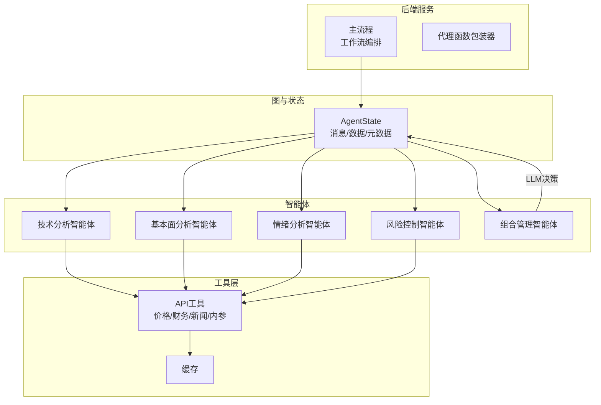
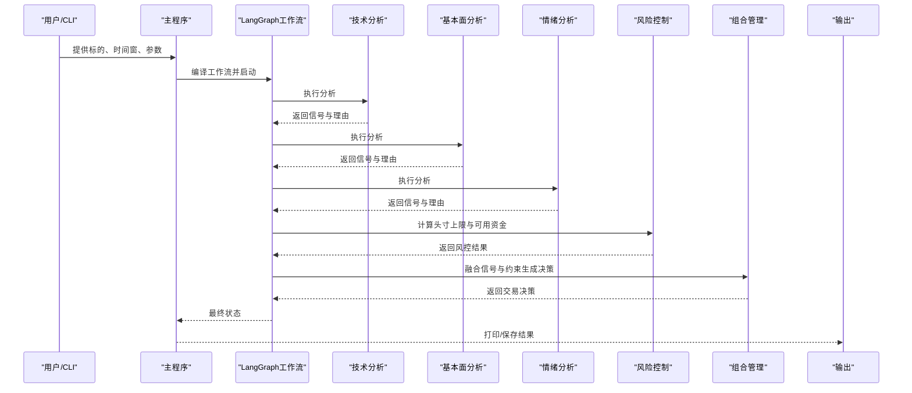
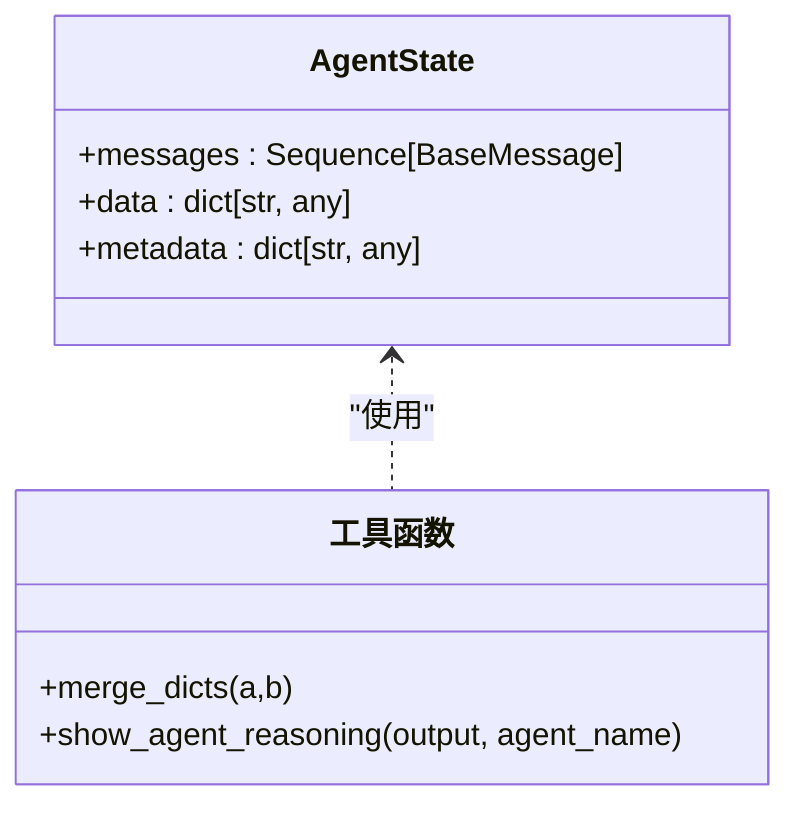
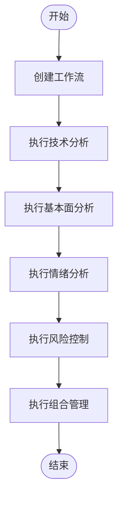
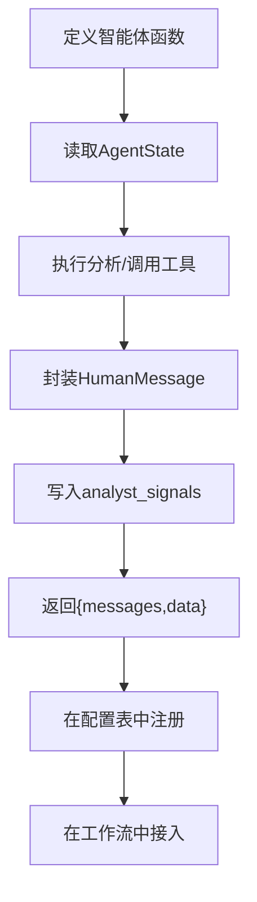
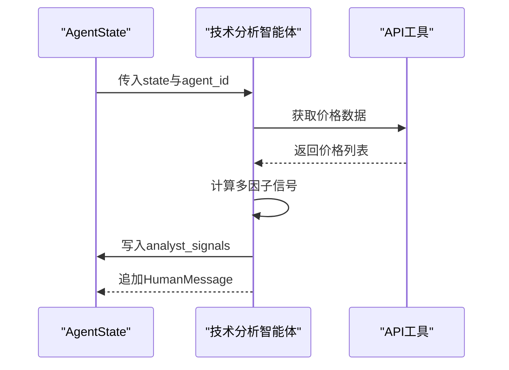
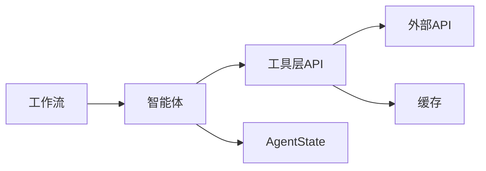

# 智能体扩展

<cite>
**本文引用的文件**
- [src/graph/state.py](file://src/graph/state.py)
- [src/main.py](file://src/main.py)
- [app/backend/services/agent_service.py](file://app/backend/services/agent_service.py)
- [src/utils/analysts.py](file://src/utils/analysts.py)
- [src/tools/api.py](file://src/tools/api.py)
- [src/agents/technicals.py](file://src/agents/technicals.py)
- [src/agents/fundamentals.py](file://src/agents/fundamentals.py)
- [src/agents/sentiment.py](file://src/agents/sentiment.py)
- [src/agents/risk_manager.py](file://src/agents/risk_manager.py)
- [src/agents/portfolio_manager.py](file://src/agents/portfolio_manager.py)
- [src/agents/warren_buffett.py](file://src/agents/warren_buffett.py)
- [src/agents/ben_graham.py](file://src/agents/ben_graham.py)
- [src/agents/phil_fisher.py](file://src/agents/phil_fisher.py)
</cite>

## 目录
1. [引言](#引言)
2. [项目结构](#项目结构)
3. [核心组件](#核心组件)
4. [架构总览](#架构总览)
5. [详细组件分析](#详细组件分析)
6. [依赖分析](#依赖分析)
7. [性能考虑](#性能考虑)
8. [故障排查指南](#故障排查指南)
9. [结论](#结论)
10. [附录](#附录)

## 引言
本指南面向希望在该AI对冲基金系统中扩展“智能体（Agent）”能力的开发者。文档从架构设计、状态管理、消息传递与生命周期管理入手，逐步给出创建自定义智能体的步骤、示例与协作机制，并覆盖调试技巧、性能优化与常见问题。

## 项目结构
该项目采用“图编排 + 多智能体 + 工具层”的分层架构：
- 图与状态：使用LangGraph定义状态图，统一的AgentState承载消息、数据与元信息。
- 智能体层：按分析维度拆分多个智能体（技术面、基本面、情绪面、风险与组合管理等），每个智能体遵循统一签名与返回约定。
- 工具层：封装外部API访问、缓存与数据转换。
- 后端服务：提供工作流编排与运行入口。

图表来源
- [src/graph/state.py:15-19](file://src/graph/state.py#L15-L19)
- [src/main.py:100-130](file://src/main.py#L100-L130)
- [app/backend/services/agent_service.py:5-13](file://app/backend/services/agent_service.py#L5-L13)
- [src/tools/api.py:63-96](file://src/tools/api.py#L63-L96)

章节来源
- [src/main.py:100-130](file://src/main.py#L100-L130)
- [src/graph/state.py:15-19](file://src/graph/state.py#L15-L19)

## 核心组件
- AgentState：统一的状态容器，包含消息序列、字典化的数据与元数据；支持合并策略与序列化输出。
- 工作流编排：通过LangGraph构建节点与边，串联多个智能体，最终由组合管理智能体汇总决策。
- 代理函数包装：为智能体函数注入agent_id，适配LangGraph调用约定。
- 工具与缓存：统一的API访问与缓存封装，降低外部依赖开销与限流影响。

章节来源
- [src/graph/state.py:15-19](file://src/graph/state.py#L15-L19)
- [src/main.py:100-130](file://src/main.py#L100-L130)
- [app/backend/services/agent_service.py:5-13](file://app/backend/services/agent_service.py#L5-L13)
- [src/tools/api.py:63-96](file://src/tools/api.py#L63-L96)

## 架构总览
下图展示了从输入到输出的完整流程：主程序初始化工作流，依次执行各分析智能体，风险控制智能体进行风控校准，组合管理智能体基于信号与约束生成交易决策，最终输出。

图表来源
- [src/main.py:46-93](file://src/main.py#L46-L93)
- [src/main.py:100-130](file://src/main.py#L100-L130)
- [src/agents/risk_manager.py:11-219](file://src/agents/risk_manager.py#L11-L219)
- [src/agents/portfolio_manager.py:25-93](file://src/agents/portfolio_manager.py#L25-L93)

## 详细组件分析

### AgentState 状态管理
- 结构组成：messages（消息序列）、data（字典化数据）、metadata（字典化元数据）。
- 合并与序列化：支持字典合并与对象序列化，便于跨智能体共享与打印。
- 推理展示：提供统一的推理打印工具，自动处理复杂对象与JSON格式化。

图表来源
- [src/graph/state.py:15-19](file://src/graph/state.py#L15-L19)
- [src/graph/state.py:21-52](file://src/graph/state.py#L21-L52)

章节来源
- [src/graph/state.py:15-19](file://src/graph/state.py#L15-L19)
- [src/graph/state.py:21-52](file://src/graph/state.py#L21-L52)

### 消息传递机制
- 统一消息类型：所有智能体返回的消息均封装为人类消息（HumanMessage），携带JSON化的分析结果与名称标识。
- 共享数据：通过state["data"]["analyst_signals"]聚合各智能体信号，供后续智能体（尤其是组合管理）消费。
- 元数据传播：通过state["metadata"]传递模型配置、是否显示推理等全局开关。

章节来源
- [src/agents/technicals.py:140-157](file://src/agents/technicals.py#L140-L157)
- [src/agents/fundamentals.py:145-163](file://src/agents/fundamentals.py#L145-L163)
- [src/agents/sentiment.py:120-138](file://src/agents/sentiment.py#L120-L138)
- [src/agents/risk_manager.py:205-219](file://src/agents/risk_manager.py#L205-L219)
- [src/agents/portfolio_manager.py:79-93](file://src/agents/portfolio_manager.py#L79-L93)

### 生命周期管理
- 初始化：主程序构建工作流，设置起始节点与连接关系。
- 执行：LangGraph按拓扑顺序驱动各智能体节点，每个节点读取AgentState并返回更新后的状态。
- 终止：组合管理智能体输出最终决策，工作流结束。

图表来源
- [src/main.py:100-130](file://src/main.py#L100-L130)

章节来源
- [src/main.py:100-130](file://src/main.py#L100-L130)

### 创建自定义智能体（步骤与规范）
- 继承与签名：智能体函数应接受(state: AgentState, agent_id: str) -> dict，返回包含"messages"与"data"键的字典。
- 数据读写：从state["data"]读取输入（如tickers、start_date、end_date、portfolio等），向state["data"]["analyst_signals"][agent_id]写入分析结果。
- 消息封装：将分析结果封装为HumanMessage，name字段为agent_id，作为messages追加。
- 配置注册：在分析师配置表中新增条目，映射到你的智能体函数，并指定显示名、描述与顺序。
- 工作流接入：在主流程中添加节点与边，或通过默认逻辑自动接入。

图表来源
- [src/agents/technicals.py:35-157](file://src/agents/technicals.py#L35-L157)
- [src/utils/analysts.py:184-186](file://src/utils/analysts.py#L184-L186)
- [src/main.py:100-130](file://src/main.py#L100-L130)

章节来源
- [src/agents/technicals.py:35-157](file://src/agents/technicals.py#L35-L157)
- [src/utils/analysts.py:184-186](file://src/utils/analysts.py#L184-L186)
- [src/main.py:100-130](file://src/main.py#L100-L130)

### 示例：技术分析智能体
- 输入：多只股票、起止日期、API密钥。
- 流程：逐个标的拉取价格数据，计算趋势、均值回归、动量、波动率与统计套利信号，加权融合得到综合信号。
- 输出：每只股票的信号、置信度与明细指标，写入analyst_signals。

图表来源
- [src/agents/technicals.py:35-157](file://src/agents/technicals.py#L35-L157)
- [src/tools/api.py:63-96](file://src/tools/api.py#L63-L96)

章节来源
- [src/agents/technicals.py:35-157](file://src/agents/technicals.py#L35-L157)
- [src/tools/api.py:63-96](file://src/tools/api.py#L63-L96)

### 示例：基本面分析智能体
- 输入：多只股票、截止日期、API密钥。
- 流程：获取财务指标，评估盈利能力、增长潜力、财务健康与估值比率，汇总得出总体信号与置信度。
- 输出：每只股票的信号、置信度与推理明细。

章节来源
- [src/agents/fundamentals.py:11-163](file://src/agents/fundamentals.py#L11-L163)
- [src/tools/api.py:99-138](file://src/tools/api.py#L99-L138)

### 示例：情绪分析智能体
- 输入：多只股票、截止日期、API密钥。
- 流程：抓取内参交易与公司新闻，分别提取买卖信号与情感倾向，按权重合成总体信号与置信度。
- 输出：每只股票的信号、置信度与明细指标。

章节来源
- [src/agents/sentiment.py:12-138](file://src/agents/sentiment.py#L12-L138)
- [src/tools/api.py:183-246](file://src/tools/api.py#L183-L246)
- [src/tools/api.py:249-312](file://src/tools/api.py#L249-L312)

### 示例：风险控制智能体
- 输入：组合信息、多只股票、起止日期、API密钥。
- 流程：计算波动率与相关性，结合当前头寸与总价值，确定每只股票的剩余头寸上限与可用资金。
- 输出：每只股票的当前价格、波动率指标、相关性指标与风控理由。

章节来源
- [src/agents/risk_manager.py:11-219](file://src/agents/risk_manager.py#L11-L219)
- [src/tools/api.py:63-96](file://src/tools/api.py#L63-L96)

### 示例：组合管理智能体
- 输入：各分析智能体信号、当前价格、最大可交易份额、组合现金与保证金占用。
- 流程：压缩信号、计算允许动作集合、构造最小提示词、调用LLM生成最终决策。
- 输出：每只股票的动作、数量、置信度与理由。

章节来源
- [src/agents/portfolio_manager.py:25-93](file://src/agents/portfolio_manager.py#L25-L93)
- [src/agents/portfolio_manager.py:177-262](file://src/agents/portfolio_manager.py#L177-L262)

### 现有智能体实现模式扩展指南
- 巴菲特分析法（Warren Buffett）
  - 关键点：ROE、债务水平、运营利润率、护城河、管理层质量、内在价值与安全边际。
  - 扩展步骤：新增一个智能体函数，按模块化子分析（财务、一致性、护城河、定价权、账面价值增长、管理层质量、内在价值）组织，最后由LLM综合判断。
  - 参考路径：[src/agents/warren_buffett.py:19-153](file://src/agents/warren_buffett.py#L19-L153)

- 格雷厄姆分析法（Benjamin Graham）
  - 关键点：盈利稳定性、财务强度（流动性/杠杆）、格雷厄姆估值（NCAV/Graham Number）与安全边际。
  - 扩展步骤：实现三个子分析模块，汇总评分并交由LLM生成信号。
  - 参考路径：[src/agents/ben_graham.py:20-94](file://src/agents/ben_graham.py#L20-L94)

- 费雪成长投资法（Phil Fisher）
  - 关键点：长期增长潜力、管理层质量与研发、盈利与毛利率稳定性、管理效率与杠杆、估值（P/E、P/FCF）、内参与新闻情绪。
  - 扩展步骤：按权重组合各维度得分，交由LLM生成风格化信号。
  - 参考路径：[src/agents/phil_fisher.py:24-164](file://src/agents/phil_fisher.py#L24-L164)

章节来源
- [src/agents/warren_buffett.py:19-153](file://src/agents/warren_buffett.py#L19-L153)
- [src/agents/ben_graham.py:20-94](file://src/agents/ben_graham.py#L20-L94)
- [src/agents/phil_fisher.py:24-164](file://src/agents/phil_fisher.py#L24-L164)

### 智能体协作机制、数据共享与冲突解决
- 协作机制：通过AgentState["data"]["analyst_signals"]共享信号；风险控制智能体先于组合管理智能体执行，后者基于风控结果与信号生成决策。
- 数据共享：统一使用JSON字符串封装消息，便于跨节点传输与调试打印。
- 冲突解决：组合管理智能体通过LLM在信号与约束之间做权衡，若无法决策则回退为持有并给出理由。

章节来源
- [src/agents/risk_manager.py:11-219](file://src/agents/risk_manager.py#L11-L219)
- [src/agents/portfolio_manager.py:177-262](file://src/agents/portfolio_manager.py#L177-L262)

## 依赖分析
- 模块耦合：智能体仅依赖AgentState与工具层API，耦合度低；工作流通过配置表集中管理节点。
- 外部依赖：金融数据API、缓存、LLM调用；通过工具层统一封装，便于替换与测试。
- 循环依赖：未见循环导入；配置表集中声明，避免运行时耦合。

图表来源
- [src/utils/analysts.py:24-178](file://src/utils/analysts.py#L24-L178)
- [src/tools/api.py:63-96](file://src/tools/api.py#L63-L96)

章节来源
- [src/utils/analysts.py:24-178](file://src/utils/analysts.py#L24-L178)
- [src/tools/api.py:63-96](file://src/tools/api.py#L63-L96)

## 性能考虑
- 缓存优先：工具层已内置缓存，尽量复用历史数据，减少重复请求与限流压力。
- 并行化：单智能体内部可对多标的并行处理（注意外部API速率限制与幂等性）。
- 数据压缩：组合管理智能体仅向LLM发送必要字段，减少Token与延迟。
- 降噪：对空信号与无效指标进行过滤，避免噪声干扰最终决策。

## 故障排查指南
- JSON解析失败：检查外部API响应格式与字段是否存在，必要时增加容错与降级。
- 429限流：工具层已内置指数/线性退避重试，可在配置中调整重试次数与等待时间。
- 信号为空：确认API密钥有效、时间段合理、标的可获取；查看进度与日志定位失败阶段。
- 推理打印异常：确保输出为可JSON序列化对象，必要时使用内置序列化工具。

章节来源
- [src/graph/state.py:21-52](file://src/graph/state.py#L21-L52)
- [src/tools/api.py:29-61](file://src/tools/api.py#L29-L61)
- [src/tools/api.py:63-96](file://src/tools/api.py#L63-L96)

## 结论
通过统一的AgentState、标准化的消息与数据共享机制，以及清晰的智能体职责划分，系统实现了可扩展、可维护的多智能体协同框架。开发者可按本文步骤快速扩展新智能体，并参考现有模式（巴菲特、格雷厄姆、费雪）实现风格化分析。

## 附录
- 代理函数包装：为智能体注入agent_id，适配LangGraph调用。
- 分析师配置：集中管理智能体清单、显示名、描述与执行顺序。
- 主流程：创建工作流、编排节点、运行并输出结果。

章节来源
- [app/backend/services/agent_service.py:5-13](file://app/backend/services/agent_service.py#L5-L13)
- [src/utils/analysts.py:184-201](file://src/utils/analysts.py#L184-L201)
- [src/main.py:100-130](file://src/main.py#L100-L130)