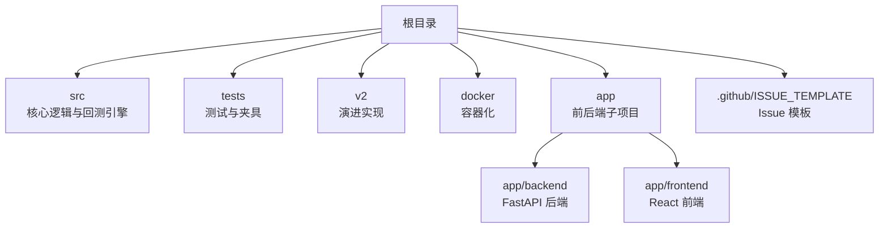
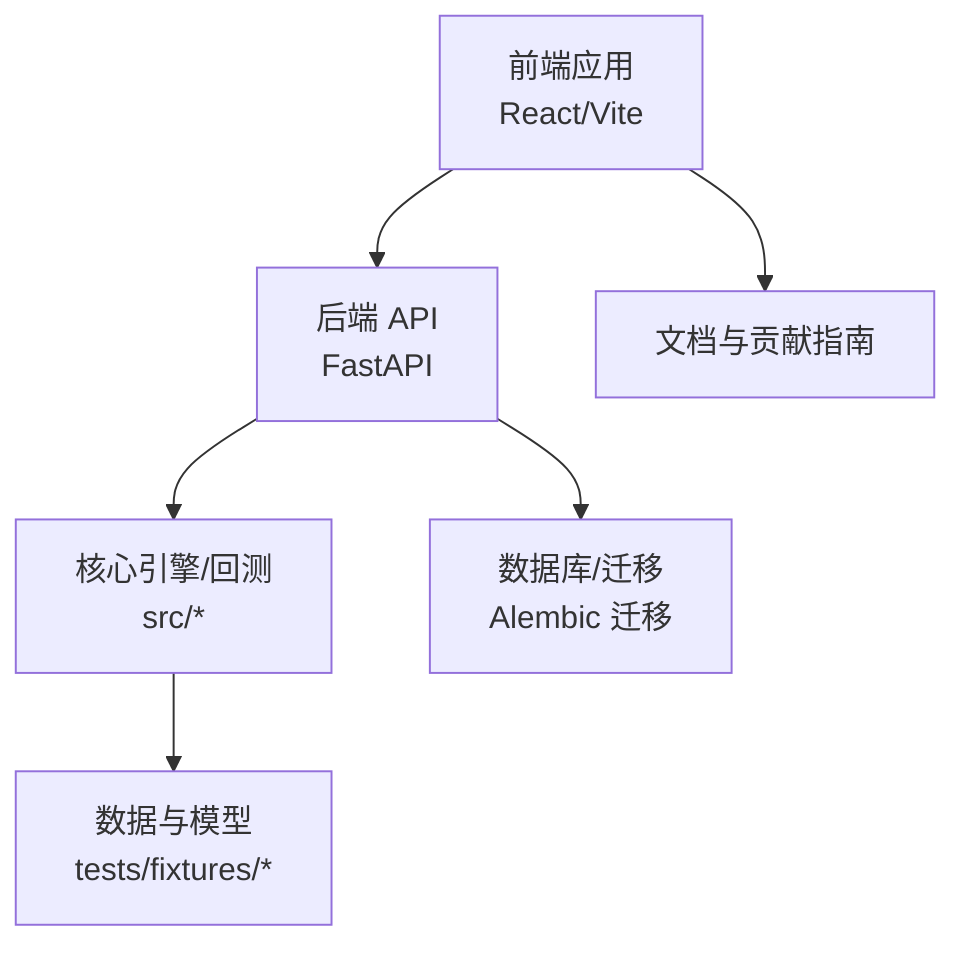
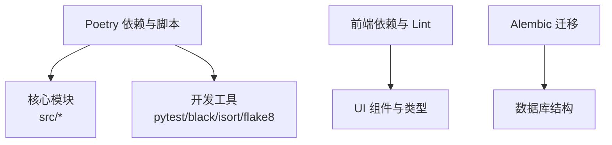

# 贡献指南

<cite>
**本文引用的文件**
- [README.md](file://README.md)
- [bug_report.md](file://.github/ISSUE_TEMPLATE/bug_report.md)
- [feature_request.md](file://.github/ISSUE_TEMPLATE/feature_request.md)
- [pyproject.toml](file://pyproject.toml)
- [app 后端 README.md](file://app/backend/README.md)
- [app 前端 README.md](file://app/frontend/README.md)
- [前端 package.json](file://app/frontend/package.json)
- [后端 Alembic 版本 1b1feba3d897](file://app/backend/alembic/versions/1b1feba3d897_add_data_column_to_hedge_fund_flows.py)
- [后端 Alembic 版本 2f8c5d9e4b1a](file://app/backend/alembic/versions/2f8c5d9e4b1a_add_hedgefundflowrun_table.py)
- [后端 Alembic 版本 3f9a6b7c8d2e](file://app/backend/alembic/versions/3f9a6b7c8d2e_add_hedgefundflowruncycle_table.py)
- [后端 Alembic 版本 5274886e5bee](file://app/backend/alembic/versions/5274886e5bee_add_hedgefundflow_table.py)
- [后端 Alembic 版本 add_api_keys_table.py](file://app/backend/alembic/versions/add_api_keys_table.py)
- [后端 Alembic README](file://app/backend/alembic/README)
- [后端 Alembic env.py](file://app/backend/alembic/env.py)
- [后端 Alembic script.py.mako](file://app/backend/alembic/script.py.mako)
- [测试夹具 conftest.py（集成）](file://tests/backtesting/integration/conftest.py)
- [.dockerignore](file://.dockerignore)
</cite>

## 目录
1. [简介](#简介)
2. [项目结构](#项目结构)
3. [核心组件](#核心组件)
4. [架构总览](#架构总览)
5. [详细组件分析](#详细组件分析)
6. [依赖关系分析](#依赖关系分析)
7. [性能考虑](#性能考虑)
8. [故障排除指南](#故障排除指南)
9. [结论](#结论)
10. [附录](#附录)

## 简介
本指南面向希望为 AI 对冲基金开源项目做出贡献的开发者与研究者，涵盖从 Fork 仓库到创建 Pull Request 的完整流程；Issue 提交规范（含缺陷报告与功能请求模板）；代码审查流程与合并条件；贡献者行为准则与知识产权声明；新贡献者入门建议、常见贡献类型以及致谢机制。

本项目旨在探索使用人工智能进行交易决策的可行性，当前版本为教育与研究用途，不提供真实交易或投资建议。

章节来源
- [README.md:1-158](file://README.md#L1-L158)

## 项目结构
该项目采用多模块组织方式：根目录包含 Python 后端服务、命令行工具与回测引擎；app 子目录下包含独立的前端与后端子项目；tests 目录提供测试套件与夹具；v2 目录为演进中的第二代实现；docker 目录提供容器化运行支持。

- 根目录与核心模块
  - src：核心算法与回测引擎、LLM 集成、数据与工具模块
  - tests：单元与集成测试，包含夹具与模拟数据
  - v2：新一代实现与实验性模块
  - docker：Dockerfile 与 compose 文件
- app 子项目
  - app/backend：FastAPI 后端服务，提供 REST API
  - app/frontend：React/Vite 前端应用，提供可视化界面
- GitHub 模板
  - .github/ISSUE_TEMPLATE：缺陷报告与功能请求模板

图表来源
- [README.md:141-147](file://README.md#L141-L147)
- [app 后端 README.md:1-102](file://app/backend/README.md#L1-L102)
- [app 前端 README.md:1-37](file://app/frontend/README.md#L1-L37)

章节来源
- [README.md:141-147](file://README.md#L141-L147)
- [app 后端 README.md:1-102](file://app/backend/README.md#L1-L102)
- [app 前端 README.md:1-37](file://app/frontend/README.md#L1-L37)

## 核心组件
- 后端服务（FastAPI）
  - 提供 REST API，用于运行对冲基金系统与回测器
  - 支持热重载开发模式
- 前端应用（React/Vite）
  - 提供可视化界面，连接后端 API
  - 包含 ESLint 规则与 UI 组件库
- 回测引擎与测试
  - 单元测试与集成测试，使用夹具模拟外部数据源
  - 集成测试通过夹具加载固定 JSON 数据，确保可重复性
- 依赖与构建
  - 根项目使用 Poetry 管理依赖与脚本
  - 前端使用 npm/pnpm/yarn 安装依赖
- 数据迁移（Alembic）
  - 多个版本迁移文件，覆盖表结构演进与 API 密钥表等

章节来源
- [app 后端 README.md:69-73](file://app/backend/README.md#L69-L73)
- [app 后端 README.md:51-68](file://app/backend/README.md#L51-L68)
- [app 前端 README.md:18-26](file://app/frontend/README.md#L18-L26)
- [pyproject.toml:13-47](file://pyproject.toml#L13-L47)
- [app 前端 package.json:5-9](file://app/frontend/package.json#L5-L9)
- [后端 Alembic README](file://app/backend/alembic/README)

## 架构总览
整体架构由“前端界面 → 后端 API → 核心引擎/回测 → 数据与模型”构成。前端负责用户交互与展示，后端提供统一入口与业务编排，核心模块负责策略执行与回测计算，数据层通过夹具与外部 API 提供价格、新闻、财务指标等。

图表来源
- [app 前端 README.md:8-8](file://app/frontend/README.md#L8-L8)
- [app 后端 README.md:8-10](file://app/backend/README.md#L8-L10)
- [pyproject.toml:13-47](file://pyproject.toml#L13-L47)

## 详细组件分析

### 贡献流程（Fork → 分支 → 提交 → PR）
- Fork 仓库
  - 在 GitHub 上 Fork 主仓库至个人账户
- 创建功能分支
  - 基于主分支创建特性分支，命名清晰、聚焦单一改动
- 提交代码
  - 遵循项目风格与格式化规则（见“依赖与构建”章节）
  - 提交信息简洁明确，必要时关联 Issue 编号
- 推送与创建 PR
  - 将分支推送到远程仓库
  - 在 GitHub 上发起 Pull Request，填写模板内容
  - 保持 PR 小而专注，便于审查与合并

章节来源
- [README.md:141-149](file://README.md#L141-L149)

### Issue 提交流程与模板
- 缺陷报告（Bug Report）
  - 使用 GitHub Issue 模板，描述问题现象、截图与上下文
- 功能请求（Feature Request）
  - 使用模板描述期望功能，标注 enhancement 标签
- 提交前检查
  - 确认未在现有 Issue 中重复
  - 提供最小复现步骤与预期结果

章节来源
- [bug_report.md:1-18](file://.github/ISSUE_TEMPLATE/bug_report.md#L1-L18)
- [feature_request.md:1-12](file://.github/ISSUE_TEMPLATE/feature_request.md#L1-L12)
- [README.md:151-153](file://README.md#L151-L153)

### 代码审查流程
- 审查标准
  - 代码质量：遵循项目风格与格式化配置
  - 功能正确性：通过单元与集成测试
  - 文档与注释：新增功能需配套说明
  - 兼容性：避免破坏既有接口与行为
- 反馈处理
  - 认真阅读评论，逐条回复与修正
  - 必要时补充测试用例或示例
- 修改要求
  - 针对性修复，避免无关变更
  - 保持提交历史整洁，必要时 rebase/squash
- 合并条件
  - 至少一名维护者批准
  - CI 通过，无未决阻塞性问题
  - 代码风格与测试均满足要求

章节来源
- [pyproject.toml:53-61](file://pyproject.toml#L53-L61)
- [app 前端 package.json:8-8](file://app/frontend/package.json#L8-L8)
- [README.md:141-149](file://README.md#L141-L149)

### 行为准则与知识产权
- 社区礼仪
  - 尊重他人，避免人身攻击
  - 积极建设性地提供反馈与建议
- 沟通规范
  - 使用清晰、礼貌的语言
  - 在 Issue/PR 中提供充分背景信息
- 冲突解决
  - 优先私下沟通协商
  - 无法达成一致时由维护者裁决
- 知识产权
  - 项目采用 MIT 许可证，详见根目录与前端子项目许可文件
  - 贡献即默认同意以相同许可证发布

章节来源
- [README.md:155-158](file://README.md#L155-L158)
- [app 前端 LICENSE:1-22](file://app/frontend/LICENSE#L1-L22)

### 新贡献者入门指南
- 环境准备
  - 安装 Poetry 并安装依赖
  - 设置环境变量（API 密钥）
- 运行方式
  - 命令行：直接运行主程序与回测器
  - Web 应用：按前后端 README 启动
- 测试与验证
  - 运行测试套件，确保本地环境正常
  - 集成测试通过夹具加载固定数据，便于复现

章节来源
- [README.md:54-131](file://README.md#L54-L131)
- [app 后端 README.md:12-68](file://app/backend/README.md#L12-L68)
- [app 前端 README.md:10-26](file://app/frontend/README.md#L10-L26)
- [测试夹具 conftest.py（集成）:107-129](file://tests/backtesting/integration/conftest.py#L107-L129)

### 常见贡献类型
- 新增代理（Agent）与策略
  - 在 src/agents 下扩展新的智能体
- 回测引擎增强
  - 扩展指标、基准与可视化
- 前后端功能完善
  - 增强前端界面与后端 API
- 文档与示例
  - 补充使用说明、最佳实践与示例
- 依赖与工具链优化
  - 更新 Poetry/前端依赖与格式化配置

章节来源
- [src agents 示例（示例路径）](file://src/agents)
- [pyproject.toml:13-47](file://pyproject.toml#L13-L47)
- [app 前端 package.json:11-54](file://app/frontend/package.json#L11-L54)

### 致谢机制
- 贡献者可在 README 或变更日志中获得致谢
- 重大贡献可邀请加入维护者行列

章节来源
- [README.md:141-149](file://README.md#L141-L149)

## 依赖关系分析
- Python 依赖与脚本
  - 使用 Poetry 管理核心与开发依赖，包含格式化、静态检查与测试工具
  - 定义了回测器脚本入口
- 前端依赖与 lint
  - 使用 ESLint 与 TypeScript，提供严格规则集
- 数据迁移（Alembic）
  - 多个版本迁移文件，覆盖表结构演进与 API 密钥表等

图表来源
- [pyproject.toml:13-47](file://pyproject.toml#L13-L47)
- [app 前端 package.json:37-54](file://app/frontend/package.json#L37-L54)
- [后端 Alembic 版本 1b1feba3d897](file://app/backend/alembic/versions/1b1feba3d897_add_data_column_to_hedge_fund_flows.py)
- [后端 Alembic 版本 2f8c5d9e4b1a](file://app/backend/alembic/versions/2f8c5d9e4b1a_add_hedgefundflowrun_table.py)
- [后端 Alembic 版本 3f9a6b7c8d2e](file://app/backend/alembic/versions/3f9a6b7c8d2e_add_hedgefundflowruncycle_table.py)
- [后端 Alembic 版本 5274886e5bee](file://app/backend/alembic/versions/5274886e5bee_add_hedgefundflow_table.py)
- [后端 Alembic 版本 add_api_keys_table.py](file://app/backend/alembic/versions/add_api_keys_table.py)

章节来源
- [pyproject.toml:13-47](file://pyproject.toml#L13-L47)
- [app 前端 package.json:37-54](file://app/frontend/package.json#L37-L54)
- [后端 Alembic README](file://app/backend/alembic/README)

## 性能考虑
- 回测性能
  - 使用夹具与固定数据减少外部依赖波动
  - 合理拆分测试用例，避免长时间运行的单测
- 前后端响应
  - 后端启用热重载开发模式，提升迭代效率
  - 前端使用 Vite 构建，支持快速预览与热更新
- 依赖体积
  - 控制第三方依赖数量，避免不必要的包引入

章节来源
- [app 后端 README.md:51-68](file://app/backend/README.md#L51-L68)
- [app 前端 README.md:18-26](file://app/frontend/README.md#L18-L26)
- [测试夹具 conftest.py（集成）:107-129](file://tests/backtesting/integration/conftest.py#L107-L129)

## 故障排除指南
- 环境变量与密钥
  - 确保已复制并正确配置 .env 文件
- 依赖安装
  - 使用 Poetry 安装 Python 依赖
  - 使用 npm/pnpm/yarn 安装前端依赖
- Docker 忽略项
  - .dockerignore 已排除日志、数据、缓存与 IDE 文件
- 测试失败
  - 检查夹具路径与数据格式是否匹配
  - 确认时间窗口与日期格式符合预期

章节来源
- [README.md:65-82](file://README.md#L65-L82)
- [pyproject.toml:43-47](file://pyproject.toml#L43-L47)
- [app 前端 package.json:5-9](file://app/frontend/package.json#L5-L9)
- [.dockerignore:1-29](file://.dockerignore#L1-L29)
- [测试夹具 conftest.py（集成）:14-46](file://tests/backtesting/integration/conftest.py#L14-L46)

## 结论
本指南提供了从入门到贡献的全流程说明，结合项目现有的 Issue 模板、后端 API、前端界面与测试夹具，帮助贡献者高效参与。请始终遵循行为准则与审查流程，共同维护高质量的开源协作生态。

## 附录
- 快速参考
  - Fork → 创建特性分支 → 提交与推送 → 发起 PR
  - 缺陷报告与功能请求使用对应模板
  - 代码风格与测试通过是合并前提
- 相关文件索引
  - 贡献流程与免责声明：[README.md:141-149](file://README.md#L141-L149)
  - Issue 模板：[bug_report.md:1-18](file://.github/ISSUE_TEMPLATE/bug_report.md#L1-L18)、[feature_request.md:1-12](file://.github/ISSUE_TEMPLATE/feature_request.md#L1-L12)
  - 依赖与脚本：[pyproject.toml:13-47](file://pyproject.toml#L13-L47)
  - 前端依赖与 Lint：[app 前端 package.json:37-54](file://app/frontend/package.json#L37-L54)
  - 后端 API 与运行：[app 后端 README.md:51-68](file://app/backend/README.md#L51-L68)
  - 数据迁移：[后端 Alembic README](file://app/backend/alembic/README)