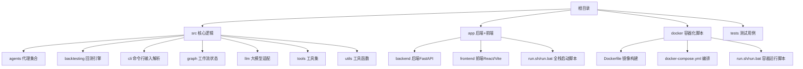
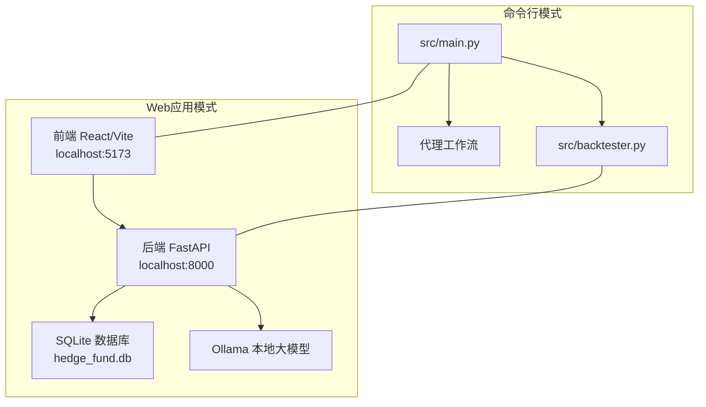
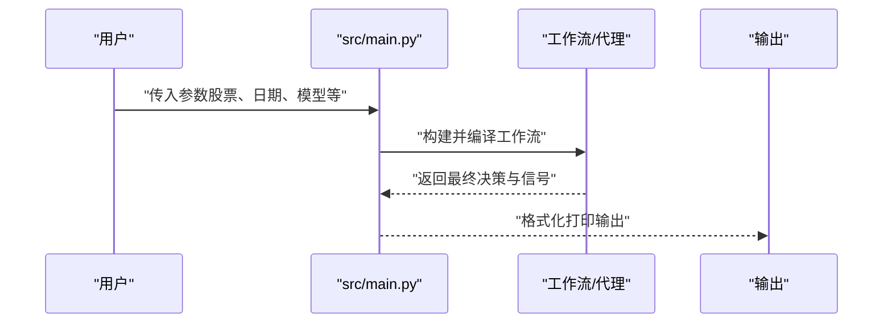
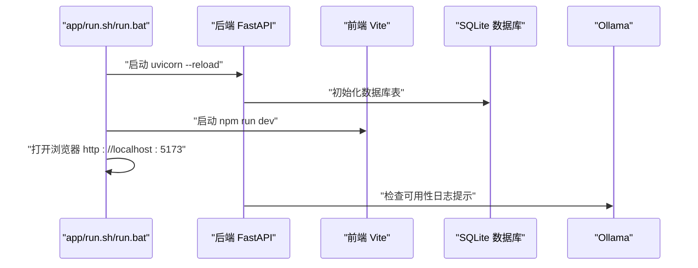
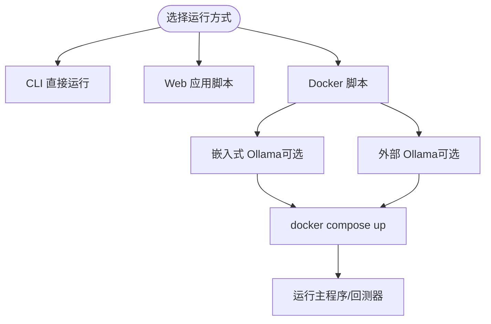
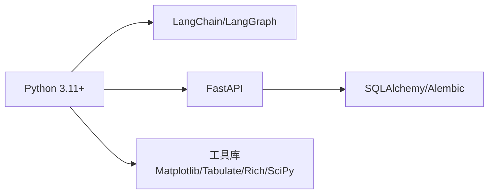

# 快速开始

<cite>
**本文引用的文件**
- [README.md](file://README.md)
- [pyproject.toml](file://pyproject.toml)
- [src/main.py](file://src/main.py)
- [src/backtester.py](file://src/backtester.py)
- [docker/docker-compose.yml](file://docker/docker-compose.yml)
- [docker/README.md](file://docker/README.md)
- [docker/run.sh](file://docker/run.sh)
- [docker/run.bat](file://docker/run.bat)
- [app/backend/README.md](file://app/backend/README.md)
- [app/backend/main.py](file://app/backend/main.py)
- [app/backend/database/connection.py](file://app/backend/database/connection.py)
- [app/backend/database/models.py](file://app/backend/database/models.py)
- [app/run.sh](file://app/run.sh)
- [app/run.bat](file://app/run.bat)
</cite>

## 目录
1. [简介](#简介)
2. [项目结构](#项目结构)
3. [核心组件](#核心组件)
4. [架构总览](#架构总览)
5. [详细组件分析](#详细组件分析)
6. [依赖关系分析](#依赖关系分析)
7. [性能考虑](#性能考虑)
8. [故障排除指南](#故障排除指南)
9. [结论](#结论)
10. [附录](#附录)

## 简介
本指南帮助你在30分钟内完成AI对冲基金系统的安装与首次运行，支持两种方式：
- 命令行界面（CLI）：直接运行主程序或回测器，适合自动化与脚本集成
- Web应用：通过前后端一体化脚本一键启动，适合可视化操作与学习

你将完成以下步骤：
- 环境准备与依赖安装
- API密钥配置
- 数据库初始化
- 启动系统并验证输出

## 项目结构
该仓库采用多模块组织，包含核心交易逻辑、后端API服务、前端界面以及容器化部署脚本。

图表来源
- [README.md: 45-52:45-52](file://README.md#L45-L52)
- [docker/docker-compose.yml: 1-95:1-95](file://docker/docker-compose.yml#L1-L95)
- [app/run.sh: 335-379:335-379](file://app/run.sh#L335-L379)

章节来源
- [README.md: 45-52:45-52](file://README.md#L45-L52)
- [docker/docker-compose.yml: 1-95:1-95](file://docker/docker-compose.yml#L1-L95)
- [app/run.sh: 335-379:335-379](file://app/run.sh#L335-L379)

## 核心组件
- 主程序入口：负责解析参数、构建工作流、调用代理并打印结果
- 回测器：封装回测引擎，支持键盘中断优雅退出与部分结果展示
- 后端API：基于FastAPI，自动初始化SQLite数据库，提供健康检查与运行接口
- 数据库：使用SQLAlchemy定义流程、执行记录、周期记录与API密钥表
- 容器化：Docker镜像与Compose编排，支持本地Ollama或外部Ollama

章节来源
- [src/main.py: 133-180:133-180](file://src/main.py#L133-L180)
- [src/backtester.py: 42-67:42-67](file://src/backtester.py#L42-L67)
- [app/backend/main.py: 15-56:15-56](file://app/backend/main.py#L15-L56)
- [app/backend/database/models.py: 6-115:6-115](file://app/backend/database/models.py#L6-L115)
- [docker/docker-compose.yml: 18-92:18-92](file://docker/docker-compose.yml#L18-L92)

## 架构总览
系统支持两条运行路径：CLI直连与Web应用（后端+前端）。

图表来源
- [src/main.py: 133-180:133-180](file://src/main.py#L133-L180)
- [src/backtester.py: 42-67:42-67](file://src/backtester.py#L42-L67)
- [app/backend/main.py: 15-56:15-56](file://app/backend/main.py#L15-L56)
- [app/backend/database/connection.py: 11-24:11-24](file://app/backend/database/connection.py#L11-L24)
- [docker/docker-compose.yml: 2-16:2-16](file://docker/docker-compose.yml#L2-L16)

## 详细组件分析

### 命令行界面（CLI）
- 安装Poetry并安装依赖
- 运行主程序：指定股票池、日期范围、是否使用本地Ollama、是否显示推理过程
- 运行回测器：与主程序共享参数解析逻辑，支持键盘中断与部分结果展示

图表来源
- [src/main.py: 46-93:46-93](file://src/main.py#L46-L93)
- [src/main.py: 133-180:133-180](file://src/main.py#L133-L180)

章节来源
- [README.md: 86-131:86-131](file://README.md#L86-L131)
- [src/main.py: 133-180:133-180](file://src/main.py#L133-L180)
- [src/backtester.py: 42-67:42-67](file://src/backtester.py#L42-L67)

### Web应用（后端+前端）
- 后端：FastAPI应用，启动时自动创建数据库表；CORS允许前端访问；启动时检查Ollama可用性
- 前端：Vite+React开发服务器，热更新
- 全栈脚本：自动检测依赖、安装依赖、启动后端与前端，并在浏览器中打开页面

图表来源
- [app/run.sh: 214-333:214-333](file://app/run.sh#L214-L333)
- [app/backend/main.py: 15-56:15-56](file://app/backend/main.py#L15-L56)
- [app/backend/database/connection.py: 11-24:11-24](file://app/backend/database/connection.py#L11-L24)

章节来源
- [app/backend/README.md: 51-68:51-68](file://app/backend/README.md#L51-L68)
- [app/backend/main.py: 15-56:15-56](file://app/backend/main.py#L15-L56)
- [app/run.sh: 214-333:214-333](file://app/run.sh#L214-L333)

### 容器化运行（Docker）
- 使用docker-compose编排：可选嵌入式Ollama或连接外部Ollama
- 提供run.sh/run.bat脚本封装常用命令，包括构建镜像、拉取模型、组合运行等
- 支持通过环境变量传递OLLAMA_BASE_URL以指向外部Ollama实例

图表来源
- [docker/docker-compose.yml: 18-92:18-92](file://docker/docker-compose.yml#L18-L92)
- [docker/run.sh: 163-362:163-362](file://docker/run.sh#L163-L362)
- [docker/run.bat: 193-395:193-395](file://docker/run.bat#L193-L395)

章节来源
- [docker/README.md: 85-193:85-193](file://docker/README.md#L85-L193)
- [docker/docker-compose.yml: 18-92:18-92](file://docker/docker-compose.yml#L18-L92)
- [docker/run.sh: 163-362:163-362](file://docker/run.sh#L163-L362)
- [docker/run.bat: 193-395:193-395](file://docker/run.bat#L193-L395)

## 依赖关系分析
- Python运行时：Python 3.11+
- 语言模型：OpenAI、Anthropic、Groq、DeepSeek、Google GenAI、xAI、GigaChat等适配
- 后端框架：FastAPI + SQLAlchemy + Alembic
- 可视化与工具：Matplotlib、Tabulate、Rich、Colorama、Questionary、SciPy
- 开发工具：pytest、black、isort、flake8

图表来源
- [pyproject.toml: 13-41:13-41](file://pyproject.toml#L13-L41)

章节来源
- [pyproject.toml: 13-41:13-41](file://pyproject.toml#L13-L41)

## 性能考虑
- 模型选择：云端模型响应快但成本高；本地Ollama可节省费用但需充足内存与显卡资源
- 数据范围：首次运行建议缩小时间窗口（如1个月），降低等待时间
- 输出控制：默认不显示推理细节；仅在需要调试时开启“显示推理”选项
- 并发与I/O：SQLite适合演示场景；生产级部署建议使用PostgreSQL并配合连接池

## 故障排除指南
- 环境变量未配置
  - 症状：运行时报错缺少API密钥
  - 处理：复制示例文件为.env并填入至少一个大模型密钥与金融数据密钥
- 依赖安装失败
  - 症状：Poetry安装或导入模块报错
  - 处理：确认已安装Poetry；在后端目录执行同步安装；必要时清理缓存重试
- 数据库未初始化
  - 症状：首次启动后端无表
  - 处理：后端启动会自动创建表；若未生成，手动触发或重启后端
- Ollama不可达
  - 症状：日志提示未安装或未运行
  - 处理：按脚本指引安装Ollama；或设置OLLAMA_BASE_URL指向已有Ollama服务
- 端口冲突
  - 症状：前端或后端无法启动
  - 处理：修改端口或关闭占用进程；脚本默认端口为5173（前端）、8000（后端）

章节来源
- [app/backend/main.py: 32-56:32-56](file://app/backend/main.py#L32-L56)
- [app/backend/database/connection.py: 11-24:11-24](file://app/backend/database/connection.py#L11-L24)
- [docker/docker-compose.yml: 26-28:26-28](file://docker/docker-compose.yml#L26-L28)
- [docker/run.sh: 322-342:322-342](file://docker/run.sh#L322-L342)
- [docker/run.bat: 356-374:356-374](file://docker/run.bat#L356-L374)

## 结论
通过本指南，你可以在30分钟内完成从零到一的首次运行：安装依赖、配置密钥、启动系统并看到首个交易决策输出。建议先用CLI验证通路，再切换到Web应用体验图形化界面。后续可逐步引入本地Ollama、扩展代理节点与回测指标，持续迭代你的AI对冲基金策略。

## 附录

### 最小可行运行清单
- 准备工作
  - 安装Python 3.11+与Poetry
  - 在根目录创建.env并填入至少一个大模型密钥
- CLI方式
  - 运行主程序：指定股票池与日期范围
  - 运行回测器：查看历史表现与收益曲线
- Web应用方式
  - 在app/目录下运行全栈启动脚本，自动打开浏览器
- Docker方式
  - 在docker/目录下运行脚本，支持嵌入式Ollama或外部Ollama

章节来源
- [README.md: 54-131:54-131](file://README.md#L54-L131)
- [docker/README.md: 85-193:85-193](file://docker/README.md#L85-L193)
- [app/run.sh: 335-379:335-379](file://app/run.sh#L335-L379)