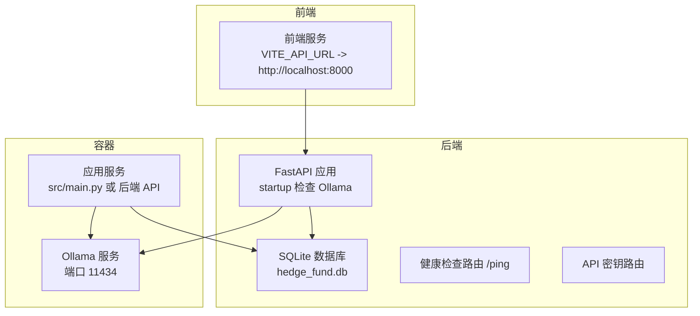
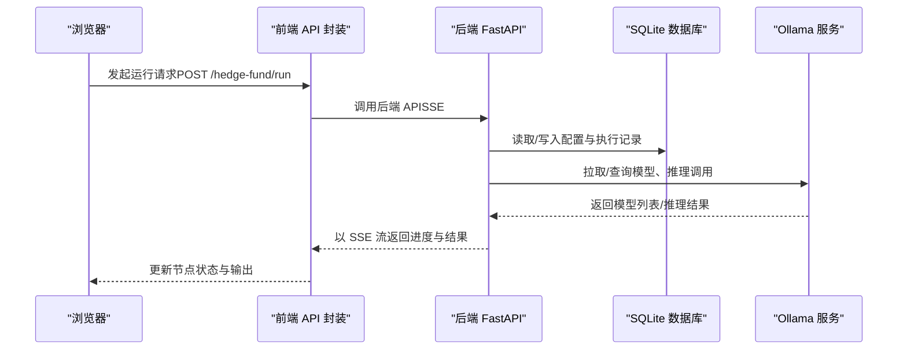
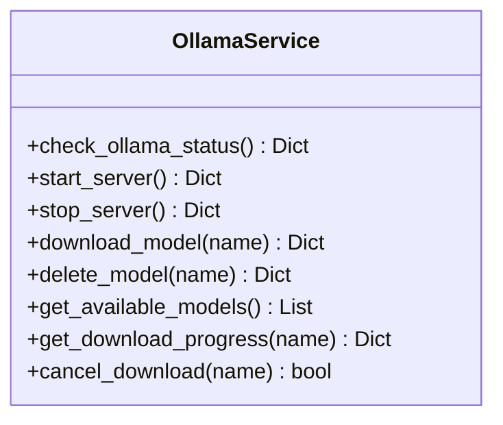
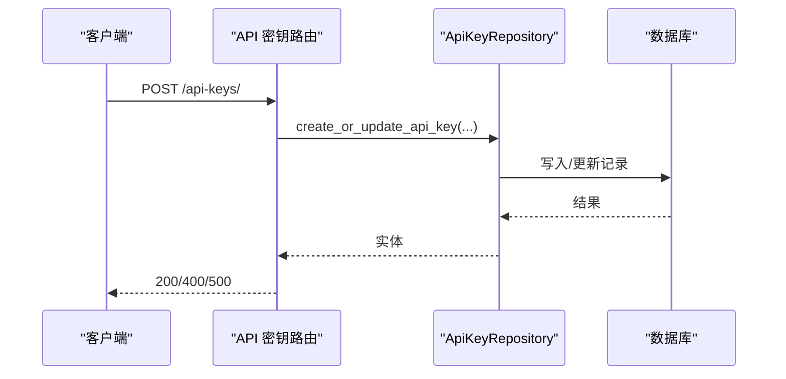
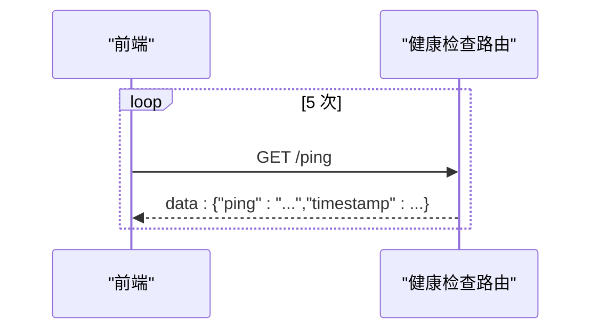
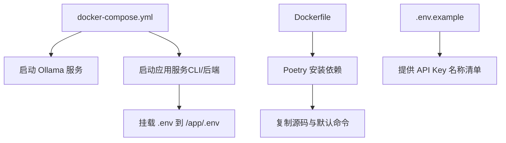
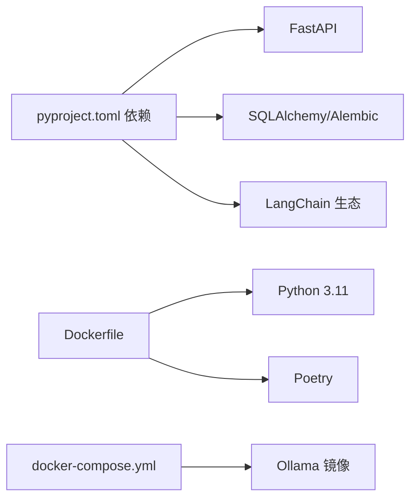

# 故障排除

<cite>
**本文引用的文件**
- [app/backend/main.py](file://app/backend/main.py)
- [app/backend/database/connection.py](file://app/backend/database/connection.py)
- [app/backend/database/models.py](file://app/backend/database/models.py)
- [app/backend/services/ollama_service.py](file://app/backend/services/ollama_service.py)
- [app/backend/routes/health.py](file://app/backend/routes/health.py)
- [app/backend/routes/api_keys.py](file://app/backend/routes/api_keys.py)
- [app/backend/repositories/api_key_repository.py](file://app/backend/repositories/api_key_repository.py)
- [docker/docker-compose.yml](file://docker/docker-compose.yml)
- [docker/Dockerfile](file://docker/Dockerfile)
- [pyproject.toml](file://pyproject.toml)
- [.env.example](file://.env.example)
- [src/utils/docker.py](file://src/utils/docker.py)
- [src/main.py](file://src/main.py)
- [app/frontend/src/services/api.ts](file://app/frontend/src/services/api.ts)
</cite>

## 目录
1. [简介](#简介)
2. [项目结构](#项目结构)
3. [核心组件](#核心组件)
4. [架构总览](#架构总览)
5. [详细组件分析](#详细组件分析)
6. [依赖分析](#依赖分析)
7. [性能考虑](#性能考虑)
8. [故障排除指南](#故障排除指南)
9. [结论](#结论)
10. [附录](#附录)

## 简介
本指南面向使用者与开发者，提供从基础到复杂的系统故障排查路径，覆盖环境配置、依赖安装、网络连接、API 密钥、数据库、容器启动、性能与资源瓶颈、日志与调试、监控与健康检查以及预防性维护等主题。文档以仓库中的实际实现为依据，结合关键源码位置，帮助快速定位与解决问题。

## 项目结构
该工程采用前后端分离与多服务编排的结构：后端基于 FastAPI 提供 API；前端为 React/Vite 应用；通过 Docker Compose 编排本地 Ollama 与主应用服务；后端使用 SQLAlchemy 连接 SQLite 数据库；同时支持在容器内通过 HTTP 接口管理 Ollama 模型。

**图示来源**
- [app/backend/main.py:32-56](file://app/backend/main.py#L32-L56)
- [docker/docker-compose.yml:18-46](file://docker/docker-compose.yml#L18-L46)
- [docker/docker-compose.yml:2-16](file://docker/docker-compose.yml#L2-L16)
- [app/backend/database/connection.py:15-24](file://app/backend/database/connection.py#L15-L24)
- [app/frontend/src/services/api.ts:10](file://app/frontend/src/services/api.ts#L10)

**章节来源**
- [docker/docker-compose.yml:1-95](file://docker/docker-compose.yml#L1-L95)
- [docker/Dockerfile:1-23](file://docker/Dockerfile#L1-L23)
- [pyproject.toml:1-62](file://pyproject.toml#L1-L62)

## 核心组件
- 后端 FastAPI 应用：负责启动事件、CORS 配置、数据库初始化与路由挂载，并在启动时检查 Ollama 可用性。
- 数据库层：使用 SQLAlchemy 连接本地 SQLite 文件，提供会话与模型定义。
- Ollama 服务：封装 Ollama 安装状态检查、服务启停、模型下载/删除与进度流式输出。
- 健康检查路由：提供简单的心跳接口，便于前端或外部系统探测后端可用性。
- API 密钥管理：提供增删改查、批量更新与最后使用时间记录等能力。
- 前端 API 封装：统一调用后端 API，处理 SSE 流式响应并驱动节点状态更新。
- 容器编排：Docker Compose 启动 Ollama 与应用服务，设置环境变量与卷映射。

**章节来源**
- [app/backend/main.py:15-56](file://app/backend/main.py#L15-L56)
- [app/backend/database/connection.py:15-32](file://app/backend/database/connection.py#L15-L32)
- [app/backend/services/ollama_service.py:34-151](file://app/backend/services/ollama_service.py#L34-L151)
- [app/backend/routes/health.py:9-28](file://app/backend/routes/health.py#L9-L28)
- [app/backend/routes/api_keys.py:19-201](file://app/backend/routes/api_keys.py#L19-L201)
- [app/backend/repositories/api_key_repository.py:9-131](file://app/backend/repositories/api_key_repository.py#L9-L131)
- [app/frontend/src/services/api.ts:10-309](file://app/frontend/src/services/api.ts#L10-L309)
- [docker/docker-compose.yml:18-91](file://docker/docker-compose.yml#L18-L91)

## 架构总览
下图展示从浏览器到后端 API、数据库与 Ollama 的交互路径，以及容器内的服务关系。

**图示来源**
- [app/frontend/src/services/api.ts:87-309](file://app/frontend/src/services/api.ts#L87-L309)
- [app/backend/main.py:32-56](file://app/backend/main.py#L32-L56)
- [app/backend/database/connection.py:15-32](file://app/backend/database/connection.py#L15-L32)
- [docker/docker-compose.yml:2-16](file://docker/docker-compose.yml#L2-L16)

## 详细组件分析

### 组件 A：Ollama 服务与模型管理
- 功能要点
  - 检查安装与服务状态、拉取/删除模型、进度流式输出、推荐模型加载。
  - 支持跨平台进程启停与优雅终止。
- 关键流程
  - 启动时在 startup 事件中检查 Ollama 并记录日志。
  - 前端通过 SSE 获取实时进度，后端将模型状态与 URL 返回给前端。

**图示来源**
- [app/backend/services/ollama_service.py:34-151](file://app/backend/services/ollama_service.py#L34-L151)

**章节来源**
- [app/backend/main.py:32-56](file://app/backend/main.py#L32-L56)
- [app/backend/services/ollama_service.py:34-151](file://app/backend/services/ollama_service.py#L34-L151)

### 组件 B：API 密钥管理
- 功能要点
  - 创建/更新、查询、删除、禁用、批量更新与最后使用时间更新。
  - 通过仓储层操作数据库表 ApiKey。
- 错误处理
  - 对未找到资源返回 404，内部错误返回 500。

**图示来源**
- [app/backend/routes/api_keys.py:19-40](file://app/backend/routes/api_keys.py#L19-L40)
- [app/backend/repositories/api_key_repository.py:15-47](file://app/backend/repositories/api_key_repository.py#L15-L47)

**章节来源**
- [app/backend/routes/api_keys.py:19-201](file://app/backend/routes/api_keys.py#L19-L201)
- [app/backend/repositories/api_key_repository.py:9-131](file://app/backend/repositories/api_key_repository.py#L9-L131)
- [app/backend/database/models.py:97-115](file://app/backend/database/models.py#L97-L115)

### 组件 C：健康检查与心跳
- 功能要点
  - 提供根路径欢迎信息与 SSE 心跳接口，便于前端轮询或订阅。
- 使用场景
  - 前端在启动时可先调用 /ping 确认后端可用。

**图示来源**
- [app/backend/routes/health.py:14-28](file://app/backend/routes/health.py#L14-L28)

**章节来源**
- [app/backend/routes/health.py:9-28](file://app/backend/routes/health.py#L9-L28)

### 组件 D：容器与环境配置
- Docker Compose
  - 启动 Ollama 与多个应用服务实例，共享 .env 卷，设置 OLLAMA_BASE_URL 默认值。
- Dockerfile
  - 使用 Poetry 安装依赖，工作目录与 PYTHONPATH 设置。
- 环境变量
  - 示例文件列出各大模型提供商的 API Key 名称，需按需填写。

**图示来源**
- [docker/docker-compose.yml:18-91](file://docker/docker-compose.yml#L18-L91)
- [docker/Dockerfile:1-23](file://docker/Dockerfile#L1-L23)
- [.env.example:1-43](file://.env.example#L1-L43)

**章节来源**
- [docker/docker-compose.yml:1-95](file://docker/docker-compose.yml#L1-L95)
- [docker/Dockerfile:1-23](file://docker/Dockerfile#L1-L23)
- [.env.example:1-43](file://.env.example#L1-L43)

## 依赖分析
- 后端依赖
  - FastAPI、SQLAlchemy、Alembic、LangChain 生态等，详见项目依赖清单。
- 前端依赖
  - Vite、React、TailwindCSS、Sonner 等，构建与样式相关。
- 容器依赖
  - Python 3.11 基础镜像、Poetry、Ollama 官方镜像。

**图示来源**
- [pyproject.toml:13-41](file://pyproject.toml#L13-L41)
- [docker/Dockerfile:1-23](file://docker/Dockerfile#L1-L23)
- [docker/docker-compose.yml:2-16](file://docker/docker-compose.yml#L2-L16)

**章节来源**
- [pyproject.toml:1-62](file://pyproject.toml#L1-L62)
- [docker/Dockerfile:1-23](file://docker/Dockerfile#L1-L23)
- [docker/docker-compose.yml:1-95](file://docker/docker-compose.yml#L1-L95)

## 性能考虑
- I/O 密集与并发
  - 后端使用异步客户端与 SSE 流式输出，适合高并发与长连接场景。
- 数据库
  - SQLite 适用于开发与轻量场景；生产建议迁移到 PostgreSQL/MySQL 并启用连接池。
- 模型下载
  - 大模型下载耗时较长，建议在后台任务中进行并提供进度反馈。
- 前端渲染
  - 大数据量输出建议分页或虚拟化渲染，避免阻塞主线程。

[本节为通用指导，不直接分析具体文件]

## 故障排除指南

### 一、环境配置问题
- 症状
  - 启动后端或前端报端口占用、CORS 报错、静态资源无法访问。
- 原因分析
  - 端口冲突、CORS 允许域未包含前端地址、静态资源未正确打包。
- 解决方案
  - 检查后端允许的前端地址是否包含本地开发地址。
  - 确认前端 VITE_API_URL 与后端监听地址一致。
  - 如使用容器，确认端口映射与网络模式正确。

**章节来源**
- [app/backend/main.py:21-27](file://app/backend/main.py#L21-L27)
- [app/frontend/src/services/api.ts:10](file://app/frontend/src/services/api.ts#L10)

### 二、依赖安装问题
- 症状
  - Poetry 安装失败、依赖版本冲突、导入模块报错。
- 原因分析
  - Python 版本不符、网络受限、缓存损坏。
- 解决方案
  - 使用项目要求的 Python 版本，确保网络可达。
  - 清理缓存后重试安装，必要时更换镜像源。
  - 在容器中使用 Dockerfile 的安装流程，避免宿主机污染。

**章节来源**
- [pyproject.toml:13-41](file://pyproject.toml#L13-L41)
- [docker/Dockerfile:8-16](file://docker/Dockerfile#L8-L16)

### 三、网络连接问题
- 症状
  - 前端无法连接后端、后端无法访问 Ollama、模型下载超时。
- 原因分析
  - 网络策略限制、容器间通信异常、代理或防火墙阻断。
- 解决方案
  - 在同一 Docker 网络内通过服务名访问 Ollama。
  - 检查 OLLAMA_BASE_URL 是否指向正确的容器服务与端口。
  - 使用健康检查路由验证后端可用性。

**章节来源**
- [docker/docker-compose.yml:28](file://docker/docker-compose.yml#L28)
- [app/backend/main.py:32-56](file://app/backend/main.py#L32-L56)
- [app/backend/routes/health.py:14-28](file://app/backend/routes/health.py#L14-L28)

### 四、API 密钥配置错误
- 症状
  - 调用第三方 LLM 时返回鉴权失败、配额不足或无效密钥。
- 原因分析
  - .env 中缺少对应 Provider 的密钥字段或值为空。
- 解决方案
  - 参考示例文件补齐密钥，重启后端使环境变量生效。
  - 通过后端 API 密钥管理接口安全地新增/更新密钥。

**章节来源**
- [.env.example:1-43](file://.env.example#L1-L43)
- [app/backend/routes/api_keys.py:19-40](file://app/backend/routes/api_keys.py#L19-L40)

### 五、数据库连接失败
- 症状
  - 启动时报数据库连接错误、迁移失败或表不存在。
- 原因分析
  - 数据库文件路径不正确、权限不足、SQLite 不支持多线程写入。
- 解决方案
  - 确认数据库文件绝对路径存在且可写。
  - 在 SQLite 场景下保持单进程或使用 WAL 模式；生产建议迁移到关系型数据库。
  - 执行数据库初始化逻辑，确保表已创建。

**章节来源**
- [app/backend/database/connection.py:15-32](file://app/backend/database/connection.py#L15-L32)
- [app/backend/database/models.py:6-115](file://app/backend/database/models.py#L6-L115)

### 六、容器启动异常
- 症状
  - Ollama 服务未就绪、应用容器反复重启、卷挂载失败。
- 原因分析
  - 容器未正确暴露端口、环境变量未注入、卷权限问题。
- 解决方案
  - 检查 docker-compose 中的端口映射与环境变量。
  - 确保 .env 文件存在且挂载路径正确。
  - 查看容器日志定位具体错误。

**章节来源**
- [docker/docker-compose.yml:18-91](file://docker/docker-compose.yml#L18-L91)
- [docker/Dockerfile:1-23](file://docker/Dockerfile#L1-L23)

### 七、性能问题诊断
- 症状
  - 响应缓慢、CPU/内存占用高、长时间无进度。
- 诊断步骤
  - 使用系统监控工具观察容器 CPU/内存/IO。
  - 分析后端日志，关注模型下载与推理阶段耗时。
  - 前端检查 SSE 流是否卡顿，是否存在大量 DOM 更新。
- 优化建议
  - 减少一次性处理的数据量，拆分为批次。
  - 使用更高效的模型或降低分辨率/上下文长度。
  - 引入缓存与连接池，避免重复 I/O。

**章节来源**
- [app/backend/services/ollama_service.py:405-441](file://app/backend/services/ollama_service.py#L405-L441)
- [app/frontend/src/services/api.ts:132-278](file://app/frontend/src/services/api.ts#L132-L278)

### 八、内存泄漏检测与资源瓶颈
- 症状
  - 随着运行时间增长，内存持续上升、最终被系统回收。
- 检测方法
  - 容器层面使用 cgroups/htop 观察内存曲线。
  - 后端开启详细日志，定位长时间持有对象的模块。
- 处理建议
  - 及时释放临时对象与会话，避免闭包持有引用。
  - 控制并发度与缓冲区大小，及时清理下载进度缓存。

**章节来源**
- [app/backend/services/ollama_service.py:152-158](file://app/backend/services/ollama_service.py#L152-L158)

### 九、日志分析、错误追踪与调试工具
- 日志
  - 后端启动时打印 Ollama 状态日志，便于快速判断服务可用性。
  - 健康检查路由提供可订阅的 SSE 心跳，辅助前端调试。
- 错误追踪
  - 前端在 SSE 解析失败时记录原始事件文本，便于定位格式问题。
  - 后端路由捕获异常并返回标准错误响应。
- 调试工具
  - 使用 curl 或浏览器开发者工具检查 SSE 事件类型与数据。
  - 在容器内使用 curl 访问 Ollama API 检查可用性。

**章节来源**
- [app/backend/main.py:32-56](file://app/backend/main.py#L32-L56)
- [app/backend/routes/health.py:14-28](file://app/backend/routes/health.py#L14-L28)
- [app/frontend/src/services/api.ts:154-244](file://app/frontend/src/services/api.ts#L154-L244)

### 十、系统监控、健康检查与预防性维护
- 健康检查
  - 使用 /ping 接口进行周期性探测，确保后端存活。
- 监控指标
  - 容器 CPU/内存/磁盘 IO、数据库查询耗时、Ollama 模型下载进度。
- 预防性维护
  - 定期清理过期模型与日志，备份数据库文件。
  - 在生产环境替换 SQLite 为高性能数据库，启用连接池与只读副本。

**章节来源**
- [app/backend/routes/health.py:9-28](file://app/backend/routes/health.py#L9-L28)
- [docker/docker-compose.yml:93-95](file://docker/docker-compose.yml#L93-L95)

## 结论
本指南基于仓库实际实现，提供了从环境、依赖、网络、密钥、数据库、容器到性能与运维的全链路故障排除路径。建议在日常使用中配合健康检查与日志分析，建立定期巡检与备份机制，以降低故障发生概率并缩短恢复时间。

## 附录

### A. 常见问题速查表
- 启动后端提示 Ollama 未安装/未运行
  - 检查容器内 Ollama 服务状态与端口映射。
  - 参考启动事件日志与容器日志。
- 前端无法显示模型或运行无输出
  - 确认 OLLAMA_BASE_URL 正确，模型已在容器内下载。
  - 检查 SSE 连接是否被中断。
- API 密钥无效
  - 补齐 .env 中对应 Provider 的密钥，重启后端。
  - 使用后端 API 密钥管理接口校验与更新。

**章节来源**
- [app/backend/main.py:32-56](file://app/backend/main.py#L32-L56)
- [docker/docker-compose.yml:28](file://docker/docker-compose.yml#L28)
- [.env.example:1-43](file://.env.example#L1-L43)
- [app/backend/routes/api_keys.py:19-40](file://app/backend/routes/api_keys.py#L19-L40)