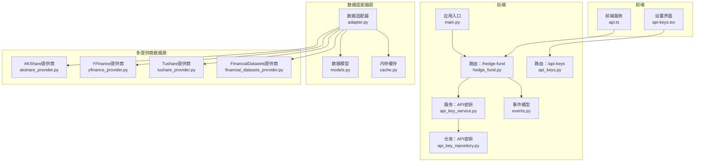
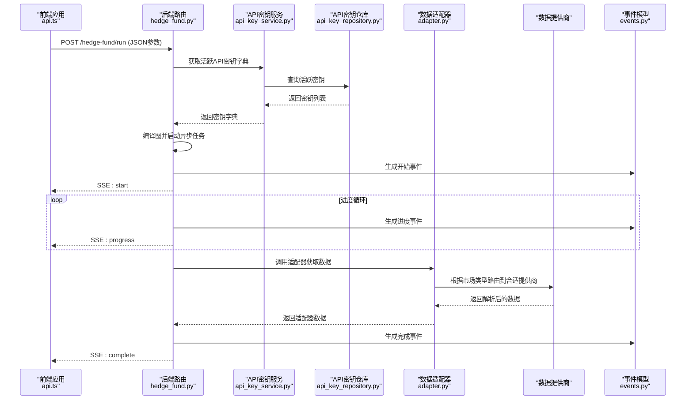
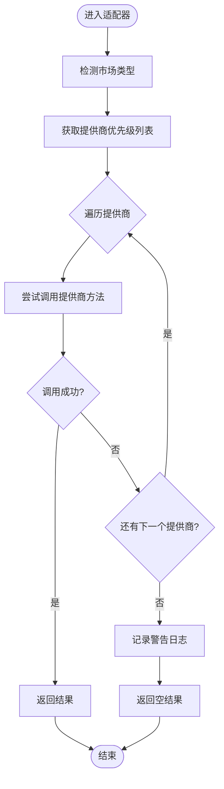
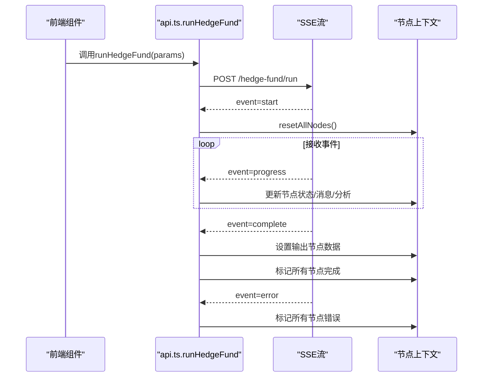
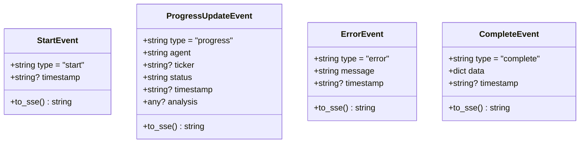
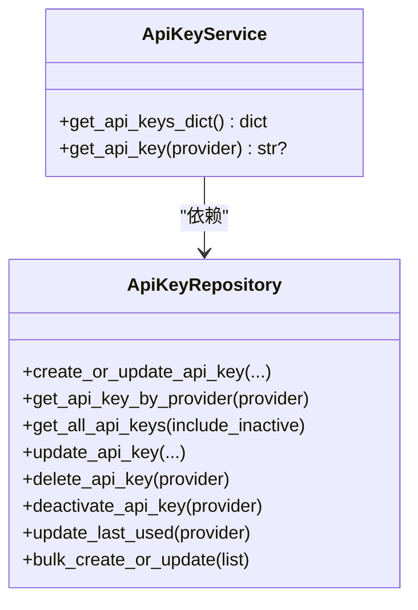
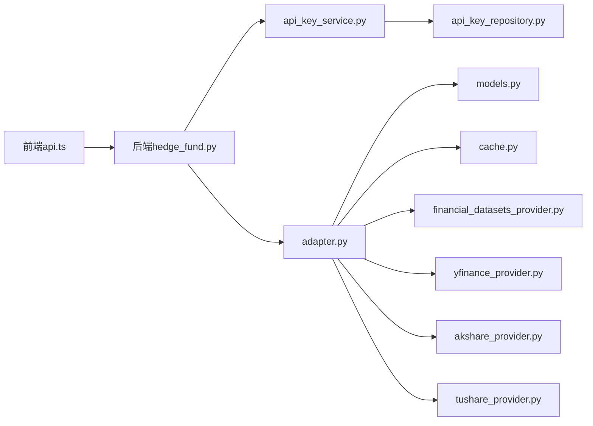

# API客户端集成

<cite>
**本文档引用的文件**
- [main.py](file://app/backend/main.py)
- [api.py](file://src/tools/api.py)
- [adapter.py](file://src/data/adapter.py)
- [financial_datasets_provider.py](file://src/data/providers/financial_datasets_provider.py)
- [yfinance_provider.py](file://src/data/providers/yfinance_provider.py)
- [akshare_provider.py](file://src/data/providers/akshare_provider.py)
- [tushare_provider.py](file://src/data/providers/tushare_provider.py)
- [models.py](file://src/data/models.py)
- [cache.py](file://src/data/cache.py)
- [api.ts](file://app/frontend/src/services/api.ts)
- [api-keys.tsx](file://app/frontend/src/components/settings/api-keys.tsx)
- [api_keys.py](file://app/backend/routes/api_keys.py)
- [api_key_repository.py](file://app/backend/repositories/api_key_repository.py)
- [api_key_service.py](file://app/backend/services/api_key_service.py)
- [hedge_fund.py](file://app/backend/routes/hedge_fund.py)
- [events.py](file://app/backend/models/events.py)
- [progress.py](file://src/utils/progress.py)
- [client.py](file://v2/data/client.py)
- [test_api_rate_limiting.py](file://tests/test_api_rate_limiting.py)
</cite>

## 更新摘要
**变更内容**
- 重构API层架构，引入智能适配器系统进行多市场数据源路由
- 新增多提供商数据源适配器，支持US、CN_SH、CN_SZ、HK市场的智能路由
- 替换原有的单一外部API客户端为统一的数据源适配器层
- 新增多个专用数据提供商（AKShare、YFinance、Tushare、FinancialDatasets）
- 更新数据模型和缓存机制以支持多提供商架构

## 目录
1. [简介](#简介)
2. [项目结构](#项目结构)
3. [核心组件](#核心组件)
4. [架构总览](#架构总览)
5. [详细组件分析](#详细组件分析)
6. [依赖关系分析](#依赖关系分析)
7. [性能考量](#性能考量)
8. [故障排除指南](#故障排除指南)
9. [结论](#结论)
10. [附录](#附录)

## 简介
本文件面向开发者，系统性阐述该项目中API客户端的集成与使用，覆盖外部API数据获取流程、请求构建与响应处理、认证方式、请求头设置与参数校验、错误处理与重试机制、超时配置、限流处理、批量请求优化与并发控制、响应数据转换与格式标准化、数据清洗流程，并提供最佳实践、调试技巧与性能优化建议。

**更新** 本版本重点介绍了重构后的智能适配器系统，该系统能够根据股票市场类型自动路由到最适合的数据提供商，实现多市场、多提供商的统一数据访问接口。

## 项目结构
后端采用FastAPI框架，前端使用TypeScript/React，金融数据通过新的适配器系统访问多个数据提供商（AKShare、YFinance、Tushare、FinancialDatasets），并通过统一的缓存与模型进行数据转换；后端提供SSE流式接口，前端以SSE消费实时进度与结果。

**图表来源**
- [main.py:1-56](file://app/backend/main.py#L1-L56)
- [hedge_fund.py:1-353](file://app/backend/routes/hedge_fund.py#L1-L353)
- [api_keys.py:1-201](file://app/backend/routes/api_keys.py#L1-L201)
- [api_key_service.py:1-23](file://app/backend/services/api_key_service.py#L1-L23)
- [api_key_repository.py:1-131](file://app/backend/repositories/api_key_repository.py#L1-L131)
- [api.ts:1-309](file://app/frontend/src/services/api.ts#L1-L309)
- [api-keys.tsx:1-319](file://app/frontend/src/components/settings/api-keys.tsx#L1-L319)
- [adapter.py:1-246](file://src/data/adapter.py#L1-L246)
- [financial_datasets_provider.py:1-397](file://src/data/providers/financial_datasets_provider.py#L1-L397)
- [yfinance_provider.py:1-521](file://src/data/providers/yfinance_provider.py#L1-L521)
- [akshare_provider.py:1-918](file://src/data/providers/akshare_provider.py#L1-L918)
- [tushare_provider.py:1-724](file://src/data/providers/tushare_provider.py#L1-L724)
- [models.py:1-250](file://src/data/models.py#L1-L250)
- [cache.py:1-72](file://src/data/cache.py#L1-L72)

**章节来源**
- [main.py:1-56](file://app/backend/main.py#L1-L56)
- [hedge_fund.py:1-353](file://app/backend/routes/hedge_fund.py#L1-L353)
- [api.ts:1-309](file://app/frontend/src/services/api.ts#L1-L309)

## 核心组件
- **智能数据适配器**：统一的适配器层，根据股票市场类型自动路由到最适合的数据提供商，支持US、CN_SH、CN_SZ、HK市场的智能选择。
- **多提供商数据源**：AKShare（A股/港股）、YFinance（美股/港股）、Tushare（A股/港股）、FinancialDatasets（多市场）四个专用提供商。
- **前端API服务**：封装SSE连接、事件解析、节点状态更新与中断控制。
- **后端路由与事件**：提供SSE流式输出，将后台执行进度与结果以Server-Sent Events推送至前端。
- **API密钥管理**：数据库存储、查询、批量更新与最后使用时间维护，支持在运行时注入到请求头。
- **数据模型与缓存**：Pydantic模型定义响应结构，内存缓存避免重复请求与去重合并。

**更新** 新增智能适配器系统，替代原有的单一外部API客户端，实现多提供商、多市场的统一数据访问。

**章节来源**
- [adapter.py:21-246](file://src/data/adapter.py#L21-L246)
- [financial_datasets_provider.py:33-397](file://src/data/providers/financial_datasets_provider.py#L33-L397)
- [yfinance_provider.py:25-521](file://src/data/providers/yfinance_provider.py#L25-L521)
- [akshare_provider.py:75-918](file://src/data/providers/akshare_provider.py#L75-L918)
- [tushare_provider.py:57-724](file://src/data/providers/tushare_provider.py#L57-L724)
- [api.ts:1-309](file://app/frontend/src/services/api.ts#L1-L309)
- [hedge_fund.py:1-353](file://app/backend/routes/hedge_fund.py#L1-L353)
- [api_key_repository.py:1-131](file://app/backend/repositories/api_key_repository.py#L1-L131)
- [api_key_service.py:1-23](file://app/backend/services/api_key_service.py#L1-L23)
- [models.py:1-250](file://src/data/models.py#L1-L250)
- [cache.py:1-72](file://src/data/cache.py#L1-L72)

## 架构总览
下图展示从前端发起请求到后端执行、流式返回以及通过智能适配器访问多个数据提供商的整体流程。

**图表来源**
- [api.ts:87-309](file://app/frontend/src/services/api.ts#L87-L309)
- [hedge_fund.py:26-155](file://app/backend/routes/hedge_fund.py#L26-L155)
- [api_key_service.py:12-23](file://app/backend/services/api_key_service.py#L12-L23)
- [api_key_repository.py:48-60](file://app/backend/repositories/api_key_repository.py#L48-L60)
- [events.py:16-46](file://app/backend/models/events.py#L16-L46)
- [adapter.py:77-102](file://src/data/adapter.py#L77-L102)

## 详细组件分析

### 智能数据适配器系统（src/data/adapter.py）
- **智能路由机制**
  - 根据股票代码自动识别市场类型（US、CN_SH、CN_SZ、HK）
  - 为每个市场类型配置优先级提供商列表
  - 支持失败自动切换到备用提供商
- **提供商优先级**
  - 美股：FinancialDatasets → YFinance
  - A股：AKShare → Tushare
  - 港股：AKShare → YFinance
- **统一接口设计**
  - 提供get_prices、get_financial_metrics、get_company_news、get_insider_trades、get_market_cap、search_line_items等统一方法
  - 自动处理不同提供商的参数差异和返回格式
- **错误处理与重试**
  - 逐个尝试提供商，遇到错误自动切换到下一个
  - 记录详细的日志信息便于调试

**图表来源**
- [adapter.py:77-102](file://src/data/adapter.py#L77-L102)
- [adapter.py:31-37](file://src/data/adapter.py#L31-L37)

**章节来源**
- [adapter.py:21-246](file://src/data/adapter.py#L21-L246)
- [models.py:14-31](file://src/data/models.py#L14-L31)

### 多提供商数据源实现

#### FinancialDatasets提供商（src/data/providers/financial_datasets_provider.py）
- **功能特性**
  - 完整保留原有API的所有功能
  - 支持价格、财务指标、新闻、内幕交易等完整数据接口
  - 实现精确的缓存机制和分页处理
- **认证与请求**
  - 支持API密钥认证，自动添加X-API-KEY请求头
  - 实现线性回退重试机制（60s、90s、120s...）
- **数据处理**
  - 使用Pydantic模型严格验证响应格式
  - 实现完整的数据解析和转换

#### YFinance提供商（src/data/providers/yfinance_provider.py）
- **功能特性**
  - 专门支持美股和港股市场
  - 通过yfinance库获取实时和历史数据
  - 实现财务指标和股价数据的综合处理
- **数据映射**
  - 建立yfinance字段到标准FinancialMetrics字段的映射
  - 支持派生财务指标的计算
- **限制说明**
  - 不支持A股市场（CN_SH、CN_SZ）

#### AKShare提供商（src/data/providers/akshare_provider.py）
- **功能特性**
  - 专门支持A股和港股市场
  - 通过AKShare库获取中国股市数据
  - 实现指数退避重试机制
- **数据处理**
  - 处理中文字段名到英文字段名的映射
  - 实现复杂的财务报表数据解析
- **市场支持**
  - 支持A股（CN_SH、CN_SZ）和港股（HK）

#### Tushare提供商（src/data/providers/tushare_provider.py）
- **功能特性**
  - 专门支持A股和港股市场
  - 通过Tushare Pro API获取高质量数据
  - 实现严格的API调用频率控制
- **数据质量**
  - 提供更准确的财务指标数据
  - 支持分钟级K线数据
- **配置要求**
  - 需要有效的TUSHARE_TOKEN环境变量

**章节来源**
- [financial_datasets_provider.py:33-397](file://src/data/providers/financial_datasets_provider.py#L33-L397)
- [yfinance_provider.py:25-521](file://src/data/providers/yfinance_provider.py#L25-L521)
- [akshare_provider.py:75-918](file://src/data/providers/akshare_provider.py#L75-L918)
- [tushare_provider.py:57-724](file://src/data/providers/tushare_provider.py#L57-L724)

### 前端SSE客户端（app/frontend/src/services/api.ts）
- **基础地址与请求**
  - 通过环境变量配置后端地址，默认指向本地8000端口
  - 发起POST请求提交运行参数，建立SSE连接
- **流式事件解析**
  - 自定义SSE解析器，按双换行符拆分事件，提取事件类型与数据
  - 支持start、progress、complete、error四种事件类型
- **节点状态与UI联动**
  - 将progress事件映射到节点状态（进行中/完成/错误）
  - complete事件将最终结果写入输出节点上下文
- **中断与清理**
  - 使用AbortController中断SSE连接，清理连接状态与定时器
  - 断开或异常时统一标记为ERROR并清理状态

**图表来源**
- [api.ts:87-309](file://app/frontend/src/services/api.ts#L87-L309)

**章节来源**
- [api.ts:10-309](file://app/frontend/src/services/api.ts#L10-L309)

### 后端SSE路由与事件（app/backend/routes/hedge_fund.py, app/backend/models/events.py）
- **路由设计**
  - POST /hedge-fund/run：接收参数，编译图并启动异步执行任务
  - 使用asyncio队列与事件生成器，向客户端发送SSE事件
- **事件模型**
  - StartEvent：开始事件
  - ProgressUpdateEvent：进度事件，携带agent、ticker、status、analysis等
  - ErrorEvent：错误事件，携带错误信息
  - CompleteEvent：完成事件，携带最终决策与分析结果
- **客户端断连检测**
  - 异步监听HTTP断连消息，及时取消后台任务并清理资源

**图表来源**
- [events.py:5-46](file://app/backend/models/events.py#L5-L46)

**章节来源**
- [hedge_fund.py:26-155](file://app/backend/routes/hedge_fund.py#L26-L155)
- [events.py:1-46](file://app/backend/models/events.py#L1-L46)

### API密钥管理（后端）
- **密钥存储与查询**
  - 数据库表ApiKey，支持创建、更新、删除、停用、批量更新与最后使用时间更新
  - 服务层提供加载活跃密钥字典与按提供商查询密钥值的能力
- **在运行时注入**
  - 当请求未显式提供api_keys时，后端从数据库加载并注入到请求参数中，供Python工具模块使用

**图表来源**
- [api_key_repository.py:9-131](file://app/backend/repositories/api_key_repository.py#L9-L131)
- [api_key_service.py:6-23](file://app/backend/services/api_key_service.py#L6-L23)

**章节来源**
- [api_keys.py:1-201](file://app/backend/routes/api_keys.py#L1-L201)
- [api_key_repository.py:1-131](file://app/backend/repositories/api_key_repository.py#L1-L131)
- [api_key_service.py:1-23](file://app/backend/services/api_key_service.py#L1-L23)

### 前端密钥设置界面（app/frontend/src/components/settings/api-keys.tsx）
- **功能概览**
  - 展示多组API提供商（金融数据、LLM等）的密钥输入框
  - 支持显示/隐藏、清空、自动保存（防抖）
  - 通过后端API实现增删改查与停用操作
- **安全提示**
  - 明确提示密钥存储于本地并自动保存，强调安全重要性

**章节来源**
- [api-keys.tsx:1-319](file://app/frontend/src/components/settings/api-keys.tsx#L1-L319)

### v2数据客户端（v2/data/client.py）
- **设计要点**
  - 使用requests.Session复用连接，设置默认请求头
  - 统一的_retry_delays策略，遇到429自动按固定延迟重试
  - 所有公共方法均返回Pydantic模型或None，避免异常传播
- **适用场景**
  - 作为替代方案或补充，与src/tools/api.py形成互补

**章节来源**
- [client.py:1-227](file://v2/data/client.py#L1-L227)

## 依赖关系分析
- **前端到后端**：通过SSE流式通信，后端负责业务编排与事件生成
- **后端到适配器**：后端在运行时注入API密钥，适配器系统负责智能路由到合适的提供商
- **适配器到提供商**：适配器根据市场类型自动选择最适合的数据提供商
- **数据模型**：Pydantic模型贯穿响应解析与缓存序列化
- **缓存**：内存缓存按参数键合并新旧数据，避免重复请求与重复记录

**图表来源**
- [api.ts:1-309](file://app/frontend/src/services/api.ts#L1-L309)
- [hedge_fund.py:1-353](file://app/backend/routes/hedge_fund.py#L1-L353)
- [api_key_service.py:1-23](file://app/backend/services/api_key_service.py#L1-L23)
- [api_key_repository.py:1-131](file://app/backend/repositories/api_key_repository.py#L1-L131)
- [adapter.py:1-246](file://src/data/adapter.py#L1-L246)
- [financial_datasets_provider.py:1-397](file://src/data/providers/financial_datasets_provider.py#L1-L397)
- [yfinance_provider.py:1-521](file://src/data/providers/yfinance_provider.py#L1-L521)
- [akshare_provider.py:1-918](file://src/data/providers/akshare_provider.py#L1-L918)
- [tushare_provider.py:1-724](file://src/data/providers/tushare_provider.py#L1-L724)
- [models.py:1-250](file://src/data/models.py#L1-L250)
- [cache.py:1-72](file://src/data/cache.py#L1-L72)

**章节来源**
- [api.ts:1-309](file://app/frontend/src/services/api.ts#L1-L309)
- [hedge_fund.py:1-353](file://app/backend/routes/hedge_fund.py#L1-L353)
- [adapter.py:1-246](file://src/data/adapter.py#L1-L246)

## 性能考量
- **智能路由优化**
  - 根据市场类型选择最优提供商，避免跨市场数据访问的性能损失
  - 提供商优先级配置基于各提供商的性能特点
- **缓存策略**
  - 按参数组合生成精确缓存键，避免不同参数混用
  - 缓存内对关键字段去重合并，减少重复数据
- **限流与重试**
  - 各提供商实现各自的限流和重试策略
  - 适配器层实现失败自动切换，提高整体可用性
- **并发与流式**
  - 后端使用异步任务与队列，SSE边计算边推送，降低端到端延迟
- **数据转换**
  - 价格数据转DataFrame时统一时间列与数值列，便于后续分析

**更新** 新增智能适配器的性能优化策略，包括市场类型检测、提供商优先级选择和自动故障转移。

**章节来源**
- [adapter.py:31-37](file://src/data/adapter.py#L31-L37)
- [adapter.py:77-102](file://src/data/adapter.py#L77-L102)
- [cache.py:11-22](file://src/data/cache.py#L11-L22)
- [financial_datasets_provider.py:53-99](file://src/data/providers/financial_datasets_provider.py#L53-L99)
- [hedge_fund.py:63-155](file://app/backend/routes/hedge_fund.py#L63-L155)
- [api.py:351-367](file://src/tools/api.py#L351-L367)

## 故障排除指南
- **常见问题**
  - **提供商选择错误**：检查股票代码格式和市场类型检测逻辑
  - **API密钥认证失败**：验证各提供商的API密钥配置
  - **跨市场数据访问**：确认目标市场对应的提供商是否可用
  - **429限流**：各提供商实现不同的限流策略，需要适当调整请求频率
  - **SSE断连**：前端AbortController可手动中断；后端检测断连并清理任务
  - **密钥缺失**：后端会尝试从数据库加载活跃密钥；若仍为空，外部API可能鉴权失败
- **调试技巧**
  - **前端**：检查SSE事件类型与数据内容，确认节点状态更新是否正确
  - **后端**：查看事件生成与队列处理逻辑，定位阻塞点
  - **适配器**：启用详细日志，观察提供商选择和路由过程
  - **提供商**：检查各自的错误日志和重试机制
- **单元测试参考**
  - 测试覆盖了单次/多次限流、POST限流、非429错误、正常成功与最大重试耗尽等场景

**更新** 新增适配器系统的故障排除指南，包括提供商选择、API密钥配置和跨市场访问等问题的诊断方法。

**章节来源**
- [test_api_rate_limiting.py:1-249](file://tests/test_api_rate_limiting.py#L1-L249)
- [api.ts:250-295](file://app/frontend/src/services/api.ts#L250-L295)
- [hedge_fund.py:51-155](file://app/backend/routes/hedge_fund.py#L51-L155)
- [adapter.py:94-96](file://src/data/adapter.py#L94-L96)

## 结论
该系统通过重构后的智能适配器系统实现了更加稳健和灵活的外部API集成：前端以SSE实时消费后端事件，后端在运行时注入API密钥并驱动异步执行，智能适配器系统负责根据市场类型自动路由到最适合的数据提供商，各提供商负责具体的外部API调用与数据转换。新架构具备更好的扩展性、可维护性和多市场支持能力，适合在金融数据与大模型推理场景中进一步演进。

**更新** 新架构通过智能适配器系统实现了多提供商、多市场的统一数据访问，显著提升了系统的灵活性和可靠性。

## 附录

### API认证与请求头设置
- **认证方式**
  - 外部API：通过请求头注入API密钥
  - 后端内部：数据库存储密钥，运行时注入到请求参数
- **请求头**
  - 统一设置X-API-Key，支持GET/POST请求
- **参数验证**
  - 对日期范围、分页参数进行字符串拼接与存在性检查

**章节来源**
- [financial_datasets_provider.py:46-51](file://src/data/providers/financial_datasets_provider.py#L46-L51)
- [api.py:73-78](file://src/tools/api.py#L73-L78)
- [api.py:115-120](file://src/tools/api.py#L115-L120)
- [api.py:151-154](file://src/tools/api.py#L151-L154)
- [hedge_fund.py:28-31](file://app/backend/routes/hedge_fund.py#L28-L31)

### 错误处理、重试与超时
- **重试机制**
  - **FinancialDatasets**：429线性回退，最多重试若干次
  - **AKShare**：指数退避重试，处理JSONDecodeError、ConnectionError等
  - **Tushare**：API调用频率控制，避免过度请求
  - **YFinance**：通过过滤器抑制警告，主要依赖外部库稳定性
- **超时配置**
  - 各提供商根据自身API特点设置合适的超时时间
  - 适配器层实现统一的错误处理和重试策略
- **错误返回**
  - 非429错误直接返回；429且超过重试上限也返回相应状态码

**更新** 新增各提供商的具体重试策略和超时配置说明。

**章节来源**
- [financial_datasets_provider.py:53-99](file://src/data/providers/financial_datasets_provider.py#L53-L99)
- [akshare_provider.py:81-134](file://src/data/providers/akshare_provider.py#L81-L134)
- [tushare_provider.py:57-724](file://src/data/providers/tushare_provider.py#L57-L724)
- [yfinance_provider.py:25-521](file://src/data/providers/yfinance_provider.py#L25-L521)
- [adapter.py:94-102](file://src/data/adapter.py#L94-L102)

### 限流处理与并发控制
- **限流策略**
  - **FinancialDatasets**：线性回退，避免集中重试
  - **AKShare**：指数退避重试，处理网络异常
  - **Tushare**：严格的API调用频率控制（0.5秒间隔）
  - **YFinance**：通过外部库处理，主要依赖库的稳定性
- **并发控制**
  - 后端使用异步任务与队列，SSE边计算边推送，避免阻塞
  - 适配器层实现提供商级别的并发控制

**更新** 新增各提供商的限流策略和并发控制机制。

**章节来源**
- [financial_datasets_provider.py:53-99](file://src/data/providers/financial_datasets_provider.py#L53-L99)
- [akshare_provider.py:81-134](file://src/data/providers/akshare_provider.py#L81-L134)
- [tushare_provider.py:21-22](file://src/data/providers/tushare_provider.py#L21-L22)
- [hedge_fund.py:63-155](file://app/backend/routes/hedge_fund.py#L63-L155)

### 批量请求优化
- **批量更新密钥**
  - 后端提供批量更新接口，支持一次性导入多组密钥
- **缓存合并**
  - 内存缓存按关键字段去重合并，避免重复数据
- **智能适配器优化**
  - 统一的缓存机制，避免重复调用相同数据
  - 提供商级别的缓存策略

**更新** 新增适配器系统的批量请求优化策略。

**章节来源**
- [api_keys.py:155-180](file://app/backend/routes/api_keys.py#L155-L180)
- [cache.py:11-22](file://src/data/cache.py#L11-L22)
- [adapter.py:11-18](file://src/data/adapter.py#L11-L18)

### 响应数据转换与清洗
- **数据模型**
  - 使用Pydantic模型定义响应结构，自动校验字段类型与可选性
- **数据清洗**
  - 价格数据转DataFrame时统一时间列与数值列，排序与缺失值处理
- **格式标准化**
  - 统一事件格式（SSE）、统一节点状态枚举与显示名称
- **多提供商数据标准化**
  - 适配器层实现不同提供商数据格式的统一转换

**更新** 新增适配器系统的多提供商数据标准化机制。

**章节来源**
- [models.py:4-250](file://src/data/models.py#L4-L250)
- [api.py:351-367](file://src/tools/api.py#L351-L367)
- [events.py:10-13](file://app/backend/models/events.py#L10-L13)
- [progress.py:70-112](file://src/utils/progress.py#L70-L112)
- [adapter.py:104-246](file://src/data/adapter.py#L104-L246)

### 最佳实践与调试建议
- **最佳实践**
  - 明确区分429与其他错误，针对429采用指数或线性回退策略
  - 使用缓存键包含所有关键参数，避免缓存污染
  - SSE事件尽量轻量化，复杂数据放入analysis字段或单独接口
  - 密钥管理最小权限原则，仅在需要时注入到请求头
  - **适配器使用**：充分利用智能路由功能，避免手动指定提供商
  - **多市场支持**：根据目标市场选择合适的提供商组合
- **调试建议**
  - **前端**：打印SSE事件类型与数据，核对节点状态映射
  - **后端**：增加事件生成与队列处理的日志级别
  - **适配器**：启用详细日志，观察市场类型检测和提供商选择过程
  - **提供商**：检查各自的错误日志和重试机制
  - **缓存**：监控缓存命中率和数据一致性

**更新** 新增适配器系统的最佳实践和调试建议。

**章节来源**
- [api.ts:154-244](file://app/frontend/src/services/api.ts#L154-L244)
- [hedge_fund.py:95-137](file://app/backend/routes/hedge_fund.py#L95-L137)
- [api.py:84-96](file://src/tools/api.py#L84-L96)
- [progress.py:44-64](file://src/utils/progress.py#L44-L64)
- [adapter.py:11-18](file://src/data/adapter.py#L11-L18)