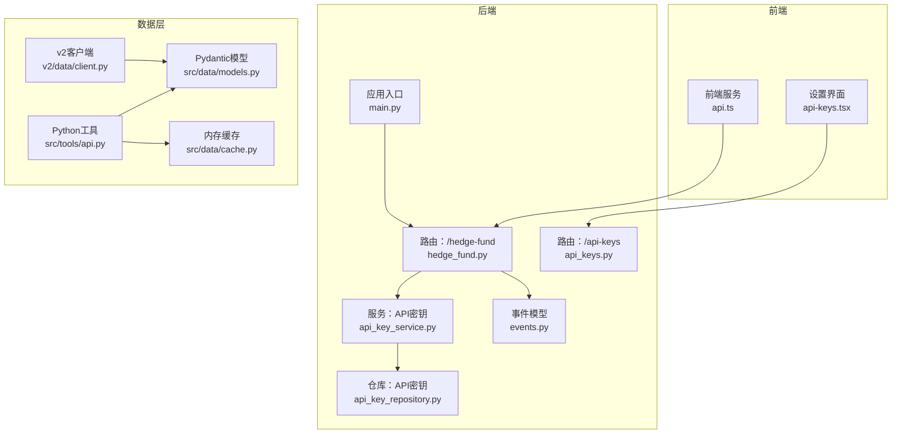
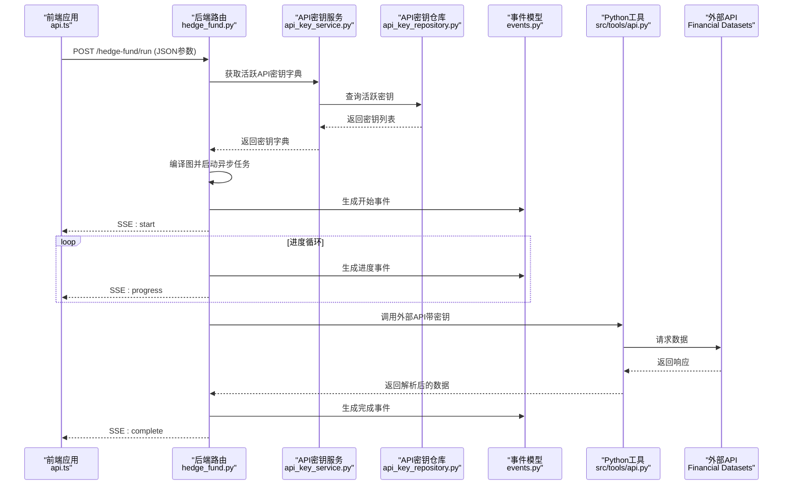
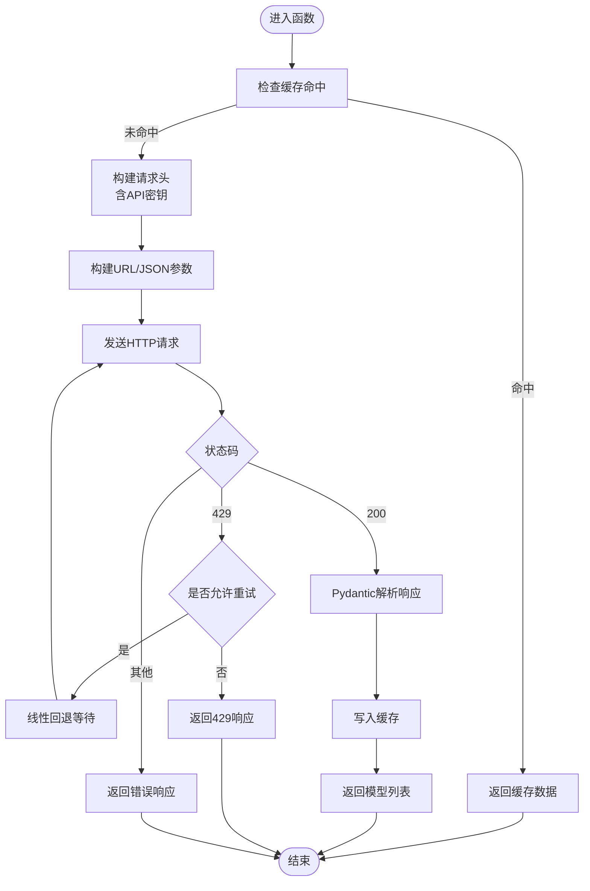
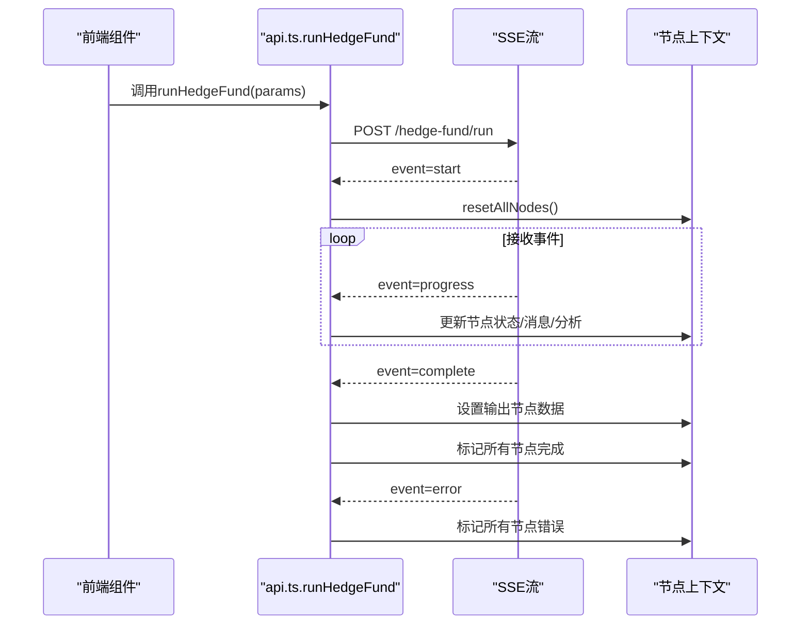
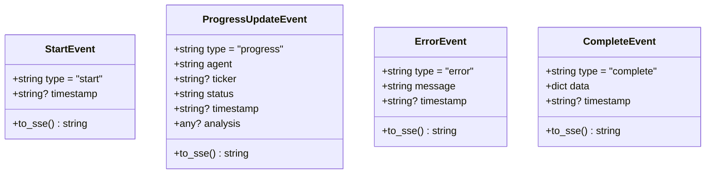
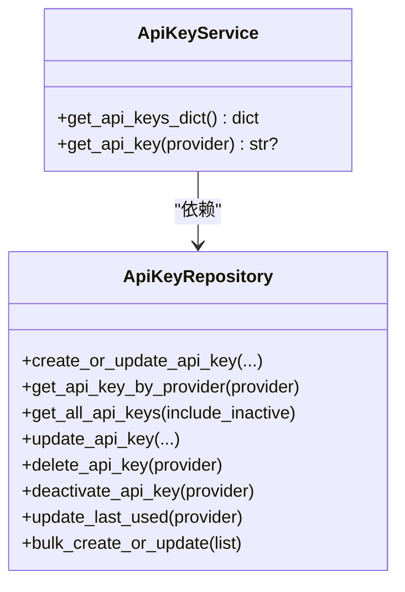
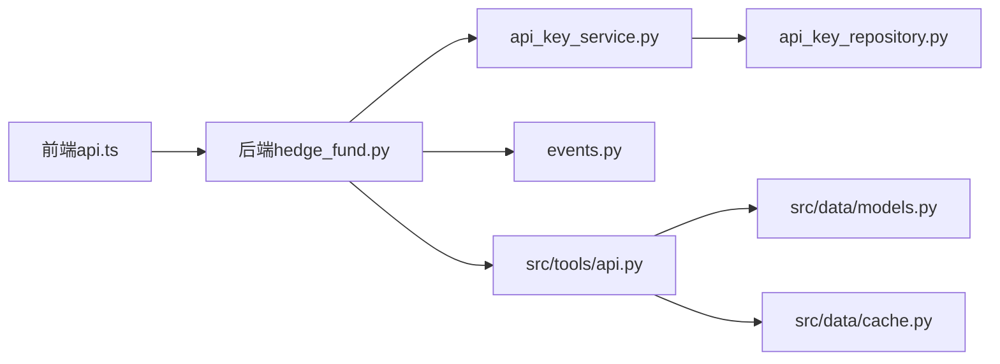

# API客户端集成

<cite>
**本文档引用的文件**
- [main.py](file://app/backend/main.py)
- [api.py](file://src/tools/api.py)
- [api.ts](file://app/frontend/src/services/api.ts)
- [api-keys.tsx](file://app/frontend/src/components/settings/api-keys.tsx)
- [api_keys.py](file://app/backend/routes/api_keys.py)
- [api_key_repository.py](file://app/backend/repositories/api_key_repository.py)
- [api_key_service.py](file://app/backend/services/api_key_service.py)
- [models.py](file://src/data/models.py)
- [cache.py](file://src/data/cache.py)
- [hedge_fund.py](file://app/backend/routes/hedge_fund.py)
- [events.py](file://app/backend/models/events.py)
- [progress.py](file://src/utils/progress.py)
- [client.py](file://v2/data/client.py)
- [test_api_rate_limiting.py](file://tests/test_api_rate_limiting.py)
</cite>

## 目录
1. [简介](#简介)
2. [项目结构](#项目结构)
3. [核心组件](#核心组件)
4. [架构总览](#架构总览)
5. [详细组件分析](#详细组件分析)
6. [依赖关系分析](#依赖关系分析)
7. [性能考量](#性能考量)
8. [故障排除指南](#故障排除指南)
9. [结论](#结论)
10. [附录](#附录)

## 简介
本文件面向开发者，系统性阐述该项目中API客户端的集成与使用，覆盖外部API数据获取流程、请求构建与响应处理、认证方式、请求头设置与参数校验、错误处理与重试机制、超时配置、限流处理、批量请求优化与并发控制、响应数据转换与格式标准化、数据清洗流程，并提供最佳实践、调试技巧与性能优化建议。

## 项目结构
后端采用FastAPI框架，前端使用TypeScript/React，金融数据通过独立的Python工具模块调用外部API（Financial Datasets），并通过缓存与模型进行数据转换；后端提供SSE流式接口，前端以SSE消费实时进度与结果。

**图表来源**
- [main.py:1-56](file://app/backend/main.py#L1-L56)
- [hedge_fund.py:1-353](file://app/backend/routes/hedge_fund.py#L1-L353)
- [api_keys.py:1-201](file://app/backend/routes/api_keys.py#L1-L201)
- [api_key_service.py:1-23](file://app/backend/services/api_key_service.py#L1-L23)
- [api_key_repository.py:1-131](file://app/backend/repositories/api_key_repository.py#L1-L131)
- [api.ts:1-309](file://app/frontend/src/services/api.ts#L1-L309)
- [api-keys.tsx:1-319](file://app/frontend/src/components/settings/api-keys.tsx#L1-L319)
- [api.py:1-367](file://src/tools/api.py#L1-L367)
- [models.py:1-175](file://src/data/models.py#L1-L175)
- [cache.py:1-72](file://src/data/cache.py#L1-L72)
- [client.py:1-227](file://v2/data/client.py#L1-L227)

**章节来源**
- [main.py:1-56](file://app/backend/main.py#L1-L56)
- [hedge_fund.py:1-353](file://app/backend/routes/hedge_fund.py#L1-L353)
- [api.ts:1-309](file://app/frontend/src/services/api.ts#L1-L309)

## 核心组件
- 外部API客户端（Python）：封装请求、重试、限流、缓存与数据模型转换，统一访问Financial Datasets API。
- 前端API服务：封装SSE连接、事件解析、节点状态更新与中断控制。
- 后端路由与事件：提供SSE流式输出，将后台执行进度与结果以Server-Sent Events推送至前端。
- API密钥管理：数据库存储、查询、批量更新与最后使用时间维护，支持在运行时注入到请求头。
- 数据模型与缓存：Pydantic模型定义响应结构，内存缓存避免重复请求与去重合并。

**章节来源**
- [api.py:1-367](file://src/tools/api.py#L1-L367)
- [api.ts:1-309](file://app/frontend/src/services/api.ts#L1-L309)
- [hedge_fund.py:1-353](file://app/backend/routes/hedge_fund.py#L1-L353)
- [api_key_repository.py:1-131](file://app/backend/repositories/api_key_repository.py#L1-L131)
- [api_key_service.py:1-23](file://app/backend/services/api_key_service.py#L1-L23)
- [models.py:1-175](file://src/data/models.py#L1-L175)
- [cache.py:1-72](file://src/data/cache.py#L1-L72)

## 架构总览
下图展示从前端发起请求到后端执行、流式返回以及Python工具模块访问外部API的整体流程。

**图表来源**
- [api.ts:87-309](file://app/frontend/src/services/api.ts#L87-L309)
- [hedge_fund.py:26-155](file://app/backend/routes/hedge_fund.py#L26-L155)
- [api_key_service.py:12-23](file://app/backend/services/api_key_service.py#L12-L23)
- [api_key_repository.py:48-60](file://app/backend/repositories/api_key_repository.py#L48-L60)
- [events.py:16-46](file://app/backend/models/events.py#L16-L46)
- [api.py:63-96](file://src/tools/api.py#L63-L96)

## 详细组件分析

### Python外部API客户端（src/tools/api.py）
- 认证与请求头
  - 支持从参数或环境变量读取API密钥，统一设置请求头。
  - 不同函数按需设置头部，确保外部API鉴权。
- 请求构建与参数校验
  - GET/POST方法支持，参数拼接URL或JSON体。
  - 对日期范围、分页等参数进行字符串拼接与条件判断。
- 错误处理与重试
  - 针对429限流采用线性回退（60s、90s、120s…），最多重试若干次。
  - 其他非429错误直接返回响应，不自动重试。
- 分页与聚合
  - 内置分页逻辑，基于返回数量与边界日期迭代拉取完整数据集。
- 缓存与数据模型
  - 使用全局内存缓存，按参数键精确匹配，命中则直接返回。
  - 解析响应为Pydantic模型，保证字段类型与可选性一致。
- 数据转换
  - 提供价格数据转DataFrame的便捷函数，统一时间列、数值列与排序。

**图表来源**
- [api.py:29-61](file://src/tools/api.py#L29-L61)
- [api.py:63-96](file://src/tools/api.py#L63-L96)
- [api.py:198-246](file://src/tools/api.py#L198-L246)

**章节来源**
- [api.py:29-61](file://src/tools/api.py#L29-L61)
- [api.py:63-96](file://src/tools/api.py#L63-L96)
- [api.py:198-246](file://src/tools/api.py#L198-L246)
- [models.py:4-114](file://src/data/models.py#L4-L114)
- [cache.py:1-72](file://src/data/cache.py#L1-L72)

### 前端SSE客户端（app/frontend/src/services/api.ts）
- 基础地址与请求
  - 通过环境变量配置后端地址，默认指向本地8000端口。
  - 发起POST请求提交运行参数，建立SSE连接。
- 流式事件解析
  - 自定义SSE解析器，按双换行符拆分事件，提取事件类型与数据。
  - 支持start、progress、complete、error四种事件类型。
- 节点状态与UI联动
  - 将progress事件映射到节点状态（进行中/完成/错误）。
  - complete事件将最终结果写入输出节点上下文。
- 中断与清理
  - 使用AbortController中断SSE连接，清理连接状态与定时器。
  - 断开或异常时统一标记为ERROR并清理状态。

**图表来源**
- [api.ts:87-309](file://app/frontend/src/services/api.ts#L87-L309)

**章节来源**
- [api.ts:10-309](file://app/frontend/src/services/api.ts#L10-L309)

### 后端SSE路由与事件（app/backend/routes/hedge_fund.py, app/backend/models/events.py）
- 路由设计
  - POST /hedge-fund/run：接收参数，编译图并启动异步执行任务。
  - 使用asyncio队列与事件生成器，向客户端发送SSE事件。
- 事件模型
  - StartEvent：开始事件。
  - ProgressUpdateEvent：进度事件，携带agent、ticker、status、analysis等。
  - ErrorEvent：错误事件，携带错误信息。
  - CompleteEvent：完成事件，携带最终决策与分析结果。
- 客户端断连检测
  - 异步监听HTTP断连消息，及时取消后台任务并清理资源。

**图表来源**
- [events.py:5-46](file://app/backend/models/events.py#L5-L46)

**章节来源**
- [hedge_fund.py:26-155](file://app/backend/routes/hedge_fund.py#L26-L155)
- [events.py:1-46](file://app/backend/models/events.py#L1-L46)

### API密钥管理（后端）
- 密钥存储与查询
  - 数据库表ApiKey，支持创建、更新、删除、停用、批量更新与最后使用时间更新。
  - 服务层提供加载活跃密钥字典与按提供商查询密钥值的能力。
- 在运行时注入
  - 当请求未显式提供api_keys时，后端从数据库加载并注入到请求参数中，供Python工具模块使用。

**图表来源**
- [api_key_repository.py:9-131](file://app/backend/repositories/api_key_repository.py#L9-L131)
- [api_key_service.py:6-23](file://app/backend/services/api_key_service.py#L6-L23)

**章节来源**
- [api_keys.py:1-201](file://app/backend/routes/api_keys.py#L1-L201)
- [api_key_repository.py:1-131](file://app/backend/repositories/api_key_repository.py#L1-L131)
- [api_key_service.py:1-23](file://app/backend/services/api_key_service.py#L1-L23)

### 前端密钥设置界面（app/frontend/src/components/settings/api-keys.tsx）
- 功能概览
  - 展示多组API提供商（金融数据、LLM等）的密钥输入框。
  - 支持显示/隐藏、清空、自动保存（防抖）。
  - 通过后端API实现增删改查与停用操作。
- 安全提示
  - 明确提示密钥存储于本地并自动保存，强调安全重要性。

**章节来源**
- [api-keys.tsx:1-319](file://app/frontend/src/components/settings/api-keys.tsx#L1-L319)

### v2数据客户端（v2/data/client.py）
- 设计要点
  - 使用requests.Session复用连接，设置默认请求头。
  - 统一的_retry_delays策略，遇到429自动按固定延迟重试。
  - 所有公共方法均返回Pydantic模型或None，避免异常传播。
- 适用场景
  - 作为替代方案或补充，与src/tools/api.py形成互补。

**章节来源**
- [client.py:1-227](file://v2/data/client.py#L1-L227)

## 依赖关系分析
- 前端到后端：通过SSE流式通信，后端负责业务编排与事件生成。
- 后端到Python工具：后端在运行时注入API密钥，Python工具模块负责实际外部API调用与数据转换。
- 数据模型：Pydantic模型贯穿响应解析与缓存序列化。
- 缓存：内存缓存按参数键合并新旧数据，避免重复请求与重复记录。

**图表来源**
- [api.ts:1-309](file://app/frontend/src/services/api.ts#L1-L309)
- [hedge_fund.py:1-353](file://app/backend/routes/hedge_fund.py#L1-L353)
- [api_key_service.py:1-23](file://app/backend/services/api_key_service.py#L1-L23)
- [api_key_repository.py:1-131](file://app/backend/repositories/api_key_repository.py#L1-L131)
- [events.py:1-46](file://app/backend/models/events.py#L1-L46)
- [api.py:1-367](file://src/tools/api.py#L1-L367)
- [models.py:1-175](file://src/data/models.py#L1-L175)
- [cache.py:1-72](file://src/data/cache.py#L1-L72)

**章节来源**
- [api.ts:1-309](file://app/frontend/src/services/api.ts#L1-L309)
- [hedge_fund.py:1-353](file://app/backend/routes/hedge_fund.py#L1-L353)
- [api.py:1-367](file://src/tools/api.py#L1-L367)

## 性能考量
- 缓存策略
  - 按参数组合生成精确缓存键，避免不同参数混用。
  - 缓存内对关键字段去重合并，减少重复数据。
- 限流与重试
  - Python工具模块对429采用线性回退，避免雪崩效应。
  - v2客户端采用固定延迟重试，适合稳定环境。
- 并发与流式
  - 后端使用异步任务与队列，SSE边计算边推送，降低端到端延迟。
- 数据转换
  - 价格数据转DataFrame时统一时间列与数值列，便于后续分析。

**章节来源**
- [cache.py:11-22](file://src/data/cache.py#L11-L22)
- [api.py:29-61](file://src/tools/api.py#L29-L61)
- [client.py:191-226](file://v2/data/client.py#L191-L226)
- [hedge_fund.py:63-155](file://app/backend/routes/hedge_fund.py#L63-L155)
- [api.py:351-367](file://src/tools/api.py#L351-L367)

## 故障排除指南
- 常见问题
  - 429限流：Python工具模块会自动回退重试；若超过最大重试次数仍失败，将返回429。
  - 非429错误：直接返回对应状态码，不自动重试。
  - SSE断连：前端AbortController可手动中断；后端检测断连并清理任务。
  - 密钥缺失：后端会尝试从数据库加载活跃密钥；若仍为空，外部API可能鉴权失败。
- 调试技巧
  - 前端：检查SSE事件类型与数据内容，确认节点状态更新是否正确。
  - 后端：查看事件生成与队列处理逻辑，定位阻塞点。
  - Python工具：开启日志，观察重试次数与最终返回状态。
- 单元测试参考
  - 测试覆盖了单次/多次限流、POST限流、非429错误、正常成功与最大重试耗尽等场景。

**章节来源**
- [test_api_rate_limiting.py:1-249](file://tests/test_api_rate_limiting.py#L1-L249)
- [api.ts:250-295](file://app/frontend/src/services/api.ts#L250-L295)
- [hedge_fund.py:51-155](file://app/backend/routes/hedge_fund.py#L51-L155)
- [api.py:29-61](file://src/tools/api.py#L29-L61)

## 结论
该系统通过前后端协作与Python工具模块实现了稳健的外部API集成：前端以SSE实时消费后端事件，后端在运行时注入API密钥并驱动异步执行，Python工具模块负责请求、限流、缓存与数据模型转换。整体具备良好的扩展性与可维护性，适合在金融数据与大模型推理场景中进一步演进。

## 附录

### API认证与请求头设置
- 认证方式
  - 外部API：通过请求头注入API密钥。
  - 后端内部：数据库存储密钥，运行时注入到请求参数。
- 请求头
  - 统一设置X-API-Key，支持GET/POST请求。
- 参数验证
  - 对日期范围、分页参数进行字符串拼接与存在性检查。

**章节来源**
- [api.py:73-78](file://src/tools/api.py#L73-L78)
- [api.py:115-120](file://src/tools/api.py#L115-L120)
- [api.py:151-154](file://src/tools/api.py#L151-L154)
- [hedge_fund.py:28-31](file://app/backend/routes/hedge_fund.py#L28-L31)

### 错误处理、重试与超时
- 重试机制
  - Python工具：429线性回退，最多重试若干次。
  - v2客户端：固定延迟重试，最多若干次。
- 超时配置
  - v2客户端支持自定义超时；Python工具当前未显式设置超时。
- 错误返回
  - 非429错误直接返回；429且超过重试上限也返回429。

**章节来源**
- [api.py:29-61](file://src/tools/api.py#L29-L61)
- [client.py:191-226](file://v2/data/client.py#L191-L226)

### 限流处理与并发控制
- 限流策略
  - Python工具：线性回退，避免集中重试。
  - v2客户端：固定延迟重试，适合稳定环境。
- 并发控制
  - 后端使用异步任务与队列，SSE边计算边推送，避免阻塞。

**章节来源**
- [api.py:29-61](file://src/tools/api.py#L29-L61)
- [client.py:191-226](file://v2/data/client.py#L191-L226)
- [hedge_fund.py:63-155](file://app/backend/routes/hedge_fund.py#L63-L155)

### 批量请求优化
- 批量更新密钥
  - 后端提供批量更新接口，支持一次性导入多组密钥。
- 缓存合并
  - 内存缓存按关键字段去重合并，避免重复数据。

**章节来源**
- [api_keys.py:155-180](file://app/backend/routes/api_keys.py#L155-L180)
- [cache.py:11-22](file://src/data/cache.py#L11-L22)

### 响应数据转换与清洗
- 数据模型
  - 使用Pydantic模型定义响应结构，自动校验字段类型与可选性。
- 数据清洗
  - 价格数据转DataFrame时统一时间列与数值列，排序与缺失值处理。
- 格式标准化
  - 统一事件格式（SSE）、统一节点状态枚举与显示名称。

**章节来源**
- [models.py:4-175](file://src/data/models.py#L4-L175)
- [api.py:351-367](file://src/tools/api.py#L351-L367)
- [events.py:10-13](file://app/backend/models/events.py#L10-L13)
- [progress.py:70-112](file://src/utils/progress.py#L70-L112)

### 最佳实践与调试建议
- 最佳实践
  - 明确区分429与其他错误，针对429采用指数或线性回退策略。
  - 使用缓存键包含所有关键参数，避免缓存污染。
  - SSE事件尽量轻量化，复杂数据放入analysis字段或单独接口。
  - 密钥管理最小权限原则，仅在需要时注入到请求头。
- 调试建议
  - 前端：打印SSE事件类型与数据，核对节点状态映射。
  - 后端：增加事件生成与队列处理的日志级别。
  - Python工具：开启HTTP与解析日志，观察重试与缓存命中率。

**章节来源**
- [api.ts:154-244](file://app/frontend/src/services/api.ts#L154-L244)
- [hedge_fund.py:95-137](file://app/backend/routes/hedge_fund.py#L95-L137)
- [api.py:84-96](file://src/tools/api.py#L84-L96)
- [progress.py:44-64](file://src/utils/progress.py#L44-L64)