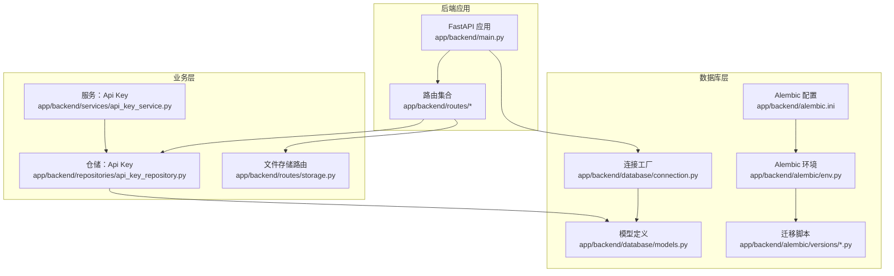
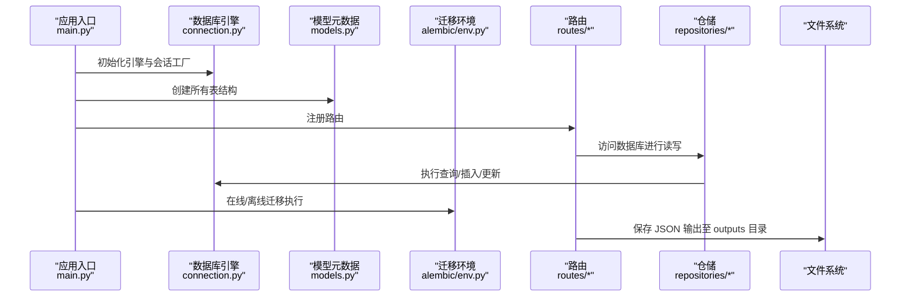
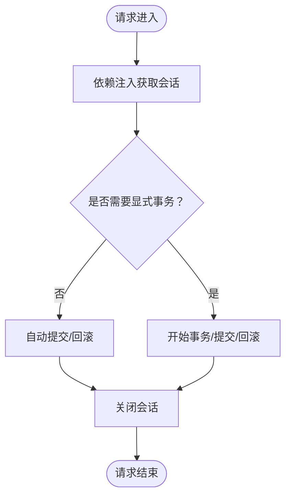
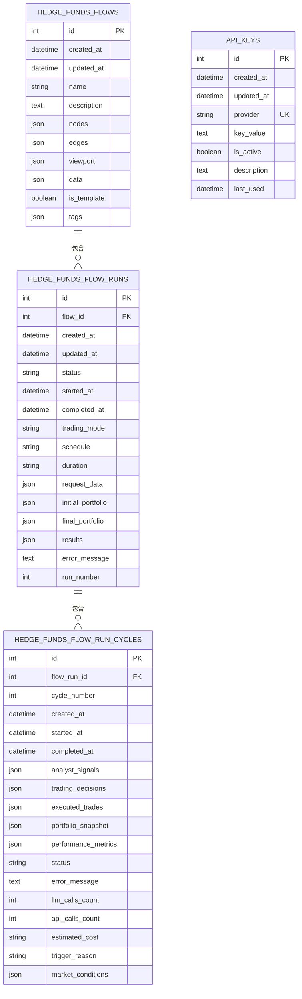
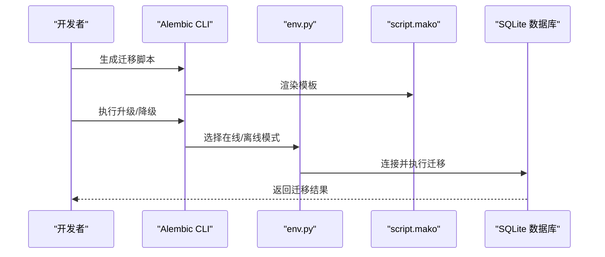
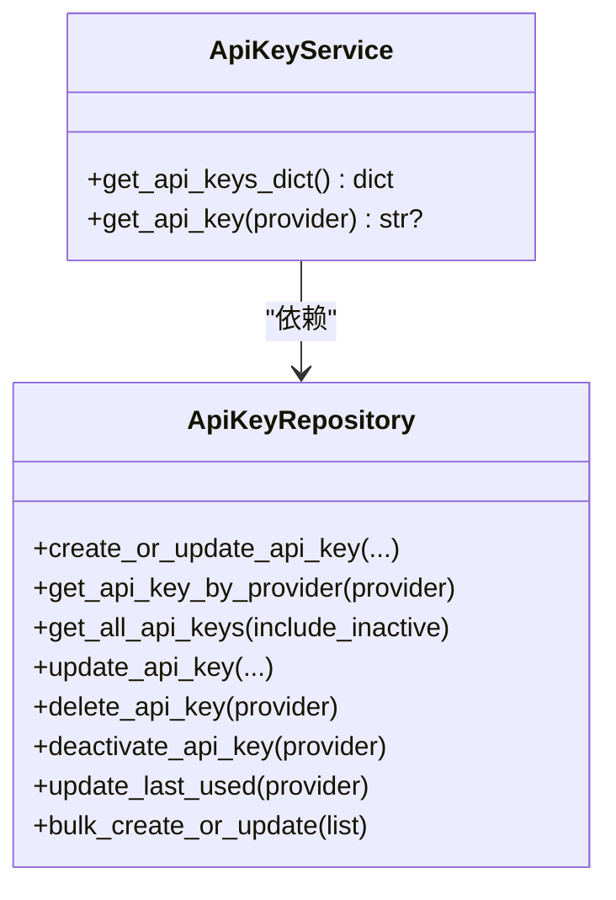
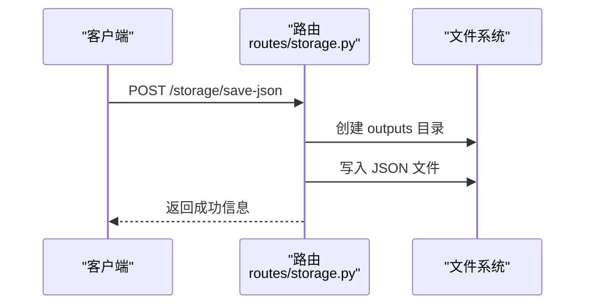
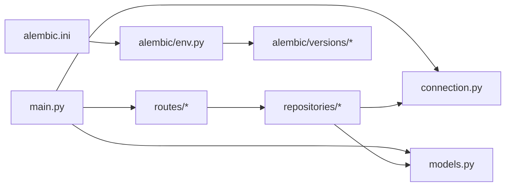

# 存储策略

<cite>
**本文引用的文件**
- [app/backend/database/connection.py](file://app/backend/database/connection.py)
- [app/backend/database/models.py](file://app/backend/database/models.py)
- [app/backend/main.py](file://app/backend/main.py)
- [app/backend/alembic/env.py](file://app/backend/alembic/env.py)
- [app/backend/alembic/script.py.mako](file://app/backend/alembic/script.py.mako)
- [app/backend/alembic.ini](file://app/backend/alembic.ini)
- [app/backend/alembic/versions/5274886e5bee_add_hedgefundflow_table.py](file://app/backend/alembic/versions/5274886e5bee_add_hedgefundflow_table.py)
- [app/backend/alembic/versions/1b1feba3d897_add_data_column_to_hedge_fund_flows.py](file://app/backend/alembic/versions/1b1feba3d897_add_data_column_to_hedge_fund_flows.py)
- [app/backend/alembic/versions/2f8c5d9e4b1a_add_hedgefundflowrun_table.py](file://app/backend/alembic/versions/2f8c5d9e4b1a_add_hedgefundflowrun_table.py)
- [app/backend/alembic/versions/3f9a6b7c8d2e_add_hedgefundflowruncycle_table.py](file://app/backend/alembic/versions/3f9a6b7c8d2e_add_hedgefundflowruncycle_table.py)
- [app/backend/alembic/versions/add_api_keys_table.py](file://app/backend/alembic/versions/add_api_keys_table.py)
- [app/backend/repositories/api_key_repository.py](file://app/backend/repositories/api_key_repository.py)
- [app/backend/services/api_key_service.py](file://app/backend/services/api_key_service.py)
- [app/backend/routes/storage.py](file://app/backend/routes/storage.py)
</cite>

## 目录
1. [简介](#简介)
2. [项目结构](#项目结构)
3. [核心组件](#核心组件)
4. [架构总览](#架构总览)
5. [详细组件分析](#详细组件分析)
6. [依赖分析](#依赖分析)
7. [性能考虑](#性能考虑)
8. [故障排除指南](#故障排除指南)
9. [结论](#结论)
10. [附录](#附录)

## 简介
本文件系统性梳理本项目的存储策略，覆盖数据库连接管理、连接池与会话生命周期、事务处理机制；基于 Alembic 的数据迁移与版本控制；存储优化（索引、查询与模型设计）；数据持久化与外部文件存储；备份与恢复思路；容量规划与归档清理建议；以及面向开发者的配置、监控与排障指引。  
项目当前采用 SQLite 作为本地存储后端，使用 SQLAlchemy 进行 ORM 映射与会话管理，并通过 Alembic 实现数据库演进。同时提供一个基于文件系统的 JSON 数据落盘接口，便于输出与归档。

## 项目结构
- 后端应用入口负责初始化数据库表结构与路由注册。
- 数据库层由连接工厂、模型定义与 Alembic 迁移组成。
- 仓储与服务层封装 API Key 的增删改查与加载逻辑。
- 路由层提供 JSON 文件落盘接口，用于输出结果与中间数据。

图表来源
- [app/backend/main.py:1-56](file://app/backend/main.py#L1-L56)
- [app/backend/database/connection.py:1-32](file://app/backend/database/connection.py#L1-L32)
- [app/backend/database/models.py:1-115](file://app/backend/database/models.py#L1-L115)
- [app/backend/alembic/env.py:1-78](file://app/backend/alembic/env.py#L1-L78)
- [app/backend/alembic.ini:1-120](file://app/backend/alembic.ini#L1-L120)
- [app/backend/alembic/versions/5274886e5bee_add_hedgefundflow_table.py:1-47](file://app/backend/alembic/versions/5274886e5bee_add_hedgefundflow_table.py#L1-L47)
- [app/backend/repositories/api_key_repository.py:1-131](file://app/backend/repositories/api_key_repository.py#L1-L131)
- [app/backend/services/api_key_service.py:1-23](file://app/backend/services/api_key_service.py#L1-L23)
- [app/backend/routes/storage.py:1-44](file://app/backend/routes/storage.py#L1-L44)

章节来源
- [app/backend/main.py:1-56](file://app/backend/main.py#L1-L56)
- [app/backend/database/connection.py:1-32](file://app/backend/database/connection.py#L1-L32)
- [app/backend/database/models.py:1-115](file://app/backend/database/models.py#L1-L115)
- [app/backend/alembic/env.py:1-78](file://app/backend/alembic/env.py#L1-L78)
- [app/backend/alembic/versions/5274886e5bee_add_hedgefundflow_table.py:1-47](file://app/backend/alembic/versions/5274886e5bee_add_hedgefundflow_table.py#L1-L47)

## 核心组件
- 数据库连接与会话
  - 使用绝对路径的 SQLite 数据库文件，创建引擎与会话工厂，提供 FastAPI 依赖注入函数以确保每个请求拥有独立会话并在结束后关闭。
- 模型与表结构
  - 定义了流配置表、执行运行表、周期表与 API Key 表，均使用 JSON 字段存储结构化数据，支持模板化与标签分类等扩展能力。
- Alembic 迁移
  - 通过 env.py 与 script.mako 驱动迁移生成与执行，按版本顺序演进数据库结构。
- 仓储与服务
  - 提供 API Key 的创建/更新、查询、批量导入、停用与使用时间追踪等能力。
- 外部文件存储
  - 提供保存 JSON 到项目 outputs 目录的路由，便于结果与中间数据的落盘与归档。

章节来源
- [app/backend/database/connection.py:1-32](file://app/backend/database/connection.py#L1-L32)
- [app/backend/database/models.py:1-115](file://app/backend/database/models.py#L1-L115)
- [app/backend/alembic/env.py:1-78](file://app/backend/alembic/env.py#L1-L78)
- [app/backend/alembic/script.py.mako:1-29](file://app/backend/alembic/script.py.mako#L1-L29)
- [app/backend/repositories/api_key_repository.py:1-131](file://app/backend/repositories/api_key_repository.py#L1-L131)
- [app/backend/services/api_key_service.py:1-23](file://app/backend/services/api_key_service.py#L1-L23)
- [app/backend/routes/storage.py:1-44](file://app/backend/routes/storage.py#L1-L44)

## 架构总览
下图展示从应用启动到数据库初始化、迁移与会话使用的整体流程。

图表来源
- [app/backend/main.py:1-56](file://app/backend/main.py#L1-L56)
- [app/backend/database/connection.py:1-32](file://app/backend/database/connection.py#L1-L32)
- [app/backend/database/models.py:1-115](file://app/backend/database/models.py#L1-L115)
- [app/backend/alembic/env.py:1-78](file://app/backend/alembic/env.py#L1-L78)
- [app/backend/routes/storage.py:1-44](file://app/backend/routes/storage.py#L1-L44)

## 详细组件分析

### 数据库连接与会话管理
- 引擎与会话
  - 使用绝对路径构建 SQLite URL，创建引擎与会话工厂，禁用线程检查以适配单进程场景。
  - 提供依赖注入函数，确保每个请求获得独立会话并在 finally 中关闭，避免连接泄漏。
- 事务处理
  - 当前实现未显式开启/回滚事务，遵循 SQLAlchemy 默认行为；在需要时可在仓储或服务层手动提交/回滚。
- 连接池配置
  - 当前未显式设置连接池参数，默认使用 SQLAlchemy 默认池；SQLite 在单进程下通常无需复杂池配置。

图表来源
- [app/backend/database/connection.py:26-32](file://app/backend/database/connection.py#L26-L32)

章节来源
- [app/backend/database/connection.py:1-32](file://app/backend/database/connection.py#L1-L32)

### 数据模型与索引设计
- 主要实体
  - 流配置表：存储 React Flow 的节点、边、视口与模板/标签等元数据。
  - 运行表：跟踪一次执行的生命周期、状态、调度与结果。
  - 周期表：记录单次运行内的分析周期、决策、交易与成本统计。
  - API Key 表：集中管理各服务提供商的密钥与启用状态。
- 索引与外键
  - 多处字段建立索引（如主键索引、外键索引、状态/时间索引），提升查询效率。
  - 周期表与运行表之间存在外键关联，保证级联一致性。
- JSON 字段
  - 大量使用 JSON 字段存储动态结构数据，便于扩展但需注意查询与索引限制。

图表来源
- [app/backend/database/models.py:6-115](file://app/backend/database/models.py#L6-L115)

章节来源
- [app/backend/database/models.py:1-115](file://app/backend/database/models.py#L1-L115)

### 数据迁移策略与版本控制
- 迁移生成与执行
  - 使用 Alembic 生成迁移脚本，env.py 决定在线/离线模式，script.mako 为模板。
  - alembic.ini 提供全局配置，包括脚本位置、日志级别与数据库 URL。
- 版本演进
  - 通过版本文件逐步添加表与列，如流表、数据列、运行表、周期表与 API Key 表。
  - 迁移脚本中包含幂等判断（检查列/表是否存在），避免重复执行导致错误。
- 回滚策略
  - 下游版本可删除新增列或表，保留向后兼容性；生产环境建议谨慎回滚并做好备份。

图表来源
- [app/backend/alembic/env.py:1-78](file://app/backend/alembic/env.py#L1-L78)
- [app/backend/alembic/script.py.mako:1-29](file://app/backend/alembic/script.py.mako#L1-L29)
- [app/backend/alembic.ini:1-120](file://app/backend/alembic.ini#L1-L120)
- [app/backend/alembic/versions/5274886e5bee_add_hedgefundflow_table.py:1-47](file://app/backend/alembic/versions/5274886e5bee_add_hedgefundflow_table.py#L1-L47)
- [app/backend/alembic/versions/2f8c5d9e4b1a_add_hedgefundflowrun_table.py:1-49](file://app/backend/alembic/versions/2f8c5d9e4b1a_add_hedgefundflowrun_table.py#L1-L49)
- [app/backend/alembic/versions/3f9a6b7c8d2e_add_hedgefundflowruncycle_table.py:1-102](file://app/backend/alembic/versions/3f9a6b7c8d2e_add_hedgefundflowruncycle_table.py#L1-L102)
- [app/backend/alembic/versions/add_api_keys_table.py:1-44](file://app/backend/alembic/versions/add_api_keys_table.py#L1-L44)

章节来源
- [app/backend/alembic/env.py:1-78](file://app/backend/alembic/env.py#L1-L78)
- [app/backend/alembic/script.py.mako:1-29](file://app/backend/alembic/script.py.mako#L1-L29)
- [app/backend/alembic.ini:1-120](file://app/backend/alembic.ini#L1-L120)
- [app/backend/alembic/versions/1b1feba3d897_add_data_column_to_hedge_fund_flows.py:1-33](file://app/backend/alembic/versions/1b1feba3d897_add_data_column_to_hedge_fund_flows.py#L1-L33)
- [app/backend/alembic/versions/2f8c5d9e4b1a_add_hedgefundflowrun_table.py:1-49](file://app/backend/alembic/versions/2f8c5d9e4b1a_add_hedgefundflowrun_table.py#L1-L49)
- [app/backend/alembic/versions/3f9a6b7c8d2e_add_hedgefundflowruncycle_table.py:1-102](file://app/backend/alembic/versions/3f9a6b7c8d2e_add_hedgefundflowruncycle_table.py#L1-L102)
- [app/backend/alembic/versions/add_api_keys_table.py:1-44](file://app/backend/alembic/versions/add_api_keys_table.py#L1-L44)

### API Key 仓储与服务
- 仓储职责
  - 支持按提供商创建/更新、查询、批量导入、停用与删除；提供最后使用时间更新。
- 服务职责
  - 将活跃 API Key 转换为字典，便于下游请求注入。
- 事务与并发
  - 单条更新操作在会话内提交；批量导入建议在上层控制事务边界。

图表来源
- [app/backend/repositories/api_key_repository.py:9-131](file://app/backend/repositories/api_key_repository.py#L9-L131)
- [app/backend/services/api_key_service.py:6-23](file://app/backend/services/api_key_service.py#L6-L23)

章节来源
- [app/backend/repositories/api_key_repository.py:1-131](file://app/backend/repositories/api_key_repository.py#L1-L131)
- [app/backend/services/api_key_service.py:1-23](file://app/backend/services/api_key_service.py#L1-L23)

### 外部文件存储与归档
- 接口功能
  - 提供保存 JSON 至 outputs 目录的路由，自动创建目录并写入文件。
- 归档建议
  - 可结合定时任务或运行后钩子定期将 outputs 中的数据归档至远端存储或压缩备份。

图表来源
- [app/backend/routes/storage.py:14-44](file://app/backend/routes/storage.py#L14-L44)

章节来源
- [app/backend/routes/storage.py:1-44](file://app/backend/routes/storage.py#L1-L44)

## 依赖分析
- 组件耦合
  - 应用入口依赖数据库连接与模型元数据；路由依赖仓储/服务；仓储依赖 SQLAlchemy 会话；迁移依赖 Alembic 环境。
- 外部依赖
  - SQLAlchemy、Alembic、FastAPI；SQLite 本地文件存储。
- 潜在风险
  - SQLite 在高并发写入场景可能成为瓶颈；JSON 字段查询受限，需合理设计索引与查询路径。

图表来源
- [app/backend/main.py:1-56](file://app/backend/main.py#L1-L56)
- [app/backend/database/connection.py:1-32](file://app/backend/database/connection.py#L1-L32)
- [app/backend/database/models.py:1-115](file://app/backend/database/models.py#L1-L115)
- [app/backend/alembic/env.py:1-78](file://app/backend/alembic/env.py#L1-L78)
- [app/backend/alembic/versions/5274886e5bee_add_hedgefundflow_table.py:1-47](file://app/backend/alembic/versions/5274886e5bee_add_hedgefundflow_table.py#L1-L47)

章节来源
- [app/backend/main.py:1-56](file://app/backend/main.py#L1-L56)
- [app/backend/database/connection.py:1-32](file://app/backend/database/connection.py#L1-L32)
- [app/backend/database/models.py:1-115](file://app/backend/database/models.py#L1-L115)
- [app/backend/alembic/env.py:1-78](file://app/backend/alembic/env.py#L1-L78)

## 性能考虑
- 查询性能
  - 已为主键、外键与常用过滤字段建立索引；对于 JSON 字段的查询，建议在业务层尽量减少全表扫描，必要时拆分出可索引的派生字段。
- 写入性能
  - SQLite 在高并发写入时可能受制于文件锁；若未来扩展为多进程或多实例，建议迁移到关系型数据库并引入连接池。
- 迁移性能
  - 大表变更应评估锁表时间，优先在低峰时段执行；对大字段的修改可分步进行。
- 缓存与批处理
  - 对频繁读取的配置与密钥可引入进程内缓存，降低数据库压力。

## 故障排除指南
- 数据库连接问题
  - 确认 SQLite 文件路径与权限；检查依赖注入函数是否正确关闭会话。
- 迁移失败
  - 查看 Alembic 日志级别与输出；确认版本文件顺序与幂等逻辑；必要时回退至上一版本再重试。
- JSON 字段查询异常
  - 避免对 JSON 字段做复杂索引；通过业务层预处理或物化派生字段优化查询。
- 外部文件写入失败
  - 检查 outputs 目录权限与磁盘空间；确认文件名与编码设置。

章节来源
- [app/backend/database/connection.py:1-32](file://app/backend/database/connection.py#L1-L32)
- [app/backend/alembic/env.py:1-78](file://app/backend/alembic/env.py#L1-L78)
- [app/backend/routes/storage.py:1-44](file://app/backend/routes/storage.py#L1-L44)

## 结论
本项目采用轻量级 SQLite + SQLAlchemy + Alembic 的组合，满足本地开发与小规模生产的存储需求。通过明确的模型设计、索引策略与迁移流程，实现了清晰的数据库演进路径。建议在生产环境中关注并发写入瓶颈与 JSON 查询限制，并结合外部文件存储完善归档与备份策略。

## 附录

### 开发者配置指南
- 数据库
  - 使用绝对路径的 SQLite 文件；在应用启动时自动创建表结构。
  - 如需迁移，请使用 Alembic CLI 并根据环境选择在线/离线模式。
- 连接池与会话
  - 默认使用 SQLAlchemy 默认池；如需自定义，请在连接工厂中增加相应参数。
- 迁移
  - 在 alembic.ini 中配置数据库 URL；通过 env.py 控制迁移行为；版本文件按需扩展。
- API Key 管理
  - 使用仓储/服务层进行密钥的创建、更新与查询；注意启用状态与最后使用时间的维护。

章节来源
- [app/backend/main.py:17-18](file://app/backend/main.py#L17-L18)
- [app/backend/alembic.ini:66](file://app/backend/alembic.ini#L66)
- [app/backend/alembic/env.py:52-77](file://app/backend/alembic/env.py#L52-L77)
- [app/backend/repositories/api_key_repository.py:15-46](file://app/backend/repositories/api_key_repository.py#L15-L46)
- [app/backend/services/api_key_service.py:12-23](file://app/backend/services/api_key_service.py#L12-L23)

### 监控指标建议
- 数据库层
  - 连接数、事务提交/回滚次数、慢查询计数、迁移耗时。
- 应用层
  - 请求耗时分布、错误率、文件写入成功率与耗时。
- 建议采集点
  - FastAPI 中间件或装饰器埋点；SQLAlchemy 事件钩子；文件系统写入前后计时。

### 备份与恢复
- 备份
  - 定期复制 SQLite 数据库文件；对 outputs 目录进行增量备份。
- 恢复
  - 先恢复数据库文件，再执行必要的迁移；验证关键表完整性。
- 灾难恢复
  - 建立异地副本与自动化演练流程；确保迁移脚本可逆且可追溯。

### 容量规划、归档与清理
- 容量规划
  - 估算 JSON 数据体量与历史保留周期；预留磁盘空间与索引增长。
- 归档
  - 将历史运行结果与周期快照归档至对象存储或压缩包；保留关键摘要索引。
- 清理
  - 基于时间窗口清理过期运行记录与临时文件；保留 API Key 的审计轨迹。