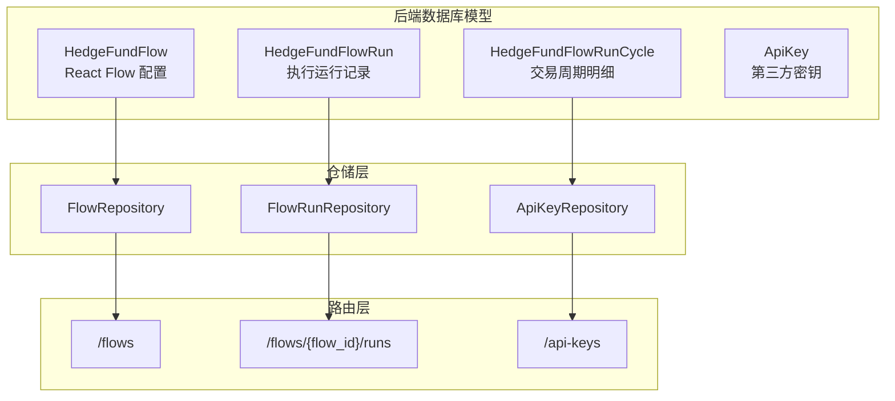
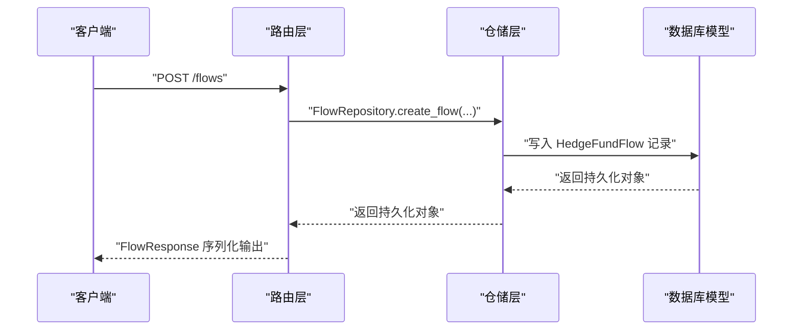
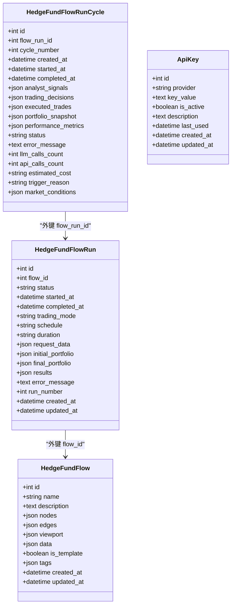
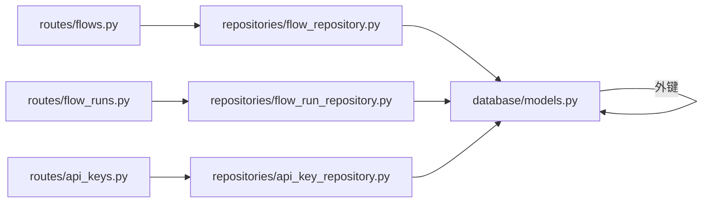
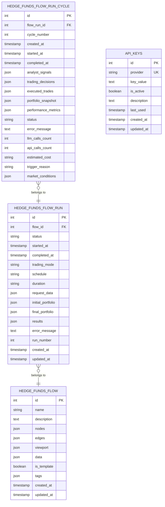

# 数据模型设计

<cite>
**本文引用的文件**
- [models.py](file://app/backend/database/models.py)
- [schemas.py](file://app/backend/models/schemas.py)
- [events.py](file://app/backend/models/events.py)
- [models.py](file://src/data/models.py)
- [models.py](file://v2/data/models.py)
- [flow_repository.py](file://app/backend/repositories/flow_repository.py)
- [flow_run_repository.py](file://app/backend/repositories/flow_run_repository.py)
- [api_key_repository.py](file://app/backend/repositories/api_key_repository.py)
- [flows.py](file://app/backend/routes/flows.py)
- [flow_runs.py](file://app/backend/routes/flow_runs.py)
- [api_keys.py](file://app/backend/routes/api_keys.py)
- [5274886e5bee_add_hedgefundflow_table.py](file://app/backend/alembic/versions/5274886e5bee_add_hedgefundflow_table.py)
- [2f8c5d9e4b1a_add_hedgefundflowrun_table.py](file://app/backend/alembic/versions/2f8c5d9e4b1a_add_hedgefundflowrun_table.py)
- [3f9a6b7c8d2e_add_hedgefundflowruncycle_table.py](file://app/backend/alembic/versions/3f9a6b7c8d2e_add_hedgefundflowruncycle_table.py)
- [add_api_keys_table.py](file://app/backend/alembic/versions/add_api_keys_table.py)
- [portfolio.py](file://app/backend/services/portfolio.py)
</cite>

## 目录
1. [简介](#简介)
2. [项目结构](#项目结构)
3. [核心组件](#核心组件)
4. [架构总览](#架构总览)
5. [详细组件分析](#详细组件分析)
6. [依赖分析](#依赖分析)
7. [性能考虑](#性能考虑)
8. [故障排查指南](#故障排查指南)
9. [结论](#结论)
10. [附录](#附录)

## 简介
本文件系统化梳理了 AI 对冲基金项目中的数据模型设计，覆盖后端数据库模型（SQLAlchemy）、请求/响应 Pydantic 模型、事件模型以及数据服务模型，并结合 Alembic 迁移记录与仓储层、路由层的使用方式，给出字段语义、关系映射、索引设计、验证规则、完整性保障、扩展策略与性能优化建议。目标是帮助开发者快速理解与正确使用数据模型，同时为后续演进提供一致的设计规范。

## 项目结构
围绕数据模型的关键目录与文件如下：
- 后端数据库模型：位于 app/backend/database/models.py，定义 SQLAlchemy 表结构
- 请求/响应模型：位于 app/backend/models/schemas.py，定义 Pydantic 校验与序列化
- 事件模型：位于 app/backend/models/events.py，定义 SSE 事件格式
- 历史数据模型：位于 src/data/models.py 与 v2/data/models.py，定义金融数据 API 的 Pydantic 模型
- 仓储层：位于 app/backend/repositories/*，封装 CRUD 与查询逻辑
- 路由层：位于 app/backend/routes/*，暴露 REST 接口并绑定模型
- Alembic 迁移：位于 app/backend/alembic/versions/*，记录表结构变更
- 组合服务：位于 app/backend/services/portfolio.py，用于组合投资组合结构

图表来源
- [models.py:6-115](file://app/backend/database/models.py#L6-L115)
- [flow_repository.py:6-103](file://app/backend/repositories/flow_repository.py#L6-L103)
- [flow_run_repository.py:9-133](file://app/backend/repositories/flow_run_repository.py#L9-L133)
- [api_key_repository.py:9-131](file://app/backend/repositories/api_key_repository.py#L9-L131)
- [flows.py:15-174](file://app/backend/routes/flows.py#L15-L174)
- [flow_runs.py:17-303](file://app/backend/routes/flow_runs.py#L17-L303)
- [api_keys.py:16-201](file://app/backend/routes/api_keys.py#L16-L201)

章节来源
- [models.py:1-115](file://app/backend/database/models.py#L1-L115)
- [schemas.py:1-292](file://app/backend/models/schemas.py#L1-L292)
- [events.py:1-46](file://app/backend/models/events.py#L1-L46)
- [models.py:1-175](file://src/data/models.py#L1-L175)
- [models.py:1-262](file://v2/data/models.py#L1-L262)

## 核心组件
本节聚焦于数据库模型、Pydantic 模型与事件模型的字段定义、业务含义与约束。

- HedgeFundFlow（React Flow 配置）
  - 字段与含义：主键自增 id；创建/更新时间；名称与描述；节点列表、边列表、视口状态、内部数据；模板标记与标签数组
  - JSON 字段：nodes、edges、viewport、data 存储动态结构
  - 索引：id 主键索引
  - 外键：无

- HedgeFundFlowRun（执行运行）
  - 字段与含义：主键自增 id；flow_id 外键；状态（IDLE/IN_PROGRESS/COMPLETE/ERROR）与计时字段；交易模式（一次性/持续/顾问）与调度/时长；请求参数、初始/最终投资组合、结果、错误信息；运行序号
  - JSON 字段：request_data、initial_portfolio、final_portfolio、results
  - 索引：id、flow_id
  - 外键：flow_id → HedgeFundFlow.id

- HedgeFundFlowRunCycle（交易周期）
  - 字段与含义：主键自增 id；flow_run_id 外键；周期序号；开始/完成时间；分析信号、交易决策、已执行交易；投资组合快照、周期指标；状态与错误；LLM/API 调用次数与估算成本；触发原因与市场条件
  - JSON 字段：analyst_signals、trading_decisions、executed_trades、portfolio_snapshot、performance_metrics、market_conditions
  - 索引：flow_run_id、cycle_number、status、started_at
  - 外键：flow_run_id → HedgeFundFlowRun.id

- ApiKey（第三方密钥）
  - 字段与含义：主键自增 id；创建/更新时间；提供方标识（唯一）；密钥值；启用状态；描述；最后使用时间
  - 索引：id、provider（唯一）
  - 外键：无

- Pydantic 请求/响应模型
  - BaseHedgeFundRequest/HedgeFundRequest/BacktestRequest：包含股票池、图结构、代理模型配置、初始资金等
  - Flow*Request/Response：流程的创建/更新/查询模型，含模板与标签
  - ApiKey*Request/Response：密钥的创建/更新/批量更新模型
  - PortfolioPosition：持仓校验（价格必须为正）

- 事件模型
  - BaseEvent/StartEvent/ProgressUpdateEvent/ErrorEvent/CompleteEvent：Server-Sent Events 格式

章节来源
- [models.py:6-115](file://app/backend/database/models.py#L6-L115)
- [schemas.py:16-292](file://app/backend/models/schemas.py#L16-L292)
- [events.py:5-46](file://app/backend/models/events.py#L5-L46)

## 架构总览
下图展示数据模型在系统中的角色与交互路径，从路由到仓储再到数据库模型，以及事件流。

图表来源
- [flows.py:18-42](file://app/backend/routes/flows.py#L18-L42)
- [flow_repository.py:12-28](file://app/backend/repositories/flow_repository.py#L12-L28)
- [models.py:6-27](file://app/backend/database/models.py#L6-L27)

章节来源
- [flows.py:1-174](file://app/backend/routes/flows.py#L1-L174)
- [flow_repository.py:1-103](file://app/backend/repositories/flow_repository.py#L1-L103)
- [models.py:1-115](file://app/backend/database/models.py#L1-L115)

## 详细组件分析

### 数据库模型类图

图表来源
- [models.py:6-115](file://app/backend/database/models.py#L6-L115)

章节来源
- [models.py:1-115](file://app/backend/database/models.py#L1-L115)

### 关系映射与索引设计
- 实体关系
  - HedgeFundFlowRun.flow_id → HedgeFundFlow.id（一对多：一个流程可有多个运行）
  - HedgeFundFlowRunCycle.flow_run_id → HedgeFundFlowRun.id（一对多：一次运行可包含多个周期）
- 索引设计
  - HedgeFundFlow：id 主键索引
  - HedgeFundFlowRun：id、flow_id 主键索引；flow_id 辅助索引
  - HedgeFundFlowRunCycle：id、flow_run_id、cycle_number、status、started_at 辅助索引
  - ApiKey：id、provider（唯一）索引

章节来源
- [models.py:6-115](file://app/backend/database/models.py#L6-L115)
- [2f8c5d9e4b1a_add_hedgefundflowrun_table.py:24-39](file://app/backend/alembic/versions/2f8c5d9e4b1a_add_hedgefundflowrun_table.py#L24-L39)
- [3f9a6b7c8d2e_add_hedgefundflowruncycle_table.py:41-67](file://app/backend/alembic/versions/3f9a6b7c8d2e_add_hedgefundflowruncycle_table.py#L41-L67)
- [add_api_keys_table.py:24-37](file://app/backend/alembic/versions/add_api_keys_table.py#L24-L37)

### 数据模型验证规则与完整性
- Pydantic 校验
  - PortfolioPosition.price_must_be_positive：交易价格必须大于 0
  - FlowCreateRequest/FlowUpdateRequest：名称长度限制与可选字段
  - ApiKeyCreateRequest：提供方唯一性、最小长度
  - BaseHedgeFundRequest：全局模型配置与代理模型配置匹配逻辑
- 数据库约束
  - 外键约束：运行与周期表的外键指向父表
  - 唯一约束：ApiKey.provider 唯一
  - 默认值：状态、运行序号、计数器等默认值
- 完整性保障
  - 仓储层在更新运行状态时自动填充计时字段
  - 流程复制时强制非模板属性

章节来源
- [schemas.py:27-32](file://app/backend/models/schemas.py#L27-L32)
- [schemas.py:144-164](file://app/backend/models/schemas.py#L144-L164)
- [schemas.py:244-250](file://app/backend/models/schemas.py#L244-L250)
- [flow_run_repository.py:78-87](file://app/backend/repositories/flow_run_repository.py#L78-L87)
- [flow_repository.py:86-103](file://app/backend/repositories/flow_repository.py#L86-L103)

### 模型扩展指南与版本兼容
- 扩展策略
  - 新增字段：优先在 Alembic 迁移中以可选列形式添加，避免破坏现有数据
  - JSON 字段：用于存储动态或半结构化数据，便于快速迭代
  - 模型配置：Pydantic 使用 extra="ignore"（v2 数据模型）提升向前兼容性
- 版本兼容
  - v2 数据模型明确标注“忽略额外字段”，确保新增字段不影响旧客户端解析
  - 运行/周期表通过条件判断避免重复添加列，支持增量升级

章节来源
- [3f9a6b7c8d2e_add_hedgefundflowruncycle_table.py:22-36](file://app/backend/alembic/versions/3f9a6b7c8d2e_add_hedgefundflowruncycle_table.py#L22-L36)
- [v2/data/models.py:1-262](file://v2/data/models.py#L1-L262)

### 使用示例与最佳实践
- 创建流程
  - 路由：POST /flows
  - 仓储：FlowRepository.create_flow(...)
  - 注意：nodes/edges/viewport/data 作为 JSON 存储，需确保结构合法
- 创建运行
  - 路由：POST /flows/{flow_id}/runs
  - 仓储：FlowRunRepository.create_flow_run(...) 自动计算 run_number
- 查询运行
  - 路由：GET /flows/{flow_id}/runs?limit=&offset=
  - 仓储：按 flow_id 查询并按创建时间倒序
- 更新运行状态
  - 路由：PUT /flows/{flow_id}/runs/{run_id}
  - 仓储：根据状态自动设置 started_at/completed_at
- API 密钥管理
  - 路由：/api-keys 支持单个/批量创建/更新/停用/删除
  - 仓储：按 provider 唯一定位，支持 last_used 时间戳更新

章节来源
- [flows.py:18-42](file://app/backend/routes/flows.py#L18-L42)
- [flow_runs.py:20-51](file://app/backend/routes/flow_runs.py#L20-L51)
- [flow_runs.py:54-83](file://app/backend/routes/flow_runs.py#L54-L83)
- [flow_runs.py:170-213](file://app/backend/routes/flow_runs.py#L170-L213)
- [api_keys.py:19-39](file://app/backend/routes/api_keys.py#L19-L39)
- [flow_run_repository.py:15-29](file://app/backend/repositories/flow_run_repository.py#L15-L29)
- [flow_run_repository.py:35-44](file://app/backend/repositories/flow_run_repository.py#L35-L44)

## 依赖分析
- 路由到仓储
  - /flows → FlowRepository
  - /flows/{flow_id}/runs → FlowRunRepository
  - /api-keys → ApiKeyRepository
- 仓储到模型
  - FlowRepository ↔ HedgeFundFlow
  - FlowRunRepository ↔ HedgeFundFlowRun
  - ApiKeyRepository ↔ ApiKey
- 模型间依赖
  - HedgeFundFlowRun 外键依赖 HedgeFundFlow
  - HedgeFundFlowRunCycle 外键依赖 HedgeFundFlowRun

图表来源
- [flows.py:1-174](file://app/backend/routes/flows.py#L1-L174)
- [flow_runs.py:1-303](file://app/backend/routes/flow_runs.py#L1-L303)
- [api_keys.py:1-201](file://app/backend/routes/api_keys.py#L1-L201)
- [flow_repository.py:1-103](file://app/backend/repositories/flow_repository.py#L1-L103)
- [flow_run_repository.py:1-133](file://app/backend/repositories/flow_run_repository.py#L1-L133)
- [api_key_repository.py:1-131](file://app/backend/repositories/api_key_repository.py#L1-L131)
- [models.py:1-115](file://app/backend/database/models.py#L1-L115)

章节来源
- [flows.py:1-174](file://app/backend/routes/flows.py#L1-L174)
- [flow_runs.py:1-303](file://app/backend/routes/flow_runs.py#L1-L303)
- [api_keys.py:1-201](file://app/backend/routes/api_keys.py#L1-L201)
- [flow_repository.py:1-103](file://app/backend/repositories/flow_repository.py#L1-L103)
- [flow_run_repository.py:1-133](file://app/backend/repositories/flow_run_repository.py#L1-L133)
- [api_key_repository.py:1-131](file://app/backend/repositories/api_key_repository.py#L1-L131)
- [models.py:1-115](file://app/backend/database/models.py#L1-L115)

## 性能考虑
- 索引优化
  - 在高频过滤字段上建立索引：flow_id、status、started_at
  - 对 JSON 字段避免在 WHERE 中直接使用，必要时考虑物化列或二级索引
- 查询优化
  - 分页查询：limit/offset 控制结果集大小
  - 排序：按 created_at 或 started_at 倒序，减少全表扫描
- 写入优化
  - 批量操作：使用 bulk_create_or_update 减少往返
  - 状态机驱动：在仓储层统一设置计时字段，避免重复逻辑
- 存储与序列化
  - JSON 字段适合动态结构，但应控制层级与体积，避免超大对象频繁读写

[本节为通用指导，不直接分析具体文件]

## 故障排查指南
- 常见问题
  - 外键约束失败：确认父表记录存在且字段类型匹配
  - 唯一冲突：ApiKey.provider 已存在，需更新而非重复插入
  - JSON 结构异常：检查 nodes/edges/viewport/data 的合法性
- 诊断步骤
  - 查看路由层返回的错误模型（ErrorResponse）
  - 检查仓储层日志与异常堆栈
  - 核对 Alembic 迁移是否成功应用
- 相关实现参考
  - 错误响应模型：ErrorResponse
  - 路由异常处理：各路由捕获异常并返回 500/404
  - 仓储层事务提交与刷新：确保持久化成功

章节来源
- [schemas.py:55-58](file://app/backend/models/schemas.py#L55-L58)
- [flows.py:26-42](file://app/backend/routes/flows.py#L26-L42)
- [flow_runs.py:34-51](file://app/backend/routes/flow_runs.py#L34-L51)
- [api_keys.py:27-39](file://app/backend/routes/api_keys.py#L27-L39)

## 结论
本数据模型设计以 SQLAlchemy 与 Pydantic 双层模型为核心，配合 Alembic 迁移与仓储层抽象，实现了流程配置、运行跟踪与密钥管理的完整闭环。通过 JSON 字段承载动态结构、外键约束保证关系完整性、索引与分页优化查询性能，并以 Pydantic 校验与默认值增强数据一致性。建议在扩展时遵循“可选列 + JSON + 兼容配置”的策略，确保平滑演进与向后兼容。

[本节为总结性内容，不直接分析具体文件]

## 附录

### 数据模型图（ER 关系）

图表来源
- [models.py:6-115](file://app/backend/database/models.py#L6-L115)
- [2f8c5d9e4b1a_add_hedgefundflowrun_table.py:24-39](file://app/backend/alembic/versions/2f8c5d9e4b1a_add_hedgefundflowrun_table.py#L24-L39)
- [3f9a6b7c8d2e_add_hedgefundflowruncycle_table.py:41-67](file://app/backend/alembic/versions/3f9a6b7c8d2e_add_hedgefundflowruncycle_table.py#L41-L67)
- [add_api_keys_table.py:24-37](file://app/backend/alembic/versions/add_api_keys_table.py#L24-L37)

### 数据字典
- HedgeFundFlow
  - 字段：id、name、description、nodes、edges、viewport、data、is_template、tags、created_at、updated_at
  - 类型：整型主键、字符串、文本、JSON、布尔、JSON、JSON、JSON、布尔、JSON、时间戳
  - 约束：id 主键；is_template 默认 false；tags JSON 数组
- HedgeFundFlowRun
  - 字段：id、flow_id、status、started_at、completed_at、trading_mode、schedule、duration、request_data、initial_portfolio、final_portfolio、results、error_message、run_number、created_at、updated_at
  - 类型：整型主键、整型外键、字符串、时间戳、时间戳、字符串、字符串、字符串、JSON、JSON、JSON、JSON、文本、整型、时间戳、时间戳
  - 约束：flow_id 外键；status 默认 IDLE；run_number 默认 1
- HedgeFundFlowRunCycle
  - 字段：id、flow_run_id、cycle_number、created_at、started_at、completed_at、analyst_signals、trading_decisions、executed_trades、portfolio_snapshot、performance_metrics、status、error_message、llm_calls_count、api_calls_count、estimated_cost、trigger_reason、market_conditions
  - 类型：整型主键、整型外键、整型、时间戳、时间戳、时间戳、JSON、JSON、JSON、JSON、JSON、字符串、文本、整型、整型、字符串、字符串、JSON
  - 约束：flow_run_id 外键；status 默认 IN_PROGRESS；llm_calls_count/api_calls_count 默认 0
- ApiKey
  - 字段：id、provider、key_value、is_active、description、last_used、created_at、updated_at
  - 类型：整型主键、字符串唯一、文本、布尔、文本、时间戳、时间戳、时间戳
  - 约束：provider 唯一；is_active 默认 true

章节来源
- [models.py:6-115](file://app/backend/database/models.py#L6-L115)
- [2f8c5d9e4b1a_add_hedgefundflowrun_table.py:24-39](file://app/backend/alembic/versions/2f8c5d9e4b1a_add_hedgefundflowrun_table.py#L24-L39)
- [3f9a6b7c8d2e_add_hedgefundflowruncycle_table.py:41-67](file://app/backend/alembic/versions/3f9a6b7c8d2e_add_hedgefundflowruncycle_table.py#L41-L67)
- [add_api_keys_table.py:24-37](file://app/backend/alembic/versions/add_api_keys_table.py#L24-L37)

### 查询优化与性能调优建议
- 建议索引
  - HedgeFundFlowRun：flow_id、status、started_at
  - HedgeFundFlowRunCycle：flow_run_id、cycle_number、status、started_at
  - ApiKey：provider（唯一）
- 查询模式
  - 列表查询：limit/offset 控制数量；按 created_at/desc 排序
  - 精确查询：按主键或唯一键查询，避免全表扫描
- 写入模式
  - 批量更新 API 密钥：使用 bulk_create_or_update
  - 状态机：在仓储层集中处理 started_at/completed_at 设置
- 存储建议
  - JSON 字段避免过深嵌套；对热点字段可考虑拆分或物化

[本节为通用指导，不直接分析具体文件]