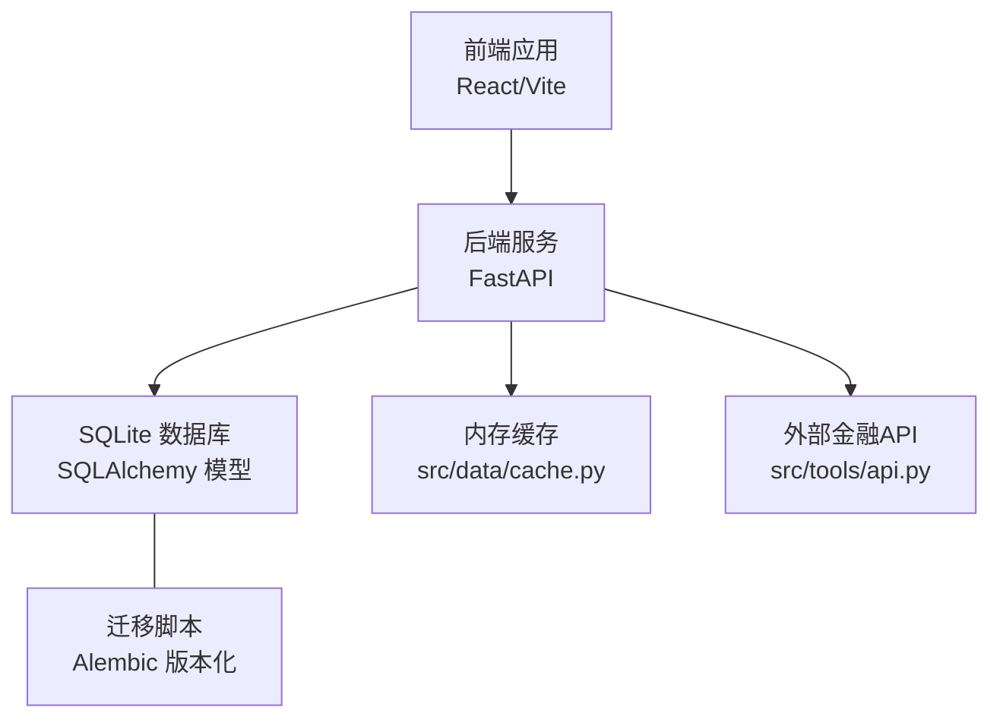
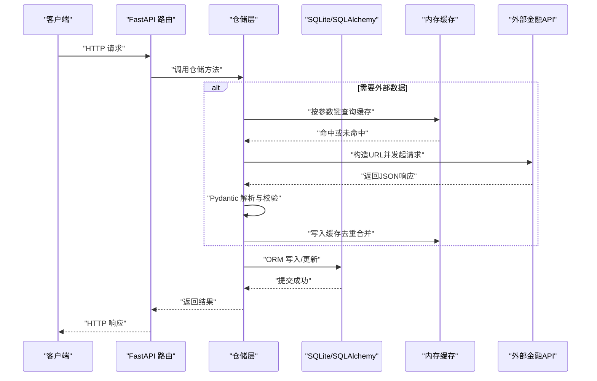
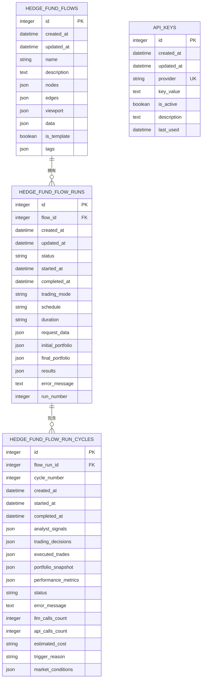
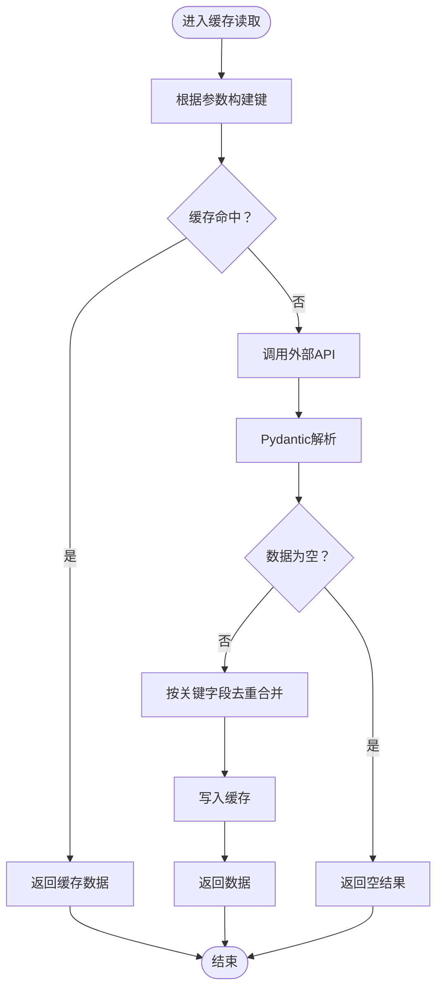
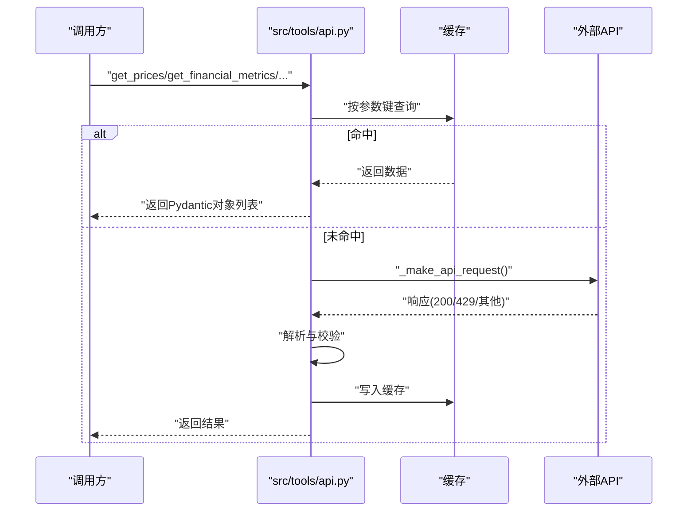
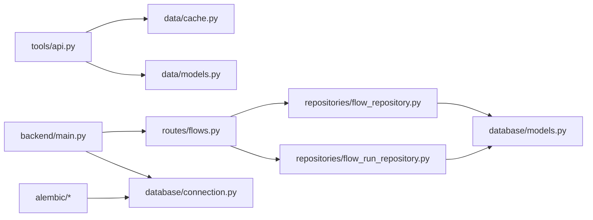

# 数据管理

<cite>
**本文引用的文件**
- [app/backend/database/models.py](file://app/backend/database/models.py)
- [app/backend/database/connection.py](file://app/backend/database/connection.py)
- [app/backend/repositories/flow_repository.py](file://app/backend/repositories/flow_repository.py)
- [app/backend/repositories/flow_run_repository.py](file://app/backend/repositories/flow_run_repository.py)
- [app/backend/repositories/api_key_repository.py](file://app/backend/repositories/api_key_repository.py)
- [app/backend/routes/flows.py](file://app/backend/routes/flows.py)
- [app/backend/main.py](file://app/backend/main.py)
- [src/data/cache.py](file://src/data/cache.py)
- [src/data/models.py](file://src/data/models.py)
- [src/tools/api.py](file://src/tools/api.py)
- [src/utils/api_key.py](file://src/utils/api_key.py)
- [app/backend/alembic/versions/5274886e5bee_add_hedgefundflow_table.py](file://app/backend/alembic/versions/5274886e5bee_add_hedgefundflow_table.py)
- [app/backend/alembic/versions/add_api_keys_table.py](file://app/backend/alembic/versions/add_api_keys_table.py)
- [tests/test_cache.py](file://tests/test_cache.py)
</cite>

## 目录
1. [简介](#简介)
2. [项目结构](#项目结构)
3. [核心组件](#核心组件)
4. [架构总览](#架构总览)
5. [详细组件分析](#详细组件分析)
6. [依赖分析](#依赖分析)
7. [性能考虑](#性能考虑)
8. [故障排查指南](#故障排查指南)
9. [结论](#结论)
10. [附录](#附录)

## 简介
本文件系统性梳理该AI对冲基金项目的数据管理方案，覆盖数据缓存策略与失效机制、数据一致性保障、数据模型设计与关系映射、外部API数据获取与转换验证流程、数据存储与索引优化、查询性能调优、数据迁移与备份恢复、数据安全与访问控制，以及面向开发者的工具使用、数据质量监控与性能优化建议。内容以仓库现有实现为依据，结合可扩展的最佳实践进行总结。

## 项目结构
后端采用FastAPI + SQLAlchemy + SQLite的轻量级架构；前端为React/Vite应用；数据层通过Alembic进行版本化迁移；核心数据流围绕“流程配置（Flow）—执行运行（FlowRun）—周期分析（FlowRunCycle）—外部金融数据”展开。

图表来源
- [app/backend/main.py:15-31](file://app/backend/main.py#L15-L31)
- [app/backend/database/connection.py:15-24](file://app/backend/database/connection.py#L15-L24)
- [src/data/cache.py:1-72](file://src/data/cache.py#L1-L72)
- [src/tools/api.py:29-61](file://src/tools/api.py#L29-L61)

章节来源
- [app/backend/main.py:15-31](file://app/backend/main.py#L15-L31)
- [app/backend/database/connection.py:15-24](file://app/backend/database/connection.py#L15-L24)

## 核心组件
- 数据模型与存储：基于SQLAlchemy的表模型，包含流程配置、执行运行、周期分析与API密钥等。
- 缓存层：基于内存的多类型数据缓存，支持去重合并与参数化键值。
- 外部API集成：统一请求封装、速率限制处理、分页拉取与Pydantic解析。
- 仓储与路由：提供CRUD与查询接口，支撑前端交互与业务编排。
- 迁移与初始化：Alembic版本化迁移，启动时自动建表。

章节来源
- [app/backend/database/models.py:6-115](file://app/backend/database/models.py#L6-L115)
- [src/data/cache.py:1-72](file://src/data/cache.py#L1-L72)
- [src/tools/api.py:29-61](file://src/tools/api.py#L29-L61)
- [app/backend/repositories/flow_repository.py:6-103](file://app/backend/repositories/flow_repository.py#L6-L103)
- [app/backend/routes/flows.py:18-174](file://app/backend/routes/flows.py#L18-L174)
- [app/backend/alembic/versions/5274886e5bee_add_hedgefundflow_table.py:21-38](file://app/backend/alembic/versions/5274886e5bee_add_hedgefundflow_table.py#L21-L38)
- [app/backend/alembic/versions/add_api_keys_table.py:21-38](file://app/backend/alembic/versions/add_api_keys_table.py#L21-L38)

## 架构总览
下图展示从API请求到数据落库与缓存的整体流程，包括外部API调用、数据转换与入库路径。

图表来源
- [src/tools/api.py:63-96](file://src/tools/api.py#L63-L96)
- [src/tools/api.py:99-138](file://src/tools/api.py#L99-L138)
- [src/tools/api.py:183-246](file://src/tools/api.py#L183-L246)
- [src/tools/api.py:249-312](file://src/tools/api.py#L249-L312)
- [src/data/cache.py:11-62](file://src/data/cache.py#L11-L62)
- [src/data/models.py:4-175](file://src/data/models.py#L4-L175)
- [app/backend/repositories/flow_repository.py:12-28](file://app/backend/repositories/flow_repository.py#L12-L28)

## 详细组件分析

### 数据模型与关系映射
- HedgeFundFlow：存储React Flow配置（节点、边、视口）与元数据（名称、描述、模板标记、标签），主键自增并建立索引。
- HedgeFundFlowRun：跟踪单次执行运行（状态、时间戳、调度信息、请求参数、初始/最终组合、结果与错误），外键关联Flow并建立索引。
- HedgeFundFlowRunCycle：单个交易会话内的分析周期（周期号、起止时间、信号与决策、头寸快照、指标、成本统计、触发原因与市场条件），外键关联Run并建立索引。
- ApiKey：存储各服务提供商的密钥（唯一Provider键）、启用状态、描述与最近使用时间。

图表来源
- [app/backend/database/models.py:6-115](file://app/backend/database/models.py#L6-L115)

章节来源
- [app/backend/database/models.py:6-115](file://app/backend/database/models.py#L6-L115)
- [app/backend/alembic/versions/5274886e5bee_add_hedgefundflow_table.py:21-38](file://app/backend/alembic/versions/5274886e5bee_add_hedgefundflow_table.py#L21-L38)
- [app/backend/alembic/versions/add_api_keys_table.py:21-38](file://app/backend/alembic/versions/add_api_keys_table.py#L21-L38)

### 数据缓存策略与失效机制
- 缓存类型：价格、财务指标、明细项、高管交易、公司新闻五类数据，均以字典列表形式存储。
- 键值策略：根据请求参数生成复合键，确保不同参数组合的独立缓存空间。
- 合并与去重：按关键字段（如time、report_period、filing_date、date）进行O(1)去重合并，避免重复数据写入。
- 失效策略：当前实现为进程内内存缓存，重启即清空；未设置TTL或LRU淘汰，适合短期运行与测试场景。

图表来源
- [src/tools/api.py:63-96](file://src/tools/api.py#L63-L96)
- [src/tools/api.py:99-138](file://src/tools/api.py#L99-L138)
- [src/tools/api.py:183-246](file://src/tools/api.py#L183-L246)
- [src/tools/api.py:249-312](file://src/tools/api.py#L249-L312)
- [src/data/cache.py:11-62](file://src/data/cache.py#L11-L62)

章节来源
- [src/data/cache.py:1-72](file://src/data/cache.py#L1-L72)
- [src/tools/api.py:29-61](file://src/tools/api.py#L29-L61)
- [tests/test_cache.py:61-159](file://tests/test_cache.py#L61-L159)

### 外部API数据获取、转换与验证
- 统一请求封装：带重试与线性退避（429），支持GET/POST，自动注入API Key头。
- 分页与聚合：针对高管交易与新闻提供分页拉取，迭代更新截止日期以避免重复。
- 数据转换：使用Pydantic模型进行序列化与字段校验，失败记录日志并返回空集。
- 速率限制：在429时等待递增秒数后重试，降低被限流风险。

图表来源
- [src/tools/api.py:29-61](file://src/tools/api.py#L29-L61)
- [src/tools/api.py:63-96](file://src/tools/api.py#L63-L96)
- [src/tools/api.py:99-138](file://src/tools/api.py#L99-L138)
- [src/tools/api.py:183-246](file://src/tools/api.py#L183-L246)
- [src/tools/api.py:249-312](file://src/tools/api.py#L249-L312)
- [src/data/models.py:4-175](file://src/data/models.py#L4-L175)

章节来源
- [src/tools/api.py:29-61](file://src/tools/api.py#L29-L61)
- [src/data/models.py:4-175](file://src/data/models.py#L4-L175)

### 数据一致性保障
- 数据库层面：使用SQLAlchemy ORM与事务提交，确保写入原子性；模型字段定义明确（非空、默认值、外键约束）。
- 缓存一致性：通过参数化键与去重合并，避免并发写入导致的重复与覆盖；但进程内缓存不跨实例共享，需注意分布式部署时的一致性问题。
- 执行运行状态：运行状态与时间戳在更新时按状态机逻辑维护，确保完成/错误状态下的时间点正确记录。

章节来源
- [app/backend/database/models.py:6-115](file://app/backend/database/models.py#L6-L115)
- [app/backend/repositories/flow_run_repository.py:66-96](file://app/backend/repositories/flow_run_repository.py#L66-L96)
- [src/data/cache.py:11-22](file://src/data/cache.py#L11-L22)

### 存储方案、索引优化与查询性能
- 存储方案：SQLite本地文件数据库，启动时自动建表；适合小规模数据与开发测试。
- 索引策略：模型主键默认索引；FlowRun与FlowRunCycle对flow_id、run_id建立索引，提升关联查询效率。
- 查询优化建议：
  - 对高频过滤字段（如flow_id、status、created_at）增加复合索引；
  - 分页查询使用limit/offset，并配合排序字段建立索引；
  - 将大JSON字段拆分为规范化表（如将nodes/edges拆分）以减少全表扫描。

章节来源
- [app/backend/database/models.py:34](file://app/backend/database/models.py#L34)
- [app/backend/database/models.py:64](file://app/backend/database/models.py#L64)
- [app/backend/alembic/versions/5274886e5bee_add_hedgefundflow_table.py:37](file://app/backend/alembic/versions/5274886e5bee_add_hedgefundflow_table.py#L37)
- [app/backend/alembic/versions/add_api_keys_table.py:36-37](file://app/backend/alembic/versions/add_api_keys_table.py#L36-L37)

### 数据迁移、备份与同步策略
- 迁移：使用Alembic版本化迁移，升级/降级脚本清晰，便于回滚与演进。
- 备份：SQLite为单文件，可通过复制数据库文件进行备份；生产环境建议定期归档。
- 同步：当前为单实例；若扩展为多实例，需引入分布式缓存（Redis/Memcached）与数据库主从/集群，确保缓存与数据库一致性。

章节来源
- [app/backend/alembic/versions/5274886e5bee_add_hedgefundflow_table.py:21-46](file://app/backend/alembic/versions/5274886e5bee_add_hedgefundflow_table.py#L21-L46)
- [app/backend/alembic/versions/add_api_keys_table.py:21-44](file://app/backend/alembic/versions/add_api_keys_table.py#L21-L44)

### 数据安全、隐私与访问控制
- API密钥管理：提供统一的仓储操作（创建/更新/查询/禁用/批量导入），支持按Provider唯一约束与启用状态控制。
- 密钥获取：工具函数从状态对象中提取指定API Key，便于按请求动态选择密钥。
- 安全建议：生产环境对key_value进行加密存储与访问审计；对外暴露的API增加鉴权与速率限制。

章节来源
- [app/backend/repositories/api_key_repository.py:15-46](file://app/backend/repositories/api_key_repository.py#L15-L46)
- [app/backend/repositories/api_key_repository.py:48-60](file://app/backend/repositories/api_key_repository.py#L48-L60)
- [src/utils/api_key.py:3-9](file://src/utils/api_key.py#L3-L9)

### 开发者工具使用与数据质量监控
- 工具使用：
  - 使用src/data/cache提供的全局实例进行缓存读写；
  - 使用src/tools/api中的函数获取价格、财务指标、高管交易、公司新闻等；
  - 使用src/data/models中的Pydantic模型进行数据校验与转换。
- 数据质量监控建议：
  - 记录缓存命中率与API调用耗时；
  - 对解析异常与空响应进行告警；
  - 对关键字段缺失或异常值进行规则检查。

章节来源
- [src/data/cache.py:69-72](file://src/data/cache.py#L69-L72)
- [src/tools/api.py:63-96](file://src/tools/api.py#L63-L96)
- [src/data/models.py:4-175](file://src/data/models.py#L4-L175)

## 依赖分析
- 组件耦合：
  - 路由依赖仓储，仓储依赖SQLAlchemy会话与模型；
  - 外部API工具依赖缓存与Pydantic模型；
  - 主程序负责数据库初始化与CORS配置。
- 外部依赖：
  - requests、pandas、sqlalchemy、alembic、pydantic等。

图表来源
- [app/backend/routes/flows.py:18-174](file://app/backend/routes/flows.py#L18-L174)
- [app/backend/repositories/flow_repository.py:6-103](file://app/backend/repositories/flow_repository.py#L6-L103)
- [app/backend/repositories/flow_run_repository.py:9-133](file://app/backend/repositories/flow_run_repository.py#L9-L133)
- [src/tools/api.py:10-23](file://src/tools/api.py#L10-L23)
- [src/data/cache.py:1-10](file://src/data/cache.py#L1-L10)
- [src/data/models.py:1](file://src/data/models.py#L1)
- [app/backend/main.py:6-31](file://app/backend/main.py#L6-L31)
- [app/backend/database/connection.py:15-24](file://app/backend/database/connection.py#L15-L24)

章节来源
- [app/backend/routes/flows.py:18-174](file://app/backend/routes/flows.py#L18-L174)
- [app/backend/repositories/flow_repository.py:6-103](file://app/backend/repositories/flow_repository.py#L6-L103)
- [app/backend/repositories/flow_run_repository.py:9-133](file://app/backend/repositories/flow_run_repository.py#L9-L133)
- [src/tools/api.py:10-23](file://src/tools/api.py#L10-L23)
- [src/data/cache.py:1-10](file://src/data/cache.py#L1-L10)
- [src/data/models.py:1](file://src/data/models.py#L1)
- [app/backend/main.py:6-31](file://app/backend/main.py#L6-L31)
- [app/backend/database/connection.py:15-24](file://app/backend/database/connection.py#L15-L24)

## 性能考虑
- 缓存命中：合理设计键值与去重策略，减少重复请求与解析开销。
- I/O优化：对频繁查询的字段建立索引；避免SELECT *，仅取必要列。
- 并发与锁：SQLite在高并发下存在写锁竞争，建议评估使用PostgreSQL/MySQL或引入连接池与重试。
- 外部API：利用退避重试与分页拉取，避免一次性请求过大导致超时或限流。

## 故障排查指南
- 缓存相关：
  - 若出现重复数据，检查去重键是否正确；确认_merge_data未修改原列表。
  - 若缓存未生效，检查键值拼接是否包含所有关键参数。
- API请求：
  - 429错误：确认退避逻辑与最大重试次数；检查API Key是否有效。
  - 解析失败：查看日志输出，定位具体字段；确认响应格式与Pydantic模型一致。
- 数据库：
  - 建表失败：确认Alembic迁移顺序与依赖；检查权限与路径。
  - 查询慢：分析索引使用情况，必要时添加复合索引。

章节来源
- [tests/test_cache.py:29-59](file://tests/test_cache.py#L29-L59)
- [src/tools/api.py:29-61](file://src/tools/api.py#L29-L61)
- [app/backend/alembic/versions/5274886e5bee_add_hedgefundflow_table.py:21-38](file://app/backend/alembic/versions/5274886e5bee_add_hedgefundflow_table.py#L21-L38)

## 结论
该数据管理体系以SQLite+SQLAlchemy为基础，结合进程内缓存与外部API集成，满足小规模开发与测试需求。建议在生产环境中引入分布式缓存、数据库集群与完善的监控告警体系，并持续优化索引与查询路径，以提升稳定性与性能。

## 附录
- 快速参考
  - 创建流程：POST /flows
  - 获取流程：GET /flows/{flow_id}
  - 更新流程：PUT /flows/{flow_id}
  - 删除流程：DELETE /flows/{flow_id}
  - 复制流程：POST /flows/{flow_id}/duplicate
  - 搜索流程：GET /flows/search/{name}

章节来源
- [app/backend/routes/flows.py:18-174](file://app/backend/routes/flows.py#L18-L174)