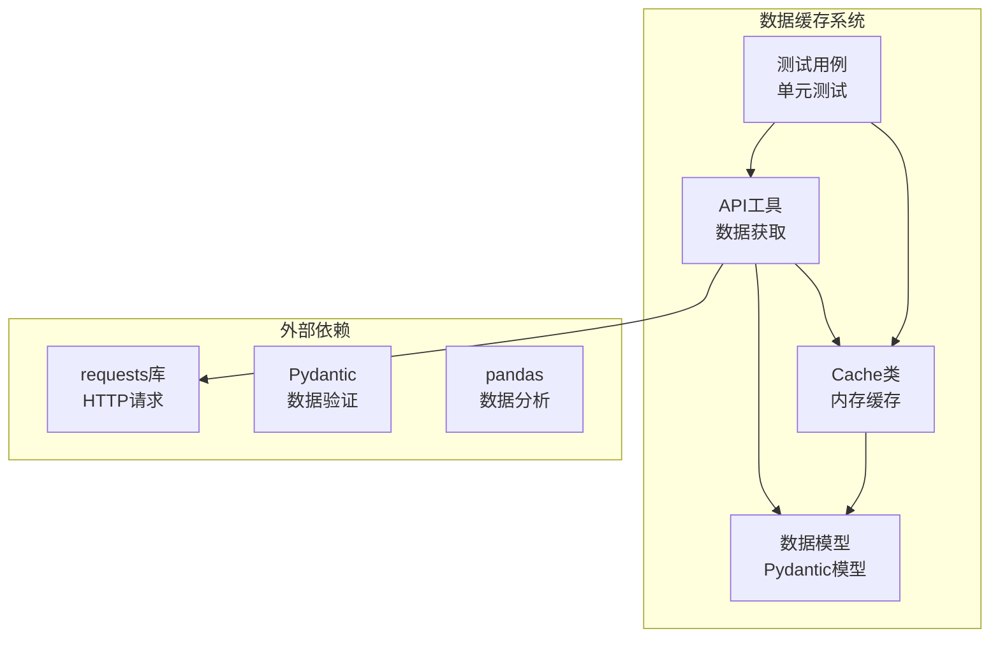
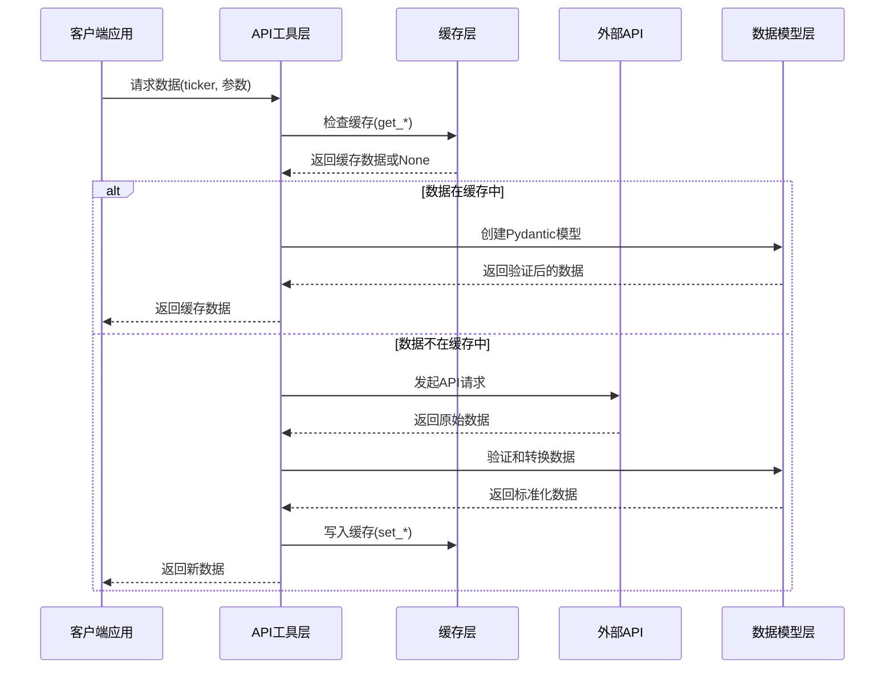
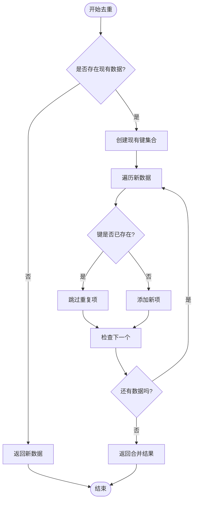
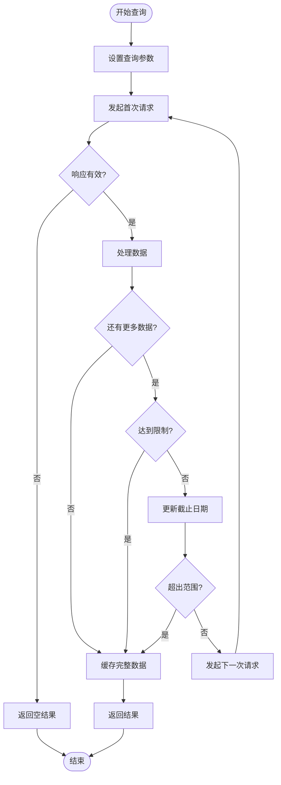
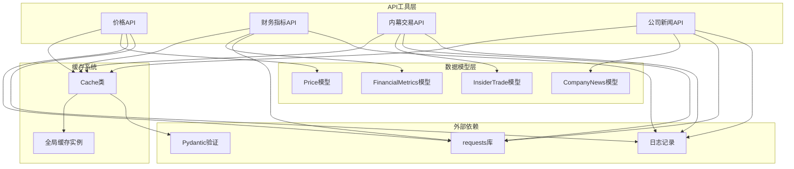
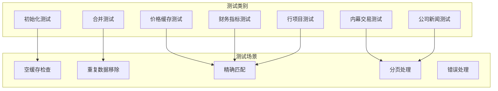

# 数据缓存系统

<cite>
**本文档引用的文件**
- [src/data/cache.py](file://src/data/cache.py)
- [src/data/models.py](file://src/data/models.py)
- [src/tools/api.py](file://src/tools/api.py)
- [tests/test_cache.py](file://tests/test_cache.py)
- [tests/fixtures/api/prices/AAPL_2024-03-01_2024-03-08.json](file://tests/fixtures/api/prices/AAPL_2024-03-01_2024-03-08.json)
- [tests/fixtures/api/financial_metrics/AAPL_2024-03-01_2024-03-08.json](file://tests/fixtures/api/financial_metrics/AAPL_2024-03-01_2024-03-08.json)
</cite>

## 目录
1. [简介](#简介)
2. [项目结构](#项目结构)
3. [核心组件](#核心组件)
4. [架构概览](#架构概览)
5. [详细组件分析](#详细组件分析)
6. [依赖关系分析](#依赖关系分析)
7. [性能考虑](#性能考虑)
8. [故障排除指南](#故障排除指南)
9. [结论](#结论)
10. [附录](#附录)

## 简介

本项目的数据缓存系统是一个基于内存的缓存解决方案，专门设计用于存储和管理金融数据API响应。该系统实现了多种数据类型的缓存策略，包括价格数据、财务指标、资产负债表明细、内幕交易和公司新闻等。

缓存系统的核心目标是：
- 减少对外部API的重复调用
- 提高数据访问速度
- 避免数据重复和不一致
- 提供统一的数据访问接口

## 项目结构

数据缓存系统主要分布在以下模块中：

**图表来源**
- [src/data/cache.py:1-72](file://src/data/cache.py#L1-L72)
- [src/data/models.py:1-175](file://src/data/models.py#L1-L175)
- [src/tools/api.py:1-367](file://src/tools/api.py#L1-L367)

**章节来源**
- [src/data/cache.py:1-72](file://src/data/cache.py#L1-L72)
- [src/data/models.py:1-175](file://src/data/models.py#L1-L175)
- [src/tools/api.py:1-367](file://src/tools/api.py#L1-L367)

## 核心组件

### Cache类 - 主要缓存实现

Cache类是整个缓存系统的核心，提供了统一的内存缓存接口。它包含了以下主要功能：

#### 缓存存储结构
- `_prices_cache`: 存储股票价格数据
- `_financial_metrics_cache`: 存储财务指标数据  
- `_line_items_cache`: 存储资产负债表明细
- `_insider_trades_cache`: 存储内幕交易数据
- `_company_news_cache`: 存储公司新闻数据

#### 数据合并算法
缓存系统实现了智能的数据合并算法，通过以下步骤避免数据重复：

1. **键字段选择**: 基于不同数据类型选择合适的唯一标识符
   - 价格数据: 使用时间戳(`time`)
   - 财务指标: 使用报告期(`report_period`)
   - 资产负债表: 使用报告期(`report_period`)
   - 内幕交易: 使用文件日期(`filing_date`)
   - 公司新闻: 使用日期(`date`)

2. **去重策略**: 使用集合(set)进行O(1)时间复杂度的查找操作

3. **数据保留**: 原始数据优先保留，新数据仅添加不存在的记录

**章节来源**
- [src/data/cache.py:11-22](file://src/data/cache.py#L11-L22)
- [src/data/cache.py:24-62](file://src/data/cache.py#L24-L62)

### 数据模型定义

系统使用Pydantic模型确保数据的结构化和类型安全：

#### 价格数据模型
- 包含开盘价、收盘价、最高价、最低价、成交量
- 时间戳格式化处理
- 数值类型转换和验证

#### 财务指标模型
- 覆盖多种财务比率和指标
- 支持可选字段处理
- 自动类型转换

#### 其他数据模型
- 资产负债表明细
- 内幕交易信息
- 公司新闻内容
- 公司基本信息

**章节来源**
- [src/data/models.py:4-114](file://src/data/models.py#L4-L114)

## 架构概览

缓存系统采用分层架构设计，实现了清晰的职责分离：

**图表来源**
- [src/tools/api.py:63-96](file://src/tools/api.py#L63-L96)
- [src/data/cache.py:24-30](file://src/data/cache.py#L24-L30)

**章节来源**
- [src/tools/api.py:63-312](file://src/tools/api.py#L63-L312)

## 详细组件分析

### 缓存键值策略

缓存系统实现了精确的键值策略来确保数据的准确匹配：

#### 键值生成规则
1. **价格数据**: `{ticker}_{start_date}_{end_date}`
2. **财务指标**: `{ticker}_{period}_{end_date}_{limit}`
3. **内幕交易**: `{ticker}_{start_date}_{end_date}_{limit}`
4. **公司新闻**: `{ticker}_{start_date}_{end_date}_{limit}`

#### 键值设计原则
- **参数完整性**: 所有查询参数都包含在键值中
- **精确匹配**: 相同参数组合产生相同键值
- **可读性**: 键值包含有意义的业务信息

**章节来源**
- [src/tools/api.py:65-66](file://src/tools/api.py#L65-L66)
- [src/tools/api.py:108](file://src/tools/api.py#L108)
- [src/tools/api.py:192](file://src/tools/api.py#L192)
- [src/tools/api.py:258](file://src/tools/api.py#L258)

### 数据去重机制

缓存系统实现了高效的去重算法，确保数据的一致性和完整性：

**图表来源**
- [src/data/cache.py:11-22](file://src/data/cache.py#L11-L22)

#### 去重算法复杂度
- **时间复杂度**: O(n)，其中n是新数据条目数量
- **空间复杂度**: O(m)，其中m是现有数据条目数量
- **查找复杂度**: O(1)使用集合进行重复检查

**章节来源**
- [src/data/cache.py:11-22](file://src/data/cache.py#L11-L22)

### 价格数据缓存实现

价格数据缓存针对时间序列数据进行了专门优化：

#### 缓存策略
- **键值策略**: 使用时间范围作为唯一标识
- **去重字段**: 基于时间戳(`time`)进行去重
- **数据保留**: 按时间顺序保留原始数据

#### 性能特点
- 支持历史数据的增量更新
- 避免重复下载相同时间段的数据
- 维护时间序列的完整性

**章节来源**
- [src/data/cache.py:24-30](file://src/data/cache.py#L24-L30)
- [src/tools/api.py:63-96](file://src/tools/api.py#L63-L96)

### 财务指标缓存实现

财务指标缓存支持多期数据的缓存和管理：

#### 缓存策略
- **键值策略**: 包含股票代码、报告期、截止日期和限制数量
- **去重字段**: 基于报告期(`report_period`)进行去重
- **数据结构**: 支持多个报告期的数据存储

#### 特殊处理
- 支持TTM(滚动12个月)指标的缓存
- 处理不同会计期间的数据
- 维护指标的历史变化趋势

**章节来源**
- [src/data/cache.py:32-38](file://src/data/cache.py#L32-L38)
- [src/tools/api.py:99-138](file://src/tools/api.py#L99-L138)

### 资产负债表明细缓存实现

资产负债表明细缓存提供了灵活的查询和缓存能力：

#### 缓存特性
- **键值策略**: 支持特定行项目的查询缓存
- **数据结构**: 动态字段支持额外的资产负债表项目
- **查询灵活性**: 支持按行项目过滤和限制

#### 实现方式
- 使用POST请求进行批量行项目查询
- 直接返回查询结果，不进行额外缓存
- 适用于大规模数据的高效传输

**章节来源**
- [src/tools/api.py:141-181](file://src/tools/api.py#L141-L181)
- [src/data/models.py:68-80](file://src/data/models.py#L68-L80)

### 内幕交易缓存实现

内幕交易缓存实现了复杂的分页查询和缓存策略：

#### 分页处理逻辑

**图表来源**
- [src/tools/api.py:183-246](file://src/tools/api.py#L183-L246)

#### 缓存策略
- **键值策略**: 包含时间范围和限制数量
- **分页处理**: 自动处理API分页
- **数据合并**: 将分页结果合并为完整列表

**章节来源**
- [src/tools/api.py:183-246](file://src/tools/api.py#L183-L246)

### 公司新闻缓存实现

公司新闻缓存同样采用了分页查询和缓存策略：

#### 查询流程
- **时间范围查询**: 支持指定开始和结束日期
- **分页处理**: 自动处理API分页限制
- **数据合并**: 合并所有分页结果

#### 缓存特性
- **键值策略**: 包含时间范围和限制数量
- **去重处理**: 基于新闻日期进行去重
- **数据完整性**: 确保所有相关新闻都被缓存

**章节来源**
- [src/tools/api.py:249-312](file://src/tools/api.py#L249-L312)

## 依赖关系分析

缓存系统与其他组件的依赖关系如下：

**图表来源**
- [src/data/cache.py:65-71](file://src/data/cache.py#L65-L71)
- [src/tools/api.py:10-23](file://src/tools/api.py#L10-L23)

**章节来源**
- [src/data/cache.py:1-72](file://src/data/cache.py#L1-L72)
- [src/tools/api.py:1-367](file://src/tools/api.py#L1-L367)

## 性能考虑

### 时间复杂度分析

#### 缓存访问
- **平均时间复杂度**: O(1) - 字典查找
- **最坏时间复杂度**: O(n) - 理论上可能的哈希冲突
- **空间复杂度**: O(k) - k为缓存条目数量

#### 数据合并
- **时间复杂度**: O(n + m) - n为现有数据，m为新数据
- **空间复杂度**: O(n + m) - 创建新的合并结果
- **去重查找**: O(1) - 使用集合进行快速查找

#### 去重算法优化
- **集合预计算**: 在开始时计算现有键集合
- **单次遍历**: 只需要一次数据遍历
- **内存局部性**: 连续内存访问模式

### 内存使用策略

#### 内存管理
- **无自动清理**: 当前实现不包含内存清理机制
- **无限增长**: 缓存会持续增长直到进程结束
- **建议策略**: 生产环境中应实现LRU或TTL清理

#### 数据压缩
- **模型序列化**: 使用Pydantic的model_dump()进行序列化
- **JSON格式**: 缓存存储为字典列表格式
- **内存效率**: 相比直接存储对象更节省内存

### 缓存命中率优化建议

#### 键值设计优化
1. **参数标准化**: 确保相同业务含义的参数具有相同的字符串表示
2. **大小写处理**: 统一处理大小写差异
3. **空值处理**: 明确处理None值的键值生成

#### 访问模式优化
1. **预加载策略**: 对频繁访问的数据进行预加载
2. **批量查询**: 合并相似的查询请求
3. **热点数据**: 识别和优化热点数据的访问

## 故障排除指南

### 常见问题诊断

#### 缓存未生效
1. **检查键值生成**: 确认查询参数完全匹配
2. **验证数据类型**: 确保缓存键值的数据类型正确
3. **检查缓存实例**: 确认使用的是同一个缓存实例

#### 数据重复问题
1. **验证去重字段**: 确认选择了正确的去重键字段
2. **检查数据结构**: 确保数据包含预期的键字段
3. **调试输出**: 添加日志输出查看实际的键值

#### 内存泄漏问题
1. **监控内存使用**: 定期检查进程的内存使用情况
2. **实现清理机制**: 添加定期清理或容量限制
3. **资源释放**: 确保不再使用的数据被正确释放

### 测试验证

#### 单元测试覆盖
系统包含全面的单元测试，验证缓存的各种功能：

**图表来源**
- [tests/test_cache.py:6-159](file://tests/test_cache.py#L6-L159)

**章节来源**
- [tests/test_cache.py:1-159](file://tests/test_cache.py#L1-L159)

### 性能监控

#### 监控指标建议
1. **缓存命中率**: `(总请求数 - 缓存未命中数) / 总请求数`
2. **缓存大小**: 当前缓存中的数据条目数量
3. **内存使用**: 进程的内存使用量
4. **API调用次数**: 外部API的实际调用次数

#### 监控实现
- **计数器**: 统计缓存命中和未命中的次数
- **定时采样**: 定期记录缓存状态
- **告警机制**: 设置阈值触发告警

## 结论

本数据缓存系统提供了完整且高效的内存缓存解决方案，具有以下优势：

### 设计优点
1. **模块化设计**: 清晰的职责分离和接口定义
2. **类型安全**: 使用Pydantic确保数据结构的正确性
3. **智能去重**: 高效的去重算法避免数据重复
4. **扩展性强**: 易于添加新的数据类型和缓存策略

### 技术特色
1. **精确键值**: 基于完整查询参数的键值生成
2. **分页处理**: 智能的API分页查询和缓存
3. **数据验证**: 自动的数据结构验证和转换
4. **错误处理**: 完善的异常处理和降级策略

### 改进建议
1. **内存管理**: 实现LRU或TTL清理机制
2. **性能监控**: 添加详细的性能指标收集
3. **配置管理**: 提供可配置的缓存参数
4. **持久化**: 考虑添加磁盘缓存支持

该系统为AI对冲基金项目提供了坚实的数据缓存基础，能够有效提升系统的整体性能和用户体验。

## 附录

### 缓存配置参数

| 参数名称 | 类型 | 默认值 | 描述 |
|---------|------|--------|------|
| 缓存键值 | 字符串 | 自动生成 | 基于查询参数的唯一标识 |
| 去重字段 | 字段名 | 自动选择 | 不同数据类型对应不同的去重键 |
| 缓存容量 | 无限制 | 无限制 | 当前实现不限制缓存大小 |
| 清理策略 | 无 | 无 | 建议实现LRU或TTL策略 |

### 最佳实践指南

#### 开发者最佳实践
1. **键值设计**: 确保查询参数的完整性和一致性
2. **错误处理**: 妥善处理缓存访问失败的情况
3. **内存管理**: 在生产环境中实现缓存清理机制
4. **测试覆盖**: 为新的缓存功能编写单元测试

#### 扩展开发指南
1. **新数据类型**: 遵循现有的缓存接口规范
2. **键值策略**: 为新类型设计合适的键值生成逻辑
3. **去重机制**: 确定合适的去重字段和策略
4. **性能优化**: 考虑数据访问模式进行优化