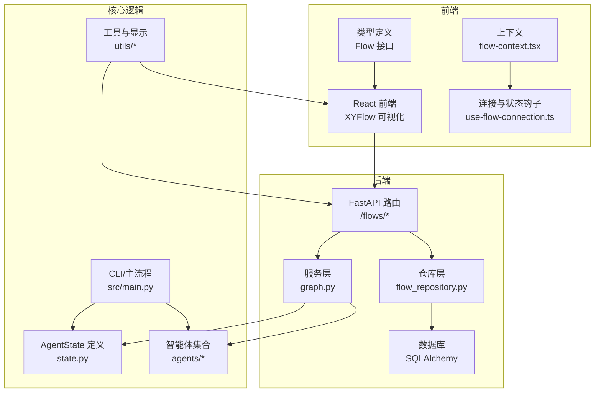
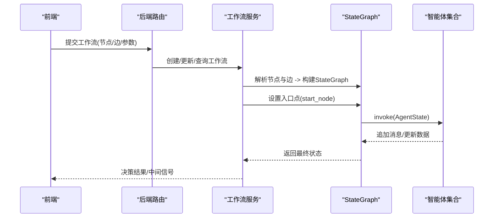
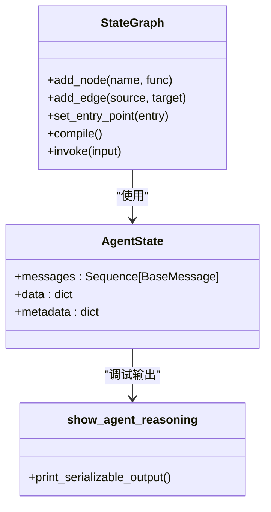
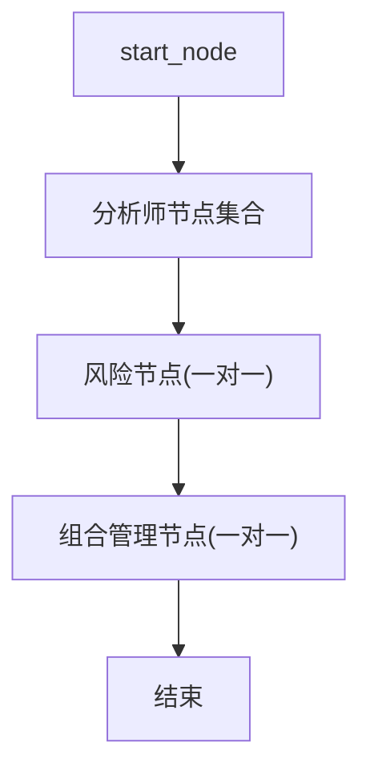
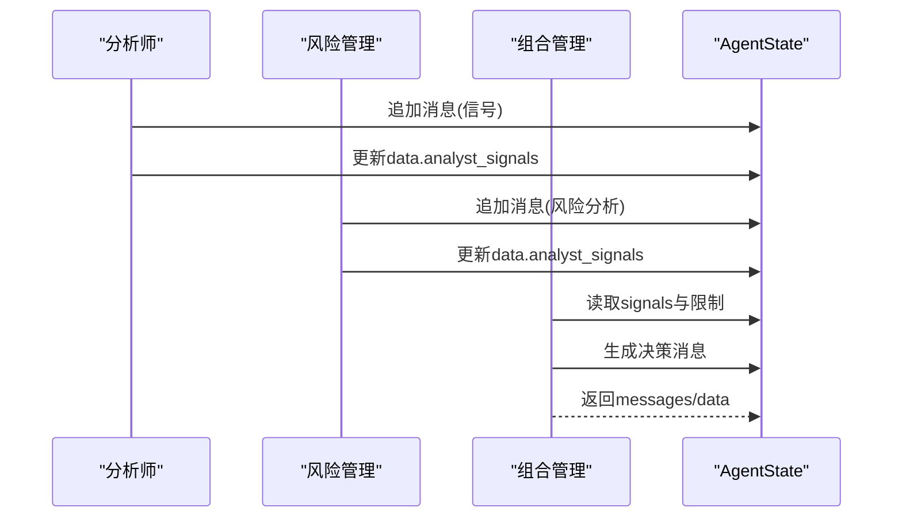
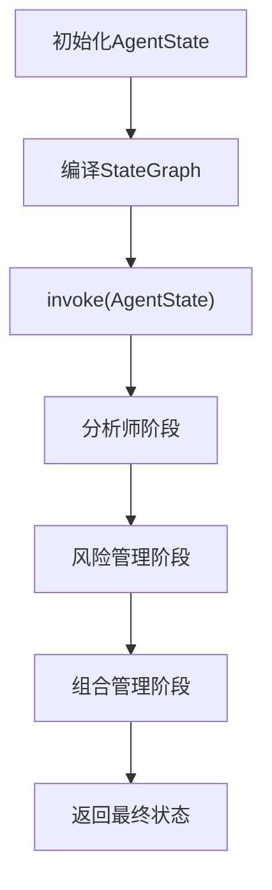
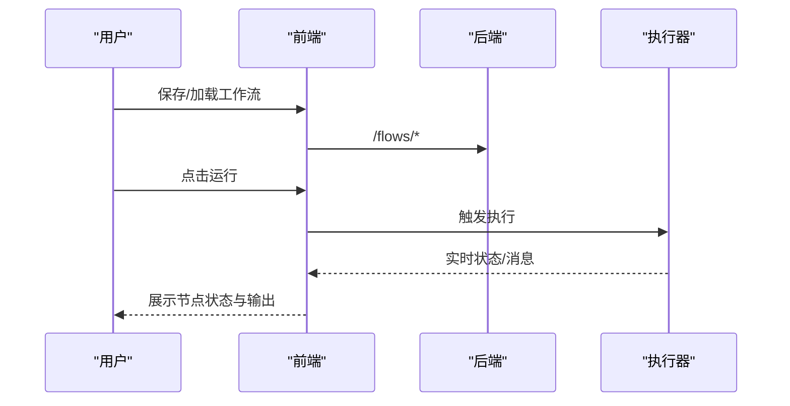
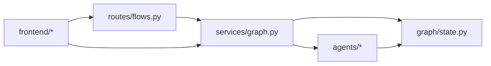

# 工作流引擎设计

<cite>
**本文引用的文件**
- [src/graph/state.py](file://src/graph/state.py)
- [app/backend/services/graph.py](file://app/backend/services/graph.py)
- [src/main.py](file://src/main.py)
- [src/agents/portfolio_manager.py](file://src/agents/portfolio_manager.py)
- [src/agents/risk_manager.py](file://src/agents/risk_manager.py)
- [src/agents/fundamentals.py](file://src/agents/fundamentals.py)
- [src/utils/analysts.py](file://src/utils/analysts.py)
- [app/frontend/src/nodes/components/agent-node.tsx](file://app/frontend/src/nodes/components/agent-node.tsx)
- [app/frontend/src/hooks/use-flow-connection.ts](file://app/frontend/src/hooks/use-flow-connection.ts)
- [app/frontend/src/types/flow.ts](file://app/frontend/src/types/flow.ts)
- [app/backend/routes/flows.py](file://app/backend/routes/flows.py)
- [app/frontend/src/services/flow-service.ts](file://app/frontend/src/services/flow-service.ts)
- [app/frontend/src/contexts/flow-context.tsx](file://app/frontend/src/contexts/flow-context.tsx)
- [src/utils/display.py](file://src/utils/display.py)
- [src/utils/progress.py](file://src/utils/progress.py)
</cite>

## 目录
1. [简介](#简介)
2. [项目结构](#项目结构)
3. [核心组件](#核心组件)
4. [架构总览](#架构总览)
5. [详细组件分析](#详细组件分析)
6. [依赖关系分析](#依赖关系分析)
7. [性能考量](#性能考量)
8. [故障排查指南](#故障排查指南)
9. [结论](#结论)
10. [附录](#附录)

## 简介
本设计文档围绕AI对冲基金系统中的StateGraph工作流引擎展开，系统以LangGraph StateGraph为核心，结合多智能体（分析师、风险管理、组合管理）协作，构建从数据输入到交易决策的自动化流水线。本文将详细阐述AgentState状态模型、节点连接与消息传递机制、工作流创建与执行流程、多智能体协调模式、可视化与调试方法，并给出配置示例与最佳实践。

## 项目结构
后端采用FastAPI提供REST接口，前端基于React+XYFlow进行工作流可视化编辑，核心逻辑位于Python后端与src目录下的智能体与工具模块中。工作流由前端定义节点与边，后端解析并编译为StateGraph，再在运行时通过invoke驱动状态流转。

图表来源
- [app/backend/routes/flows.py:1-174](file://app/backend/routes/flows.py#L1-L174)
- [app/backend/services/graph.py:1-193](file://app/backend/services/graph.py#L1-L193)
- [src/graph/state.py:1-52](file://src/graph/state.py#L1-L52)
- [src/main.py:1-180](file://src/main.py#L1-L180)
- [src/agents/portfolio_manager.py:1-263](file://src/agents/portfolio_manager.py#L1-L263)
- [src/agents/risk_manager.py:1-318](file://src/agents/risk_manager.py#L1-L318)
- [src/agents/fundamentals.py:1-164](file://src/agents/fundamentals.py#L1-L164)
- [src/utils/analysts.py:1-201](file://src/utils/analysts.py#L1-L201)
- [app/frontend/src/nodes/components/agent-node.tsx:1-148](file://app/frontend/src/nodes/components/agent-node.tsx#L1-L148)
- [app/frontend/src/hooks/use-flow-connection.ts:1-268](file://app/frontend/src/hooks/use-flow-connection.ts#L1-L268)
- [app/frontend/src/types/flow.ts:1-13](file://app/frontend/src/types/flow.ts#L1-L13)
- [app/frontend/src/contexts/flow-context.tsx:1-358](file://app/frontend/src/contexts/flow-context.tsx#L1-L358)

章节来源
- [app/backend/routes/flows.py:1-174](file://app/backend/routes/flows.py#L1-L174)
- [app/backend/services/graph.py:1-193](file://app/backend/services/graph.py#L1-L193)
- [src/graph/state.py:1-52](file://src/graph/state.py#L1-L52)
- [src/main.py:1-180](file://src/main.py#L1-L180)

## 核心组件
- AgentState状态模型：统一承载消息序列、数据字典与元数据字典，支持合并策略与序列化输出，用于跨智能体的消息传递与状态共享。
- 智能体集合：包含多种风格的分析师智能体、风险管理智能体与组合管理智能体，每个智能体负责特定领域的信号生成或决策制定。
- 工作流编译器：根据前端提交的节点与边，动态构建StateGraph，自动处理入口点、风险与组合管理节点的特殊路由。
- 执行器：提供同步与异步执行包装，将输入参数注入AgentState并调用invoke，返回最终决策与中间信号。
- 前端可视化与交互：提供节点拖拽、连线、保存/加载工作流、运行控制与节点状态展示。

章节来源
- [src/graph/state.py:14-52](file://src/graph/state.py#L14-L52)
- [src/utils/analysts.py:24-201](file://src/utils/analysts.py#L24-L201)
- [app/backend/services/graph.py:36-129](file://app/backend/services/graph.py#L36-L129)
- [src/agents/portfolio_manager.py:24-94](file://src/agents/portfolio_manager.py#L24-L94)
- [src/agents/risk_manager.py:10-219](file://src/agents/risk_manager.py#L10-L219)
- [app/frontend/src/nodes/components/agent-node.tsx:18-148](file://app/frontend/src/nodes/components/agent-node.tsx#L18-L148)

## 架构总览
系统采用“前端可视化编辑 + 后端编译执行”的分层架构。前端负责工作流的创建与维护；后端将工作流结构转换为StateGraph，注入初始状态并执行；智能体通过消息与数据字段进行协作，最终由组合管理智能体汇总输出交易决策。

图表来源
- [app/backend/routes/flows.py:18-135](file://app/backend/routes/flows.py#L18-L135)
- [app/backend/services/graph.py:36-177](file://app/backend/services/graph.py#L36-L177)
- [src/main.py:46-93](file://src/main.py#L46-L93)

## 详细组件分析

### AgentState状态模型与消息传递
- 数据结构
  - messages：消息序列，使用operator.add进行合并，确保多轮对话累积。
  - data：字典数据，使用merge_dicts进行合并，便于跨智能体共享分析结果与市场数据。
  - metadata：元数据，包含模型选择、推理开关等运行时信息。
- 输出与调试
  - show_agent_reasoning提供统一的JSON序列化与美化打印，支持对象转字典、列表递归处理与字符串回退，便于调试与日志输出。

图表来源
- [src/graph/state.py:14-52](file://src/graph/state.py#L14-L52)
- [app/backend/services/graph.py:36-129](file://app/backend/services/graph.py#L36-L129)

章节来源
- [src/graph/state.py:14-52](file://src/graph/state.py#L14-L52)

### 工作流创建与节点连接机制
- 节点解析
  - 从前端传入的graph_nodes提取智能体节点ID，识别基础键（如“portfolio_manager”），并按配置映射到具体智能体函数。
  - 使用唯一后缀区分同一类型的多个实例（例如“portfolio_manager_abcd12”）。
- 边连接规则
  - 分析师节点直接连接至对应的风险管理节点（一个分析师对应一个风险节点）。
  - 风险管理节点再连接至对应的组合管理节点。
  - 组合管理节点连接至END。
  - 入口点start_node连接至所有无入边的分析师节点。
- 特殊处理
  - 对于“分析师->组合管理”的直达边，改为“分析师->风险管理->组合管理”，以保证风控前置。

图表来源
- [app/backend/services/graph.py:36-129](file://app/backend/services/graph.py#L36-L129)

章节来源
- [app/backend/services/graph.py:36-129](file://app/backend/services/graph.py#L36-L129)

### 多智能体协作模式
- 分析师智能体：从财务、技术、新闻、宏观等维度生成信号，写入data.analyst_signals，供风险管理与组合管理消费。
- 风险管理智能体：基于波动率、相关性与头寸价值计算剩余头寸限额，输出风险分析与理由。
- 组合管理智能体：聚合各分析师信号与风险限制，生成最终交易决策（买卖/做多/做空/持有）。

图表来源
- [src/agents/fundamentals.py:10-164](file://src/agents/fundamentals.py#L10-L164)
- [src/agents/risk_manager.py:10-219](file://src/agents/risk_manager.py#L10-L219)
- [src/agents/portfolio_manager.py:24-94](file://src/agents/portfolio_manager.py#L24-L94)

章节来源
- [src/agents/fundamentals.py:10-164](file://src/agents/fundamentals.py#L10-L164)
- [src/agents/risk_manager.py:10-219](file://src/agents/risk_manager.py#L10-L219)
- [src/agents/portfolio_manager.py:24-94](file://src/agents/portfolio_manager.py#L24-L94)

### 工作流执行流程与状态转换
- CLI路径：create_workflow构建默认工作流，add_node/add_edge设置入口点，compile后invoke。
- 后端路径：create_graph解析前端结构，add_node/add_edge建立连接，set_entry_point设置入口，run_graph封装invoke。
- 异步执行：run_graph_async通过线程池避免阻塞事件循环。

图表来源
- [src/main.py:100-130](file://src/main.py#L100-L130)
- [app/backend/services/graph.py:141-177](file://app/backend/services/graph.py#L141-L177)

章节来源
- [src/main.py:46-130](file://src/main.py#L46-L130)
- [app/backend/services/graph.py:132-177](file://app/backend/services/graph.py#L132-L177)

### 前端可视化与交互
- 工作流存储与加载：FlowProvider负责保存/加载节点、边、视口与内部状态，支持模板与复制。
- 运行控制：useFlowConnection管理连接状态（连接中/已连接/错误/完成），支持停止与恢复。
- 节点状态展示：AgentNode显示状态、消息与模型选择，支持高级面板。

图表来源
- [app/frontend/src/contexts/flow-context.tsx:74-131](file://app/frontend/src/contexts/flow-context.tsx#L74-L131)
- [app/frontend/src/hooks/use-flow-connection.ts:114-148](file://app/frontend/src/hooks/use-flow-connection.ts#L114-L148)
- [app/frontend/src/nodes/components/agent-node.tsx:18-148](file://app/frontend/src/nodes/components/agent-node.tsx#L18-L148)

章节来源
- [app/frontend/src/contexts/flow-context.tsx:1-358](file://app/frontend/src/contexts/flow-context.tsx#L1-L358)
- [app/frontend/src/hooks/use-flow-connection.ts:1-268](file://app/frontend/src/hooks/use-flow-connection.ts#L1-L268)
- [app/frontend/src/nodes/components/agent-node.tsx:1-148](file://app/frontend/src/nodes/components/agent-node.tsx#L1-L148)

## 依赖关系分析
- 后端路由依赖仓库层访问数据库，服务层依赖智能体与状态模型。
- 前端依赖服务层与上下文，通过钩子管理连接状态与节点状态。
- 智能体之间通过AgentState的数据字段进行解耦协作，避免强耦合。

图表来源
- [app/backend/routes/flows.py:1-174](file://app/backend/routes/flows.py#L1-L174)
- [app/backend/services/graph.py:1-193](file://app/backend/services/graph.py#L1-L193)
- [src/graph/state.py:1-52](file://src/graph/state.py#L1-L52)
- [src/agents/portfolio_manager.py:1-263](file://src/agents/portfolio_manager.py#L1-L263)
- [src/agents/risk_manager.py:1-318](file://src/agents/risk_manager.py#L1-L318)
- [src/agents/fundamentals.py:1-164](file://src/agents/fundamentals.py#L1-L164)

章节来源
- [app/backend/routes/flows.py:1-174](file://app/backend/routes/flows.py#L1-L174)
- [app/backend/services/graph.py:1-193](file://app/backend/services/graph.py#L1-L193)

## 性能考量
- 并行与异步：后端执行通过线程池避免阻塞事件循环；前端使用SSE与连接管理器减少UI卡顿。
- 数据最小化：组合管理阶段仅向LLM发送必要字段，降低token与成本。
- 缓存与复用：前端节点状态隔离，避免跨工作流污染；后端避免重复计算（如价格与波动率）。
- 可观测性：进度条与调试输出帮助定位瓶颈与异常。

## 故障排查指南
- JSON解析失败：parse_hedge_fund_response提供统一的错误捕获与回退，便于定位响应格式问题。
- 连接异常：useFlowConnection提供连接状态机与错误上报，支持停止与恢复。
- 调试输出：show_agent_reasoning与progress分别提供结构化输出与实时进度，辅助定位信号缺失或决策异常。
- 显示格式：print_trading_output统一表格化输出，便于核对信号与决策一致性。

章节来源
- [app/backend/services/graph.py:180-193](file://app/backend/services/graph.py#L180-L193)
- [app/frontend/src/hooks/use-flow-connection.ts:186-232](file://app/frontend/src/hooks/use-flow-connection.ts#L186-L232)
- [src/graph/state.py:21-52](file://src/graph/state.py#L21-L52)
- [src/utils/display.py:17-255](file://src/utils/display.py#L17-L255)
- [src/utils/progress.py:12-117](file://src/utils/progress.py#L12-L117)

## 结论
该工作流引擎以StateGraph为核心，通过清晰的状态模型与消息传递机制，实现了分析师、风险与组合管理的有序协作。前端提供直观的可视化编辑与运行控制，后端负责高效编译与执行。整体设计具备良好的扩展性与可维护性，适合在多智能体场景下持续演进。

## 附录

### 工作流创建步骤（后端）
- 从前端获取nodes与edges。
- 调用create_graph解析节点与边，自动添加start_node、风险与组合管理节点。
- 设置入口点并返回StateGraph。
- 通过run_graph或run_graph_async执行，传入tickers、portfolio、时间窗口与模型参数。

章节来源
- [app/backend/services/graph.py:36-177](file://app/backend/services/graph.py#L36-L177)

### 工作流创建步骤（CLI）
- 调用create_workflow，按需选择分析师集合。
- 添加start_node与分析师节点，连接至风险与组合管理节点。
- 设置入口点并编译，通过run_hedge_fund执行。

章节来源
- [src/main.py:100-130](file://src/main.py#L100-L130)

### 多智能体协作最佳实践
- 明确职责边界：分析师专注信号生成，风险管理专注约束计算，组合管理专注决策合成。
- 使用data.analyst_signals作为共享缓冲区，避免跨智能体直接调用。
- 控制LLM输入规模：仅传递必要字段，减少token与成本。
- 开启show_reasoning与进度条，便于调试与监控。

章节来源
- [src/agents/portfolio_manager.py:177-263](file://src/agents/portfolio_manager.py#L177-L263)
- [src/agents/risk_manager.py:10-219](file://src/agents/risk_manager.py#L10-L219)
- [src/agents/fundamentals.py:10-164](file://src/agents/fundamentals.py#L10-L164)