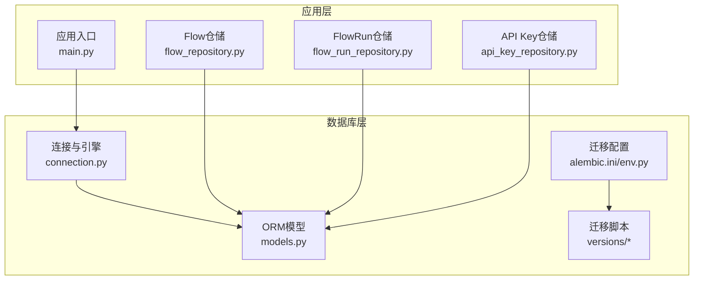
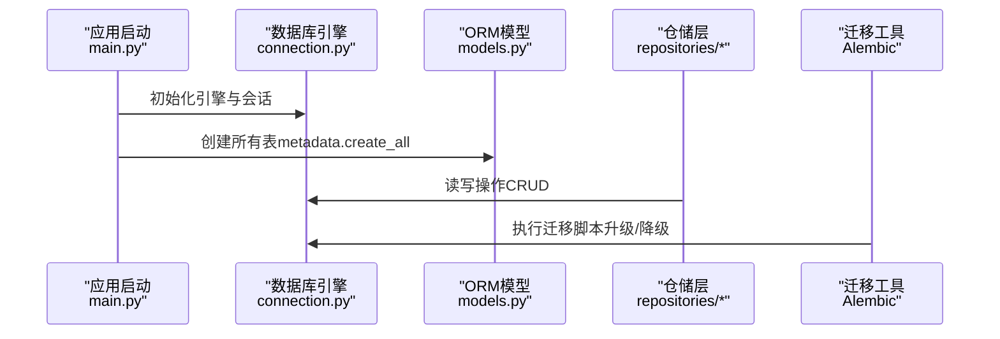
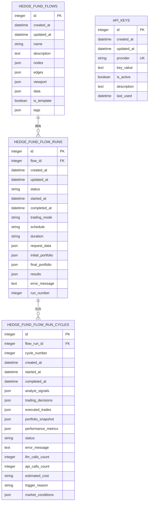
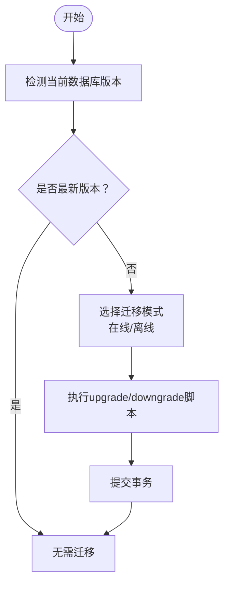
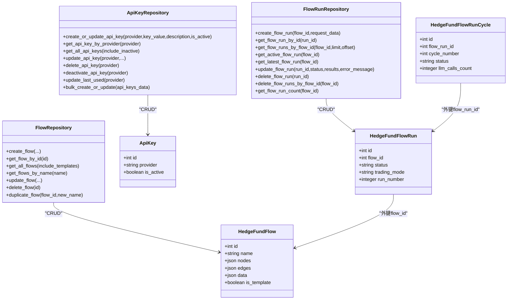
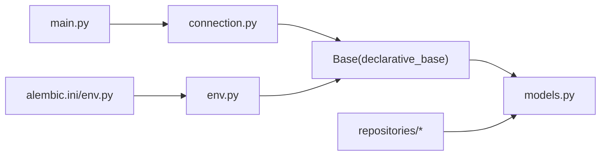

# 数据库架构设计

<cite>
**本文档引用的文件**
- [models.py](file://app/backend/database/models.py)
- [connection.py](file://app/backend/database/connection.py)
- [env.py](file://app/backend/alembic/env.py)
- [script.py.mako](file://app/backend/alembic/script.py.mako)
- [alembic.ini](file://app/backend/alembic.ini)
- [1b1feba3d897_add_data_column_to_hedge_fund_flows.py](file://app/backend/alembic/versions/1b1feba3d897_add_data_column_to_hedge_fund_flows.py)
- [2f8c5d9e4b1a_add_hedgefundflowrun_table.py](file://app/backend/alembic/versions/2f8c5d9e4b1a_add_hedgefundflowrun_table.py)
- [3f9a6b7c8d2e_add_hedgefundflowruncycle_table.py](file://app/backend/alembic/versions/3f9a6b7c8d2e_add_hedgefundflowruncycle_table.py)
- [5274886e5bee_add_hedgefundflow_table.py](file://app/backend/alembic/versions/5274886e5bee_add_hedgefundflow_table.py)
- [add_api_keys_table.py](file://app/backend/alembic/versions/add_api_keys_table.py)
- [flow_repository.py](file://app/backend/repositories/flow_repository.py)
- [flow_run_repository.py](file://app/backend/repositories/flow_run_repository.py)
- [api_key_repository.py](file://app/backend/repositories/api_key_repository.py)
- [main.py](file://app/backend/main.py)
</cite>

## 目录
1. [简介](#简介)
2. [项目结构](#项目结构)
3. [核心组件](#核心组件)
4. [架构总览](#架构总览)
5. [详细组件分析](#详细组件分析)
6. [依赖关系分析](#依赖关系分析)
7. [性能考虑](#性能考虑)
8. [故障排查指南](#故障排查指南)
9. [结论](#结论)
10. [附录](#附录)

## 简介
本文件面向AI对冲基金系统，提供数据库架构设计文档。内容涵盖：
- SQLAlchemy ORM模型定义与关系映射
- 核心数据实体（交易流程、流程运行、API密钥）的设计
- 数据库迁移策略与版本管理（Alembic）
- 索引优化与查询性能考量
- 数据完整性约束、外键关系与业务规则
- ER图与数据模型图表，帮助开发者快速理解数据结构

## 项目结构
后端数据库相关代码集中在以下位置：
- 数据库连接与ORM基类：app/backend/database/connection.py
- ORM模型定义：app/backend/database/models.py
- Alembic迁移配置与脚本：app/backend/alembic/*
- 仓储层（Repository）：app/backend/repositories/*

**图表来源**
- [connection.py:1-32](file://app/backend/database/connection.py#L1-L32)
- [models.py:1-115](file://app/backend/database/models.py#L1-L115)
- [env.py:1-78](file://app/backend/alembic/env.py#L1-L78)
- [alembic.ini:1-120](file://app/backend/alembic.ini#L1-L120)
- [flow_repository.py:1-103](file://app/backend/repositories/flow_repository.py#L1-L103)
- [flow_run_repository.py:1-133](file://app/backend/repositories/flow_run_repository.py#L1-L133)
- [api_key_repository.py:1-131](file://app/backend/repositories/api_key_repository.py#L1-L131)
- [main.py:1-56](file://app/backend/main.py#L1-L56)

**章节来源**
- [connection.py:1-32](file://app/backend/database/connection.py#L1-L32)
- [models.py:1-115](file://app/backend/database/models.py#L1-L115)
- [env.py:1-78](file://app/backend/alembic/env.py#L1-L78)
- [alembic.ini:1-120](file://app/backend/alembic.ini#L1-L120)
- [flow_repository.py:1-103](file://app/backend/repositories/flow_repository.py#L1-L103)
- [flow_run_repository.py:1-133](file://app/backend/repositories/flow_run_repository.py#L1-L133)
- [api_key_repository.py:1-131](file://app/backend/repositories/api_key_repository.py#L1-L131)
- [main.py:1-56](file://app/backend/main.py#L1-L56)

## 核心组件
本系统采用SQLite本地数据库，通过SQLAlchemy ORM进行建模与迁移管理。核心实体包括：
- HedgeFundFlow：存储交易流程的React Flow配置与元数据
- HedgeFundFlowRun：跟踪单次或连续执行的流程运行
- HedgeFundFlowRunCycle：单次运行内的分析周期记录
- ApiKey：存储各类服务的API密钥信息

各实体均包含标准的时间戳字段（created_at、updated_at），并使用JSON列存储动态结构的数据。

**章节来源**
- [models.py:6-115](file://app/backend/database/models.py#L6-L115)

## 架构总览
下图展示数据库层与应用层的交互关系，以及迁移工具在部署阶段的作用。

**图表来源**
- [main.py:17-18](file://app/backend/main.py#L17-L18)
- [connection.py:14-24](file://app/backend/database/connection.py#L14-L24)
- [models.py:6-115](file://app/backend/database/models.py#L6-L115)
- [env.py:28-77](file://app/backend/alembic/env.py#L28-L77)

## 详细组件分析

### 实体与关系设计
- HedgeFundFlow（交易流程）
  - 主键：id
  - 元数据：name、description、is_template、tags
  - React Flow状态：nodes、edges、viewport、data
  - 时间戳：created_at、updated_at
- HedgeFundFlowRun（流程运行）
  - 外键：flow_id → HedgeFundFlow.id
  - 运行状态：status、started_at、completed_at
  - 配置：trading_mode、schedule、duration
  - 数据：request_data、initial_portfolio、final_portfolio、results、error_message
  - 元数据：run_number（按flow_id递增）
  - 时间戳：created_at、updated_at
- HedgeFundFlowRunCycle（运行周期）
  - 外键：flow_run_id → HedgeFundFlowRun.id
  - 周期编号：cycle_number
  - 时间线：created_at、started_at、completed_at
  - 结果：analyst_signals、trading_decisions、executed_trades、portfolio_snapshot、performance_metrics
  - 跟踪：status、error_message、llm_calls_count、api_calls_count、estimated_cost
  - 元数据：trigger_reason、market_conditions
- ApiKey（API密钥）
  - 唯一标识：provider（唯一索引）
  - 安全：key_value（生产环境建议加密存储）
  - 状态：is_active、last_used
  - 描述：description
  - 时间戳：created_at、updated_at

**图表来源**
- [models.py:6-115](file://app/backend/database/models.py#L6-L115)

**章节来源**
- [models.py:6-115](file://app/backend/database/models.py#L6-L115)

### 数据类型与约束
- 整数：主键、计数器、序号
- 字符串：名称、状态枚举、触发原因、提供商
- 文本：描述、错误消息
- JSON：动态结构（节点、边、视口、数据、分析信号、决策、交易、快照、指标）
- 布尔：模板标记、激活状态
- 时间戳：自动默认值与更新触发器
- 唯一约束：provider（ApiKey）
- 外键约束：flow_id、flow_run_id（由SQLAlchemy外键定义）

**章节来源**
- [models.py:10-26](file://app/backend/database/models.py#L10-L26)
- [models.py:34-56](file://app/backend/database/models.py#L34-L56)
- [models.py:64-94](file://app/backend/database/models.py#L64-L94)
- [models.py:106-112](file://app/backend/database/models.py#L106-L112)

### 业务规则
- 运行状态机：IDLE → IN_PROGRESS → COMPLETE 或 ERROR
- 连续运行模式：支持定时调度（hourly/daily/weekly）与持续时长（1day/1week/1month）
- 周期编号：按运行内递增，用于时间序列分析
- API密钥：按提供商唯一，支持启用/禁用与最后使用时间追踪
- 流程复制：保留原始流程的节点、边、视口、数据与标签，复制后非模板

**章节来源**
- [models.py:39-46](file://app/backend/database/models.py#L39-L46)
- [models.py:84](file://app/backend/database/models.py#L84)
- [flow_repository.py:86-103](file://app/backend/repositories/flow_repository.py#L86-L103)
- [api_key_repository.py:48-60](file://app/backend/repositories/api_key_repository.py#L48-L60)

### 查询与索引策略
- 已建立的索引
  - HedgeFundFlows：id
  - HedgeFundFlowRuns：id、flow_id
  - HedgeFundFlowRunCycles：flow_run_id、cycle_number、status、started_at
  - ApiKeys：id、provider
- 推荐索引
  - 按flow_id查询运行列表：已存在flow_id索引
  - 按status过滤周期：已存在status索引
  - 按created_at排序：已存在started_at索引
  - ApiKey按provider查询：已存在provider索引
- 性能建议
  - 使用limit/offset分页查询运行与周期
  - 对高频过滤条件（status、provider）保持索引
  - JSON列查询建议使用合适的过滤条件，避免全表扫描

**章节来源**
- [2f8c5d9e4b1a_add_hedgefundflowrun_table.py:38-39](file://app/backend/alembic/versions/2f8c5d9e4b1a_add_hedgefundflowrun_table.py#L38-L39)
- [3f9a6b7c8d2e_add_hedgefundflowruncycle_table.py:63-67](file://app/backend/alembic/versions/3f9a6b7c8d2e_add_hedgefundflowruncycle_table.py#L63-L67)
- [add_api_keys_table.py:36-37](file://app/backend/alembic/versions/add_api_keys_table.py#L36-L37)

### 迁移策略与版本管理
- 迁移工具：Alembic
- 配置位置：app/backend/alembic.ini
- 环境集成：app/backend/alembic/env.py
- 版本脚本组织：app/backend/alembic/versions/
- 执行方式
  - 在线迁移：通过env.py连接数据库并执行事务
  - 离线迁移：直接生成SQL脚本
- 版本演进
  - 初始表：HedgeFundFlow
  - 运行表：HedgeFundFlowRun
  - 周期表：HedgeFundFlowRunCycle（含向现有表添加列）
  - API密钥表：ApiKey
  - 数据列扩展：为HedgeFundFlow增加data列

**图表来源**
- [env.py:28-77](file://app/backend/alembic/env.py#L28-L77)
- [script.py.mako:21-28](file://app/backend/alembic/script.py.mako#L21-L28)

**章节来源**
- [env.py:17-20](file://app/backend/alembic/env.py#L17-L20)
- [env.py:52-77](file://app/backend/alembic/env.py#L52-L77)
- [script.py.mako:1-29](file://app/backend/alembic/script.py.mako#L1-L29)
- [alembic.ini:66](file://app/backend/alembic.ini#L66)

### 迁移脚本概览
- 5274886e5bee_add_hedgefundflow_table.py：创建HedgeFundFlow表及索引
- 1b1feba3d897_add_data_column_to_hedge_fund_flows.py：为HedgeFundFlow增加data列
- 2f8c5d9e4b1a_add_hedgefundflowrun_table.py：创建HedgeFundFlowRun表及索引
- 3f9a6b7c8d2e_add_hedgefundflowruncycle_table.py：为HedgeFundFlowRun添加多列，并创建HedgeFundFlowRunCycle表与索引
- add_api_keys_table.py：创建ApiKey表、唯一约束与索引

**章节来源**
- [5274886e5bee_add_hedgefundflow_table.py:21-38](file://app/backend/alembic/versions/5274886e5bee_add_hedgefundflow_table.py#L21-L38)
- [1b1feba3d897_add_data_column_to_hedge_fund_flows.py:21-32](file://app/backend/alembic/versions/1b1feba3d897_add_data_column_to_hedge_fund_flows.py#L21-L32)
- [2f8c5d9e4b1a_add_hedgefundflowrun_table.py:21-40](file://app/backend/alembic/versions/2f8c5d9e4b1a_add_hedgefundflowrun_table.py#L21-L40)
- [3f9a6b7c8d2e_add_hedgefundflowruncycle_table.py:18-68](file://app/backend/alembic/versions/3f9a6b7c8d2e_add_hedgefundflowruncycle_table.py#L18-L68)
- [add_api_keys_table.py:21-37](file://app/backend/alembic/versions/add_api_keys_table.py#L21-37)

### 仓储层与ORM交互
- FlowRepository：提供流程的CRUD与搜索功能，支持模板过滤与名称模糊匹配
- FlowRunRepository：提供运行的CRUD、活跃运行查询、最新运行查询、运行计数统计与自动生成run_number
- ApiKeyRepository：提供API密钥的创建/更新、查询、批量导入、停用与最后使用时间更新

**图表来源**
- [models.py:6-115](file://app/backend/database/models.py#L6-L115)
- [flow_repository.py:6-103](file://app/backend/repositories/flow_repository.py#L6-L103)
- [flow_run_repository.py:9-133](file://app/backend/repositories/flow_run_repository.py#L9-L133)
- [api_key_repository.py:9-131](file://app/backend/repositories/api_key_repository.py#L9-L131)

**章节来源**
- [flow_repository.py:1-103](file://app/backend/repositories/flow_repository.py#L1-L103)
- [flow_run_repository.py:1-133](file://app/backend/repositories/flow_run_repository.py#L1-L133)
- [api_key_repository.py:1-131](file://app/backend/repositories/api_key_repository.py#L1-L131)

## 依赖关系分析
- 应用启动时初始化数据库表（幂等）
- Alembic通过env.py加载模型元数据，确保迁移目标与模型一致
- 仓储层依赖SQLAlchemy会话与模型类，实现业务逻辑与数据持久化解耦

**图表来源**
- [main.py:17-18](file://app/backend/main.py#L17-L18)
- [connection.py:23-24](file://app/backend/database/connection.py#L23-L24)
- [env.py:19-20](file://app/backend/alembic/env.py#L19-L20)
- [flow_repository.py:3](file://app/backend/repositories/flow_repository.py#L3)
- [flow_run_repository.py:5](file://app/backend/repositories/flow_run_repository.py#L5)
- [api_key_repository.py:6](file://app/backend/repositories/api_key_repository.py#L6)

**章节来源**
- [main.py:17-18](file://app/backend/main.py#L17-L18)
- [env.py:17-20](file://app/backend/alembic/env.py#L17-L20)

## 性能考虑
- 索引覆盖常用查询路径：flow_id、status、provider、started_at
- JSON列查询建议限定条件，避免全量解析
- 分页查询：对运行与周期列表使用limit/offset
- 时间戳字段使用服务器默认值与更新触发器，减少应用侧逻辑
- SQLite适用于开发与小规模场景；如需高并发，建议迁移到PostgreSQL并调整索引与分区策略

[本节为通用指导，不涉及具体文件分析]

## 故障排查指南
- 表不存在或版本不一致
  - 确认应用启动时已调用创建所有表
  - 使用Alembic检查当前版本并执行迁移
- 查询性能差
  - 检查是否命中索引（flow_id、status、provider、started_at）
  - 对大结果集使用分页
- JSON列异常
  - 确保写入结构与模型定义一致
  - 避免在查询中对JSON列做昂贵的计算
- API密钥问题
  - 确认provider唯一性
  - 检查is_active状态与last_used更新

**章节来源**
- [main.py:17-18](file://app/backend/main.py#L17-L18)
- [env.py:28-77](file://app/backend/alembic/env.py#L28-L77)
- [flow_run_repository.py:35-44](file://app/backend/repositories/flow_run_repository.py#L35-L44)
- [api_key_repository.py:48-60](file://app/backend/repositories/api_key_repository.py#L48-L60)

## 结论
本数据库架构围绕交易流程、运行与周期、API密钥三大主题构建，采用SQLite与SQLAlchemy ORM实现快速迭代与可维护性。通过Alembic迁移工具与完善的索引策略，系统具备良好的演进能力与查询性能。建议在生产环境中加强安全（密钥加密）、监控（慢查询与索引命中率）与容量规划（从SQLite平滑迁移到PostgreSQL）。

[本节为总结性内容，不涉及具体文件分析]

## 附录
- 数据库初始化：应用启动时自动创建所有表
- 迁移执行：通过Alembic在线/离线模式执行
- 版本脚本：按时间顺序组织，支持升级与降级

**章节来源**
- [main.py:17-18](file://app/backend/main.py#L17-L18)
- [env.py:28-77](file://app/backend/alembic/env.py#L28-L77)
- [alembic.ini:66](file://app/backend/alembic.ini#L66)