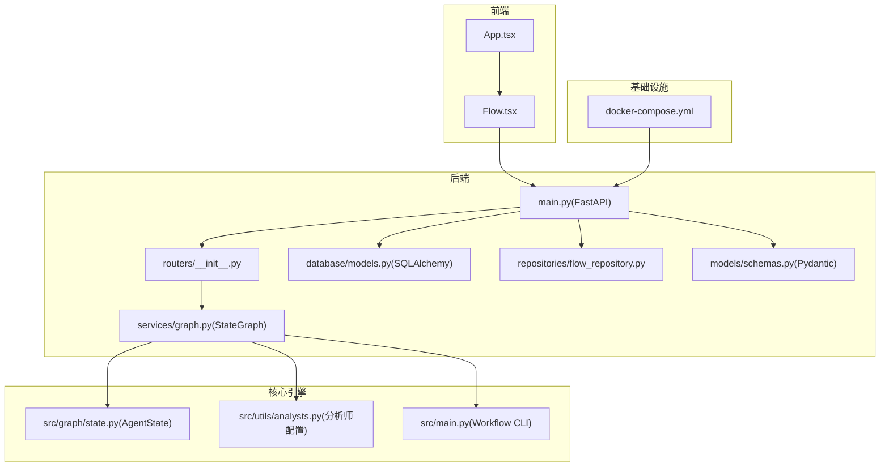
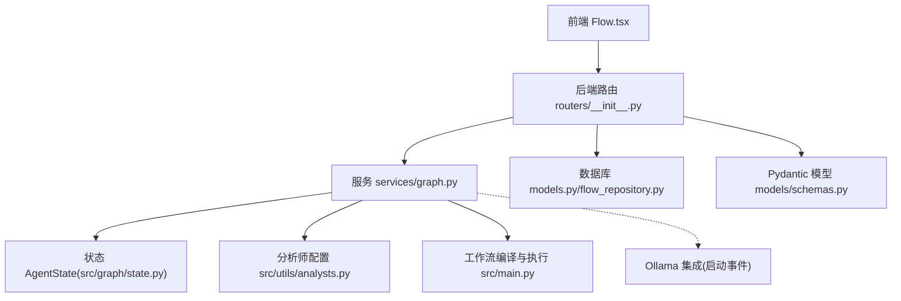
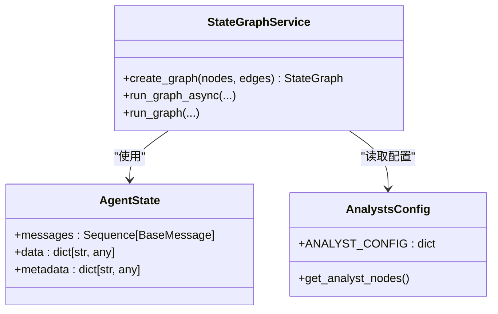
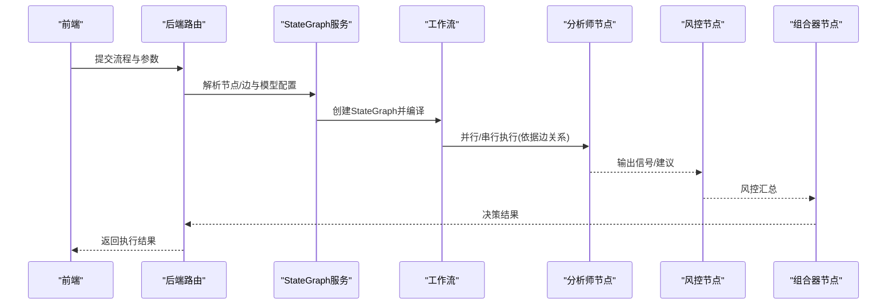
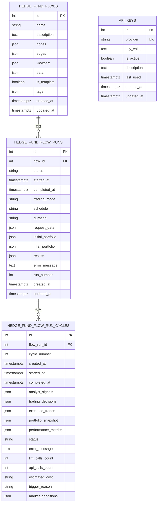
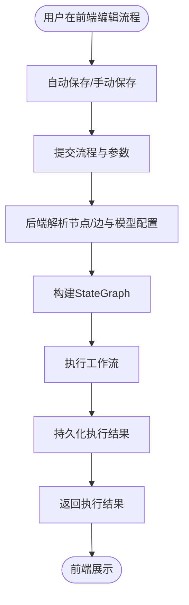
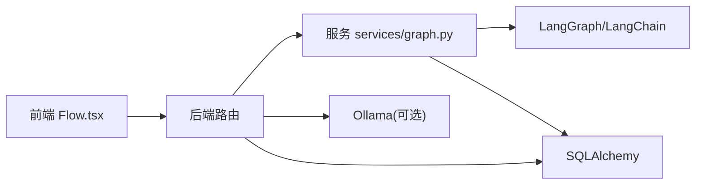

# 核心架构

<cite>
**本文引用的文件**
- [app/backend/main.py](file://app/backend/main.py)
- [app/backend/__init__.py](file://app/backend/__init__.py)
- [app/backend/routers/__init__.py](file://app/backend/routers/__init__.py)
- [app/backend/database/models.py](file://app/backend/database/models.py)
- [app/backend/repositories/flow_repository.py](file://app/backend/repositories/flow_repository.py)
- [app/backend/models/schemas.py](file://app/backend/models/schemas.py)
- [app/backend/services/graph.py](file://app/backend/services/graph.py)
- [src/graph/state.py](file://src/graph/state.py)
- [src/utils/analysts.py](file://src/utils/analysts.py)
- [src/main.py](file://src/main.py)
- [app/frontend/src/App.tsx](file://app/frontend/src/App.tsx)
- [app/frontend/src/components/Flow.tsx](file://app/frontend/src/components/Flow.tsx)
- [docker/docker-compose.yml](file://docker/docker-compose.yml)
</cite>

## 目录
1. [引言](#引言)
2. [项目结构](#项目结构)
3. [核心组件](#核心组件)
4. [架构总览](#架构总览)
5. [详细组件分析](#详细组件分析)
6. [依赖分析](#依赖分析)
7. [性能考量](#性能考量)
8. [故障排查指南](#故障排查指南)
9. [结论](#结论)
10. [附录](#附录)

## 引言
本文件面向AI对冲基金系统的核心架构文档，聚焦于前后端分离架构、微服务化设计、数据流与组件交互、StateGraph工作流引擎、多智能体系统（AgentState状态管理、消息传递与节点连接策略）、数据库架构（ORM模型、关系映射与迁移策略），以及系统边界、技术约束与扩展性考虑。文档通过架构图与组件关系图帮助开发者快速理解系统全貌。

## 项目结构
系统采用前后端分离与模块化分层组织：
- 后端：基于FastAPI的REST服务，负责业务编排、数据持久化与外部集成（如Ollama）。
- 前端：基于React + TypeScript，使用ReactFlow进行可视化流程编辑与状态持久化。
- 核心推理引擎：LangGraph + LangChain，构建StateGraph工作流，驱动多智能体协作。
- 数据库：SQLAlchemy ORM，配合Alembic迁移；存储流程配置、执行记录与密钥等。
- 运行环境：Docker Compose支持本地嵌入式Ollama与多种运行模式（推理、回测等）。

**图表来源**
- [app/backend/main.py:1-56](file://app/backend/main.py#L1-L56)
- [app/backend/routers/__init__.py:1-24](file://app/backend/routers/__init__.py#L1-L24)
- [app/backend/database/models.py:1-115](file://app/backend/database/models.py#L1-L115)
- [app/backend/services/graph.py:1-193](file://app/backend/services/graph.py#L1-L193)
- [src/graph/state.py:1-52](file://src/graph/state.py#L1-L52)
- [src/utils/analysts.py:1-201](file://src/utils/analysts.py#L1-L201)
- [src/main.py:1-180](file://src/main.py#L1-L180)
- [app/frontend/src/App.tsx:1-12](file://app/frontend/src/App.tsx#L1-L12)
- [app/frontend/src/components/Flow.tsx:1-313](file://app/frontend/src/components/Flow.tsx#L1-L313)
- [docker/docker-compose.yml:1-95](file://docker/docker-compose.yml#L1-L95)

**章节来源**
- [app/backend/main.py:1-56](file://app/backend/main.py#L1-L56)
- [app/backend/routers/__init__.py:1-24](file://app/backend/routers/__init__.py#L1-L24)
- [app/frontend/src/App.tsx:1-12](file://app/frontend/src/App.tsx#L1-L12)
- [app/frontend/src/components/Flow.tsx:1-313](file://app/frontend/src/components/Flow.tsx#L1-L313)
- [docker/docker-compose.yml:1-95](file://docker/docker-compose.yml#L1-L95)

## 核心组件
- 后端入口与中间件
  - FastAPI应用初始化、CORS配置、数据库表初始化、启动事件检查Ollama可用性。
- 路由聚合
  - 将健康检查、存储、流程、流程运行、Ollama、语言模型、API密钥等子路由统一挂载。
- 数据层
  - SQLAlchemy模型定义：HedgeFundFlow、HedgeFundFlowRun、HedgeFundFlowRunCycle、ApiKey。
  - 仓储层：FlowRepository提供CRUD与查询能力。
  - Pydantic模型：请求/响应模型、枚举与校验器。
- 工作流引擎
  - StateGraph：基于LangGraph的AgentState状态机，动态解析前端ReactFlow结构生成执行图。
  - 分析师配置：集中管理多分析师Agent函数与顺序。
- 前端
  - Flow.tsx：基于ReactFlow的可视化编辑器，支持节点/边变更、自动保存、历史快照与快捷键。
  - App.tsx：布局与全局通知容器。

**章节来源**
- [app/backend/main.py:1-56](file://app/backend/main.py#L1-L56)
- [app/backend/routers/__init__.py:1-24](file://app/backend/routers/__init__.py#L1-L24)
- [app/backend/database/models.py:1-115](file://app/backend/database/models.py#L1-L115)
- [app/backend/repositories/flow_repository.py:1-103](file://app/backend/repositories/flow_repository.py#L1-L103)
- [app/backend/models/schemas.py:1-292](file://app/backend/models/schemas.py#L1-L292)
- [app/backend/services/graph.py:1-193](file://app/backend/services/graph.py#L1-L193)
- [src/graph/state.py:1-52](file://src/graph/state.py#L1-L52)
- [src/utils/analysts.py:1-201](file://src/utils/analysts.py#L1-L201)
- [app/frontend/src/components/Flow.tsx:1-313](file://app/frontend/src/components/Flow.tsx#L1-L313)
- [app/frontend/src/App.tsx:1-12](file://app/frontend/src/App.tsx#L1-L12)

## 架构总览
系统采用“前端可视化 + 后端编排 + 核心推理引擎”的三层架构：
- 前端负责流程设计与交互，将ReactFlow节点/边结构提交至后端。
- 后端接收请求，解析模型配置与Agent映射，调用StateGraph执行工作流，并持久化执行结果。
- 推理引擎以AgentState为状态载体，通过消息与数据合并策略在节点间传递信息，最终由组合器（Portfolio Manager）输出交易决策。

**图表来源**
- [app/backend/routers/__init__.py:1-24](file://app/backend/routers/__init__.py#L1-L24)
- [app/backend/services/graph.py:1-193](file://app/backend/services/graph.py#L1-L193)
- [src/graph/state.py:1-52](file://src/graph/state.py#L1-L52)
- [src/utils/analysts.py:1-201](file://src/utils/analysts.py#L1-L201)
- [src/main.py:1-180](file://src/main.py#L1-L180)
- [app/backend/database/models.py:1-115](file://app/backend/database/models.py#L1-L115)
- [app/backend/repositories/flow_repository.py:1-103](file://app/backend/repositories/flow_repository.py#L1-L103)
- [app/backend/models/schemas.py:1-292](file://app/backend/models/schemas.py#L1-L292)
- [app/backend/main.py:32-56](file://app/backend/main.py#L32-L56)

## 详细组件分析

### StateGraph工作流引擎
- 设计理念
  - 以TypedDict定义AgentState，包含消息序列与可合并字典（数据、元数据），通过操作符实现增量合并，确保状态在节点间安全传递。
  - 动态图构建：根据前端ReactFlow结构解析节点类型与边关系，自动注入风险控制与组合器节点，形成“分析师 → 风控 → 组合器 → 结束”的主干。
- 实现要点
  - 图构建：从节点列表与边列表中提取唯一Agent ID，匹配分析师配置，生成唯一风控/组合器节点并建立连接。
  - 执行入口：设置“start_node”为入口，最终汇聚到各组合器节点并结束。
  - 异步执行：提供异步包装器，避免阻塞事件循环。
- 状态与消息
  - messages：人类指令作为初始输入，后续节点可追加消息或更新状态。
  - data：用于跨节点共享市场数据、标的池、信号等。
  - metadata：模型名称/提供商、是否展示推理过程等上下文。

**图表来源**
- [src/graph/state.py:14-19](file://src/graph/state.py#L14-L19)
- [app/backend/services/graph.py:36-129](file://app/backend/services/graph.py#L36-L129)
- [src/utils/analysts.py:24-178](file://src/utils/analysts.py#L24-L178)

**章节来源**
- [src/graph/state.py:1-52](file://src/graph/state.py#L1-L52)
- [app/backend/services/graph.py:1-193](file://app/backend/services/graph.py#L1-L193)
- [src/utils/analysts.py:1-201](file://src/utils/analysts.py#L1-L201)

### 多智能体系统与消息传递
- AgentState状态管理
  - 使用Annotated与operator.add实现消息序列合并；使用merge_dicts实现数据/元数据的字典合并，保证状态一致性与可追踪性。
- 消息传递机制
  - 初始HumanMessage作为触发；各节点在处理后向messages追加内容，最终由组合器汇总输出。
- 节点连接策略
  - 自动识别直接到组合器的连线，改道至对应风控节点，再由风控节点连接到组合器，形成“分析师 → 风控 → 组合器”的治理链路。
  - 未被其他Agent输入的节点，自动从start_node发起。

**图表来源**
- [app/backend/services/graph.py:36-129](file://app/backend/services/graph.py#L36-L129)
- [src/graph/state.py:14-19](file://src/graph/state.py#L14-L19)
- [src/utils/analysts.py:24-178](file://src/utils/analysts.py#L24-L178)

**章节来源**
- [src/graph/state.py:1-52](file://src/graph/state.py#L1-L52)
- [app/backend/services/graph.py:1-193](file://app/backend/services/graph.py#L1-L193)
- [src/utils/analysts.py:1-201](file://src/utils/analysts.py#L1-L201)

### 数据库架构与迁移
- ORM模型
  - HedgeFundFlow：存储ReactFlow配置（nodes、edges、viewport、data）与标签、模板标记。
  - HedgeFundFlowRun：跟踪单次执行，含状态、调度、请求/结果、错误信息与运行号。
  - HedgeFundFlowRunCycle：单次会话内的分析周期，记录信号、决策、成交、头寸快照与成本指标。
  - ApiKey：服务密钥表，支持启用/禁用与描述。
- 关系映射
  - FlowRun与Flow：一对多外键关联；Cycle与FlowRun：一对多外键关联。
- 迁移策略
  - 使用Alembic版本化迁移，按功能演进逐步添加表与字段，保持向后兼容与可回滚。

**图表来源**
- [app/backend/database/models.py:6-115](file://app/backend/database/models.py#L6-L115)

**章节来源**
- [app/backend/database/models.py:1-115](file://app/backend/database/models.py#L1-L115)

### 前后端交互与数据流
- 前端
  - Flow.tsx维护节点/边状态，支持拖拽、连线、删除、撤销/重做与自动保存；通过增强动作保存完整流程状态。
- 后端
  - 路由层接收前端提交的nodes/edges与模型配置，调用服务层创建StateGraph并执行；结果写入数据库。
- 数据流
  - 请求：前端 → 后端路由 → 服务层 → 工作流 → 结果回写数据库。
  - 响应：后端 → 前端 → 展示执行结果与调试信息。

**图表来源**
- [app/frontend/src/components/Flow.tsx:57-195](file://app/frontend/src/components/Flow.tsx#L57-L195)
- [app/backend/services/graph.py:132-178](file://app/backend/services/graph.py#L132-L178)
- [app/backend/database/models.py:28-95](file://app/backend/database/models.py#L28-L95)

**章节来源**
- [app/frontend/src/components/Flow.tsx:1-313](file://app/frontend/src/components/Flow.tsx#L1-L313)
- [app/backend/services/graph.py:1-193](file://app/backend/services/graph.py#L1-L193)
- [app/backend/database/models.py:1-115](file://app/backend/database/models.py#L1-L115)

## 依赖分析
- 组件耦合
  - 后端服务层依赖核心状态与分析师配置；路由层聚合所有子路由；仓储层隔离数据库访问。
- 外部依赖
  - LangGraph/LangChain：工作流与消息模型。
  - SQLAlchemy：ORM与迁移工具。
  - ReactFlow：前端可视化编辑。
  - Docker Compose：本地嵌入式Ollama与运行任务编排。
- 微服务化建议
  - 可将“工作流执行”与“流程管理”拆分为独立服务，通过消息队列解耦；引入API网关统一鉴权与限流。

**图表来源**
- [app/backend/services/graph.py:1-193](file://app/backend/services/graph.py#L1-L193)
- [app/backend/main.py:32-56](file://app/backend/main.py#L32-L56)
- [app/backend/database/models.py:1-115](file://app/backend/database/models.py#L1-L115)

**章节来源**
- [app/backend/services/graph.py:1-193](file://app/backend/services/graph.py#L1-L193)
- [app/backend/main.py:1-56](file://app/backend/main.py#L1-L56)
- [app/backend/database/models.py:1-115](file://app/backend/database/models.py#L1-L115)

## 性能考量
- 异步执行
  - 工作流执行通过线程池异步包装，避免阻塞事件循环，提升并发吞吐。
- 状态合并
  - 使用operator.add与自定义merge_dicts减少深拷贝开销，提高状态传递效率。
- 数据库写入
  - 批量/节流写入执行记录，避免高频I/O；对大字段（JSON）进行必要压缩或分表。
- 前端渲染
  - ReactFlow节点/边变更采用防抖与增量保存，降低网络与存储压力。

[本节为通用指导，无需特定文件引用]

## 故障排查指南
- Ollama集成
  - 启动事件会检查安装、运行状态与可用模型；若未安装或未运行，可在设置页或命令行启动。
- JSON解析异常
  - 工作流返回的字符串需解析为JSON；若失败，打印错误与原始响应便于定位。
- 数据库迁移
  - 使用Alembic版本化迁移，出现冲突时先回滚至上一版本，再合并变更。
- 前端自动保存
  - 若自动保存失败，检查当前流程ID与变更时机；必要时手动保存并查看错误提示。

**章节来源**
- [app/backend/main.py:32-56](file://app/backend/main.py#L32-L56)
- [app/backend/services/graph.py:180-193](file://app/backend/services/graph.py#L180-L193)
- [app/frontend/src/components/Flow.tsx:196-210](file://app/frontend/src/components/Flow.tsx#L196-L210)

## 结论
该系统以ReactFlow为入口、FastAPI为中枢、LangGraph为核心，实现了可配置、可观测、可扩展的多智能体交易工作流。通过清晰的分层与状态模型，系统在前后端分离与微服务化方向具备良好演进空间；数据库与迁移策略保障了数据一致性与可维护性。建议后续引入独立执行服务、消息队列与API网关，进一步提升弹性与可观测性。

## 附录
- 系统边界
  - 前端：流程编辑与可视化；后端：业务编排与数据持久化；核心引擎：多智能体工作流；外部：Ollama、第三方金融数据与模型服务。
- 技术约束
  - LangGraph版本兼容性、SQLAlchemy方言差异、ReactFlow节点类型一致性。
- 扩展性考虑
  - 新增分析师Agent只需扩展配置；新增执行模式（连续/咨询）可复用FlowRun结构；通过Docker Compose快速扩展任务实例。