# 系统架构设计

<cite>
**本文档引用的文件**
- [app/backend/main.py](file://app/backend/main.py)
- [app/backend/database/connection.py](file://app/backend/database/connection.py)
- [app/backend/database/models.py](file://app/backend/database/models.py)
- [app/backend/models/schemas.py](file://app/backend/models/schemas.py)
- [app/backend/routes/__init__.py](file://app/backend/routes/__init__.py)
- [app/backend/routes/hedge_fund.py](file://app/backend/routes/hedge_fund.py)
- [app/backend/services/portfolio.py](file://app/backend/services/portfolio.py)
- [app/backend/services/agent_service.py](file://app/backend/services/agent_service.py)
- [src/graph/state.py](file://src/graph/state.py)
- [docker/docker-compose.yml](file://docker/docker-compose.yml)
- [app/frontend/src/App.tsx](file://app/frontend/src/App.tsx)
- [app/frontend/package.json](file://app/frontend/package.json)
- [app/frontend/vite.config.ts](file://app/frontend/vite.config.ts)
- [pyproject.toml](file://pyproject.toml)
</cite>

## 目录
1. [引言](#引言)
2. [项目结构](#项目结构)
3. [核心组件](#核心组件)
4. [架构总览](#架构总览)
5. [详细组件分析](#详细组件分析)
6. [依赖关系分析](#依赖关系分析)
7. [性能考虑](#性能考虑)
8. [故障排除指南](#故障排除指南)
9. [结论](#结论)
10. [附录](#附录)

## 引言
本系统是一个基于AI的对冲基金决策平台，采用前后端分离架构，后端使用FastAPI提供REST接口与Server-Sent Events（SSE）流式输出，前端使用React + Vite构建可视化界面。系统通过LangGraph实现多智能体交易流程编排，支持实时运行与回测分析，并通过SQLite进行本地持久化。

系统采用三层架构设计：
- 表现层：React前端应用，负责用户交互与可视化展示
- 业务逻辑层：FastAPI路由与服务层，处理业务规则与工作流编排
- 数据访问层：SQLAlchemy ORM与SQLite数据库，负责数据持久化

## 项目结构
系统采用模块化组织方式，主要分为后端服务、前端应用、AI代理与工具库、测试与配置等部分：

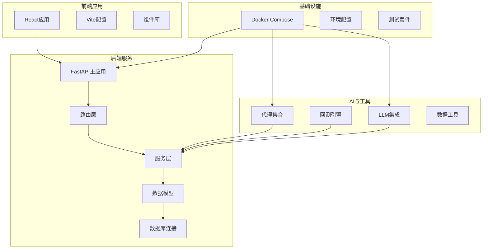

**图表来源**
- [app/backend/main.py:1-56](file://app/backend/main.py#L1-L56)
- [app/backend/routes/__init__.py:1-24](file://app/backend/routes/__init__.py#L1-L24)
- [docker/docker-compose.yml:1-95](file://docker/docker-compose.yml#L1-L95)

**章节来源**
- [app/backend/main.py:1-56](file://app/backend/main.py#L1-L56)
- [app/backend/database/connection.py:1-32](file://app/backend/database/connection.py#L1-L32)
- [docker/docker-compose.yml:1-95](file://docker/docker-compose.yml#L1-L95)

## 核心组件
系统的核心组件包括后端API服务、前端可视化界面、AI代理系统、数据库存储以及容器化部署方案。

### 后端API服务
后端基于FastAPI构建，提供以下核心功能：
- SSE流式响应：支持实时进度更新与结果推送
- 多路由模块：涵盖对冲基金运行、回测、API密钥管理、Ollama集成等
- 数据验证：使用Pydantic模型确保请求参数合法性
- 数据库集成：SQLite持久化与SQLAlchemy ORM

### 前端可视化界面
前端采用React + TypeScript构建，具备以下特性：
- 响应式布局：支持多面板操作界面
- 实时通知：集成Toast通知系统
- 组件化设计：基于Radix UI与Shadcn组件库
- 开发体验：Vite提供快速热重载与TypeScript支持

### AI代理系统
系统集成了多个专业投资顾问代理，包括价值投资、成长投资、技术分析等多个维度，通过LangGraph实现智能体协作与决策制定。

### 数据存储
采用SQLite作为本地数据库，支持以下表结构：
- 对冲基金流程配置表
- 流程执行记录表  
- 执行周期明细表
- API密钥管理表

**章节来源**
- [app/backend/main.py:15-56](file://app/backend/main.py#L15-L56)
- [app/backend/models/schemas.py:1-292](file://app/backend/models/schemas.py#L1-L292)
- [app/backend/database/models.py:1-115](file://app/backend/database/models.py#L1-L115)
- [app/frontend/src/App.tsx:1-12](file://app/frontend/src/App.tsx#L1-L12)

## 架构总览
系统采用微服务化的设计理念，通过Docker容器化部署，实现后端API、AI推理服务、回测引擎等功能模块的独立运行与协同工作。

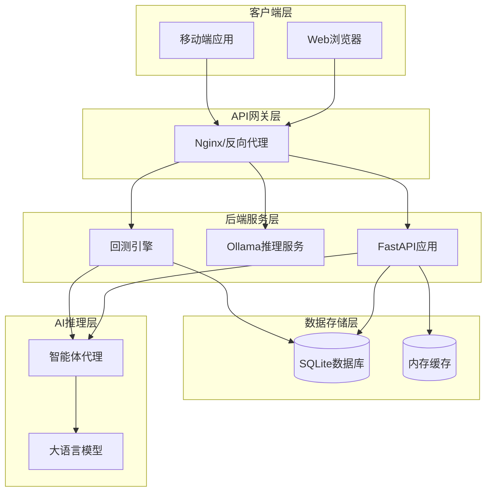

**图表来源**
- [docker/docker-compose.yml:18-95](file://docker/docker-compose.yml#L18-L95)
- [app/backend/main.py:32-56](file://app/backend/main.py#L32-L56)

### 技术栈选择
- **后端框架**：FastAPI（高性能异步Web框架）
- **前端框架**：React + TypeScript + Vite
- **数据库**：SQLite（轻量级本地存储）
- **AI推理**：LangChain + LangGraph + Ollama
- **容器化**：Docker + Docker Compose
- **样式框架**：Tailwind CSS + shadcn/ui
- **开发工具**：Poetry包管理 + ESLint + TypeScript

**章节来源**
- [pyproject.toml:13-41](file://pyproject.toml#L13-L41)
- [app/frontend/package.json:11-35](file://app/frontend/package.json#L11-L35)

## 详细组件分析

### 后端架构组件

#### API路由层
系统采用模块化的路由设计，将不同功能域的API接口分离到独立的路由模块中：

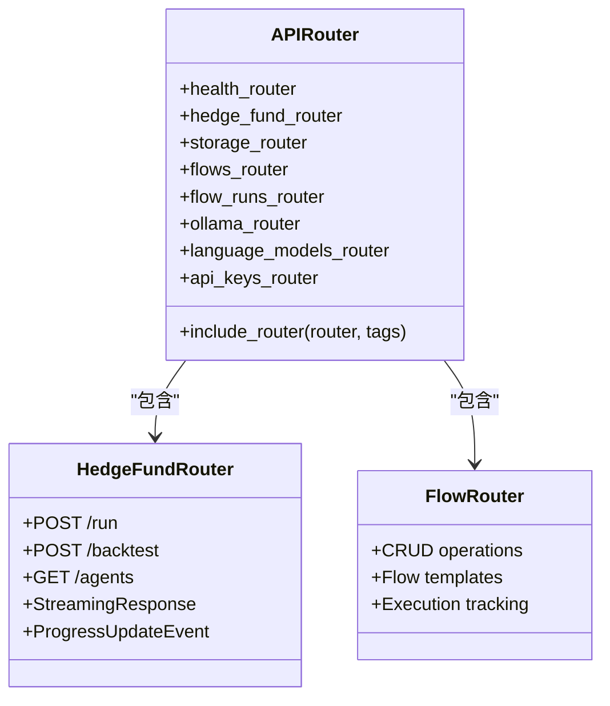

**图表来源**
- [app/backend/routes/__init__.py:13-24](file://app/backend/routes/__init__.py#L13-L24)
- [app/backend/routes/hedge_fund.py:16-353](file://app/backend/routes/hedge_fund.py#L16-L353)

#### 数据模型层
系统使用SQLAlchemy定义了完整的数据模型体系，支持复杂的业务场景：

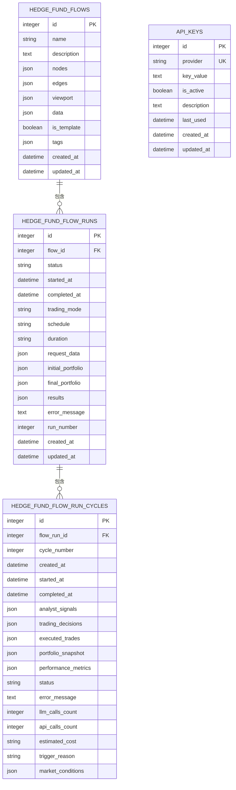

**图表来源**
- [app/backend/database/models.py:6-115](file://app/backend/database/models.py#L6-L115)

#### 业务逻辑层
业务逻辑层实现了核心的交易决策与回测功能：

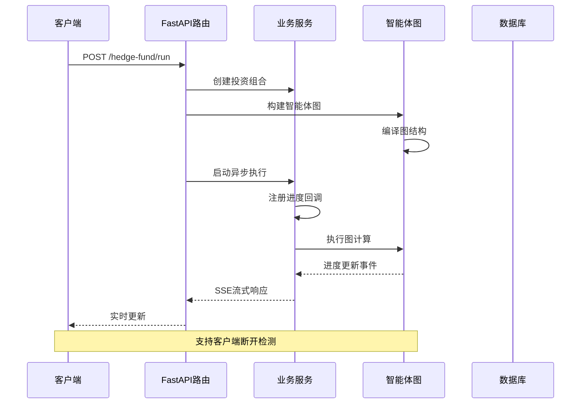

**图表来源**
- [app/backend/routes/hedge_fund.py:26-155](file://app/backend/routes/hedge_fund.py#L26-L155)
- [app/backend/services/portfolio.py:6-52](file://app/backend/services/portfolio.py#L6-L52)

**章节来源**
- [app/backend/routes/hedge_fund.py:18-353](file://app/backend/routes/hedge_fund.py#L18-L353)
- [app/backend/services/portfolio.py:6-52](file://app/backend/services/portfolio.py#L6-L52)

### 前端架构组件

#### 应用结构
前端采用模块化组件设计，支持多面板的复杂工作流界面：

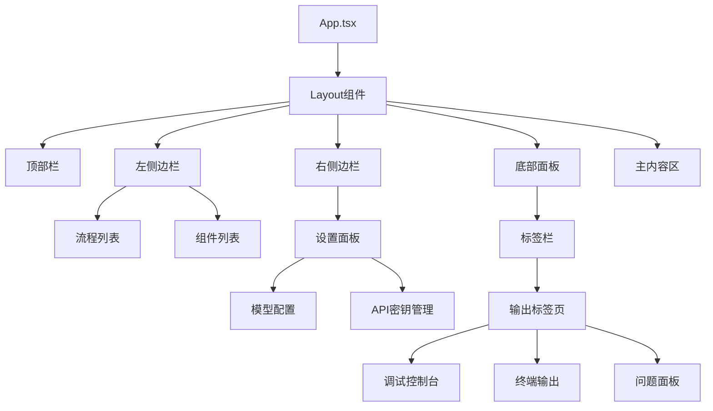

**图表来源**
- [app/frontend/src/App.tsx:1-12](file://app/frontend/src/App.tsx#L1-L12)

#### 组件生态系统
前端集成了丰富的UI组件库，支持现代化的用户界面：

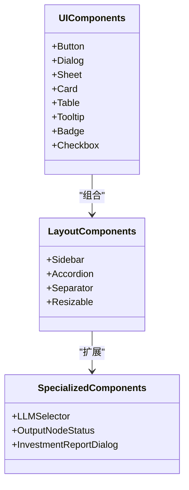

**图表来源**
- [app/frontend/package.json:11-35](file://app/frontend/package.json#L11-L35)

**章节来源**
- [app/frontend/src/App.tsx:1-12](file://app/frontend/src/App.tsx#L1-12)
- [app/frontend/package.json:11-35](file://app/frontend/package.json#L11-L35)

### AI代理系统

#### 智能体状态管理
系统使用LangGraph实现智能体的状态流转与消息传递：

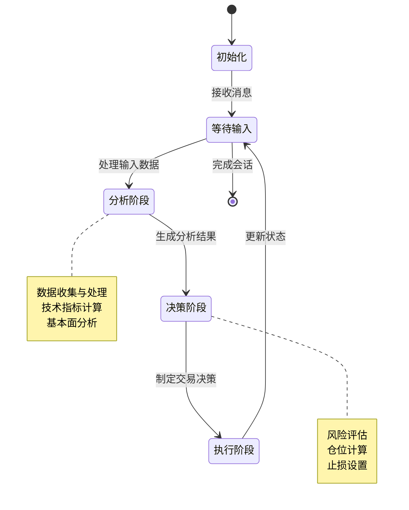

**图表来源**
- [src/graph/state.py:15-52](file://src/graph/state.py#L15-L52)

#### 代理函数封装
系统提供了统一的代理函数封装机制，支持动态代理ID绑定：

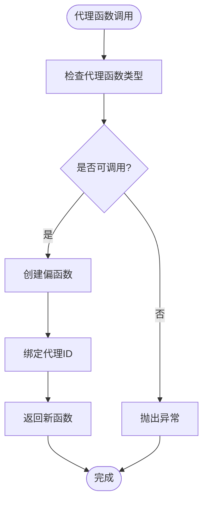

**图表来源**
- [app/backend/services/agent_service.py:5-13](file://app/backend/services/agent_service.py#L5-L13)

**章节来源**
- [src/graph/state.py:15-52](file://src/graph/state.py#L15-L52)
- [app/backend/services/agent_service.py:5-13](file://app/backend/services/agent_service.py#L5-L13)

## 依赖关系分析

### 后端依赖图
系统后端依赖关系清晰，遵循分层架构原则：

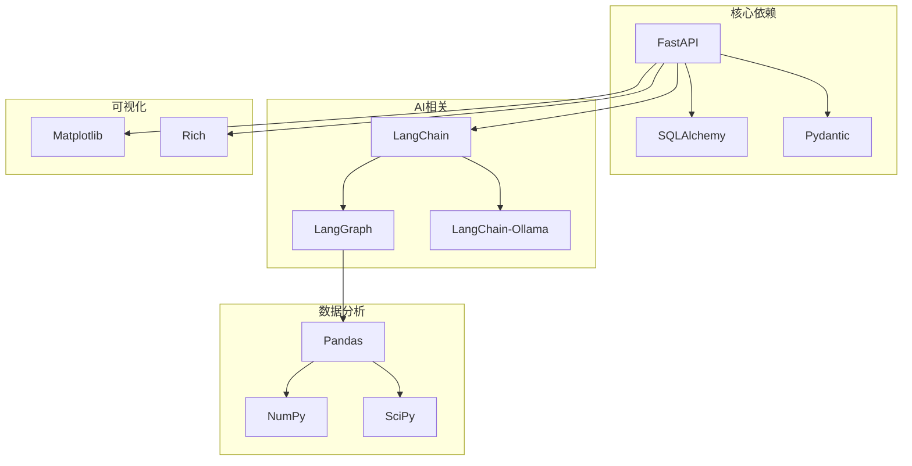

**图表来源**
- [pyproject.toml:13-41](file://pyproject.toml#L13-L41)

### 前端依赖图
前端依赖以React为核心，围绕开发体验和组件生态构建：

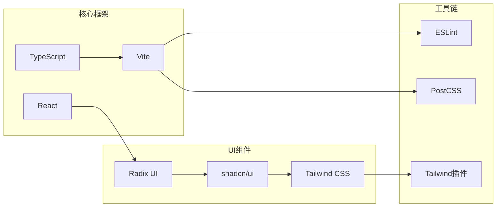

**图表来源**
- [app/frontend/package.json:11-55](file://app/frontend/package.json#L11-L55)

**章节来源**
- [pyproject.toml:13-41](file://pyproject.toml#L13-L41)
- [app/frontend/package.json:11-55](file://app/frontend/package.json#L11-L55)

## 性能考虑

### 后端性能优化
- **异步处理**：使用asyncio实现非阻塞I/O操作
- **流式响应**：通过SSE实现实时进度推送，减少内存占用
- **连接池**：SQLAlchemy连接池优化数据库访问
- **缓存策略**：内存缓存热点数据，减少重复计算

### 前端性能优化
- **代码分割**：按需加载组件，提升首屏加载速度
- **虚拟滚动**：大数据量列表使用虚拟化技术
- **状态管理**：合理划分组件状态，避免不必要的重渲染
- **资源压缩**：生产环境启用代码压缩与图片优化

### 数据库性能
- **索引优化**：为常用查询字段建立索引
- **事务管理**：合理使用事务保证数据一致性
- **查询优化**：避免N+1查询问题
- **连接复用**：使用连接池减少连接开销

## 故障排除指南

### 常见问题诊断
1. **Ollama服务不可用**
   - 检查Ollama容器状态
   - 验证网络端口映射
   - 确认模型下载情况

2. **数据库连接失败**
   - 检查SQLite文件权限
   - 验证数据库路径配置
   - 确认并发连接数限制

3. **SSE连接中断**
   - 检查客户端网络状况
   - 验证服务器超时设置
   - 确认防火墙配置

### 日志监控
系统提供了完善的日志记录机制，包括：
- 启动阶段状态检查
- API请求处理日志
- 错误异常捕获
- 性能指标监控

**章节来源**
- [app/backend/main.py:32-56](file://app/backend/main.py#L32-L56)

## 结论
本AI对冲基金系统通过前后端分离架构实现了高度模块化的设计，后端采用FastAPI提供高性能的API服务，前端使用React构建现代化的可视化界面。系统集成了多智能体AI代理，支持复杂的交易决策流程编排，并通过Docker容器化实现了便捷的部署与扩展。

系统的主要优势包括：
- 清晰的分层架构便于维护与扩展
- 微服务化设计支持独立部署与弹性伸缩
- 实时流式响应提供良好的用户体验
- 完善的数据模型支持复杂的业务场景
- 容器化部署简化运维管理

## 附录

### 部署配置
系统支持多种部署模式：
- 单机部署：适合开发与测试环境
- 容器化部署：支持生产环境的弹性扩展
- 混合部署：结合云服务与本地资源

### 扩展性建议
- **水平扩展**：通过负载均衡实现多实例部署
- **垂直扩展**：增加硬件资源提升单实例性能
- **功能扩展**：模块化设计便于添加新的AI代理
- **数据扩展**：支持从SQLite迁移到更强大的数据库