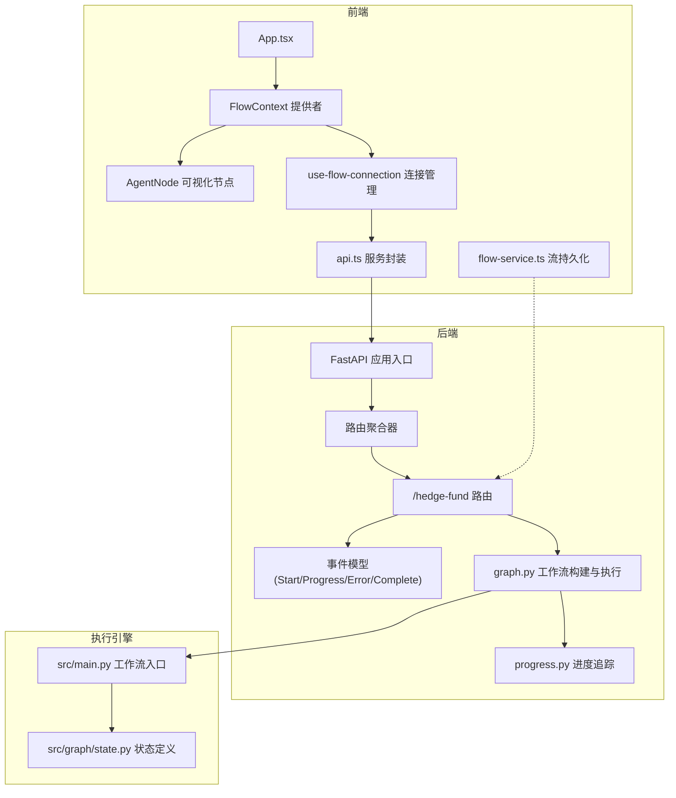
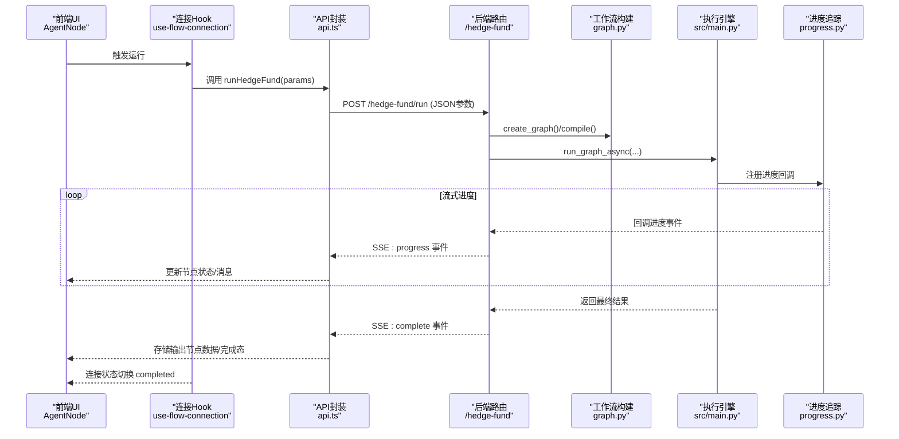
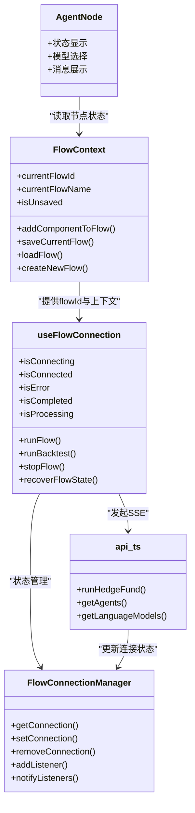
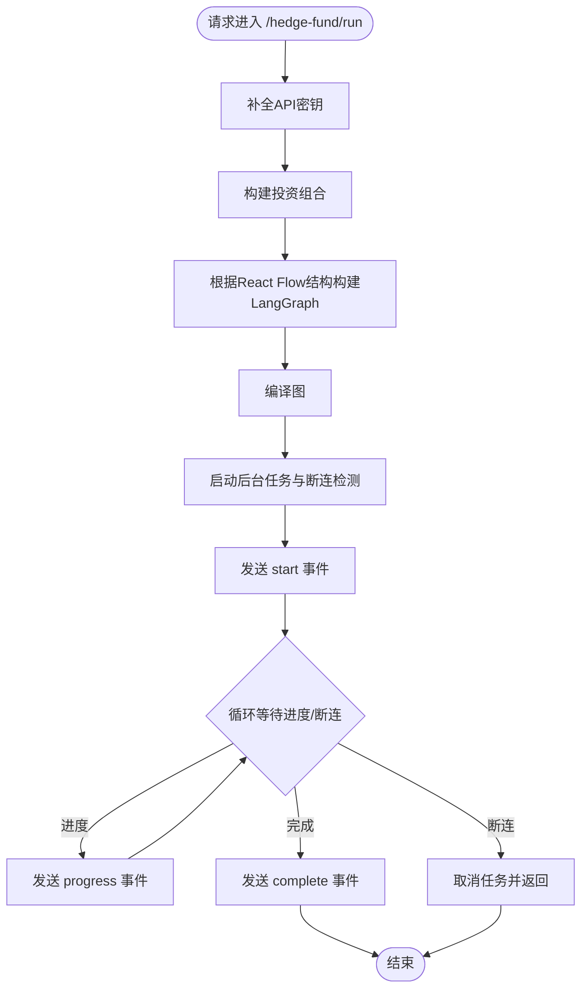
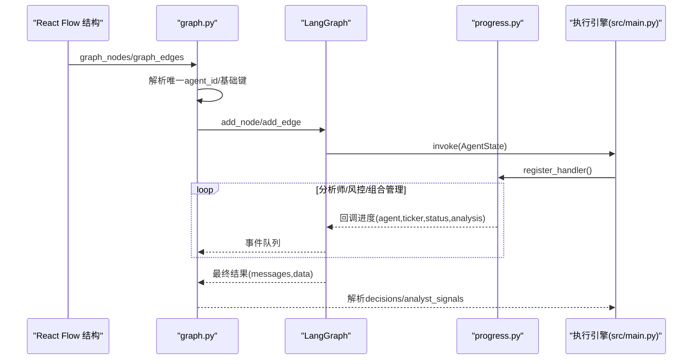
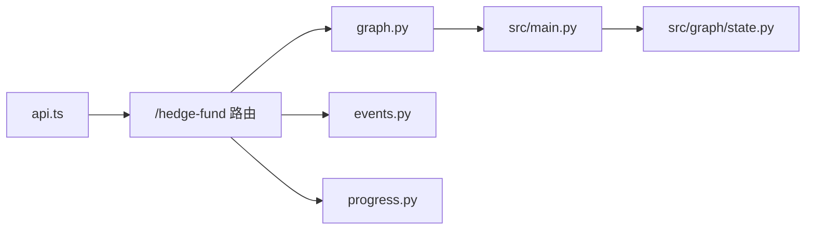

# 组件交互模式

<cite>
**本文引用的文件**
- [app/backend/main.py](file://app/backend/main.py)
- [app/backend/routes/__init__.py](file://app/backend/routes/__init__.py)
- [app/backend/routes/hedge_fund.py](file://app/backend/routes/hedge_fund.py)
- [app/backend/models/events.py](file://app/backend/models/events.py)
- [app/backend/services/graph.py](file://app/backend/services/graph.py)
- [app/backend/services/agent_service.py](file://app/backend/services/agent_service.py)
- [src/main.py](file://src/main.py)
- [src/graph/state.py](file://src/graph/state.py)
- [src/utils/progress.py](file://src/utils/progress.py)
- [app/frontend/src/App.tsx](file://app/frontend/src/App.tsx)
- [app/frontend/src/services/api.ts](file://app/frontend/src/services/api.ts)
- [app/frontend/src/hooks/use-flow-connection.ts](file://app/frontend/src/hooks/use-flow-connection.ts)
- [app/frontend/src/contexts/flow-context.tsx](file://app/frontend/src/contexts/flow-context.tsx)
- [app/frontend/src/nodes/components/agent-node.tsx](file://app/frontend/src/nodes/components/agent-node.tsx)
- [app/frontend/src/services/flow-service.ts](file://app/frontend/src/services/flow-service.ts)
</cite>

## 目录
1. [简介](#简介)
2. [项目结构](#项目结构)
3. [核心组件](#核心组件)
4. [架构总览](#架构总览)
5. [详细组件分析](#详细组件分析)
6. [依赖分析](#依赖分析)
7. [性能考虑](#性能考虑)
8. [故障排查指南](#故障排查指南)
9. [结论](#结论)

## 简介
本文件面向AI对冲基金系统，聚焦“组件交互模式”，系统性阐述前端React组件与后端FastAPI服务之间的交互、工作流引擎与智能体（Agent）的协作、数据层与业务逻辑层的接口，以及消息传递模式、事件驱动机制、状态同步策略、异常处理与错误传播、组件生命周期管理与资源清理等主题。文档通过多类图示帮助开发者快速理解系统动态行为。

## 项目结构
系统采用前后端分离架构：
- 前端：基于React + TypeScript，使用React Flow进行可视化流程编排，通过自定义Hook管理连接状态与节点状态，通过服务层封装API调用。
- 后端：基于FastAPI，提供REST接口与Server-Sent Events（SSE）流式输出；工作流由LangGraph驱动，结合进度追踪模块实现事件驱动的状态更新。
- 核心执行引擎：位于独立Python包中，负责构建工作流、调度智能体、生成交易决策，并通过统一的事件模型向前端推送进度与结果。

图表来源
- [app/backend/main.py:15-30](file://app/backend/main.py#L15-L30)
- [app/backend/routes/__init__.py:12-24](file://app/backend/routes/__init__.py#L12-L24)
- [app/backend/routes/hedge_fund.py:16-353](file://app/backend/routes/hedge_fund.py#L16-L353)
- [app/backend/models/events.py:5-46](file://app/backend/models/events.py#L5-L46)
- [app/backend/services/graph.py:35-130](file://app/backend/services/graph.py#L35-L130)
- [src/main.py:100-130](file://src/main.py#L100-L130)
- [src/graph/state.py:14-19](file://src/graph/state.py#L14-L19)
- [src/utils/progress.py:12-65](file://src/utils/progress.py#L12-L65)
- [app/frontend/src/App.tsx:1-12](file://app/frontend/src/App.tsx#L1-L12)
- [app/frontend/src/services/api.ts:10-309](file://app/frontend/src/services/api.ts#L10-L309)
- [app/frontend/src/hooks/use-flow-connection.ts:18-73](file://app/frontend/src/hooks/use-flow-connection.ts#L18-L73)
- [app/frontend/src/services/flow-service.ts:27-108](file://app/frontend/src/services/flow-service.ts#L27-L108)

章节来源
- [app/backend/main.py:15-30](file://app/backend/main.py#L15-L30)
- [app/backend/routes/__init__.py:12-24](file://app/backend/routes/__init__.py#L12-L24)
- [app/frontend/src/App.tsx:1-12](file://app/frontend/src/App.tsx#L1-L12)

## 核心组件
- 前端应用与上下文
  - 应用根组件负责布局与全局提示器渲染。
  - FlowContext提供流程的创建、保存、加载与节点状态隔离。
  - useFlowConnection集中管理SSE连接状态、启动/停止执行、错误恢复。
  - AgentNode用于展示单个智能体节点的状态、消息与模型选择。
  - flow-service封装流的CRUD操作，便于持久化与模板化复用。
- 后端服务与路由
  - FastAPI应用注册CORS、数据库表初始化、路由聚合。
  - /hedge-fund路由提供SSE流式执行、回测流式执行、智能体列表查询。
  - 事件模型定义了start/progress/error/complete四种SSE事件类型。
  - graph.py负责从React Flow结构构建LangGraph工作流并异步执行。
- 执行引擎
  - src/main.py定义工作流入口、节点连接关系与最终决策解析。
  - src/graph/state.py定义AgentState的messages/data/metadata三段式状态。
  - src/utils/progress.py提供全局进度追踪与回调分发，支持CLI与SSE双场景。

章节来源
- [app/frontend/src/App.tsx:1-12](file://app/frontend/src/App.tsx#L1-L12)
- [app/frontend/src/contexts/flow-context.tsx:35-358](file://app/frontend/src/contexts/flow-context.tsx#L35-L358)
- [app/frontend/src/hooks/use-flow-connection.ts:80-250](file://app/frontend/src/hooks/use-flow-connection.ts#L80-L250)
- [app/frontend/src/nodes/components/agent-node.tsx:18-148](file://app/frontend/src/nodes/components/agent-node.tsx#L18-L148)
- [app/frontend/src/services/flow-service.ts:27-108](file://app/frontend/src/services/flow-service.ts#L27-L108)
- [app/backend/main.py:15-56](file://app/backend/main.py#L15-L56)
- [app/backend/routes/hedge_fund.py:16-353](file://app/backend/routes/hedge_fund.py#L16-L353)
- [app/backend/models/events.py:5-46](file://app/backend/models/events.py#L5-L46)
- [app/backend/services/graph.py:35-193](file://app/backend/services/graph.py#L35-L193)
- [src/main.py:100-130](file://src/main.py#L100-L130)
- [src/graph/state.py:14-19](file://src/graph/state.py#L14-L19)
- [src/utils/progress.py:12-65](file://src/utils/progress.py#L12-L65)

## 架构总览
系统采用“前端可视化编排 + 后端SSE流式执行 + 执行引擎工作流”的三层交互模式：
- 前端通过useFlowConnection触发执行，api.ts封装SSE连接与事件解析。
- 后端/hedge-fund路由接收请求，构建LangGraph并启动异步任务，通过事件队列与disconnect检测实现SSE流。
- 执行引擎在src/main.py中组织智能体节点，通过progress回调将中间状态推送到后端事件队列，最终以Complete事件返回结果。

图表来源
- [app/frontend/src/hooks/use-flow-connection.ts:114-148](file://app/frontend/src/hooks/use-flow-connection.ts#L114-L148)
- [app/frontend/src/services/api.ts:87-309](file://app/frontend/src/services/api.ts#L87-L309)
- [app/backend/routes/hedge_fund.py:26-155](file://app/backend/routes/hedge_fund.py#L26-L155)
- [app/backend/services/graph.py:132-177](file://app/backend/services/graph.py#L132-L177)
- [src/main.py:100-130](file://src/main.py#L100-L130)
- [src/utils/progress.py:22-65](file://src/utils/progress.py#L22-L65)

## 详细组件分析

### 前端组件与状态管理
- FlowContext
  - 负责流程的创建、保存、加载与视口适配；在保存时收集节点内部状态并写入flow.data，确保不同流程间状态隔离。
  - 在加载流程时设置当前flowId，使节点状态钩子按flow维度隔离。
- useFlowConnection
  - 全局连接管理器维护每个flowId的连接状态（idle/connecting/connected/error/completed），并提供监听通知。
  - runFlow调用api.runHedgeFund，传入节点上下文与flowId，以便SSE事件映射到具体节点。
  - 支持手动停止：调用abortController中断SSE，同时重置节点状态。
- api.ts
  - 封装SSE连接，解析start/progress/complete/error四类事件，分别更新节点状态、存储输出数据、标记完成或错误。
  - 对断流与异常进行兜底：若读取流异常或AbortError，统一标记错误并清理连接状态。
- AgentNode
  - 展示节点状态、消息与模型选择；与NodeContext联动，持久化模型配置到节点状态。

图表来源
- [app/frontend/src/contexts/flow-context.tsx:35-358](file://app/frontend/src/contexts/flow-context.tsx#L35-L358)
- [app/frontend/src/hooks/use-flow-connection.ts:18-73](file://app/frontend/src/hooks/use-flow-connection.ts#L18-L73)
- [app/frontend/src/hooks/use-flow-connection.ts:80-250](file://app/frontend/src/hooks/use-flow-connection.ts#L80-L250)
- [app/frontend/src/services/api.ts:10-309](file://app/frontend/src/services/api.ts#L10-L309)
- [app/frontend/src/nodes/components/agent-node.tsx:18-148](file://app/frontend/src/nodes/components/agent-node.tsx#L18-L148)

章节来源
- [app/frontend/src/contexts/flow-context.tsx:35-358](file://app/frontend/src/contexts/flow-context.tsx#L35-L358)
- [app/frontend/src/hooks/use-flow-connection.ts:80-250](file://app/frontend/src/hooks/use-flow-connection.ts#L80-L250)
- [app/frontend/src/services/api.ts:10-309](file://app/frontend/src/services/api.ts#L10-L309)
- [app/frontend/src/nodes/components/agent-node.tsx:18-148](file://app/frontend/src/nodes/components/agent-node.tsx#L18-L148)

### 后端路由与事件驱动
- /hedge-fund/run
  - 接收HedgeFundRequest，自动补全API密钥，构建Portfolio，根据React Flow结构创建LangGraph并编译。
  - 使用asyncio.Queue与progress.register_handler建立事件通道；wait_for_disconnect检测客户端断开。
  - 通过StreamingResponse以SSE格式发送start/progress/error/complete事件。
- 事件模型
  - StartEvent：开始执行。
  - ProgressUpdateEvent：进度更新，携带agent/ticker/status/analysis/timestamp。
  - ErrorEvent：错误信息。
  - CompleteEvent：最终结果，包含decisions/analyst_signals/current_prices等。
- 异常处理
  - 捕获HTTPException原样抛出；其他异常转换为500并返回统一错误响应。

图表来源
- [app/backend/routes/hedge_fund.py:26-155](file://app/backend/routes/hedge_fund.py#L26-L155)
- [app/backend/models/events.py:16-46](file://app/backend/models/events.py#L16-L46)

章节来源
- [app/backend/routes/hedge_fund.py:26-155](file://app/backend/routes/hedge_fund.py#L26-L155)
- [app/backend/models/events.py:16-46](file://app/backend/models/events.py#L16-L46)

### 工作流引擎与智能体协作
- 工作流构建
  - graph.py从React Flow节点/边提取唯一agent_id，映射到基础agent键（如warren_buffett），并为每个portfolio_manager生成唯一risk_management_agent。
  - 连接规则：start_node → 无入边的分析师节点；分析师 → 风控（经由对应risk_management_agent）；风控 → 组合管理；组合管理 → END。
- 执行与状态
  - src/main.py的create_workflow定义节点与边；run_hedge_fund作为入口，将输入数据注入AgentState，最终解析决策。
  - src/graph/state.py定义messages/data/metadata三段式状态，支持消息累积与字典合并。
  - progress.py提供全局回调注册/注销与刷新显示，既可用于CLI也可用于SSE事件推送。

图表来源
- [app/backend/services/graph.py:35-130](file://app/backend/services/graph.py#L35-L130)
- [app/backend/services/graph.py:141-177](file://app/backend/services/graph.py#L141-L177)
- [src/main.py:100-130](file://src/main.py#L100-L130)
- [src/graph/state.py:14-19](file://src/graph/state.py#L14-L19)
- [src/utils/progress.py:22-65](file://src/utils/progress.py#L22-L65)

章节来源
- [app/backend/services/graph.py:35-130](file://app/backend/services/graph.py#L35-L130)
- [app/backend/services/graph.py:141-177](file://app/backend/services/graph.py#L141-L177)
- [src/main.py:100-130](file://src/main.py#L100-L130)
- [src/graph/state.py:14-19](file://src/graph/state.py#L14-L19)
- [src/utils/progress.py:22-65](file://src/utils/progress.py#L22-L65)

### 数据层与业务逻辑层接口
- 数据层
  - 后端数据库连接与模型定义位于app/backend/database，路由层通过Depends注入Session。
- 业务逻辑层
  - /hedge-fund路由承担编排职责：Hydrate API Keys、构建Portfolio、创建Graph、启动异步任务、SSE事件分发。
  - graph.py封装LangGraph构建与执行，提供异步包装run_graph_async。
  - progress.py提供跨组件的进度回调机制，实现事件驱动的状态同步。

章节来源
- [app/backend/routes/hedge_fund.py:6-14](file://app/backend/routes/hedge_fund.py#L6-L14)
- [app/backend/services/graph.py:132-138](file://app/backend/services/graph.py#L132-L138)
- [src/utils/progress.py:22-65](file://src/utils/progress.py#L22-L65)

## 依赖分析
- 组件内聚与耦合
  - 前端：useFlowConnection与api.ts高度耦合，共同负责SSE生命周期；FlowContext与NodeContext解耦，前者专注流程，后者专注节点状态。
  - 后端：/hedge-fund路由是编排中心，依赖graph.py与progress.py；事件模型与SSE解耦，便于扩展新事件类型。
  - 执行引擎：src/main.py仅关注工作流入口与节点连接，状态定义与进度追踪通过外部模块注入。
- 外部依赖
  - FastAPI/CORS/SQLAlchemy/AsyncIO用于后端；React Flow用于前端可视化；LangGraph用于工作流编排。

图表来源
- [app/frontend/src/services/api.ts:10-309](file://app/frontend/src/services/api.ts#L10-L309)
- [app/backend/routes/hedge_fund.py:26-155](file://app/backend/routes/hedge_fund.py#L26-L155)
- [app/backend/services/graph.py:35-130](file://app/backend/services/graph.py#L35-L130)
- [app/backend/models/events.py:5-46](file://app/backend/models/events.py#L5-L46)
- [src/main.py:100-130](file://src/main.py#L100-L130)
- [src/graph/state.py:14-19](file://src/graph/state.py#L14-L19)

章节来源
- [app/frontend/src/services/api.ts:10-309](file://app/frontend/src/services/api.ts#L10-L309)
- [app/backend/routes/hedge_fund.py:26-155](file://app/backend/routes/hedge_fund.py#L26-L155)
- [app/backend/services/graph.py:35-130](file://app/backend/services/graph.py#L35-L130)
- [app/backend/models/events.py:5-46](file://app/backend/models/events.py#L5-L46)
- [src/main.py:100-130](file://src/main.py#L100-L130)
- [src/graph/state.py:14-19](file://src/graph/state.py#L14-L19)

## 性能考虑
- 异步与并发
  - 后端使用asyncio.create_task与wait_for_disconnect，避免阻塞事件循环；SSE流式输出降低内存峰值。
  - graph.py通过run_in_executor将同步执行放入线程池，不阻塞事件循环。
- 进度与事件
  - progress.py使用回调分发，避免轮询；事件队列按需消费，减少CPU占用。
- 前端渲染
  - useFlowConnection仅在连接状态变化时强制更新，避免频繁重渲染；节点状态持久化于use-node-state，按flowId隔离，减少全局状态抖动。

章节来源
- [app/backend/routes/hedge_fund.py:78-155](file://app/backend/routes/hedge_fund.py#L78-L155)
- [app/backend/services/graph.py:132-138](file://app/backend/services/graph.py#L132-L138)
- [src/utils/progress.py:22-65](file://src/utils/progress.py#L22-L65)

## 故障排查指南
- 前端SSE问题
  - 若出现“连接失败/断流”，检查api.ts中的AbortController与use-flow-connection的stopFlow是否被调用；确认flowConnectionManager状态已切换至error/idle。
  - 若complete事件未到达，检查后端事件生成器是否正常结束；必要时在前端读取完成后主动清理连接。
- 后端异常
  - /hedge-fund路由捕获HTTPException并透传；其他异常转为500与统一错误响应。查看后端日志定位具体异常点。
  - 断连检测：当request.receive()收到http.disconnect时，立即取消任务并清理资源。
- 执行引擎
  - 若parse_hedge_fund_response失败，检查最终消息内容是否为合法JSON字符串；必要时开启show_reasoning以辅助诊断。

章节来源
- [app/frontend/src/services/api.ts:280-295](file://app/frontend/src/services/api.ts#L280-L295)
- [app/backend/routes/hedge_fund.py:100-155](file://app/backend/routes/hedge_fund.py#L100-L155)
- [src/main.py:30-43](file://src/main.py#L30-L43)

## 结论
本系统通过“前端可视化编排 + 后端SSE事件驱动 + 执行引擎工作流”的模式实现了清晰的组件边界与高内聚低耦合的交互。SSE事件模型与进度回调机制保证了状态同步与可观测性；连接管理器与节点状态隔离确保了复杂流程下的可维护性。建议后续在以下方面持续优化：
- 完善事件类型与错误码的标准化文档；
- 在后端增加更细粒度的超时与重试策略；
- 前端增强断流自动重连与本地缓存恢复能力。