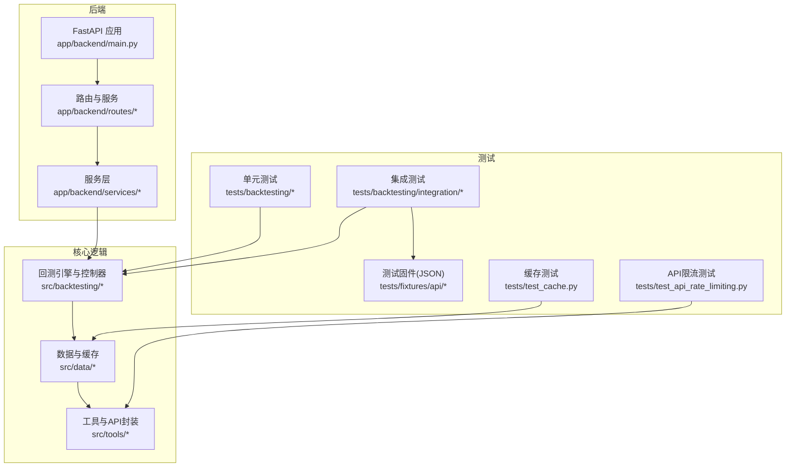
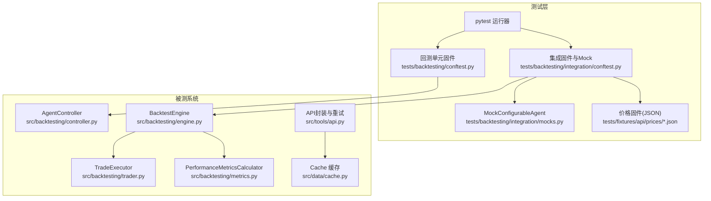
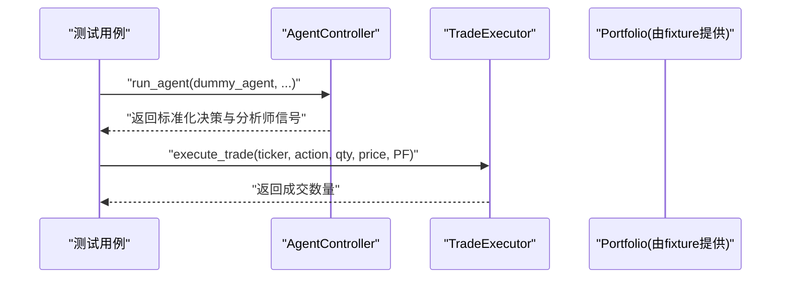
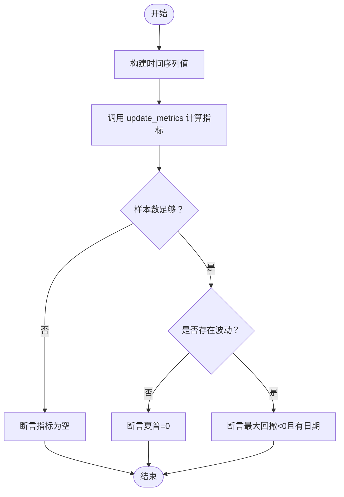
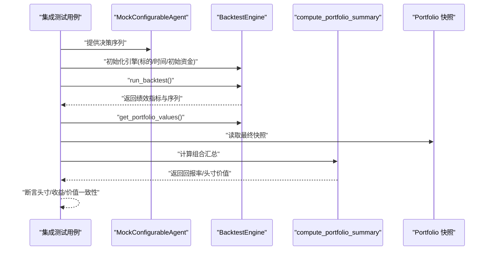
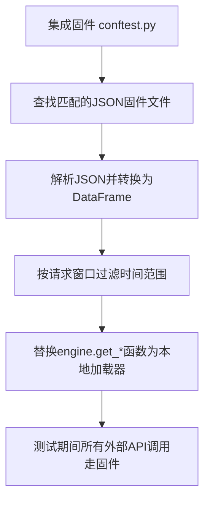
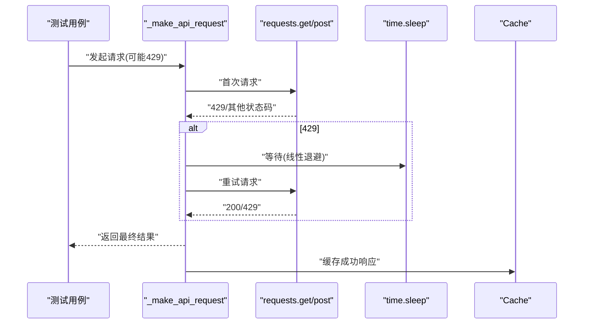
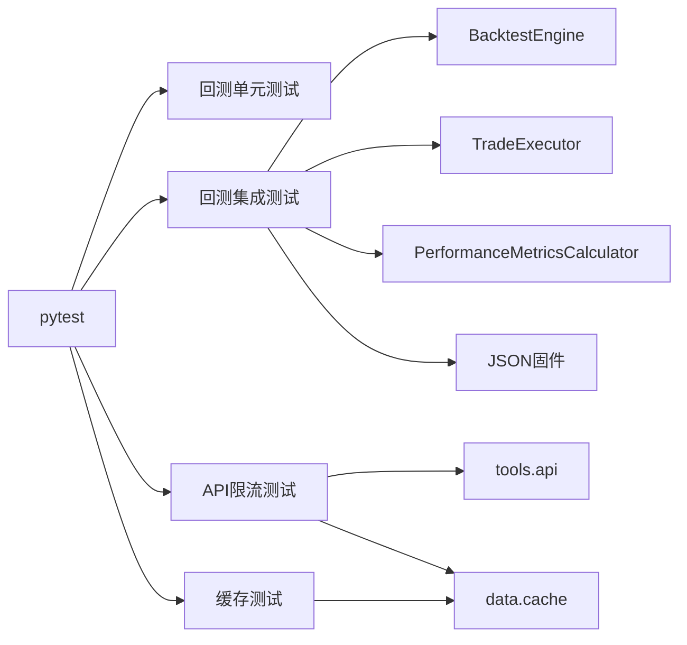

# 测试策略

<cite>
**本文引用的文件**
- [pyproject.toml](file://pyproject.toml)
- [app/backend/main.py](file://app/backend/main.py)
- [tests/backtesting/conftest.py](file://tests/backtesting/conftest.py)
- [tests/backtesting/integration/conftest.py](file://tests/backtesting/integration/conftest.py)
- [tests/backtesting/integration/mocks.py](file://tests/backtesting/integration/mocks.py)
- [tests/backtesting/integration/test_integration_long_only.py](file://tests/backtesting/integration/test_integration_long_only.py)
- [tests/backtesting/test_controller.py](file://tests/backtesting/test_controller.py)
- [tests/backtesting/test_execution.py](file://tests/backtesting/test_execution.py)
- [tests/backtesting/test_metrics.py](file://tests/backtesting/test_metrics.py)
- [tests/fixtures/api/prices/AAPL_2024-03-01_2024-03-08.json](file://tests/fixtures/api/prices/AAPL_2024-03-01_2024-03-08.json)
- [tests/test_api_rate_limiting.py](file://tests/test_api_rate_limiting.py)
- [tests/test_cache.py](file://tests/test_cache.py)
</cite>

## 目录
1. [引言](#引言)
2. [项目结构](#项目结构)
3. [核心组件](#核心组件)
4. [架构总览](#架构总览)
5. [详细组件分析](#详细组件分析)
6. [依赖分析](#依赖分析)
7. [性能考虑](#性能考虑)
8. [故障排查指南](#故障排查指南)
9. [结论](#结论)
10. [附录](#附录)

## 引言
本测试策略文档面向开发者与测试工程师，系统化梳理本项目的单元测试、集成测试与端到端测试设计原则与实施方法。重点覆盖：
- 测试框架与配置（pytest）
- Mock 对象与测试数据管理（fixtures、JSON 固件）
- 回测系统、API 接口与缓存模块的测试策略
- 性能测试、压力测试与回归测试的执行流程建议
- 测试覆盖率分析、持续集成与自动化测试配置指南
- 最佳实践、调试技巧与测试维护策略

## 项目结构
项目采用前后端分离与多子系统的组织方式：后端基于 FastAPI 提供 API；前端为 React/Vite 应用；核心交易回测与数据处理位于 src/v2 与 tests 下。测试体系以 pytest 为核心，按功能域划分单元与集成测试，并通过固件与 Mock 实现可控的外部依赖隔离。

图表来源
- [app/backend/main.py:1-56](file://app/backend/main.py#L1-L56)
- [tests/backtesting/integration/conftest.py:1-129](file://tests/backtesting/integration/conftest.py#L1-L129)
- [tests/fixtures/api/prices/AAPL_2024-03-01_2024-03-08.json:1-65](file://tests/fixtures/api/prices/AAPL_2024-03-01_2024-03-08.json#L1-L65)

章节来源
- [pyproject.toml:1-62](file://pyproject.toml#L1-L62)
- [app/backend/main.py:1-56](file://app/backend/main.py#L1-L56)

## 核心组件
- 测试框架与运行环境：使用 pytest 作为测试运行器，配合 fixtures、monkeypatch 等机制实现可复用的测试上下文与外部依赖替换。
- 回测系统测试：围绕 AgentController、TradeExecutor、PerformanceMetricsCalculator 与 BacktestEngine 的行为进行断言，结合 JSON 固件模拟真实市场数据。
- API 与缓存测试：验证 API 请求在 429 限流下的重试与退避策略，以及 Cache 的去重与合并逻辑。
- 前端测试：当前仓库未包含前端测试文件，建议后续补充（见“附录”）。

章节来源
- [pyproject.toml:42-47](file://pyproject.toml#L42-L47)
- [tests/backtesting/conftest.py:1-27](file://tests/backtesting/conftest.py#L1-L27)
- [tests/backtesting/integration/conftest.py:1-129](file://tests/backtesting/integration/conftest.py#L1-L129)
- [tests/test_api_rate_limiting.py:1-249](file://tests/test_api_rate_limiting.py#L1-L249)
- [tests/test_cache.py:1-159](file://tests/test_cache.py#L1-L159)

## 架构总览
下图展示测试与被测系统的交互关系，突出测试中对外部依赖的替换与固定输入。

图表来源
- [tests/backtesting/conftest.py:1-27](file://tests/backtesting/conftest.py#L1-L27)
- [tests/backtesting/integration/conftest.py:1-129](file://tests/backtesting/integration/conftest.py#L1-L129)
- [tests/backtesting/integration/mocks.py:1-47](file://tests/backtesting/integration/mocks.py#L1-L47)
- [tests/fixtures/api/prices/AAPL_2024-03-01_2024-03-08.json:1-65](file://tests/fixtures/api/prices/AAPL_2024-03-01_2024-03-08.json#L1-L65)

## 详细组件分析

### 单元测试：回测控制器与交易执行
- 目标：验证 AgentController 的决策归一化、快照生成与默认持有策略；验证 TradeExecutor 的动作路由与边界条件。
- 关键断言：
  - 决策字典对所有标的进行归一化，缺失标的默认持有/零数量。
  - 执行 buy/sell/short/cover 动作的数量与方向正确。
  - 零量、负量、未知动作应返回 0 并不改变状态。

图表来源
- [tests/backtesting/test_controller.py:1-36](file://tests/backtesting/test_controller.py#L1-L36)
- [tests/backtesting/test_execution.py:1-28](file://tests/backtesting/test_execution.py#L1-L28)
- [tests/backtesting/conftest.py:6-27](file://tests/backtesting/conftest.py#L6-L27)

章节来源
- [tests/backtesting/test_controller.py:1-36](file://tests/backtesting/test_controller.py#L1-L36)
- [tests/backtesting/test_execution.py:1-28](file://tests/backtesting/test_execution.py#L1-L28)
- [tests/backtesting/conftest.py:1-27](file://tests/backtesting/conftest.py#L1-L27)

### 单元测试：性能指标计算
- 目标：验证 PerformanceMetricsCalculator 在不同序列长度与波动性下的指标更新行为。
- 关键断言：
  - 数据不足时不应更新夏普/索提诺/最大回撤。
  - 存在波动时应产生非零最大回撤与日期字段。
  - 恒定净值应得到零夏普比率。

图表来源
- [tests/backtesting/test_metrics.py:1-53](file://tests/backtesting/test_metrics.py#L1-L53)

章节来源
- [tests/backtesting/test_metrics.py:1-53](file://tests/backtesting/test_metrics.py#L1-L53)

### 集成测试：回测引擎与Mock代理
- 目标：通过 MockConfigurableAgent 预设交易序列，驱动 BacktestEngine 完整跑通一次或多轮长仓策略，验证头寸、已实现收益、成本基础与组合汇总一致性。
- 关键断言：
  - 多轮买卖/完全清仓后，最终头寸为零且已实现收益非零。
  - 组合汇总中的回报率与总价值等于现金加头寸价值。
  - 不同再平衡路径下，头寸分布与最小持仓占比满足预期。

图表来源
- [tests/backtesting/integration/test_integration_long_only.py:1-403](file://tests/backtesting/integration/test_integration_long_only.py#L1-L403)
- [tests/backtesting/integration/mocks.py:1-47](file://tests/backtesting/integration/mocks.py#L1-L47)

章节来源
- [tests/backtesting/integration/test_integration_long_only.py:1-403](file://tests/backtesting/integration/test_integration_long_only.py#L1-L403)
- [tests/backtesting/integration/mocks.py:1-47](file://tests/backtesting/integration/mocks.py#L1-L47)

### 测试固件与数据管理
- 固件定位：通过 pytest fixtures 提供可复用的 Portfolio、价格字典与 DataFrame 工厂；在集成测试中通过 monkeypatch 将外部 API 替换为本地 JSON 固件加载器。
- 固件内容：价格、财务指标、新闻、大股东交易等 JSON 文件，按“标的_起始_结束”的命名规则组织，便于按时间窗口匹配与裁剪。
- 使用方式：集成固件自动注入，替换 engine 层的 get_* 函数，确保测试稳定且可重复。

图表来源
- [tests/backtesting/integration/conftest.py:14-129](file://tests/backtesting/integration/conftest.py#L14-L129)
- [tests/fixtures/api/prices/AAPL_2024-03-01_2024-03-08.json:1-65](file://tests/fixtures/api/prices/AAPL_2024-03-01_2024-03-08.json#L1-L65)

章节来源
- [tests/backtesting/integration/conftest.py:1-129](file://tests/backtesting/integration/conftest.py#L1-L129)
- [tests/fixtures/api/prices/AAPL_2024-03-01_2024-03-08.json:1-65](file://tests/fixtures/api/prices/AAPL_2024-03-01_2024-03-08.json#L1-L65)

### API 限流与重试测试
- 目标：验证 _make_api_request 在 429 限流下的线性退避重试、最大重试次数控制与成功路径；同时验证 POST 方法与缓存集成。
- 关键断言：
  - 单次/多次 429 后最终成功或达到最大重试次数。
  - 非 429 错误直接透传，不触发重试。
  - 成功响应写入缓存，缓存命中返回一致结果。

图表来源
- [tests/test_api_rate_limiting.py:1-249](file://tests/test_api_rate_limiting.py#L1-L249)

章节来源
- [tests/test_api_rate_limiting.py:1-249](file://tests/test_api_rate_limiting.py#L1-L249)

### 缓存模块测试
- 目标：验证 Cache 的单例获取、不同数据类型的去重与合并、键空间独立性。
- 关键断言：
  - 初始化后各类型数据均返回 None。
  - 全局 get_cache 返回同一实例。
  - set/get 正确，按时间/报告期/披露日期等键去重，不覆盖已有值。

章节来源
- [tests/test_cache.py:1-159](file://tests/test_cache.py#L1-L159)

## 依赖分析
- 测试框架：pytest 作为核心运行器，配合 fixtures、monkeypatch、parametrize 等能力。
- 被测模块耦合：
  - BacktestEngine 依赖 TradeExecutor、PerformanceMetricsCalculator、Portfolio。
  - engine 层通过 monkeypatch 注入的固件替代外部 API。
  - API 与缓存模块相互协作，API 结果写入缓存，减少外部依赖。
- 可能的循环依赖：当前测试未发现直接循环导入；建议在新增组件时避免在测试中引入生产依赖链路。

图表来源
- [pyproject.toml:42-47](file://pyproject.toml#L42-L47)
- [tests/backtesting/integration/conftest.py:107-129](file://tests/backtesting/integration/conftest.py#L107-L129)

章节来源
- [pyproject.toml:42-47](file://pyproject.toml#L42-L47)

## 性能考虑
- 单元测试：保持小而快，避免网络与磁盘 IO；通过 fixtures 与 monkeypatch 控制外部依赖。
- 集成测试：使用 JSON 固件与有限时间窗口，缩短执行时间；必要时拆分大用例为多个小用例。
- 性能测试与压力测试建议：
  - 使用 pytest-benchmark 或 locust 进行基准与并发测试（需在 dev 依赖中添加相应包）。
  - 对回测引擎增加大数据量场景的回归用例，关注内存占用与时间复杂度。
  - 对 API 限流与缓存策略进行吞吐与延迟评估。
- 回归测试：在每次重大改动后运行全量测试集，确保核心路径（回测、API、缓存）稳定。

## 故障排查指南
- 外部 API 不可用或不稳定：
  - 确认集成固件是否正确注入 monkeypatch。
  - 检查 JSON 固件文件名与日期范围是否匹配请求窗口。
- 429 重试异常：
  - 核对最大重试次数与退避参数；确认非 429 错误未被错误地重试。
  - 验证缓存写入与读取逻辑。
- 缓存数据不一致：
  - 检查去重键字段是否正确；确认合并逻辑不覆盖已有值。
- 回测结果异常：
  - 核对 MockConfigurableAgent 的决策序列与标的列表一致性。
  - 检查组合汇总计算与头寸成本基础的更新逻辑。

章节来源
- [tests/backtesting/integration/conftest.py:107-129](file://tests/backtesting/integration/conftest.py#L107-L129)
- [tests/test_api_rate_limiting.py:1-249](file://tests/test_api_rate_limiting.py#L1-L249)
- [tests/test_cache.py:1-159](file://tests/test_cache.py#L1-L159)

## 结论
本项目的测试策略以 pytest 为核心，通过 fixtures 与 monkeypatch 将外部依赖本地化，结合 JSON 固件实现稳定的集成测试；针对回测、API 与缓存的关键路径建立了覆盖良好的单元与集成测试。建议在后续迭代中完善前端测试、引入性能与压力测试工具，并建立自动化流水线以保障回归质量。

## 附录
- 持续集成与自动化测试配置建议
  - 在 CI 中安装开发依赖（pytest、pytest-benchmark、pytest-cov 等），设置并行执行与失败快速停止。
  - 分层运行：先运行单元测试，再运行集成测试，最后运行 API/缓存专项测试。
  - 代码覆盖率：启用覆盖率统计，设定阈值并定期审查未覆盖路径。
  - 前端测试：在前端目录中引入 vitest/jest，覆盖组件与服务层调用。
- 测试最佳实践
  - 用例命名清晰，断言明确；优先断言业务语义而非实现细节。
  - 使用 parametrize 扩展边界条件；用 fixtures 抽象公共状态。
  - 对易变外部依赖一律使用 Mock 或固件替换。
  - 保持测试独立性，避免共享状态污染。
- 调试技巧
  - 使用 pytest --pdb 快速定位失败点。
  - 在集成测试中打印关键中间状态（如每日头寸、已实现收益）辅助排错。
  - 对 API 限流测试使用更短的退避间隔以加速调试。