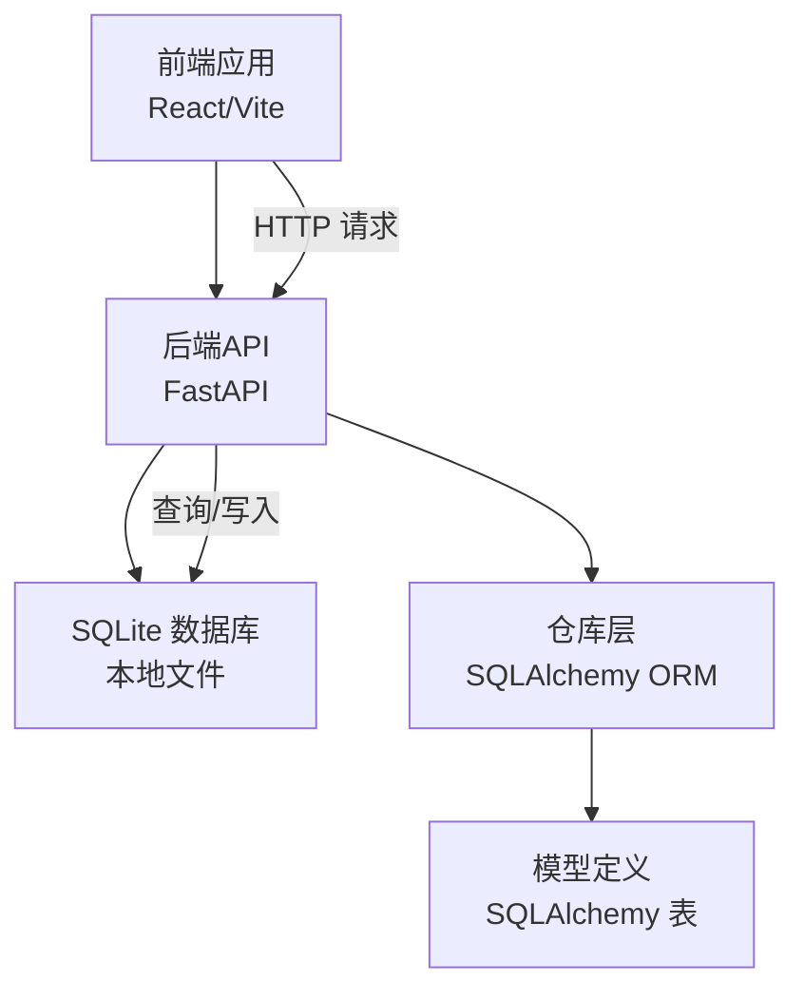
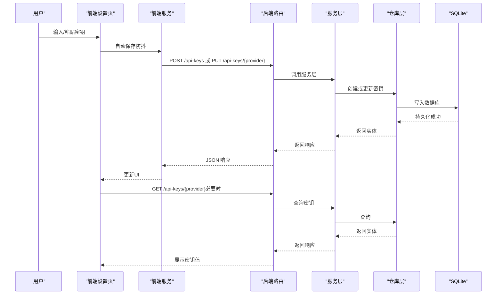
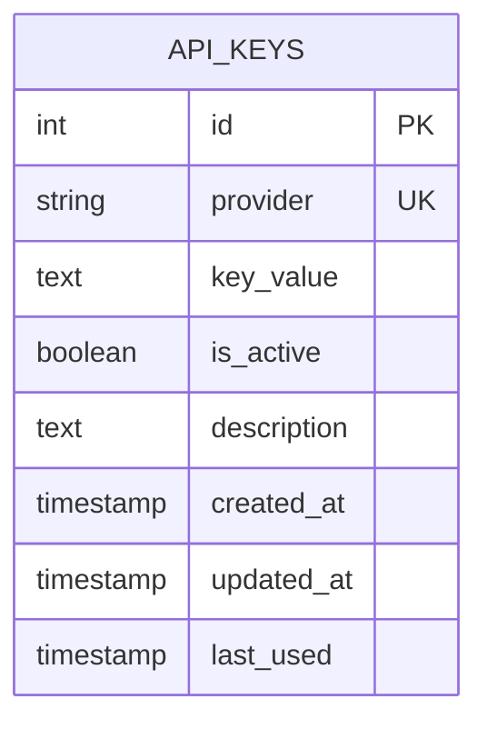
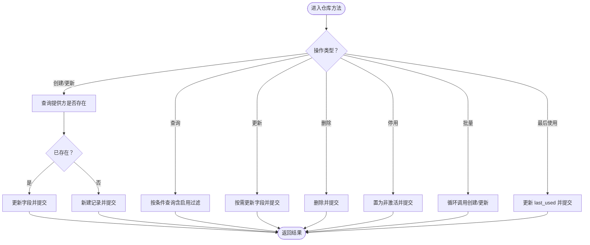

# 安全合规

<cite>
**本文引用的文件**
- [app/backend/database/models.py](file://app/backend/database/models.py)
- [app/backend/database/connection.py](file://app/backend/database/connection.py)
- [app/backend/alembic/versions/add_api_keys_table.py](file://app/backend/alembic/versions/add_api_keys_table.py)
- [app/backend/repositories/api_key_repository.py](file://app/backend/repositories/api_key_repository.py)
- [app/backend/services/api_key_service.py](file://app/backend/services/api_key_service.py)
- [app/backend/routes/api_keys.py](file://app/backend/routes/api_keys.py)
- [app/backend/main.py](file://app/backend/main.py)
- [app/frontend/src/services/api-keys-api.ts](file://app/frontend/src/services/api-keys-api.ts)
- [app/frontend/src/components/settings/api-keys.tsx](file://app/frontend/src/components/settings/api-keys.tsx)
- [src/utils/api_key.py](file://src/utils/api_key.py)
- [README.md](file://README.md)
</cite>

## 目录
1. [简介](#简介)
2. [项目结构](#项目结构)
3. [核心组件](#核心组件)
4. [架构总览](#架构总览)
5. [详细组件分析](#详细组件分析)
6. [依赖分析](#依赖分析)
7. [性能考虑](#性能考虑)
8. [故障排查指南](#故障排查指南)
9. [结论](#结论)
10. [附录](#附录)

## 简介
本指南面向安全与合规团队，系统梳理本项目在API密钥管理、认证授权、数据加密、输入校验与防护、审计与合规、漏洞扫描与更新策略、访问控制与最小权限原则、威胁建模与应急响应等方面的现状与改进建议。文档以实际代码为依据，结合前端与后端实现，给出可操作的安全加固路径。

## 项目结构
本项目采用前后端分离架构：前端使用React/Vite，后端基于FastAPI+SQLAlchemy+SQLite；密钥管理通过本地SQLite数据库持久化，提供REST接口进行增删改查与批量更新，并在前端设置页中提供可视化配置界面。

图表来源
- [app/backend/main.py:15-31](file://app/backend/main.py#L15-L31)
- [app/backend/database/connection.py:11-21](file://app/backend/database/connection.py#L11-L21)

章节来源
- [app/backend/main.py:15-31](file://app/backend/main.py#L15-L31)
- [app/backend/database/connection.py:11-21](file://app/backend/database/connection.py#L11-L21)

## 核心组件
- API密钥表与模型：定义密钥提供方、值、启用状态、描述、最后使用时间等字段，支持唯一约束与索引。
- 仓库层：封装数据库读写、创建/更新、删除、停用、批量导入、最后使用时间更新等操作。
- 服务层：提供按提供方取值、聚合返回字典等便捷方法。
- 路由层：暴露REST接口，支持创建/更新、查询、按提供方查询、更新、删除、停用、批量更新、更新最后使用时间。
- 前端服务与设置页：提供密钥列表、单个密钥查询、自动保存、可见性切换、清空密钥、批量更新、最后使用时间更新等交互。
- 运行入口：初始化数据库表、CORS配置、路由注册。

章节来源
- [app/backend/database/models.py:97-115](file://app/backend/database/models.py#L97-L115)
- [app/backend/repositories/api_key_repository.py:9-131](file://app/backend/repositories/api_key_repository.py#L9-L131)
- [app/backend/services/api_key_service.py:6-23](file://app/backend/services/api_key_service.py#L6-L23)
- [app/backend/routes/api_keys.py:19-201](file://app/backend/routes/api_keys.py#L19-L201)
- [app/frontend/src/services/api-keys-api.ts:42-158](file://app/frontend/src/services/api-keys-api.ts#L42-L158)
- [app/frontend/src/components/settings/api-keys.tsx:85-319](file://app/frontend/src/components/settings/api-keys.tsx#L85-L319)
- [app/backend/main.py:15-31](file://app/backend/main.py#L15-L31)

## 架构总览
下图展示API密钥从用户输入到数据库持久化、再到消费侧使用的端到端流程。

图表来源
- [app/frontend/src/components/settings/api-keys.tsx:122-150](file://app/frontend/src/components/settings/api-keys.tsx#L122-L150)
- [app/frontend/src/services/api-keys-api.ts:69-100](file://app/frontend/src/services/api-keys-api.ts#L69-L100)
- [app/backend/routes/api_keys.py:27-40](file://app/backend/routes/api_keys.py#L27-L40)
- [app/backend/services/api_key_service.py:12-18](file://app/backend/services/api_key_service.py#L12-L18)
- [app/backend/repositories/api_key_repository.py:15-47](file://app/backend/repositories/api_key_repository.py#L15-L47)
- [app/backend/database/connection.py:11-21](file://app/backend/database/connection.py#L11-L21)

## 详细组件分析

### API密钥模型与数据库设计
- 字段设计：提供方唯一、密钥值、启用状态、描述、创建/更新时间、最后使用时间。
- 约束与索引：提供方唯一、主键索引、提供方索引，便于快速检索与去重。
- 存储位置：SQLite本地文件，绝对路径拼接，避免相对路径问题。

图表来源
- [app/backend/database/models.py:97-115](file://app/backend/database/models.py#L97-L115)
- [app/backend/alembic/versions/add_api_keys_table.py:24-37](file://app/backend/alembic/versions/add_api_keys_table.py#L24-L37)

章节来源
- [app/backend/database/models.py:97-115](file://app/backend/database/models.py#L97-L115)
- [app/backend/alembic/versions/add_api_keys_table.py:21-44](file://app/backend/alembic/versions/add_api_keys_table.py#L21-L44)
- [app/backend/database/connection.py:8-12](file://app/backend/database/connection.py#L8-L12)

### 仓库层：密钥生命周期管理
- 创建/更新：若提供方已存在则更新，否则新增。
- 查询：按提供方查询启用密钥；列出时可选择是否包含未启用。
- 更新：支持部分字段更新（值、描述、启用状态）。
- 删除：物理删除。
- 停用：不删除仅置为非激活。
- 批量导入：遍历请求集合逐条创建/更新。
- 最后使用时间：按提供方更新时间戳，用于审计与监控。

图表来源
- [app/backend/repositories/api_key_repository.py:15-118](file://app/backend/repositories/api_key_repository.py#L15-L118)

章节来源
- [app/backend/repositories/api_key_repository.py:9-131](file://app/backend/repositories/api_key_repository.py#L9-L131)

### 服务层：密钥读取与聚合
- 将所有启用密钥聚合为字典，供下游请求注入使用。
- 提供按提供方取值的便捷方法。

章节来源
- [app/backend/services/api_key_service.py:6-23](file://app/backend/services/api_key_service.py#L6-L23)

### 路由层：密钥管理API
- 支持创建/更新、查询全部（摘要）、按提供方查询、更新、删除、停用、批量更新、更新最后使用时间。
- 错误处理：统一捕获异常并返回HTTP错误码与错误信息。
- 安全注意：查询全部时返回摘要响应，避免泄露真实密钥值。

章节来源
- [app/backend/routes/api_keys.py:19-201](file://app/backend/routes/api_keys.py#L19-L201)

### 前端：密钥设置与交互
- 设置页分“金融数据”和“语言模型”两大类密钥，内置跳转链接与占位提示。
- 自动保存：输入变更后立即发起保存请求（防抖），空值触发删除。
- 可见性切换：密码/明文切换。
- 清空密钥：一键删除。
- 批量更新：一次性保存多个密钥。
- 错误提示：失败时显示错误并允许重试。

章节来源
- [app/frontend/src/components/settings/api-keys.tsx:85-319](file://app/frontend/src/components/settings/api-keys.tsx#L85-L319)
- [app/frontend/src/services/api-keys-api.ts:42-158](file://app/frontend/src/services/api-keys-api.ts#L42-L158)

### 密钥消费与状态读取
- 状态读取工具：从状态对象中提取指定密钥名称对应的值，便于在运行时按需注入。

章节来源
- [src/utils/api_key.py:3-9](file://src/utils/api_key.py#L3-L9)

## 依赖分析
- 后端依赖链：路由 → 服务层 → 仓库层 → 数据库。
- 前端依赖链：设置页组件 → 前端服务 → 后端API → 数据库。
- 数据库连接：使用绝对路径的SQLite文件，避免跨环境差异。
- CORS：允许本地开发前端地址，便于联调。

图表来源
- [app/backend/main.py:20-27](file://app/backend/main.py#L20-L27)
- [app/backend/database/connection.py:11-21](file://app/backend/database/connection.py#L11-L21)

章节来源
- [app/backend/main.py:20-27](file://app/backend/main.py#L20-L27)
- [app/backend/database/connection.py:11-21](file://app/backend/database/connection.py#L11-L21)

## 性能考虑
- 数据库规模：当前密钥数量有限，SQLite足以支撑；若扩展至大量密钥，建议：
  - 引入索引优化（已有提供方索引）。
  - 分页查询与缓存常用密钥字典。
  - 批量更新走事务，减少往返。
- 网络延迟：前端自动保存采用防抖，降低频繁请求。
- 日志与监控：建议在路由层增加请求耗时与错误统计，便于定位瓶颈。

## 故障排查指南
- 无法加载密钥
  - 检查后端数据库文件是否存在与可读写。
  - 确认CORS配置是否允许前端地址。
- 保存失败
  - 查看后端异常堆栈与HTTP状态码。
  - 前端错误提示中点击“重试”重新发起请求。
- 密钥未生效
  - 确认密钥处于启用状态。
  - 检查消费侧是否正确从状态中读取密钥。

章节来源
- [app/backend/database/connection.py:8-12](file://app/backend/database/connection.py#L8-L12)
- [app/backend/main.py:20-27](file://app/backend/main.py#L20-L27)
- [app/frontend/src/components/settings/api-keys.tsx:268-284](file://app/frontend/src/components/settings/api-keys.tsx#L268-L284)

## 结论
本项目在本地环境下提供了完整的API密钥管理闭环：前端可视化配置、后端安全存储与REST接口、消费侧便捷读取。当前实现满足基本需求，建议在生产或共享环境中进一步强化以下方面：密钥加密存储、访问控制与最小权限、传输加密、输入校验与防护、审计日志与合规报告、漏洞扫描与安全更新策略、威胁建模与应急响应。

## 附录

### API密钥管理机制（生成、存储、轮换、撤销）
- 生成：在前端设置页输入密钥，自动保存。
- 存储：SQLite表持久化，提供方唯一，启用状态可选。
- 轮换：通过“创建/更新”接口替换旧值；批量更新支持多密钥同步轮换。
- 撤销：使用“停用”接口置为非激活；如需彻底移除使用“删除”。

章节来源
- [app/backend/routes/api_keys.py:27-40](file://app/backend/routes/api_keys.py#L27-L40)
- [app/backend/repositories/api_key_repository.py:15-47](file://app/backend/repositories/api_key_repository.py#L15-L47)
- [app/frontend/src/services/api-keys-api.ts:69-100](file://app/frontend/src/services/api-keys-api.ts#L69-L100)

### 认证授权策略与会话安全
- 当前实现：未发现JWT或会话管理相关代码，密钥通过请求体或状态注入。
- 建议：若引入用户认证，应采用强口令、短时效令牌、刷新令牌、CSRF防护、HTTPS强制、安全Cookie标志等。

章节来源
- [app/backend/main.py:15-31](file://app/backend/main.py#L15-L31)

### 数据加密传输与存储
- 传输：建议强制HTTPS，TLS 1.2+；CORS仅允许可信源。
- 存储：当前密钥明文存储于SQLite；建议在生产环境启用数据库加密（如SQLCipher）与密钥管理服务（KMS）。

章节来源
- [app/backend/main.py:20-27](file://app/backend/main.py#L20-L27)
- [app/backend/database/connection.py:11-12](file://app/backend/database/connection.py#L11-L12)

### 输入验证、SQL注入与XSS防护
- 输入验证：Pydantic模型提供基础校验；建议补充长度、格式、白名单等规则。
- SQL注入：当前使用ORM，未见原生SQL拼接；保持此做法并限制数据库权限。
- XSS：前端渲染来自后端的数据时，确保HTML转义与内容安全策略（CSP）。

章节来源
- [app/backend/models/schemas.py:244-292](file://app/backend/models/schemas.py#L244-L292)

### 安全审计日志与合规报告
- 建议：记录密钥创建/更新/停用/删除事件、最后使用时间变更、失败登录尝试等；按合规要求保留一定周期的日志并支持导出。

章节来源
- [app/backend/repositories/api_key_repository.py:107-118](file://app/backend/repositories/api_key_repository.py#L107-L118)

### 漏洞扫描、渗透测试与安全更新
- 建议：定期进行静态分析（依赖版本、敏感信息泄露）、动态扫描（OWASP ZAP）、渗透测试；建立补丁与依赖升级流程。

章节来源
- [README.md:65-82](file://README.md#L65-L82)

### 访问控制列表（ACL）与最小权限原则
- 建议：为密钥管理接口增加鉴权与授权；仅授予必要角色（如管理员）创建/更新/删除权限；密钥消费侧仅暴露必要字段。

章节来源
- [app/backend/routes/api_keys.py:49-56](file://app/backend/routes/api_keys.py#L49-L56)

### 威胁建模、风险评估与应急响应
- 建议：识别威胁（密钥泄露、未授权修改、滥用），评估影响与发生概率，制定应急流程（冻结密钥、审计、通知、修复与复盘）。

章节来源
- [app/backend/repositories/api_key_repository.py:96-105](file://app/backend/repositories/api_key_repository.py#L96-L105)