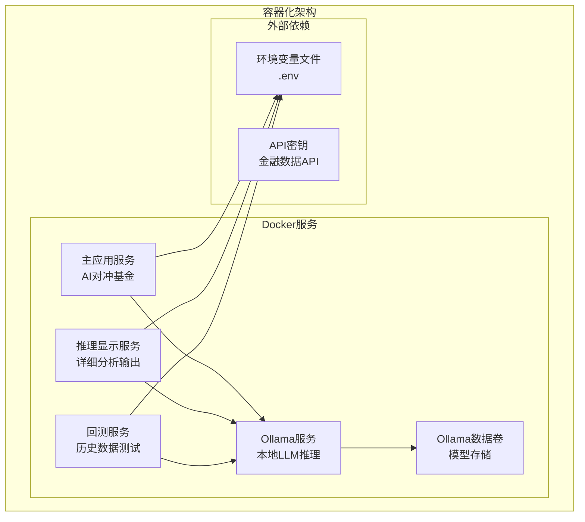
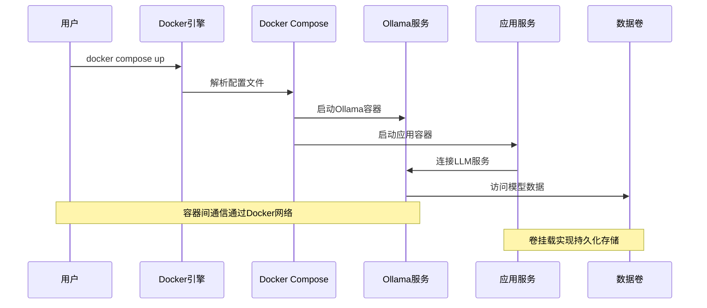
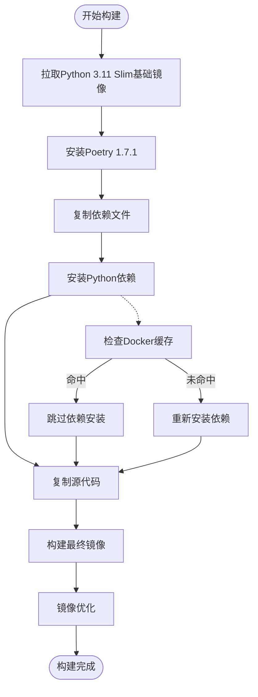
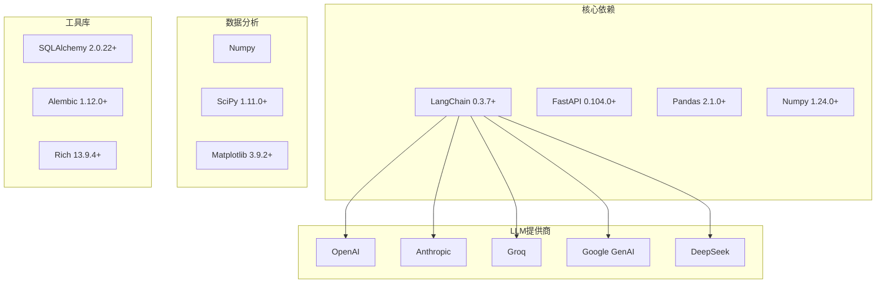
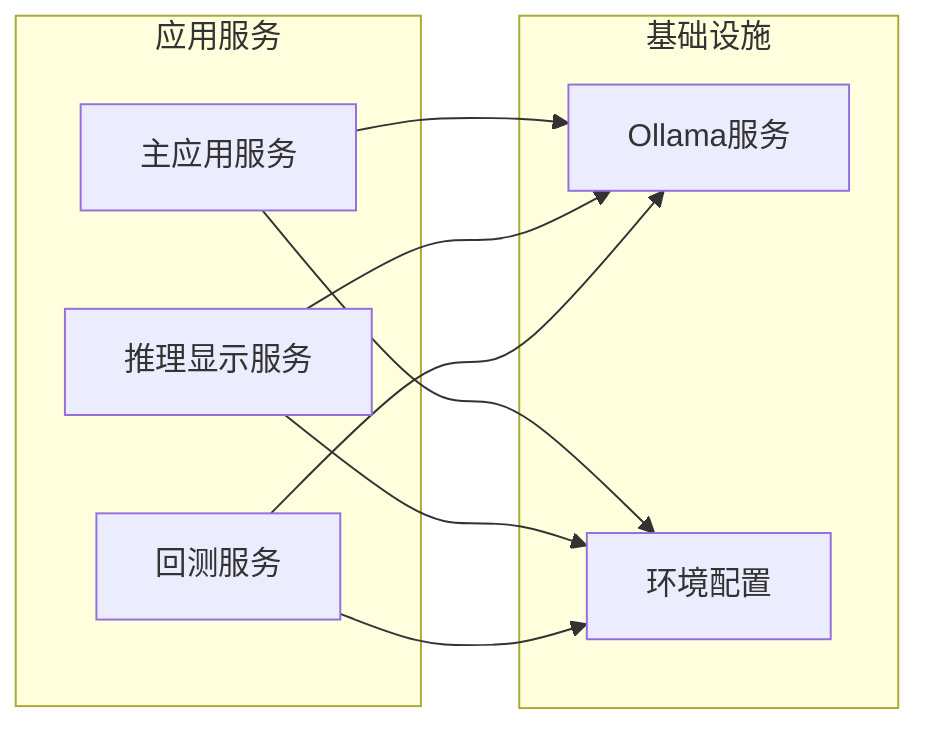

# 容器化部署

<cite>
**本文档引用的文件**
- [Dockerfile](file://docker/Dockerfile)
- [docker-compose.yml](file://docker/docker-compose.yml)
- [.dockerignore](file://docker/.dockerignore)
- [README.md](file://docker/README.md)
- [run.sh](file://docker/run.sh)
- [run.bat](file://docker/run.bat)
- [pyproject.toml](file://pyproject.toml)
- [main.py](file://src/main.py)
- [backtester.py](file://src/backtester.py)
- [app/backend/main.py](file://app/backend/main.py)
</cite>

## 目录
1. [简介](#简介)
2. [项目结构](#项目结构)
3. [核心组件](#核心组件)
4. [架构概览](#架构概览)
5. [详细组件分析](#详细组件分析)
6. [依赖关系分析](#依赖关系分析)
7. [性能考虑](#性能考虑)
8. [故障排除指南](#故障排除指南)
9. [结论](#结论)
10. [附录](#附录)

## 简介

本指南提供了AI对冲基金项目的完整容器化部署解决方案。该系统采用Docker技术实现现代化的应用程序打包和部署，支持多种运行模式：命令行界面、Web应用程序以及回测功能。项目集成了多个AI代理，包括估值专家、技术分析专家、风险管理和投资组合管理等模块。

该容器化方案支持：
- 多阶段构建优化
- 本地LLM推理（通过Ollama）
- Docker Compose服务编排
- 环境变量管理
- 健康检查和资源限制
- 日志收集和监控

## 项目结构

AI对冲基金项目采用分层架构设计，主要包含以下组件：

**图表来源**
- [docker-compose.yml:1-95](file://docker/docker-compose.yml#L1-L95)
- [Dockerfile:1-23](file://docker/Dockerfile#L1-L23)

**章节来源**
- [docker-compose.yml:1-95](file://docker/docker-compose.yml#L1-L95)
- [Dockerfile:1-23](file://docker/Dockerfile#L1-L23)

## 核心组件

### Dockerfile构建配置

项目使用Python 3.11 Slim作为基础镜像，实现了高效的多阶段构建策略：

**基础镜像选择**
- 使用轻量级Python 3.11 Slim镜像减少镜像大小
- 预装Poetry包管理工具（版本1.7.1）

**依赖管理策略**
- 分离依赖安装和代码复制步骤以优化Docker缓存
- 使用Poetry进行Python依赖管理，避免虚拟环境创建
- 支持多种LLM提供商（OpenAI、Anthropic、Groq等）

**工作目录和环境配置**
- 设置工作目录为/app
- 配置PYTHONPATH指向应用目录
- 默认CMD指向主入口点

**章节来源**
- [Dockerfile:1-23](file://docker/Dockerfile#L1-L23)
- [pyproject.toml:13-41](file://pyproject.toml#L13-L41)

### Docker Compose服务编排

项目定义了多个Docker Compose服务，每个服务针对特定的使用场景：

**Ollama服务配置**
- 使用官方Ollama镜像
- 暴露11434端口用于LLM推理
- 配置Apple Silicon GPU加速
- 使用独立卷存储模型数据

**应用服务变体**
- 主应用服务：标准AI对冲基金执行
- 推理显示服务：包含详细分析输出
- 回测服务：历史数据回测功能
- Ollama集成服务：本地LLM推理支持

**环境变量管理**
- 统一的环境变量配置
- 支持外部Ollama实例连接
- Python缓冲区配置

**章节来源**
- [docker-compose.yml:18-95](file://docker/docker-compose.yml#L18-L95)

## 架构概览

AI对冲基金的容器化架构采用微服务设计理念，将不同功能模块分离为独立的服务：

**图表来源**
- [docker-compose.yml:1-95](file://docker/docker-compose.yml#L1-L95)
- [run.sh:237-362](file://docker/run.sh#L237-L362)

### 网络配置

Docker Compose自动创建专用网络，允许服务间通过服务名称进行通信：

- Ollama服务可通过`http://ollama:11434`访问
- 应用服务可直接连接本地或外部Ollama实例
- 端口映射仅在需要外部访问时启用

### 卷挂载策略

项目采用多种卷挂载方式确保数据持久化和配置灵活性：

- 环境变量文件挂载：`.env`文件的实时更新
- Ollama数据卷：模型文件的持久化存储
- 开发模式下的代码热重载

**章节来源**
- [docker-compose.yml:23-24](file://docker/docker-compose.yml#L23-L24)
- [docker-compose.yml:12-13](file://docker/docker-compose.yml#L12-L13)

## 详细组件分析

### 多阶段构建策略

项目实现了高效的多阶段构建流程，优化了镜像大小和构建时间：

**图表来源**
- [Dockerfile:8-19](file://docker/Dockerfile#L8-L19)

**构建优化特性**：
- 依赖安装与代码复制分离，最大化缓存利用率
- Poetry配置禁用虚拟环境，减少镜像大小
- 使用slim基础镜像降低整体体积

**章节来源**
- [Dockerfile:8-19](file://docker/Dockerfile#L8-L19)

### 镜像优化技巧

项目采用了多项镜像优化技术：

**缓存利用策略**
- 依赖文件变更触发重新安装，源代码变更不触发依赖重装
- Poetry配置优化安装过程
- .dockerignore文件排除不必要的文件

**镜像大小控制**
- Python Slim基础镜像
- 最小化安装的系统包
- 只包含运行时必需的依赖

**章节来源**
- [.dockerignore:1-28](file://docker/.dockerignore#L1-L28)
- [Dockerfile:15-16](file://docker/Dockerfile#L15-L16)

### 环境变量和配置管理

项目提供了灵活的环境变量管理机制：

**配置文件处理**
- 自动检测和创建.env文件
- 支持多种API提供商的密钥配置
- 运行时环境变量覆盖

**服务间配置共享**
- 统一的OLLAMA_BASE_URL配置
- Python路径和缓冲区配置
- 环境变量的容器内传递

**章节来源**
- [docker-compose.yml:26-29](file://docker/docker-compose.yml#L26-L29)
- [docker/run.sh:244-254](file://docker/run.sh#L244-L254)

## 依赖关系分析

### Python依赖管理

项目使用Poetry进行依赖管理，支持多种AI和金融相关的库：

**图表来源**
- [pyproject.toml:13-41](file://pyproject.toml#L13-L41)

### 服务间依赖关系

容器化架构中的服务依赖关系清晰明确：

**图表来源**
- [docker-compose.yml:18-95](file://docker/docker-compose.yml#L18-L95)

**章节来源**
- [pyproject.toml:13-41](file://pyproject.toml#L13-L41)
- [docker-compose.yml:18-95](file://docker/docker-compose.yml#L18-L95)

## 性能考虑

### 构建性能优化

项目在构建过程中采用了多项性能优化措施：

**缓存策略**
- 依赖安装步骤的智能缓存
- Poetry安装过程的优化配置
- 分层构建减少重复工作

**镜像大小优化**
- Python Slim基础镜像的选择
- 最小化安装包的策略
- 无虚拟环境的依赖管理

### 运行时性能

**内存和CPU使用**
- Python进程的内存优化
- LLM推理的异步处理
- 数据库连接池管理

**网络性能**
- Ollama服务的本地访问优化
- API调用的超时和重试机制
- 缓存策略减少重复计算

## 故障排除指南

### 常见问题诊断

**Docker构建失败**
- 检查网络连接和镜像仓库可达性
- 验证Docker版本兼容性
- 确认磁盘空间充足

**容器启动异常**
- 查看容器日志获取详细错误信息
- 检查端口冲突情况
- 验证环境变量配置正确性

**Ollama集成问题**
- 确认Ollama服务正常运行
- 检查模型下载状态
- 验证网络连接和防火墙设置

### 调试工具和方法

**日志收集**
- 使用`docker compose logs`查看服务日志
- 实时监控容器状态变化
- 分析错误堆栈信息

**性能监控**
- 监控容器资源使用情况
- 分析Python进程的内存占用
- 跟踪LLM推理的响应时间

**章节来源**
- [docker/run.sh:136-147](file://docker/run.sh#L136-L147)
- [docker/run.bat:179-191](file://docker/run.bat#L179-L191)

## 结论

AI对冲基金项目的容器化部署方案提供了完整的现代化应用打包和部署解决方案。通过精心设计的Dockerfile、Docker Compose配置和服务编排，项目实现了：

- **高效构建**：多阶段构建和缓存优化
- **灵活部署**：支持多种运行模式和配置选项
- **可靠运行**：完善的健康检查和错误处理
- **易于维护**：清晰的依赖管理和配置分离

该方案为开发者提供了从本地开发到生产部署的一站式容器化解决方案，支持AI驱动的金融应用的现代化部署需求。

## 附录

### 标准操作流程

**容器启动流程**
1. 确保Docker和Docker Compose已安装
2. 在docker目录下执行`./run.sh compose`或`run.bat compose`
3. 等待Ollama和应用服务启动完成
4. 访问相应的服务端点

**容器停止流程**
1. 使用Ctrl+C停止前台运行的服务
2. 或者执行`docker compose down`停止所有服务
3. 清理临时文件和日志

**容器重启流程**
1. 执行`docker compose restart [服务名]`
2. 或者先down再up相应服务
3. 验证服务状态和日志

### 健康检查配置

项目支持多种健康检查机制：

- **Ollama服务健康检查**：通过API版本端点验证
- **应用服务健康检查**：通过HTTP端点检查
- **数据库连接检查**：验证SQLite数据库可用性

### 资源限制配置

建议在生产环境中添加资源限制：

- **内存限制**：防止内存泄漏导致的系统不稳定
- **CPU配额**：确保公平的CPU资源分配
- **文件描述符限制**：支持高并发请求处理